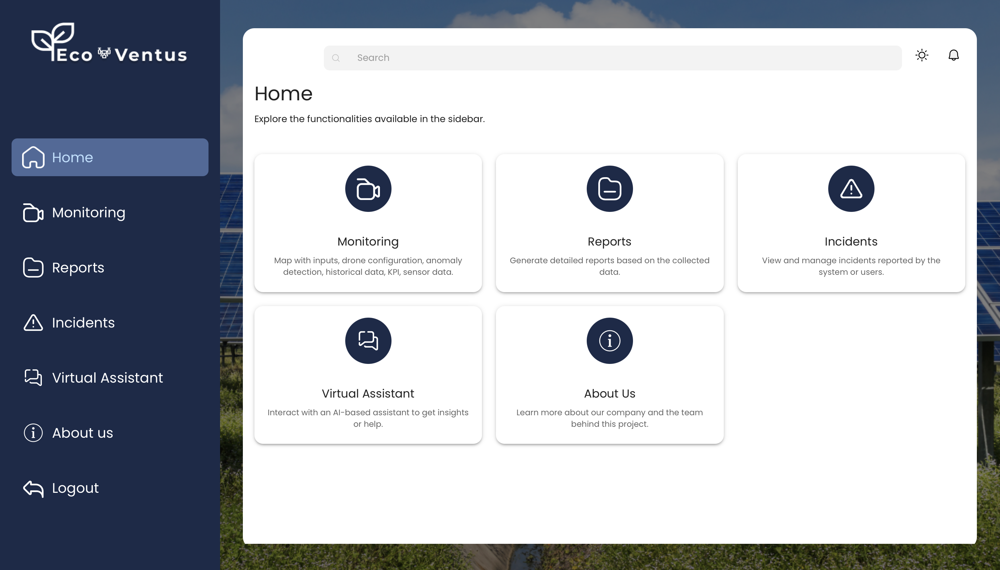
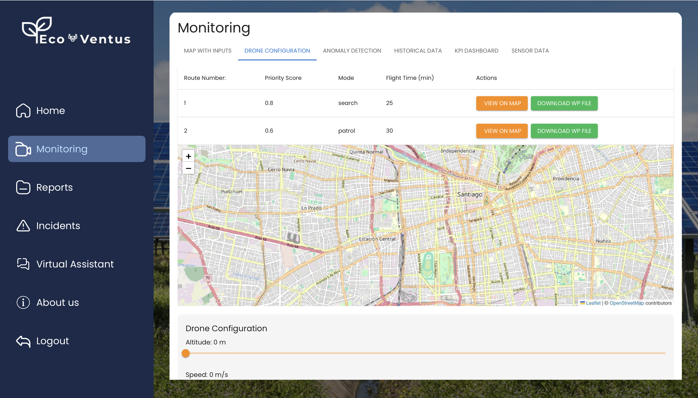

# ✨ Azul Grisel Ramirez Kuri — Portfolio & Site Guide

Welcome to my portfolio. This README combines a **technical overview** (how the site is built) with a **visual showcase** of my projects.  
Quick access:

- ▶️ **Home:** [`index.html`](index.html)
- 🧪 **Projects:** [`projects.html`](projects.html)
- 🎬 **Tech & Media:** [`tech.html`](tech.html)
- 📄 **Resume:** [`resume.html`](resume.html)

---

## 🌐 Live Site

- Website: https://www.azulrk.com
- Shopify Store: https://shop.azulrk.com

---

## 📈 Analytics (GA4)

I use GA4 to measure portfolio engagement and outbound navigation to the Shopify store.

- **Portfolio GA4:** enabled via `gtag.js` in the `<head>`
- **Shopify GA4:** configured within Shopify
- **Tracking:** outbound link events (`shop_link_click`) + engagement time events (`engaged_10s`)

> Note: GA Measurement IDs are intentionally not listed here.

---

## 🌟 Projects Snapshot

### 🛍️ AzulRK Shop — Ecommerce Store (Business/Operations)

A production-ready Shopify store with a complete online sales workflow, multi-market setup (Mexico + North America), and Zendrop integration for fulfillment.

**Focus:** Business execution (catalog, variants, product copy, collections, markets, fulfillment, analytics).  
**Stack:** Shopify, Shopify Markets, Zendrop, GA4.

**Link:** https://shop.azulrk.com/?utm_source=portfolio&utm_medium=readme&utm_campaign=shop_featured

---

### 🤖 Inventory — AI-powered Smart Pantry

AI-assisted pantry inventory tool: detects ingredients from images, stores data in Firebase, and suggests recipes using OpenAI.

**Highlights:** image upload/capture, label detection, inventory CRUD, recipe suggestions.  
**Stack:** React, Firebase, Google Cloud Vision API, OpenAI API.

---

### 🌿 EcoVentus — AI-Driven UAV Monitoring Platform

Web platform to plan, monitor, and analyze UAV missions with AI-driven insights and map-based visualization.

**Stack:** Next.js/React, Flask/Node/Python, MongoDB, Leaflet, Huawei Cloud.

  
  

---

### 🎥 Tech & Media

Curated content embeds (YouTube/TikTok) with styled cards and contrast-safe layout.

> TikTok embeds require HTTPS. If you serve the site locally via HTTP you may see mixed-content warnings. In production (GitHub Pages over HTTPS) it’s fine.

---

## 🧩 How It’s Built

Static frontend website (HTML/CSS/JS) with lightweight libraries:

- **Swiper** for carousels in `projects.html`
- **Lottie (optional)** for SVG animations (e.g., Apple animation)
- **No heavy frameworks**; modular CSS per page

---

## 📁 Project Structure

assets/
animations/ # Lottie files (e.g., apple.json)
css/ # base.css, layout.css, components.css + page styles (home/projects/tech/resume)
js/ # page scripts (e.g., index.js, tech.js) + analytics.js
docs/ # CV PDF (if applicable)
images/ # site images
index.html
projects.html
tech.html
resume.html
CNAME # custom domain for GitHub Pages (if applicable)

## 🧩 Tech Stack

- **HTML5** + **CSS3** (page-modular styling)
- **Vanilla JavaScript** (no frameworks)
- **Swiper (CDN)** for carousels in **Projects**
- **Lottie (CDN, optional)** for SVG animations (e.g., `apple.json`)
- **Google Analytics 4 (GA4)** for site analytics

---

## ▶️ Desarrollo local

**Opción 1 (VS Code):**

    •	Extensión Live Server → “Go Live”.

## Features

- **Swiper Carousel**: A dynamic carousel displaying images related to my work and achievements.
- **Navigation**: Easily accessible navigation links to Home, Projects, Contact, and Resume sections.
- **Footer**: Contact information including address, phone number, email, and social media links.

## Technologies Used

- **HTML5**: For structuring the content.
- **CSS3**: For styling the webpage, including responsive design.
- **JavaScript**: For dynamic content and interactions.
- **Swiper**: For the image carousel functionality.
- **Google Analytics**: For tracking website metrics.

## 🧭 Roadmap / Ideas

- Add light/dark theme toggle
- Add detailed case studies
- Add EN/ES switch
- Improve accessibility
- Add microinteractions
- ## Getting Started

To view the webpage, visit: [https://www.azulrk.com](https://www.azulrk.com)

## Dependencies

- \*\* Swiper
- \*\* Google Analytics
- \*\* Contact

For any inquiries, please reach out to me via:

- Email: azularamk@gmail.com
- Phone: (+52) 777-328-92-18
- [Instagram](https://www.instagram.com/azulramk/)
- [LinkedIn](https://www.linkedin.com/in/azul-grisel-ramirez-kuri-7a213018a/)
- [GitHub](https://github.com/AzulRK22)

## License

© Azul Grisel Ramirez Kuri. Design by HTML5 UP.
