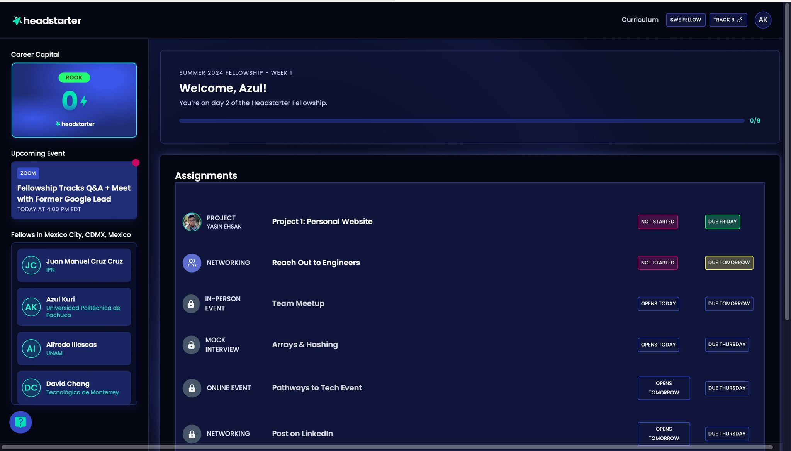

# ✨ Azul Grisel Ramirez Kuri — Portafolio & Guía del Sitio

Bienvenida/o a mi portafolio. Este README mezcla **explicación técnica** (cómo está construido el sitio) con una **presentación visual** de mis proyectos.  
Si quieres ir directo a ver páginas:

- ▶️ **Home:** [`index.html`](index.html)  
- 🧪 **Projects:** [`projects.html`](projects.html)  
- 🎬 **Tech & Media:** [`tech.html`](tech.html)  
- 📄 **Resume:** [`resume.html`](resume.html)

---

## 🌟 Vistazo Rápido a Proyectos

### 🛒 Ecommerce App
Experiencia completa de e-commerce (auth, wishlist, carrito, historial).
  

**Stack:** Android Studio (Kotlin), Figma, GitHub.

---

### 🤖 Fellow AI — HeadStarter
Fellowship de 7 semanas enfocada en proyectos de IA, hackathons y branding.
  

**Incluye:** 5 proyectos de IA, proyecto final +1000 usuarios, coaching y networking.

---

### 🌿 EcoVentus — AI-Driven UAV Monitoring
Plataforma para planear, monitorear y analizar misiones UAV con insights de IA.

  
  

**Stack:** Next.js/React, Flask/Node/Python, MongoDB, Leaflet, Huawei Cloud.

---

### 🎥 Tech & Media
Embeds de contenido (YouTube/TikTok) con contraste y tarjetas estilizadas.

---
Embeds TikTok: usan https. Si sirves el sitio por http verás avisos de consola por protocolo mixto. En producción (GitHub Pages con HTTPS) no afecta.

## 🧩 ¿Cómo está construido?

**Puro Frontend estático** (HTML, CSS, JS) con librerías ligeras:

- **Swiper** para carruseles en `projects.html`.
- **(Opcional) Lottie** para animaciones SVG (p.ej., Apple).  
- **Sin frameworks pesados**; CSS modular por página.

## 📁 Estructura
assets/
animations/      # lotties (apple.json)
css/             # base.css, layout.css, components.css + {home,projects,tech,resume}.css
js/              # index.js, tech.js (scripts por página)
docs/              # CV en PDF
images/            # imágenes del sitio
index.html
projects.html
tech.html
resume.html
CNAME              # dominio para GitHub Pages (si aplica)

## 🧩 Tecnologías

- **HTML5** + **CSS3** (modular por página)
- **JavaScript** vanilla (sin frameworks)
- **Swiper** (CDN) para carruseles en *Projects*
- **Lottie** (CDN) opcional para animaciones SVG (p. ej. `apple.json`)

---

## ▶️ Desarrollo local

**Opción 1 (VS Code):**

	•	Extensión Live Server → “Go Live”.

## Features

- **Swiper Carousel**: A dynamic carousel displaying images related to my work and achievements.
- **Navigation**: Easily accessible navigation links to Home, Projects, Contact, and Resume sections.
- **Footer**: Contact information including address, phone number, email, and social media links.

## Technologies Used

- **HTML5**: For structuring the content.
- **CSS3**: For styling the webpage, including responsive design.
- **JavaScript**: For dynamic content and interactions.
- **Swiper**: For the image carousel functionality.
- **Google Analytics**: For tracking website metrics.

## Getting Started

To view the webpage, visit: [https://www.azulrk.com](https://www.azulrk.com)

## Dependencies
- ** Swiper
- ** Google Analytics
- ** Contact

For any inquiries, please reach out to me via:

- Email: azularamk@gmail.com
- Phone: (+52) 777-328-92-18
- [Instagram](https://www.instagram.com/azulramk/)
- [LinkedIn](https://www.linkedin.com/in/azul-grisel-ramirez-kuri-7a213018a/)
- [GitHub](https://github.com/AzulRK22)

## License

© Azul Grisel Ramirez Kuri. Design by HTML5 UP.
