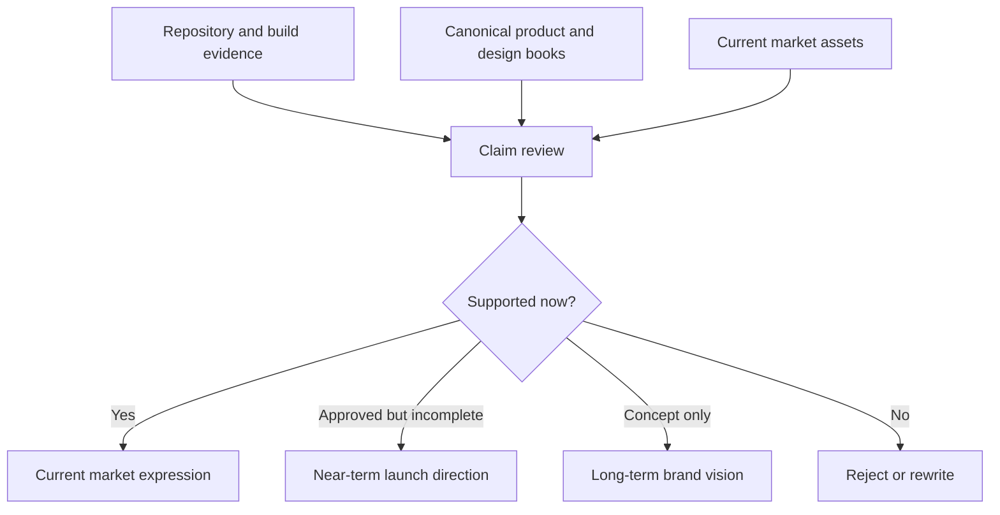

# CloseCut

## Brand, Marketing & Growth System

### The Canonical Market Expression Specification

**Version 1.0**
**Status:** Canonical Working Baseline
**Date:** 13 July 2026
**Classification:** Public Reading Edition

---

# Document Status

This book is the sixth canonical specification in the CloseCut documentation library. It is the controlling source for brand, positioning, public claims, App Store and TestFlight expression, content, community, launch, acquisition, retention communication, marketing analytics, and the future CloseCut Library. It does not override product behavior. When a public asset conflicts with the current build, the build wins and the asset must be corrected.

# Purpose

The purpose of this book is to make CloseCut recognizable and trustworthy without simplifying it into generic startup language. It establishes a market-expression system that can survive new releases, channels, collaborators, and platforms while preserving the product's private, calm, thoughtful identity.

# Audience

This specification is for the product owner, designers, engineers, QA and release owners, App Store operators, marketers, community leads, creators, partners, press contacts, and future collaborators who produce or approve any public CloseCut expression.

# Relationship with the Canonical Library

- **Product Vision & Requirements** defines what CloseCut is and why it exists.
- **Experience Design System** defines how product intent becomes interaction and visual behavior.
- **Engineering Architecture** defines implementation boundaries and current technical structure.
- **Backend, Infrastructure & Security** defines trust, data, privacy, and operational constraints.
- **Quality, Release & Operations** defines evidence required for beta and production readiness.
- **Brand, Marketing & Growth System** translates those truths into public understanding and responsible growth.

# How to Use This Book

Use Parts I-VII to make durable brand decisions. Use Parts VIII-XV to build channel assets. Use Parts XVI-XXIV to operate launches, campaigns, community, acquisition, retention, search, analytics, experimentation, and public relations. Use Parts XXV-XXVII to govern the documentation library, expansion, and brand control. Appendices provide operational matrices and reusable templates.

# Evidence and Claim Model

Every market statement receives one of three labels:

1. **Current Market Expression** - directly supported by the current build and operational state.
2. **Near-Term Launch Direction** - approved work or launch preparation that is not yet generally available.
3. **Long-Term Brand Vision** - directional possibility that must never be presented as current capability.

# Executive Summary

CloseCut should be positioned as **a private entertainment memory and decision-support app**: a calm place to remember what a person watched, preserve why it mattered, understand patterns over time, choose one thoughtful next option, and coordinate selectively with trusted people.

The strongest current proof is not a slogan. It is the implemented system: private entries and personal history, Quick Add, TMDB-backed search, rule-based QuickPick, Want to Watch, Circles, selected sharing, comments and reactions, Watch Together, local Battle modes, Awards & Culture, insights, wraps, and local-first persistence. The most important restraint is equally concrete: CloseCut is not a public review network, streaming service, infinite recommendation feed, opaque AI product, or direct Letterboxd replacement.

The launch strategy is quality-led. The landing page should qualify and educate before sending people to TestFlight. App Store assets must depict the submitted build. Content should create trust through product evidence, thoughtful decisions, and useful context. Community growth should begin with a small cohort of reflective viewers, indie-app supporters, film writers, and product/design peers. Paid acquisition is deferred until activation and retention are validated.

The brand's durable advantage is coherence: private by default, more than ratings, calm expression, restrained character use, real product screens, accessible public assets, honest roadmap language, and privacy-safe measurement.

---

---

# Table of Contents

---

- **Part I - BRAND FOUNDATION**

---

  - 1. Brand Purpose

---

  - 2. Brand Vision

---

  - 3. Brand Mission

---

  - 4. Brand Promise

---

  - 5. Brand Principles

---

  - 6. Brand Values

---

  - 7. Brand Personality

---

  - 8. Emotional Territory

---

  - 9. Brand Experience

---

  - 10. Brand Quality Bar

---

- **Part II - POSITIONING**

---

  - 11. Market Context

---

  - 12. Category Definition

---

  - 13. Product Positioning

---

  - 14. Positioning Statement

---

  - 15. Value Proposition

---

  - 16. Differentiation

---

  - 17. Competitive Framing

---

  - 18. What CloseCut Is

---

  - 19. What CloseCut Is Not

---

  - 20. Reasons to Believe

---

  - 21. Positioning Risks

---

  - 22. Category Evolution

---

- **Part III - AUDIENCE STRATEGY**

---

  - 23. Audience Philosophy

---

  - 24. Primary Audience

---

  - 25. Secondary Audiences

---

  - 26. Early TestFlight Audience

---

  - 27. Movie and Series Enthusiasts

---

  - 28. Private Journal Users

---

  - 29. Decision-Fatigued Viewers

---

  - 30. Existing Tracker Users

---

  - 31. Indie App Community

---

  - 32. iOS and Product Community

---

  - 33. Creators and Reviewers

---

  - 34. Press and Media

---

  - 35. Partners and Communities

---

  - 36. Audience Exclusions

---

  - 37. Audience Prioritization

---

  - 38. Jobs to Be Done by Audience

---

- **Part IV - MESSAGING SYSTEM**

---

  - 39. Messaging Philosophy

---

  - 40. Core Message

---

  - 41. Messaging Hierarchy

---

  - 42. Brand Narrative

---

  - 43. Product Narrative

---

  - 44. Emotional Narrative

---

  - 45. Functional Narrative

---

  - 46. Trust Narrative

---

  - 47. Privacy Narrative

---

  - 48. QuickPick Narrative

---

  - 49. Personal History Narrative

---

  - 50. Timeline Narrative

---

  - 51. Journal Narrative

---

  - 52. Cinema Experience Narrative

---

  - 53. Circles Narrative

---

  - 54. TestFlight Narrative

---

  - 55. Launch Narrative

---

  - 56. Feature Messaging

---

  - 57. Benefit Messaging

---

  - 58. Proof Points

---

  - 59. Claim Validation

---

  - 60. Forbidden Claims

---

  - 61. Future-Facing Claims

---

- **Part V - VOICE, TONE AND EDITORIAL STYLE**

---

  - 62. Brand Voice

---

  - 63. Tone Principles

---

  - 64. Editorial Personality

---

  - 65. Sentence Style

---

  - 66. Vocabulary

---

  - 67. Naming

---

  - 68. Capitalization

---

  - 69. Punctuation

---

  - 70. Calls to Action

---

  - 71. Microcopy

---

  - 72. Feature Announcements

---

  - 73. Release Notes

---

  - 74. Error and Status Communication

---

  - 75. Privacy Communication

---

  - 76. Support Communication

---

  - 77. Community Communication

---

  - 78. Creator Outreach

---

  - 79. Press Communication

---

  - 80. Voice Anti-Patterns

---

- **Part VI - VISUAL BRAND EXPRESSION**

---

  - 81. Visual Philosophy

---

  - 82. Logo System

---

  - 83. App Icon

---

  - 84. Character System

---

  - 85. Color System

---

  - 86. Typography

---

  - 87. Layout

---

  - 88. Spacing

---

  - 89. Grid

---

  - 90. Glow and Light

---

  - 91. Illustration

---

  - 92. Photography

---

  - 93. Screenshots

---

  - 94. Device Mockups

---

  - 95. Motion

---

  - 96. Video

---

  - 97. Social Templates

---

  - 98. Campaign Templates

---

  - 99. Accessibility

---

  - 100. Visual Anti-Patterns

---

- **Part VII - CHARACTER AND MASCOT SYSTEM**

---

  - 101. Character Purpose

---

  - 102. Character Personality

---

  - 103. Character Meaning

---

  - 104. Character Expressions

---

  - 105. Character Poses

---

  - 106. Character Contexts

---

  - 107. Character Usage in Product

---

  - 108. Character Usage in Marketing

---

  - 109. Character Usage in Launches

---

  - 110. Character Usage in Social Media

---

  - 111. Character Usage in App Store Assets

---

  - 112. Character Motion

---

  - 113. Character Accessibility

---

  - 114. Character Restrictions

---

  - 115. Character Evolution

---

- **Part VIII - WEBSITE AND LANDING PAGE**

---

  - 116. Website Role

---

  - 117. Landing Page Strategy

---

  - 118. Information Architecture

---

  - 119. Hero Section

---

  - 120. Product Explanation

---

  - 121. Feature Presentation

---

  - 122. Trust and Privacy

---

  - 123. TestFlight Conversion

---

  - 124. Screenshots and Product Media

---

  - 125. Social Proof

---

  - 126. FAQ

---

  - 127. Support

---

  - 128. Privacy

---

  - 129. Terms

---

  - 130. SEO Structure

---

  - 131. Performance

---

  - 132. Accessibility

---

  - 133. Analytics

---

  - 134. Conversion Measurement

---

  - 135. Future Marketing Site

---

  - 136. CloseCut Library Integration

---

- **Part IX - APP STORE SYSTEM**

---

  - 137. App Store Strategy

---

  - 138. App Name

---

  - 139. Subtitle

---

  - 140. Promotional Text

---

  - 141. Description

---

  - 142. Keywords

---

  - 143. Category

---

  - 144. Screenshots

---

  - 145. App Preview

---

  - 146. Icon

---

  - 147. Privacy Labels

---

  - 148. Age Rating

---

  - 149. Support URL

---

  - 150. Marketing URL

---

  - 151. Review Notes

---

  - 152. Version Updates

---

  - 153. Localization

---

  - 154. ASO

---

  - 155. Ratings and Reviews

---

  - 156. App Store Experimentation

---

  - 157. App Store Release Campaigns

---

- **Part X - TESTFLIGHT MARKETING**

---

  - 158. TestFlight Role

---

  - 159. Tester Positioning

---

  - 160. Public Link Strategy

---

  - 161. Tester Qualification

---

  - 162. Tester Recruitment

---

  - 163. Tester Onboarding

---

  - 164. What to Test

---

  - 165. Beta Communication

---

  - 166. Feedback Requests

---

  - 167. Tester Retention

---

  - 168. Build Updates

---

  - 169. Beta Release Notes

---

  - 170. Tester Recognition

---

  - 171. TestFlight Metrics

---

  - 172. Public Beta Risks

---

  - 173. Beta Exit Communication

---

- **Part XI - SOCIAL MEDIA SYSTEM**

---

  - 174. Social Media Philosophy

---

  - 175. Channel Roles

---

  - 176. Instagram

---

  - 177. X

---

  - 178. Threads

---

  - 179. LinkedIn

---

  - 180. TikTok

---

  - 181. YouTube

---

  - 182. Product Hunt

---

  - 183. Reddit

---

  - 184. Indie Communities

---

  - 185. Film Communities

---

  - 186. Developer Communities

---

  - 187. Social Profile Standards

---

  - 188. Bios

---

  - 189. Links

---

  - 190. Highlights

---

  - 191. Pinned Content

---

  - 192. Community Replies

---

  - 193. Direct Messages

---

  - 194. Moderation

---

  - 195. Social Accessibility

---

- **Part XII - CONTENT SYSTEM**

---

  - 196. Content Philosophy

---

  - 197. Content Pillars

---

  - 198. Product Content

---

  - 199. Build-in-Public Content

---

  - 200. Film and Memory Content

---

  - 201. Community Content

---

  - 202. Educational Content

---

  - 203. Founder Content

---

  - 204. Behind-the-Scenes Content

---

  - 205. Product Decision Content

---

  - 206. Tester Feedback Content

---

  - 207. Release Content

---

  - 208. Milestone Content

---

  - 209. Editorial Calendar

---

  - 210. Content Cadence

---

  - 211. Repurposing

---

  - 212. Content Approval

---

  - 213. Content Accessibility

---

  - 214. Content Measurement

---

  - 215. Content Anti-Patterns

---

- **Part XIII - INSTAGRAM SYSTEM**

---

  - 216. Instagram Role

---

  - 217. Profile Structure

---

  - 218. Grid Strategy

---

  - 219. Post Types

---

  - 220. Carousels

---

  - 221. Reels

---

  - 222. Stories

---

  - 223. Highlights

---

  - 224. Launch Posts

---

  - 225. Feature Posts

---

  - 226. TestFlight Posts

---

  - 227. Community Posts

---

  - 228. Build-in-Public Posts

---

  - 229. Visual Consistency

---

  - 230. Caption System

---

  - 231. Hashtags

---

  - 232. Alt Text

---

  - 233. Calls to Action

---

  - 234. Posting Cadence

---

  - 235. Instagram Metrics

---

  - 236. Instagram Growth

---

- **Part XIV - X SYSTEM**

---

  - 237. X Role

---

  - 238. Profile Structure

---

  - 239. Pinned Post

---

  - 240. Product Announcements

---

  - 241. Build-in-Public Threads

---

  - 242. Engineering Content

---

  - 243. Product Decisions

---

  - 244. Tester Recruitment

---

  - 245. Community Participation

---

  - 246. Replies

---

  - 247. Quotes

---

  - 248. Visual Assets

---

  - 249. Link Strategy

---

  - 250. Posting Cadence

---

  - 251. X Metrics

---

  - 252. X Growth

---

- **Part XV - LINKEDIN AND PROFESSIONAL PRESENCE**

---

  - 253. LinkedIn Role

---

  - 254. Founder Profile

---

  - 255. Product Page

---

  - 256. Product Milestones

---

  - 257. Engineering Storytelling

---

  - 258. Design Storytelling

---

  - 259. Product Case Studies

---

  - 260. TestFlight Communication

---

  - 261. App Store Launch

---

  - 262. Career Positioning

---

  - 263. Professional Credibility

---

  - 264. Conference and Award Opportunities

---

  - 265. LinkedIn Metrics

---

- **Part XVI - LAUNCH SYSTEM**

---

  - 266. Launch Philosophy

---

  - 267. Launch Readiness

---

  - 268. TestFlight Launch

---

  - 269. Public Beta Launch

---

  - 270. App Store Launch

---

  - 271. Soft Launch

---

  - 272. Full Launch

---

  - 273. Launch Narrative

---

  - 274. Launch Assets

---

  - 275. Launch Channels

---

  - 276. Launch Timeline

---

  - 277. Launch Roles

---

  - 278. Launch Checklist

---

  - 279. Launch Metrics

---

  - 280. Launch Risks

---

  - 281. Launch Retrospective

---

- **Part XVII - CAMPAIGN SYSTEM**

---

  - 282. Campaign Philosophy

---

  - 283. Campaign Architecture

---

  - 284. Campaign Brief

---

  - 285. Audience

---

  - 286. Goal

---

  - 287. Message

---

  - 288. Creative Direction

---

  - 289. Asset System

---

  - 290. Channel Mix

---

  - 291. Calls to Action

---

  - 292. Measurement

---

  - 293. Experimentation

---

  - 294. Feature Campaigns

---

  - 295. Update Campaigns

---

  - 296. Seasonal Campaigns

---

  - 297. Milestone Campaigns

---

  - 298. Community Campaigns

---

  - 299. Partnership Campaigns

---

  - 300. Campaign Retrospectives

---

- **Part XVIII - COMMUNITY AND PARTNERSHIPS**

---

  - 301. Community Philosophy

---

  - 302. Early User Community

---

  - 303. Tester Community

---

  - 304. Film Communities

---

  - 305. Indie Developer Community

---

  - 306. Product Design Community

---

  - 307. Creator Partnerships

---

  - 308. Micro-Creators

---

  - 309. Film Writers

---

  - 310. Newsletter Partnerships

---

  - 311. Podcast Opportunities

---

  - 312. Conference Opportunities

---

  - 313. Ambassador Programs

---

  - 314. Referral Programs

---

  - 315. Community Recognition

---

  - 316. Community Safety

---

  - 317. Community Metrics

---

- **Part XIX - ACQUISITION AND CONVERSION**

---

  - 318. Acquisition Philosophy

---

  - 319. Acquisition Funnel

---

  - 320. Awareness

---

  - 321. Interest

---

  - 322. Landing Page Conversion

---

  - 323. TestFlight Conversion

---

  - 324. App Store Conversion

---

  - 325. Activation

---

  - 326. Retention

---

  - 327. Referral

---

  - 328. Organic Acquisition

---

  - 329. Community Acquisition

---

  - 330. Creator Acquisition

---

  - 331. Search Acquisition

---

  - 332. Paid Acquisition

---

  - 333. Acquisition Priorities

---

  - 334. Conversion Measurement

---

  - 335. Conversion Optimization

---

  - 336. Growth Risks

---

- **Part XX - RETENTION COMMUNICATION**

---

  - 337. Retention Philosophy

---

  - 338. Return Moments

---

  - 339. Product Updates

---

  - 340. Release Notes

---

  - 341. Email Communication

---

  - 342. Push Communication

---

  - 343. In-App Communication

---

  - 344. TestFlight Communication

---

  - 345. Re-Engagement

---

  - 346. Memory Resurfacing

---

  - 347. QuickPick Return Moments

---

  - 348. Cinema Return Moments

---

  - 349. Community Return Moments

---

  - 350. Retention Ethics

---

  - 351. Retention Metrics

---

- **Part XXI - SEO AND ASO**

---

  - 352. Search Strategy

---

  - 353. SEO Positioning

---

  - 354. Keyword Research

---

  - 355. Search Intent

---

  - 356. Landing Page SEO

---

  - 357. Technical SEO

---

  - 358. Structured Data

---

  - 359. Content SEO

---

  - 360. App Store Search

---

  - 361. ASO Keywords

---

  - 362. ASO Conversion

---

  - 363. Localization

---

  - 364. Search Measurement

---

  - 365. Search Risks

---

- **Part XXII - MARKETING ANALYTICS**

---

  - 366. Analytics Philosophy

---

  - 367. Privacy-Safe Measurement

---

  - 368. Marketing Metrics

---

  - 369. Channel Metrics

---

  - 370. Funnel Metrics

---

  - 371. Conversion Metrics

---

  - 372. Activation Metrics

---

  - 373. Retention Metrics

---

  - 374. Content Metrics

---

  - 375. Community Metrics

---

  - 376. App Store Metrics

---

  - 377. TestFlight Metrics

---

  - 378. Attribution

---

  - 379. Dashboards

---

  - 380. Reporting

---

  - 381. Decision-Making

---

  - 382. Metric Anti-Patterns

---

- **Part XXIII - EXPERIMENTATION**

---

  - 383. Experimentation Philosophy

---

  - 384. Hypotheses

---

  - 385. Experiment Design

---

  - 386. Message Testing

---

  - 387. Visual Testing

---

  - 388. Landing Page Testing

---

  - 389. App Store Testing

---

  - 390. Social Content Testing

---

  - 391. Channel Testing

---

  - 392. Audience Testing

---

  - 393. Conversion Testing

---

  - 394. Statistical Caution

---

  - 395. Ethical Experimentation

---

  - 396. Experiment Documentation

---

  - 397. Experiment Decisions

---

- **Part XXIV - PRESS AND PUBLIC RELATIONS**

---

  - 398. PR Philosophy

---

  - 399. Press Narrative

---

  - 400. Founder Story

---

  - 401. Product Story

---

  - 402. Design Story

---

  - 403. Engineering Story

---

  - 404. Privacy Story

---

  - 405. Press Kit

---

  - 406. Media Assets

---

  - 407. Press Outreach

---

  - 408. Reviewers

---

  - 409. Embargoes

---

  - 410. Launch Coverage

---

  - 411. Awards

---

  - 412. App Store Editorial

---

  - 413. Apple Design Recognition

---

  - 414. Crisis Communication

---

- **Part XXV - CLOSECUT LIBRARY**

---

  - 415. Library Purpose

---

  - 416. Library Audience

---

  - 417. Book Collection

---

  - 418. Information Architecture

---

  - 419. Book Covers

---

  - 420. Interactive Reading

---

  - 421. Page-Turn Experience

---

  - 422. Motion

---

  - 423. Search

---

  - 424. Cross-References

---

  - 425. Version History

---

  - 426. PDF Downloads

---

  - 427. Accessibility

---

  - 428. Performance

---

  - 429. SEO

---

  - 430. Next.js Architecture

---

  - 431. Figma Workflow

---

  - 432. Content Pipeline

---

  - 433. Public and Private Documents

---

  - 434. Library Governance

---

- **Part XXVI - FUTURE BRAND EXPANSION**

---

  - 435. Android Launch

---

  - 436. Widgets

---

  - 437. Apple Watch

---

  - 438. Vision Pro

---

  - 439. Cinema Partnerships

---

  - 440. Creator Ecosystem

---

  - 441. Taste DNA Campaigns

---

  - 442. Cinema Intelligence Campaigns

---

  - 443. International Expansion

---

  - 444. Localization Strategy

---

  - 445. Cultural Adaptation

---

  - 446. Brand Architecture

---

  - 447. Sub-Brands

---

  - 448. Partnerships

---

  - 449. Merchandising

---

  - 450. Future Media Formats

---

- **Part XXVII - BRAND GOVERNANCE**

---

  - 451. Brand Ownership

---

  - 452. Marketing Ownership

---

  - 453. Content Ownership

---

  - 454. Approval Process

---

  - 455. Asset Management

---

  - 456. Versioning

---

  - 457. Naming Governance

---

  - 458. Claim Governance

---

  - 459. Visual Governance

---

  - 460. Channel Governance

---

  - 461. Partner Governance

---

  - 462. Crisis Governance

---

  - 463. Brand Review Process

---

  - 464. Deprecation Policy

---

  - 465. Brand Decision Records

---

---

---

# PART I - BRAND FOUNDATION

# 1. Brand Purpose

**Purpose.** This chapter defines how **Brand Purpose** operates inside the brand foundation system. Its purpose is to remove ambiguity, preserve product truth, and make execution consistent across owners and channels.

**Current state.** The chapter governs current market expression first, near-term launch direction second, and long-term brand vision only when explicitly labeled.

**Strategic intent.** The strategic intent is to convert product value into understandable evidence, not louder language. CloseCut should earn attention through specificity: real product screens, clear explanations, reversible commitments, and a visible distinction between what exists now and what is being explored.

**Requirements.**
- Map every public statement to current product evidence or label it as future direction.
- Keep one primary message per surface.
- Use privacy, calmness, and personal ownership as operating constraints, not decorative themes.
- Review the chapter whenever a build, channel, or audience assumption changes.

**Acceptance criteria.** The surface has one clear audience, one primary message, one primary action, an evidence owner, an accessibility check, and a status label where future direction appears. A reviewer can trace every factual claim to the current repository, a canonical book, or a dated market asset.

**Measurement.** Measure message comprehension; claim accuracy; qualified conversion; retained user value. Metrics are diagnostic signals, not substitutes for qualitative product judgment.

**Anti-patterns.** Avoid feature dumping; hype replacing explanation; confusing strategic intent with implementation; optimizing reach at the expense of trust.

**Example.** **Approved expression:** describe brand purpose through a concrete user outcome and show the supporting product evidence. **Rejected expression:** imply that CloseCut delivers a broader, automatic, social, or intelligent capability than the current build proves.

# 2. Brand Vision

**Purpose.** This chapter defines how **Brand Vision** operates inside the brand foundation system. Its purpose is to remove ambiguity, preserve product truth, and make execution consistent across owners and channels.

**Current state.** The chapter governs current market expression first, near-term launch direction second, and long-term brand vision only when explicitly labeled.

**Strategic intent.** The strategic intent is to convert product value into understandable evidence, not louder language. CloseCut should earn attention through specificity: real product screens, clear explanations, reversible commitments, and a visible distinction between what exists now and what is being explored.

**Requirements.**
- Map every public statement to current product evidence or label it as future direction.
- Keep one primary message per surface.
- Use privacy, calmness, and personal ownership as operating constraints, not decorative themes.
- Review the chapter whenever a build, channel, or audience assumption changes.

**Acceptance criteria.** The surface has one clear audience, one primary message, one primary action, an evidence owner, an accessibility check, and a status label where future direction appears. A reviewer can trace every factual claim to the current repository, a canonical book, or a dated market asset.

**Measurement.** Measure message comprehension; claim accuracy; qualified conversion; retained user value. Metrics are diagnostic signals, not substitutes for qualitative product judgment.

**Anti-patterns.** Avoid feature dumping; hype replacing explanation; confusing strategic intent with implementation; optimizing reach at the expense of trust.

**Example.** **Approved expression:** describe brand vision through a concrete user outcome and show the supporting product evidence. **Rejected expression:** imply that CloseCut delivers a broader, automatic, social, or intelligent capability than the current build proves.

# 3. Brand Mission

**Purpose.** This chapter defines how **Brand Mission** operates inside the brand foundation system. Its purpose is to remove ambiguity, preserve product truth, and make execution consistent across owners and channels.

**Current state.** The chapter governs current market expression first, near-term launch direction second, and long-term brand vision only when explicitly labeled.

**Strategic intent.** The strategic intent is to convert product value into understandable evidence, not louder language. CloseCut should earn attention through specificity: real product screens, clear explanations, reversible commitments, and a visible distinction between what exists now and what is being explored.

**Requirements.**
- Map every public statement to current product evidence or label it as future direction.
- Keep one primary message per surface.
- Use privacy, calmness, and personal ownership as operating constraints, not decorative themes.
- Review the chapter whenever a build, channel, or audience assumption changes.

**Acceptance criteria.** The surface has one clear audience, one primary message, one primary action, an evidence owner, an accessibility check, and a status label where future direction appears. A reviewer can trace every factual claim to the current repository, a canonical book, or a dated market asset.

**Measurement.** Measure message comprehension; claim accuracy; qualified conversion; retained user value. Metrics are diagnostic signals, not substitutes for qualitative product judgment.

**Anti-patterns.** Avoid feature dumping; hype replacing explanation; confusing strategic intent with implementation; optimizing reach at the expense of trust.

**Example.** **Approved expression:** describe brand mission through a concrete user outcome and show the supporting product evidence. **Rejected expression:** imply that CloseCut delivers a broader, automatic, social, or intelligent capability than the current build proves.

# 4. Brand Promise

**Purpose.** This chapter defines how **Brand Promise** operates inside the brand foundation system. Its purpose is to remove ambiguity, preserve product truth, and make execution consistent across owners and channels.

**Current state.** The chapter governs current market expression first, near-term launch direction second, and long-term brand vision only when explicitly labeled.

**Strategic intent.** The strategic intent is to convert product value into understandable evidence, not louder language. CloseCut should earn attention through specificity: real product screens, clear explanations, reversible commitments, and a visible distinction between what exists now and what is being explored.

**Requirements.**
- Map every public statement to current product evidence or label it as future direction.
- Keep one primary message per surface.
- Use privacy, calmness, and personal ownership as operating constraints, not decorative themes.
- Review the chapter whenever a build, channel, or audience assumption changes.

**Acceptance criteria.** The surface has one clear audience, one primary message, one primary action, an evidence owner, an accessibility check, and a status label where future direction appears. A reviewer can trace every factual claim to the current repository, a canonical book, or a dated market asset.

**Measurement.** Measure message comprehension; claim accuracy; qualified conversion; retained user value. Metrics are diagnostic signals, not substitutes for qualitative product judgment.

**Anti-patterns.** Avoid feature dumping; hype replacing explanation; confusing strategic intent with implementation; optimizing reach at the expense of trust.

**Example.** **Approved expression:** describe brand promise through a concrete user outcome and show the supporting product evidence. **Rejected expression:** imply that CloseCut delivers a broader, automatic, social, or intelligent capability than the current build proves.

# 5. Brand Principles

**Purpose.** This chapter defines how **Brand Principles** operates inside the brand foundation system. Its purpose is to remove ambiguity, preserve product truth, and make execution consistent across owners and channels.

**Current state.** The chapter governs current market expression first, near-term launch direction second, and long-term brand vision only when explicitly labeled.

**Strategic intent.** The strategic intent is to convert product value into understandable evidence, not louder language. CloseCut should earn attention through specificity: real product screens, clear explanations, reversible commitments, and a visible distinction between what exists now and what is being explored.

**Requirements.**
- Map every public statement to current product evidence or label it as future direction.
- Keep one primary message per surface.
- Use privacy, calmness, and personal ownership as operating constraints, not decorative themes.
- Review the chapter whenever a build, channel, or audience assumption changes.

**Acceptance criteria.** The surface has one clear audience, one primary message, one primary action, an evidence owner, an accessibility check, and a status label where future direction appears. A reviewer can trace every factual claim to the current repository, a canonical book, or a dated market asset.

**Measurement.** Measure message comprehension; claim accuracy; qualified conversion; retained user value. Metrics are diagnostic signals, not substitutes for qualitative product judgment.

**Anti-patterns.** Avoid feature dumping; hype replacing explanation; confusing strategic intent with implementation; optimizing reach at the expense of trust.

**Example.** **Approved expression:** describe brand principles through a concrete user outcome and show the supporting product evidence. **Rejected expression:** imply that CloseCut delivers a broader, automatic, social, or intelligent capability than the current build proves.

# 6. Brand Values

**Purpose.** This chapter defines how **Brand Values** operates inside the brand foundation system. Its purpose is to remove ambiguity, preserve product truth, and make execution consistent across owners and channels.

**Current state.** The chapter governs current market expression first, near-term launch direction second, and long-term brand vision only when explicitly labeled.

**Strategic intent.** The strategic intent is to convert product value into understandable evidence, not louder language. CloseCut should earn attention through specificity: real product screens, clear explanations, reversible commitments, and a visible distinction between what exists now and what is being explored.

**Requirements.**
- Map every public statement to current product evidence or label it as future direction.
- Keep one primary message per surface.
- Use privacy, calmness, and personal ownership as operating constraints, not decorative themes.
- Review the chapter whenever a build, channel, or audience assumption changes.

**Acceptance criteria.** The surface has one clear audience, one primary message, one primary action, an evidence owner, an accessibility check, and a status label where future direction appears. A reviewer can trace every factual claim to the current repository, a canonical book, or a dated market asset.

**Measurement.** Measure message comprehension; claim accuracy; qualified conversion; retained user value. Metrics are diagnostic signals, not substitutes for qualitative product judgment.

**Anti-patterns.** Avoid feature dumping; hype replacing explanation; confusing strategic intent with implementation; optimizing reach at the expense of trust.

**Example.** **Approved expression:** describe brand values through a concrete user outcome and show the supporting product evidence. **Rejected expression:** imply that CloseCut delivers a broader, automatic, social, or intelligent capability than the current build proves.

# 7. Brand Personality

**Purpose.** This chapter defines how **Brand Personality** operates inside the brand foundation system. Its purpose is to remove ambiguity, preserve product truth, and make execution consistent across owners and channels.

**Current state.** The chapter governs current market expression first, near-term launch direction second, and long-term brand vision only when explicitly labeled.

**Strategic intent.** The strategic intent is to convert product value into understandable evidence, not louder language. CloseCut should earn attention through specificity: real product screens, clear explanations, reversible commitments, and a visible distinction between what exists now and what is being explored.

**Requirements.**
- Map every public statement to current product evidence or label it as future direction.
- Keep one primary message per surface.
- Use privacy, calmness, and personal ownership as operating constraints, not decorative themes.
- Review the chapter whenever a build, channel, or audience assumption changes.

**Acceptance criteria.** The surface has one clear audience, one primary message, one primary action, an evidence owner, an accessibility check, and a status label where future direction appears. A reviewer can trace every factual claim to the current repository, a canonical book, or a dated market asset.

**Measurement.** Measure message comprehension; claim accuracy; qualified conversion; retained user value. Metrics are diagnostic signals, not substitutes for qualitative product judgment.

**Anti-patterns.** Avoid feature dumping; hype replacing explanation; confusing strategic intent with implementation; optimizing reach at the expense of trust.

**Example.** **Approved expression:** describe brand personality through a concrete user outcome and show the supporting product evidence. **Rejected expression:** imply that CloseCut delivers a broader, automatic, social, or intelligent capability than the current build proves.

# 8. Emotional Territory

**Purpose.** This chapter defines how **Emotional Territory** operates inside the brand foundation system. Its purpose is to remove ambiguity, preserve product truth, and make execution consistent across owners and channels.

**Current state.** The chapter governs current market expression first, near-term launch direction second, and long-term brand vision only when explicitly labeled.

**Strategic intent.** The strategic intent is to convert product value into understandable evidence, not louder language. CloseCut should earn attention through specificity: real product screens, clear explanations, reversible commitments, and a visible distinction between what exists now and what is being explored.

**Requirements.**
- Use product screens as the primary proof surface.
- Preserve the dark, cinematic, calm visual language without sacrificing contrast or legibility.
- Use glow as atmosphere, never as a substitute for hierarchy.
- Keep the character secondary to product meaning and never use it to trivialize privacy, errors, or account actions.

**Acceptance criteria.** The surface has one clear audience, one primary message, one primary action, an evidence owner, an accessibility check, and a status label where future direction appears. A reviewer can trace every factual claim to the current repository, a canonical book, or a dated market asset.

**Measurement.** Measure WCAG-aligned contrast review; asset consistency score; screenshot-to-build accuracy; legibility at platform crop sizes. Metrics are diagnostic signals, not substitutes for qualitative product judgment.

**Anti-patterns.** Avoid decorative density; unverifiable mockups; tiny text inside screenshots; mascot overuse.

**Example.** **Approved expression:** describe emotional territory through a concrete user outcome and show the supporting product evidence. **Rejected expression:** imply that CloseCut delivers a broader, automatic, social, or intelligent capability than the current build proves.

# 9. Brand Experience

**Purpose.** This chapter defines how **Brand Experience** operates inside the brand foundation system. Its purpose is to remove ambiguity, preserve product truth, and make execution consistent across owners and channels.

**Current state.** The chapter governs current market expression first, near-term launch direction second, and long-term brand vision only when explicitly labeled.

**Strategic intent.** The strategic intent is to convert product value into understandable evidence, not louder language. CloseCut should earn attention through specificity: real product screens, clear explanations, reversible commitments, and a visible distinction between what exists now and what is being explored.

**Requirements.**
- Map every public statement to current product evidence or label it as future direction.
- Keep one primary message per surface.
- Use privacy, calmness, and personal ownership as operating constraints, not decorative themes.
- Review the chapter whenever a build, channel, or audience assumption changes.

**Acceptance criteria.** The surface has one clear audience, one primary message, one primary action, an evidence owner, an accessibility check, and a status label where future direction appears. A reviewer can trace every factual claim to the current repository, a canonical book, or a dated market asset.

**Measurement.** Measure message comprehension; claim accuracy; qualified conversion; retained user value. Metrics are diagnostic signals, not substitutes for qualitative product judgment.

**Anti-patterns.** Avoid feature dumping; hype replacing explanation; confusing strategic intent with implementation; optimizing reach at the expense of trust.

**Example.** **Approved expression:** describe brand experience through a concrete user outcome and show the supporting product evidence. **Rejected expression:** imply that CloseCut delivers a broader, automatic, social, or intelligent capability than the current build proves.

# 10. Brand Quality Bar

**Purpose.** This chapter defines how **Brand Quality Bar** operates inside the brand foundation system. Its purpose is to remove ambiguity, preserve product truth, and make execution consistent across owners and channels.

**Current state.** The chapter governs current market expression first, near-term launch direction second, and long-term brand vision only when explicitly labeled.

**Strategic intent.** The strategic intent is to convert product value into understandable evidence, not louder language. CloseCut should earn attention through specificity: real product screens, clear explanations, reversible commitments, and a visible distinction between what exists now and what is being explored.

**Requirements.**
- Map every public statement to current product evidence or label it as future direction.
- Keep one primary message per surface.
- Use privacy, calmness, and personal ownership as operating constraints, not decorative themes.
- Review the chapter whenever a build, channel, or audience assumption changes.

**Acceptance criteria.** The surface has one clear audience, one primary message, one primary action, an evidence owner, an accessibility check, and a status label where future direction appears. A reviewer can trace every factual claim to the current repository, a canonical book, or a dated market asset.

**Measurement.** Measure message comprehension; claim accuracy; qualified conversion; retained user value. Metrics are diagnostic signals, not substitutes for qualitative product judgment.

**Anti-patterns.** Avoid feature dumping; hype replacing explanation; confusing strategic intent with implementation; optimizing reach at the expense of trust.

**Example.** **Approved expression:** describe brand quality bar through a concrete user outcome and show the supporting product evidence. **Rejected expression:** imply that CloseCut delivers a broader, automatic, social, or intelligent capability than the current build proves.

---

# PART II - POSITIONING

# 11. Market Context

**Purpose.** This chapter defines how **Market Context** operates inside the positioning system. Its purpose is to remove ambiguity, preserve product truth, and make execution consistent across owners and channels.

**Current state.** The chapter governs current market expression first, near-term launch direction second, and long-term brand vision only when explicitly labeled.

**Strategic intent.** The strategic intent is to convert product value into understandable evidence, not louder language. CloseCut should earn attention through specificity: real product screens, clear explanations, reversible commitments, and a visible distinction between what exists now and what is being explored.

**Requirements.**
- Map every public statement to current product evidence or label it as future direction.
- Keep one primary message per surface.
- Use privacy, calmness, and personal ownership as operating constraints, not decorative themes.
- Review the chapter whenever a build, channel, or audience assumption changes.

**Acceptance criteria.** The surface has one clear audience, one primary message, one primary action, an evidence owner, an accessibility check, and a status label where future direction appears. A reviewer can trace every factual claim to the current repository, a canonical book, or a dated market asset.

**Measurement.** Measure message comprehension; claim accuracy; qualified conversion; retained user value. Metrics are diagnostic signals, not substitutes for qualitative product judgment.

**Anti-patterns.** Avoid feature dumping; hype replacing explanation; confusing strategic intent with implementation; optimizing reach at the expense of trust.

**Example.** **Approved expression:** describe market context through a concrete user outcome and show the supporting product evidence. **Rejected expression:** imply that CloseCut delivers a broader, automatic, social, or intelligent capability than the current build proves.

# 12. Category Definition

**Purpose.** This chapter defines how **Category Definition** operates inside the positioning system. Its purpose is to remove ambiguity, preserve product truth, and make execution consistent across owners and channels.

**Current state.** The chapter governs current market expression first, near-term launch direction second, and long-term brand vision only when explicitly labeled.

**Strategic intent.** The strategic intent is to convert product value into understandable evidence, not louder language. CloseCut should earn attention through specificity: real product screens, clear explanations, reversible commitments, and a visible distinction between what exists now and what is being explored.

**Requirements.**
- Every screenshot and line of metadata must reflect the submitted build.
- Use one user benefit per screenshot frame.
- Treat search keywords as discovery aids, not permission to misclassify the product.
- Localize meaning and cultural tone, not only strings.

**Acceptance criteria.** The surface has one clear audience, one primary message, one primary action, an evidence owner, an accessibility check, and a status label where future direction appears. A reviewer can trace every factual claim to the current repository, a canonical book, or a dated market asset.

**Measurement.** Measure product-page conversion rate; first-open activation; keyword impression quality; review sentiment by product expectation. Metrics are diagnostic signals, not substitutes for qualitative product judgment.

**Anti-patterns.** Avoid keyword stuffing; future features in screenshots; asking for ratings before value is experienced; generic feature mosaics.

**Example.** **Approved expression:** describe category definition through a concrete user outcome and show the supporting product evidence. **Rejected expression:** imply that CloseCut delivers a broader, automatic, social, or intelligent capability than the current build proves.

# 13. Product Positioning

**Purpose.** This chapter defines how **Product Positioning** operates inside the positioning system. Its purpose is to remove ambiguity, preserve product truth, and make execution consistent across owners and channels.

**Current state.** The chapter governs current market expression first, near-term launch direction second, and long-term brand vision only when explicitly labeled.

**Strategic intent.** The strategic intent is to convert product value into understandable evidence, not louder language. CloseCut should earn attention through specificity: real product screens, clear explanations, reversible commitments, and a visible distinction between what exists now and what is being explored.

**Requirements.**
- Map every public statement to current product evidence or label it as future direction.
- Keep one primary message per surface.
- Use privacy, calmness, and personal ownership as operating constraints, not decorative themes.
- Review the chapter whenever a build, channel, or audience assumption changes.

**Acceptance criteria.** The surface has one clear audience, one primary message, one primary action, an evidence owner, an accessibility check, and a status label where future direction appears. A reviewer can trace every factual claim to the current repository, a canonical book, or a dated market asset.

**Measurement.** Measure message comprehension; claim accuracy; qualified conversion; retained user value. Metrics are diagnostic signals, not substitutes for qualitative product judgment.

**Anti-patterns.** Avoid feature dumping; hype replacing explanation; confusing strategic intent with implementation; optimizing reach at the expense of trust.

**Example.** **Approved expression:** describe product positioning through a concrete user outcome and show the supporting product evidence. **Rejected expression:** imply that CloseCut delivers a broader, automatic, social, or intelligent capability than the current build proves.

# 14. Positioning Statement

**Purpose.** This chapter defines how **Positioning Statement** operates inside the positioning system. Its purpose is to remove ambiguity, preserve product truth, and make execution consistent across owners and channels.

**Current state.** The chapter governs current market expression first, near-term launch direction second, and long-term brand vision only when explicitly labeled.

**Strategic intent.** The strategic intent is to convert product value into understandable evidence, not louder language. CloseCut should earn attention through specificity: real product screens, clear explanations, reversible commitments, and a visible distinction between what exists now and what is being explored.

**Requirements.**
- Map every public statement to current product evidence or label it as future direction.
- Keep one primary message per surface.
- Use privacy, calmness, and personal ownership as operating constraints, not decorative themes.
- Review the chapter whenever a build, channel, or audience assumption changes.

**Acceptance criteria.** The surface has one clear audience, one primary message, one primary action, an evidence owner, an accessibility check, and a status label where future direction appears. A reviewer can trace every factual claim to the current repository, a canonical book, or a dated market asset.

**Measurement.** Measure message comprehension; claim accuracy; qualified conversion; retained user value. Metrics are diagnostic signals, not substitutes for qualitative product judgment.

**Anti-patterns.** Avoid feature dumping; hype replacing explanation; confusing strategic intent with implementation; optimizing reach at the expense of trust.

**Example.** **Approved expression:** describe positioning statement through a concrete user outcome and show the supporting product evidence. **Rejected expression:** imply that CloseCut delivers a broader, automatic, social, or intelligent capability than the current build proves.

# 15. Value Proposition

**Purpose.** This chapter defines how **Value Proposition** operates inside the positioning system. Its purpose is to remove ambiguity, preserve product truth, and make execution consistent across owners and channels.

**Current state.** The chapter governs current market expression first, near-term launch direction second, and long-term brand vision only when explicitly labeled.

**Strategic intent.** The strategic intent is to convert product value into understandable evidence, not louder language. CloseCut should earn attention through specificity: real product screens, clear explanations, reversible commitments, and a visible distinction between what exists now and what is being explored.

**Requirements.**
- Map every public statement to current product evidence or label it as future direction.
- Keep one primary message per surface.
- Use privacy, calmness, and personal ownership as operating constraints, not decorative themes.
- Review the chapter whenever a build, channel, or audience assumption changes.

**Acceptance criteria.** The surface has one clear audience, one primary message, one primary action, an evidence owner, an accessibility check, and a status label where future direction appears. A reviewer can trace every factual claim to the current repository, a canonical book, or a dated market asset.

**Measurement.** Measure message comprehension; claim accuracy; qualified conversion; retained user value. Metrics are diagnostic signals, not substitutes for qualitative product judgment.

**Anti-patterns.** Avoid feature dumping; hype replacing explanation; confusing strategic intent with implementation; optimizing reach at the expense of trust.

**Example.** **Approved expression:** describe value proposition through a concrete user outcome and show the supporting product evidence. **Rejected expression:** imply that CloseCut delivers a broader, automatic, social, or intelligent capability than the current build proves.

# 16. Differentiation

**Purpose.** This chapter defines how **Differentiation** operates inside the positioning system. Its purpose is to remove ambiguity, preserve product truth, and make execution consistent across owners and channels.

**Current state.** The chapter governs current market expression first, near-term launch direction second, and long-term brand vision only when explicitly labeled.

**Strategic intent.** The strategic intent is to convert product value into understandable evidence, not louder language. CloseCut should earn attention through specificity: real product screens, clear explanations, reversible commitments, and a visible distinction between what exists now and what is being explored.

**Requirements.**
- Map every public statement to current product evidence or label it as future direction.
- Keep one primary message per surface.
- Use privacy, calmness, and personal ownership as operating constraints, not decorative themes.
- Review the chapter whenever a build, channel, or audience assumption changes.

**Acceptance criteria.** The surface has one clear audience, one primary message, one primary action, an evidence owner, an accessibility check, and a status label where future direction appears. A reviewer can trace every factual claim to the current repository, a canonical book, or a dated market asset.

**Measurement.** Measure message comprehension; claim accuracy; qualified conversion; retained user value. Metrics are diagnostic signals, not substitutes for qualitative product judgment.

**Anti-patterns.** Avoid feature dumping; hype replacing explanation; confusing strategic intent with implementation; optimizing reach at the expense of trust.

**Example.** **Approved expression:** describe differentiation through a concrete user outcome and show the supporting product evidence. **Rejected expression:** imply that CloseCut delivers a broader, automatic, social, or intelligent capability than the current build proves.

# 17. Competitive Framing

**Purpose.** This chapter defines how **Competitive Framing** operates inside the positioning system. Its purpose is to remove ambiguity, preserve product truth, and make execution consistent across owners and channels.

**Current state.** The chapter governs current market expression first, near-term launch direction second, and long-term brand vision only when explicitly labeled.

**Strategic intent.** The strategic intent is to convert product value into understandable evidence, not louder language. CloseCut should earn attention through specificity: real product screens, clear explanations, reversible commitments, and a visible distinction between what exists now and what is being explored.

**Requirements.**
- Map every public statement to current product evidence or label it as future direction.
- Keep one primary message per surface.
- Use privacy, calmness, and personal ownership as operating constraints, not decorative themes.
- Review the chapter whenever a build, channel, or audience assumption changes.

**Acceptance criteria.** The surface has one clear audience, one primary message, one primary action, an evidence owner, an accessibility check, and a status label where future direction appears. A reviewer can trace every factual claim to the current repository, a canonical book, or a dated market asset.

**Measurement.** Measure message comprehension; claim accuracy; qualified conversion; retained user value. Metrics are diagnostic signals, not substitutes for qualitative product judgment.

**Anti-patterns.** Avoid feature dumping; hype replacing explanation; confusing strategic intent with implementation; optimizing reach at the expense of trust.

**Example.** **Approved expression:** describe competitive framing through a concrete user outcome and show the supporting product evidence. **Rejected expression:** imply that CloseCut delivers a broader, automatic, social, or intelligent capability than the current build proves.

# 18. What CloseCut Is

**Purpose.** This chapter defines how **What CloseCut Is** operates inside the positioning system. Its purpose is to remove ambiguity, preserve product truth, and make execution consistent across owners and channels.

**Current state.** The chapter governs current market expression first, near-term launch direction second, and long-term brand vision only when explicitly labeled.

**Strategic intent.** The strategic intent is to convert product value into understandable evidence, not louder language. CloseCut should earn attention through specificity: real product screens, clear explanations, reversible commitments, and a visible distinction between what exists now and what is being explored.

**Requirements.**
- Map every public statement to current product evidence or label it as future direction.
- Keep one primary message per surface.
- Use privacy, calmness, and personal ownership as operating constraints, not decorative themes.
- Review the chapter whenever a build, channel, or audience assumption changes.

**Acceptance criteria.** The surface has one clear audience, one primary message, one primary action, an evidence owner, an accessibility check, and a status label where future direction appears. A reviewer can trace every factual claim to the current repository, a canonical book, or a dated market asset.

**Measurement.** Measure message comprehension; claim accuracy; qualified conversion; retained user value. Metrics are diagnostic signals, not substitutes for qualitative product judgment.

**Anti-patterns.** Avoid feature dumping; hype replacing explanation; confusing strategic intent with implementation; optimizing reach at the expense of trust.

**Example.** **Approved expression:** describe what closecut is through a concrete user outcome and show the supporting product evidence. **Rejected expression:** imply that CloseCut delivers a broader, automatic, social, or intelligent capability than the current build proves.

# 19. What CloseCut Is Not

**Purpose.** This chapter defines how **What CloseCut Is Not** operates inside the positioning system. Its purpose is to remove ambiguity, preserve product truth, and make execution consistent across owners and channels.

**Current state.** The chapter governs current market expression first, near-term launch direction second, and long-term brand vision only when explicitly labeled.

**Strategic intent.** The strategic intent is to convert product value into understandable evidence, not louder language. CloseCut should earn attention through specificity: real product screens, clear explanations, reversible commitments, and a visible distinction between what exists now and what is being explored.

**Requirements.**
- Map every public statement to current product evidence or label it as future direction.
- Keep one primary message per surface.
- Use privacy, calmness, and personal ownership as operating constraints, not decorative themes.
- Review the chapter whenever a build, channel, or audience assumption changes.

**Acceptance criteria.** The surface has one clear audience, one primary message, one primary action, an evidence owner, an accessibility check, and a status label where future direction appears. A reviewer can trace every factual claim to the current repository, a canonical book, or a dated market asset.

**Measurement.** Measure message comprehension; claim accuracy; qualified conversion; retained user value. Metrics are diagnostic signals, not substitutes for qualitative product judgment.

**Anti-patterns.** Avoid feature dumping; hype replacing explanation; confusing strategic intent with implementation; optimizing reach at the expense of trust.

**Example.** **Approved expression:** describe what closecut is not through a concrete user outcome and show the supporting product evidence. **Rejected expression:** imply that CloseCut delivers a broader, automatic, social, or intelligent capability than the current build proves.

# 20. Reasons to Believe

**Purpose.** This chapter defines how **Reasons to Believe** operates inside the positioning system. Its purpose is to remove ambiguity, preserve product truth, and make execution consistent across owners and channels.

**Current state.** The chapter governs current market expression first, near-term launch direction second, and long-term brand vision only when explicitly labeled.

**Strategic intent.** The strategic intent is to convert product value into understandable evidence, not louder language. CloseCut should earn attention through specificity: real product screens, clear explanations, reversible commitments, and a visible distinction between what exists now and what is being explored.

**Requirements.**
- Every screenshot and line of metadata must reflect the submitted build.
- Use one user benefit per screenshot frame.
- Treat search keywords as discovery aids, not permission to misclassify the product.
- Localize meaning and cultural tone, not only strings.

**Acceptance criteria.** The surface has one clear audience, one primary message, one primary action, an evidence owner, an accessibility check, and a status label where future direction appears. A reviewer can trace every factual claim to the current repository, a canonical book, or a dated market asset.

**Measurement.** Measure product-page conversion rate; first-open activation; keyword impression quality; review sentiment by product expectation. Metrics are diagnostic signals, not substitutes for qualitative product judgment.

**Anti-patterns.** Avoid keyword stuffing; future features in screenshots; asking for ratings before value is experienced; generic feature mosaics.

**Example.** **Approved expression:** describe reasons to believe through a concrete user outcome and show the supporting product evidence. **Rejected expression:** imply that CloseCut delivers a broader, automatic, social, or intelligent capability than the current build proves.

# 21. Positioning Risks

**Purpose.** This chapter defines how **Positioning Risks** operates inside the positioning system. Its purpose is to remove ambiguity, preserve product truth, and make execution consistent across owners and channels.

**Current state.** The chapter governs current market expression first, near-term launch direction second, and long-term brand vision only when explicitly labeled.

**Strategic intent.** The strategic intent is to convert product value into understandable evidence, not louder language. CloseCut should earn attention through specificity: real product screens, clear explanations, reversible commitments, and a visible distinction between what exists now and what is being explored.

**Requirements.**
- Map every public statement to current product evidence or label it as future direction.
- Keep one primary message per surface.
- Use privacy, calmness, and personal ownership as operating constraints, not decorative themes.
- Review the chapter whenever a build, channel, or audience assumption changes.

**Acceptance criteria.** The surface has one clear audience, one primary message, one primary action, an evidence owner, an accessibility check, and a status label where future direction appears. A reviewer can trace every factual claim to the current repository, a canonical book, or a dated market asset.

**Measurement.** Measure message comprehension; claim accuracy; qualified conversion; retained user value. Metrics are diagnostic signals, not substitutes for qualitative product judgment.

**Anti-patterns.** Avoid feature dumping; hype replacing explanation; confusing strategic intent with implementation; optimizing reach at the expense of trust.

**Example.** **Approved expression:** describe positioning risks through a concrete user outcome and show the supporting product evidence. **Rejected expression:** imply that CloseCut delivers a broader, automatic, social, or intelligent capability than the current build proves.

# 22. Category Evolution

**Purpose.** This chapter defines how **Category Evolution** operates inside the positioning system. Its purpose is to remove ambiguity, preserve product truth, and make execution consistent across owners and channels.

**Current state.** The chapter governs current market expression first, near-term launch direction second, and long-term brand vision only when explicitly labeled.

**Strategic intent.** The strategic intent is to convert product value into understandable evidence, not louder language. CloseCut should earn attention through specificity: real product screens, clear explanations, reversible commitments, and a visible distinction between what exists now and what is being explored.

**Requirements.**
- Every screenshot and line of metadata must reflect the submitted build.
- Use one user benefit per screenshot frame.
- Treat search keywords as discovery aids, not permission to misclassify the product.
- Localize meaning and cultural tone, not only strings.

**Acceptance criteria.** The surface has one clear audience, one primary message, one primary action, an evidence owner, an accessibility check, and a status label where future direction appears. A reviewer can trace every factual claim to the current repository, a canonical book, or a dated market asset.

**Measurement.** Measure product-page conversion rate; first-open activation; keyword impression quality; review sentiment by product expectation. Metrics are diagnostic signals, not substitutes for qualitative product judgment.

**Anti-patterns.** Avoid keyword stuffing; future features in screenshots; asking for ratings before value is experienced; generic feature mosaics.

**Example.** **Approved expression:** describe category evolution through a concrete user outcome and show the supporting product evidence. **Rejected expression:** imply that CloseCut delivers a broader, automatic, social, or intelligent capability than the current build proves.

---

# PART III - AUDIENCE STRATEGY

# 23. Audience Philosophy

**Purpose.** This chapter defines how **Audience Philosophy** operates inside the audience strategy system. Its purpose is to remove ambiguity, preserve product truth, and make execution consistent across owners and channels.

**Current state.** The chapter governs current market expression first, near-term launch direction second, and long-term brand vision only when explicitly labeled.

**Strategic intent.** The strategic intent is to convert product value into understandable evidence, not louder language. CloseCut should earn attention through specificity: real product screens, clear explanations, reversible commitments, and a visible distinction between what exists now and what is being explored.

**Requirements.**
- Map every public statement to current product evidence or label it as future direction.
- Keep one primary message per surface.
- Use privacy, calmness, and personal ownership as operating constraints, not decorative themes.
- Review the chapter whenever a build, channel, or audience assumption changes.

**Acceptance criteria.** The surface has one clear audience, one primary message, one primary action, an evidence owner, an accessibility check, and a status label where future direction appears. A reviewer can trace every factual claim to the current repository, a canonical book, or a dated market asset.

**Measurement.** Measure message comprehension; claim accuracy; qualified conversion; retained user value. Metrics are diagnostic signals, not substitutes for qualitative product judgment.

**Anti-patterns.** Avoid feature dumping; hype replacing explanation; confusing strategic intent with implementation; optimizing reach at the expense of trust.

**Example.** **Approved expression:** describe audience philosophy through a concrete user outcome and show the supporting product evidence. **Rejected expression:** imply that CloseCut delivers a broader, automatic, social, or intelligent capability than the current build proves.

# 24. Primary Audience

**Purpose.** This chapter defines how **Primary Audience** operates inside the audience strategy system. Its purpose is to remove ambiguity, preserve product truth, and make execution consistent across owners and channels.

**Current state.** The chapter governs current market expression first, near-term launch direction second, and long-term brand vision only when explicitly labeled.

**Strategic intent.** The strategic intent is to convert product value into understandable evidence, not louder language. CloseCut should earn attention through specificity: real product screens, clear explanations, reversible commitments, and a visible distinction between what exists now and what is being explored.

**Requirements.**
- Map every public statement to current product evidence or label it as future direction.
- Keep one primary message per surface.
- Use privacy, calmness, and personal ownership as operating constraints, not decorative themes.
- Review the chapter whenever a build, channel, or audience assumption changes.

**Acceptance criteria.** The surface has one clear audience, one primary message, one primary action, an evidence owner, an accessibility check, and a status label where future direction appears. A reviewer can trace every factual claim to the current repository, a canonical book, or a dated market asset.

**Measurement.** Measure message comprehension; claim accuracy; qualified conversion; retained user value. Metrics are diagnostic signals, not substitutes for qualitative product judgment.

**Anti-patterns.** Avoid feature dumping; hype replacing explanation; confusing strategic intent with implementation; optimizing reach at the expense of trust.

**Example.** **Approved expression:** describe primary audience through a concrete user outcome and show the supporting product evidence. **Rejected expression:** imply that CloseCut delivers a broader, automatic, social, or intelligent capability than the current build proves.

# 25. Secondary Audiences

**Purpose.** This chapter defines how **Secondary Audiences** operates inside the audience strategy system. Its purpose is to remove ambiguity, preserve product truth, and make execution consistent across owners and channels.

**Current state.** The chapter governs current market expression first, near-term launch direction second, and long-term brand vision only when explicitly labeled.

**Strategic intent.** The strategic intent is to convert product value into understandable evidence, not louder language. CloseCut should earn attention through specificity: real product screens, clear explanations, reversible commitments, and a visible distinction between what exists now and what is being explored.

**Requirements.**
- Map every public statement to current product evidence or label it as future direction.
- Keep one primary message per surface.
- Use privacy, calmness, and personal ownership as operating constraints, not decorative themes.
- Review the chapter whenever a build, channel, or audience assumption changes.

**Acceptance criteria.** The surface has one clear audience, one primary message, one primary action, an evidence owner, an accessibility check, and a status label where future direction appears. A reviewer can trace every factual claim to the current repository, a canonical book, or a dated market asset.

**Measurement.** Measure message comprehension; claim accuracy; qualified conversion; retained user value. Metrics are diagnostic signals, not substitutes for qualitative product judgment.

**Anti-patterns.** Avoid feature dumping; hype replacing explanation; confusing strategic intent with implementation; optimizing reach at the expense of trust.

**Example.** **Approved expression:** describe secondary audiences through a concrete user outcome and show the supporting product evidence. **Rejected expression:** imply that CloseCut delivers a broader, automatic, social, or intelligent capability than the current build proves.

# 26. Early TestFlight Audience

**Purpose.** This chapter defines how **Early TestFlight Audience** operates inside the audience strategy system. Its purpose is to remove ambiguity, preserve product truth, and make execution consistent across owners and channels.

**Current state.** Current beta channel; public claims must match the exact submitted build and its known limitations.

**Strategic intent.** The strategic intent is to convert product value into understandable evidence, not louder language. CloseCut should earn attention through specificity: real product screens, clear explanations, reversible commitments, and a visible distinction between what exists now and what is being explored.

**Requirements.**
- Recruit testers who match the target behavior, not merely large counts.
- Route public beta traffic through a truthful landing page before the TestFlight link.
- State what changed, what to test, and what remains incomplete.
- Close the loop on feedback and acknowledge high-value contributions without exposing private information.

**Acceptance criteria.** The surface has one clear audience, one primary message, one primary action, an evidence owner, an accessibility check, and a status label where future direction appears. A reviewer can trace every factual claim to the current repository, a canonical book, or a dated market asset.

**Measurement.** Measure qualified tester activation; feedback usefulness rate; build-to-build retention; critical issue discovery before release. Metrics are diagnostic signals, not substitutes for qualitative product judgment.

**Anti-patterns.** Avoid vanity tester counts; open links without context; silent breaking changes; rewarding only positive feedback.

**Example.** **Approved expression:** describe early testflight audience through a concrete user outcome and show the supporting product evidence. **Rejected expression:** imply that CloseCut delivers a broader, automatic, social, or intelligent capability than the current build proves.

# 27. Movie and Series Enthusiasts

**Purpose.** This chapter defines how **Movie and Series Enthusiasts** operates inside the audience strategy system. Its purpose is to remove ambiguity, preserve product truth, and make execution consistent across owners and channels.

**Current state.** The chapter governs current market expression first, near-term launch direction second, and long-term brand vision only when explicitly labeled.

**Strategic intent.** The strategic intent is to convert product value into understandable evidence, not louder language. CloseCut should earn attention through specificity: real product screens, clear explanations, reversible commitments, and a visible distinction between what exists now and what is being explored.

**Requirements.**
- Map every public statement to current product evidence or label it as future direction.
- Keep one primary message per surface.
- Use privacy, calmness, and personal ownership as operating constraints, not decorative themes.
- Review the chapter whenever a build, channel, or audience assumption changes.

**Acceptance criteria.** The surface has one clear audience, one primary message, one primary action, an evidence owner, an accessibility check, and a status label where future direction appears. A reviewer can trace every factual claim to the current repository, a canonical book, or a dated market asset.

**Measurement.** Measure message comprehension; claim accuracy; qualified conversion; retained user value. Metrics are diagnostic signals, not substitutes for qualitative product judgment.

**Anti-patterns.** Avoid feature dumping; hype replacing explanation; confusing strategic intent with implementation; optimizing reach at the expense of trust.

**Example.** **Approved expression:** describe movie and series enthusiasts through a concrete user outcome and show the supporting product evidence. **Rejected expression:** imply that CloseCut delivers a broader, automatic, social, or intelligent capability than the current build proves.

# 28. Private Journal Users

**Purpose.** This chapter defines how **Private Journal Users** operates inside the audience strategy system. Its purpose is to remove ambiguity, preserve product truth, and make execution consistent across owners and channels.

**Current state.** Current through the Entry model, Quick Add, and richer entry editing.

**Strategic intent.** The strategic intent is to convert product value into understandable evidence, not louder language. CloseCut should earn attention through specificity: real product screens, clear explanations, reversible commitments, and a visible distinction between what exists now and what is being explored.

**Requirements.**
- Map every public statement to current product evidence or label it as future direction.
- Keep one primary message per surface.
- Use privacy, calmness, and personal ownership as operating constraints, not decorative themes.
- Review the chapter whenever a build, channel, or audience assumption changes.

**Acceptance criteria.** The surface has one clear audience, one primary message, one primary action, an evidence owner, an accessibility check, and a status label where future direction appears. A reviewer can trace every factual claim to the current repository, a canonical book, or a dated market asset.

**Measurement.** Measure message comprehension; claim accuracy; qualified conversion; retained user value. Metrics are diagnostic signals, not substitutes for qualitative product judgment.

**Anti-patterns.** Avoid feature dumping; hype replacing explanation; confusing strategic intent with implementation; optimizing reach at the expense of trust.

**Example.** **Approved expression:** describe private journal users through a concrete user outcome and show the supporting product evidence. **Rejected expression:** imply that CloseCut delivers a broader, automatic, social, or intelligent capability than the current build proves.

# 29. Decision-Fatigued Viewers

**Purpose.** This chapter defines how **Decision-Fatigued Viewers** operates inside the audience strategy system. Its purpose is to remove ambiguity, preserve product truth, and make execution consistent across owners and channels.

**Current state.** The chapter governs current market expression first, near-term launch direction second, and long-term brand vision only when explicitly labeled.

**Strategic intent.** The strategic intent is to convert product value into understandable evidence, not louder language. CloseCut should earn attention through specificity: real product screens, clear explanations, reversible commitments, and a visible distinction between what exists now and what is being explored.

**Requirements.**
- Map every public statement to current product evidence or label it as future direction.
- Keep one primary message per surface.
- Use privacy, calmness, and personal ownership as operating constraints, not decorative themes.
- Review the chapter whenever a build, channel, or audience assumption changes.

**Acceptance criteria.** The surface has one clear audience, one primary message, one primary action, an evidence owner, an accessibility check, and a status label where future direction appears. A reviewer can trace every factual claim to the current repository, a canonical book, or a dated market asset.

**Measurement.** Measure message comprehension; claim accuracy; qualified conversion; retained user value. Metrics are diagnostic signals, not substitutes for qualitative product judgment.

**Anti-patterns.** Avoid feature dumping; hype replacing explanation; confusing strategic intent with implementation; optimizing reach at the expense of trust.

**Example.** **Approved expression:** describe decision-fatigued viewers through a concrete user outcome and show the supporting product evidence. **Rejected expression:** imply that CloseCut delivers a broader, automatic, social, or intelligent capability than the current build proves.

# 30. Existing Tracker Users

**Purpose.** This chapter defines how **Existing Tracker Users** operates inside the audience strategy system. Its purpose is to remove ambiguity, preserve product truth, and make execution consistent across owners and channels.

**Current state.** The chapter governs current market expression first, near-term launch direction second, and long-term brand vision only when explicitly labeled.

**Strategic intent.** The strategic intent is to convert product value into understandable evidence, not louder language. CloseCut should earn attention through specificity: real product screens, clear explanations, reversible commitments, and a visible distinction between what exists now and what is being explored.

**Requirements.**
- Map every public statement to current product evidence or label it as future direction.
- Keep one primary message per surface.
- Use privacy, calmness, and personal ownership as operating constraints, not decorative themes.
- Review the chapter whenever a build, channel, or audience assumption changes.

**Acceptance criteria.** The surface has one clear audience, one primary message, one primary action, an evidence owner, an accessibility check, and a status label where future direction appears. A reviewer can trace every factual claim to the current repository, a canonical book, or a dated market asset.

**Measurement.** Measure message comprehension; claim accuracy; qualified conversion; retained user value. Metrics are diagnostic signals, not substitutes for qualitative product judgment.

**Anti-patterns.** Avoid feature dumping; hype replacing explanation; confusing strategic intent with implementation; optimizing reach at the expense of trust.

**Example.** **Approved expression:** describe existing tracker users through a concrete user outcome and show the supporting product evidence. **Rejected expression:** imply that CloseCut delivers a broader, automatic, social, or intelligent capability than the current build proves.

# 31. Indie App Community

**Purpose.** This chapter defines how **Indie App Community** operates inside the audience strategy system. Its purpose is to remove ambiguity, preserve product truth, and make execution consistent across owners and channels.

**Current state.** The chapter governs current market expression first, near-term launch direction second, and long-term brand vision only when explicitly labeled.

**Strategic intent.** The strategic intent is to convert product value into understandable evidence, not louder language. CloseCut should earn attention through specificity: real product screens, clear explanations, reversible commitments, and a visible distinction between what exists now and what is being explored.

**Requirements.**
- Build repeated trust with small, relevant communities before seeking scale.
- Give partners accurate briefs, product access, disclosure expectations, and creative freedom within claim boundaries.
- Recognize contribution without turning community into unpaid support labor.
- Design safety and escalation paths before community expansion.

**Acceptance criteria.** The surface has one clear audience, one primary message, one primary action, an evidence owner, an accessibility check, and a status label where future direction appears. A reviewer can trace every factual claim to the current repository, a canonical book, or a dated market asset.

**Measurement.** Measure active contributor retention; qualified referrals; partner content accuracy; community support burden; safety response time. Metrics are diagnostic signals, not substitutes for qualitative product judgment.

**Anti-patterns.** Avoid transactional outreach; unpaid speculative work; fake ambassador status; community capture through exclusivity.

**Example.** **Approved expression:** describe indie app community through a concrete user outcome and show the supporting product evidence. **Rejected expression:** imply that CloseCut delivers a broader, automatic, social, or intelligent capability than the current build proves.

# 32. iOS and Product Community

**Purpose.** This chapter defines how **iOS and Product Community** operates inside the audience strategy system. Its purpose is to remove ambiguity, preserve product truth, and make execution consistent across owners and channels.

**Current state.** The chapter governs current market expression first, near-term launch direction second, and long-term brand vision only when explicitly labeled.

**Strategic intent.** The strategic intent is to convert product value into understandable evidence, not louder language. CloseCut should earn attention through specificity: real product screens, clear explanations, reversible commitments, and a visible distinction between what exists now and what is being explored.

**Requirements.**
- Build repeated trust with small, relevant communities before seeking scale.
- Give partners accurate briefs, product access, disclosure expectations, and creative freedom within claim boundaries.
- Recognize contribution without turning community into unpaid support labor.
- Design safety and escalation paths before community expansion.

**Acceptance criteria.** The surface has one clear audience, one primary message, one primary action, an evidence owner, an accessibility check, and a status label where future direction appears. A reviewer can trace every factual claim to the current repository, a canonical book, or a dated market asset.

**Measurement.** Measure active contributor retention; qualified referrals; partner content accuracy; community support burden; safety response time. Metrics are diagnostic signals, not substitutes for qualitative product judgment.

**Anti-patterns.** Avoid transactional outreach; unpaid speculative work; fake ambassador status; community capture through exclusivity.

**Example.** **Approved expression:** describe ios and product community through a concrete user outcome and show the supporting product evidence. **Rejected expression:** imply that CloseCut delivers a broader, automatic, social, or intelligent capability than the current build proves.

# 33. Creators and Reviewers

**Purpose.** This chapter defines how **Creators and Reviewers** operates inside the audience strategy system. Its purpose is to remove ambiguity, preserve product truth, and make execution consistent across owners and channels.

**Current state.** The chapter governs current market expression first, near-term launch direction second, and long-term brand vision only when explicitly labeled.

**Strategic intent.** The strategic intent is to convert product value into understandable evidence, not louder language. CloseCut should earn attention through specificity: real product screens, clear explanations, reversible commitments, and a visible distinction between what exists now and what is being explored.

**Requirements.**
- Every screenshot and line of metadata must reflect the submitted build.
- Use one user benefit per screenshot frame.
- Treat search keywords as discovery aids, not permission to misclassify the product.
- Localize meaning and cultural tone, not only strings.

**Acceptance criteria.** The surface has one clear audience, one primary message, one primary action, an evidence owner, an accessibility check, and a status label where future direction appears. A reviewer can trace every factual claim to the current repository, a canonical book, or a dated market asset.

**Measurement.** Measure product-page conversion rate; first-open activation; keyword impression quality; review sentiment by product expectation. Metrics are diagnostic signals, not substitutes for qualitative product judgment.

**Anti-patterns.** Avoid keyword stuffing; future features in screenshots; asking for ratings before value is experienced; generic feature mosaics.

**Example.** **Approved expression:** describe creators and reviewers through a concrete user outcome and show the supporting product evidence. **Rejected expression:** imply that CloseCut delivers a broader, automatic, social, or intelligent capability than the current build proves.

# 34. Press and Media

**Purpose.** This chapter defines how **Press and Media** operates inside the audience strategy system. Its purpose is to remove ambiguity, preserve product truth, and make execution consistent across owners and channels.

**Current state.** The chapter governs current market expression first, near-term launch direction second, and long-term brand vision only when explicitly labeled.

**Strategic intent.** The strategic intent is to convert product value into understandable evidence, not louder language. CloseCut should earn attention through specificity: real product screens, clear explanations, reversible commitments, and a visible distinction between what exists now and what is being explored.

**Requirements.**
- Pitch a verifiable product story supported by screenshots, release state, and founder evidence.
- Do not manufacture social proof or imply editorial endorsement.
- Prepare factual holding statements for privacy, availability, and reliability incidents.
- Match outreach to the publication's audience and explain why CloseCut is relevant now.

**Acceptance criteria.** The surface has one clear audience, one primary message, one primary action, an evidence owner, an accessibility check, and a status label where future direction appears. A reviewer can trace every factual claim to the current repository, a canonical book, or a dated market asset.

**Measurement.** Measure qualified coverage; message accuracy; referral quality; correction rate; editorial follow-up. Metrics are diagnostic signals, not substitutes for qualitative product judgment.

**Anti-patterns.** Avoid mass pitching; embellished traction; pay-for-praise arrangements; using private tester quotes without consent.

**Example.** **Approved expression:** describe press and media through a concrete user outcome and show the supporting product evidence. **Rejected expression:** imply that CloseCut delivers a broader, automatic, social, or intelligent capability than the current build proves.

# 35. Partners and Communities

**Purpose.** This chapter defines how **Partners and Communities** operates inside the audience strategy system. Its purpose is to remove ambiguity, preserve product truth, and make execution consistent across owners and channels.

**Current state.** The chapter governs current market expression first, near-term launch direction second, and long-term brand vision only when explicitly labeled.

**Strategic intent.** The strategic intent is to convert product value into understandable evidence, not louder language. CloseCut should earn attention through specificity: real product screens, clear explanations, reversible commitments, and a visible distinction between what exists now and what is being explored.

**Requirements.**
- Build repeated trust with small, relevant communities before seeking scale.
- Give partners accurate briefs, product access, disclosure expectations, and creative freedom within claim boundaries.
- Recognize contribution without turning community into unpaid support labor.
- Design safety and escalation paths before community expansion.

**Acceptance criteria.** The surface has one clear audience, one primary message, one primary action, an evidence owner, an accessibility check, and a status label where future direction appears. A reviewer can trace every factual claim to the current repository, a canonical book, or a dated market asset.

**Measurement.** Measure active contributor retention; qualified referrals; partner content accuracy; community support burden; safety response time. Metrics are diagnostic signals, not substitutes for qualitative product judgment.

**Anti-patterns.** Avoid transactional outreach; unpaid speculative work; fake ambassador status; community capture through exclusivity.

**Example.** **Approved expression:** describe partners and communities through a concrete user outcome and show the supporting product evidence. **Rejected expression:** imply that CloseCut delivers a broader, automatic, social, or intelligent capability than the current build proves.

# 36. Audience Exclusions

**Purpose.** This chapter defines how **Audience Exclusions** operates inside the audience strategy system. Its purpose is to remove ambiguity, preserve product truth, and make execution consistent across owners and channels.

**Current state.** The chapter governs current market expression first, near-term launch direction second, and long-term brand vision only when explicitly labeled.

**Strategic intent.** The strategic intent is to convert product value into understandable evidence, not louder language. CloseCut should earn attention through specificity: real product screens, clear explanations, reversible commitments, and a visible distinction between what exists now and what is being explored.

**Requirements.**
- Map every public statement to current product evidence or label it as future direction.
- Keep one primary message per surface.
- Use privacy, calmness, and personal ownership as operating constraints, not decorative themes.
- Review the chapter whenever a build, channel, or audience assumption changes.

**Acceptance criteria.** The surface has one clear audience, one primary message, one primary action, an evidence owner, an accessibility check, and a status label where future direction appears. A reviewer can trace every factual claim to the current repository, a canonical book, or a dated market asset.

**Measurement.** Measure message comprehension; claim accuracy; qualified conversion; retained user value. Metrics are diagnostic signals, not substitutes for qualitative product judgment.

**Anti-patterns.** Avoid feature dumping; hype replacing explanation; confusing strategic intent with implementation; optimizing reach at the expense of trust.

**Example.** **Approved expression:** describe audience exclusions through a concrete user outcome and show the supporting product evidence. **Rejected expression:** imply that CloseCut delivers a broader, automatic, social, or intelligent capability than the current build proves.

# 37. Audience Prioritization

**Purpose.** This chapter defines how **Audience Prioritization** operates inside the audience strategy system. Its purpose is to remove ambiguity, preserve product truth, and make execution consistent across owners and channels.

**Current state.** The chapter governs current market expression first, near-term launch direction second, and long-term brand vision only when explicitly labeled.

**Strategic intent.** The strategic intent is to convert product value into understandable evidence, not louder language. CloseCut should earn attention through specificity: real product screens, clear explanations, reversible commitments, and a visible distinction between what exists now and what is being explored.

**Requirements.**
- Map every public statement to current product evidence or label it as future direction.
- Keep one primary message per surface.
- Use privacy, calmness, and personal ownership as operating constraints, not decorative themes.
- Review the chapter whenever a build, channel, or audience assumption changes.

**Acceptance criteria.** The surface has one clear audience, one primary message, one primary action, an evidence owner, an accessibility check, and a status label where future direction appears. A reviewer can trace every factual claim to the current repository, a canonical book, or a dated market asset.

**Measurement.** Measure message comprehension; claim accuracy; qualified conversion; retained user value. Metrics are diagnostic signals, not substitutes for qualitative product judgment.

**Anti-patterns.** Avoid feature dumping; hype replacing explanation; confusing strategic intent with implementation; optimizing reach at the expense of trust.

**Example.** **Approved expression:** describe audience prioritization through a concrete user outcome and show the supporting product evidence. **Rejected expression:** imply that CloseCut delivers a broader, automatic, social, or intelligent capability than the current build proves.

# 38. Jobs to Be Done by Audience

**Purpose.** This chapter defines how **Jobs to Be Done by Audience** operates inside the audience strategy system. Its purpose is to remove ambiguity, preserve product truth, and make execution consistent across owners and channels.

**Current state.** The chapter governs current market expression first, near-term launch direction second, and long-term brand vision only when explicitly labeled.

**Strategic intent.** The strategic intent is to convert product value into understandable evidence, not louder language. CloseCut should earn attention through specificity: real product screens, clear explanations, reversible commitments, and a visible distinction between what exists now and what is being explored.

**Requirements.**
- Map every public statement to current product evidence or label it as future direction.
- Keep one primary message per surface.
- Use privacy, calmness, and personal ownership as operating constraints, not decorative themes.
- Review the chapter whenever a build, channel, or audience assumption changes.

**Acceptance criteria.** The surface has one clear audience, one primary message, one primary action, an evidence owner, an accessibility check, and a status label where future direction appears. A reviewer can trace every factual claim to the current repository, a canonical book, or a dated market asset.

**Measurement.** Measure message comprehension; claim accuracy; qualified conversion; retained user value. Metrics are diagnostic signals, not substitutes for qualitative product judgment.

**Anti-patterns.** Avoid feature dumping; hype replacing explanation; confusing strategic intent with implementation; optimizing reach at the expense of trust.

**Example.** **Approved expression:** describe jobs to be done by audience through a concrete user outcome and show the supporting product evidence. **Rejected expression:** imply that CloseCut delivers a broader, automatic, social, or intelligent capability than the current build proves.

---

# PART IV - MESSAGING SYSTEM

# 39. Messaging Philosophy

**Purpose.** This chapter defines how **Messaging Philosophy** operates inside the messaging system system. Its purpose is to remove ambiguity, preserve product truth, and make execution consistent across owners and channels.

**Current state.** The chapter governs current market expression first, near-term launch direction second, and long-term brand vision only when explicitly labeled.

**Strategic intent.** The strategic intent is to convert product value into understandable evidence, not louder language. CloseCut should earn attention through specificity: real product screens, clear explanations, reversible commitments, and a visible distinction between what exists now and what is being explored.

**Requirements.**
- Map every public statement to current product evidence or label it as future direction.
- Keep one primary message per surface.
- Use privacy, calmness, and personal ownership as operating constraints, not decorative themes.
- Review the chapter whenever a build, channel, or audience assumption changes.

**Acceptance criteria.** The surface has one clear audience, one primary message, one primary action, an evidence owner, an accessibility check, and a status label where future direction appears. A reviewer can trace every factual claim to the current repository, a canonical book, or a dated market asset.

**Measurement.** Measure message comprehension; claim accuracy; qualified conversion; retained user value. Metrics are diagnostic signals, not substitutes for qualitative product judgment.

**Anti-patterns.** Avoid feature dumping; hype replacing explanation; confusing strategic intent with implementation; optimizing reach at the expense of trust.

**Example.** **Approved expression:** describe messaging philosophy through a concrete user outcome and show the supporting product evidence. **Rejected expression:** imply that CloseCut delivers a broader, automatic, social, or intelligent capability than the current build proves.

# 40. Core Message

**Purpose.** This chapter defines how **Core Message** operates inside the messaging system system. Its purpose is to remove ambiguity, preserve product truth, and make execution consistent across owners and channels.

**Current state.** The chapter governs current market expression first, near-term launch direction second, and long-term brand vision only when explicitly labeled.

**Strategic intent.** The strategic intent is to convert product value into understandable evidence, not louder language. CloseCut should earn attention through specificity: real product screens, clear explanations, reversible commitments, and a visible distinction between what exists now and what is being explored.

**Requirements.**
- Map every public statement to current product evidence or label it as future direction.
- Keep one primary message per surface.
- Use privacy, calmness, and personal ownership as operating constraints, not decorative themes.
- Review the chapter whenever a build, channel, or audience assumption changes.

**Acceptance criteria.** The surface has one clear audience, one primary message, one primary action, an evidence owner, an accessibility check, and a status label where future direction appears. A reviewer can trace every factual claim to the current repository, a canonical book, or a dated market asset.

**Measurement.** Measure message comprehension; claim accuracy; qualified conversion; retained user value. Metrics are diagnostic signals, not substitutes for qualitative product judgment.

**Anti-patterns.** Avoid feature dumping; hype replacing explanation; confusing strategic intent with implementation; optimizing reach at the expense of trust.

**Example.** **Approved expression:** describe core message through a concrete user outcome and show the supporting product evidence. **Rejected expression:** imply that CloseCut delivers a broader, automatic, social, or intelligent capability than the current build proves.

# 41. Messaging Hierarchy

**Purpose.** This chapter defines how **Messaging Hierarchy** operates inside the messaging system system. Its purpose is to remove ambiguity, preserve product truth, and make execution consistent across owners and channels.

**Current state.** The chapter governs current market expression first, near-term launch direction second, and long-term brand vision only when explicitly labeled.

**Strategic intent.** The strategic intent is to convert product value into understandable evidence, not louder language. CloseCut should earn attention through specificity: real product screens, clear explanations, reversible commitments, and a visible distinction between what exists now and what is being explored.

**Requirements.**
- Map every public statement to current product evidence or label it as future direction.
- Keep one primary message per surface.
- Use privacy, calmness, and personal ownership as operating constraints, not decorative themes.
- Review the chapter whenever a build, channel, or audience assumption changes.

**Acceptance criteria.** The surface has one clear audience, one primary message, one primary action, an evidence owner, an accessibility check, and a status label where future direction appears. A reviewer can trace every factual claim to the current repository, a canonical book, or a dated market asset.

**Measurement.** Measure message comprehension; claim accuracy; qualified conversion; retained user value. Metrics are diagnostic signals, not substitutes for qualitative product judgment.

**Anti-patterns.** Avoid feature dumping; hype replacing explanation; confusing strategic intent with implementation; optimizing reach at the expense of trust.

**Example.** **Approved expression:** describe messaging hierarchy through a concrete user outcome and show the supporting product evidence. **Rejected expression:** imply that CloseCut delivers a broader, automatic, social, or intelligent capability than the current build proves.

# 42. Brand Narrative

**Purpose.** This chapter defines how **Brand Narrative** operates inside the messaging system system. Its purpose is to remove ambiguity, preserve product truth, and make execution consistent across owners and channels.

**Current state.** The chapter governs current market expression first, near-term launch direction second, and long-term brand vision only when explicitly labeled.

**Strategic intent.** The strategic intent is to convert product value into understandable evidence, not louder language. CloseCut should earn attention through specificity: real product screens, clear explanations, reversible commitments, and a visible distinction between what exists now and what is being explored.

**Requirements.**
- Map every public statement to current product evidence or label it as future direction.
- Keep one primary message per surface.
- Use privacy, calmness, and personal ownership as operating constraints, not decorative themes.
- Review the chapter whenever a build, channel, or audience assumption changes.

**Acceptance criteria.** The surface has one clear audience, one primary message, one primary action, an evidence owner, an accessibility check, and a status label where future direction appears. A reviewer can trace every factual claim to the current repository, a canonical book, or a dated market asset.

**Measurement.** Measure message comprehension; claim accuracy; qualified conversion; retained user value. Metrics are diagnostic signals, not substitutes for qualitative product judgment.

**Anti-patterns.** Avoid feature dumping; hype replacing explanation; confusing strategic intent with implementation; optimizing reach at the expense of trust.

**Example.** **Approved expression:** describe brand narrative through a concrete user outcome and show the supporting product evidence. **Rejected expression:** imply that CloseCut delivers a broader, automatic, social, or intelligent capability than the current build proves.

# 43. Product Narrative

**Purpose.** This chapter defines how **Product Narrative** operates inside the messaging system system. Its purpose is to remove ambiguity, preserve product truth, and make execution consistent across owners and channels.

**Current state.** The chapter governs current market expression first, near-term launch direction second, and long-term brand vision only when explicitly labeled.

**Strategic intent.** The strategic intent is to convert product value into understandable evidence, not louder language. CloseCut should earn attention through specificity: real product screens, clear explanations, reversible commitments, and a visible distinction between what exists now and what is being explored.

**Requirements.**
- Map every public statement to current product evidence or label it as future direction.
- Keep one primary message per surface.
- Use privacy, calmness, and personal ownership as operating constraints, not decorative themes.
- Review the chapter whenever a build, channel, or audience assumption changes.

**Acceptance criteria.** The surface has one clear audience, one primary message, one primary action, an evidence owner, an accessibility check, and a status label where future direction appears. A reviewer can trace every factual claim to the current repository, a canonical book, or a dated market asset.

**Measurement.** Measure message comprehension; claim accuracy; qualified conversion; retained user value. Metrics are diagnostic signals, not substitutes for qualitative product judgment.

**Anti-patterns.** Avoid feature dumping; hype replacing explanation; confusing strategic intent with implementation; optimizing reach at the expense of trust.

**Example.** **Approved expression:** describe product narrative through a concrete user outcome and show the supporting product evidence. **Rejected expression:** imply that CloseCut delivers a broader, automatic, social, or intelligent capability than the current build proves.

# 44. Emotional Narrative

**Purpose.** This chapter defines how **Emotional Narrative** operates inside the messaging system system. Its purpose is to remove ambiguity, preserve product truth, and make execution consistent across owners and channels.

**Current state.** The chapter governs current market expression first, near-term launch direction second, and long-term brand vision only when explicitly labeled.

**Strategic intent.** The strategic intent is to convert product value into understandable evidence, not louder language. CloseCut should earn attention through specificity: real product screens, clear explanations, reversible commitments, and a visible distinction between what exists now and what is being explored.

**Requirements.**
- Use product screens as the primary proof surface.
- Preserve the dark, cinematic, calm visual language without sacrificing contrast or legibility.
- Use glow as atmosphere, never as a substitute for hierarchy.
- Keep the character secondary to product meaning and never use it to trivialize privacy, errors, or account actions.

**Acceptance criteria.** The surface has one clear audience, one primary message, one primary action, an evidence owner, an accessibility check, and a status label where future direction appears. A reviewer can trace every factual claim to the current repository, a canonical book, or a dated market asset.

**Measurement.** Measure WCAG-aligned contrast review; asset consistency score; screenshot-to-build accuracy; legibility at platform crop sizes. Metrics are diagnostic signals, not substitutes for qualitative product judgment.

**Anti-patterns.** Avoid decorative density; unverifiable mockups; tiny text inside screenshots; mascot overuse.

**Example.** **Approved expression:** describe emotional narrative through a concrete user outcome and show the supporting product evidence. **Rejected expression:** imply that CloseCut delivers a broader, automatic, social, or intelligent capability than the current build proves.

# 45. Functional Narrative

**Purpose.** This chapter defines how **Functional Narrative** operates inside the messaging system system. Its purpose is to remove ambiguity, preserve product truth, and make execution consistent across owners and channels.

**Current state.** The chapter governs current market expression first, near-term launch direction second, and long-term brand vision only when explicitly labeled.

**Strategic intent.** The strategic intent is to convert product value into understandable evidence, not louder language. CloseCut should earn attention through specificity: real product screens, clear explanations, reversible commitments, and a visible distinction between what exists now and what is being explored.

**Requirements.**
- Map every public statement to current product evidence or label it as future direction.
- Keep one primary message per surface.
- Use privacy, calmness, and personal ownership as operating constraints, not decorative themes.
- Review the chapter whenever a build, channel, or audience assumption changes.

**Acceptance criteria.** The surface has one clear audience, one primary message, one primary action, an evidence owner, an accessibility check, and a status label where future direction appears. A reviewer can trace every factual claim to the current repository, a canonical book, or a dated market asset.

**Measurement.** Measure message comprehension; claim accuracy; qualified conversion; retained user value. Metrics are diagnostic signals, not substitutes for qualitative product judgment.

**Anti-patterns.** Avoid feature dumping; hype replacing explanation; confusing strategic intent with implementation; optimizing reach at the expense of trust.

**Example.** **Approved expression:** describe functional narrative through a concrete user outcome and show the supporting product evidence. **Rejected expression:** imply that CloseCut delivers a broader, automatic, social, or intelligent capability than the current build proves.

# 46. Trust Narrative

**Purpose.** This chapter defines how **Trust Narrative** operates inside the messaging system system. Its purpose is to remove ambiguity, preserve product truth, and make execution consistent across owners and channels.

**Current state.** The chapter governs current market expression first, near-term launch direction second, and long-term brand vision only when explicitly labeled.

**Strategic intent.** The strategic intent is to convert product value into understandable evidence, not louder language. CloseCut should earn attention through specificity: real product screens, clear explanations, reversible commitments, and a visible distinction between what exists now and what is being explored.

**Requirements.**
- Map every public statement to current product evidence or label it as future direction.
- Keep one primary message per surface.
- Use privacy, calmness, and personal ownership as operating constraints, not decorative themes.
- Review the chapter whenever a build, channel, or audience assumption changes.

**Acceptance criteria.** The surface has one clear audience, one primary message, one primary action, an evidence owner, an accessibility check, and a status label where future direction appears. A reviewer can trace every factual claim to the current repository, a canonical book, or a dated market asset.

**Measurement.** Measure message comprehension; claim accuracy; qualified conversion; retained user value. Metrics are diagnostic signals, not substitutes for qualitative product judgment.

**Anti-patterns.** Avoid feature dumping; hype replacing explanation; confusing strategic intent with implementation; optimizing reach at the expense of trust.

**Example.** **Approved expression:** describe trust narrative through a concrete user outcome and show the supporting product evidence. **Rejected expression:** imply that CloseCut delivers a broader, automatic, social, or intelligent capability than the current build proves.

# 47. Privacy Narrative

**Purpose.** This chapter defines how **Privacy Narrative** operates inside the messaging system system. Its purpose is to remove ambiguity, preserve product truth, and make execution consistent across owners and channels.

**Current state.** The chapter governs current market expression first, near-term launch direction second, and long-term brand vision only when explicitly labeled.

**Strategic intent.** The strategic intent is to convert product value into understandable evidence, not louder language. CloseCut should earn attention through specificity: real product screens, clear explanations, reversible commitments, and a visible distinction between what exists now and what is being explored.

**Requirements.**
- The page must explain what CloseCut is before asking for conversion.
- Show current screens and one primary CTA per section.
- Make privacy, support, terms, and beta limitations easy to find.
- Treat performance and accessibility as conversion requirements, not engineering polish.

**Acceptance criteria.** The surface has one clear audience, one primary message, one primary action, an evidence owner, an accessibility check, and a status label where future direction appears. A reviewer can trace every factual claim to the current repository, a canonical book, or a dated market asset.

**Measurement.** Measure hero comprehension; qualified CTA conversion; Core Web Vitals; support deflection quality; privacy-page reach. Metrics are diagnostic signals, not substitutes for qualitative product judgment.

**Anti-patterns.** Avoid direct TestFlight traffic without context; autoplay-heavy hero sections; hidden legal links; feature claims without proof.

**Example.** **Approved expression:** describe privacy narrative through a concrete user outcome and show the supporting product evidence. **Rejected expression:** imply that CloseCut delivers a broader, automatic, social, or intelligent capability than the current build proves.

# 48. QuickPick Narrative

**Purpose.** This chapter defines how **QuickPick Narrative** operates inside the messaging system system. Its purpose is to remove ambiguity, preserve product truth, and make execution consistent across owners and channels.

**Current state.** Current, with a rule-based engine and explainable reasons; group intelligence remains future.

**Strategic intent.** The strategic intent is to convert product value into understandable evidence, not louder language. CloseCut should earn attention through specificity: real product screens, clear explanations, reversible commitments, and a visible distinction between what exists now and what is being explored.

**Requirements.**
- Map every public statement to current product evidence or label it as future direction.
- Keep one primary message per surface.
- Use privacy, calmness, and personal ownership as operating constraints, not decorative themes.
- Review the chapter whenever a build, channel, or audience assumption changes.

**Acceptance criteria.** The surface has one clear audience, one primary message, one primary action, an evidence owner, an accessibility check, and a status label where future direction appears. A reviewer can trace every factual claim to the current repository, a canonical book, or a dated market asset.

**Measurement.** Measure message comprehension; claim accuracy; qualified conversion; retained user value. Metrics are diagnostic signals, not substitutes for qualitative product judgment.

**Anti-patterns.** Avoid feature dumping; hype replacing explanation; confusing strategic intent with implementation; optimizing reach at the expense of trust.

**Example.** **Approved expression:** describe quickpick narrative through a concrete user outcome and show the supporting product evidence. **Rejected expression:** imply that CloseCut delivers a broader, automatic, social, or intelligent capability than the current build proves.

# 49. Personal History Narrative

**Purpose.** This chapter defines how **Personal History Narrative** operates inside the messaging system system. Its purpose is to remove ambiguity, preserve product truth, and make execution consistent across owners and channels.

**Current state.** The chapter governs current market expression first, near-term launch direction second, and long-term brand vision only when explicitly labeled.

**Strategic intent.** The strategic intent is to convert product value into understandable evidence, not louder language. CloseCut should earn attention through specificity: real product screens, clear explanations, reversible commitments, and a visible distinction between what exists now and what is being explored.

**Requirements.**
- Map every public statement to current product evidence or label it as future direction.
- Keep one primary message per surface.
- Use privacy, calmness, and personal ownership as operating constraints, not decorative themes.
- Review the chapter whenever a build, channel, or audience assumption changes.

**Acceptance criteria.** The surface has one clear audience, one primary message, one primary action, an evidence owner, an accessibility check, and a status label where future direction appears. A reviewer can trace every factual claim to the current repository, a canonical book, or a dated market asset.

**Measurement.** Measure message comprehension; claim accuracy; qualified conversion; retained user value. Metrics are diagnostic signals, not substitutes for qualitative product judgment.

**Anti-patterns.** Avoid feature dumping; hype replacing explanation; confusing strategic intent with implementation; optimizing reach at the expense of trust.

**Example.** **Approved expression:** describe personal history narrative through a concrete user outcome and show the supporting product evidence. **Rejected expression:** imply that CloseCut delivers a broader, automatic, social, or intelligent capability than the current build proves.

# 50. Timeline Narrative

**Purpose.** This chapter defines how **Timeline Narrative** operates inside the messaging system system. Its purpose is to remove ambiguity, preserve product truth, and make execution consistent across owners and channels.

**Current state.** Current as personal history presentation, subject to continued information-hierarchy refinement.

**Strategic intent.** The strategic intent is to convert product value into understandable evidence, not louder language. CloseCut should earn attention through specificity: real product screens, clear explanations, reversible commitments, and a visible distinction between what exists now and what is being explored.

**Requirements.**
- Map every public statement to current product evidence or label it as future direction.
- Keep one primary message per surface.
- Use privacy, calmness, and personal ownership as operating constraints, not decorative themes.
- Review the chapter whenever a build, channel, or audience assumption changes.

**Acceptance criteria.** The surface has one clear audience, one primary message, one primary action, an evidence owner, an accessibility check, and a status label where future direction appears. A reviewer can trace every factual claim to the current repository, a canonical book, or a dated market asset.

**Measurement.** Measure message comprehension; claim accuracy; qualified conversion; retained user value. Metrics are diagnostic signals, not substitutes for qualitative product judgment.

**Anti-patterns.** Avoid feature dumping; hype replacing explanation; confusing strategic intent with implementation; optimizing reach at the expense of trust.

**Example.** **Approved expression:** describe timeline narrative through a concrete user outcome and show the supporting product evidence. **Rejected expression:** imply that CloseCut delivers a broader, automatic, social, or intelligent capability than the current build proves.

# 51. Journal Narrative

**Purpose.** This chapter defines how **Journal Narrative** operates inside the messaging system system. Its purpose is to remove ambiguity, preserve product truth, and make execution consistent across owners and channels.

**Current state.** Current through the Entry model, Quick Add, and richer entry editing.

**Strategic intent.** The strategic intent is to convert product value into understandable evidence, not louder language. CloseCut should earn attention through specificity: real product screens, clear explanations, reversible commitments, and a visible distinction between what exists now and what is being explored.

**Requirements.**
- Map every public statement to current product evidence or label it as future direction.
- Keep one primary message per surface.
- Use privacy, calmness, and personal ownership as operating constraints, not decorative themes.
- Review the chapter whenever a build, channel, or audience assumption changes.

**Acceptance criteria.** The surface has one clear audience, one primary message, one primary action, an evidence owner, an accessibility check, and a status label where future direction appears. A reviewer can trace every factual claim to the current repository, a canonical book, or a dated market asset.

**Measurement.** Measure message comprehension; claim accuracy; qualified conversion; retained user value. Metrics are diagnostic signals, not substitutes for qualitative product judgment.

**Anti-patterns.** Avoid feature dumping; hype replacing explanation; confusing strategic intent with implementation; optimizing reach at the expense of trust.

**Example.** **Approved expression:** describe journal narrative through a concrete user outcome and show the supporting product evidence. **Rejected expression:** imply that CloseCut delivers a broader, automatic, social, or intelligent capability than the current build proves.

# 52. Cinema Experience Narrative

**Purpose.** This chapter defines how **Cinema Experience Narrative** operates inside the messaging system system. Its purpose is to remove ambiguity, preserve product truth, and make execution consistent across owners and channels.

**Current state.** Partial and near-term: cinema context exists in product direction, while advanced intelligence and aggregate insights are future.

**Strategic intent.** The strategic intent is to convert product value into understandable evidence, not louder language. CloseCut should earn attention through specificity: real product screens, clear explanations, reversible commitments, and a visible distinction between what exists now and what is being explored.

**Requirements.**
- Map every public statement to current product evidence or label it as future direction.
- Keep one primary message per surface.
- Use privacy, calmness, and personal ownership as operating constraints, not decorative themes.
- Review the chapter whenever a build, channel, or audience assumption changes.

**Acceptance criteria.** The surface has one clear audience, one primary message, one primary action, an evidence owner, an accessibility check, and a status label where future direction appears. A reviewer can trace every factual claim to the current repository, a canonical book, or a dated market asset.

**Measurement.** Measure message comprehension; claim accuracy; qualified conversion; retained user value. Metrics are diagnostic signals, not substitutes for qualitative product judgment.

**Anti-patterns.** Avoid feature dumping; hype replacing explanation; confusing strategic intent with implementation; optimizing reach at the expense of trust.

**Example.** **Approved expression:** describe cinema experience narrative through a concrete user outcome and show the supporting product evidence. **Rejected expression:** imply that CloseCut delivers a broader, automatic, social, or intelligent capability than the current build proves.

# 53. Circles Narrative

**Purpose.** This chapter defines how **Circles Narrative** operates inside the messaging system system. Its purpose is to remove ambiguity, preserve product truth, and make execution consistent across owners and channels.

**Current state.** Current in membership-based form with selective sharing, reactions, comments, and plans; moderation remains incomplete.

**Strategic intent.** The strategic intent is to convert product value into understandable evidence, not louder language. CloseCut should earn attention through specificity: real product screens, clear explanations, reversible commitments, and a visible distinction between what exists now and what is being explored.

**Requirements.**
- Map every public statement to current product evidence or label it as future direction.
- Keep one primary message per surface.
- Use privacy, calmness, and personal ownership as operating constraints, not decorative themes.
- Review the chapter whenever a build, channel, or audience assumption changes.

**Acceptance criteria.** The surface has one clear audience, one primary message, one primary action, an evidence owner, an accessibility check, and a status label where future direction appears. A reviewer can trace every factual claim to the current repository, a canonical book, or a dated market asset.

**Measurement.** Measure message comprehension; claim accuracy; qualified conversion; retained user value. Metrics are diagnostic signals, not substitutes for qualitative product judgment.

**Anti-patterns.** Avoid feature dumping; hype replacing explanation; confusing strategic intent with implementation; optimizing reach at the expense of trust.

**Example.** **Approved expression:** describe circles narrative through a concrete user outcome and show the supporting product evidence. **Rejected expression:** imply that CloseCut delivers a broader, automatic, social, or intelligent capability than the current build proves.

# 54. TestFlight Narrative

**Purpose.** This chapter defines how **TestFlight Narrative** operates inside the messaging system system. Its purpose is to remove ambiguity, preserve product truth, and make execution consistent across owners and channels.

**Current state.** Current beta channel; public claims must match the exact submitted build and its known limitations.

**Strategic intent.** The strategic intent is to convert product value into understandable evidence, not louder language. CloseCut should earn attention through specificity: real product screens, clear explanations, reversible commitments, and a visible distinction between what exists now and what is being explored.

**Requirements.**
- Recruit testers who match the target behavior, not merely large counts.
- Route public beta traffic through a truthful landing page before the TestFlight link.
- State what changed, what to test, and what remains incomplete.
- Close the loop on feedback and acknowledge high-value contributions without exposing private information.

**Acceptance criteria.** The surface has one clear audience, one primary message, one primary action, an evidence owner, an accessibility check, and a status label where future direction appears. A reviewer can trace every factual claim to the current repository, a canonical book, or a dated market asset.

**Measurement.** Measure qualified tester activation; feedback usefulness rate; build-to-build retention; critical issue discovery before release. Metrics are diagnostic signals, not substitutes for qualitative product judgment.

**Anti-patterns.** Avoid vanity tester counts; open links without context; silent breaking changes; rewarding only positive feedback.

**Example.** **Approved expression:** describe testflight narrative through a concrete user outcome and show the supporting product evidence. **Rejected expression:** imply that CloseCut delivers a broader, automatic, social, or intelligent capability than the current build proves.

# 55. Launch Narrative

**Purpose.** This chapter defines how **Launch Narrative** operates inside the messaging system system. Its purpose is to remove ambiguity, preserve product truth, and make execution consistent across owners and channels.

**Current state.** The chapter governs current market expression first, near-term launch direction second, and long-term brand vision only when explicitly labeled.

**Strategic intent.** The strategic intent is to convert product value into understandable evidence, not louder language. CloseCut should earn attention through specificity: real product screens, clear explanations, reversible commitments, and a visible distinction between what exists now and what is being explored.

**Requirements.**
- Map every public statement to current product evidence or label it as future direction.
- Keep one primary message per surface.
- Use privacy, calmness, and personal ownership as operating constraints, not decorative themes.
- Review the chapter whenever a build, channel, or audience assumption changes.

**Acceptance criteria.** The surface has one clear audience, one primary message, one primary action, an evidence owner, an accessibility check, and a status label where future direction appears. A reviewer can trace every factual claim to the current repository, a canonical book, or a dated market asset.

**Measurement.** Measure message comprehension; claim accuracy; qualified conversion; retained user value. Metrics are diagnostic signals, not substitutes for qualitative product judgment.

**Anti-patterns.** Avoid feature dumping; hype replacing explanation; confusing strategic intent with implementation; optimizing reach at the expense of trust.

**Example.** **Approved expression:** describe launch narrative through a concrete user outcome and show the supporting product evidence. **Rejected expression:** imply that CloseCut delivers a broader, automatic, social, or intelligent capability than the current build proves.

# 56. Feature Messaging

**Purpose.** This chapter defines how **Feature Messaging** operates inside the messaging system system. Its purpose is to remove ambiguity, preserve product truth, and make execution consistent across owners and channels.

**Current state.** The chapter governs current market expression first, near-term launch direction second, and long-term brand vision only when explicitly labeled.

**Strategic intent.** The strategic intent is to convert product value into understandable evidence, not louder language. CloseCut should earn attention through specificity: real product screens, clear explanations, reversible commitments, and a visible distinction between what exists now and what is being explored.

**Requirements.**
- Map every public statement to current product evidence or label it as future direction.
- Keep one primary message per surface.
- Use privacy, calmness, and personal ownership as operating constraints, not decorative themes.
- Review the chapter whenever a build, channel, or audience assumption changes.

**Acceptance criteria.** The surface has one clear audience, one primary message, one primary action, an evidence owner, an accessibility check, and a status label where future direction appears. A reviewer can trace every factual claim to the current repository, a canonical book, or a dated market asset.

**Measurement.** Measure message comprehension; claim accuracy; qualified conversion; retained user value. Metrics are diagnostic signals, not substitutes for qualitative product judgment.

**Anti-patterns.** Avoid feature dumping; hype replacing explanation; confusing strategic intent with implementation; optimizing reach at the expense of trust.

**Example.** **Approved expression:** describe feature messaging through a concrete user outcome and show the supporting product evidence. **Rejected expression:** imply that CloseCut delivers a broader, automatic, social, or intelligent capability than the current build proves.

# 57. Benefit Messaging

**Purpose.** This chapter defines how **Benefit Messaging** operates inside the messaging system system. Its purpose is to remove ambiguity, preserve product truth, and make execution consistent across owners and channels.

**Current state.** The chapter governs current market expression first, near-term launch direction second, and long-term brand vision only when explicitly labeled.

**Strategic intent.** The strategic intent is to convert product value into understandable evidence, not louder language. CloseCut should earn attention through specificity: real product screens, clear explanations, reversible commitments, and a visible distinction between what exists now and what is being explored.

**Requirements.**
- Map every public statement to current product evidence or label it as future direction.
- Keep one primary message per surface.
- Use privacy, calmness, and personal ownership as operating constraints, not decorative themes.
- Review the chapter whenever a build, channel, or audience assumption changes.

**Acceptance criteria.** The surface has one clear audience, one primary message, one primary action, an evidence owner, an accessibility check, and a status label where future direction appears. A reviewer can trace every factual claim to the current repository, a canonical book, or a dated market asset.

**Measurement.** Measure message comprehension; claim accuracy; qualified conversion; retained user value. Metrics are diagnostic signals, not substitutes for qualitative product judgment.

**Anti-patterns.** Avoid feature dumping; hype replacing explanation; confusing strategic intent with implementation; optimizing reach at the expense of trust.

**Example.** **Approved expression:** describe benefit messaging through a concrete user outcome and show the supporting product evidence. **Rejected expression:** imply that CloseCut delivers a broader, automatic, social, or intelligent capability than the current build proves.

# 58. Proof Points

**Purpose.** This chapter defines how **Proof Points** operates inside the messaging system system. Its purpose is to remove ambiguity, preserve product truth, and make execution consistent across owners and channels.

**Current state.** The chapter governs current market expression first, near-term launch direction second, and long-term brand vision only when explicitly labeled.

**Strategic intent.** The strategic intent is to convert product value into understandable evidence, not louder language. CloseCut should earn attention through specificity: real product screens, clear explanations, reversible commitments, and a visible distinction between what exists now and what is being explored.

**Requirements.**
- Map every public statement to current product evidence or label it as future direction.
- Keep one primary message per surface.
- Use privacy, calmness, and personal ownership as operating constraints, not decorative themes.
- Review the chapter whenever a build, channel, or audience assumption changes.

**Acceptance criteria.** The surface has one clear audience, one primary message, one primary action, an evidence owner, an accessibility check, and a status label where future direction appears. A reviewer can trace every factual claim to the current repository, a canonical book, or a dated market asset.

**Measurement.** Measure message comprehension; claim accuracy; qualified conversion; retained user value. Metrics are diagnostic signals, not substitutes for qualitative product judgment.

**Anti-patterns.** Avoid feature dumping; hype replacing explanation; confusing strategic intent with implementation; optimizing reach at the expense of trust.

**Example.** **Approved expression:** describe proof points through a concrete user outcome and show the supporting product evidence. **Rejected expression:** imply that CloseCut delivers a broader, automatic, social, or intelligent capability than the current build proves.

# 59. Claim Validation

**Purpose.** This chapter defines how **Claim Validation** operates inside the messaging system system. Its purpose is to remove ambiguity, preserve product truth, and make execution consistent across owners and channels.

**Current state.** Forbidden as a current claim. Current recommendation behavior is rule-based and explainable.

**Strategic intent.** The strategic intent is to convert product value into understandable evidence, not louder language. CloseCut should earn attention through specificity: real product screens, clear explanations, reversible commitments, and a visible distinction between what exists now and what is being explored.

**Requirements.**
- Map every public statement to current product evidence or label it as future direction.
- Keep one primary message per surface.
- Use privacy, calmness, and personal ownership as operating constraints, not decorative themes.
- Review the chapter whenever a build, channel, or audience assumption changes.

**Acceptance criteria.** The surface has one clear audience, one primary message, one primary action, an evidence owner, an accessibility check, and a status label where future direction appears. A reviewer can trace every factual claim to the current repository, a canonical book, or a dated market asset.

**Measurement.** Measure message comprehension; claim accuracy; qualified conversion; retained user value. Metrics are diagnostic signals, not substitutes for qualitative product judgment.

**Anti-patterns.** Avoid feature dumping; hype replacing explanation; confusing strategic intent with implementation; optimizing reach at the expense of trust.

**Example.** **Approved expression:** describe claim validation through a concrete user outcome and show the supporting product evidence. **Rejected expression:** imply that CloseCut delivers a broader, automatic, social, or intelligent capability than the current build proves.

# 60. Forbidden Claims

**Purpose.** This chapter defines how **Forbidden Claims** operates inside the messaging system system. Its purpose is to remove ambiguity, preserve product truth, and make execution consistent across owners and channels.

**Current state.** Forbidden as a current claim. Current recommendation behavior is rule-based and explainable.

**Strategic intent.** The strategic intent is to convert product value into understandable evidence, not louder language. CloseCut should earn attention through specificity: real product screens, clear explanations, reversible commitments, and a visible distinction between what exists now and what is being explored.

**Requirements.**
- Map every public statement to current product evidence or label it as future direction.
- Keep one primary message per surface.
- Use privacy, calmness, and personal ownership as operating constraints, not decorative themes.
- Review the chapter whenever a build, channel, or audience assumption changes.

**Acceptance criteria.** The surface has one clear audience, one primary message, one primary action, an evidence owner, an accessibility check, and a status label where future direction appears. A reviewer can trace every factual claim to the current repository, a canonical book, or a dated market asset.

**Measurement.** Measure message comprehension; claim accuracy; qualified conversion; retained user value. Metrics are diagnostic signals, not substitutes for qualitative product judgment.

**Anti-patterns.** Avoid feature dumping; hype replacing explanation; confusing strategic intent with implementation; optimizing reach at the expense of trust.

**Example.** **Approved expression:** describe forbidden claims through a concrete user outcome and show the supporting product evidence. **Rejected expression:** imply that CloseCut delivers a broader, automatic, social, or intelligent capability than the current build proves.

# 61. Future-Facing Claims

**Purpose.** This chapter defines how **Future-Facing Claims** operates inside the messaging system system. Its purpose is to remove ambiguity, preserve product truth, and make execution consistent across owners and channels.

**Current state.** Forbidden as a current claim. Current recommendation behavior is rule-based and explainable.

**Strategic intent.** The strategic intent is to convert product value into understandable evidence, not louder language. CloseCut should earn attention through specificity: real product screens, clear explanations, reversible commitments, and a visible distinction between what exists now and what is being explored.

**Requirements.**
- Map every public statement to current product evidence or label it as future direction.
- Keep one primary message per surface.
- Use privacy, calmness, and personal ownership as operating constraints, not decorative themes.
- Review the chapter whenever a build, channel, or audience assumption changes.

**Acceptance criteria.** The surface has one clear audience, one primary message, one primary action, an evidence owner, an accessibility check, and a status label where future direction appears. A reviewer can trace every factual claim to the current repository, a canonical book, or a dated market asset.

**Measurement.** Measure message comprehension; claim accuracy; qualified conversion; retained user value. Metrics are diagnostic signals, not substitutes for qualitative product judgment.

**Anti-patterns.** Avoid feature dumping; hype replacing explanation; confusing strategic intent with implementation; optimizing reach at the expense of trust.

**Example.** **Approved expression:** describe future-facing claims through a concrete user outcome and show the supporting product evidence. **Rejected expression:** imply that CloseCut delivers a broader, automatic, social, or intelligent capability than the current build proves.

---

# PART V - VOICE, TONE AND EDITORIAL STYLE

# 62. Brand Voice

**Purpose.** This chapter defines how **Brand Voice** operates inside the voice, tone and editorial style system. Its purpose is to remove ambiguity, preserve product truth, and make execution consistent across owners and channels.

**Current state.** The chapter governs current market expression first, near-term launch direction second, and long-term brand vision only when explicitly labeled.

**Strategic intent.** The strategic intent is to convert product value into understandable evidence, not louder language. CloseCut should earn attention through specificity: real product screens, clear explanations, reversible commitments, and a visible distinction between what exists now and what is being explored.

**Requirements.**
- Write in plain, confident English without hype or artificial intimacy.
- Lead with the user outcome, then name the feature or mechanism.
- Prefer concrete verbs: remember, record, revisit, choose, share, plan.
- Avoid absolutes, urgency, gamification, and claims of knowing a person's taste better than they do.

**Acceptance criteria.** The surface has one clear audience, one primary message, one primary action, an evidence owner, an accessibility check, and a status label where future direction appears. A reviewer can trace every factual claim to the current repository, a canonical book, or a dated market asset.

**Measurement.** Measure comprehension in usability review; CTA completion without misleading expectation; support contacts caused by copy ambiguity. Metrics are diagnostic signals, not substitutes for qualitative product judgment.

**Anti-patterns.** Avoid startup clichés; sentences that could describe any entertainment app; roadmap language presented as availability.

**Example.** **Approved expression:** describe brand voice through a concrete user outcome and show the supporting product evidence. **Rejected expression:** imply that CloseCut delivers a broader, automatic, social, or intelligent capability than the current build proves.

# 63. Tone Principles

**Purpose.** This chapter defines how **Tone Principles** operates inside the voice, tone and editorial style system. Its purpose is to remove ambiguity, preserve product truth, and make execution consistent across owners and channels.

**Current state.** The chapter governs current market expression first, near-term launch direction second, and long-term brand vision only when explicitly labeled.

**Strategic intent.** The strategic intent is to convert product value into understandable evidence, not louder language. CloseCut should earn attention through specificity: real product screens, clear explanations, reversible commitments, and a visible distinction between what exists now and what is being explored.

**Requirements.**
- Write in plain, confident English without hype or artificial intimacy.
- Lead with the user outcome, then name the feature or mechanism.
- Prefer concrete verbs: remember, record, revisit, choose, share, plan.
- Avoid absolutes, urgency, gamification, and claims of knowing a person's taste better than they do.

**Acceptance criteria.** The surface has one clear audience, one primary message, one primary action, an evidence owner, an accessibility check, and a status label where future direction appears. A reviewer can trace every factual claim to the current repository, a canonical book, or a dated market asset.

**Measurement.** Measure comprehension in usability review; CTA completion without misleading expectation; support contacts caused by copy ambiguity. Metrics are diagnostic signals, not substitutes for qualitative product judgment.

**Anti-patterns.** Avoid startup clichés; sentences that could describe any entertainment app; roadmap language presented as availability.

**Example.** **Approved expression:** describe tone principles through a concrete user outcome and show the supporting product evidence. **Rejected expression:** imply that CloseCut delivers a broader, automatic, social, or intelligent capability than the current build proves.

# 64. Editorial Personality

**Purpose.** This chapter defines how **Editorial Personality** operates inside the voice, tone and editorial style system. Its purpose is to remove ambiguity, preserve product truth, and make execution consistent across owners and channels.

**Current state.** The chapter governs current market expression first, near-term launch direction second, and long-term brand vision only when explicitly labeled.

**Strategic intent.** The strategic intent is to convert product value into understandable evidence, not louder language. CloseCut should earn attention through specificity: real product screens, clear explanations, reversible commitments, and a visible distinction between what exists now and what is being explored.

**Requirements.**
- Write in plain, confident English without hype or artificial intimacy.
- Lead with the user outcome, then name the feature or mechanism.
- Prefer concrete verbs: remember, record, revisit, choose, share, plan.
- Avoid absolutes, urgency, gamification, and claims of knowing a person's taste better than they do.

**Acceptance criteria.** The surface has one clear audience, one primary message, one primary action, an evidence owner, an accessibility check, and a status label where future direction appears. A reviewer can trace every factual claim to the current repository, a canonical book, or a dated market asset.

**Measurement.** Measure comprehension in usability review; CTA completion without misleading expectation; support contacts caused by copy ambiguity. Metrics are diagnostic signals, not substitutes for qualitative product judgment.

**Anti-patterns.** Avoid startup clichés; sentences that could describe any entertainment app; roadmap language presented as availability.

**Example.** **Approved expression:** describe editorial personality through a concrete user outcome and show the supporting product evidence. **Rejected expression:** imply that CloseCut delivers a broader, automatic, social, or intelligent capability than the current build proves.

# 65. Sentence Style

**Purpose.** This chapter defines how **Sentence Style** operates inside the voice, tone and editorial style system. Its purpose is to remove ambiguity, preserve product truth, and make execution consistent across owners and channels.

**Current state.** The chapter governs current market expression first, near-term launch direction second, and long-term brand vision only when explicitly labeled.

**Strategic intent.** The strategic intent is to convert product value into understandable evidence, not louder language. CloseCut should earn attention through specificity: real product screens, clear explanations, reversible commitments, and a visible distinction between what exists now and what is being explored.

**Requirements.**
- Write in plain, confident English without hype or artificial intimacy.
- Lead with the user outcome, then name the feature or mechanism.
- Prefer concrete verbs: remember, record, revisit, choose, share, plan.
- Avoid absolutes, urgency, gamification, and claims of knowing a person's taste better than they do.

**Acceptance criteria.** The surface has one clear audience, one primary message, one primary action, an evidence owner, an accessibility check, and a status label where future direction appears. A reviewer can trace every factual claim to the current repository, a canonical book, or a dated market asset.

**Measurement.** Measure comprehension in usability review; CTA completion without misleading expectation; support contacts caused by copy ambiguity. Metrics are diagnostic signals, not substitutes for qualitative product judgment.

**Anti-patterns.** Avoid startup clichés; sentences that could describe any entertainment app; roadmap language presented as availability.

**Example.** **Approved expression:** describe sentence style through a concrete user outcome and show the supporting product evidence. **Rejected expression:** imply that CloseCut delivers a broader, automatic, social, or intelligent capability than the current build proves.

# 66. Vocabulary

**Purpose.** This chapter defines how **Vocabulary** operates inside the voice, tone and editorial style system. Its purpose is to remove ambiguity, preserve product truth, and make execution consistent across owners and channels.

**Current state.** The chapter governs current market expression first, near-term launch direction second, and long-term brand vision only when explicitly labeled.

**Strategic intent.** The strategic intent is to convert product value into understandable evidence, not louder language. CloseCut should earn attention through specificity: real product screens, clear explanations, reversible commitments, and a visible distinction between what exists now and what is being explored.

**Requirements.**
- Write in plain, confident English without hype or artificial intimacy.
- Lead with the user outcome, then name the feature or mechanism.
- Prefer concrete verbs: remember, record, revisit, choose, share, plan.
- Avoid absolutes, urgency, gamification, and claims of knowing a person's taste better than they do.

**Acceptance criteria.** The surface has one clear audience, one primary message, one primary action, an evidence owner, an accessibility check, and a status label where future direction appears. A reviewer can trace every factual claim to the current repository, a canonical book, or a dated market asset.

**Measurement.** Measure comprehension in usability review; CTA completion without misleading expectation; support contacts caused by copy ambiguity. Metrics are diagnostic signals, not substitutes for qualitative product judgment.

**Anti-patterns.** Avoid startup clichés; sentences that could describe any entertainment app; roadmap language presented as availability.

**Example.** **Approved expression:** describe vocabulary through a concrete user outcome and show the supporting product evidence. **Rejected expression:** imply that CloseCut delivers a broader, automatic, social, or intelligent capability than the current build proves.

# 67. Naming

**Purpose.** This chapter defines how **Naming** operates inside the voice, tone and editorial style system. Its purpose is to remove ambiguity, preserve product truth, and make execution consistent across owners and channels.

**Current state.** The chapter governs current market expression first, near-term launch direction second, and long-term brand vision only when explicitly labeled.

**Strategic intent.** The strategic intent is to convert product value into understandable evidence, not louder language. CloseCut should earn attention through specificity: real product screens, clear explanations, reversible commitments, and a visible distinction between what exists now and what is being explored.

**Requirements.**
- Write in plain, confident English without hype or artificial intimacy.
- Lead with the user outcome, then name the feature or mechanism.
- Prefer concrete verbs: remember, record, revisit, choose, share, plan.
- Avoid absolutes, urgency, gamification, and claims of knowing a person's taste better than they do.

**Acceptance criteria.** The surface has one clear audience, one primary message, one primary action, an evidence owner, an accessibility check, and a status label where future direction appears. A reviewer can trace every factual claim to the current repository, a canonical book, or a dated market asset.

**Measurement.** Measure comprehension in usability review; CTA completion without misleading expectation; support contacts caused by copy ambiguity. Metrics are diagnostic signals, not substitutes for qualitative product judgment.

**Anti-patterns.** Avoid startup clichés; sentences that could describe any entertainment app; roadmap language presented as availability.

**Example.** **Approved expression:** describe naming through a concrete user outcome and show the supporting product evidence. **Rejected expression:** imply that CloseCut delivers a broader, automatic, social, or intelligent capability than the current build proves.

# 68. Capitalization

**Purpose.** This chapter defines how **Capitalization** operates inside the voice, tone and editorial style system. Its purpose is to remove ambiguity, preserve product truth, and make execution consistent across owners and channels.

**Current state.** The chapter governs current market expression first, near-term launch direction second, and long-term brand vision only when explicitly labeled.

**Strategic intent.** The strategic intent is to convert product value into understandable evidence, not louder language. CloseCut should earn attention through specificity: real product screens, clear explanations, reversible commitments, and a visible distinction between what exists now and what is being explored.

**Requirements.**
- Write in plain, confident English without hype or artificial intimacy.
- Lead with the user outcome, then name the feature or mechanism.
- Prefer concrete verbs: remember, record, revisit, choose, share, plan.
- Avoid absolutes, urgency, gamification, and claims of knowing a person's taste better than they do.

**Acceptance criteria.** The surface has one clear audience, one primary message, one primary action, an evidence owner, an accessibility check, and a status label where future direction appears. A reviewer can trace every factual claim to the current repository, a canonical book, or a dated market asset.

**Measurement.** Measure comprehension in usability review; CTA completion without misleading expectation; support contacts caused by copy ambiguity. Metrics are diagnostic signals, not substitutes for qualitative product judgment.

**Anti-patterns.** Avoid startup clichés; sentences that could describe any entertainment app; roadmap language presented as availability.

**Example.** **Approved expression:** describe capitalization through a concrete user outcome and show the supporting product evidence. **Rejected expression:** imply that CloseCut delivers a broader, automatic, social, or intelligent capability than the current build proves.

# 69. Punctuation

**Purpose.** This chapter defines how **Punctuation** operates inside the voice, tone and editorial style system. Its purpose is to remove ambiguity, preserve product truth, and make execution consistent across owners and channels.

**Current state.** The chapter governs current market expression first, near-term launch direction second, and long-term brand vision only when explicitly labeled.

**Strategic intent.** The strategic intent is to convert product value into understandable evidence, not louder language. CloseCut should earn attention through specificity: real product screens, clear explanations, reversible commitments, and a visible distinction between what exists now and what is being explored.

**Requirements.**
- Write in plain, confident English without hype or artificial intimacy.
- Lead with the user outcome, then name the feature or mechanism.
- Prefer concrete verbs: remember, record, revisit, choose, share, plan.
- Avoid absolutes, urgency, gamification, and claims of knowing a person's taste better than they do.

**Acceptance criteria.** The surface has one clear audience, one primary message, one primary action, an evidence owner, an accessibility check, and a status label where future direction appears. A reviewer can trace every factual claim to the current repository, a canonical book, or a dated market asset.

**Measurement.** Measure comprehension in usability review; CTA completion without misleading expectation; support contacts caused by copy ambiguity. Metrics are diagnostic signals, not substitutes for qualitative product judgment.

**Anti-patterns.** Avoid startup clichés; sentences that could describe any entertainment app; roadmap language presented as availability.

**Example.** **Approved expression:** describe punctuation through a concrete user outcome and show the supporting product evidence. **Rejected expression:** imply that CloseCut delivers a broader, automatic, social, or intelligent capability than the current build proves.

# 70. Calls to Action

**Purpose.** This chapter defines how **Calls to Action** operates inside the voice, tone and editorial style system. Its purpose is to remove ambiguity, preserve product truth, and make execution consistent across owners and channels.

**Current state.** The chapter governs current market expression first, near-term launch direction second, and long-term brand vision only when explicitly labeled.

**Strategic intent.** The strategic intent is to convert product value into understandable evidence, not louder language. CloseCut should earn attention through specificity: real product screens, clear explanations, reversible commitments, and a visible distinction between what exists now and what is being explored.

**Requirements.**
- Write in plain, confident English without hype or artificial intimacy.
- Lead with the user outcome, then name the feature or mechanism.
- Prefer concrete verbs: remember, record, revisit, choose, share, plan.
- Avoid absolutes, urgency, gamification, and claims of knowing a person's taste better than they do.

**Acceptance criteria.** The surface has one clear audience, one primary message, one primary action, an evidence owner, an accessibility check, and a status label where future direction appears. A reviewer can trace every factual claim to the current repository, a canonical book, or a dated market asset.

**Measurement.** Measure comprehension in usability review; CTA completion without misleading expectation; support contacts caused by copy ambiguity. Metrics are diagnostic signals, not substitutes for qualitative product judgment.

**Anti-patterns.** Avoid startup clichés; sentences that could describe any entertainment app; roadmap language presented as availability.

**Example.** **Approved expression:** describe calls to action through a concrete user outcome and show the supporting product evidence. **Rejected expression:** imply that CloseCut delivers a broader, automatic, social, or intelligent capability than the current build proves.

# 71. Microcopy

**Purpose.** This chapter defines how **Microcopy** operates inside the voice, tone and editorial style system. Its purpose is to remove ambiguity, preserve product truth, and make execution consistent across owners and channels.

**Current state.** The chapter governs current market expression first, near-term launch direction second, and long-term brand vision only when explicitly labeled.

**Strategic intent.** The strategic intent is to convert product value into understandable evidence, not louder language. CloseCut should earn attention through specificity: real product screens, clear explanations, reversible commitments, and a visible distinction between what exists now and what is being explored.

**Requirements.**
- Write in plain, confident English without hype or artificial intimacy.
- Lead with the user outcome, then name the feature or mechanism.
- Prefer concrete verbs: remember, record, revisit, choose, share, plan.
- Avoid absolutes, urgency, gamification, and claims of knowing a person's taste better than they do.

**Acceptance criteria.** The surface has one clear audience, one primary message, one primary action, an evidence owner, an accessibility check, and a status label where future direction appears. A reviewer can trace every factual claim to the current repository, a canonical book, or a dated market asset.

**Measurement.** Measure comprehension in usability review; CTA completion without misleading expectation; support contacts caused by copy ambiguity. Metrics are diagnostic signals, not substitutes for qualitative product judgment.

**Anti-patterns.** Avoid startup clichés; sentences that could describe any entertainment app; roadmap language presented as availability.

**Example.** **Approved expression:** describe microcopy through a concrete user outcome and show the supporting product evidence. **Rejected expression:** imply that CloseCut delivers a broader, automatic, social, or intelligent capability than the current build proves.

# 72. Feature Announcements

**Purpose.** This chapter defines how **Feature Announcements** operates inside the voice, tone and editorial style system. Its purpose is to remove ambiguity, preserve product truth, and make execution consistent across owners and channels.

**Current state.** The chapter governs current market expression first, near-term launch direction second, and long-term brand vision only when explicitly labeled.

**Strategic intent.** The strategic intent is to convert product value into understandable evidence, not louder language. CloseCut should earn attention through specificity: real product screens, clear explanations, reversible commitments, and a visible distinction between what exists now and what is being explored.

**Requirements.**
- Map every public statement to current product evidence or label it as future direction.
- Keep one primary message per surface.
- Use privacy, calmness, and personal ownership as operating constraints, not decorative themes.
- Review the chapter whenever a build, channel, or audience assumption changes.

**Acceptance criteria.** The surface has one clear audience, one primary message, one primary action, an evidence owner, an accessibility check, and a status label where future direction appears. A reviewer can trace every factual claim to the current repository, a canonical book, or a dated market asset.

**Measurement.** Measure message comprehension; claim accuracy; qualified conversion; retained user value. Metrics are diagnostic signals, not substitutes for qualitative product judgment.

**Anti-patterns.** Avoid feature dumping; hype replacing explanation; confusing strategic intent with implementation; optimizing reach at the expense of trust.

**Example.** **Approved expression:** describe feature announcements through a concrete user outcome and show the supporting product evidence. **Rejected expression:** imply that CloseCut delivers a broader, automatic, social, or intelligent capability than the current build proves.

# 73. Release Notes

**Purpose.** This chapter defines how **Release Notes** operates inside the voice, tone and editorial style system. Its purpose is to remove ambiguity, preserve product truth, and make execution consistent across owners and channels.

**Current state.** The chapter governs current market expression first, near-term launch direction second, and long-term brand vision only when explicitly labeled.

**Strategic intent.** The strategic intent is to convert product value into understandable evidence, not louder language. CloseCut should earn attention through specificity: real product screens, clear explanations, reversible commitments, and a visible distinction between what exists now and what is being explored.

**Requirements.**
- Map every public statement to current product evidence or label it as future direction.
- Keep one primary message per surface.
- Use privacy, calmness, and personal ownership as operating constraints, not decorative themes.
- Review the chapter whenever a build, channel, or audience assumption changes.

**Acceptance criteria.** The surface has one clear audience, one primary message, one primary action, an evidence owner, an accessibility check, and a status label where future direction appears. A reviewer can trace every factual claim to the current repository, a canonical book, or a dated market asset.

**Measurement.** Measure message comprehension; claim accuracy; qualified conversion; retained user value. Metrics are diagnostic signals, not substitutes for qualitative product judgment.

**Anti-patterns.** Avoid feature dumping; hype replacing explanation; confusing strategic intent with implementation; optimizing reach at the expense of trust.

**Example.** **Approved expression:** describe release notes through a concrete user outcome and show the supporting product evidence. **Rejected expression:** imply that CloseCut delivers a broader, automatic, social, or intelligent capability than the current build proves.

# 74. Error and Status Communication

**Purpose.** This chapter defines how **Error and Status Communication** operates inside the voice, tone and editorial style system. Its purpose is to remove ambiguity, preserve product truth, and make execution consistent across owners and channels.

**Current state.** The chapter governs current market expression first, near-term launch direction second, and long-term brand vision only when explicitly labeled.

**Strategic intent.** The strategic intent is to convert product value into understandable evidence, not louder language. CloseCut should earn attention through specificity: real product screens, clear explanations, reversible commitments, and a visible distinction between what exists now and what is being explored.

**Requirements.**
- Write in plain, confident English without hype or artificial intimacy.
- Lead with the user outcome, then name the feature or mechanism.
- Prefer concrete verbs: remember, record, revisit, choose, share, plan.
- Avoid absolutes, urgency, gamification, and claims of knowing a person's taste better than they do.

**Acceptance criteria.** The surface has one clear audience, one primary message, one primary action, an evidence owner, an accessibility check, and a status label where future direction appears. A reviewer can trace every factual claim to the current repository, a canonical book, or a dated market asset.

**Measurement.** Measure comprehension in usability review; CTA completion without misleading expectation; support contacts caused by copy ambiguity. Metrics are diagnostic signals, not substitutes for qualitative product judgment.

**Anti-patterns.** Avoid startup clichés; sentences that could describe any entertainment app; roadmap language presented as availability.

**Example.** **Approved expression:** describe error and status communication through a concrete user outcome and show the supporting product evidence. **Rejected expression:** imply that CloseCut delivers a broader, automatic, social, or intelligent capability than the current build proves.

# 75. Privacy Communication

**Purpose.** This chapter defines how **Privacy Communication** operates inside the voice, tone and editorial style system. Its purpose is to remove ambiguity, preserve product truth, and make execution consistent across owners and channels.

**Current state.** The chapter governs current market expression first, near-term launch direction second, and long-term brand vision only when explicitly labeled.

**Strategic intent.** The strategic intent is to convert product value into understandable evidence, not louder language. CloseCut should earn attention through specificity: real product screens, clear explanations, reversible commitments, and a visible distinction between what exists now and what is being explored.

**Requirements.**
- Write in plain, confident English without hype or artificial intimacy.
- Lead with the user outcome, then name the feature or mechanism.
- Prefer concrete verbs: remember, record, revisit, choose, share, plan.
- Avoid absolutes, urgency, gamification, and claims of knowing a person's taste better than they do.

**Acceptance criteria.** The surface has one clear audience, one primary message, one primary action, an evidence owner, an accessibility check, and a status label where future direction appears. A reviewer can trace every factual claim to the current repository, a canonical book, or a dated market asset.

**Measurement.** Measure comprehension in usability review; CTA completion without misleading expectation; support contacts caused by copy ambiguity. Metrics are diagnostic signals, not substitutes for qualitative product judgment.

**Anti-patterns.** Avoid startup clichés; sentences that could describe any entertainment app; roadmap language presented as availability.

**Example.** **Approved expression:** describe privacy communication through a concrete user outcome and show the supporting product evidence. **Rejected expression:** imply that CloseCut delivers a broader, automatic, social, or intelligent capability than the current build proves.

# 76. Support Communication

**Purpose.** This chapter defines how **Support Communication** operates inside the voice, tone and editorial style system. Its purpose is to remove ambiguity, preserve product truth, and make execution consistent across owners and channels.

**Current state.** The chapter governs current market expression first, near-term launch direction second, and long-term brand vision only when explicitly labeled.

**Strategic intent.** The strategic intent is to convert product value into understandable evidence, not louder language. CloseCut should earn attention through specificity: real product screens, clear explanations, reversible commitments, and a visible distinction between what exists now and what is being explored.

**Requirements.**
- Write in plain, confident English without hype or artificial intimacy.
- Lead with the user outcome, then name the feature or mechanism.
- Prefer concrete verbs: remember, record, revisit, choose, share, plan.
- Avoid absolutes, urgency, gamification, and claims of knowing a person's taste better than they do.

**Acceptance criteria.** The surface has one clear audience, one primary message, one primary action, an evidence owner, an accessibility check, and a status label where future direction appears. A reviewer can trace every factual claim to the current repository, a canonical book, or a dated market asset.

**Measurement.** Measure comprehension in usability review; CTA completion without misleading expectation; support contacts caused by copy ambiguity. Metrics are diagnostic signals, not substitutes for qualitative product judgment.

**Anti-patterns.** Avoid startup clichés; sentences that could describe any entertainment app; roadmap language presented as availability.

**Example.** **Approved expression:** describe support communication through a concrete user outcome and show the supporting product evidence. **Rejected expression:** imply that CloseCut delivers a broader, automatic, social, or intelligent capability than the current build proves.

# 77. Community Communication

**Purpose.** This chapter defines how **Community Communication** operates inside the voice, tone and editorial style system. Its purpose is to remove ambiguity, preserve product truth, and make execution consistent across owners and channels.

**Current state.** The chapter governs current market expression first, near-term launch direction second, and long-term brand vision only when explicitly labeled.

**Strategic intent.** The strategic intent is to convert product value into understandable evidence, not louder language. CloseCut should earn attention through specificity: real product screens, clear explanations, reversible commitments, and a visible distinction between what exists now and what is being explored.

**Requirements.**
- Write in plain, confident English without hype or artificial intimacy.
- Lead with the user outcome, then name the feature or mechanism.
- Prefer concrete verbs: remember, record, revisit, choose, share, plan.
- Avoid absolutes, urgency, gamification, and claims of knowing a person's taste better than they do.

**Acceptance criteria.** The surface has one clear audience, one primary message, one primary action, an evidence owner, an accessibility check, and a status label where future direction appears. A reviewer can trace every factual claim to the current repository, a canonical book, or a dated market asset.

**Measurement.** Measure comprehension in usability review; CTA completion without misleading expectation; support contacts caused by copy ambiguity. Metrics are diagnostic signals, not substitutes for qualitative product judgment.

**Anti-patterns.** Avoid startup clichés; sentences that could describe any entertainment app; roadmap language presented as availability.

**Example.** **Approved expression:** describe community communication through a concrete user outcome and show the supporting product evidence. **Rejected expression:** imply that CloseCut delivers a broader, automatic, social, or intelligent capability than the current build proves.

# 78. Creator Outreach

**Purpose.** This chapter defines how **Creator Outreach** operates inside the voice, tone and editorial style system. Its purpose is to remove ambiguity, preserve product truth, and make execution consistent across owners and channels.

**Current state.** The chapter governs current market expression first, near-term launch direction second, and long-term brand vision only when explicitly labeled.

**Strategic intent.** The strategic intent is to convert product value into understandable evidence, not louder language. CloseCut should earn attention through specificity: real product screens, clear explanations, reversible commitments, and a visible distinction between what exists now and what is being explored.

**Requirements.**
- Build repeated trust with small, relevant communities before seeking scale.
- Give partners accurate briefs, product access, disclosure expectations, and creative freedom within claim boundaries.
- Recognize contribution without turning community into unpaid support labor.
- Design safety and escalation paths before community expansion.

**Acceptance criteria.** The surface has one clear audience, one primary message, one primary action, an evidence owner, an accessibility check, and a status label where future direction appears. A reviewer can trace every factual claim to the current repository, a canonical book, or a dated market asset.

**Measurement.** Measure active contributor retention; qualified referrals; partner content accuracy; community support burden; safety response time. Metrics are diagnostic signals, not substitutes for qualitative product judgment.

**Anti-patterns.** Avoid transactional outreach; unpaid speculative work; fake ambassador status; community capture through exclusivity.

**Example.** **Approved expression:** describe creator outreach through a concrete user outcome and show the supporting product evidence. **Rejected expression:** imply that CloseCut delivers a broader, automatic, social, or intelligent capability than the current build proves.

# 79. Press Communication

**Purpose.** This chapter defines how **Press Communication** operates inside the voice, tone and editorial style system. Its purpose is to remove ambiguity, preserve product truth, and make execution consistent across owners and channels.

**Current state.** The chapter governs current market expression first, near-term launch direction second, and long-term brand vision only when explicitly labeled.

**Strategic intent.** The strategic intent is to convert product value into understandable evidence, not louder language. CloseCut should earn attention through specificity: real product screens, clear explanations, reversible commitments, and a visible distinction between what exists now and what is being explored.

**Requirements.**
- Write in plain, confident English without hype or artificial intimacy.
- Lead with the user outcome, then name the feature or mechanism.
- Prefer concrete verbs: remember, record, revisit, choose, share, plan.
- Avoid absolutes, urgency, gamification, and claims of knowing a person's taste better than they do.

**Acceptance criteria.** The surface has one clear audience, one primary message, one primary action, an evidence owner, an accessibility check, and a status label where future direction appears. A reviewer can trace every factual claim to the current repository, a canonical book, or a dated market asset.

**Measurement.** Measure comprehension in usability review; CTA completion without misleading expectation; support contacts caused by copy ambiguity. Metrics are diagnostic signals, not substitutes for qualitative product judgment.

**Anti-patterns.** Avoid startup clichés; sentences that could describe any entertainment app; roadmap language presented as availability.

**Example.** **Approved expression:** describe press communication through a concrete user outcome and show the supporting product evidence. **Rejected expression:** imply that CloseCut delivers a broader, automatic, social, or intelligent capability than the current build proves.

# 80. Voice Anti-Patterns

**Purpose.** This chapter defines how **Voice Anti-Patterns** operates inside the voice, tone and editorial style system. Its purpose is to remove ambiguity, preserve product truth, and make execution consistent across owners and channels.

**Current state.** The chapter governs current market expression first, near-term launch direction second, and long-term brand vision only when explicitly labeled.

**Strategic intent.** The strategic intent is to convert product value into understandable evidence, not louder language. CloseCut should earn attention through specificity: real product screens, clear explanations, reversible commitments, and a visible distinction between what exists now and what is being explored.

**Requirements.**
- Write in plain, confident English without hype or artificial intimacy.
- Lead with the user outcome, then name the feature or mechanism.
- Prefer concrete verbs: remember, record, revisit, choose, share, plan.
- Avoid absolutes, urgency, gamification, and claims of knowing a person's taste better than they do.

**Acceptance criteria.** The surface has one clear audience, one primary message, one primary action, an evidence owner, an accessibility check, and a status label where future direction appears. A reviewer can trace every factual claim to the current repository, a canonical book, or a dated market asset.

**Measurement.** Measure comprehension in usability review; CTA completion without misleading expectation; support contacts caused by copy ambiguity. Metrics are diagnostic signals, not substitutes for qualitative product judgment.

**Anti-patterns.** Avoid startup clichés; sentences that could describe any entertainment app; roadmap language presented as availability.

**Example.** **Approved expression:** describe voice anti-patterns through a concrete user outcome and show the supporting product evidence. **Rejected expression:** imply that CloseCut delivers a broader, automatic, social, or intelligent capability than the current build proves.

---

# PART VI - VISUAL BRAND EXPRESSION

# 81. Visual Philosophy

**Purpose.** This chapter defines how **Visual Philosophy** operates inside the visual brand expression system. Its purpose is to remove ambiguity, preserve product truth, and make execution consistent across owners and channels.

**Current state.** The chapter governs current market expression first, near-term launch direction second, and long-term brand vision only when explicitly labeled.

**Strategic intent.** The strategic intent is to convert product value into understandable evidence, not louder language. CloseCut should earn attention through specificity: real product screens, clear explanations, reversible commitments, and a visible distinction between what exists now and what is being explored.

**Requirements.**
- Use product screens as the primary proof surface.
- Preserve the dark, cinematic, calm visual language without sacrificing contrast or legibility.
- Use glow as atmosphere, never as a substitute for hierarchy.
- Keep the character secondary to product meaning and never use it to trivialize privacy, errors, or account actions.

**Acceptance criteria.** The surface has one clear audience, one primary message, one primary action, an evidence owner, an accessibility check, and a status label where future direction appears. A reviewer can trace every factual claim to the current repository, a canonical book, or a dated market asset.

**Measurement.** Measure WCAG-aligned contrast review; asset consistency score; screenshot-to-build accuracy; legibility at platform crop sizes. Metrics are diagnostic signals, not substitutes for qualitative product judgment.

**Anti-patterns.** Avoid decorative density; unverifiable mockups; tiny text inside screenshots; mascot overuse.

**Example.** **Approved expression:** describe visual philosophy through a concrete user outcome and show the supporting product evidence. **Rejected expression:** imply that CloseCut delivers a broader, automatic, social, or intelligent capability than the current build proves.

# 82. Logo System

**Purpose.** This chapter defines how **Logo System** operates inside the visual brand expression system. Its purpose is to remove ambiguity, preserve product truth, and make execution consistent across owners and channels.

**Current state.** The chapter governs current market expression first, near-term launch direction second, and long-term brand vision only when explicitly labeled.

**Strategic intent.** The strategic intent is to convert product value into understandable evidence, not louder language. CloseCut should earn attention through specificity: real product screens, clear explanations, reversible commitments, and a visible distinction between what exists now and what is being explored.

**Requirements.**
- Use product screens as the primary proof surface.
- Preserve the dark, cinematic, calm visual language without sacrificing contrast or legibility.
- Use glow as atmosphere, never as a substitute for hierarchy.
- Keep the character secondary to product meaning and never use it to trivialize privacy, errors, or account actions.

**Acceptance criteria.** The surface has one clear audience, one primary message, one primary action, an evidence owner, an accessibility check, and a status label where future direction appears. A reviewer can trace every factual claim to the current repository, a canonical book, or a dated market asset.

**Measurement.** Measure WCAG-aligned contrast review; asset consistency score; screenshot-to-build accuracy; legibility at platform crop sizes. Metrics are diagnostic signals, not substitutes for qualitative product judgment.

**Anti-patterns.** Avoid decorative density; unverifiable mockups; tiny text inside screenshots; mascot overuse.

**Example.** **Approved expression:** describe logo system through a concrete user outcome and show the supporting product evidence. **Rejected expression:** imply that CloseCut delivers a broader, automatic, social, or intelligent capability than the current build proves.

# 83. App Icon

**Purpose.** This chapter defines how **App Icon** operates inside the visual brand expression system. Its purpose is to remove ambiguity, preserve product truth, and make execution consistent across owners and channels.

**Current state.** The chapter governs current market expression first, near-term launch direction second, and long-term brand vision only when explicitly labeled.

**Strategic intent.** The strategic intent is to convert product value into understandable evidence, not louder language. CloseCut should earn attention through specificity: real product screens, clear explanations, reversible commitments, and a visible distinction between what exists now and what is being explored.

**Requirements.**
- Use product screens as the primary proof surface.
- Preserve the dark, cinematic, calm visual language without sacrificing contrast or legibility.
- Use glow as atmosphere, never as a substitute for hierarchy.
- Keep the character secondary to product meaning and never use it to trivialize privacy, errors, or account actions.

**Acceptance criteria.** The surface has one clear audience, one primary message, one primary action, an evidence owner, an accessibility check, and a status label where future direction appears. A reviewer can trace every factual claim to the current repository, a canonical book, or a dated market asset.

**Measurement.** Measure WCAG-aligned contrast review; asset consistency score; screenshot-to-build accuracy; legibility at platform crop sizes. Metrics are diagnostic signals, not substitutes for qualitative product judgment.

**Anti-patterns.** Avoid decorative density; unverifiable mockups; tiny text inside screenshots; mascot overuse.

**Example.** **Approved expression:** describe app icon through a concrete user outcome and show the supporting product evidence. **Rejected expression:** imply that CloseCut delivers a broader, automatic, social, or intelligent capability than the current build proves.

# 84. Character System

**Purpose.** This chapter defines how **Character System** operates inside the visual brand expression system. Its purpose is to remove ambiguity, preserve product truth, and make execution consistent across owners and channels.

**Current state.** The chapter governs current market expression first, near-term launch direction second, and long-term brand vision only when explicitly labeled.

**Strategic intent.** The strategic intent is to convert product value into understandable evidence, not louder language. CloseCut should earn attention through specificity: real product screens, clear explanations, reversible commitments, and a visible distinction between what exists now and what is being explored.

**Requirements.**
- Use product screens as the primary proof surface.
- Preserve the dark, cinematic, calm visual language without sacrificing contrast or legibility.
- Use glow as atmosphere, never as a substitute for hierarchy.
- Keep the character secondary to product meaning and never use it to trivialize privacy, errors, or account actions.

**Acceptance criteria.** The surface has one clear audience, one primary message, one primary action, an evidence owner, an accessibility check, and a status label where future direction appears. A reviewer can trace every factual claim to the current repository, a canonical book, or a dated market asset.

**Measurement.** Measure WCAG-aligned contrast review; asset consistency score; screenshot-to-build accuracy; legibility at platform crop sizes. Metrics are diagnostic signals, not substitutes for qualitative product judgment.

**Anti-patterns.** Avoid decorative density; unverifiable mockups; tiny text inside screenshots; mascot overuse.

**Example.** **Approved expression:** describe character system through a concrete user outcome and show the supporting product evidence. **Rejected expression:** imply that CloseCut delivers a broader, automatic, social, or intelligent capability than the current build proves.

# 85. Color System

**Purpose.** This chapter defines how **Color System** operates inside the visual brand expression system. Its purpose is to remove ambiguity, preserve product truth, and make execution consistent across owners and channels.

**Current state.** The chapter governs current market expression first, near-term launch direction second, and long-term brand vision only when explicitly labeled.

**Strategic intent.** The strategic intent is to convert product value into understandable evidence, not louder language. CloseCut should earn attention through specificity: real product screens, clear explanations, reversible commitments, and a visible distinction between what exists now and what is being explored.

**Requirements.**
- Use product screens as the primary proof surface.
- Preserve the dark, cinematic, calm visual language without sacrificing contrast or legibility.
- Use glow as atmosphere, never as a substitute for hierarchy.
- Keep the character secondary to product meaning and never use it to trivialize privacy, errors, or account actions.

**Acceptance criteria.** The surface has one clear audience, one primary message, one primary action, an evidence owner, an accessibility check, and a status label where future direction appears. A reviewer can trace every factual claim to the current repository, a canonical book, or a dated market asset.

**Measurement.** Measure WCAG-aligned contrast review; asset consistency score; screenshot-to-build accuracy; legibility at platform crop sizes. Metrics are diagnostic signals, not substitutes for qualitative product judgment.

**Anti-patterns.** Avoid decorative density; unverifiable mockups; tiny text inside screenshots; mascot overuse.

**Example.** **Approved expression:** describe color system through a concrete user outcome and show the supporting product evidence. **Rejected expression:** imply that CloseCut delivers a broader, automatic, social, or intelligent capability than the current build proves.

# 86. Typography

**Purpose.** This chapter defines how **Typography** operates inside the visual brand expression system. Its purpose is to remove ambiguity, preserve product truth, and make execution consistent across owners and channels.

**Current state.** The chapter governs current market expression first, near-term launch direction second, and long-term brand vision only when explicitly labeled.

**Strategic intent.** The strategic intent is to convert product value into understandable evidence, not louder language. CloseCut should earn attention through specificity: real product screens, clear explanations, reversible commitments, and a visible distinction between what exists now and what is being explored.

**Requirements.**
- Use product screens as the primary proof surface.
- Preserve the dark, cinematic, calm visual language without sacrificing contrast or legibility.
- Use glow as atmosphere, never as a substitute for hierarchy.
- Keep the character secondary to product meaning and never use it to trivialize privacy, errors, or account actions.

**Acceptance criteria.** The surface has one clear audience, one primary message, one primary action, an evidence owner, an accessibility check, and a status label where future direction appears. A reviewer can trace every factual claim to the current repository, a canonical book, or a dated market asset.

**Measurement.** Measure WCAG-aligned contrast review; asset consistency score; screenshot-to-build accuracy; legibility at platform crop sizes. Metrics are diagnostic signals, not substitutes for qualitative product judgment.

**Anti-patterns.** Avoid decorative density; unverifiable mockups; tiny text inside screenshots; mascot overuse.

**Example.** **Approved expression:** describe typography through a concrete user outcome and show the supporting product evidence. **Rejected expression:** imply that CloseCut delivers a broader, automatic, social, or intelligent capability than the current build proves.

# 87. Layout

**Purpose.** This chapter defines how **Layout** operates inside the visual brand expression system. Its purpose is to remove ambiguity, preserve product truth, and make execution consistent across owners and channels.

**Current state.** The chapter governs current market expression first, near-term launch direction second, and long-term brand vision only when explicitly labeled.

**Strategic intent.** The strategic intent is to convert product value into understandable evidence, not louder language. CloseCut should earn attention through specificity: real product screens, clear explanations, reversible commitments, and a visible distinction between what exists now and what is being explored.

**Requirements.**
- Use product screens as the primary proof surface.
- Preserve the dark, cinematic, calm visual language without sacrificing contrast or legibility.
- Use glow as atmosphere, never as a substitute for hierarchy.
- Keep the character secondary to product meaning and never use it to trivialize privacy, errors, or account actions.

**Acceptance criteria.** The surface has one clear audience, one primary message, one primary action, an evidence owner, an accessibility check, and a status label where future direction appears. A reviewer can trace every factual claim to the current repository, a canonical book, or a dated market asset.

**Measurement.** Measure WCAG-aligned contrast review; asset consistency score; screenshot-to-build accuracy; legibility at platform crop sizes. Metrics are diagnostic signals, not substitutes for qualitative product judgment.

**Anti-patterns.** Avoid decorative density; unverifiable mockups; tiny text inside screenshots; mascot overuse.

**Example.** **Approved expression:** describe layout through a concrete user outcome and show the supporting product evidence. **Rejected expression:** imply that CloseCut delivers a broader, automatic, social, or intelligent capability than the current build proves.

# 88. Spacing

**Purpose.** This chapter defines how **Spacing** operates inside the visual brand expression system. Its purpose is to remove ambiguity, preserve product truth, and make execution consistent across owners and channels.

**Current state.** The chapter governs current market expression first, near-term launch direction second, and long-term brand vision only when explicitly labeled.

**Strategic intent.** The strategic intent is to convert product value into understandable evidence, not louder language. CloseCut should earn attention through specificity: real product screens, clear explanations, reversible commitments, and a visible distinction between what exists now and what is being explored.

**Requirements.**
- Use product screens as the primary proof surface.
- Preserve the dark, cinematic, calm visual language without sacrificing contrast or legibility.
- Use glow as atmosphere, never as a substitute for hierarchy.
- Keep the character secondary to product meaning and never use it to trivialize privacy, errors, or account actions.

**Acceptance criteria.** The surface has one clear audience, one primary message, one primary action, an evidence owner, an accessibility check, and a status label where future direction appears. A reviewer can trace every factual claim to the current repository, a canonical book, or a dated market asset.

**Measurement.** Measure WCAG-aligned contrast review; asset consistency score; screenshot-to-build accuracy; legibility at platform crop sizes. Metrics are diagnostic signals, not substitutes for qualitative product judgment.

**Anti-patterns.** Avoid decorative density; unverifiable mockups; tiny text inside screenshots; mascot overuse.

**Example.** **Approved expression:** describe spacing through a concrete user outcome and show the supporting product evidence. **Rejected expression:** imply that CloseCut delivers a broader, automatic, social, or intelligent capability than the current build proves.

# 89. Grid

**Purpose.** This chapter defines how **Grid** operates inside the visual brand expression system. Its purpose is to remove ambiguity, preserve product truth, and make execution consistent across owners and channels.

**Current state.** The chapter governs current market expression first, near-term launch direction second, and long-term brand vision only when explicitly labeled.

**Strategic intent.** The strategic intent is to convert product value into understandable evidence, not louder language. CloseCut should earn attention through specificity: real product screens, clear explanations, reversible commitments, and a visible distinction between what exists now and what is being explored.

**Requirements.**
- Use product screens as the primary proof surface.
- Preserve the dark, cinematic, calm visual language without sacrificing contrast or legibility.
- Use glow as atmosphere, never as a substitute for hierarchy.
- Keep the character secondary to product meaning and never use it to trivialize privacy, errors, or account actions.

**Acceptance criteria.** The surface has one clear audience, one primary message, one primary action, an evidence owner, an accessibility check, and a status label where future direction appears. A reviewer can trace every factual claim to the current repository, a canonical book, or a dated market asset.

**Measurement.** Measure WCAG-aligned contrast review; asset consistency score; screenshot-to-build accuracy; legibility at platform crop sizes. Metrics are diagnostic signals, not substitutes for qualitative product judgment.

**Anti-patterns.** Avoid decorative density; unverifiable mockups; tiny text inside screenshots; mascot overuse.

**Example.** **Approved expression:** describe grid through a concrete user outcome and show the supporting product evidence. **Rejected expression:** imply that CloseCut delivers a broader, automatic, social, or intelligent capability than the current build proves.

# 90. Glow and Light

**Purpose.** This chapter defines how **Glow and Light** operates inside the visual brand expression system. Its purpose is to remove ambiguity, preserve product truth, and make execution consistent across owners and channels.

**Current state.** The chapter governs current market expression first, near-term launch direction second, and long-term brand vision only when explicitly labeled.

**Strategic intent.** The strategic intent is to convert product value into understandable evidence, not louder language. CloseCut should earn attention through specificity: real product screens, clear explanations, reversible commitments, and a visible distinction between what exists now and what is being explored.

**Requirements.**
- Use product screens as the primary proof surface.
- Preserve the dark, cinematic, calm visual language without sacrificing contrast or legibility.
- Use glow as atmosphere, never as a substitute for hierarchy.
- Keep the character secondary to product meaning and never use it to trivialize privacy, errors, or account actions.

**Acceptance criteria.** The surface has one clear audience, one primary message, one primary action, an evidence owner, an accessibility check, and a status label where future direction appears. A reviewer can trace every factual claim to the current repository, a canonical book, or a dated market asset.

**Measurement.** Measure WCAG-aligned contrast review; asset consistency score; screenshot-to-build accuracy; legibility at platform crop sizes. Metrics are diagnostic signals, not substitutes for qualitative product judgment.

**Anti-patterns.** Avoid decorative density; unverifiable mockups; tiny text inside screenshots; mascot overuse.

**Example.** **Approved expression:** describe glow and light through a concrete user outcome and show the supporting product evidence. **Rejected expression:** imply that CloseCut delivers a broader, automatic, social, or intelligent capability than the current build proves.

# 91. Illustration

**Purpose.** This chapter defines how **Illustration** operates inside the visual brand expression system. Its purpose is to remove ambiguity, preserve product truth, and make execution consistent across owners and channels.

**Current state.** The chapter governs current market expression first, near-term launch direction second, and long-term brand vision only when explicitly labeled.

**Strategic intent.** The strategic intent is to convert product value into understandable evidence, not louder language. CloseCut should earn attention through specificity: real product screens, clear explanations, reversible commitments, and a visible distinction between what exists now and what is being explored.

**Requirements.**
- Use product screens as the primary proof surface.
- Preserve the dark, cinematic, calm visual language without sacrificing contrast or legibility.
- Use glow as atmosphere, never as a substitute for hierarchy.
- Keep the character secondary to product meaning and never use it to trivialize privacy, errors, or account actions.

**Acceptance criteria.** The surface has one clear audience, one primary message, one primary action, an evidence owner, an accessibility check, and a status label where future direction appears. A reviewer can trace every factual claim to the current repository, a canonical book, or a dated market asset.

**Measurement.** Measure WCAG-aligned contrast review; asset consistency score; screenshot-to-build accuracy; legibility at platform crop sizes. Metrics are diagnostic signals, not substitutes for qualitative product judgment.

**Anti-patterns.** Avoid decorative density; unverifiable mockups; tiny text inside screenshots; mascot overuse.

**Example.** **Approved expression:** describe illustration through a concrete user outcome and show the supporting product evidence. **Rejected expression:** imply that CloseCut delivers a broader, automatic, social, or intelligent capability than the current build proves.

# 92. Photography

**Purpose.** This chapter defines how **Photography** operates inside the visual brand expression system. Its purpose is to remove ambiguity, preserve product truth, and make execution consistent across owners and channels.

**Current state.** The chapter governs current market expression first, near-term launch direction second, and long-term brand vision only when explicitly labeled.

**Strategic intent.** The strategic intent is to convert product value into understandable evidence, not louder language. CloseCut should earn attention through specificity: real product screens, clear explanations, reversible commitments, and a visible distinction between what exists now and what is being explored.

**Requirements.**
- Use product screens as the primary proof surface.
- Preserve the dark, cinematic, calm visual language without sacrificing contrast or legibility.
- Use glow as atmosphere, never as a substitute for hierarchy.
- Keep the character secondary to product meaning and never use it to trivialize privacy, errors, or account actions.

**Acceptance criteria.** The surface has one clear audience, one primary message, one primary action, an evidence owner, an accessibility check, and a status label where future direction appears. A reviewer can trace every factual claim to the current repository, a canonical book, or a dated market asset.

**Measurement.** Measure WCAG-aligned contrast review; asset consistency score; screenshot-to-build accuracy; legibility at platform crop sizes. Metrics are diagnostic signals, not substitutes for qualitative product judgment.

**Anti-patterns.** Avoid decorative density; unverifiable mockups; tiny text inside screenshots; mascot overuse.

**Example.** **Approved expression:** describe photography through a concrete user outcome and show the supporting product evidence. **Rejected expression:** imply that CloseCut delivers a broader, automatic, social, or intelligent capability than the current build proves.

# 93. Screenshots

**Purpose.** This chapter defines how **Screenshots** operates inside the visual brand expression system. Its purpose is to remove ambiguity, preserve product truth, and make execution consistent across owners and channels.

**Current state.** The chapter governs current market expression first, near-term launch direction second, and long-term brand vision only when explicitly labeled.

**Strategic intent.** The strategic intent is to convert product value into understandable evidence, not louder language. CloseCut should earn attention through specificity: real product screens, clear explanations, reversible commitments, and a visible distinction between what exists now and what is being explored.

**Requirements.**
- Use product screens as the primary proof surface.
- Preserve the dark, cinematic, calm visual language without sacrificing contrast or legibility.
- Use glow as atmosphere, never as a substitute for hierarchy.
- Keep the character secondary to product meaning and never use it to trivialize privacy, errors, or account actions.

**Acceptance criteria.** The surface has one clear audience, one primary message, one primary action, an evidence owner, an accessibility check, and a status label where future direction appears. A reviewer can trace every factual claim to the current repository, a canonical book, or a dated market asset.

**Measurement.** Measure WCAG-aligned contrast review; asset consistency score; screenshot-to-build accuracy; legibility at platform crop sizes. Metrics are diagnostic signals, not substitutes for qualitative product judgment.

**Anti-patterns.** Avoid decorative density; unverifiable mockups; tiny text inside screenshots; mascot overuse.

**Example.** **Approved expression:** describe screenshots through a concrete user outcome and show the supporting product evidence. **Rejected expression:** imply that CloseCut delivers a broader, automatic, social, or intelligent capability than the current build proves.

# 94. Device Mockups

**Purpose.** This chapter defines how **Device Mockups** operates inside the visual brand expression system. Its purpose is to remove ambiguity, preserve product truth, and make execution consistent across owners and channels.

**Current state.** The chapter governs current market expression first, near-term launch direction second, and long-term brand vision only when explicitly labeled.

**Strategic intent.** The strategic intent is to convert product value into understandable evidence, not louder language. CloseCut should earn attention through specificity: real product screens, clear explanations, reversible commitments, and a visible distinction between what exists now and what is being explored.

**Requirements.**
- Use product screens as the primary proof surface.
- Preserve the dark, cinematic, calm visual language without sacrificing contrast or legibility.
- Use glow as atmosphere, never as a substitute for hierarchy.
- Keep the character secondary to product meaning and never use it to trivialize privacy, errors, or account actions.

**Acceptance criteria.** The surface has one clear audience, one primary message, one primary action, an evidence owner, an accessibility check, and a status label where future direction appears. A reviewer can trace every factual claim to the current repository, a canonical book, or a dated market asset.

**Measurement.** Measure WCAG-aligned contrast review; asset consistency score; screenshot-to-build accuracy; legibility at platform crop sizes. Metrics are diagnostic signals, not substitutes for qualitative product judgment.

**Anti-patterns.** Avoid decorative density; unverifiable mockups; tiny text inside screenshots; mascot overuse.

**Example.** **Approved expression:** describe device mockups through a concrete user outcome and show the supporting product evidence. **Rejected expression:** imply that CloseCut delivers a broader, automatic, social, or intelligent capability than the current build proves.

# 95. Motion

**Purpose.** This chapter defines how **Motion** operates inside the visual brand expression system. Its purpose is to remove ambiguity, preserve product truth, and make execution consistent across owners and channels.

**Current state.** The chapter governs current market expression first, near-term launch direction second, and long-term brand vision only when explicitly labeled.

**Strategic intent.** The strategic intent is to convert product value into understandable evidence, not louder language. CloseCut should earn attention through specificity: real product screens, clear explanations, reversible commitments, and a visible distinction between what exists now and what is being explored.

**Requirements.**
- Use product screens as the primary proof surface.
- Preserve the dark, cinematic, calm visual language without sacrificing contrast or legibility.
- Use glow as atmosphere, never as a substitute for hierarchy.
- Keep the character secondary to product meaning and never use it to trivialize privacy, errors, or account actions.

**Acceptance criteria.** The surface has one clear audience, one primary message, one primary action, an evidence owner, an accessibility check, and a status label where future direction appears. A reviewer can trace every factual claim to the current repository, a canonical book, or a dated market asset.

**Measurement.** Measure WCAG-aligned contrast review; asset consistency score; screenshot-to-build accuracy; legibility at platform crop sizes. Metrics are diagnostic signals, not substitutes for qualitative product judgment.

**Anti-patterns.** Avoid decorative density; unverifiable mockups; tiny text inside screenshots; mascot overuse.

**Example.** **Approved expression:** describe motion through a concrete user outcome and show the supporting product evidence. **Rejected expression:** imply that CloseCut delivers a broader, automatic, social, or intelligent capability than the current build proves.

# 96. Video

**Purpose.** This chapter defines how **Video** operates inside the visual brand expression system. Its purpose is to remove ambiguity, preserve product truth, and make execution consistent across owners and channels.

**Current state.** The chapter governs current market expression first, near-term launch direction second, and long-term brand vision only when explicitly labeled.

**Strategic intent.** The strategic intent is to convert product value into understandable evidence, not louder language. CloseCut should earn attention through specificity: real product screens, clear explanations, reversible commitments, and a visible distinction between what exists now and what is being explored.

**Requirements.**
- Use product screens as the primary proof surface.
- Preserve the dark, cinematic, calm visual language without sacrificing contrast or legibility.
- Use glow as atmosphere, never as a substitute for hierarchy.
- Keep the character secondary to product meaning and never use it to trivialize privacy, errors, or account actions.

**Acceptance criteria.** The surface has one clear audience, one primary message, one primary action, an evidence owner, an accessibility check, and a status label where future direction appears. A reviewer can trace every factual claim to the current repository, a canonical book, or a dated market asset.

**Measurement.** Measure WCAG-aligned contrast review; asset consistency score; screenshot-to-build accuracy; legibility at platform crop sizes. Metrics are diagnostic signals, not substitutes for qualitative product judgment.

**Anti-patterns.** Avoid decorative density; unverifiable mockups; tiny text inside screenshots; mascot overuse.

**Example.** **Approved expression:** describe video through a concrete user outcome and show the supporting product evidence. **Rejected expression:** imply that CloseCut delivers a broader, automatic, social, or intelligent capability than the current build proves.

# 97. Social Templates

**Purpose.** This chapter defines how **Social Templates** operates inside the visual brand expression system. Its purpose is to remove ambiguity, preserve product truth, and make execution consistent across owners and channels.

**Current state.** The chapter governs current market expression first, near-term launch direction second, and long-term brand vision only when explicitly labeled.

**Strategic intent.** The strategic intent is to convert product value into understandable evidence, not louder language. CloseCut should earn attention through specificity: real product screens, clear explanations, reversible commitments, and a visible distinction between what exists now and what is being explored.

**Requirements.**
- Use product screens as the primary proof surface.
- Preserve the dark, cinematic, calm visual language without sacrificing contrast or legibility.
- Use glow as atmosphere, never as a substitute for hierarchy.
- Keep the character secondary to product meaning and never use it to trivialize privacy, errors, or account actions.

**Acceptance criteria.** The surface has one clear audience, one primary message, one primary action, an evidence owner, an accessibility check, and a status label where future direction appears. A reviewer can trace every factual claim to the current repository, a canonical book, or a dated market asset.

**Measurement.** Measure WCAG-aligned contrast review; asset consistency score; screenshot-to-build accuracy; legibility at platform crop sizes. Metrics are diagnostic signals, not substitutes for qualitative product judgment.

**Anti-patterns.** Avoid decorative density; unverifiable mockups; tiny text inside screenshots; mascot overuse.

**Example.** **Approved expression:** describe social templates through a concrete user outcome and show the supporting product evidence. **Rejected expression:** imply that CloseCut delivers a broader, automatic, social, or intelligent capability than the current build proves.

# 98. Campaign Templates

**Purpose.** This chapter defines how **Campaign Templates** operates inside the visual brand expression system. Its purpose is to remove ambiguity, preserve product truth, and make execution consistent across owners and channels.

**Current state.** Forbidden as a current claim. Current recommendation behavior is rule-based and explainable.

**Strategic intent.** The strategic intent is to convert product value into understandable evidence, not louder language. CloseCut should earn attention through specificity: real product screens, clear explanations, reversible commitments, and a visible distinction between what exists now and what is being explored.

**Requirements.**
- Use product screens as the primary proof surface.
- Preserve the dark, cinematic, calm visual language without sacrificing contrast or legibility.
- Use glow as atmosphere, never as a substitute for hierarchy.
- Keep the character secondary to product meaning and never use it to trivialize privacy, errors, or account actions.

**Acceptance criteria.** The surface has one clear audience, one primary message, one primary action, an evidence owner, an accessibility check, and a status label where future direction appears. A reviewer can trace every factual claim to the current repository, a canonical book, or a dated market asset.

**Measurement.** Measure WCAG-aligned contrast review; asset consistency score; screenshot-to-build accuracy; legibility at platform crop sizes. Metrics are diagnostic signals, not substitutes for qualitative product judgment.

**Anti-patterns.** Avoid decorative density; unverifiable mockups; tiny text inside screenshots; mascot overuse.

**Example.** **Approved expression:** describe campaign templates through a concrete user outcome and show the supporting product evidence. **Rejected expression:** imply that CloseCut delivers a broader, automatic, social, or intelligent capability than the current build proves.

# 99. Accessibility

**Purpose.** This chapter defines how **Accessibility** operates inside the visual brand expression system. Its purpose is to remove ambiguity, preserve product truth, and make execution consistent across owners and channels.

**Current state.** The chapter governs current market expression first, near-term launch direction second, and long-term brand vision only when explicitly labeled.

**Strategic intent.** The strategic intent is to convert product value into understandable evidence, not louder language. CloseCut should earn attention through specificity: real product screens, clear explanations, reversible commitments, and a visible distinction between what exists now and what is being explored.

**Requirements.**
- Use product screens as the primary proof surface.
- Preserve the dark, cinematic, calm visual language without sacrificing contrast or legibility.
- Use glow as atmosphere, never as a substitute for hierarchy.
- Keep the character secondary to product meaning and never use it to trivialize privacy, errors, or account actions.

**Acceptance criteria.** The surface has one clear audience, one primary message, one primary action, an evidence owner, an accessibility check, and a status label where future direction appears. A reviewer can trace every factual claim to the current repository, a canonical book, or a dated market asset.

**Measurement.** Measure WCAG-aligned contrast review; asset consistency score; screenshot-to-build accuracy; legibility at platform crop sizes. Metrics are diagnostic signals, not substitutes for qualitative product judgment.

**Anti-patterns.** Avoid decorative density; unverifiable mockups; tiny text inside screenshots; mascot overuse.

**Example.** **Approved expression:** describe accessibility through a concrete user outcome and show the supporting product evidence. **Rejected expression:** imply that CloseCut delivers a broader, automatic, social, or intelligent capability than the current build proves.

# 100. Visual Anti-Patterns

**Purpose.** This chapter defines how **Visual Anti-Patterns** operates inside the visual brand expression system. Its purpose is to remove ambiguity, preserve product truth, and make execution consistent across owners and channels.

**Current state.** The chapter governs current market expression first, near-term launch direction second, and long-term brand vision only when explicitly labeled.

**Strategic intent.** The strategic intent is to convert product value into understandable evidence, not louder language. CloseCut should earn attention through specificity: real product screens, clear explanations, reversible commitments, and a visible distinction between what exists now and what is being explored.

**Requirements.**
- Use product screens as the primary proof surface.
- Preserve the dark, cinematic, calm visual language without sacrificing contrast or legibility.
- Use glow as atmosphere, never as a substitute for hierarchy.
- Keep the character secondary to product meaning and never use it to trivialize privacy, errors, or account actions.

**Acceptance criteria.** The surface has one clear audience, one primary message, one primary action, an evidence owner, an accessibility check, and a status label where future direction appears. A reviewer can trace every factual claim to the current repository, a canonical book, or a dated market asset.

**Measurement.** Measure WCAG-aligned contrast review; asset consistency score; screenshot-to-build accuracy; legibility at platform crop sizes. Metrics are diagnostic signals, not substitutes for qualitative product judgment.

**Anti-patterns.** Avoid decorative density; unverifiable mockups; tiny text inside screenshots; mascot overuse.

**Example.** **Approved expression:** describe visual anti-patterns through a concrete user outcome and show the supporting product evidence. **Rejected expression:** imply that CloseCut delivers a broader, automatic, social, or intelligent capability than the current build proves.

---

# PART VII - CHARACTER AND MASCOT SYSTEM

# 101. Character Purpose

**Purpose.** This chapter defines how **Character Purpose** operates inside the character and mascot system system. Its purpose is to remove ambiguity, preserve product truth, and make execution consistent across owners and channels.

**Current state.** The chapter governs current market expression first, near-term launch direction second, and long-term brand vision only when explicitly labeled.

**Strategic intent.** The strategic intent is to convert product value into understandable evidence, not louder language. CloseCut should earn attention through specificity: real product screens, clear explanations, reversible commitments, and a visible distinction between what exists now and what is being explored.

**Requirements.**
- Use product screens as the primary proof surface.
- Preserve the dark, cinematic, calm visual language without sacrificing contrast or legibility.
- Use glow as atmosphere, never as a substitute for hierarchy.
- Keep the character secondary to product meaning and never use it to trivialize privacy, errors, or account actions.

**Acceptance criteria.** The surface has one clear audience, one primary message, one primary action, an evidence owner, an accessibility check, and a status label where future direction appears. A reviewer can trace every factual claim to the current repository, a canonical book, or a dated market asset.

**Measurement.** Measure WCAG-aligned contrast review; asset consistency score; screenshot-to-build accuracy; legibility at platform crop sizes. Metrics are diagnostic signals, not substitutes for qualitative product judgment.

**Anti-patterns.** Avoid decorative density; unverifiable mockups; tiny text inside screenshots; mascot overuse.

**Example.** **Approved expression:** describe character purpose through a concrete user outcome and show the supporting product evidence. **Rejected expression:** imply that CloseCut delivers a broader, automatic, social, or intelligent capability than the current build proves.

# 102. Character Personality

**Purpose.** This chapter defines how **Character Personality** operates inside the character and mascot system system. Its purpose is to remove ambiguity, preserve product truth, and make execution consistent across owners and channels.

**Current state.** The chapter governs current market expression first, near-term launch direction second, and long-term brand vision only when explicitly labeled.

**Strategic intent.** The strategic intent is to convert product value into understandable evidence, not louder language. CloseCut should earn attention through specificity: real product screens, clear explanations, reversible commitments, and a visible distinction between what exists now and what is being explored.

**Requirements.**
- Use product screens as the primary proof surface.
- Preserve the dark, cinematic, calm visual language without sacrificing contrast or legibility.
- Use glow as atmosphere, never as a substitute for hierarchy.
- Keep the character secondary to product meaning and never use it to trivialize privacy, errors, or account actions.

**Acceptance criteria.** The surface has one clear audience, one primary message, one primary action, an evidence owner, an accessibility check, and a status label where future direction appears. A reviewer can trace every factual claim to the current repository, a canonical book, or a dated market asset.

**Measurement.** Measure WCAG-aligned contrast review; asset consistency score; screenshot-to-build accuracy; legibility at platform crop sizes. Metrics are diagnostic signals, not substitutes for qualitative product judgment.

**Anti-patterns.** Avoid decorative density; unverifiable mockups; tiny text inside screenshots; mascot overuse.

**Example.** **Approved expression:** describe character personality through a concrete user outcome and show the supporting product evidence. **Rejected expression:** imply that CloseCut delivers a broader, automatic, social, or intelligent capability than the current build proves.

# 103. Character Meaning

**Purpose.** This chapter defines how **Character Meaning** operates inside the character and mascot system system. Its purpose is to remove ambiguity, preserve product truth, and make execution consistent across owners and channels.

**Current state.** The chapter governs current market expression first, near-term launch direction second, and long-term brand vision only when explicitly labeled.

**Strategic intent.** The strategic intent is to convert product value into understandable evidence, not louder language. CloseCut should earn attention through specificity: real product screens, clear explanations, reversible commitments, and a visible distinction between what exists now and what is being explored.

**Requirements.**
- Use product screens as the primary proof surface.
- Preserve the dark, cinematic, calm visual language without sacrificing contrast or legibility.
- Use glow as atmosphere, never as a substitute for hierarchy.
- Keep the character secondary to product meaning and never use it to trivialize privacy, errors, or account actions.

**Acceptance criteria.** The surface has one clear audience, one primary message, one primary action, an evidence owner, an accessibility check, and a status label where future direction appears. A reviewer can trace every factual claim to the current repository, a canonical book, or a dated market asset.

**Measurement.** Measure WCAG-aligned contrast review; asset consistency score; screenshot-to-build accuracy; legibility at platform crop sizes. Metrics are diagnostic signals, not substitutes for qualitative product judgment.

**Anti-patterns.** Avoid decorative density; unverifiable mockups; tiny text inside screenshots; mascot overuse.

**Example.** **Approved expression:** describe character meaning through a concrete user outcome and show the supporting product evidence. **Rejected expression:** imply that CloseCut delivers a broader, automatic, social, or intelligent capability than the current build proves.

# 104. Character Expressions

**Purpose.** This chapter defines how **Character Expressions** operates inside the character and mascot system system. Its purpose is to remove ambiguity, preserve product truth, and make execution consistent across owners and channels.

**Current state.** The chapter governs current market expression first, near-term launch direction second, and long-term brand vision only when explicitly labeled.

**Strategic intent.** The strategic intent is to convert product value into understandable evidence, not louder language. CloseCut should earn attention through specificity: real product screens, clear explanations, reversible commitments, and a visible distinction between what exists now and what is being explored.

**Requirements.**
- Use product screens as the primary proof surface.
- Preserve the dark, cinematic, calm visual language without sacrificing contrast or legibility.
- Use glow as atmosphere, never as a substitute for hierarchy.
- Keep the character secondary to product meaning and never use it to trivialize privacy, errors, or account actions.

**Acceptance criteria.** The surface has one clear audience, one primary message, one primary action, an evidence owner, an accessibility check, and a status label where future direction appears. A reviewer can trace every factual claim to the current repository, a canonical book, or a dated market asset.

**Measurement.** Measure WCAG-aligned contrast review; asset consistency score; screenshot-to-build accuracy; legibility at platform crop sizes. Metrics are diagnostic signals, not substitutes for qualitative product judgment.

**Anti-patterns.** Avoid decorative density; unverifiable mockups; tiny text inside screenshots; mascot overuse.

**Example.** **Approved expression:** describe character expressions through a concrete user outcome and show the supporting product evidence. **Rejected expression:** imply that CloseCut delivers a broader, automatic, social, or intelligent capability than the current build proves.

# 105. Character Poses

**Purpose.** This chapter defines how **Character Poses** operates inside the character and mascot system system. Its purpose is to remove ambiguity, preserve product truth, and make execution consistent across owners and channels.

**Current state.** The chapter governs current market expression first, near-term launch direction second, and long-term brand vision only when explicitly labeled.

**Strategic intent.** The strategic intent is to convert product value into understandable evidence, not louder language. CloseCut should earn attention through specificity: real product screens, clear explanations, reversible commitments, and a visible distinction between what exists now and what is being explored.

**Requirements.**
- Use product screens as the primary proof surface.
- Preserve the dark, cinematic, calm visual language without sacrificing contrast or legibility.
- Use glow as atmosphere, never as a substitute for hierarchy.
- Keep the character secondary to product meaning and never use it to trivialize privacy, errors, or account actions.

**Acceptance criteria.** The surface has one clear audience, one primary message, one primary action, an evidence owner, an accessibility check, and a status label where future direction appears. A reviewer can trace every factual claim to the current repository, a canonical book, or a dated market asset.

**Measurement.** Measure WCAG-aligned contrast review; asset consistency score; screenshot-to-build accuracy; legibility at platform crop sizes. Metrics are diagnostic signals, not substitutes for qualitative product judgment.

**Anti-patterns.** Avoid decorative density; unverifiable mockups; tiny text inside screenshots; mascot overuse.

**Example.** **Approved expression:** describe character poses through a concrete user outcome and show the supporting product evidence. **Rejected expression:** imply that CloseCut delivers a broader, automatic, social, or intelligent capability than the current build proves.

# 106. Character Contexts

**Purpose.** This chapter defines how **Character Contexts** operates inside the character and mascot system system. Its purpose is to remove ambiguity, preserve product truth, and make execution consistent across owners and channels.

**Current state.** The chapter governs current market expression first, near-term launch direction second, and long-term brand vision only when explicitly labeled.

**Strategic intent.** The strategic intent is to convert product value into understandable evidence, not louder language. CloseCut should earn attention through specificity: real product screens, clear explanations, reversible commitments, and a visible distinction between what exists now and what is being explored.

**Requirements.**
- Use product screens as the primary proof surface.
- Preserve the dark, cinematic, calm visual language without sacrificing contrast or legibility.
- Use glow as atmosphere, never as a substitute for hierarchy.
- Keep the character secondary to product meaning and never use it to trivialize privacy, errors, or account actions.

**Acceptance criteria.** The surface has one clear audience, one primary message, one primary action, an evidence owner, an accessibility check, and a status label where future direction appears. A reviewer can trace every factual claim to the current repository, a canonical book, or a dated market asset.

**Measurement.** Measure WCAG-aligned contrast review; asset consistency score; screenshot-to-build accuracy; legibility at platform crop sizes. Metrics are diagnostic signals, not substitutes for qualitative product judgment.

**Anti-patterns.** Avoid decorative density; unverifiable mockups; tiny text inside screenshots; mascot overuse.

**Example.** **Approved expression:** describe character contexts through a concrete user outcome and show the supporting product evidence. **Rejected expression:** imply that CloseCut delivers a broader, automatic, social, or intelligent capability than the current build proves.

# 107. Character Usage in Product

**Purpose.** This chapter defines how **Character Usage in Product** operates inside the character and mascot system system. Its purpose is to remove ambiguity, preserve product truth, and make execution consistent across owners and channels.

**Current state.** The chapter governs current market expression first, near-term launch direction second, and long-term brand vision only when explicitly labeled.

**Strategic intent.** The strategic intent is to convert product value into understandable evidence, not louder language. CloseCut should earn attention through specificity: real product screens, clear explanations, reversible commitments, and a visible distinction between what exists now and what is being explored.

**Requirements.**
- Use product screens as the primary proof surface.
- Preserve the dark, cinematic, calm visual language without sacrificing contrast or legibility.
- Use glow as atmosphere, never as a substitute for hierarchy.
- Keep the character secondary to product meaning and never use it to trivialize privacy, errors, or account actions.

**Acceptance criteria.** The surface has one clear audience, one primary message, one primary action, an evidence owner, an accessibility check, and a status label where future direction appears. A reviewer can trace every factual claim to the current repository, a canonical book, or a dated market asset.

**Measurement.** Measure WCAG-aligned contrast review; asset consistency score; screenshot-to-build accuracy; legibility at platform crop sizes. Metrics are diagnostic signals, not substitutes for qualitative product judgment.

**Anti-patterns.** Avoid decorative density; unverifiable mockups; tiny text inside screenshots; mascot overuse.

**Example.** **Approved expression:** describe character usage in product through a concrete user outcome and show the supporting product evidence. **Rejected expression:** imply that CloseCut delivers a broader, automatic, social, or intelligent capability than the current build proves.

# 108. Character Usage in Marketing

**Purpose.** This chapter defines how **Character Usage in Marketing** operates inside the character and mascot system system. Its purpose is to remove ambiguity, preserve product truth, and make execution consistent across owners and channels.

**Current state.** The chapter governs current market expression first, near-term launch direction second, and long-term brand vision only when explicitly labeled.

**Strategic intent.** The strategic intent is to convert product value into understandable evidence, not louder language. CloseCut should earn attention through specificity: real product screens, clear explanations, reversible commitments, and a visible distinction between what exists now and what is being explored.

**Requirements.**
- Use product screens as the primary proof surface.
- Preserve the dark, cinematic, calm visual language without sacrificing contrast or legibility.
- Use glow as atmosphere, never as a substitute for hierarchy.
- Keep the character secondary to product meaning and never use it to trivialize privacy, errors, or account actions.

**Acceptance criteria.** The surface has one clear audience, one primary message, one primary action, an evidence owner, an accessibility check, and a status label where future direction appears. A reviewer can trace every factual claim to the current repository, a canonical book, or a dated market asset.

**Measurement.** Measure WCAG-aligned contrast review; asset consistency score; screenshot-to-build accuracy; legibility at platform crop sizes. Metrics are diagnostic signals, not substitutes for qualitative product judgment.

**Anti-patterns.** Avoid decorative density; unverifiable mockups; tiny text inside screenshots; mascot overuse.

**Example.** **Approved expression:** describe character usage in marketing through a concrete user outcome and show the supporting product evidence. **Rejected expression:** imply that CloseCut delivers a broader, automatic, social, or intelligent capability than the current build proves.

# 109. Character Usage in Launches

**Purpose.** This chapter defines how **Character Usage in Launches** operates inside the character and mascot system system. Its purpose is to remove ambiguity, preserve product truth, and make execution consistent across owners and channels.

**Current state.** The chapter governs current market expression first, near-term launch direction second, and long-term brand vision only when explicitly labeled.

**Strategic intent.** The strategic intent is to convert product value into understandable evidence, not louder language. CloseCut should earn attention through specificity: real product screens, clear explanations, reversible commitments, and a visible distinction between what exists now and what is being explored.

**Requirements.**
- Use product screens as the primary proof surface.
- Preserve the dark, cinematic, calm visual language without sacrificing contrast or legibility.
- Use glow as atmosphere, never as a substitute for hierarchy.
- Keep the character secondary to product meaning and never use it to trivialize privacy, errors, or account actions.

**Acceptance criteria.** The surface has one clear audience, one primary message, one primary action, an evidence owner, an accessibility check, and a status label where future direction appears. A reviewer can trace every factual claim to the current repository, a canonical book, or a dated market asset.

**Measurement.** Measure WCAG-aligned contrast review; asset consistency score; screenshot-to-build accuracy; legibility at platform crop sizes. Metrics are diagnostic signals, not substitutes for qualitative product judgment.

**Anti-patterns.** Avoid decorative density; unverifiable mockups; tiny text inside screenshots; mascot overuse.

**Example.** **Approved expression:** describe character usage in launches through a concrete user outcome and show the supporting product evidence. **Rejected expression:** imply that CloseCut delivers a broader, automatic, social, or intelligent capability than the current build proves.

# 110. Character Usage in Social Media

**Purpose.** This chapter defines how **Character Usage in Social Media** operates inside the character and mascot system system. Its purpose is to remove ambiguity, preserve product truth, and make execution consistent across owners and channels.

**Current state.** The chapter governs current market expression first, near-term launch direction second, and long-term brand vision only when explicitly labeled.

**Strategic intent.** The strategic intent is to convert product value into understandable evidence, not louder language. CloseCut should earn attention through specificity: real product screens, clear explanations, reversible commitments, and a visible distinction between what exists now and what is being explored.

**Requirements.**
- Use product screens as the primary proof surface.
- Preserve the dark, cinematic, calm visual language without sacrificing contrast or legibility.
- Use glow as atmosphere, never as a substitute for hierarchy.
- Keep the character secondary to product meaning and never use it to trivialize privacy, errors, or account actions.

**Acceptance criteria.** The surface has one clear audience, one primary message, one primary action, an evidence owner, an accessibility check, and a status label where future direction appears. A reviewer can trace every factual claim to the current repository, a canonical book, or a dated market asset.

**Measurement.** Measure WCAG-aligned contrast review; asset consistency score; screenshot-to-build accuracy; legibility at platform crop sizes. Metrics are diagnostic signals, not substitutes for qualitative product judgment.

**Anti-patterns.** Avoid decorative density; unverifiable mockups; tiny text inside screenshots; mascot overuse.

**Example.** **Approved expression:** describe character usage in social media through a concrete user outcome and show the supporting product evidence. **Rejected expression:** imply that CloseCut delivers a broader, automatic, social, or intelligent capability than the current build proves.

# 111. Character Usage in App Store Assets

**Purpose.** This chapter defines how **Character Usage in App Store Assets** operates inside the character and mascot system system. Its purpose is to remove ambiguity, preserve product truth, and make execution consistent across owners and channels.

**Current state.** Near-term launch surface; readiness is gated by privacy accuracy, accessibility evidence, support URLs, screenshots, review notes, and operational quality.

**Strategic intent.** The strategic intent is to convert product value into understandable evidence, not louder language. CloseCut should earn attention through specificity: real product screens, clear explanations, reversible commitments, and a visible distinction between what exists now and what is being explored.

**Requirements.**
- Use product screens as the primary proof surface.
- Preserve the dark, cinematic, calm visual language without sacrificing contrast or legibility.
- Use glow as atmosphere, never as a substitute for hierarchy.
- Keep the character secondary to product meaning and never use it to trivialize privacy, errors, or account actions.

**Acceptance criteria.** The surface has one clear audience, one primary message, one primary action, an evidence owner, an accessibility check, and a status label where future direction appears. A reviewer can trace every factual claim to the current repository, a canonical book, or a dated market asset.

**Measurement.** Measure WCAG-aligned contrast review; asset consistency score; screenshot-to-build accuracy; legibility at platform crop sizes. Metrics are diagnostic signals, not substitutes for qualitative product judgment.

**Anti-patterns.** Avoid decorative density; unverifiable mockups; tiny text inside screenshots; mascot overuse.

**Example.** **Approved expression:** describe character usage in app store assets through a concrete user outcome and show the supporting product evidence. **Rejected expression:** imply that CloseCut delivers a broader, automatic, social, or intelligent capability than the current build proves.

# 112. Character Motion

**Purpose.** This chapter defines how **Character Motion** operates inside the character and mascot system system. Its purpose is to remove ambiguity, preserve product truth, and make execution consistent across owners and channels.

**Current state.** The chapter governs current market expression first, near-term launch direction second, and long-term brand vision only when explicitly labeled.

**Strategic intent.** The strategic intent is to convert product value into understandable evidence, not louder language. CloseCut should earn attention through specificity: real product screens, clear explanations, reversible commitments, and a visible distinction between what exists now and what is being explored.

**Requirements.**
- Use product screens as the primary proof surface.
- Preserve the dark, cinematic, calm visual language without sacrificing contrast or legibility.
- Use glow as atmosphere, never as a substitute for hierarchy.
- Keep the character secondary to product meaning and never use it to trivialize privacy, errors, or account actions.

**Acceptance criteria.** The surface has one clear audience, one primary message, one primary action, an evidence owner, an accessibility check, and a status label where future direction appears. A reviewer can trace every factual claim to the current repository, a canonical book, or a dated market asset.

**Measurement.** Measure WCAG-aligned contrast review; asset consistency score; screenshot-to-build accuracy; legibility at platform crop sizes. Metrics are diagnostic signals, not substitutes for qualitative product judgment.

**Anti-patterns.** Avoid decorative density; unverifiable mockups; tiny text inside screenshots; mascot overuse.

**Example.** **Approved expression:** describe character motion through a concrete user outcome and show the supporting product evidence. **Rejected expression:** imply that CloseCut delivers a broader, automatic, social, or intelligent capability than the current build proves.

# 113. Character Accessibility

**Purpose.** This chapter defines how **Character Accessibility** operates inside the character and mascot system system. Its purpose is to remove ambiguity, preserve product truth, and make execution consistent across owners and channels.

**Current state.** The chapter governs current market expression first, near-term launch direction second, and long-term brand vision only when explicitly labeled.

**Strategic intent.** The strategic intent is to convert product value into understandable evidence, not louder language. CloseCut should earn attention through specificity: real product screens, clear explanations, reversible commitments, and a visible distinction between what exists now and what is being explored.

**Requirements.**
- Use product screens as the primary proof surface.
- Preserve the dark, cinematic, calm visual language without sacrificing contrast or legibility.
- Use glow as atmosphere, never as a substitute for hierarchy.
- Keep the character secondary to product meaning and never use it to trivialize privacy, errors, or account actions.

**Acceptance criteria.** The surface has one clear audience, one primary message, one primary action, an evidence owner, an accessibility check, and a status label where future direction appears. A reviewer can trace every factual claim to the current repository, a canonical book, or a dated market asset.

**Measurement.** Measure WCAG-aligned contrast review; asset consistency score; screenshot-to-build accuracy; legibility at platform crop sizes. Metrics are diagnostic signals, not substitutes for qualitative product judgment.

**Anti-patterns.** Avoid decorative density; unverifiable mockups; tiny text inside screenshots; mascot overuse.

**Example.** **Approved expression:** describe character accessibility through a concrete user outcome and show the supporting product evidence. **Rejected expression:** imply that CloseCut delivers a broader, automatic, social, or intelligent capability than the current build proves.

# 114. Character Restrictions

**Purpose.** This chapter defines how **Character Restrictions** operates inside the character and mascot system system. Its purpose is to remove ambiguity, preserve product truth, and make execution consistent across owners and channels.

**Current state.** The chapter governs current market expression first, near-term launch direction second, and long-term brand vision only when explicitly labeled.

**Strategic intent.** The strategic intent is to convert product value into understandable evidence, not louder language. CloseCut should earn attention through specificity: real product screens, clear explanations, reversible commitments, and a visible distinction between what exists now and what is being explored.

**Requirements.**
- Use product screens as the primary proof surface.
- Preserve the dark, cinematic, calm visual language without sacrificing contrast or legibility.
- Use glow as atmosphere, never as a substitute for hierarchy.
- Keep the character secondary to product meaning and never use it to trivialize privacy, errors, or account actions.

**Acceptance criteria.** The surface has one clear audience, one primary message, one primary action, an evidence owner, an accessibility check, and a status label where future direction appears. A reviewer can trace every factual claim to the current repository, a canonical book, or a dated market asset.

**Measurement.** Measure WCAG-aligned contrast review; asset consistency score; screenshot-to-build accuracy; legibility at platform crop sizes. Metrics are diagnostic signals, not substitutes for qualitative product judgment.

**Anti-patterns.** Avoid decorative density; unverifiable mockups; tiny text inside screenshots; mascot overuse.

**Example.** **Approved expression:** describe character restrictions through a concrete user outcome and show the supporting product evidence. **Rejected expression:** imply that CloseCut delivers a broader, automatic, social, or intelligent capability than the current build proves.

# 115. Character Evolution

**Purpose.** This chapter defines how **Character Evolution** operates inside the character and mascot system system. Its purpose is to remove ambiguity, preserve product truth, and make execution consistent across owners and channels.

**Current state.** The chapter governs current market expression first, near-term launch direction second, and long-term brand vision only when explicitly labeled.

**Strategic intent.** The strategic intent is to convert product value into understandable evidence, not louder language. CloseCut should earn attention through specificity: real product screens, clear explanations, reversible commitments, and a visible distinction between what exists now and what is being explored.

**Requirements.**
- Use product screens as the primary proof surface.
- Preserve the dark, cinematic, calm visual language without sacrificing contrast or legibility.
- Use glow as atmosphere, never as a substitute for hierarchy.
- Keep the character secondary to product meaning and never use it to trivialize privacy, errors, or account actions.

**Acceptance criteria.** The surface has one clear audience, one primary message, one primary action, an evidence owner, an accessibility check, and a status label where future direction appears. A reviewer can trace every factual claim to the current repository, a canonical book, or a dated market asset.

**Measurement.** Measure WCAG-aligned contrast review; asset consistency score; screenshot-to-build accuracy; legibility at platform crop sizes. Metrics are diagnostic signals, not substitutes for qualitative product judgment.

**Anti-patterns.** Avoid decorative density; unverifiable mockups; tiny text inside screenshots; mascot overuse.

**Example.** **Approved expression:** describe character evolution through a concrete user outcome and show the supporting product evidence. **Rejected expression:** imply that CloseCut delivers a broader, automatic, social, or intelligent capability than the current build proves.

---

# PART VIII - WEBSITE AND LANDING PAGE

# 116. Website Role

**Purpose.** This chapter defines how **Website Role** operates inside the website and landing page system. Its purpose is to remove ambiguity, preserve product truth, and make execution consistent across owners and channels.

**Current state.** The chapter governs current market expression first, near-term launch direction second, and long-term brand vision only when explicitly labeled.

**Strategic intent.** The strategic intent is to convert product value into understandable evidence, not louder language. CloseCut should earn attention through specificity: real product screens, clear explanations, reversible commitments, and a visible distinction between what exists now and what is being explored.

**Requirements.**
- The page must explain what CloseCut is before asking for conversion.
- Show current screens and one primary CTA per section.
- Make privacy, support, terms, and beta limitations easy to find.
- Treat performance and accessibility as conversion requirements, not engineering polish.

**Acceptance criteria.** The surface has one clear audience, one primary message, one primary action, an evidence owner, an accessibility check, and a status label where future direction appears. A reviewer can trace every factual claim to the current repository, a canonical book, or a dated market asset.

**Measurement.** Measure hero comprehension; qualified CTA conversion; Core Web Vitals; support deflection quality; privacy-page reach. Metrics are diagnostic signals, not substitutes for qualitative product judgment.

**Anti-patterns.** Avoid direct TestFlight traffic without context; autoplay-heavy hero sections; hidden legal links; feature claims without proof.

**Example.** **Approved expression:** describe website role through a concrete user outcome and show the supporting product evidence. **Rejected expression:** imply that CloseCut delivers a broader, automatic, social, or intelligent capability than the current build proves.

# 117. Landing Page Strategy

**Purpose.** This chapter defines how **Landing Page Strategy** operates inside the website and landing page system. Its purpose is to remove ambiguity, preserve product truth, and make execution consistent across owners and channels.

**Current state.** The chapter governs current market expression first, near-term launch direction second, and long-term brand vision only when explicitly labeled.

**Strategic intent.** The strategic intent is to convert product value into understandable evidence, not louder language. CloseCut should earn attention through specificity: real product screens, clear explanations, reversible commitments, and a visible distinction between what exists now and what is being explored.

**Requirements.**
- The page must explain what CloseCut is before asking for conversion.
- Show current screens and one primary CTA per section.
- Make privacy, support, terms, and beta limitations easy to find.
- Treat performance and accessibility as conversion requirements, not engineering polish.

**Acceptance criteria.** The surface has one clear audience, one primary message, one primary action, an evidence owner, an accessibility check, and a status label where future direction appears. A reviewer can trace every factual claim to the current repository, a canonical book, or a dated market asset.

**Measurement.** Measure hero comprehension; qualified CTA conversion; Core Web Vitals; support deflection quality; privacy-page reach. Metrics are diagnostic signals, not substitutes for qualitative product judgment.

**Anti-patterns.** Avoid direct TestFlight traffic without context; autoplay-heavy hero sections; hidden legal links; feature claims without proof.

**Example.** **Approved expression:** describe landing page strategy through a concrete user outcome and show the supporting product evidence. **Rejected expression:** imply that CloseCut delivers a broader, automatic, social, or intelligent capability than the current build proves.

# 118. Information Architecture

**Purpose.** This chapter defines how **Information Architecture** operates inside the website and landing page system. Its purpose is to remove ambiguity, preserve product truth, and make execution consistent across owners and channels.

**Current state.** The chapter governs current market expression first, near-term launch direction second, and long-term brand vision only when explicitly labeled.

**Strategic intent.** The strategic intent is to convert product value into understandable evidence, not louder language. CloseCut should earn attention through specificity: real product screens, clear explanations, reversible commitments, and a visible distinction between what exists now and what is being explored.

**Requirements.**
- Map every public statement to current product evidence or label it as future direction.
- Keep one primary message per surface.
- Use privacy, calmness, and personal ownership as operating constraints, not decorative themes.
- Review the chapter whenever a build, channel, or audience assumption changes.

**Acceptance criteria.** The surface has one clear audience, one primary message, one primary action, an evidence owner, an accessibility check, and a status label where future direction appears. A reviewer can trace every factual claim to the current repository, a canonical book, or a dated market asset.

**Measurement.** Measure message comprehension; claim accuracy; qualified conversion; retained user value. Metrics are diagnostic signals, not substitutes for qualitative product judgment.

**Anti-patterns.** Avoid feature dumping; hype replacing explanation; confusing strategic intent with implementation; optimizing reach at the expense of trust.

**Example.** **Approved expression:** describe information architecture through a concrete user outcome and show the supporting product evidence. **Rejected expression:** imply that CloseCut delivers a broader, automatic, social, or intelligent capability than the current build proves.

# 119. Hero Section

**Purpose.** This chapter defines how **Hero Section** operates inside the website and landing page system. Its purpose is to remove ambiguity, preserve product truth, and make execution consistent across owners and channels.

**Current state.** The chapter governs current market expression first, near-term launch direction second, and long-term brand vision only when explicitly labeled.

**Strategic intent.** The strategic intent is to convert product value into understandable evidence, not louder language. CloseCut should earn attention through specificity: real product screens, clear explanations, reversible commitments, and a visible distinction between what exists now and what is being explored.

**Requirements.**
- The page must explain what CloseCut is before asking for conversion.
- Show current screens and one primary CTA per section.
- Make privacy, support, terms, and beta limitations easy to find.
- Treat performance and accessibility as conversion requirements, not engineering polish.

**Acceptance criteria.** The surface has one clear audience, one primary message, one primary action, an evidence owner, an accessibility check, and a status label where future direction appears. A reviewer can trace every factual claim to the current repository, a canonical book, or a dated market asset.

**Measurement.** Measure hero comprehension; qualified CTA conversion; Core Web Vitals; support deflection quality; privacy-page reach. Metrics are diagnostic signals, not substitutes for qualitative product judgment.

**Anti-patterns.** Avoid direct TestFlight traffic without context; autoplay-heavy hero sections; hidden legal links; feature claims without proof.

**Example.** **Approved expression:** describe hero section through a concrete user outcome and show the supporting product evidence. **Rejected expression:** imply that CloseCut delivers a broader, automatic, social, or intelligent capability than the current build proves.

# 120. Product Explanation

**Purpose.** This chapter defines how **Product Explanation** operates inside the website and landing page system. Its purpose is to remove ambiguity, preserve product truth, and make execution consistent across owners and channels.

**Current state.** The chapter governs current market expression first, near-term launch direction second, and long-term brand vision only when explicitly labeled.

**Strategic intent.** The strategic intent is to convert product value into understandable evidence, not louder language. CloseCut should earn attention through specificity: real product screens, clear explanations, reversible commitments, and a visible distinction between what exists now and what is being explored.

**Requirements.**
- Map every public statement to current product evidence or label it as future direction.
- Keep one primary message per surface.
- Use privacy, calmness, and personal ownership as operating constraints, not decorative themes.
- Review the chapter whenever a build, channel, or audience assumption changes.

**Acceptance criteria.** The surface has one clear audience, one primary message, one primary action, an evidence owner, an accessibility check, and a status label where future direction appears. A reviewer can trace every factual claim to the current repository, a canonical book, or a dated market asset.

**Measurement.** Measure message comprehension; claim accuracy; qualified conversion; retained user value. Metrics are diagnostic signals, not substitutes for qualitative product judgment.

**Anti-patterns.** Avoid feature dumping; hype replacing explanation; confusing strategic intent with implementation; optimizing reach at the expense of trust.

**Example.** **Approved expression:** describe product explanation through a concrete user outcome and show the supporting product evidence. **Rejected expression:** imply that CloseCut delivers a broader, automatic, social, or intelligent capability than the current build proves.

# 121. Feature Presentation

**Purpose.** This chapter defines how **Feature Presentation** operates inside the website and landing page system. Its purpose is to remove ambiguity, preserve product truth, and make execution consistent across owners and channels.

**Current state.** The chapter governs current market expression first, near-term launch direction second, and long-term brand vision only when explicitly labeled.

**Strategic intent.** The strategic intent is to convert product value into understandable evidence, not louder language. CloseCut should earn attention through specificity: real product screens, clear explanations, reversible commitments, and a visible distinction between what exists now and what is being explored.

**Requirements.**
- Map every public statement to current product evidence or label it as future direction.
- Keep one primary message per surface.
- Use privacy, calmness, and personal ownership as operating constraints, not decorative themes.
- Review the chapter whenever a build, channel, or audience assumption changes.

**Acceptance criteria.** The surface has one clear audience, one primary message, one primary action, an evidence owner, an accessibility check, and a status label where future direction appears. A reviewer can trace every factual claim to the current repository, a canonical book, or a dated market asset.

**Measurement.** Measure message comprehension; claim accuracy; qualified conversion; retained user value. Metrics are diagnostic signals, not substitutes for qualitative product judgment.

**Anti-patterns.** Avoid feature dumping; hype replacing explanation; confusing strategic intent with implementation; optimizing reach at the expense of trust.

**Example.** **Approved expression:** describe feature presentation through a concrete user outcome and show the supporting product evidence. **Rejected expression:** imply that CloseCut delivers a broader, automatic, social, or intelligent capability than the current build proves.

# 122. Trust and Privacy

**Purpose.** This chapter defines how **Trust and Privacy** operates inside the website and landing page system. Its purpose is to remove ambiguity, preserve product truth, and make execution consistent across owners and channels.

**Current state.** The chapter governs current market expression first, near-term launch direction second, and long-term brand vision only when explicitly labeled.

**Strategic intent.** The strategic intent is to convert product value into understandable evidence, not louder language. CloseCut should earn attention through specificity: real product screens, clear explanations, reversible commitments, and a visible distinction between what exists now and what is being explored.

**Requirements.**
- The page must explain what CloseCut is before asking for conversion.
- Show current screens and one primary CTA per section.
- Make privacy, support, terms, and beta limitations easy to find.
- Treat performance and accessibility as conversion requirements, not engineering polish.

**Acceptance criteria.** The surface has one clear audience, one primary message, one primary action, an evidence owner, an accessibility check, and a status label where future direction appears. A reviewer can trace every factual claim to the current repository, a canonical book, or a dated market asset.

**Measurement.** Measure hero comprehension; qualified CTA conversion; Core Web Vitals; support deflection quality; privacy-page reach. Metrics are diagnostic signals, not substitutes for qualitative product judgment.

**Anti-patterns.** Avoid direct TestFlight traffic without context; autoplay-heavy hero sections; hidden legal links; feature claims without proof.

**Example.** **Approved expression:** describe trust and privacy through a concrete user outcome and show the supporting product evidence. **Rejected expression:** imply that CloseCut delivers a broader, automatic, social, or intelligent capability than the current build proves.

# 123. TestFlight Conversion

**Purpose.** This chapter defines how **TestFlight Conversion** operates inside the website and landing page system. Its purpose is to remove ambiguity, preserve product truth, and make execution consistent across owners and channels.

**Current state.** Current beta channel; public claims must match the exact submitted build and its known limitations.

**Strategic intent.** The strategic intent is to convert product value into understandable evidence, not louder language. CloseCut should earn attention through specificity: real product screens, clear explanations, reversible commitments, and a visible distinction between what exists now and what is being explored.

**Requirements.**
- Recruit testers who match the target behavior, not merely large counts.
- Route public beta traffic through a truthful landing page before the TestFlight link.
- State what changed, what to test, and what remains incomplete.
- Close the loop on feedback and acknowledge high-value contributions without exposing private information.

**Acceptance criteria.** The surface has one clear audience, one primary message, one primary action, an evidence owner, an accessibility check, and a status label where future direction appears. A reviewer can trace every factual claim to the current repository, a canonical book, or a dated market asset.

**Measurement.** Measure qualified tester activation; feedback usefulness rate; build-to-build retention; critical issue discovery before release. Metrics are diagnostic signals, not substitutes for qualitative product judgment.

**Anti-patterns.** Avoid vanity tester counts; open links without context; silent breaking changes; rewarding only positive feedback.

**Example.** **Approved expression:** describe testflight conversion through a concrete user outcome and show the supporting product evidence. **Rejected expression:** imply that CloseCut delivers a broader, automatic, social, or intelligent capability than the current build proves.

# 124. Screenshots and Product Media

**Purpose.** This chapter defines how **Screenshots and Product Media** operates inside the website and landing page system. Its purpose is to remove ambiguity, preserve product truth, and make execution consistent across owners and channels.

**Current state.** The chapter governs current market expression first, near-term launch direction second, and long-term brand vision only when explicitly labeled.

**Strategic intent.** The strategic intent is to convert product value into understandable evidence, not louder language. CloseCut should earn attention through specificity: real product screens, clear explanations, reversible commitments, and a visible distinction between what exists now and what is being explored.

**Requirements.**
- Use product screens as the primary proof surface.
- Preserve the dark, cinematic, calm visual language without sacrificing contrast or legibility.
- Use glow as atmosphere, never as a substitute for hierarchy.
- Keep the character secondary to product meaning and never use it to trivialize privacy, errors, or account actions.

**Acceptance criteria.** The surface has one clear audience, one primary message, one primary action, an evidence owner, an accessibility check, and a status label where future direction appears. A reviewer can trace every factual claim to the current repository, a canonical book, or a dated market asset.

**Measurement.** Measure WCAG-aligned contrast review; asset consistency score; screenshot-to-build accuracy; legibility at platform crop sizes. Metrics are diagnostic signals, not substitutes for qualitative product judgment.

**Anti-patterns.** Avoid decorative density; unverifiable mockups; tiny text inside screenshots; mascot overuse.

**Example.** **Approved expression:** describe screenshots and product media through a concrete user outcome and show the supporting product evidence. **Rejected expression:** imply that CloseCut delivers a broader, automatic, social, or intelligent capability than the current build proves.

# 125. Social Proof

**Purpose.** This chapter defines how **Social Proof** operates inside the website and landing page system. Its purpose is to remove ambiguity, preserve product truth, and make execution consistent across owners and channels.

**Current state.** The chapter governs current market expression first, near-term launch direction second, and long-term brand vision only when explicitly labeled.

**Strategic intent.** The strategic intent is to convert product value into understandable evidence, not louder language. CloseCut should earn attention through specificity: real product screens, clear explanations, reversible commitments, and a visible distinction between what exists now and what is being explored.

**Requirements.**
- Assign each channel a distinct job and audience.
- Publish evidence, decisions, and useful product context more often than promotional repetition.
- Respond like a thoughtful product team, not a growth bot.
- Use accessible captions, alt text, subtitles, and descriptive links.

**Acceptance criteria.** The surface has one clear audience, one primary message, one primary action, an evidence owner, an accessibility check, and a status label where future direction appears. A reviewer can trace every factual claim to the current repository, a canonical book, or a dated market asset.

**Measurement.** Measure qualified profile visits; landing-page visits with intent; tester applications; meaningful replies and saves. Metrics are diagnostic signals, not substitutes for qualitative product judgment.

**Anti-patterns.** Avoid cross-posting identical copy everywhere; trend chasing detached from the product; engagement bait; performative vulnerability.

**Example.** **Approved expression:** describe social proof through a concrete user outcome and show the supporting product evidence. **Rejected expression:** imply that CloseCut delivers a broader, automatic, social, or intelligent capability than the current build proves.

# 126. FAQ

**Purpose.** This chapter defines how **FAQ** operates inside the website and landing page system. Its purpose is to remove ambiguity, preserve product truth, and make execution consistent across owners and channels.

**Current state.** The chapter governs current market expression first, near-term launch direction second, and long-term brand vision only when explicitly labeled.

**Strategic intent.** The strategic intent is to convert product value into understandable evidence, not louder language. CloseCut should earn attention through specificity: real product screens, clear explanations, reversible commitments, and a visible distinction between what exists now and what is being explored.

**Requirements.**
- Map every public statement to current product evidence or label it as future direction.
- Keep one primary message per surface.
- Use privacy, calmness, and personal ownership as operating constraints, not decorative themes.
- Review the chapter whenever a build, channel, or audience assumption changes.

**Acceptance criteria.** The surface has one clear audience, one primary message, one primary action, an evidence owner, an accessibility check, and a status label where future direction appears. A reviewer can trace every factual claim to the current repository, a canonical book, or a dated market asset.

**Measurement.** Measure message comprehension; claim accuracy; qualified conversion; retained user value. Metrics are diagnostic signals, not substitutes for qualitative product judgment.

**Anti-patterns.** Avoid feature dumping; hype replacing explanation; confusing strategic intent with implementation; optimizing reach at the expense of trust.

**Example.** **Approved expression:** describe faq through a concrete user outcome and show the supporting product evidence. **Rejected expression:** imply that CloseCut delivers a broader, automatic, social, or intelligent capability than the current build proves.

# 127. Support

**Purpose.** This chapter defines how **Support** operates inside the website and landing page system. Its purpose is to remove ambiguity, preserve product truth, and make execution consistent across owners and channels.

**Current state.** The chapter governs current market expression first, near-term launch direction second, and long-term brand vision only when explicitly labeled.

**Strategic intent.** The strategic intent is to convert product value into understandable evidence, not louder language. CloseCut should earn attention through specificity: real product screens, clear explanations, reversible commitments, and a visible distinction between what exists now and what is being explored.

**Requirements.**
- The page must explain what CloseCut is before asking for conversion.
- Show current screens and one primary CTA per section.
- Make privacy, support, terms, and beta limitations easy to find.
- Treat performance and accessibility as conversion requirements, not engineering polish.

**Acceptance criteria.** The surface has one clear audience, one primary message, one primary action, an evidence owner, an accessibility check, and a status label where future direction appears. A reviewer can trace every factual claim to the current repository, a canonical book, or a dated market asset.

**Measurement.** Measure hero comprehension; qualified CTA conversion; Core Web Vitals; support deflection quality; privacy-page reach. Metrics are diagnostic signals, not substitutes for qualitative product judgment.

**Anti-patterns.** Avoid direct TestFlight traffic without context; autoplay-heavy hero sections; hidden legal links; feature claims without proof.

**Example.** **Approved expression:** describe support through a concrete user outcome and show the supporting product evidence. **Rejected expression:** imply that CloseCut delivers a broader, automatic, social, or intelligent capability than the current build proves.

# 128. Privacy

**Purpose.** This chapter defines how **Privacy** operates inside the website and landing page system. Its purpose is to remove ambiguity, preserve product truth, and make execution consistent across owners and channels.

**Current state.** The chapter governs current market expression first, near-term launch direction second, and long-term brand vision only when explicitly labeled.

**Strategic intent.** The strategic intent is to convert product value into understandable evidence, not louder language. CloseCut should earn attention through specificity: real product screens, clear explanations, reversible commitments, and a visible distinction between what exists now and what is being explored.

**Requirements.**
- The page must explain what CloseCut is before asking for conversion.
- Show current screens and one primary CTA per section.
- Make privacy, support, terms, and beta limitations easy to find.
- Treat performance and accessibility as conversion requirements, not engineering polish.

**Acceptance criteria.** The surface has one clear audience, one primary message, one primary action, an evidence owner, an accessibility check, and a status label where future direction appears. A reviewer can trace every factual claim to the current repository, a canonical book, or a dated market asset.

**Measurement.** Measure hero comprehension; qualified CTA conversion; Core Web Vitals; support deflection quality; privacy-page reach. Metrics are diagnostic signals, not substitutes for qualitative product judgment.

**Anti-patterns.** Avoid direct TestFlight traffic without context; autoplay-heavy hero sections; hidden legal links; feature claims without proof.

**Example.** **Approved expression:** describe privacy through a concrete user outcome and show the supporting product evidence. **Rejected expression:** imply that CloseCut delivers a broader, automatic, social, or intelligent capability than the current build proves.

# 129. Terms

**Purpose.** This chapter defines how **Terms** operates inside the website and landing page system. Its purpose is to remove ambiguity, preserve product truth, and make execution consistent across owners and channels.

**Current state.** The chapter governs current market expression first, near-term launch direction second, and long-term brand vision only when explicitly labeled.

**Strategic intent.** The strategic intent is to convert product value into understandable evidence, not louder language. CloseCut should earn attention through specificity: real product screens, clear explanations, reversible commitments, and a visible distinction between what exists now and what is being explored.

**Requirements.**
- The page must explain what CloseCut is before asking for conversion.
- Show current screens and one primary CTA per section.
- Make privacy, support, terms, and beta limitations easy to find.
- Treat performance and accessibility as conversion requirements, not engineering polish.

**Acceptance criteria.** The surface has one clear audience, one primary message, one primary action, an evidence owner, an accessibility check, and a status label where future direction appears. A reviewer can trace every factual claim to the current repository, a canonical book, or a dated market asset.

**Measurement.** Measure hero comprehension; qualified CTA conversion; Core Web Vitals; support deflection quality; privacy-page reach. Metrics are diagnostic signals, not substitutes for qualitative product judgment.

**Anti-patterns.** Avoid direct TestFlight traffic without context; autoplay-heavy hero sections; hidden legal links; feature claims without proof.

**Example.** **Approved expression:** describe terms through a concrete user outcome and show the supporting product evidence. **Rejected expression:** imply that CloseCut delivers a broader, automatic, social, or intelligent capability than the current build proves.

# 130. SEO Structure

**Purpose.** This chapter defines how **SEO Structure** operates inside the website and landing page system. Its purpose is to remove ambiguity, preserve product truth, and make execution consistent across owners and channels.

**Current state.** The chapter governs current market expression first, near-term launch direction second, and long-term brand vision only when explicitly labeled.

**Strategic intent.** The strategic intent is to convert product value into understandable evidence, not louder language. CloseCut should earn attention through specificity: real product screens, clear explanations, reversible commitments, and a visible distinction between what exists now and what is being explored.

**Requirements.**
- The page must explain what CloseCut is before asking for conversion.
- Show current screens and one primary CTA per section.
- Make privacy, support, terms, and beta limitations easy to find.
- Treat performance and accessibility as conversion requirements, not engineering polish.

**Acceptance criteria.** The surface has one clear audience, one primary message, one primary action, an evidence owner, an accessibility check, and a status label where future direction appears. A reviewer can trace every factual claim to the current repository, a canonical book, or a dated market asset.

**Measurement.** Measure hero comprehension; qualified CTA conversion; Core Web Vitals; support deflection quality; privacy-page reach. Metrics are diagnostic signals, not substitutes for qualitative product judgment.

**Anti-patterns.** Avoid direct TestFlight traffic without context; autoplay-heavy hero sections; hidden legal links; feature claims without proof.

**Example.** **Approved expression:** describe seo structure through a concrete user outcome and show the supporting product evidence. **Rejected expression:** imply that CloseCut delivers a broader, automatic, social, or intelligent capability than the current build proves.

# 131. Performance

**Purpose.** This chapter defines how **Performance** operates inside the website and landing page system. Its purpose is to remove ambiguity, preserve product truth, and make execution consistent across owners and channels.

**Current state.** The chapter governs current market expression first, near-term launch direction second, and long-term brand vision only when explicitly labeled.

**Strategic intent.** The strategic intent is to convert product value into understandable evidence, not louder language. CloseCut should earn attention through specificity: real product screens, clear explanations, reversible commitments, and a visible distinction between what exists now and what is being explored.

**Requirements.**
- The page must explain what CloseCut is before asking for conversion.
- Show current screens and one primary CTA per section.
- Make privacy, support, terms, and beta limitations easy to find.
- Treat performance and accessibility as conversion requirements, not engineering polish.

**Acceptance criteria.** The surface has one clear audience, one primary message, one primary action, an evidence owner, an accessibility check, and a status label where future direction appears. A reviewer can trace every factual claim to the current repository, a canonical book, or a dated market asset.

**Measurement.** Measure hero comprehension; qualified CTA conversion; Core Web Vitals; support deflection quality; privacy-page reach. Metrics are diagnostic signals, not substitutes for qualitative product judgment.

**Anti-patterns.** Avoid direct TestFlight traffic without context; autoplay-heavy hero sections; hidden legal links; feature claims without proof.

**Example.** **Approved expression:** describe performance through a concrete user outcome and show the supporting product evidence. **Rejected expression:** imply that CloseCut delivers a broader, automatic, social, or intelligent capability than the current build proves.

# 132. Accessibility

**Purpose.** This chapter defines how **Accessibility** operates inside the website and landing page system. Its purpose is to remove ambiguity, preserve product truth, and make execution consistent across owners and channels.

**Current state.** The chapter governs current market expression first, near-term launch direction second, and long-term brand vision only when explicitly labeled.

**Strategic intent.** The strategic intent is to convert product value into understandable evidence, not louder language. CloseCut should earn attention through specificity: real product screens, clear explanations, reversible commitments, and a visible distinction between what exists now and what is being explored.

**Requirements.**
- Use product screens as the primary proof surface.
- Preserve the dark, cinematic, calm visual language without sacrificing contrast or legibility.
- Use glow as atmosphere, never as a substitute for hierarchy.
- Keep the character secondary to product meaning and never use it to trivialize privacy, errors, or account actions.

**Acceptance criteria.** The surface has one clear audience, one primary message, one primary action, an evidence owner, an accessibility check, and a status label where future direction appears. A reviewer can trace every factual claim to the current repository, a canonical book, or a dated market asset.

**Measurement.** Measure WCAG-aligned contrast review; asset consistency score; screenshot-to-build accuracy; legibility at platform crop sizes. Metrics are diagnostic signals, not substitutes for qualitative product judgment.

**Anti-patterns.** Avoid decorative density; unverifiable mockups; tiny text inside screenshots; mascot overuse.

**Example.** **Approved expression:** describe accessibility through a concrete user outcome and show the supporting product evidence. **Rejected expression:** imply that CloseCut delivers a broader, automatic, social, or intelligent capability than the current build proves.

# 133. Analytics

**Purpose.** This chapter defines how **Analytics** operates inside the website and landing page system. Its purpose is to remove ambiguity, preserve product truth, and make execution consistent across owners and channels.

**Current state.** The chapter governs current market expression first, near-term launch direction second, and long-term brand vision only when explicitly labeled.

**Strategic intent.** The strategic intent is to convert product value into understandable evidence, not louder language. CloseCut should earn attention through specificity: real product screens, clear explanations, reversible commitments, and a visible distinction between what exists now and what is being explored.

**Requirements.**
- Collect only data tied to a named decision.
- Document the hypothesis, exposure, success threshold, and stop condition before launch.
- Separate directional learning from statistically reliable evidence.
- Never instrument private journal content, search text, Circle content, or personal taste details for marketing optimization.

**Acceptance criteria.** The surface has one clear audience, one primary message, one primary action, an evidence owner, an accessibility check, and a status label where future direction appears. A reviewer can trace every factual claim to the current repository, a canonical book, or a dated market asset.

**Measurement.** Measure decision coverage; event-data minimization; experiment completion quality; time from signal to documented decision. Metrics are diagnostic signals, not substitutes for qualitative product judgment.

**Anti-patterns.** Avoid metrics without owners; retrospective hypotheses; identity-level surveillance; optimizing engagement detached from user value.

**Example.** **Approved expression:** describe analytics through a concrete user outcome and show the supporting product evidence. **Rejected expression:** imply that CloseCut delivers a broader, automatic, social, or intelligent capability than the current build proves.

# 134. Conversion Measurement

**Purpose.** This chapter defines how **Conversion Measurement** operates inside the website and landing page system. Its purpose is to remove ambiguity, preserve product truth, and make execution consistent across owners and channels.

**Current state.** The chapter governs current market expression first, near-term launch direction second, and long-term brand vision only when explicitly labeled.

**Strategic intent.** The strategic intent is to convert product value into understandable evidence, not louder language. CloseCut should earn attention through specificity: real product screens, clear explanations, reversible commitments, and a visible distinction between what exists now and what is being explored.

**Requirements.**
- Validate activation and retention before scaling acquisition.
- Optimize for people who benefit from the product, not the cheapest click.
- Use privacy-safe aggregate measurement and minimal event collection.
- Diagnose conversion loss by stage before changing creative or product scope.

**Acceptance criteria.** The surface has one clear audience, one primary message, one primary action, an evidence owner, an accessibility check, and a status label where future direction appears. A reviewer can trace every factual claim to the current repository, a canonical book, or a dated market asset.

**Measurement.** Measure qualified visitor-to-install conversion; activation completion; D7 and D30 retained usefulness; referral quality; cost per activated retained user when paid tests begin. Metrics are diagnostic signals, not substitutes for qualitative product judgment.

**Anti-patterns.** Avoid paid growth before product retention; dark patterns; forced contacts access; misleading scarcity.

**Example.** **Approved expression:** describe conversion measurement through a concrete user outcome and show the supporting product evidence. **Rejected expression:** imply that CloseCut delivers a broader, automatic, social, or intelligent capability than the current build proves.

# 135. Future Marketing Site

**Purpose.** This chapter defines how **Future Marketing Site** operates inside the website and landing page system. Its purpose is to remove ambiguity, preserve product truth, and make execution consistent across owners and channels.

**Current state.** The chapter governs current market expression first, near-term launch direction second, and long-term brand vision only when explicitly labeled.

**Strategic intent.** The strategic intent is to convert product value into understandable evidence, not louder language. CloseCut should earn attention through specificity: real product screens, clear explanations, reversible commitments, and a visible distinction between what exists now and what is being explored.

**Requirements.**
- Map every public statement to current product evidence or label it as future direction.
- Keep one primary message per surface.
- Use privacy, calmness, and personal ownership as operating constraints, not decorative themes.
- Review the chapter whenever a build, channel, or audience assumption changes.

**Acceptance criteria.** The surface has one clear audience, one primary message, one primary action, an evidence owner, an accessibility check, and a status label where future direction appears. A reviewer can trace every factual claim to the current repository, a canonical book, or a dated market asset.

**Measurement.** Measure message comprehension; claim accuracy; qualified conversion; retained user value. Metrics are diagnostic signals, not substitutes for qualitative product judgment.

**Anti-patterns.** Avoid feature dumping; hype replacing explanation; confusing strategic intent with implementation; optimizing reach at the expense of trust.

**Example.** **Approved expression:** describe future marketing site through a concrete user outcome and show the supporting product evidence. **Rejected expression:** imply that CloseCut delivers a broader, automatic, social, or intelligent capability than the current build proves.

# 136. CloseCut Library Integration

**Purpose.** This chapter defines how **CloseCut Library Integration** operates inside the website and landing page system. Its purpose is to remove ambiguity, preserve product truth, and make execution consistent across owners and channels.

**Current state.** Long-term external documentation experience that must live outside the iOS repository.

**Strategic intent.** The strategic intent is to convert product value into understandable evidence, not louder language. CloseCut should earn attention through specificity: real product screens, clear explanations, reversible commitments, and a visible distinction between what exists now and what is being explored.

**Requirements.**
- Map every public statement to current product evidence or label it as future direction.
- Keep one primary message per surface.
- Use privacy, calmness, and personal ownership as operating constraints, not decorative themes.
- Review the chapter whenever a build, channel, or audience assumption changes.

**Acceptance criteria.** The surface has one clear audience, one primary message, one primary action, an evidence owner, an accessibility check, and a status label where future direction appears. A reviewer can trace every factual claim to the current repository, a canonical book, or a dated market asset.

**Measurement.** Measure message comprehension; claim accuracy; qualified conversion; retained user value. Metrics are diagnostic signals, not substitutes for qualitative product judgment.

**Anti-patterns.** Avoid feature dumping; hype replacing explanation; confusing strategic intent with implementation; optimizing reach at the expense of trust.

**Example.** **Approved expression:** describe closecut library integration through a concrete user outcome and show the supporting product evidence. **Rejected expression:** imply that CloseCut delivers a broader, automatic, social, or intelligent capability than the current build proves.

---

# PART IX - APP STORE SYSTEM

# 137. App Store Strategy

**Purpose.** This chapter defines how **App Store Strategy** operates inside the app store system system. Its purpose is to remove ambiguity, preserve product truth, and make execution consistent across owners and channels.

**Current state.** Near-term launch surface; readiness is gated by privacy accuracy, accessibility evidence, support URLs, screenshots, review notes, and operational quality.

**Strategic intent.** The strategic intent is to convert product value into understandable evidence, not louder language. CloseCut should earn attention through specificity: real product screens, clear explanations, reversible commitments, and a visible distinction between what exists now and what is being explored.

**Requirements.**
- Every screenshot and line of metadata must reflect the submitted build.
- Use one user benefit per screenshot frame.
- Treat search keywords as discovery aids, not permission to misclassify the product.
- Localize meaning and cultural tone, not only strings.

**Acceptance criteria.** The surface has one clear audience, one primary message, one primary action, an evidence owner, an accessibility check, and a status label where future direction appears. A reviewer can trace every factual claim to the current repository, a canonical book, or a dated market asset.

**Measurement.** Measure product-page conversion rate; first-open activation; keyword impression quality; review sentiment by product expectation. Metrics are diagnostic signals, not substitutes for qualitative product judgment.

**Anti-patterns.** Avoid keyword stuffing; future features in screenshots; asking for ratings before value is experienced; generic feature mosaics.

**Example.** **Approved expression:** describe app store strategy through a concrete user outcome and show the supporting product evidence. **Rejected expression:** imply that CloseCut delivers a broader, automatic, social, or intelligent capability than the current build proves.

# 138. App Name

**Purpose.** This chapter defines how **App Name** operates inside the app store system system. Its purpose is to remove ambiguity, preserve product truth, and make execution consistent across owners and channels.

**Current state.** The chapter governs current market expression first, near-term launch direction second, and long-term brand vision only when explicitly labeled.

**Strategic intent.** The strategic intent is to convert product value into understandable evidence, not louder language. CloseCut should earn attention through specificity: real product screens, clear explanations, reversible commitments, and a visible distinction between what exists now and what is being explored.

**Requirements.**
- Map every public statement to current product evidence or label it as future direction.
- Keep one primary message per surface.
- Use privacy, calmness, and personal ownership as operating constraints, not decorative themes.
- Review the chapter whenever a build, channel, or audience assumption changes.

**Acceptance criteria.** The surface has one clear audience, one primary message, one primary action, an evidence owner, an accessibility check, and a status label where future direction appears. A reviewer can trace every factual claim to the current repository, a canonical book, or a dated market asset.

**Measurement.** Measure message comprehension; claim accuracy; qualified conversion; retained user value. Metrics are diagnostic signals, not substitutes for qualitative product judgment.

**Anti-patterns.** Avoid feature dumping; hype replacing explanation; confusing strategic intent with implementation; optimizing reach at the expense of trust.

**Example.** **Approved expression:** describe app name through a concrete user outcome and show the supporting product evidence. **Rejected expression:** imply that CloseCut delivers a broader, automatic, social, or intelligent capability than the current build proves.

# 139. Subtitle

**Purpose.** This chapter defines how **Subtitle** operates inside the app store system system. Its purpose is to remove ambiguity, preserve product truth, and make execution consistent across owners and channels.

**Current state.** The chapter governs current market expression first, near-term launch direction second, and long-term brand vision only when explicitly labeled.

**Strategic intent.** The strategic intent is to convert product value into understandable evidence, not louder language. CloseCut should earn attention through specificity: real product screens, clear explanations, reversible commitments, and a visible distinction between what exists now and what is being explored.

**Requirements.**
- Map every public statement to current product evidence or label it as future direction.
- Keep one primary message per surface.
- Use privacy, calmness, and personal ownership as operating constraints, not decorative themes.
- Review the chapter whenever a build, channel, or audience assumption changes.

**Acceptance criteria.** The surface has one clear audience, one primary message, one primary action, an evidence owner, an accessibility check, and a status label where future direction appears. A reviewer can trace every factual claim to the current repository, a canonical book, or a dated market asset.

**Measurement.** Measure message comprehension; claim accuracy; qualified conversion; retained user value. Metrics are diagnostic signals, not substitutes for qualitative product judgment.

**Anti-patterns.** Avoid feature dumping; hype replacing explanation; confusing strategic intent with implementation; optimizing reach at the expense of trust.

**Example.** **Approved expression:** describe subtitle through a concrete user outcome and show the supporting product evidence. **Rejected expression:** imply that CloseCut delivers a broader, automatic, social, or intelligent capability than the current build proves.

# 140. Promotional Text

**Purpose.** This chapter defines how **Promotional Text** operates inside the app store system system. Its purpose is to remove ambiguity, preserve product truth, and make execution consistent across owners and channels.

**Current state.** The chapter governs current market expression first, near-term launch direction second, and long-term brand vision only when explicitly labeled.

**Strategic intent.** The strategic intent is to convert product value into understandable evidence, not louder language. CloseCut should earn attention through specificity: real product screens, clear explanations, reversible commitments, and a visible distinction between what exists now and what is being explored.

**Requirements.**
- Use product screens as the primary proof surface.
- Preserve the dark, cinematic, calm visual language without sacrificing contrast or legibility.
- Use glow as atmosphere, never as a substitute for hierarchy.
- Keep the character secondary to product meaning and never use it to trivialize privacy, errors, or account actions.

**Acceptance criteria.** The surface has one clear audience, one primary message, one primary action, an evidence owner, an accessibility check, and a status label where future direction appears. A reviewer can trace every factual claim to the current repository, a canonical book, or a dated market asset.

**Measurement.** Measure WCAG-aligned contrast review; asset consistency score; screenshot-to-build accuracy; legibility at platform crop sizes. Metrics are diagnostic signals, not substitutes for qualitative product judgment.

**Anti-patterns.** Avoid decorative density; unverifiable mockups; tiny text inside screenshots; mascot overuse.

**Example.** **Approved expression:** describe promotional text through a concrete user outcome and show the supporting product evidence. **Rejected expression:** imply that CloseCut delivers a broader, automatic, social, or intelligent capability than the current build proves.

# 141. Description

**Purpose.** This chapter defines how **Description** operates inside the app store system system. Its purpose is to remove ambiguity, preserve product truth, and make execution consistent across owners and channels.

**Current state.** The chapter governs current market expression first, near-term launch direction second, and long-term brand vision only when explicitly labeled.

**Strategic intent.** The strategic intent is to convert product value into understandable evidence, not louder language. CloseCut should earn attention through specificity: real product screens, clear explanations, reversible commitments, and a visible distinction between what exists now and what is being explored.

**Requirements.**
- Map every public statement to current product evidence or label it as future direction.
- Keep one primary message per surface.
- Use privacy, calmness, and personal ownership as operating constraints, not decorative themes.
- Review the chapter whenever a build, channel, or audience assumption changes.

**Acceptance criteria.** The surface has one clear audience, one primary message, one primary action, an evidence owner, an accessibility check, and a status label where future direction appears. A reviewer can trace every factual claim to the current repository, a canonical book, or a dated market asset.

**Measurement.** Measure message comprehension; claim accuracy; qualified conversion; retained user value. Metrics are diagnostic signals, not substitutes for qualitative product judgment.

**Anti-patterns.** Avoid feature dumping; hype replacing explanation; confusing strategic intent with implementation; optimizing reach at the expense of trust.

**Example.** **Approved expression:** describe description through a concrete user outcome and show the supporting product evidence. **Rejected expression:** imply that CloseCut delivers a broader, automatic, social, or intelligent capability than the current build proves.

# 142. Keywords

**Purpose.** This chapter defines how **Keywords** operates inside the app store system system. Its purpose is to remove ambiguity, preserve product truth, and make execution consistent across owners and channels.

**Current state.** The chapter governs current market expression first, near-term launch direction second, and long-term brand vision only when explicitly labeled.

**Strategic intent.** The strategic intent is to convert product value into understandable evidence, not louder language. CloseCut should earn attention through specificity: real product screens, clear explanations, reversible commitments, and a visible distinction between what exists now and what is being explored.

**Requirements.**
- Every screenshot and line of metadata must reflect the submitted build.
- Use one user benefit per screenshot frame.
- Treat search keywords as discovery aids, not permission to misclassify the product.
- Localize meaning and cultural tone, not only strings.

**Acceptance criteria.** The surface has one clear audience, one primary message, one primary action, an evidence owner, an accessibility check, and a status label where future direction appears. A reviewer can trace every factual claim to the current repository, a canonical book, or a dated market asset.

**Measurement.** Measure product-page conversion rate; first-open activation; keyword impression quality; review sentiment by product expectation. Metrics are diagnostic signals, not substitutes for qualitative product judgment.

**Anti-patterns.** Avoid keyword stuffing; future features in screenshots; asking for ratings before value is experienced; generic feature mosaics.

**Example.** **Approved expression:** describe keywords through a concrete user outcome and show the supporting product evidence. **Rejected expression:** imply that CloseCut delivers a broader, automatic, social, or intelligent capability than the current build proves.

# 143. Category

**Purpose.** This chapter defines how **Category** operates inside the app store system system. Its purpose is to remove ambiguity, preserve product truth, and make execution consistent across owners and channels.

**Current state.** The chapter governs current market expression first, near-term launch direction second, and long-term brand vision only when explicitly labeled.

**Strategic intent.** The strategic intent is to convert product value into understandable evidence, not louder language. CloseCut should earn attention through specificity: real product screens, clear explanations, reversible commitments, and a visible distinction between what exists now and what is being explored.

**Requirements.**
- Every screenshot and line of metadata must reflect the submitted build.
- Use one user benefit per screenshot frame.
- Treat search keywords as discovery aids, not permission to misclassify the product.
- Localize meaning and cultural tone, not only strings.

**Acceptance criteria.** The surface has one clear audience, one primary message, one primary action, an evidence owner, an accessibility check, and a status label where future direction appears. A reviewer can trace every factual claim to the current repository, a canonical book, or a dated market asset.

**Measurement.** Measure product-page conversion rate; first-open activation; keyword impression quality; review sentiment by product expectation. Metrics are diagnostic signals, not substitutes for qualitative product judgment.

**Anti-patterns.** Avoid keyword stuffing; future features in screenshots; asking for ratings before value is experienced; generic feature mosaics.

**Example.** **Approved expression:** describe category through a concrete user outcome and show the supporting product evidence. **Rejected expression:** imply that CloseCut delivers a broader, automatic, social, or intelligent capability than the current build proves.

# 144. Screenshots

**Purpose.** This chapter defines how **Screenshots** operates inside the app store system system. Its purpose is to remove ambiguity, preserve product truth, and make execution consistent across owners and channels.

**Current state.** The chapter governs current market expression first, near-term launch direction second, and long-term brand vision only when explicitly labeled.

**Strategic intent.** The strategic intent is to convert product value into understandable evidence, not louder language. CloseCut should earn attention through specificity: real product screens, clear explanations, reversible commitments, and a visible distinction between what exists now and what is being explored.

**Requirements.**
- Use product screens as the primary proof surface.
- Preserve the dark, cinematic, calm visual language without sacrificing contrast or legibility.
- Use glow as atmosphere, never as a substitute for hierarchy.
- Keep the character secondary to product meaning and never use it to trivialize privacy, errors, or account actions.

**Acceptance criteria.** The surface has one clear audience, one primary message, one primary action, an evidence owner, an accessibility check, and a status label where future direction appears. A reviewer can trace every factual claim to the current repository, a canonical book, or a dated market asset.

**Measurement.** Measure WCAG-aligned contrast review; asset consistency score; screenshot-to-build accuracy; legibility at platform crop sizes. Metrics are diagnostic signals, not substitutes for qualitative product judgment.

**Anti-patterns.** Avoid decorative density; unverifiable mockups; tiny text inside screenshots; mascot overuse.

**Example.** **Approved expression:** describe screenshots through a concrete user outcome and show the supporting product evidence. **Rejected expression:** imply that CloseCut delivers a broader, automatic, social, or intelligent capability than the current build proves.

# 145. App Preview

**Purpose.** This chapter defines how **App Preview** operates inside the app store system system. Its purpose is to remove ambiguity, preserve product truth, and make execution consistent across owners and channels.

**Current state.** The chapter governs current market expression first, near-term launch direction second, and long-term brand vision only when explicitly labeled.

**Strategic intent.** The strategic intent is to convert product value into understandable evidence, not louder language. CloseCut should earn attention through specificity: real product screens, clear explanations, reversible commitments, and a visible distinction between what exists now and what is being explored.

**Requirements.**
- Every screenshot and line of metadata must reflect the submitted build.
- Use one user benefit per screenshot frame.
- Treat search keywords as discovery aids, not permission to misclassify the product.
- Localize meaning and cultural tone, not only strings.

**Acceptance criteria.** The surface has one clear audience, one primary message, one primary action, an evidence owner, an accessibility check, and a status label where future direction appears. A reviewer can trace every factual claim to the current repository, a canonical book, or a dated market asset.

**Measurement.** Measure product-page conversion rate; first-open activation; keyword impression quality; review sentiment by product expectation. Metrics are diagnostic signals, not substitutes for qualitative product judgment.

**Anti-patterns.** Avoid keyword stuffing; future features in screenshots; asking for ratings before value is experienced; generic feature mosaics.

**Example.** **Approved expression:** describe app preview through a concrete user outcome and show the supporting product evidence. **Rejected expression:** imply that CloseCut delivers a broader, automatic, social, or intelligent capability than the current build proves.

# 146. Icon

**Purpose.** This chapter defines how **Icon** operates inside the app store system system. Its purpose is to remove ambiguity, preserve product truth, and make execution consistent across owners and channels.

**Current state.** The chapter governs current market expression first, near-term launch direction second, and long-term brand vision only when explicitly labeled.

**Strategic intent.** The strategic intent is to convert product value into understandable evidence, not louder language. CloseCut should earn attention through specificity: real product screens, clear explanations, reversible commitments, and a visible distinction between what exists now and what is being explored.

**Requirements.**
- Use product screens as the primary proof surface.
- Preserve the dark, cinematic, calm visual language without sacrificing contrast or legibility.
- Use glow as atmosphere, never as a substitute for hierarchy.
- Keep the character secondary to product meaning and never use it to trivialize privacy, errors, or account actions.

**Acceptance criteria.** The surface has one clear audience, one primary message, one primary action, an evidence owner, an accessibility check, and a status label where future direction appears. A reviewer can trace every factual claim to the current repository, a canonical book, or a dated market asset.

**Measurement.** Measure WCAG-aligned contrast review; asset consistency score; screenshot-to-build accuracy; legibility at platform crop sizes. Metrics are diagnostic signals, not substitutes for qualitative product judgment.

**Anti-patterns.** Avoid decorative density; unverifiable mockups; tiny text inside screenshots; mascot overuse.

**Example.** **Approved expression:** describe icon through a concrete user outcome and show the supporting product evidence. **Rejected expression:** imply that CloseCut delivers a broader, automatic, social, or intelligent capability than the current build proves.

# 147. Privacy Labels

**Purpose.** This chapter defines how **Privacy Labels** operates inside the app store system system. Its purpose is to remove ambiguity, preserve product truth, and make execution consistent across owners and channels.

**Current state.** The chapter governs current market expression first, near-term launch direction second, and long-term brand vision only when explicitly labeled.

**Strategic intent.** The strategic intent is to convert product value into understandable evidence, not louder language. CloseCut should earn attention through specificity: real product screens, clear explanations, reversible commitments, and a visible distinction between what exists now and what is being explored.

**Requirements.**
- The page must explain what CloseCut is before asking for conversion.
- Show current screens and one primary CTA per section.
- Make privacy, support, terms, and beta limitations easy to find.
- Treat performance and accessibility as conversion requirements, not engineering polish.

**Acceptance criteria.** The surface has one clear audience, one primary message, one primary action, an evidence owner, an accessibility check, and a status label where future direction appears. A reviewer can trace every factual claim to the current repository, a canonical book, or a dated market asset.

**Measurement.** Measure hero comprehension; qualified CTA conversion; Core Web Vitals; support deflection quality; privacy-page reach. Metrics are diagnostic signals, not substitutes for qualitative product judgment.

**Anti-patterns.** Avoid direct TestFlight traffic without context; autoplay-heavy hero sections; hidden legal links; feature claims without proof.

**Example.** **Approved expression:** describe privacy labels through a concrete user outcome and show the supporting product evidence. **Rejected expression:** imply that CloseCut delivers a broader, automatic, social, or intelligent capability than the current build proves.

# 148. Age Rating

**Purpose.** This chapter defines how **Age Rating** operates inside the app store system system. Its purpose is to remove ambiguity, preserve product truth, and make execution consistent across owners and channels.

**Current state.** The chapter governs current market expression first, near-term launch direction second, and long-term brand vision only when explicitly labeled.

**Strategic intent.** The strategic intent is to convert product value into understandable evidence, not louder language. CloseCut should earn attention through specificity: real product screens, clear explanations, reversible commitments, and a visible distinction between what exists now and what is being explored.

**Requirements.**
- Every screenshot and line of metadata must reflect the submitted build.
- Use one user benefit per screenshot frame.
- Treat search keywords as discovery aids, not permission to misclassify the product.
- Localize meaning and cultural tone, not only strings.

**Acceptance criteria.** The surface has one clear audience, one primary message, one primary action, an evidence owner, an accessibility check, and a status label where future direction appears. A reviewer can trace every factual claim to the current repository, a canonical book, or a dated market asset.

**Measurement.** Measure product-page conversion rate; first-open activation; keyword impression quality; review sentiment by product expectation. Metrics are diagnostic signals, not substitutes for qualitative product judgment.

**Anti-patterns.** Avoid keyword stuffing; future features in screenshots; asking for ratings before value is experienced; generic feature mosaics.

**Example.** **Approved expression:** describe age rating through a concrete user outcome and show the supporting product evidence. **Rejected expression:** imply that CloseCut delivers a broader, automatic, social, or intelligent capability than the current build proves.

# 149. Support URL

**Purpose.** This chapter defines how **Support URL** operates inside the app store system system. Its purpose is to remove ambiguity, preserve product truth, and make execution consistent across owners and channels.

**Current state.** The chapter governs current market expression first, near-term launch direction second, and long-term brand vision only when explicitly labeled.

**Strategic intent.** The strategic intent is to convert product value into understandable evidence, not louder language. CloseCut should earn attention through specificity: real product screens, clear explanations, reversible commitments, and a visible distinction between what exists now and what is being explored.

**Requirements.**
- The page must explain what CloseCut is before asking for conversion.
- Show current screens and one primary CTA per section.
- Make privacy, support, terms, and beta limitations easy to find.
- Treat performance and accessibility as conversion requirements, not engineering polish.

**Acceptance criteria.** The surface has one clear audience, one primary message, one primary action, an evidence owner, an accessibility check, and a status label where future direction appears. A reviewer can trace every factual claim to the current repository, a canonical book, or a dated market asset.

**Measurement.** Measure hero comprehension; qualified CTA conversion; Core Web Vitals; support deflection quality; privacy-page reach. Metrics are diagnostic signals, not substitutes for qualitative product judgment.

**Anti-patterns.** Avoid direct TestFlight traffic without context; autoplay-heavy hero sections; hidden legal links; feature claims without proof.

**Example.** **Approved expression:** describe support url through a concrete user outcome and show the supporting product evidence. **Rejected expression:** imply that CloseCut delivers a broader, automatic, social, or intelligent capability than the current build proves.

# 150. Marketing URL

**Purpose.** This chapter defines how **Marketing URL** operates inside the app store system system. Its purpose is to remove ambiguity, preserve product truth, and make execution consistent across owners and channels.

**Current state.** The chapter governs current market expression first, near-term launch direction second, and long-term brand vision only when explicitly labeled.

**Strategic intent.** The strategic intent is to convert product value into understandable evidence, not louder language. CloseCut should earn attention through specificity: real product screens, clear explanations, reversible commitments, and a visible distinction between what exists now and what is being explored.

**Requirements.**
- Map every public statement to current product evidence or label it as future direction.
- Keep one primary message per surface.
- Use privacy, calmness, and personal ownership as operating constraints, not decorative themes.
- Review the chapter whenever a build, channel, or audience assumption changes.

**Acceptance criteria.** The surface has one clear audience, one primary message, one primary action, an evidence owner, an accessibility check, and a status label where future direction appears. A reviewer can trace every factual claim to the current repository, a canonical book, or a dated market asset.

**Measurement.** Measure message comprehension; claim accuracy; qualified conversion; retained user value. Metrics are diagnostic signals, not substitutes for qualitative product judgment.

**Anti-patterns.** Avoid feature dumping; hype replacing explanation; confusing strategic intent with implementation; optimizing reach at the expense of trust.

**Example.** **Approved expression:** describe marketing url through a concrete user outcome and show the supporting product evidence. **Rejected expression:** imply that CloseCut delivers a broader, automatic, social, or intelligent capability than the current build proves.

# 151. Review Notes

**Purpose.** This chapter defines how **Review Notes** operates inside the app store system system. Its purpose is to remove ambiguity, preserve product truth, and make execution consistent across owners and channels.

**Current state.** The chapter governs current market expression first, near-term launch direction second, and long-term brand vision only when explicitly labeled.

**Strategic intent.** The strategic intent is to convert product value into understandable evidence, not louder language. CloseCut should earn attention through specificity: real product screens, clear explanations, reversible commitments, and a visible distinction between what exists now and what is being explored.

**Requirements.**
- Every screenshot and line of metadata must reflect the submitted build.
- Use one user benefit per screenshot frame.
- Treat search keywords as discovery aids, not permission to misclassify the product.
- Localize meaning and cultural tone, not only strings.

**Acceptance criteria.** The surface has one clear audience, one primary message, one primary action, an evidence owner, an accessibility check, and a status label where future direction appears. A reviewer can trace every factual claim to the current repository, a canonical book, or a dated market asset.

**Measurement.** Measure product-page conversion rate; first-open activation; keyword impression quality; review sentiment by product expectation. Metrics are diagnostic signals, not substitutes for qualitative product judgment.

**Anti-patterns.** Avoid keyword stuffing; future features in screenshots; asking for ratings before value is experienced; generic feature mosaics.

**Example.** **Approved expression:** describe review notes through a concrete user outcome and show the supporting product evidence. **Rejected expression:** imply that CloseCut delivers a broader, automatic, social, or intelligent capability than the current build proves.

# 152. Version Updates

**Purpose.** This chapter defines how **Version Updates** operates inside the app store system system. Its purpose is to remove ambiguity, preserve product truth, and make execution consistent across owners and channels.

**Current state.** The chapter governs current market expression first, near-term launch direction second, and long-term brand vision only when explicitly labeled.

**Strategic intent.** The strategic intent is to convert product value into understandable evidence, not louder language. CloseCut should earn attention through specificity: real product screens, clear explanations, reversible commitments, and a visible distinction between what exists now and what is being explored.

**Requirements.**
- Map every public statement to current product evidence or label it as future direction.
- Keep one primary message per surface.
- Use privacy, calmness, and personal ownership as operating constraints, not decorative themes.
- Review the chapter whenever a build, channel, or audience assumption changes.

**Acceptance criteria.** The surface has one clear audience, one primary message, one primary action, an evidence owner, an accessibility check, and a status label where future direction appears. A reviewer can trace every factual claim to the current repository, a canonical book, or a dated market asset.

**Measurement.** Measure message comprehension; claim accuracy; qualified conversion; retained user value. Metrics are diagnostic signals, not substitutes for qualitative product judgment.

**Anti-patterns.** Avoid feature dumping; hype replacing explanation; confusing strategic intent with implementation; optimizing reach at the expense of trust.

**Example.** **Approved expression:** describe version updates through a concrete user outcome and show the supporting product evidence. **Rejected expression:** imply that CloseCut delivers a broader, automatic, social, or intelligent capability than the current build proves.

# 153. Localization

**Purpose.** This chapter defines how **Localization** operates inside the app store system system. Its purpose is to remove ambiguity, preserve product truth, and make execution consistent across owners and channels.

**Current state.** The chapter governs current market expression first, near-term launch direction second, and long-term brand vision only when explicitly labeled.

**Strategic intent.** The strategic intent is to convert product value into understandable evidence, not louder language. CloseCut should earn attention through specificity: real product screens, clear explanations, reversible commitments, and a visible distinction between what exists now and what is being explored.

**Requirements.**
- Every screenshot and line of metadata must reflect the submitted build.
- Use one user benefit per screenshot frame.
- Treat search keywords as discovery aids, not permission to misclassify the product.
- Localize meaning and cultural tone, not only strings.

**Acceptance criteria.** The surface has one clear audience, one primary message, one primary action, an evidence owner, an accessibility check, and a status label where future direction appears. A reviewer can trace every factual claim to the current repository, a canonical book, or a dated market asset.

**Measurement.** Measure product-page conversion rate; first-open activation; keyword impression quality; review sentiment by product expectation. Metrics are diagnostic signals, not substitutes for qualitative product judgment.

**Anti-patterns.** Avoid keyword stuffing; future features in screenshots; asking for ratings before value is experienced; generic feature mosaics.

**Example.** **Approved expression:** describe localization through a concrete user outcome and show the supporting product evidence. **Rejected expression:** imply that CloseCut delivers a broader, automatic, social, or intelligent capability than the current build proves.

# 154. ASO

**Purpose.** This chapter defines how **ASO** operates inside the app store system system. Its purpose is to remove ambiguity, preserve product truth, and make execution consistent across owners and channels.

**Current state.** The chapter governs current market expression first, near-term launch direction second, and long-term brand vision only when explicitly labeled.

**Strategic intent.** The strategic intent is to convert product value into understandable evidence, not louder language. CloseCut should earn attention through specificity: real product screens, clear explanations, reversible commitments, and a visible distinction between what exists now and what is being explored.

**Requirements.**
- Every screenshot and line of metadata must reflect the submitted build.
- Use one user benefit per screenshot frame.
- Treat search keywords as discovery aids, not permission to misclassify the product.
- Localize meaning and cultural tone, not only strings.

**Acceptance criteria.** The surface has one clear audience, one primary message, one primary action, an evidence owner, an accessibility check, and a status label where future direction appears. A reviewer can trace every factual claim to the current repository, a canonical book, or a dated market asset.

**Measurement.** Measure product-page conversion rate; first-open activation; keyword impression quality; review sentiment by product expectation. Metrics are diagnostic signals, not substitutes for qualitative product judgment.

**Anti-patterns.** Avoid keyword stuffing; future features in screenshots; asking for ratings before value is experienced; generic feature mosaics.

**Example.** **Approved expression:** describe aso through a concrete user outcome and show the supporting product evidence. **Rejected expression:** imply that CloseCut delivers a broader, automatic, social, or intelligent capability than the current build proves.

# 155. Ratings and Reviews

**Purpose.** This chapter defines how **Ratings and Reviews** operates inside the app store system system. Its purpose is to remove ambiguity, preserve product truth, and make execution consistent across owners and channels.

**Current state.** The chapter governs current market expression first, near-term launch direction second, and long-term brand vision only when explicitly labeled.

**Strategic intent.** The strategic intent is to convert product value into understandable evidence, not louder language. CloseCut should earn attention through specificity: real product screens, clear explanations, reversible commitments, and a visible distinction between what exists now and what is being explored.

**Requirements.**
- Every screenshot and line of metadata must reflect the submitted build.
- Use one user benefit per screenshot frame.
- Treat search keywords as discovery aids, not permission to misclassify the product.
- Localize meaning and cultural tone, not only strings.

**Acceptance criteria.** The surface has one clear audience, one primary message, one primary action, an evidence owner, an accessibility check, and a status label where future direction appears. A reviewer can trace every factual claim to the current repository, a canonical book, or a dated market asset.

**Measurement.** Measure product-page conversion rate; first-open activation; keyword impression quality; review sentiment by product expectation. Metrics are diagnostic signals, not substitutes for qualitative product judgment.

**Anti-patterns.** Avoid keyword stuffing; future features in screenshots; asking for ratings before value is experienced; generic feature mosaics.

**Example.** **Approved expression:** describe ratings and reviews through a concrete user outcome and show the supporting product evidence. **Rejected expression:** imply that CloseCut delivers a broader, automatic, social, or intelligent capability than the current build proves.

# 156. App Store Experimentation

**Purpose.** This chapter defines how **App Store Experimentation** operates inside the app store system system. Its purpose is to remove ambiguity, preserve product truth, and make execution consistent across owners and channels.

**Current state.** Near-term launch surface; readiness is gated by privacy accuracy, accessibility evidence, support URLs, screenshots, review notes, and operational quality.

**Strategic intent.** The strategic intent is to convert product value into understandable evidence, not louder language. CloseCut should earn attention through specificity: real product screens, clear explanations, reversible commitments, and a visible distinction between what exists now and what is being explored.

**Requirements.**
- Every screenshot and line of metadata must reflect the submitted build.
- Use one user benefit per screenshot frame.
- Treat search keywords as discovery aids, not permission to misclassify the product.
- Localize meaning and cultural tone, not only strings.

**Acceptance criteria.** The surface has one clear audience, one primary message, one primary action, an evidence owner, an accessibility check, and a status label where future direction appears. A reviewer can trace every factual claim to the current repository, a canonical book, or a dated market asset.

**Measurement.** Measure product-page conversion rate; first-open activation; keyword impression quality; review sentiment by product expectation. Metrics are diagnostic signals, not substitutes for qualitative product judgment.

**Anti-patterns.** Avoid keyword stuffing; future features in screenshots; asking for ratings before value is experienced; generic feature mosaics.

**Example.** **Approved expression:** describe app store experimentation through a concrete user outcome and show the supporting product evidence. **Rejected expression:** imply that CloseCut delivers a broader, automatic, social, or intelligent capability than the current build proves.

# 157. App Store Release Campaigns

**Purpose.** This chapter defines how **App Store Release Campaigns** operates inside the app store system system. Its purpose is to remove ambiguity, preserve product truth, and make execution consistent across owners and channels.

**Current state.** Near-term launch surface; readiness is gated by privacy accuracy, accessibility evidence, support URLs, screenshots, review notes, and operational quality.

**Strategic intent.** The strategic intent is to convert product value into understandable evidence, not louder language. CloseCut should earn attention through specificity: real product screens, clear explanations, reversible commitments, and a visible distinction between what exists now and what is being explored.

**Requirements.**
- Every screenshot and line of metadata must reflect the submitted build.
- Use one user benefit per screenshot frame.
- Treat search keywords as discovery aids, not permission to misclassify the product.
- Localize meaning and cultural tone, not only strings.

**Acceptance criteria.** The surface has one clear audience, one primary message, one primary action, an evidence owner, an accessibility check, and a status label where future direction appears. A reviewer can trace every factual claim to the current repository, a canonical book, or a dated market asset.

**Measurement.** Measure product-page conversion rate; first-open activation; keyword impression quality; review sentiment by product expectation. Metrics are diagnostic signals, not substitutes for qualitative product judgment.

**Anti-patterns.** Avoid keyword stuffing; future features in screenshots; asking for ratings before value is experienced; generic feature mosaics.

**Example.** **Approved expression:** describe app store release campaigns through a concrete user outcome and show the supporting product evidence. **Rejected expression:** imply that CloseCut delivers a broader, automatic, social, or intelligent capability than the current build proves.

---

# PART X - TESTFLIGHT MARKETING

# 158. TestFlight Role

**Purpose.** This chapter defines how **TestFlight Role** operates inside the testflight marketing system. Its purpose is to remove ambiguity, preserve product truth, and make execution consistent across owners and channels.

**Current state.** Current beta channel; public claims must match the exact submitted build and its known limitations.

**Strategic intent.** The strategic intent is to convert product value into understandable evidence, not louder language. CloseCut should earn attention through specificity: real product screens, clear explanations, reversible commitments, and a visible distinction between what exists now and what is being explored.

**Requirements.**
- Recruit testers who match the target behavior, not merely large counts.
- Route public beta traffic through a truthful landing page before the TestFlight link.
- State what changed, what to test, and what remains incomplete.
- Close the loop on feedback and acknowledge high-value contributions without exposing private information.

**Acceptance criteria.** The surface has one clear audience, one primary message, one primary action, an evidence owner, an accessibility check, and a status label where future direction appears. A reviewer can trace every factual claim to the current repository, a canonical book, or a dated market asset.

**Measurement.** Measure qualified tester activation; feedback usefulness rate; build-to-build retention; critical issue discovery before release. Metrics are diagnostic signals, not substitutes for qualitative product judgment.

**Anti-patterns.** Avoid vanity tester counts; open links without context; silent breaking changes; rewarding only positive feedback.

**Example.** **Approved expression:** describe testflight role through a concrete user outcome and show the supporting product evidence. **Rejected expression:** imply that CloseCut delivers a broader, automatic, social, or intelligent capability than the current build proves.

# 159. Tester Positioning

**Purpose.** This chapter defines how **Tester Positioning** operates inside the testflight marketing system. Its purpose is to remove ambiguity, preserve product truth, and make execution consistent across owners and channels.

**Current state.** The chapter governs current market expression first, near-term launch direction second, and long-term brand vision only when explicitly labeled.

**Strategic intent.** The strategic intent is to convert product value into understandable evidence, not louder language. CloseCut should earn attention through specificity: real product screens, clear explanations, reversible commitments, and a visible distinction between what exists now and what is being explored.

**Requirements.**
- Recruit testers who match the target behavior, not merely large counts.
- Route public beta traffic through a truthful landing page before the TestFlight link.
- State what changed, what to test, and what remains incomplete.
- Close the loop on feedback and acknowledge high-value contributions without exposing private information.

**Acceptance criteria.** The surface has one clear audience, one primary message, one primary action, an evidence owner, an accessibility check, and a status label where future direction appears. A reviewer can trace every factual claim to the current repository, a canonical book, or a dated market asset.

**Measurement.** Measure qualified tester activation; feedback usefulness rate; build-to-build retention; critical issue discovery before release. Metrics are diagnostic signals, not substitutes for qualitative product judgment.

**Anti-patterns.** Avoid vanity tester counts; open links without context; silent breaking changes; rewarding only positive feedback.

**Example.** **Approved expression:** describe tester positioning through a concrete user outcome and show the supporting product evidence. **Rejected expression:** imply that CloseCut delivers a broader, automatic, social, or intelligent capability than the current build proves.

# 160. Public Link Strategy

**Purpose.** This chapter defines how **Public Link Strategy** operates inside the testflight marketing system. Its purpose is to remove ambiguity, preserve product truth, and make execution consistent across owners and channels.

**Current state.** The chapter governs current market expression first, near-term launch direction second, and long-term brand vision only when explicitly labeled.

**Strategic intent.** The strategic intent is to convert product value into understandable evidence, not louder language. CloseCut should earn attention through specificity: real product screens, clear explanations, reversible commitments, and a visible distinction between what exists now and what is being explored.

**Requirements.**
- Map every public statement to current product evidence or label it as future direction.
- Keep one primary message per surface.
- Use privacy, calmness, and personal ownership as operating constraints, not decorative themes.
- Review the chapter whenever a build, channel, or audience assumption changes.

**Acceptance criteria.** The surface has one clear audience, one primary message, one primary action, an evidence owner, an accessibility check, and a status label where future direction appears. A reviewer can trace every factual claim to the current repository, a canonical book, or a dated market asset.

**Measurement.** Measure message comprehension; claim accuracy; qualified conversion; retained user value. Metrics are diagnostic signals, not substitutes for qualitative product judgment.

**Anti-patterns.** Avoid feature dumping; hype replacing explanation; confusing strategic intent with implementation; optimizing reach at the expense of trust.

**Example.** **Approved expression:** describe public link strategy through a concrete user outcome and show the supporting product evidence. **Rejected expression:** imply that CloseCut delivers a broader, automatic, social, or intelligent capability than the current build proves.

# 161. Tester Qualification

**Purpose.** This chapter defines how **Tester Qualification** operates inside the testflight marketing system. Its purpose is to remove ambiguity, preserve product truth, and make execution consistent across owners and channels.

**Current state.** The chapter governs current market expression first, near-term launch direction second, and long-term brand vision only when explicitly labeled.

**Strategic intent.** The strategic intent is to convert product value into understandable evidence, not louder language. CloseCut should earn attention through specificity: real product screens, clear explanations, reversible commitments, and a visible distinction between what exists now and what is being explored.

**Requirements.**
- Recruit testers who match the target behavior, not merely large counts.
- Route public beta traffic through a truthful landing page before the TestFlight link.
- State what changed, what to test, and what remains incomplete.
- Close the loop on feedback and acknowledge high-value contributions without exposing private information.

**Acceptance criteria.** The surface has one clear audience, one primary message, one primary action, an evidence owner, an accessibility check, and a status label where future direction appears. A reviewer can trace every factual claim to the current repository, a canonical book, or a dated market asset.

**Measurement.** Measure qualified tester activation; feedback usefulness rate; build-to-build retention; critical issue discovery before release. Metrics are diagnostic signals, not substitutes for qualitative product judgment.

**Anti-patterns.** Avoid vanity tester counts; open links without context; silent breaking changes; rewarding only positive feedback.

**Example.** **Approved expression:** describe tester qualification through a concrete user outcome and show the supporting product evidence. **Rejected expression:** imply that CloseCut delivers a broader, automatic, social, or intelligent capability than the current build proves.

# 162. Tester Recruitment

**Purpose.** This chapter defines how **Tester Recruitment** operates inside the testflight marketing system. Its purpose is to remove ambiguity, preserve product truth, and make execution consistent across owners and channels.

**Current state.** The chapter governs current market expression first, near-term launch direction second, and long-term brand vision only when explicitly labeled.

**Strategic intent.** The strategic intent is to convert product value into understandable evidence, not louder language. CloseCut should earn attention through specificity: real product screens, clear explanations, reversible commitments, and a visible distinction between what exists now and what is being explored.

**Requirements.**
- Recruit testers who match the target behavior, not merely large counts.
- Route public beta traffic through a truthful landing page before the TestFlight link.
- State what changed, what to test, and what remains incomplete.
- Close the loop on feedback and acknowledge high-value contributions without exposing private information.

**Acceptance criteria.** The surface has one clear audience, one primary message, one primary action, an evidence owner, an accessibility check, and a status label where future direction appears. A reviewer can trace every factual claim to the current repository, a canonical book, or a dated market asset.

**Measurement.** Measure qualified tester activation; feedback usefulness rate; build-to-build retention; critical issue discovery before release. Metrics are diagnostic signals, not substitutes for qualitative product judgment.

**Anti-patterns.** Avoid vanity tester counts; open links without context; silent breaking changes; rewarding only positive feedback.

**Example.** **Approved expression:** describe tester recruitment through a concrete user outcome and show the supporting product evidence. **Rejected expression:** imply that CloseCut delivers a broader, automatic, social, or intelligent capability than the current build proves.

# 163. Tester Onboarding

**Purpose.** This chapter defines how **Tester Onboarding** operates inside the testflight marketing system. Its purpose is to remove ambiguity, preserve product truth, and make execution consistent across owners and channels.

**Current state.** The chapter governs current market expression first, near-term launch direction second, and long-term brand vision only when explicitly labeled.

**Strategic intent.** The strategic intent is to convert product value into understandable evidence, not louder language. CloseCut should earn attention through specificity: real product screens, clear explanations, reversible commitments, and a visible distinction between what exists now and what is being explored.

**Requirements.**
- Recruit testers who match the target behavior, not merely large counts.
- Route public beta traffic through a truthful landing page before the TestFlight link.
- State what changed, what to test, and what remains incomplete.
- Close the loop on feedback and acknowledge high-value contributions without exposing private information.

**Acceptance criteria.** The surface has one clear audience, one primary message, one primary action, an evidence owner, an accessibility check, and a status label where future direction appears. A reviewer can trace every factual claim to the current repository, a canonical book, or a dated market asset.

**Measurement.** Measure qualified tester activation; feedback usefulness rate; build-to-build retention; critical issue discovery before release. Metrics are diagnostic signals, not substitutes for qualitative product judgment.

**Anti-patterns.** Avoid vanity tester counts; open links without context; silent breaking changes; rewarding only positive feedback.

**Example.** **Approved expression:** describe tester onboarding through a concrete user outcome and show the supporting product evidence. **Rejected expression:** imply that CloseCut delivers a broader, automatic, social, or intelligent capability than the current build proves.

# 164. What to Test

**Purpose.** This chapter defines how **What to Test** operates inside the testflight marketing system. Its purpose is to remove ambiguity, preserve product truth, and make execution consistent across owners and channels.

**Current state.** The chapter governs current market expression first, near-term launch direction second, and long-term brand vision only when explicitly labeled.

**Strategic intent.** The strategic intent is to convert product value into understandable evidence, not louder language. CloseCut should earn attention through specificity: real product screens, clear explanations, reversible commitments, and a visible distinction between what exists now and what is being explored.

**Requirements.**
- Recruit testers who match the target behavior, not merely large counts.
- Route public beta traffic through a truthful landing page before the TestFlight link.
- State what changed, what to test, and what remains incomplete.
- Close the loop on feedback and acknowledge high-value contributions without exposing private information.

**Acceptance criteria.** The surface has one clear audience, one primary message, one primary action, an evidence owner, an accessibility check, and a status label where future direction appears. A reviewer can trace every factual claim to the current repository, a canonical book, or a dated market asset.

**Measurement.** Measure qualified tester activation; feedback usefulness rate; build-to-build retention; critical issue discovery before release. Metrics are diagnostic signals, not substitutes for qualitative product judgment.

**Anti-patterns.** Avoid vanity tester counts; open links without context; silent breaking changes; rewarding only positive feedback.

**Example.** **Approved expression:** describe what to test through a concrete user outcome and show the supporting product evidence. **Rejected expression:** imply that CloseCut delivers a broader, automatic, social, or intelligent capability than the current build proves.

# 165. Beta Communication

**Purpose.** This chapter defines how **Beta Communication** operates inside the testflight marketing system. Its purpose is to remove ambiguity, preserve product truth, and make execution consistent across owners and channels.

**Current state.** The chapter governs current market expression first, near-term launch direction second, and long-term brand vision only when explicitly labeled.

**Strategic intent.** The strategic intent is to convert product value into understandable evidence, not louder language. CloseCut should earn attention through specificity: real product screens, clear explanations, reversible commitments, and a visible distinction between what exists now and what is being explored.

**Requirements.**
- Write in plain, confident English without hype or artificial intimacy.
- Lead with the user outcome, then name the feature or mechanism.
- Prefer concrete verbs: remember, record, revisit, choose, share, plan.
- Avoid absolutes, urgency, gamification, and claims of knowing a person's taste better than they do.

**Acceptance criteria.** The surface has one clear audience, one primary message, one primary action, an evidence owner, an accessibility check, and a status label where future direction appears. A reviewer can trace every factual claim to the current repository, a canonical book, or a dated market asset.

**Measurement.** Measure comprehension in usability review; CTA completion without misleading expectation; support contacts caused by copy ambiguity. Metrics are diagnostic signals, not substitutes for qualitative product judgment.

**Anti-patterns.** Avoid startup clichés; sentences that could describe any entertainment app; roadmap language presented as availability.

**Example.** **Approved expression:** describe beta communication through a concrete user outcome and show the supporting product evidence. **Rejected expression:** imply that CloseCut delivers a broader, automatic, social, or intelligent capability than the current build proves.

# 166. Feedback Requests

**Purpose.** This chapter defines how **Feedback Requests** operates inside the testflight marketing system. Its purpose is to remove ambiguity, preserve product truth, and make execution consistent across owners and channels.

**Current state.** The chapter governs current market expression first, near-term launch direction second, and long-term brand vision only when explicitly labeled.

**Strategic intent.** The strategic intent is to convert product value into understandable evidence, not louder language. CloseCut should earn attention through specificity: real product screens, clear explanations, reversible commitments, and a visible distinction between what exists now and what is being explored.

**Requirements.**
- Map every public statement to current product evidence or label it as future direction.
- Keep one primary message per surface.
- Use privacy, calmness, and personal ownership as operating constraints, not decorative themes.
- Review the chapter whenever a build, channel, or audience assumption changes.

**Acceptance criteria.** The surface has one clear audience, one primary message, one primary action, an evidence owner, an accessibility check, and a status label where future direction appears. A reviewer can trace every factual claim to the current repository, a canonical book, or a dated market asset.

**Measurement.** Measure message comprehension; claim accuracy; qualified conversion; retained user value. Metrics are diagnostic signals, not substitutes for qualitative product judgment.

**Anti-patterns.** Avoid feature dumping; hype replacing explanation; confusing strategic intent with implementation; optimizing reach at the expense of trust.

**Example.** **Approved expression:** describe feedback requests through a concrete user outcome and show the supporting product evidence. **Rejected expression:** imply that CloseCut delivers a broader, automatic, social, or intelligent capability than the current build proves.

# 167. Tester Retention

**Purpose.** This chapter defines how **Tester Retention** operates inside the testflight marketing system. Its purpose is to remove ambiguity, preserve product truth, and make execution consistent across owners and channels.

**Current state.** The chapter governs current market expression first, near-term launch direction second, and long-term brand vision only when explicitly labeled.

**Strategic intent.** The strategic intent is to convert product value into understandable evidence, not louder language. CloseCut should earn attention through specificity: real product screens, clear explanations, reversible commitments, and a visible distinction between what exists now and what is being explored.

**Requirements.**
- Recruit testers who match the target behavior, not merely large counts.
- Route public beta traffic through a truthful landing page before the TestFlight link.
- State what changed, what to test, and what remains incomplete.
- Close the loop on feedback and acknowledge high-value contributions without exposing private information.

**Acceptance criteria.** The surface has one clear audience, one primary message, one primary action, an evidence owner, an accessibility check, and a status label where future direction appears. A reviewer can trace every factual claim to the current repository, a canonical book, or a dated market asset.

**Measurement.** Measure qualified tester activation; feedback usefulness rate; build-to-build retention; critical issue discovery before release. Metrics are diagnostic signals, not substitutes for qualitative product judgment.

**Anti-patterns.** Avoid vanity tester counts; open links without context; silent breaking changes; rewarding only positive feedback.

**Example.** **Approved expression:** describe tester retention through a concrete user outcome and show the supporting product evidence. **Rejected expression:** imply that CloseCut delivers a broader, automatic, social, or intelligent capability than the current build proves.

# 168. Build Updates

**Purpose.** This chapter defines how **Build Updates** operates inside the testflight marketing system. Its purpose is to remove ambiguity, preserve product truth, and make execution consistent across owners and channels.

**Current state.** The chapter governs current market expression first, near-term launch direction second, and long-term brand vision only when explicitly labeled.

**Strategic intent.** The strategic intent is to convert product value into understandable evidence, not louder language. CloseCut should earn attention through specificity: real product screens, clear explanations, reversible commitments, and a visible distinction between what exists now and what is being explored.

**Requirements.**
- Recruit testers who match the target behavior, not merely large counts.
- Route public beta traffic through a truthful landing page before the TestFlight link.
- State what changed, what to test, and what remains incomplete.
- Close the loop on feedback and acknowledge high-value contributions without exposing private information.

**Acceptance criteria.** The surface has one clear audience, one primary message, one primary action, an evidence owner, an accessibility check, and a status label where future direction appears. A reviewer can trace every factual claim to the current repository, a canonical book, or a dated market asset.

**Measurement.** Measure qualified tester activation; feedback usefulness rate; build-to-build retention; critical issue discovery before release. Metrics are diagnostic signals, not substitutes for qualitative product judgment.

**Anti-patterns.** Avoid vanity tester counts; open links without context; silent breaking changes; rewarding only positive feedback.

**Example.** **Approved expression:** describe build updates through a concrete user outcome and show the supporting product evidence. **Rejected expression:** imply that CloseCut delivers a broader, automatic, social, or intelligent capability than the current build proves.

# 169. Beta Release Notes

**Purpose.** This chapter defines how **Beta Release Notes** operates inside the testflight marketing system. Its purpose is to remove ambiguity, preserve product truth, and make execution consistent across owners and channels.

**Current state.** The chapter governs current market expression first, near-term launch direction second, and long-term brand vision only when explicitly labeled.

**Strategic intent.** The strategic intent is to convert product value into understandable evidence, not louder language. CloseCut should earn attention through specificity: real product screens, clear explanations, reversible commitments, and a visible distinction between what exists now and what is being explored.

**Requirements.**
- Recruit testers who match the target behavior, not merely large counts.
- Route public beta traffic through a truthful landing page before the TestFlight link.
- State what changed, what to test, and what remains incomplete.
- Close the loop on feedback and acknowledge high-value contributions without exposing private information.

**Acceptance criteria.** The surface has one clear audience, one primary message, one primary action, an evidence owner, an accessibility check, and a status label where future direction appears. A reviewer can trace every factual claim to the current repository, a canonical book, or a dated market asset.

**Measurement.** Measure qualified tester activation; feedback usefulness rate; build-to-build retention; critical issue discovery before release. Metrics are diagnostic signals, not substitutes for qualitative product judgment.

**Anti-patterns.** Avoid vanity tester counts; open links without context; silent breaking changes; rewarding only positive feedback.

**Example.** **Approved expression:** describe beta release notes through a concrete user outcome and show the supporting product evidence. **Rejected expression:** imply that CloseCut delivers a broader, automatic, social, or intelligent capability than the current build proves.

# 170. Tester Recognition

**Purpose.** This chapter defines how **Tester Recognition** operates inside the testflight marketing system. Its purpose is to remove ambiguity, preserve product truth, and make execution consistent across owners and channels.

**Current state.** The chapter governs current market expression first, near-term launch direction second, and long-term brand vision only when explicitly labeled.

**Strategic intent.** The strategic intent is to convert product value into understandable evidence, not louder language. CloseCut should earn attention through specificity: real product screens, clear explanations, reversible commitments, and a visible distinction between what exists now and what is being explored.

**Requirements.**
- Recruit testers who match the target behavior, not merely large counts.
- Route public beta traffic through a truthful landing page before the TestFlight link.
- State what changed, what to test, and what remains incomplete.
- Close the loop on feedback and acknowledge high-value contributions without exposing private information.

**Acceptance criteria.** The surface has one clear audience, one primary message, one primary action, an evidence owner, an accessibility check, and a status label where future direction appears. A reviewer can trace every factual claim to the current repository, a canonical book, or a dated market asset.

**Measurement.** Measure qualified tester activation; feedback usefulness rate; build-to-build retention; critical issue discovery before release. Metrics are diagnostic signals, not substitutes for qualitative product judgment.

**Anti-patterns.** Avoid vanity tester counts; open links without context; silent breaking changes; rewarding only positive feedback.

**Example.** **Approved expression:** describe tester recognition through a concrete user outcome and show the supporting product evidence. **Rejected expression:** imply that CloseCut delivers a broader, automatic, social, or intelligent capability than the current build proves.

# 171. TestFlight Metrics

**Purpose.** This chapter defines how **TestFlight Metrics** operates inside the testflight marketing system. Its purpose is to remove ambiguity, preserve product truth, and make execution consistent across owners and channels.

**Current state.** Current beta channel; public claims must match the exact submitted build and its known limitations.

**Strategic intent.** The strategic intent is to convert product value into understandable evidence, not louder language. CloseCut should earn attention through specificity: real product screens, clear explanations, reversible commitments, and a visible distinction between what exists now and what is being explored.

**Requirements.**
- Recruit testers who match the target behavior, not merely large counts.
- Route public beta traffic through a truthful landing page before the TestFlight link.
- State what changed, what to test, and what remains incomplete.
- Close the loop on feedback and acknowledge high-value contributions without exposing private information.

**Acceptance criteria.** The surface has one clear audience, one primary message, one primary action, an evidence owner, an accessibility check, and a status label where future direction appears. A reviewer can trace every factual claim to the current repository, a canonical book, or a dated market asset.

**Measurement.** Measure qualified tester activation; feedback usefulness rate; build-to-build retention; critical issue discovery before release. Metrics are diagnostic signals, not substitutes for qualitative product judgment.

**Anti-patterns.** Avoid vanity tester counts; open links without context; silent breaking changes; rewarding only positive feedback.

**Example.** **Approved expression:** describe testflight metrics through a concrete user outcome and show the supporting product evidence. **Rejected expression:** imply that CloseCut delivers a broader, automatic, social, or intelligent capability than the current build proves.

# 172. Public Beta Risks

**Purpose.** This chapter defines how **Public Beta Risks** operates inside the testflight marketing system. Its purpose is to remove ambiguity, preserve product truth, and make execution consistent across owners and channels.

**Current state.** The chapter governs current market expression first, near-term launch direction second, and long-term brand vision only when explicitly labeled.

**Strategic intent.** The strategic intent is to convert product value into understandable evidence, not louder language. CloseCut should earn attention through specificity: real product screens, clear explanations, reversible commitments, and a visible distinction between what exists now and what is being explored.

**Requirements.**
- Recruit testers who match the target behavior, not merely large counts.
- Route public beta traffic through a truthful landing page before the TestFlight link.
- State what changed, what to test, and what remains incomplete.
- Close the loop on feedback and acknowledge high-value contributions without exposing private information.

**Acceptance criteria.** The surface has one clear audience, one primary message, one primary action, an evidence owner, an accessibility check, and a status label where future direction appears. A reviewer can trace every factual claim to the current repository, a canonical book, or a dated market asset.

**Measurement.** Measure qualified tester activation; feedback usefulness rate; build-to-build retention; critical issue discovery before release. Metrics are diagnostic signals, not substitutes for qualitative product judgment.

**Anti-patterns.** Avoid vanity tester counts; open links without context; silent breaking changes; rewarding only positive feedback.

**Example.** **Approved expression:** describe public beta risks through a concrete user outcome and show the supporting product evidence. **Rejected expression:** imply that CloseCut delivers a broader, automatic, social, or intelligent capability than the current build proves.

# 173. Beta Exit Communication

**Purpose.** This chapter defines how **Beta Exit Communication** operates inside the testflight marketing system. Its purpose is to remove ambiguity, preserve product truth, and make execution consistent across owners and channels.

**Current state.** The chapter governs current market expression first, near-term launch direction second, and long-term brand vision only when explicitly labeled.

**Strategic intent.** The strategic intent is to convert product value into understandable evidence, not louder language. CloseCut should earn attention through specificity: real product screens, clear explanations, reversible commitments, and a visible distinction between what exists now and what is being explored.

**Requirements.**
- Write in plain, confident English without hype or artificial intimacy.
- Lead with the user outcome, then name the feature or mechanism.
- Prefer concrete verbs: remember, record, revisit, choose, share, plan.
- Avoid absolutes, urgency, gamification, and claims of knowing a person's taste better than they do.

**Acceptance criteria.** The surface has one clear audience, one primary message, one primary action, an evidence owner, an accessibility check, and a status label where future direction appears. A reviewer can trace every factual claim to the current repository, a canonical book, or a dated market asset.

**Measurement.** Measure comprehension in usability review; CTA completion without misleading expectation; support contacts caused by copy ambiguity. Metrics are diagnostic signals, not substitutes for qualitative product judgment.

**Anti-patterns.** Avoid startup clichés; sentences that could describe any entertainment app; roadmap language presented as availability.

**Example.** **Approved expression:** describe beta exit communication through a concrete user outcome and show the supporting product evidence. **Rejected expression:** imply that CloseCut delivers a broader, automatic, social, or intelligent capability than the current build proves.

---

# PART XI - SOCIAL MEDIA SYSTEM

# 174. Social Media Philosophy

**Purpose.** This chapter defines how **Social Media Philosophy** operates inside the social media system system. Its purpose is to remove ambiguity, preserve product truth, and make execution consistent across owners and channels.

**Current state.** The chapter governs current market expression first, near-term launch direction second, and long-term brand vision only when explicitly labeled.

**Strategic intent.** The strategic intent is to convert product value into understandable evidence, not louder language. CloseCut should earn attention through specificity: real product screens, clear explanations, reversible commitments, and a visible distinction between what exists now and what is being explored.

**Requirements.**
- Assign each channel a distinct job and audience.
- Publish evidence, decisions, and useful product context more often than promotional repetition.
- Respond like a thoughtful product team, not a growth bot.
- Use accessible captions, alt text, subtitles, and descriptive links.

**Acceptance criteria.** The surface has one clear audience, one primary message, one primary action, an evidence owner, an accessibility check, and a status label where future direction appears. A reviewer can trace every factual claim to the current repository, a canonical book, or a dated market asset.

**Measurement.** Measure qualified profile visits; landing-page visits with intent; tester applications; meaningful replies and saves. Metrics are diagnostic signals, not substitutes for qualitative product judgment.

**Anti-patterns.** Avoid cross-posting identical copy everywhere; trend chasing detached from the product; engagement bait; performative vulnerability.

**Example.** **Approved expression:** describe social media philosophy through a concrete user outcome and show the supporting product evidence. **Rejected expression:** imply that CloseCut delivers a broader, automatic, social, or intelligent capability than the current build proves.

# 175. Channel Roles

**Purpose.** This chapter defines how **Channel Roles** operates inside the social media system system. Its purpose is to remove ambiguity, preserve product truth, and make execution consistent across owners and channels.

**Current state.** The chapter governs current market expression first, near-term launch direction second, and long-term brand vision only when explicitly labeled.

**Strategic intent.** The strategic intent is to convert product value into understandable evidence, not louder language. CloseCut should earn attention through specificity: real product screens, clear explanations, reversible commitments, and a visible distinction between what exists now and what is being explored.

**Requirements.**
- Map every public statement to current product evidence or label it as future direction.
- Keep one primary message per surface.
- Use privacy, calmness, and personal ownership as operating constraints, not decorative themes.
- Review the chapter whenever a build, channel, or audience assumption changes.

**Acceptance criteria.** The surface has one clear audience, one primary message, one primary action, an evidence owner, an accessibility check, and a status label where future direction appears. A reviewer can trace every factual claim to the current repository, a canonical book, or a dated market asset.

**Measurement.** Measure message comprehension; claim accuracy; qualified conversion; retained user value. Metrics are diagnostic signals, not substitutes for qualitative product judgment.

**Anti-patterns.** Avoid feature dumping; hype replacing explanation; confusing strategic intent with implementation; optimizing reach at the expense of trust.

**Example.** **Approved expression:** describe channel roles through a concrete user outcome and show the supporting product evidence. **Rejected expression:** imply that CloseCut delivers a broader, automatic, social, or intelligent capability than the current build proves.

# 176. Instagram

**Purpose.** This chapter defines how **Instagram** operates inside the social media system system. Its purpose is to remove ambiguity, preserve product truth, and make execution consistent across owners and channels.

**Current state.** The chapter governs current market expression first, near-term launch direction second, and long-term brand vision only when explicitly labeled.

**Strategic intent.** The strategic intent is to convert product value into understandable evidence, not louder language. CloseCut should earn attention through specificity: real product screens, clear explanations, reversible commitments, and a visible distinction between what exists now and what is being explored.

**Requirements.**
- Assign each channel a distinct job and audience.
- Publish evidence, decisions, and useful product context more often than promotional repetition.
- Respond like a thoughtful product team, not a growth bot.
- Use accessible captions, alt text, subtitles, and descriptive links.

**Acceptance criteria.** The surface has one clear audience, one primary message, one primary action, an evidence owner, an accessibility check, and a status label where future direction appears. A reviewer can trace every factual claim to the current repository, a canonical book, or a dated market asset.

**Measurement.** Measure qualified profile visits; landing-page visits with intent; tester applications; meaningful replies and saves. Metrics are diagnostic signals, not substitutes for qualitative product judgment.

**Anti-patterns.** Avoid cross-posting identical copy everywhere; trend chasing detached from the product; engagement bait; performative vulnerability.

**Example.** **Approved expression:** describe instagram through a concrete user outcome and show the supporting product evidence. **Rejected expression:** imply that CloseCut delivers a broader, automatic, social, or intelligent capability than the current build proves.

# 177. X

**Purpose.** This chapter defines how **X** operates inside the social media system system. Its purpose is to remove ambiguity, preserve product truth, and make execution consistent across owners and channels.

**Current state.** The chapter governs current market expression first, near-term launch direction second, and long-term brand vision only when explicitly labeled.

**Strategic intent.** The strategic intent is to convert product value into understandable evidence, not louder language. CloseCut should earn attention through specificity: real product screens, clear explanations, reversible commitments, and a visible distinction between what exists now and what is being explored.

**Requirements.**
- Map every public statement to current product evidence or label it as future direction.
- Keep one primary message per surface.
- Use privacy, calmness, and personal ownership as operating constraints, not decorative themes.
- Review the chapter whenever a build, channel, or audience assumption changes.

**Acceptance criteria.** The surface has one clear audience, one primary message, one primary action, an evidence owner, an accessibility check, and a status label where future direction appears. A reviewer can trace every factual claim to the current repository, a canonical book, or a dated market asset.

**Measurement.** Measure message comprehension; claim accuracy; qualified conversion; retained user value. Metrics are diagnostic signals, not substitutes for qualitative product judgment.

**Anti-patterns.** Avoid feature dumping; hype replacing explanation; confusing strategic intent with implementation; optimizing reach at the expense of trust.

**Example.** **Approved expression:** describe x through a concrete user outcome and show the supporting product evidence. **Rejected expression:** imply that CloseCut delivers a broader, automatic, social, or intelligent capability than the current build proves.

# 178. Threads

**Purpose.** This chapter defines how **Threads** operates inside the social media system system. Its purpose is to remove ambiguity, preserve product truth, and make execution consistent across owners and channels.

**Current state.** The chapter governs current market expression first, near-term launch direction second, and long-term brand vision only when explicitly labeled.

**Strategic intent.** The strategic intent is to convert product value into understandable evidence, not louder language. CloseCut should earn attention through specificity: real product screens, clear explanations, reversible commitments, and a visible distinction between what exists now and what is being explored.

**Requirements.**
- Assign each channel a distinct job and audience.
- Publish evidence, decisions, and useful product context more often than promotional repetition.
- Respond like a thoughtful product team, not a growth bot.
- Use accessible captions, alt text, subtitles, and descriptive links.

**Acceptance criteria.** The surface has one clear audience, one primary message, one primary action, an evidence owner, an accessibility check, and a status label where future direction appears. A reviewer can trace every factual claim to the current repository, a canonical book, or a dated market asset.

**Measurement.** Measure qualified profile visits; landing-page visits with intent; tester applications; meaningful replies and saves. Metrics are diagnostic signals, not substitutes for qualitative product judgment.

**Anti-patterns.** Avoid cross-posting identical copy everywhere; trend chasing detached from the product; engagement bait; performative vulnerability.

**Example.** **Approved expression:** describe threads through a concrete user outcome and show the supporting product evidence. **Rejected expression:** imply that CloseCut delivers a broader, automatic, social, or intelligent capability than the current build proves.

# 179. LinkedIn

**Purpose.** This chapter defines how **LinkedIn** operates inside the social media system system. Its purpose is to remove ambiguity, preserve product truth, and make execution consistent across owners and channels.

**Current state.** The chapter governs current market expression first, near-term launch direction second, and long-term brand vision only when explicitly labeled.

**Strategic intent.** The strategic intent is to convert product value into understandable evidence, not louder language. CloseCut should earn attention through specificity: real product screens, clear explanations, reversible commitments, and a visible distinction between what exists now and what is being explored.

**Requirements.**
- Assign each channel a distinct job and audience.
- Publish evidence, decisions, and useful product context more often than promotional repetition.
- Respond like a thoughtful product team, not a growth bot.
- Use accessible captions, alt text, subtitles, and descriptive links.

**Acceptance criteria.** The surface has one clear audience, one primary message, one primary action, an evidence owner, an accessibility check, and a status label where future direction appears. A reviewer can trace every factual claim to the current repository, a canonical book, or a dated market asset.

**Measurement.** Measure qualified profile visits; landing-page visits with intent; tester applications; meaningful replies and saves. Metrics are diagnostic signals, not substitutes for qualitative product judgment.

**Anti-patterns.** Avoid cross-posting identical copy everywhere; trend chasing detached from the product; engagement bait; performative vulnerability.

**Example.** **Approved expression:** describe linkedin through a concrete user outcome and show the supporting product evidence. **Rejected expression:** imply that CloseCut delivers a broader, automatic, social, or intelligent capability than the current build proves.

# 180. TikTok

**Purpose.** This chapter defines how **TikTok** operates inside the social media system system. Its purpose is to remove ambiguity, preserve product truth, and make execution consistent across owners and channels.

**Current state.** The chapter governs current market expression first, near-term launch direction second, and long-term brand vision only when explicitly labeled.

**Strategic intent.** The strategic intent is to convert product value into understandable evidence, not louder language. CloseCut should earn attention through specificity: real product screens, clear explanations, reversible commitments, and a visible distinction between what exists now and what is being explored.

**Requirements.**
- Assign each channel a distinct job and audience.
- Publish evidence, decisions, and useful product context more often than promotional repetition.
- Respond like a thoughtful product team, not a growth bot.
- Use accessible captions, alt text, subtitles, and descriptive links.

**Acceptance criteria.** The surface has one clear audience, one primary message, one primary action, an evidence owner, an accessibility check, and a status label where future direction appears. A reviewer can trace every factual claim to the current repository, a canonical book, or a dated market asset.

**Measurement.** Measure qualified profile visits; landing-page visits with intent; tester applications; meaningful replies and saves. Metrics are diagnostic signals, not substitutes for qualitative product judgment.

**Anti-patterns.** Avoid cross-posting identical copy everywhere; trend chasing detached from the product; engagement bait; performative vulnerability.

**Example.** **Approved expression:** describe tiktok through a concrete user outcome and show the supporting product evidence. **Rejected expression:** imply that CloseCut delivers a broader, automatic, social, or intelligent capability than the current build proves.

# 181. YouTube

**Purpose.** This chapter defines how **YouTube** operates inside the social media system system. Its purpose is to remove ambiguity, preserve product truth, and make execution consistent across owners and channels.

**Current state.** The chapter governs current market expression first, near-term launch direction second, and long-term brand vision only when explicitly labeled.

**Strategic intent.** The strategic intent is to convert product value into understandable evidence, not louder language. CloseCut should earn attention through specificity: real product screens, clear explanations, reversible commitments, and a visible distinction between what exists now and what is being explored.

**Requirements.**
- Assign each channel a distinct job and audience.
- Publish evidence, decisions, and useful product context more often than promotional repetition.
- Respond like a thoughtful product team, not a growth bot.
- Use accessible captions, alt text, subtitles, and descriptive links.

**Acceptance criteria.** The surface has one clear audience, one primary message, one primary action, an evidence owner, an accessibility check, and a status label where future direction appears. A reviewer can trace every factual claim to the current repository, a canonical book, or a dated market asset.

**Measurement.** Measure qualified profile visits; landing-page visits with intent; tester applications; meaningful replies and saves. Metrics are diagnostic signals, not substitutes for qualitative product judgment.

**Anti-patterns.** Avoid cross-posting identical copy everywhere; trend chasing detached from the product; engagement bait; performative vulnerability.

**Example.** **Approved expression:** describe youtube through a concrete user outcome and show the supporting product evidence. **Rejected expression:** imply that CloseCut delivers a broader, automatic, social, or intelligent capability than the current build proves.

# 182. Product Hunt

**Purpose.** This chapter defines how **Product Hunt** operates inside the social media system system. Its purpose is to remove ambiguity, preserve product truth, and make execution consistent across owners and channels.

**Current state.** The chapter governs current market expression first, near-term launch direction second, and long-term brand vision only when explicitly labeled.

**Strategic intent.** The strategic intent is to convert product value into understandable evidence, not louder language. CloseCut should earn attention through specificity: real product screens, clear explanations, reversible commitments, and a visible distinction between what exists now and what is being explored.

**Requirements.**
- Map every public statement to current product evidence or label it as future direction.
- Keep one primary message per surface.
- Use privacy, calmness, and personal ownership as operating constraints, not decorative themes.
- Review the chapter whenever a build, channel, or audience assumption changes.

**Acceptance criteria.** The surface has one clear audience, one primary message, one primary action, an evidence owner, an accessibility check, and a status label where future direction appears. A reviewer can trace every factual claim to the current repository, a canonical book, or a dated market asset.

**Measurement.** Measure message comprehension; claim accuracy; qualified conversion; retained user value. Metrics are diagnostic signals, not substitutes for qualitative product judgment.

**Anti-patterns.** Avoid feature dumping; hype replacing explanation; confusing strategic intent with implementation; optimizing reach at the expense of trust.

**Example.** **Approved expression:** describe product hunt through a concrete user outcome and show the supporting product evidence. **Rejected expression:** imply that CloseCut delivers a broader, automatic, social, or intelligent capability than the current build proves.

# 183. Reddit

**Purpose.** This chapter defines how **Reddit** operates inside the social media system system. Its purpose is to remove ambiguity, preserve product truth, and make execution consistent across owners and channels.

**Current state.** The chapter governs current market expression first, near-term launch direction second, and long-term brand vision only when explicitly labeled.

**Strategic intent.** The strategic intent is to convert product value into understandable evidence, not louder language. CloseCut should earn attention through specificity: real product screens, clear explanations, reversible commitments, and a visible distinction between what exists now and what is being explored.

**Requirements.**
- Assign each channel a distinct job and audience.
- Publish evidence, decisions, and useful product context more often than promotional repetition.
- Respond like a thoughtful product team, not a growth bot.
- Use accessible captions, alt text, subtitles, and descriptive links.

**Acceptance criteria.** The surface has one clear audience, one primary message, one primary action, an evidence owner, an accessibility check, and a status label where future direction appears. A reviewer can trace every factual claim to the current repository, a canonical book, or a dated market asset.

**Measurement.** Measure qualified profile visits; landing-page visits with intent; tester applications; meaningful replies and saves. Metrics are diagnostic signals, not substitutes for qualitative product judgment.

**Anti-patterns.** Avoid cross-posting identical copy everywhere; trend chasing detached from the product; engagement bait; performative vulnerability.

**Example.** **Approved expression:** describe reddit through a concrete user outcome and show the supporting product evidence. **Rejected expression:** imply that CloseCut delivers a broader, automatic, social, or intelligent capability than the current build proves.

# 184. Indie Communities

**Purpose.** This chapter defines how **Indie Communities** operates inside the social media system system. Its purpose is to remove ambiguity, preserve product truth, and make execution consistent across owners and channels.

**Current state.** The chapter governs current market expression first, near-term launch direction second, and long-term brand vision only when explicitly labeled.

**Strategic intent.** The strategic intent is to convert product value into understandable evidence, not louder language. CloseCut should earn attention through specificity: real product screens, clear explanations, reversible commitments, and a visible distinction between what exists now and what is being explored.

**Requirements.**
- Map every public statement to current product evidence or label it as future direction.
- Keep one primary message per surface.
- Use privacy, calmness, and personal ownership as operating constraints, not decorative themes.
- Review the chapter whenever a build, channel, or audience assumption changes.

**Acceptance criteria.** The surface has one clear audience, one primary message, one primary action, an evidence owner, an accessibility check, and a status label where future direction appears. A reviewer can trace every factual claim to the current repository, a canonical book, or a dated market asset.

**Measurement.** Measure message comprehension; claim accuracy; qualified conversion; retained user value. Metrics are diagnostic signals, not substitutes for qualitative product judgment.

**Anti-patterns.** Avoid feature dumping; hype replacing explanation; confusing strategic intent with implementation; optimizing reach at the expense of trust.

**Example.** **Approved expression:** describe indie communities through a concrete user outcome and show the supporting product evidence. **Rejected expression:** imply that CloseCut delivers a broader, automatic, social, or intelligent capability than the current build proves.

# 185. Film Communities

**Purpose.** This chapter defines how **Film Communities** operates inside the social media system system. Its purpose is to remove ambiguity, preserve product truth, and make execution consistent across owners and channels.

**Current state.** The chapter governs current market expression first, near-term launch direction second, and long-term brand vision only when explicitly labeled.

**Strategic intent.** The strategic intent is to convert product value into understandable evidence, not louder language. CloseCut should earn attention through specificity: real product screens, clear explanations, reversible commitments, and a visible distinction between what exists now and what is being explored.

**Requirements.**
- Map every public statement to current product evidence or label it as future direction.
- Keep one primary message per surface.
- Use privacy, calmness, and personal ownership as operating constraints, not decorative themes.
- Review the chapter whenever a build, channel, or audience assumption changes.

**Acceptance criteria.** The surface has one clear audience, one primary message, one primary action, an evidence owner, an accessibility check, and a status label where future direction appears. A reviewer can trace every factual claim to the current repository, a canonical book, or a dated market asset.

**Measurement.** Measure message comprehension; claim accuracy; qualified conversion; retained user value. Metrics are diagnostic signals, not substitutes for qualitative product judgment.

**Anti-patterns.** Avoid feature dumping; hype replacing explanation; confusing strategic intent with implementation; optimizing reach at the expense of trust.

**Example.** **Approved expression:** describe film communities through a concrete user outcome and show the supporting product evidence. **Rejected expression:** imply that CloseCut delivers a broader, automatic, social, or intelligent capability than the current build proves.

# 186. Developer Communities

**Purpose.** This chapter defines how **Developer Communities** operates inside the social media system system. Its purpose is to remove ambiguity, preserve product truth, and make execution consistent across owners and channels.

**Current state.** The chapter governs current market expression first, near-term launch direction second, and long-term brand vision only when explicitly labeled.

**Strategic intent.** The strategic intent is to convert product value into understandable evidence, not louder language. CloseCut should earn attention through specificity: real product screens, clear explanations, reversible commitments, and a visible distinction between what exists now and what is being explored.

**Requirements.**
- Map every public statement to current product evidence or label it as future direction.
- Keep one primary message per surface.
- Use privacy, calmness, and personal ownership as operating constraints, not decorative themes.
- Review the chapter whenever a build, channel, or audience assumption changes.

**Acceptance criteria.** The surface has one clear audience, one primary message, one primary action, an evidence owner, an accessibility check, and a status label where future direction appears. A reviewer can trace every factual claim to the current repository, a canonical book, or a dated market asset.

**Measurement.** Measure message comprehension; claim accuracy; qualified conversion; retained user value. Metrics are diagnostic signals, not substitutes for qualitative product judgment.

**Anti-patterns.** Avoid feature dumping; hype replacing explanation; confusing strategic intent with implementation; optimizing reach at the expense of trust.

**Example.** **Approved expression:** describe developer communities through a concrete user outcome and show the supporting product evidence. **Rejected expression:** imply that CloseCut delivers a broader, automatic, social, or intelligent capability than the current build proves.

# 187. Social Profile Standards

**Purpose.** This chapter defines how **Social Profile Standards** operates inside the social media system system. Its purpose is to remove ambiguity, preserve product truth, and make execution consistent across owners and channels.

**Current state.** The chapter governs current market expression first, near-term launch direction second, and long-term brand vision only when explicitly labeled.

**Strategic intent.** The strategic intent is to convert product value into understandable evidence, not louder language. CloseCut should earn attention through specificity: real product screens, clear explanations, reversible commitments, and a visible distinction between what exists now and what is being explored.

**Requirements.**
- Assign each channel a distinct job and audience.
- Publish evidence, decisions, and useful product context more often than promotional repetition.
- Respond like a thoughtful product team, not a growth bot.
- Use accessible captions, alt text, subtitles, and descriptive links.

**Acceptance criteria.** The surface has one clear audience, one primary message, one primary action, an evidence owner, an accessibility check, and a status label where future direction appears. A reviewer can trace every factual claim to the current repository, a canonical book, or a dated market asset.

**Measurement.** Measure qualified profile visits; landing-page visits with intent; tester applications; meaningful replies and saves. Metrics are diagnostic signals, not substitutes for qualitative product judgment.

**Anti-patterns.** Avoid cross-posting identical copy everywhere; trend chasing detached from the product; engagement bait; performative vulnerability.

**Example.** **Approved expression:** describe social profile standards through a concrete user outcome and show the supporting product evidence. **Rejected expression:** imply that CloseCut delivers a broader, automatic, social, or intelligent capability than the current build proves.

# 188. Bios

**Purpose.** This chapter defines how **Bios** operates inside the social media system system. Its purpose is to remove ambiguity, preserve product truth, and make execution consistent across owners and channels.

**Current state.** The chapter governs current market expression first, near-term launch direction second, and long-term brand vision only when explicitly labeled.

**Strategic intent.** The strategic intent is to convert product value into understandable evidence, not louder language. CloseCut should earn attention through specificity: real product screens, clear explanations, reversible commitments, and a visible distinction between what exists now and what is being explored.

**Requirements.**
- Assign each channel a distinct job and audience.
- Publish evidence, decisions, and useful product context more often than promotional repetition.
- Respond like a thoughtful product team, not a growth bot.
- Use accessible captions, alt text, subtitles, and descriptive links.

**Acceptance criteria.** The surface has one clear audience, one primary message, one primary action, an evidence owner, an accessibility check, and a status label where future direction appears. A reviewer can trace every factual claim to the current repository, a canonical book, or a dated market asset.

**Measurement.** Measure qualified profile visits; landing-page visits with intent; tester applications; meaningful replies and saves. Metrics are diagnostic signals, not substitutes for qualitative product judgment.

**Anti-patterns.** Avoid cross-posting identical copy everywhere; trend chasing detached from the product; engagement bait; performative vulnerability.

**Example.** **Approved expression:** describe bios through a concrete user outcome and show the supporting product evidence. **Rejected expression:** imply that CloseCut delivers a broader, automatic, social, or intelligent capability than the current build proves.

# 189. Links

**Purpose.** This chapter defines how **Links** operates inside the social media system system. Its purpose is to remove ambiguity, preserve product truth, and make execution consistent across owners and channels.

**Current state.** The chapter governs current market expression first, near-term launch direction second, and long-term brand vision only when explicitly labeled.

**Strategic intent.** The strategic intent is to convert product value into understandable evidence, not louder language. CloseCut should earn attention through specificity: real product screens, clear explanations, reversible commitments, and a visible distinction between what exists now and what is being explored.

**Requirements.**
- Map every public statement to current product evidence or label it as future direction.
- Keep one primary message per surface.
- Use privacy, calmness, and personal ownership as operating constraints, not decorative themes.
- Review the chapter whenever a build, channel, or audience assumption changes.

**Acceptance criteria.** The surface has one clear audience, one primary message, one primary action, an evidence owner, an accessibility check, and a status label where future direction appears. A reviewer can trace every factual claim to the current repository, a canonical book, or a dated market asset.

**Measurement.** Measure message comprehension; claim accuracy; qualified conversion; retained user value. Metrics are diagnostic signals, not substitutes for qualitative product judgment.

**Anti-patterns.** Avoid feature dumping; hype replacing explanation; confusing strategic intent with implementation; optimizing reach at the expense of trust.

**Example.** **Approved expression:** describe links through a concrete user outcome and show the supporting product evidence. **Rejected expression:** imply that CloseCut delivers a broader, automatic, social, or intelligent capability than the current build proves.

# 190. Highlights

**Purpose.** This chapter defines how **Highlights** operates inside the social media system system. Its purpose is to remove ambiguity, preserve product truth, and make execution consistent across owners and channels.

**Current state.** The chapter governs current market expression first, near-term launch direction second, and long-term brand vision only when explicitly labeled.

**Strategic intent.** The strategic intent is to convert product value into understandable evidence, not louder language. CloseCut should earn attention through specificity: real product screens, clear explanations, reversible commitments, and a visible distinction between what exists now and what is being explored.

**Requirements.**
- Map every public statement to current product evidence or label it as future direction.
- Keep one primary message per surface.
- Use privacy, calmness, and personal ownership as operating constraints, not decorative themes.
- Review the chapter whenever a build, channel, or audience assumption changes.

**Acceptance criteria.** The surface has one clear audience, one primary message, one primary action, an evidence owner, an accessibility check, and a status label where future direction appears. A reviewer can trace every factual claim to the current repository, a canonical book, or a dated market asset.

**Measurement.** Measure message comprehension; claim accuracy; qualified conversion; retained user value. Metrics are diagnostic signals, not substitutes for qualitative product judgment.

**Anti-patterns.** Avoid feature dumping; hype replacing explanation; confusing strategic intent with implementation; optimizing reach at the expense of trust.

**Example.** **Approved expression:** describe highlights through a concrete user outcome and show the supporting product evidence. **Rejected expression:** imply that CloseCut delivers a broader, automatic, social, or intelligent capability than the current build proves.

# 191. Pinned Content

**Purpose.** This chapter defines how **Pinned Content** operates inside the social media system system. Its purpose is to remove ambiguity, preserve product truth, and make execution consistent across owners and channels.

**Current state.** The chapter governs current market expression first, near-term launch direction second, and long-term brand vision only when explicitly labeled.

**Strategic intent.** The strategic intent is to convert product value into understandable evidence, not louder language. CloseCut should earn attention through specificity: real product screens, clear explanations, reversible commitments, and a visible distinction between what exists now and what is being explored.

**Requirements.**
- Assign each channel a distinct job and audience.
- Publish evidence, decisions, and useful product context more often than promotional repetition.
- Respond like a thoughtful product team, not a growth bot.
- Use accessible captions, alt text, subtitles, and descriptive links.

**Acceptance criteria.** The surface has one clear audience, one primary message, one primary action, an evidence owner, an accessibility check, and a status label where future direction appears. A reviewer can trace every factual claim to the current repository, a canonical book, or a dated market asset.

**Measurement.** Measure qualified profile visits; landing-page visits with intent; tester applications; meaningful replies and saves. Metrics are diagnostic signals, not substitutes for qualitative product judgment.

**Anti-patterns.** Avoid cross-posting identical copy everywhere; trend chasing detached from the product; engagement bait; performative vulnerability.

**Example.** **Approved expression:** describe pinned content through a concrete user outcome and show the supporting product evidence. **Rejected expression:** imply that CloseCut delivers a broader, automatic, social, or intelligent capability than the current build proves.

# 192. Community Replies

**Purpose.** This chapter defines how **Community Replies** operates inside the social media system system. Its purpose is to remove ambiguity, preserve product truth, and make execution consistent across owners and channels.

**Current state.** The chapter governs current market expression first, near-term launch direction second, and long-term brand vision only when explicitly labeled.

**Strategic intent.** The strategic intent is to convert product value into understandable evidence, not louder language. CloseCut should earn attention through specificity: real product screens, clear explanations, reversible commitments, and a visible distinction between what exists now and what is being explored.

**Requirements.**
- Build repeated trust with small, relevant communities before seeking scale.
- Give partners accurate briefs, product access, disclosure expectations, and creative freedom within claim boundaries.
- Recognize contribution without turning community into unpaid support labor.
- Design safety and escalation paths before community expansion.

**Acceptance criteria.** The surface has one clear audience, one primary message, one primary action, an evidence owner, an accessibility check, and a status label where future direction appears. A reviewer can trace every factual claim to the current repository, a canonical book, or a dated market asset.

**Measurement.** Measure active contributor retention; qualified referrals; partner content accuracy; community support burden; safety response time. Metrics are diagnostic signals, not substitutes for qualitative product judgment.

**Anti-patterns.** Avoid transactional outreach; unpaid speculative work; fake ambassador status; community capture through exclusivity.

**Example.** **Approved expression:** describe community replies through a concrete user outcome and show the supporting product evidence. **Rejected expression:** imply that CloseCut delivers a broader, automatic, social, or intelligent capability than the current build proves.

# 193. Direct Messages

**Purpose.** This chapter defines how **Direct Messages** operates inside the social media system system. Its purpose is to remove ambiguity, preserve product truth, and make execution consistent across owners and channels.

**Current state.** The chapter governs current market expression first, near-term launch direction second, and long-term brand vision only when explicitly labeled.

**Strategic intent.** The strategic intent is to convert product value into understandable evidence, not louder language. CloseCut should earn attention through specificity: real product screens, clear explanations, reversible commitments, and a visible distinction between what exists now and what is being explored.

**Requirements.**
- Assign each channel a distinct job and audience.
- Publish evidence, decisions, and useful product context more often than promotional repetition.
- Respond like a thoughtful product team, not a growth bot.
- Use accessible captions, alt text, subtitles, and descriptive links.

**Acceptance criteria.** The surface has one clear audience, one primary message, one primary action, an evidence owner, an accessibility check, and a status label where future direction appears. A reviewer can trace every factual claim to the current repository, a canonical book, or a dated market asset.

**Measurement.** Measure qualified profile visits; landing-page visits with intent; tester applications; meaningful replies and saves. Metrics are diagnostic signals, not substitutes for qualitative product judgment.

**Anti-patterns.** Avoid cross-posting identical copy everywhere; trend chasing detached from the product; engagement bait; performative vulnerability.

**Example.** **Approved expression:** describe direct messages through a concrete user outcome and show the supporting product evidence. **Rejected expression:** imply that CloseCut delivers a broader, automatic, social, or intelligent capability than the current build proves.

# 194. Moderation

**Purpose.** This chapter defines how **Moderation** operates inside the social media system system. Its purpose is to remove ambiguity, preserve product truth, and make execution consistent across owners and channels.

**Current state.** The chapter governs current market expression first, near-term launch direction second, and long-term brand vision only when explicitly labeled.

**Strategic intent.** The strategic intent is to convert product value into understandable evidence, not louder language. CloseCut should earn attention through specificity: real product screens, clear explanations, reversible commitments, and a visible distinction between what exists now and what is being explored.

**Requirements.**
- Map every public statement to current product evidence or label it as future direction.
- Keep one primary message per surface.
- Use privacy, calmness, and personal ownership as operating constraints, not decorative themes.
- Review the chapter whenever a build, channel, or audience assumption changes.

**Acceptance criteria.** The surface has one clear audience, one primary message, one primary action, an evidence owner, an accessibility check, and a status label where future direction appears. A reviewer can trace every factual claim to the current repository, a canonical book, or a dated market asset.

**Measurement.** Measure message comprehension; claim accuracy; qualified conversion; retained user value. Metrics are diagnostic signals, not substitutes for qualitative product judgment.

**Anti-patterns.** Avoid feature dumping; hype replacing explanation; confusing strategic intent with implementation; optimizing reach at the expense of trust.

**Example.** **Approved expression:** describe moderation through a concrete user outcome and show the supporting product evidence. **Rejected expression:** imply that CloseCut delivers a broader, automatic, social, or intelligent capability than the current build proves.

# 195. Social Accessibility

**Purpose.** This chapter defines how **Social Accessibility** operates inside the social media system system. Its purpose is to remove ambiguity, preserve product truth, and make execution consistent across owners and channels.

**Current state.** The chapter governs current market expression first, near-term launch direction second, and long-term brand vision only when explicitly labeled.

**Strategic intent.** The strategic intent is to convert product value into understandable evidence, not louder language. CloseCut should earn attention through specificity: real product screens, clear explanations, reversible commitments, and a visible distinction between what exists now and what is being explored.

**Requirements.**
- Use product screens as the primary proof surface.
- Preserve the dark, cinematic, calm visual language without sacrificing contrast or legibility.
- Use glow as atmosphere, never as a substitute for hierarchy.
- Keep the character secondary to product meaning and never use it to trivialize privacy, errors, or account actions.

**Acceptance criteria.** The surface has one clear audience, one primary message, one primary action, an evidence owner, an accessibility check, and a status label where future direction appears. A reviewer can trace every factual claim to the current repository, a canonical book, or a dated market asset.

**Measurement.** Measure WCAG-aligned contrast review; asset consistency score; screenshot-to-build accuracy; legibility at platform crop sizes. Metrics are diagnostic signals, not substitutes for qualitative product judgment.

**Anti-patterns.** Avoid decorative density; unverifiable mockups; tiny text inside screenshots; mascot overuse.

**Example.** **Approved expression:** describe social accessibility through a concrete user outcome and show the supporting product evidence. **Rejected expression:** imply that CloseCut delivers a broader, automatic, social, or intelligent capability than the current build proves.

---

# PART XII - CONTENT SYSTEM

# 196. Content Philosophy

**Purpose.** This chapter defines how **Content Philosophy** operates inside the content system system. Its purpose is to remove ambiguity, preserve product truth, and make execution consistent across owners and channels.

**Current state.** The chapter governs current market expression first, near-term launch direction second, and long-term brand vision only when explicitly labeled.

**Strategic intent.** The strategic intent is to convert product value into understandable evidence, not louder language. CloseCut should earn attention through specificity: real product screens, clear explanations, reversible commitments, and a visible distinction between what exists now and what is being explored.

**Requirements.**
- Map every public statement to current product evidence or label it as future direction.
- Keep one primary message per surface.
- Use privacy, calmness, and personal ownership as operating constraints, not decorative themes.
- Review the chapter whenever a build, channel, or audience assumption changes.

**Acceptance criteria.** The surface has one clear audience, one primary message, one primary action, an evidence owner, an accessibility check, and a status label where future direction appears. A reviewer can trace every factual claim to the current repository, a canonical book, or a dated market asset.

**Measurement.** Measure message comprehension; claim accuracy; qualified conversion; retained user value. Metrics are diagnostic signals, not substitutes for qualitative product judgment.

**Anti-patterns.** Avoid feature dumping; hype replacing explanation; confusing strategic intent with implementation; optimizing reach at the expense of trust.

**Example.** **Approved expression:** describe content philosophy through a concrete user outcome and show the supporting product evidence. **Rejected expression:** imply that CloseCut delivers a broader, automatic, social, or intelligent capability than the current build proves.

# 197. Content Pillars

**Purpose.** This chapter defines how **Content Pillars** operates inside the content system system. Its purpose is to remove ambiguity, preserve product truth, and make execution consistent across owners and channels.

**Current state.** The chapter governs current market expression first, near-term launch direction second, and long-term brand vision only when explicitly labeled.

**Strategic intent.** The strategic intent is to convert product value into understandable evidence, not louder language. CloseCut should earn attention through specificity: real product screens, clear explanations, reversible commitments, and a visible distinction between what exists now and what is being explored.

**Requirements.**
- Map every public statement to current product evidence or label it as future direction.
- Keep one primary message per surface.
- Use privacy, calmness, and personal ownership as operating constraints, not decorative themes.
- Review the chapter whenever a build, channel, or audience assumption changes.

**Acceptance criteria.** The surface has one clear audience, one primary message, one primary action, an evidence owner, an accessibility check, and a status label where future direction appears. A reviewer can trace every factual claim to the current repository, a canonical book, or a dated market asset.

**Measurement.** Measure message comprehension; claim accuracy; qualified conversion; retained user value. Metrics are diagnostic signals, not substitutes for qualitative product judgment.

**Anti-patterns.** Avoid feature dumping; hype replacing explanation; confusing strategic intent with implementation; optimizing reach at the expense of trust.

**Example.** **Approved expression:** describe content pillars through a concrete user outcome and show the supporting product evidence. **Rejected expression:** imply that CloseCut delivers a broader, automatic, social, or intelligent capability than the current build proves.

# 198. Product Content

**Purpose.** This chapter defines how **Product Content** operates inside the content system system. Its purpose is to remove ambiguity, preserve product truth, and make execution consistent across owners and channels.

**Current state.** The chapter governs current market expression first, near-term launch direction second, and long-term brand vision only when explicitly labeled.

**Strategic intent.** The strategic intent is to convert product value into understandable evidence, not louder language. CloseCut should earn attention through specificity: real product screens, clear explanations, reversible commitments, and a visible distinction between what exists now and what is being explored.

**Requirements.**
- Map every public statement to current product evidence or label it as future direction.
- Keep one primary message per surface.
- Use privacy, calmness, and personal ownership as operating constraints, not decorative themes.
- Review the chapter whenever a build, channel, or audience assumption changes.

**Acceptance criteria.** The surface has one clear audience, one primary message, one primary action, an evidence owner, an accessibility check, and a status label where future direction appears. A reviewer can trace every factual claim to the current repository, a canonical book, or a dated market asset.

**Measurement.** Measure message comprehension; claim accuracy; qualified conversion; retained user value. Metrics are diagnostic signals, not substitutes for qualitative product judgment.

**Anti-patterns.** Avoid feature dumping; hype replacing explanation; confusing strategic intent with implementation; optimizing reach at the expense of trust.

**Example.** **Approved expression:** describe product content through a concrete user outcome and show the supporting product evidence. **Rejected expression:** imply that CloseCut delivers a broader, automatic, social, or intelligent capability than the current build proves.

# 199. Build-in-Public Content

**Purpose.** This chapter defines how **Build-in-Public Content** operates inside the content system system. Its purpose is to remove ambiguity, preserve product truth, and make execution consistent across owners and channels.

**Current state.** The chapter governs current market expression first, near-term launch direction second, and long-term brand vision only when explicitly labeled.

**Strategic intent.** The strategic intent is to convert product value into understandable evidence, not louder language. CloseCut should earn attention through specificity: real product screens, clear explanations, reversible commitments, and a visible distinction between what exists now and what is being explored.

**Requirements.**
- Map every public statement to current product evidence or label it as future direction.
- Keep one primary message per surface.
- Use privacy, calmness, and personal ownership as operating constraints, not decorative themes.
- Review the chapter whenever a build, channel, or audience assumption changes.

**Acceptance criteria.** The surface has one clear audience, one primary message, one primary action, an evidence owner, an accessibility check, and a status label where future direction appears. A reviewer can trace every factual claim to the current repository, a canonical book, or a dated market asset.

**Measurement.** Measure message comprehension; claim accuracy; qualified conversion; retained user value. Metrics are diagnostic signals, not substitutes for qualitative product judgment.

**Anti-patterns.** Avoid feature dumping; hype replacing explanation; confusing strategic intent with implementation; optimizing reach at the expense of trust.

**Example.** **Approved expression:** describe build-in-public content through a concrete user outcome and show the supporting product evidence. **Rejected expression:** imply that CloseCut delivers a broader, automatic, social, or intelligent capability than the current build proves.

# 200. Film and Memory Content

**Purpose.** This chapter defines how **Film and Memory Content** operates inside the content system system. Its purpose is to remove ambiguity, preserve product truth, and make execution consistent across owners and channels.

**Current state.** The chapter governs current market expression first, near-term launch direction second, and long-term brand vision only when explicitly labeled.

**Strategic intent.** The strategic intent is to convert product value into understandable evidence, not louder language. CloseCut should earn attention through specificity: real product screens, clear explanations, reversible commitments, and a visible distinction between what exists now and what is being explored.

**Requirements.**
- Map every public statement to current product evidence or label it as future direction.
- Keep one primary message per surface.
- Use privacy, calmness, and personal ownership as operating constraints, not decorative themes.
- Review the chapter whenever a build, channel, or audience assumption changes.

**Acceptance criteria.** The surface has one clear audience, one primary message, one primary action, an evidence owner, an accessibility check, and a status label where future direction appears. A reviewer can trace every factual claim to the current repository, a canonical book, or a dated market asset.

**Measurement.** Measure message comprehension; claim accuracy; qualified conversion; retained user value. Metrics are diagnostic signals, not substitutes for qualitative product judgment.

**Anti-patterns.** Avoid feature dumping; hype replacing explanation; confusing strategic intent with implementation; optimizing reach at the expense of trust.

**Example.** **Approved expression:** describe film and memory content through a concrete user outcome and show the supporting product evidence. **Rejected expression:** imply that CloseCut delivers a broader, automatic, social, or intelligent capability than the current build proves.

# 201. Community Content

**Purpose.** This chapter defines how **Community Content** operates inside the content system system. Its purpose is to remove ambiguity, preserve product truth, and make execution consistent across owners and channels.

**Current state.** The chapter governs current market expression first, near-term launch direction second, and long-term brand vision only when explicitly labeled.

**Strategic intent.** The strategic intent is to convert product value into understandable evidence, not louder language. CloseCut should earn attention through specificity: real product screens, clear explanations, reversible commitments, and a visible distinction between what exists now and what is being explored.

**Requirements.**
- Build repeated trust with small, relevant communities before seeking scale.
- Give partners accurate briefs, product access, disclosure expectations, and creative freedom within claim boundaries.
- Recognize contribution without turning community into unpaid support labor.
- Design safety and escalation paths before community expansion.

**Acceptance criteria.** The surface has one clear audience, one primary message, one primary action, an evidence owner, an accessibility check, and a status label where future direction appears. A reviewer can trace every factual claim to the current repository, a canonical book, or a dated market asset.

**Measurement.** Measure active contributor retention; qualified referrals; partner content accuracy; community support burden; safety response time. Metrics are diagnostic signals, not substitutes for qualitative product judgment.

**Anti-patterns.** Avoid transactional outreach; unpaid speculative work; fake ambassador status; community capture through exclusivity.

**Example.** **Approved expression:** describe community content through a concrete user outcome and show the supporting product evidence. **Rejected expression:** imply that CloseCut delivers a broader, automatic, social, or intelligent capability than the current build proves.

# 202. Educational Content

**Purpose.** This chapter defines how **Educational Content** operates inside the content system system. Its purpose is to remove ambiguity, preserve product truth, and make execution consistent across owners and channels.

**Current state.** The chapter governs current market expression first, near-term launch direction second, and long-term brand vision only when explicitly labeled.

**Strategic intent.** The strategic intent is to convert product value into understandable evidence, not louder language. CloseCut should earn attention through specificity: real product screens, clear explanations, reversible commitments, and a visible distinction between what exists now and what is being explored.

**Requirements.**
- Map every public statement to current product evidence or label it as future direction.
- Keep one primary message per surface.
- Use privacy, calmness, and personal ownership as operating constraints, not decorative themes.
- Review the chapter whenever a build, channel, or audience assumption changes.

**Acceptance criteria.** The surface has one clear audience, one primary message, one primary action, an evidence owner, an accessibility check, and a status label where future direction appears. A reviewer can trace every factual claim to the current repository, a canonical book, or a dated market asset.

**Measurement.** Measure message comprehension; claim accuracy; qualified conversion; retained user value. Metrics are diagnostic signals, not substitutes for qualitative product judgment.

**Anti-patterns.** Avoid feature dumping; hype replacing explanation; confusing strategic intent with implementation; optimizing reach at the expense of trust.

**Example.** **Approved expression:** describe educational content through a concrete user outcome and show the supporting product evidence. **Rejected expression:** imply that CloseCut delivers a broader, automatic, social, or intelligent capability than the current build proves.

# 203. Founder Content

**Purpose.** This chapter defines how **Founder Content** operates inside the content system system. Its purpose is to remove ambiguity, preserve product truth, and make execution consistent across owners and channels.

**Current state.** The chapter governs current market expression first, near-term launch direction second, and long-term brand vision only when explicitly labeled.

**Strategic intent.** The strategic intent is to convert product value into understandable evidence, not louder language. CloseCut should earn attention through specificity: real product screens, clear explanations, reversible commitments, and a visible distinction between what exists now and what is being explored.

**Requirements.**
- Map every public statement to current product evidence or label it as future direction.
- Keep one primary message per surface.
- Use privacy, calmness, and personal ownership as operating constraints, not decorative themes.
- Review the chapter whenever a build, channel, or audience assumption changes.

**Acceptance criteria.** The surface has one clear audience, one primary message, one primary action, an evidence owner, an accessibility check, and a status label where future direction appears. A reviewer can trace every factual claim to the current repository, a canonical book, or a dated market asset.

**Measurement.** Measure message comprehension; claim accuracy; qualified conversion; retained user value. Metrics are diagnostic signals, not substitutes for qualitative product judgment.

**Anti-patterns.** Avoid feature dumping; hype replacing explanation; confusing strategic intent with implementation; optimizing reach at the expense of trust.

**Example.** **Approved expression:** describe founder content through a concrete user outcome and show the supporting product evidence. **Rejected expression:** imply that CloseCut delivers a broader, automatic, social, or intelligent capability than the current build proves.

# 204. Behind-the-Scenes Content

**Purpose.** This chapter defines how **Behind-the-Scenes Content** operates inside the content system system. Its purpose is to remove ambiguity, preserve product truth, and make execution consistent across owners and channels.

**Current state.** The chapter governs current market expression first, near-term launch direction second, and long-term brand vision only when explicitly labeled.

**Strategic intent.** The strategic intent is to convert product value into understandable evidence, not louder language. CloseCut should earn attention through specificity: real product screens, clear explanations, reversible commitments, and a visible distinction between what exists now and what is being explored.

**Requirements.**
- Map every public statement to current product evidence or label it as future direction.
- Keep one primary message per surface.
- Use privacy, calmness, and personal ownership as operating constraints, not decorative themes.
- Review the chapter whenever a build, channel, or audience assumption changes.

**Acceptance criteria.** The surface has one clear audience, one primary message, one primary action, an evidence owner, an accessibility check, and a status label where future direction appears. A reviewer can trace every factual claim to the current repository, a canonical book, or a dated market asset.

**Measurement.** Measure message comprehension; claim accuracy; qualified conversion; retained user value. Metrics are diagnostic signals, not substitutes for qualitative product judgment.

**Anti-patterns.** Avoid feature dumping; hype replacing explanation; confusing strategic intent with implementation; optimizing reach at the expense of trust.

**Example.** **Approved expression:** describe behind-the-scenes content through a concrete user outcome and show the supporting product evidence. **Rejected expression:** imply that CloseCut delivers a broader, automatic, social, or intelligent capability than the current build proves.

# 205. Product Decision Content

**Purpose.** This chapter defines how **Product Decision Content** operates inside the content system system. Its purpose is to remove ambiguity, preserve product truth, and make execution consistent across owners and channels.

**Current state.** The chapter governs current market expression first, near-term launch direction second, and long-term brand vision only when explicitly labeled.

**Strategic intent.** The strategic intent is to convert product value into understandable evidence, not louder language. CloseCut should earn attention through specificity: real product screens, clear explanations, reversible commitments, and a visible distinction between what exists now and what is being explored.

**Requirements.**
- Map every public statement to current product evidence or label it as future direction.
- Keep one primary message per surface.
- Use privacy, calmness, and personal ownership as operating constraints, not decorative themes.
- Review the chapter whenever a build, channel, or audience assumption changes.

**Acceptance criteria.** The surface has one clear audience, one primary message, one primary action, an evidence owner, an accessibility check, and a status label where future direction appears. A reviewer can trace every factual claim to the current repository, a canonical book, or a dated market asset.

**Measurement.** Measure message comprehension; claim accuracy; qualified conversion; retained user value. Metrics are diagnostic signals, not substitutes for qualitative product judgment.

**Anti-patterns.** Avoid feature dumping; hype replacing explanation; confusing strategic intent with implementation; optimizing reach at the expense of trust.

**Example.** **Approved expression:** describe product decision content through a concrete user outcome and show the supporting product evidence. **Rejected expression:** imply that CloseCut delivers a broader, automatic, social, or intelligent capability than the current build proves.

# 206. Tester Feedback Content

**Purpose.** This chapter defines how **Tester Feedback Content** operates inside the content system system. Its purpose is to remove ambiguity, preserve product truth, and make execution consistent across owners and channels.

**Current state.** The chapter governs current market expression first, near-term launch direction second, and long-term brand vision only when explicitly labeled.

**Strategic intent.** The strategic intent is to convert product value into understandable evidence, not louder language. CloseCut should earn attention through specificity: real product screens, clear explanations, reversible commitments, and a visible distinction between what exists now and what is being explored.

**Requirements.**
- Recruit testers who match the target behavior, not merely large counts.
- Route public beta traffic through a truthful landing page before the TestFlight link.
- State what changed, what to test, and what remains incomplete.
- Close the loop on feedback and acknowledge high-value contributions without exposing private information.

**Acceptance criteria.** The surface has one clear audience, one primary message, one primary action, an evidence owner, an accessibility check, and a status label where future direction appears. A reviewer can trace every factual claim to the current repository, a canonical book, or a dated market asset.

**Measurement.** Measure qualified tester activation; feedback usefulness rate; build-to-build retention; critical issue discovery before release. Metrics are diagnostic signals, not substitutes for qualitative product judgment.

**Anti-patterns.** Avoid vanity tester counts; open links without context; silent breaking changes; rewarding only positive feedback.

**Example.** **Approved expression:** describe tester feedback content through a concrete user outcome and show the supporting product evidence. **Rejected expression:** imply that CloseCut delivers a broader, automatic, social, or intelligent capability than the current build proves.

# 207. Release Content

**Purpose.** This chapter defines how **Release Content** operates inside the content system system. Its purpose is to remove ambiguity, preserve product truth, and make execution consistent across owners and channels.

**Current state.** The chapter governs current market expression first, near-term launch direction second, and long-term brand vision only when explicitly labeled.

**Strategic intent.** The strategic intent is to convert product value into understandable evidence, not louder language. CloseCut should earn attention through specificity: real product screens, clear explanations, reversible commitments, and a visible distinction between what exists now and what is being explored.

**Requirements.**
- Map every public statement to current product evidence or label it as future direction.
- Keep one primary message per surface.
- Use privacy, calmness, and personal ownership as operating constraints, not decorative themes.
- Review the chapter whenever a build, channel, or audience assumption changes.

**Acceptance criteria.** The surface has one clear audience, one primary message, one primary action, an evidence owner, an accessibility check, and a status label where future direction appears. A reviewer can trace every factual claim to the current repository, a canonical book, or a dated market asset.

**Measurement.** Measure message comprehension; claim accuracy; qualified conversion; retained user value. Metrics are diagnostic signals, not substitutes for qualitative product judgment.

**Anti-patterns.** Avoid feature dumping; hype replacing explanation; confusing strategic intent with implementation; optimizing reach at the expense of trust.

**Example.** **Approved expression:** describe release content through a concrete user outcome and show the supporting product evidence. **Rejected expression:** imply that CloseCut delivers a broader, automatic, social, or intelligent capability than the current build proves.

# 208. Milestone Content

**Purpose.** This chapter defines how **Milestone Content** operates inside the content system system. Its purpose is to remove ambiguity, preserve product truth, and make execution consistent across owners and channels.

**Current state.** The chapter governs current market expression first, near-term launch direction second, and long-term brand vision only when explicitly labeled.

**Strategic intent.** The strategic intent is to convert product value into understandable evidence, not louder language. CloseCut should earn attention through specificity: real product screens, clear explanations, reversible commitments, and a visible distinction between what exists now and what is being explored.

**Requirements.**
- Write in plain, confident English without hype or artificial intimacy.
- Lead with the user outcome, then name the feature or mechanism.
- Prefer concrete verbs: remember, record, revisit, choose, share, plan.
- Avoid absolutes, urgency, gamification, and claims of knowing a person's taste better than they do.

**Acceptance criteria.** The surface has one clear audience, one primary message, one primary action, an evidence owner, an accessibility check, and a status label where future direction appears. A reviewer can trace every factual claim to the current repository, a canonical book, or a dated market asset.

**Measurement.** Measure comprehension in usability review; CTA completion without misleading expectation; support contacts caused by copy ambiguity. Metrics are diagnostic signals, not substitutes for qualitative product judgment.

**Anti-patterns.** Avoid startup clichés; sentences that could describe any entertainment app; roadmap language presented as availability.

**Example.** **Approved expression:** describe milestone content through a concrete user outcome and show the supporting product evidence. **Rejected expression:** imply that CloseCut delivers a broader, automatic, social, or intelligent capability than the current build proves.

# 209. Editorial Calendar

**Purpose.** This chapter defines how **Editorial Calendar** operates inside the content system system. Its purpose is to remove ambiguity, preserve product truth, and make execution consistent across owners and channels.

**Current state.** The chapter governs current market expression first, near-term launch direction second, and long-term brand vision only when explicitly labeled.

**Strategic intent.** The strategic intent is to convert product value into understandable evidence, not louder language. CloseCut should earn attention through specificity: real product screens, clear explanations, reversible commitments, and a visible distinction between what exists now and what is being explored.

**Requirements.**
- Write in plain, confident English without hype or artificial intimacy.
- Lead with the user outcome, then name the feature or mechanism.
- Prefer concrete verbs: remember, record, revisit, choose, share, plan.
- Avoid absolutes, urgency, gamification, and claims of knowing a person's taste better than they do.

**Acceptance criteria.** The surface has one clear audience, one primary message, one primary action, an evidence owner, an accessibility check, and a status label where future direction appears. A reviewer can trace every factual claim to the current repository, a canonical book, or a dated market asset.

**Measurement.** Measure comprehension in usability review; CTA completion without misleading expectation; support contacts caused by copy ambiguity. Metrics are diagnostic signals, not substitutes for qualitative product judgment.

**Anti-patterns.** Avoid startup clichés; sentences that could describe any entertainment app; roadmap language presented as availability.

**Example.** **Approved expression:** describe editorial calendar through a concrete user outcome and show the supporting product evidence. **Rejected expression:** imply that CloseCut delivers a broader, automatic, social, or intelligent capability than the current build proves.

# 210. Content Cadence

**Purpose.** This chapter defines how **Content Cadence** operates inside the content system system. Its purpose is to remove ambiguity, preserve product truth, and make execution consistent across owners and channels.

**Current state.** The chapter governs current market expression first, near-term launch direction second, and long-term brand vision only when explicitly labeled.

**Strategic intent.** The strategic intent is to convert product value into understandable evidence, not louder language. CloseCut should earn attention through specificity: real product screens, clear explanations, reversible commitments, and a visible distinction between what exists now and what is being explored.

**Requirements.**
- Map every public statement to current product evidence or label it as future direction.
- Keep one primary message per surface.
- Use privacy, calmness, and personal ownership as operating constraints, not decorative themes.
- Review the chapter whenever a build, channel, or audience assumption changes.

**Acceptance criteria.** The surface has one clear audience, one primary message, one primary action, an evidence owner, an accessibility check, and a status label where future direction appears. A reviewer can trace every factual claim to the current repository, a canonical book, or a dated market asset.

**Measurement.** Measure message comprehension; claim accuracy; qualified conversion; retained user value. Metrics are diagnostic signals, not substitutes for qualitative product judgment.

**Anti-patterns.** Avoid feature dumping; hype replacing explanation; confusing strategic intent with implementation; optimizing reach at the expense of trust.

**Example.** **Approved expression:** describe content cadence through a concrete user outcome and show the supporting product evidence. **Rejected expression:** imply that CloseCut delivers a broader, automatic, social, or intelligent capability than the current build proves.

# 211. Repurposing

**Purpose.** This chapter defines how **Repurposing** operates inside the content system system. Its purpose is to remove ambiguity, preserve product truth, and make execution consistent across owners and channels.

**Current state.** The chapter governs current market expression first, near-term launch direction second, and long-term brand vision only when explicitly labeled.

**Strategic intent.** The strategic intent is to convert product value into understandable evidence, not louder language. CloseCut should earn attention through specificity: real product screens, clear explanations, reversible commitments, and a visible distinction between what exists now and what is being explored.

**Requirements.**
- Map every public statement to current product evidence or label it as future direction.
- Keep one primary message per surface.
- Use privacy, calmness, and personal ownership as operating constraints, not decorative themes.
- Review the chapter whenever a build, channel, or audience assumption changes.

**Acceptance criteria.** The surface has one clear audience, one primary message, one primary action, an evidence owner, an accessibility check, and a status label where future direction appears. A reviewer can trace every factual claim to the current repository, a canonical book, or a dated market asset.

**Measurement.** Measure message comprehension; claim accuracy; qualified conversion; retained user value. Metrics are diagnostic signals, not substitutes for qualitative product judgment.

**Anti-patterns.** Avoid feature dumping; hype replacing explanation; confusing strategic intent with implementation; optimizing reach at the expense of trust.

**Example.** **Approved expression:** describe repurposing through a concrete user outcome and show the supporting product evidence. **Rejected expression:** imply that CloseCut delivers a broader, automatic, social, or intelligent capability than the current build proves.

# 212. Content Approval

**Purpose.** This chapter defines how **Content Approval** operates inside the content system system. Its purpose is to remove ambiguity, preserve product truth, and make execution consistent across owners and channels.

**Current state.** The chapter governs current market expression first, near-term launch direction second, and long-term brand vision only when explicitly labeled.

**Strategic intent.** The strategic intent is to convert product value into understandable evidence, not louder language. CloseCut should earn attention through specificity: real product screens, clear explanations, reversible commitments, and a visible distinction between what exists now and what is being explored.

**Requirements.**
- Map every public statement to current product evidence or label it as future direction.
- Keep one primary message per surface.
- Use privacy, calmness, and personal ownership as operating constraints, not decorative themes.
- Review the chapter whenever a build, channel, or audience assumption changes.

**Acceptance criteria.** The surface has one clear audience, one primary message, one primary action, an evidence owner, an accessibility check, and a status label where future direction appears. A reviewer can trace every factual claim to the current repository, a canonical book, or a dated market asset.

**Measurement.** Measure message comprehension; claim accuracy; qualified conversion; retained user value. Metrics are diagnostic signals, not substitutes for qualitative product judgment.

**Anti-patterns.** Avoid feature dumping; hype replacing explanation; confusing strategic intent with implementation; optimizing reach at the expense of trust.

**Example.** **Approved expression:** describe content approval through a concrete user outcome and show the supporting product evidence. **Rejected expression:** imply that CloseCut delivers a broader, automatic, social, or intelligent capability than the current build proves.

# 213. Content Accessibility

**Purpose.** This chapter defines how **Content Accessibility** operates inside the content system system. Its purpose is to remove ambiguity, preserve product truth, and make execution consistent across owners and channels.

**Current state.** The chapter governs current market expression first, near-term launch direction second, and long-term brand vision only when explicitly labeled.

**Strategic intent.** The strategic intent is to convert product value into understandable evidence, not louder language. CloseCut should earn attention through specificity: real product screens, clear explanations, reversible commitments, and a visible distinction between what exists now and what is being explored.

**Requirements.**
- Use product screens as the primary proof surface.
- Preserve the dark, cinematic, calm visual language without sacrificing contrast or legibility.
- Use glow as atmosphere, never as a substitute for hierarchy.
- Keep the character secondary to product meaning and never use it to trivialize privacy, errors, or account actions.

**Acceptance criteria.** The surface has one clear audience, one primary message, one primary action, an evidence owner, an accessibility check, and a status label where future direction appears. A reviewer can trace every factual claim to the current repository, a canonical book, or a dated market asset.

**Measurement.** Measure WCAG-aligned contrast review; asset consistency score; screenshot-to-build accuracy; legibility at platform crop sizes. Metrics are diagnostic signals, not substitutes for qualitative product judgment.

**Anti-patterns.** Avoid decorative density; unverifiable mockups; tiny text inside screenshots; mascot overuse.

**Example.** **Approved expression:** describe content accessibility through a concrete user outcome and show the supporting product evidence. **Rejected expression:** imply that CloseCut delivers a broader, automatic, social, or intelligent capability than the current build proves.

# 214. Content Measurement

**Purpose.** This chapter defines how **Content Measurement** operates inside the content system system. Its purpose is to remove ambiguity, preserve product truth, and make execution consistent across owners and channels.

**Current state.** The chapter governs current market expression first, near-term launch direction second, and long-term brand vision only when explicitly labeled.

**Strategic intent.** The strategic intent is to convert product value into understandable evidence, not louder language. CloseCut should earn attention through specificity: real product screens, clear explanations, reversible commitments, and a visible distinction between what exists now and what is being explored.

**Requirements.**
- Map every public statement to current product evidence or label it as future direction.
- Keep one primary message per surface.
- Use privacy, calmness, and personal ownership as operating constraints, not decorative themes.
- Review the chapter whenever a build, channel, or audience assumption changes.

**Acceptance criteria.** The surface has one clear audience, one primary message, one primary action, an evidence owner, an accessibility check, and a status label where future direction appears. A reviewer can trace every factual claim to the current repository, a canonical book, or a dated market asset.

**Measurement.** Measure message comprehension; claim accuracy; qualified conversion; retained user value. Metrics are diagnostic signals, not substitutes for qualitative product judgment.

**Anti-patterns.** Avoid feature dumping; hype replacing explanation; confusing strategic intent with implementation; optimizing reach at the expense of trust.

**Example.** **Approved expression:** describe content measurement through a concrete user outcome and show the supporting product evidence. **Rejected expression:** imply that CloseCut delivers a broader, automatic, social, or intelligent capability than the current build proves.

# 215. Content Anti-Patterns

**Purpose.** This chapter defines how **Content Anti-Patterns** operates inside the content system system. Its purpose is to remove ambiguity, preserve product truth, and make execution consistent across owners and channels.

**Current state.** The chapter governs current market expression first, near-term launch direction second, and long-term brand vision only when explicitly labeled.

**Strategic intent.** The strategic intent is to convert product value into understandable evidence, not louder language. CloseCut should earn attention through specificity: real product screens, clear explanations, reversible commitments, and a visible distinction between what exists now and what is being explored.

**Requirements.**
- Map every public statement to current product evidence or label it as future direction.
- Keep one primary message per surface.
- Use privacy, calmness, and personal ownership as operating constraints, not decorative themes.
- Review the chapter whenever a build, channel, or audience assumption changes.

**Acceptance criteria.** The surface has one clear audience, one primary message, one primary action, an evidence owner, an accessibility check, and a status label where future direction appears. A reviewer can trace every factual claim to the current repository, a canonical book, or a dated market asset.

**Measurement.** Measure message comprehension; claim accuracy; qualified conversion; retained user value. Metrics are diagnostic signals, not substitutes for qualitative product judgment.

**Anti-patterns.** Avoid feature dumping; hype replacing explanation; confusing strategic intent with implementation; optimizing reach at the expense of trust.

**Example.** **Approved expression:** describe content anti-patterns through a concrete user outcome and show the supporting product evidence. **Rejected expression:** imply that CloseCut delivers a broader, automatic, social, or intelligent capability than the current build proves.

---

# PART XIII - INSTAGRAM SYSTEM

# 216. Instagram Role

**Purpose.** This chapter defines how **Instagram Role** operates inside the instagram system system. Its purpose is to remove ambiguity, preserve product truth, and make execution consistent across owners and channels.

**Current state.** The chapter governs current market expression first, near-term launch direction second, and long-term brand vision only when explicitly labeled.

**Strategic intent.** The strategic intent is to convert product value into understandable evidence, not louder language. CloseCut should earn attention through specificity: real product screens, clear explanations, reversible commitments, and a visible distinction between what exists now and what is being explored.

**Requirements.**
- Assign each channel a distinct job and audience.
- Publish evidence, decisions, and useful product context more often than promotional repetition.
- Respond like a thoughtful product team, not a growth bot.
- Use accessible captions, alt text, subtitles, and descriptive links.

**Acceptance criteria.** The surface has one clear audience, one primary message, one primary action, an evidence owner, an accessibility check, and a status label where future direction appears. A reviewer can trace every factual claim to the current repository, a canonical book, or a dated market asset.

**Measurement.** Measure qualified profile visits; landing-page visits with intent; tester applications; meaningful replies and saves. Metrics are diagnostic signals, not substitutes for qualitative product judgment.

**Anti-patterns.** Avoid cross-posting identical copy everywhere; trend chasing detached from the product; engagement bait; performative vulnerability.

**Example.** **Approved expression:** describe instagram role through a concrete user outcome and show the supporting product evidence. **Rejected expression:** imply that CloseCut delivers a broader, automatic, social, or intelligent capability than the current build proves.

# 217. Profile Structure

**Purpose.** This chapter defines how **Profile Structure** operates inside the instagram system system. Its purpose is to remove ambiguity, preserve product truth, and make execution consistent across owners and channels.

**Current state.** The chapter governs current market expression first, near-term launch direction second, and long-term brand vision only when explicitly labeled.

**Strategic intent.** The strategic intent is to convert product value into understandable evidence, not louder language. CloseCut should earn attention through specificity: real product screens, clear explanations, reversible commitments, and a visible distinction between what exists now and what is being explored.

**Requirements.**
- Assign each channel a distinct job and audience.
- Publish evidence, decisions, and useful product context more often than promotional repetition.
- Respond like a thoughtful product team, not a growth bot.
- Use accessible captions, alt text, subtitles, and descriptive links.

**Acceptance criteria.** The surface has one clear audience, one primary message, one primary action, an evidence owner, an accessibility check, and a status label where future direction appears. A reviewer can trace every factual claim to the current repository, a canonical book, or a dated market asset.

**Measurement.** Measure qualified profile visits; landing-page visits with intent; tester applications; meaningful replies and saves. Metrics are diagnostic signals, not substitutes for qualitative product judgment.

**Anti-patterns.** Avoid cross-posting identical copy everywhere; trend chasing detached from the product; engagement bait; performative vulnerability.

**Example.** **Approved expression:** describe profile structure through a concrete user outcome and show the supporting product evidence. **Rejected expression:** imply that CloseCut delivers a broader, automatic, social, or intelligent capability than the current build proves.

# 218. Grid Strategy

**Purpose.** This chapter defines how **Grid Strategy** operates inside the instagram system system. Its purpose is to remove ambiguity, preserve product truth, and make execution consistent across owners and channels.

**Current state.** The chapter governs current market expression first, near-term launch direction second, and long-term brand vision only when explicitly labeled.

**Strategic intent.** The strategic intent is to convert product value into understandable evidence, not louder language. CloseCut should earn attention through specificity: real product screens, clear explanations, reversible commitments, and a visible distinction between what exists now and what is being explored.

**Requirements.**
- Use product screens as the primary proof surface.
- Preserve the dark, cinematic, calm visual language without sacrificing contrast or legibility.
- Use glow as atmosphere, never as a substitute for hierarchy.
- Keep the character secondary to product meaning and never use it to trivialize privacy, errors, or account actions.

**Acceptance criteria.** The surface has one clear audience, one primary message, one primary action, an evidence owner, an accessibility check, and a status label where future direction appears. A reviewer can trace every factual claim to the current repository, a canonical book, or a dated market asset.

**Measurement.** Measure WCAG-aligned contrast review; asset consistency score; screenshot-to-build accuracy; legibility at platform crop sizes. Metrics are diagnostic signals, not substitutes for qualitative product judgment.

**Anti-patterns.** Avoid decorative density; unverifiable mockups; tiny text inside screenshots; mascot overuse.

**Example.** **Approved expression:** describe grid strategy through a concrete user outcome and show the supporting product evidence. **Rejected expression:** imply that CloseCut delivers a broader, automatic, social, or intelligent capability than the current build proves.

# 219. Post Types

**Purpose.** This chapter defines how **Post Types** operates inside the instagram system system. Its purpose is to remove ambiguity, preserve product truth, and make execution consistent across owners and channels.

**Current state.** The chapter governs current market expression first, near-term launch direction second, and long-term brand vision only when explicitly labeled.

**Strategic intent.** The strategic intent is to convert product value into understandable evidence, not louder language. CloseCut should earn attention through specificity: real product screens, clear explanations, reversible commitments, and a visible distinction between what exists now and what is being explored.

**Requirements.**
- Map every public statement to current product evidence or label it as future direction.
- Keep one primary message per surface.
- Use privacy, calmness, and personal ownership as operating constraints, not decorative themes.
- Review the chapter whenever a build, channel, or audience assumption changes.

**Acceptance criteria.** The surface has one clear audience, one primary message, one primary action, an evidence owner, an accessibility check, and a status label where future direction appears. A reviewer can trace every factual claim to the current repository, a canonical book, or a dated market asset.

**Measurement.** Measure message comprehension; claim accuracy; qualified conversion; retained user value. Metrics are diagnostic signals, not substitutes for qualitative product judgment.

**Anti-patterns.** Avoid feature dumping; hype replacing explanation; confusing strategic intent with implementation; optimizing reach at the expense of trust.

**Example.** **Approved expression:** describe post types through a concrete user outcome and show the supporting product evidence. **Rejected expression:** imply that CloseCut delivers a broader, automatic, social, or intelligent capability than the current build proves.

# 220. Carousels

**Purpose.** This chapter defines how **Carousels** operates inside the instagram system system. Its purpose is to remove ambiguity, preserve product truth, and make execution consistent across owners and channels.

**Current state.** The chapter governs current market expression first, near-term launch direction second, and long-term brand vision only when explicitly labeled.

**Strategic intent.** The strategic intent is to convert product value into understandable evidence, not louder language. CloseCut should earn attention through specificity: real product screens, clear explanations, reversible commitments, and a visible distinction between what exists now and what is being explored.

**Requirements.**
- Map every public statement to current product evidence or label it as future direction.
- Keep one primary message per surface.
- Use privacy, calmness, and personal ownership as operating constraints, not decorative themes.
- Review the chapter whenever a build, channel, or audience assumption changes.

**Acceptance criteria.** The surface has one clear audience, one primary message, one primary action, an evidence owner, an accessibility check, and a status label where future direction appears. A reviewer can trace every factual claim to the current repository, a canonical book, or a dated market asset.

**Measurement.** Measure message comprehension; claim accuracy; qualified conversion; retained user value. Metrics are diagnostic signals, not substitutes for qualitative product judgment.

**Anti-patterns.** Avoid feature dumping; hype replacing explanation; confusing strategic intent with implementation; optimizing reach at the expense of trust.

**Example.** **Approved expression:** describe carousels through a concrete user outcome and show the supporting product evidence. **Rejected expression:** imply that CloseCut delivers a broader, automatic, social, or intelligent capability than the current build proves.

# 221. Reels

**Purpose.** This chapter defines how **Reels** operates inside the instagram system system. Its purpose is to remove ambiguity, preserve product truth, and make execution consistent across owners and channels.

**Current state.** The chapter governs current market expression first, near-term launch direction second, and long-term brand vision only when explicitly labeled.

**Strategic intent.** The strategic intent is to convert product value into understandable evidence, not louder language. CloseCut should earn attention through specificity: real product screens, clear explanations, reversible commitments, and a visible distinction between what exists now and what is being explored.

**Requirements.**
- Map every public statement to current product evidence or label it as future direction.
- Keep one primary message per surface.
- Use privacy, calmness, and personal ownership as operating constraints, not decorative themes.
- Review the chapter whenever a build, channel, or audience assumption changes.

**Acceptance criteria.** The surface has one clear audience, one primary message, one primary action, an evidence owner, an accessibility check, and a status label where future direction appears. A reviewer can trace every factual claim to the current repository, a canonical book, or a dated market asset.

**Measurement.** Measure message comprehension; claim accuracy; qualified conversion; retained user value. Metrics are diagnostic signals, not substitutes for qualitative product judgment.

**Anti-patterns.** Avoid feature dumping; hype replacing explanation; confusing strategic intent with implementation; optimizing reach at the expense of trust.

**Example.** **Approved expression:** describe reels through a concrete user outcome and show the supporting product evidence. **Rejected expression:** imply that CloseCut delivers a broader, automatic, social, or intelligent capability than the current build proves.

# 222. Stories

**Purpose.** This chapter defines how **Stories** operates inside the instagram system system. Its purpose is to remove ambiguity, preserve product truth, and make execution consistent across owners and channels.

**Current state.** The chapter governs current market expression first, near-term launch direction second, and long-term brand vision only when explicitly labeled.

**Strategic intent.** The strategic intent is to convert product value into understandable evidence, not louder language. CloseCut should earn attention through specificity: real product screens, clear explanations, reversible commitments, and a visible distinction between what exists now and what is being explored.

**Requirements.**
- Map every public statement to current product evidence or label it as future direction.
- Keep one primary message per surface.
- Use privacy, calmness, and personal ownership as operating constraints, not decorative themes.
- Review the chapter whenever a build, channel, or audience assumption changes.

**Acceptance criteria.** The surface has one clear audience, one primary message, one primary action, an evidence owner, an accessibility check, and a status label where future direction appears. A reviewer can trace every factual claim to the current repository, a canonical book, or a dated market asset.

**Measurement.** Measure message comprehension; claim accuracy; qualified conversion; retained user value. Metrics are diagnostic signals, not substitutes for qualitative product judgment.

**Anti-patterns.** Avoid feature dumping; hype replacing explanation; confusing strategic intent with implementation; optimizing reach at the expense of trust.

**Example.** **Approved expression:** describe stories through a concrete user outcome and show the supporting product evidence. **Rejected expression:** imply that CloseCut delivers a broader, automatic, social, or intelligent capability than the current build proves.

# 223. Highlights

**Purpose.** This chapter defines how **Highlights** operates inside the instagram system system. Its purpose is to remove ambiguity, preserve product truth, and make execution consistent across owners and channels.

**Current state.** The chapter governs current market expression first, near-term launch direction second, and long-term brand vision only when explicitly labeled.

**Strategic intent.** The strategic intent is to convert product value into understandable evidence, not louder language. CloseCut should earn attention through specificity: real product screens, clear explanations, reversible commitments, and a visible distinction between what exists now and what is being explored.

**Requirements.**
- Map every public statement to current product evidence or label it as future direction.
- Keep one primary message per surface.
- Use privacy, calmness, and personal ownership as operating constraints, not decorative themes.
- Review the chapter whenever a build, channel, or audience assumption changes.

**Acceptance criteria.** The surface has one clear audience, one primary message, one primary action, an evidence owner, an accessibility check, and a status label where future direction appears. A reviewer can trace every factual claim to the current repository, a canonical book, or a dated market asset.

**Measurement.** Measure message comprehension; claim accuracy; qualified conversion; retained user value. Metrics are diagnostic signals, not substitutes for qualitative product judgment.

**Anti-patterns.** Avoid feature dumping; hype replacing explanation; confusing strategic intent with implementation; optimizing reach at the expense of trust.

**Example.** **Approved expression:** describe highlights through a concrete user outcome and show the supporting product evidence. **Rejected expression:** imply that CloseCut delivers a broader, automatic, social, or intelligent capability than the current build proves.

# 224. Launch Posts

**Purpose.** This chapter defines how **Launch Posts** operates inside the instagram system system. Its purpose is to remove ambiguity, preserve product truth, and make execution consistent across owners and channels.

**Current state.** The chapter governs current market expression first, near-term launch direction second, and long-term brand vision only when explicitly labeled.

**Strategic intent.** The strategic intent is to convert product value into understandable evidence, not louder language. CloseCut should earn attention through specificity: real product screens, clear explanations, reversible commitments, and a visible distinction between what exists now and what is being explored.

**Requirements.**
- Map every public statement to current product evidence or label it as future direction.
- Keep one primary message per surface.
- Use privacy, calmness, and personal ownership as operating constraints, not decorative themes.
- Review the chapter whenever a build, channel, or audience assumption changes.

**Acceptance criteria.** The surface has one clear audience, one primary message, one primary action, an evidence owner, an accessibility check, and a status label where future direction appears. A reviewer can trace every factual claim to the current repository, a canonical book, or a dated market asset.

**Measurement.** Measure message comprehension; claim accuracy; qualified conversion; retained user value. Metrics are diagnostic signals, not substitutes for qualitative product judgment.

**Anti-patterns.** Avoid feature dumping; hype replacing explanation; confusing strategic intent with implementation; optimizing reach at the expense of trust.

**Example.** **Approved expression:** describe launch posts through a concrete user outcome and show the supporting product evidence. **Rejected expression:** imply that CloseCut delivers a broader, automatic, social, or intelligent capability than the current build proves.

# 225. Feature Posts

**Purpose.** This chapter defines how **Feature Posts** operates inside the instagram system system. Its purpose is to remove ambiguity, preserve product truth, and make execution consistent across owners and channels.

**Current state.** The chapter governs current market expression first, near-term launch direction second, and long-term brand vision only when explicitly labeled.

**Strategic intent.** The strategic intent is to convert product value into understandable evidence, not louder language. CloseCut should earn attention through specificity: real product screens, clear explanations, reversible commitments, and a visible distinction between what exists now and what is being explored.

**Requirements.**
- Map every public statement to current product evidence or label it as future direction.
- Keep one primary message per surface.
- Use privacy, calmness, and personal ownership as operating constraints, not decorative themes.
- Review the chapter whenever a build, channel, or audience assumption changes.

**Acceptance criteria.** The surface has one clear audience, one primary message, one primary action, an evidence owner, an accessibility check, and a status label where future direction appears. A reviewer can trace every factual claim to the current repository, a canonical book, or a dated market asset.

**Measurement.** Measure message comprehension; claim accuracy; qualified conversion; retained user value. Metrics are diagnostic signals, not substitutes for qualitative product judgment.

**Anti-patterns.** Avoid feature dumping; hype replacing explanation; confusing strategic intent with implementation; optimizing reach at the expense of trust.

**Example.** **Approved expression:** describe feature posts through a concrete user outcome and show the supporting product evidence. **Rejected expression:** imply that CloseCut delivers a broader, automatic, social, or intelligent capability than the current build proves.

# 226. TestFlight Posts

**Purpose.** This chapter defines how **TestFlight Posts** operates inside the instagram system system. Its purpose is to remove ambiguity, preserve product truth, and make execution consistent across owners and channels.

**Current state.** Current beta channel; public claims must match the exact submitted build and its known limitations.

**Strategic intent.** The strategic intent is to convert product value into understandable evidence, not louder language. CloseCut should earn attention through specificity: real product screens, clear explanations, reversible commitments, and a visible distinction between what exists now and what is being explored.

**Requirements.**
- Recruit testers who match the target behavior, not merely large counts.
- Route public beta traffic through a truthful landing page before the TestFlight link.
- State what changed, what to test, and what remains incomplete.
- Close the loop on feedback and acknowledge high-value contributions without exposing private information.

**Acceptance criteria.** The surface has one clear audience, one primary message, one primary action, an evidence owner, an accessibility check, and a status label where future direction appears. A reviewer can trace every factual claim to the current repository, a canonical book, or a dated market asset.

**Measurement.** Measure qualified tester activation; feedback usefulness rate; build-to-build retention; critical issue discovery before release. Metrics are diagnostic signals, not substitutes for qualitative product judgment.

**Anti-patterns.** Avoid vanity tester counts; open links without context; silent breaking changes; rewarding only positive feedback.

**Example.** **Approved expression:** describe testflight posts through a concrete user outcome and show the supporting product evidence. **Rejected expression:** imply that CloseCut delivers a broader, automatic, social, or intelligent capability than the current build proves.

# 227. Community Posts

**Purpose.** This chapter defines how **Community Posts** operates inside the instagram system system. Its purpose is to remove ambiguity, preserve product truth, and make execution consistent across owners and channels.

**Current state.** The chapter governs current market expression first, near-term launch direction second, and long-term brand vision only when explicitly labeled.

**Strategic intent.** The strategic intent is to convert product value into understandable evidence, not louder language. CloseCut should earn attention through specificity: real product screens, clear explanations, reversible commitments, and a visible distinction between what exists now and what is being explored.

**Requirements.**
- Build repeated trust with small, relevant communities before seeking scale.
- Give partners accurate briefs, product access, disclosure expectations, and creative freedom within claim boundaries.
- Recognize contribution without turning community into unpaid support labor.
- Design safety and escalation paths before community expansion.

**Acceptance criteria.** The surface has one clear audience, one primary message, one primary action, an evidence owner, an accessibility check, and a status label where future direction appears. A reviewer can trace every factual claim to the current repository, a canonical book, or a dated market asset.

**Measurement.** Measure active contributor retention; qualified referrals; partner content accuracy; community support burden; safety response time. Metrics are diagnostic signals, not substitutes for qualitative product judgment.

**Anti-patterns.** Avoid transactional outreach; unpaid speculative work; fake ambassador status; community capture through exclusivity.

**Example.** **Approved expression:** describe community posts through a concrete user outcome and show the supporting product evidence. **Rejected expression:** imply that CloseCut delivers a broader, automatic, social, or intelligent capability than the current build proves.

# 228. Build-in-Public Posts

**Purpose.** This chapter defines how **Build-in-Public Posts** operates inside the instagram system system. Its purpose is to remove ambiguity, preserve product truth, and make execution consistent across owners and channels.

**Current state.** The chapter governs current market expression first, near-term launch direction second, and long-term brand vision only when explicitly labeled.

**Strategic intent.** The strategic intent is to convert product value into understandable evidence, not louder language. CloseCut should earn attention through specificity: real product screens, clear explanations, reversible commitments, and a visible distinction between what exists now and what is being explored.

**Requirements.**
- Map every public statement to current product evidence or label it as future direction.
- Keep one primary message per surface.
- Use privacy, calmness, and personal ownership as operating constraints, not decorative themes.
- Review the chapter whenever a build, channel, or audience assumption changes.

**Acceptance criteria.** The surface has one clear audience, one primary message, one primary action, an evidence owner, an accessibility check, and a status label where future direction appears. A reviewer can trace every factual claim to the current repository, a canonical book, or a dated market asset.

**Measurement.** Measure message comprehension; claim accuracy; qualified conversion; retained user value. Metrics are diagnostic signals, not substitutes for qualitative product judgment.

**Anti-patterns.** Avoid feature dumping; hype replacing explanation; confusing strategic intent with implementation; optimizing reach at the expense of trust.

**Example.** **Approved expression:** describe build-in-public posts through a concrete user outcome and show the supporting product evidence. **Rejected expression:** imply that CloseCut delivers a broader, automatic, social, or intelligent capability than the current build proves.

# 229. Visual Consistency

**Purpose.** This chapter defines how **Visual Consistency** operates inside the instagram system system. Its purpose is to remove ambiguity, preserve product truth, and make execution consistent across owners and channels.

**Current state.** The chapter governs current market expression first, near-term launch direction second, and long-term brand vision only when explicitly labeled.

**Strategic intent.** The strategic intent is to convert product value into understandable evidence, not louder language. CloseCut should earn attention through specificity: real product screens, clear explanations, reversible commitments, and a visible distinction between what exists now and what is being explored.

**Requirements.**
- Use product screens as the primary proof surface.
- Preserve the dark, cinematic, calm visual language without sacrificing contrast or legibility.
- Use glow as atmosphere, never as a substitute for hierarchy.
- Keep the character secondary to product meaning and never use it to trivialize privacy, errors, or account actions.

**Acceptance criteria.** The surface has one clear audience, one primary message, one primary action, an evidence owner, an accessibility check, and a status label where future direction appears. A reviewer can trace every factual claim to the current repository, a canonical book, or a dated market asset.

**Measurement.** Measure WCAG-aligned contrast review; asset consistency score; screenshot-to-build accuracy; legibility at platform crop sizes. Metrics are diagnostic signals, not substitutes for qualitative product judgment.

**Anti-patterns.** Avoid decorative density; unverifiable mockups; tiny text inside screenshots; mascot overuse.

**Example.** **Approved expression:** describe visual consistency through a concrete user outcome and show the supporting product evidence. **Rejected expression:** imply that CloseCut delivers a broader, automatic, social, or intelligent capability than the current build proves.

# 230. Caption System

**Purpose.** This chapter defines how **Caption System** operates inside the instagram system system. Its purpose is to remove ambiguity, preserve product truth, and make execution consistent across owners and channels.

**Current state.** The chapter governs current market expression first, near-term launch direction second, and long-term brand vision only when explicitly labeled.

**Strategic intent.** The strategic intent is to convert product value into understandable evidence, not louder language. CloseCut should earn attention through specificity: real product screens, clear explanations, reversible commitments, and a visible distinction between what exists now and what is being explored.

**Requirements.**
- Map every public statement to current product evidence or label it as future direction.
- Keep one primary message per surface.
- Use privacy, calmness, and personal ownership as operating constraints, not decorative themes.
- Review the chapter whenever a build, channel, or audience assumption changes.

**Acceptance criteria.** The surface has one clear audience, one primary message, one primary action, an evidence owner, an accessibility check, and a status label where future direction appears. A reviewer can trace every factual claim to the current repository, a canonical book, or a dated market asset.

**Measurement.** Measure message comprehension; claim accuracy; qualified conversion; retained user value. Metrics are diagnostic signals, not substitutes for qualitative product judgment.

**Anti-patterns.** Avoid feature dumping; hype replacing explanation; confusing strategic intent with implementation; optimizing reach at the expense of trust.

**Example.** **Approved expression:** describe caption system through a concrete user outcome and show the supporting product evidence. **Rejected expression:** imply that CloseCut delivers a broader, automatic, social, or intelligent capability than the current build proves.

# 231. Hashtags

**Purpose.** This chapter defines how **Hashtags** operates inside the instagram system system. Its purpose is to remove ambiguity, preserve product truth, and make execution consistent across owners and channels.

**Current state.** The chapter governs current market expression first, near-term launch direction second, and long-term brand vision only when explicitly labeled.

**Strategic intent.** The strategic intent is to convert product value into understandable evidence, not louder language. CloseCut should earn attention through specificity: real product screens, clear explanations, reversible commitments, and a visible distinction between what exists now and what is being explored.

**Requirements.**
- Assign each channel a distinct job and audience.
- Publish evidence, decisions, and useful product context more often than promotional repetition.
- Respond like a thoughtful product team, not a growth bot.
- Use accessible captions, alt text, subtitles, and descriptive links.

**Acceptance criteria.** The surface has one clear audience, one primary message, one primary action, an evidence owner, an accessibility check, and a status label where future direction appears. A reviewer can trace every factual claim to the current repository, a canonical book, or a dated market asset.

**Measurement.** Measure qualified profile visits; landing-page visits with intent; tester applications; meaningful replies and saves. Metrics are diagnostic signals, not substitutes for qualitative product judgment.

**Anti-patterns.** Avoid cross-posting identical copy everywhere; trend chasing detached from the product; engagement bait; performative vulnerability.

**Example.** **Approved expression:** describe hashtags through a concrete user outcome and show the supporting product evidence. **Rejected expression:** imply that CloseCut delivers a broader, automatic, social, or intelligent capability than the current build proves.

# 232. Alt Text

**Purpose.** This chapter defines how **Alt Text** operates inside the instagram system system. Its purpose is to remove ambiguity, preserve product truth, and make execution consistent across owners and channels.

**Current state.** The chapter governs current market expression first, near-term launch direction second, and long-term brand vision only when explicitly labeled.

**Strategic intent.** The strategic intent is to convert product value into understandable evidence, not louder language. CloseCut should earn attention through specificity: real product screens, clear explanations, reversible commitments, and a visible distinction between what exists now and what is being explored.

**Requirements.**
- Map every public statement to current product evidence or label it as future direction.
- Keep one primary message per surface.
- Use privacy, calmness, and personal ownership as operating constraints, not decorative themes.
- Review the chapter whenever a build, channel, or audience assumption changes.

**Acceptance criteria.** The surface has one clear audience, one primary message, one primary action, an evidence owner, an accessibility check, and a status label where future direction appears. A reviewer can trace every factual claim to the current repository, a canonical book, or a dated market asset.

**Measurement.** Measure message comprehension; claim accuracy; qualified conversion; retained user value. Metrics are diagnostic signals, not substitutes for qualitative product judgment.

**Anti-patterns.** Avoid feature dumping; hype replacing explanation; confusing strategic intent with implementation; optimizing reach at the expense of trust.

**Example.** **Approved expression:** describe alt text through a concrete user outcome and show the supporting product evidence. **Rejected expression:** imply that CloseCut delivers a broader, automatic, social, or intelligent capability than the current build proves.

# 233. Calls to Action

**Purpose.** This chapter defines how **Calls to Action** operates inside the instagram system system. Its purpose is to remove ambiguity, preserve product truth, and make execution consistent across owners and channels.

**Current state.** The chapter governs current market expression first, near-term launch direction second, and long-term brand vision only when explicitly labeled.

**Strategic intent.** The strategic intent is to convert product value into understandable evidence, not louder language. CloseCut should earn attention through specificity: real product screens, clear explanations, reversible commitments, and a visible distinction between what exists now and what is being explored.

**Requirements.**
- Write in plain, confident English without hype or artificial intimacy.
- Lead with the user outcome, then name the feature or mechanism.
- Prefer concrete verbs: remember, record, revisit, choose, share, plan.
- Avoid absolutes, urgency, gamification, and claims of knowing a person's taste better than they do.

**Acceptance criteria.** The surface has one clear audience, one primary message, one primary action, an evidence owner, an accessibility check, and a status label where future direction appears. A reviewer can trace every factual claim to the current repository, a canonical book, or a dated market asset.

**Measurement.** Measure comprehension in usability review; CTA completion without misleading expectation; support contacts caused by copy ambiguity. Metrics are diagnostic signals, not substitutes for qualitative product judgment.

**Anti-patterns.** Avoid startup clichés; sentences that could describe any entertainment app; roadmap language presented as availability.

**Example.** **Approved expression:** describe calls to action through a concrete user outcome and show the supporting product evidence. **Rejected expression:** imply that CloseCut delivers a broader, automatic, social, or intelligent capability than the current build proves.

# 234. Posting Cadence

**Purpose.** This chapter defines how **Posting Cadence** operates inside the instagram system system. Its purpose is to remove ambiguity, preserve product truth, and make execution consistent across owners and channels.

**Current state.** The chapter governs current market expression first, near-term launch direction second, and long-term brand vision only when explicitly labeled.

**Strategic intent.** The strategic intent is to convert product value into understandable evidence, not louder language. CloseCut should earn attention through specificity: real product screens, clear explanations, reversible commitments, and a visible distinction between what exists now and what is being explored.

**Requirements.**
- Map every public statement to current product evidence or label it as future direction.
- Keep one primary message per surface.
- Use privacy, calmness, and personal ownership as operating constraints, not decorative themes.
- Review the chapter whenever a build, channel, or audience assumption changes.

**Acceptance criteria.** The surface has one clear audience, one primary message, one primary action, an evidence owner, an accessibility check, and a status label where future direction appears. A reviewer can trace every factual claim to the current repository, a canonical book, or a dated market asset.

**Measurement.** Measure message comprehension; claim accuracy; qualified conversion; retained user value. Metrics are diagnostic signals, not substitutes for qualitative product judgment.

**Anti-patterns.** Avoid feature dumping; hype replacing explanation; confusing strategic intent with implementation; optimizing reach at the expense of trust.

**Example.** **Approved expression:** describe posting cadence through a concrete user outcome and show the supporting product evidence. **Rejected expression:** imply that CloseCut delivers a broader, automatic, social, or intelligent capability than the current build proves.

# 235. Instagram Metrics

**Purpose.** This chapter defines how **Instagram Metrics** operates inside the instagram system system. Its purpose is to remove ambiguity, preserve product truth, and make execution consistent across owners and channels.

**Current state.** The chapter governs current market expression first, near-term launch direction second, and long-term brand vision only when explicitly labeled.

**Strategic intent.** The strategic intent is to convert product value into understandable evidence, not louder language. CloseCut should earn attention through specificity: real product screens, clear explanations, reversible commitments, and a visible distinction between what exists now and what is being explored.

**Requirements.**
- Assign each channel a distinct job and audience.
- Publish evidence, decisions, and useful product context more often than promotional repetition.
- Respond like a thoughtful product team, not a growth bot.
- Use accessible captions, alt text, subtitles, and descriptive links.

**Acceptance criteria.** The surface has one clear audience, one primary message, one primary action, an evidence owner, an accessibility check, and a status label where future direction appears. A reviewer can trace every factual claim to the current repository, a canonical book, or a dated market asset.

**Measurement.** Measure qualified profile visits; landing-page visits with intent; tester applications; meaningful replies and saves. Metrics are diagnostic signals, not substitutes for qualitative product judgment.

**Anti-patterns.** Avoid cross-posting identical copy everywhere; trend chasing detached from the product; engagement bait; performative vulnerability.

**Example.** **Approved expression:** describe instagram metrics through a concrete user outcome and show the supporting product evidence. **Rejected expression:** imply that CloseCut delivers a broader, automatic, social, or intelligent capability than the current build proves.

# 236. Instagram Growth

**Purpose.** This chapter defines how **Instagram Growth** operates inside the instagram system system. Its purpose is to remove ambiguity, preserve product truth, and make execution consistent across owners and channels.

**Current state.** The chapter governs current market expression first, near-term launch direction second, and long-term brand vision only when explicitly labeled.

**Strategic intent.** The strategic intent is to convert product value into understandable evidence, not louder language. CloseCut should earn attention through specificity: real product screens, clear explanations, reversible commitments, and a visible distinction between what exists now and what is being explored.

**Requirements.**
- Assign each channel a distinct job and audience.
- Publish evidence, decisions, and useful product context more often than promotional repetition.
- Respond like a thoughtful product team, not a growth bot.
- Use accessible captions, alt text, subtitles, and descriptive links.

**Acceptance criteria.** The surface has one clear audience, one primary message, one primary action, an evidence owner, an accessibility check, and a status label where future direction appears. A reviewer can trace every factual claim to the current repository, a canonical book, or a dated market asset.

**Measurement.** Measure qualified profile visits; landing-page visits with intent; tester applications; meaningful replies and saves. Metrics are diagnostic signals, not substitutes for qualitative product judgment.

**Anti-patterns.** Avoid cross-posting identical copy everywhere; trend chasing detached from the product; engagement bait; performative vulnerability.

**Example.** **Approved expression:** describe instagram growth through a concrete user outcome and show the supporting product evidence. **Rejected expression:** imply that CloseCut delivers a broader, automatic, social, or intelligent capability than the current build proves.

---

# PART XIV - X SYSTEM

# 237. X Role

**Purpose.** This chapter defines how **X Role** operates inside the x system system. Its purpose is to remove ambiguity, preserve product truth, and make execution consistent across owners and channels.

**Current state.** The chapter governs current market expression first, near-term launch direction second, and long-term brand vision only when explicitly labeled.

**Strategic intent.** The strategic intent is to convert product value into understandable evidence, not louder language. CloseCut should earn attention through specificity: real product screens, clear explanations, reversible commitments, and a visible distinction between what exists now and what is being explored.

**Requirements.**
- Map every public statement to current product evidence or label it as future direction.
- Keep one primary message per surface.
- Use privacy, calmness, and personal ownership as operating constraints, not decorative themes.
- Review the chapter whenever a build, channel, or audience assumption changes.

**Acceptance criteria.** The surface has one clear audience, one primary message, one primary action, an evidence owner, an accessibility check, and a status label where future direction appears. A reviewer can trace every factual claim to the current repository, a canonical book, or a dated market asset.

**Measurement.** Measure message comprehension; claim accuracy; qualified conversion; retained user value. Metrics are diagnostic signals, not substitutes for qualitative product judgment.

**Anti-patterns.** Avoid feature dumping; hype replacing explanation; confusing strategic intent with implementation; optimizing reach at the expense of trust.

**Example.** **Approved expression:** describe x role through a concrete user outcome and show the supporting product evidence. **Rejected expression:** imply that CloseCut delivers a broader, automatic, social, or intelligent capability than the current build proves.

# 238. Profile Structure

**Purpose.** This chapter defines how **Profile Structure** operates inside the x system system. Its purpose is to remove ambiguity, preserve product truth, and make execution consistent across owners and channels.

**Current state.** The chapter governs current market expression first, near-term launch direction second, and long-term brand vision only when explicitly labeled.

**Strategic intent.** The strategic intent is to convert product value into understandable evidence, not louder language. CloseCut should earn attention through specificity: real product screens, clear explanations, reversible commitments, and a visible distinction between what exists now and what is being explored.

**Requirements.**
- Assign each channel a distinct job and audience.
- Publish evidence, decisions, and useful product context more often than promotional repetition.
- Respond like a thoughtful product team, not a growth bot.
- Use accessible captions, alt text, subtitles, and descriptive links.

**Acceptance criteria.** The surface has one clear audience, one primary message, one primary action, an evidence owner, an accessibility check, and a status label where future direction appears. A reviewer can trace every factual claim to the current repository, a canonical book, or a dated market asset.

**Measurement.** Measure qualified profile visits; landing-page visits with intent; tester applications; meaningful replies and saves. Metrics are diagnostic signals, not substitutes for qualitative product judgment.

**Anti-patterns.** Avoid cross-posting identical copy everywhere; trend chasing detached from the product; engagement bait; performative vulnerability.

**Example.** **Approved expression:** describe profile structure through a concrete user outcome and show the supporting product evidence. **Rejected expression:** imply that CloseCut delivers a broader, automatic, social, or intelligent capability than the current build proves.

# 239. Pinned Post

**Purpose.** This chapter defines how **Pinned Post** operates inside the x system system. Its purpose is to remove ambiguity, preserve product truth, and make execution consistent across owners and channels.

**Current state.** The chapter governs current market expression first, near-term launch direction second, and long-term brand vision only when explicitly labeled.

**Strategic intent.** The strategic intent is to convert product value into understandable evidence, not louder language. CloseCut should earn attention through specificity: real product screens, clear explanations, reversible commitments, and a visible distinction between what exists now and what is being explored.

**Requirements.**
- Assign each channel a distinct job and audience.
- Publish evidence, decisions, and useful product context more often than promotional repetition.
- Respond like a thoughtful product team, not a growth bot.
- Use accessible captions, alt text, subtitles, and descriptive links.

**Acceptance criteria.** The surface has one clear audience, one primary message, one primary action, an evidence owner, an accessibility check, and a status label where future direction appears. A reviewer can trace every factual claim to the current repository, a canonical book, or a dated market asset.

**Measurement.** Measure qualified profile visits; landing-page visits with intent; tester applications; meaningful replies and saves. Metrics are diagnostic signals, not substitutes for qualitative product judgment.

**Anti-patterns.** Avoid cross-posting identical copy everywhere; trend chasing detached from the product; engagement bait; performative vulnerability.

**Example.** **Approved expression:** describe pinned post through a concrete user outcome and show the supporting product evidence. **Rejected expression:** imply that CloseCut delivers a broader, automatic, social, or intelligent capability than the current build proves.

# 240. Product Announcements

**Purpose.** This chapter defines how **Product Announcements** operates inside the x system system. Its purpose is to remove ambiguity, preserve product truth, and make execution consistent across owners and channels.

**Current state.** The chapter governs current market expression first, near-term launch direction second, and long-term brand vision only when explicitly labeled.

**Strategic intent.** The strategic intent is to convert product value into understandable evidence, not louder language. CloseCut should earn attention through specificity: real product screens, clear explanations, reversible commitments, and a visible distinction between what exists now and what is being explored.

**Requirements.**
- Map every public statement to current product evidence or label it as future direction.
- Keep one primary message per surface.
- Use privacy, calmness, and personal ownership as operating constraints, not decorative themes.
- Review the chapter whenever a build, channel, or audience assumption changes.

**Acceptance criteria.** The surface has one clear audience, one primary message, one primary action, an evidence owner, an accessibility check, and a status label where future direction appears. A reviewer can trace every factual claim to the current repository, a canonical book, or a dated market asset.

**Measurement.** Measure message comprehension; claim accuracy; qualified conversion; retained user value. Metrics are diagnostic signals, not substitutes for qualitative product judgment.

**Anti-patterns.** Avoid feature dumping; hype replacing explanation; confusing strategic intent with implementation; optimizing reach at the expense of trust.

**Example.** **Approved expression:** describe product announcements through a concrete user outcome and show the supporting product evidence. **Rejected expression:** imply that CloseCut delivers a broader, automatic, social, or intelligent capability than the current build proves.

# 241. Build-in-Public Threads

**Purpose.** This chapter defines how **Build-in-Public Threads** operates inside the x system system. Its purpose is to remove ambiguity, preserve product truth, and make execution consistent across owners and channels.

**Current state.** The chapter governs current market expression first, near-term launch direction second, and long-term brand vision only when explicitly labeled.

**Strategic intent.** The strategic intent is to convert product value into understandable evidence, not louder language. CloseCut should earn attention through specificity: real product screens, clear explanations, reversible commitments, and a visible distinction between what exists now and what is being explored.

**Requirements.**
- Assign each channel a distinct job and audience.
- Publish evidence, decisions, and useful product context more often than promotional repetition.
- Respond like a thoughtful product team, not a growth bot.
- Use accessible captions, alt text, subtitles, and descriptive links.

**Acceptance criteria.** The surface has one clear audience, one primary message, one primary action, an evidence owner, an accessibility check, and a status label where future direction appears. A reviewer can trace every factual claim to the current repository, a canonical book, or a dated market asset.

**Measurement.** Measure qualified profile visits; landing-page visits with intent; tester applications; meaningful replies and saves. Metrics are diagnostic signals, not substitutes for qualitative product judgment.

**Anti-patterns.** Avoid cross-posting identical copy everywhere; trend chasing detached from the product; engagement bait; performative vulnerability.

**Example.** **Approved expression:** describe build-in-public threads through a concrete user outcome and show the supporting product evidence. **Rejected expression:** imply that CloseCut delivers a broader, automatic, social, or intelligent capability than the current build proves.

# 242. Engineering Content

**Purpose.** This chapter defines how **Engineering Content** operates inside the x system system. Its purpose is to remove ambiguity, preserve product truth, and make execution consistent across owners and channels.

**Current state.** The chapter governs current market expression first, near-term launch direction second, and long-term brand vision only when explicitly labeled.

**Strategic intent.** The strategic intent is to convert product value into understandable evidence, not louder language. CloseCut should earn attention through specificity: real product screens, clear explanations, reversible commitments, and a visible distinction between what exists now and what is being explored.

**Requirements.**
- Map every public statement to current product evidence or label it as future direction.
- Keep one primary message per surface.
- Use privacy, calmness, and personal ownership as operating constraints, not decorative themes.
- Review the chapter whenever a build, channel, or audience assumption changes.

**Acceptance criteria.** The surface has one clear audience, one primary message, one primary action, an evidence owner, an accessibility check, and a status label where future direction appears. A reviewer can trace every factual claim to the current repository, a canonical book, or a dated market asset.

**Measurement.** Measure message comprehension; claim accuracy; qualified conversion; retained user value. Metrics are diagnostic signals, not substitutes for qualitative product judgment.

**Anti-patterns.** Avoid feature dumping; hype replacing explanation; confusing strategic intent with implementation; optimizing reach at the expense of trust.

**Example.** **Approved expression:** describe engineering content through a concrete user outcome and show the supporting product evidence. **Rejected expression:** imply that CloseCut delivers a broader, automatic, social, or intelligent capability than the current build proves.

# 243. Product Decisions

**Purpose.** This chapter defines how **Product Decisions** operates inside the x system system. Its purpose is to remove ambiguity, preserve product truth, and make execution consistent across owners and channels.

**Current state.** The chapter governs current market expression first, near-term launch direction second, and long-term brand vision only when explicitly labeled.

**Strategic intent.** The strategic intent is to convert product value into understandable evidence, not louder language. CloseCut should earn attention through specificity: real product screens, clear explanations, reversible commitments, and a visible distinction between what exists now and what is being explored.

**Requirements.**
- Map every public statement to current product evidence or label it as future direction.
- Keep one primary message per surface.
- Use privacy, calmness, and personal ownership as operating constraints, not decorative themes.
- Review the chapter whenever a build, channel, or audience assumption changes.

**Acceptance criteria.** The surface has one clear audience, one primary message, one primary action, an evidence owner, an accessibility check, and a status label where future direction appears. A reviewer can trace every factual claim to the current repository, a canonical book, or a dated market asset.

**Measurement.** Measure message comprehension; claim accuracy; qualified conversion; retained user value. Metrics are diagnostic signals, not substitutes for qualitative product judgment.

**Anti-patterns.** Avoid feature dumping; hype replacing explanation; confusing strategic intent with implementation; optimizing reach at the expense of trust.

**Example.** **Approved expression:** describe product decisions through a concrete user outcome and show the supporting product evidence. **Rejected expression:** imply that CloseCut delivers a broader, automatic, social, or intelligent capability than the current build proves.

# 244. Tester Recruitment

**Purpose.** This chapter defines how **Tester Recruitment** operates inside the x system system. Its purpose is to remove ambiguity, preserve product truth, and make execution consistent across owners and channels.

**Current state.** The chapter governs current market expression first, near-term launch direction second, and long-term brand vision only when explicitly labeled.

**Strategic intent.** The strategic intent is to convert product value into understandable evidence, not louder language. CloseCut should earn attention through specificity: real product screens, clear explanations, reversible commitments, and a visible distinction between what exists now and what is being explored.

**Requirements.**
- Recruit testers who match the target behavior, not merely large counts.
- Route public beta traffic through a truthful landing page before the TestFlight link.
- State what changed, what to test, and what remains incomplete.
- Close the loop on feedback and acknowledge high-value contributions without exposing private information.

**Acceptance criteria.** The surface has one clear audience, one primary message, one primary action, an evidence owner, an accessibility check, and a status label where future direction appears. A reviewer can trace every factual claim to the current repository, a canonical book, or a dated market asset.

**Measurement.** Measure qualified tester activation; feedback usefulness rate; build-to-build retention; critical issue discovery before release. Metrics are diagnostic signals, not substitutes for qualitative product judgment.

**Anti-patterns.** Avoid vanity tester counts; open links without context; silent breaking changes; rewarding only positive feedback.

**Example.** **Approved expression:** describe tester recruitment through a concrete user outcome and show the supporting product evidence. **Rejected expression:** imply that CloseCut delivers a broader, automatic, social, or intelligent capability than the current build proves.

# 245. Community Participation

**Purpose.** This chapter defines how **Community Participation** operates inside the x system system. Its purpose is to remove ambiguity, preserve product truth, and make execution consistent across owners and channels.

**Current state.** The chapter governs current market expression first, near-term launch direction second, and long-term brand vision only when explicitly labeled.

**Strategic intent.** The strategic intent is to convert product value into understandable evidence, not louder language. CloseCut should earn attention through specificity: real product screens, clear explanations, reversible commitments, and a visible distinction between what exists now and what is being explored.

**Requirements.**
- Build repeated trust with small, relevant communities before seeking scale.
- Give partners accurate briefs, product access, disclosure expectations, and creative freedom within claim boundaries.
- Recognize contribution without turning community into unpaid support labor.
- Design safety and escalation paths before community expansion.

**Acceptance criteria.** The surface has one clear audience, one primary message, one primary action, an evidence owner, an accessibility check, and a status label where future direction appears. A reviewer can trace every factual claim to the current repository, a canonical book, or a dated market asset.

**Measurement.** Measure active contributor retention; qualified referrals; partner content accuracy; community support burden; safety response time. Metrics are diagnostic signals, not substitutes for qualitative product judgment.

**Anti-patterns.** Avoid transactional outreach; unpaid speculative work; fake ambassador status; community capture through exclusivity.

**Example.** **Approved expression:** describe community participation through a concrete user outcome and show the supporting product evidence. **Rejected expression:** imply that CloseCut delivers a broader, automatic, social, or intelligent capability than the current build proves.

# 246. Replies

**Purpose.** This chapter defines how **Replies** operates inside the x system system. Its purpose is to remove ambiguity, preserve product truth, and make execution consistent across owners and channels.

**Current state.** The chapter governs current market expression first, near-term launch direction second, and long-term brand vision only when explicitly labeled.

**Strategic intent.** The strategic intent is to convert product value into understandable evidence, not louder language. CloseCut should earn attention through specificity: real product screens, clear explanations, reversible commitments, and a visible distinction between what exists now and what is being explored.

**Requirements.**
- Map every public statement to current product evidence or label it as future direction.
- Keep one primary message per surface.
- Use privacy, calmness, and personal ownership as operating constraints, not decorative themes.
- Review the chapter whenever a build, channel, or audience assumption changes.

**Acceptance criteria.** The surface has one clear audience, one primary message, one primary action, an evidence owner, an accessibility check, and a status label where future direction appears. A reviewer can trace every factual claim to the current repository, a canonical book, or a dated market asset.

**Measurement.** Measure message comprehension; claim accuracy; qualified conversion; retained user value. Metrics are diagnostic signals, not substitutes for qualitative product judgment.

**Anti-patterns.** Avoid feature dumping; hype replacing explanation; confusing strategic intent with implementation; optimizing reach at the expense of trust.

**Example.** **Approved expression:** describe replies through a concrete user outcome and show the supporting product evidence. **Rejected expression:** imply that CloseCut delivers a broader, automatic, social, or intelligent capability than the current build proves.

# 247. Quotes

**Purpose.** This chapter defines how **Quotes** operates inside the x system system. Its purpose is to remove ambiguity, preserve product truth, and make execution consistent across owners and channels.

**Current state.** The chapter governs current market expression first, near-term launch direction second, and long-term brand vision only when explicitly labeled.

**Strategic intent.** The strategic intent is to convert product value into understandable evidence, not louder language. CloseCut should earn attention through specificity: real product screens, clear explanations, reversible commitments, and a visible distinction between what exists now and what is being explored.

**Requirements.**
- Map every public statement to current product evidence or label it as future direction.
- Keep one primary message per surface.
- Use privacy, calmness, and personal ownership as operating constraints, not decorative themes.
- Review the chapter whenever a build, channel, or audience assumption changes.

**Acceptance criteria.** The surface has one clear audience, one primary message, one primary action, an evidence owner, an accessibility check, and a status label where future direction appears. A reviewer can trace every factual claim to the current repository, a canonical book, or a dated market asset.

**Measurement.** Measure message comprehension; claim accuracy; qualified conversion; retained user value. Metrics are diagnostic signals, not substitutes for qualitative product judgment.

**Anti-patterns.** Avoid feature dumping; hype replacing explanation; confusing strategic intent with implementation; optimizing reach at the expense of trust.

**Example.** **Approved expression:** describe quotes through a concrete user outcome and show the supporting product evidence. **Rejected expression:** imply that CloseCut delivers a broader, automatic, social, or intelligent capability than the current build proves.

# 248. Visual Assets

**Purpose.** This chapter defines how **Visual Assets** operates inside the x system system. Its purpose is to remove ambiguity, preserve product truth, and make execution consistent across owners and channels.

**Current state.** The chapter governs current market expression first, near-term launch direction second, and long-term brand vision only when explicitly labeled.

**Strategic intent.** The strategic intent is to convert product value into understandable evidence, not louder language. CloseCut should earn attention through specificity: real product screens, clear explanations, reversible commitments, and a visible distinction between what exists now and what is being explored.

**Requirements.**
- Use product screens as the primary proof surface.
- Preserve the dark, cinematic, calm visual language without sacrificing contrast or legibility.
- Use glow as atmosphere, never as a substitute for hierarchy.
- Keep the character secondary to product meaning and never use it to trivialize privacy, errors, or account actions.

**Acceptance criteria.** The surface has one clear audience, one primary message, one primary action, an evidence owner, an accessibility check, and a status label where future direction appears. A reviewer can trace every factual claim to the current repository, a canonical book, or a dated market asset.

**Measurement.** Measure WCAG-aligned contrast review; asset consistency score; screenshot-to-build accuracy; legibility at platform crop sizes. Metrics are diagnostic signals, not substitutes for qualitative product judgment.

**Anti-patterns.** Avoid decorative density; unverifiable mockups; tiny text inside screenshots; mascot overuse.

**Example.** **Approved expression:** describe visual assets through a concrete user outcome and show the supporting product evidence. **Rejected expression:** imply that CloseCut delivers a broader, automatic, social, or intelligent capability than the current build proves.

# 249. Link Strategy

**Purpose.** This chapter defines how **Link Strategy** operates inside the x system system. Its purpose is to remove ambiguity, preserve product truth, and make execution consistent across owners and channels.

**Current state.** The chapter governs current market expression first, near-term launch direction second, and long-term brand vision only when explicitly labeled.

**Strategic intent.** The strategic intent is to convert product value into understandable evidence, not louder language. CloseCut should earn attention through specificity: real product screens, clear explanations, reversible commitments, and a visible distinction between what exists now and what is being explored.

**Requirements.**
- Map every public statement to current product evidence or label it as future direction.
- Keep one primary message per surface.
- Use privacy, calmness, and personal ownership as operating constraints, not decorative themes.
- Review the chapter whenever a build, channel, or audience assumption changes.

**Acceptance criteria.** The surface has one clear audience, one primary message, one primary action, an evidence owner, an accessibility check, and a status label where future direction appears. A reviewer can trace every factual claim to the current repository, a canonical book, or a dated market asset.

**Measurement.** Measure message comprehension; claim accuracy; qualified conversion; retained user value. Metrics are diagnostic signals, not substitutes for qualitative product judgment.

**Anti-patterns.** Avoid feature dumping; hype replacing explanation; confusing strategic intent with implementation; optimizing reach at the expense of trust.

**Example.** **Approved expression:** describe link strategy through a concrete user outcome and show the supporting product evidence. **Rejected expression:** imply that CloseCut delivers a broader, automatic, social, or intelligent capability than the current build proves.

# 250. Posting Cadence

**Purpose.** This chapter defines how **Posting Cadence** operates inside the x system system. Its purpose is to remove ambiguity, preserve product truth, and make execution consistent across owners and channels.

**Current state.** The chapter governs current market expression first, near-term launch direction second, and long-term brand vision only when explicitly labeled.

**Strategic intent.** The strategic intent is to convert product value into understandable evidence, not louder language. CloseCut should earn attention through specificity: real product screens, clear explanations, reversible commitments, and a visible distinction between what exists now and what is being explored.

**Requirements.**
- Map every public statement to current product evidence or label it as future direction.
- Keep one primary message per surface.
- Use privacy, calmness, and personal ownership as operating constraints, not decorative themes.
- Review the chapter whenever a build, channel, or audience assumption changes.

**Acceptance criteria.** The surface has one clear audience, one primary message, one primary action, an evidence owner, an accessibility check, and a status label where future direction appears. A reviewer can trace every factual claim to the current repository, a canonical book, or a dated market asset.

**Measurement.** Measure message comprehension; claim accuracy; qualified conversion; retained user value. Metrics are diagnostic signals, not substitutes for qualitative product judgment.

**Anti-patterns.** Avoid feature dumping; hype replacing explanation; confusing strategic intent with implementation; optimizing reach at the expense of trust.

**Example.** **Approved expression:** describe posting cadence through a concrete user outcome and show the supporting product evidence. **Rejected expression:** imply that CloseCut delivers a broader, automatic, social, or intelligent capability than the current build proves.

# 251. X Metrics

**Purpose.** This chapter defines how **X Metrics** operates inside the x system system. Its purpose is to remove ambiguity, preserve product truth, and make execution consistent across owners and channels.

**Current state.** The chapter governs current market expression first, near-term launch direction second, and long-term brand vision only when explicitly labeled.

**Strategic intent.** The strategic intent is to convert product value into understandable evidence, not louder language. CloseCut should earn attention through specificity: real product screens, clear explanations, reversible commitments, and a visible distinction between what exists now and what is being explored.

**Requirements.**
- Collect only data tied to a named decision.
- Document the hypothesis, exposure, success threshold, and stop condition before launch.
- Separate directional learning from statistically reliable evidence.
- Never instrument private journal content, search text, Circle content, or personal taste details for marketing optimization.

**Acceptance criteria.** The surface has one clear audience, one primary message, one primary action, an evidence owner, an accessibility check, and a status label where future direction appears. A reviewer can trace every factual claim to the current repository, a canonical book, or a dated market asset.

**Measurement.** Measure decision coverage; event-data minimization; experiment completion quality; time from signal to documented decision. Metrics are diagnostic signals, not substitutes for qualitative product judgment.

**Anti-patterns.** Avoid metrics without owners; retrospective hypotheses; identity-level surveillance; optimizing engagement detached from user value.

**Example.** **Approved expression:** describe x metrics through a concrete user outcome and show the supporting product evidence. **Rejected expression:** imply that CloseCut delivers a broader, automatic, social, or intelligent capability than the current build proves.

# 252. X Growth

**Purpose.** This chapter defines how **X Growth** operates inside the x system system. Its purpose is to remove ambiguity, preserve product truth, and make execution consistent across owners and channels.

**Current state.** The chapter governs current market expression first, near-term launch direction second, and long-term brand vision only when explicitly labeled.

**Strategic intent.** The strategic intent is to convert product value into understandable evidence, not louder language. CloseCut should earn attention through specificity: real product screens, clear explanations, reversible commitments, and a visible distinction between what exists now and what is being explored.

**Requirements.**
- Validate activation and retention before scaling acquisition.
- Optimize for people who benefit from the product, not the cheapest click.
- Use privacy-safe aggregate measurement and minimal event collection.
- Diagnose conversion loss by stage before changing creative or product scope.

**Acceptance criteria.** The surface has one clear audience, one primary message, one primary action, an evidence owner, an accessibility check, and a status label where future direction appears. A reviewer can trace every factual claim to the current repository, a canonical book, or a dated market asset.

**Measurement.** Measure qualified visitor-to-install conversion; activation completion; D7 and D30 retained usefulness; referral quality; cost per activated retained user when paid tests begin. Metrics are diagnostic signals, not substitutes for qualitative product judgment.

**Anti-patterns.** Avoid paid growth before product retention; dark patterns; forced contacts access; misleading scarcity.

**Example.** **Approved expression:** describe x growth through a concrete user outcome and show the supporting product evidence. **Rejected expression:** imply that CloseCut delivers a broader, automatic, social, or intelligent capability than the current build proves.

---

# PART XV - LINKEDIN AND PROFESSIONAL PRESENCE

# 253. LinkedIn Role

**Purpose.** This chapter defines how **LinkedIn Role** operates inside the linkedin and professional presence system. Its purpose is to remove ambiguity, preserve product truth, and make execution consistent across owners and channels.

**Current state.** The chapter governs current market expression first, near-term launch direction second, and long-term brand vision only when explicitly labeled.

**Strategic intent.** The strategic intent is to convert product value into understandable evidence, not louder language. CloseCut should earn attention through specificity: real product screens, clear explanations, reversible commitments, and a visible distinction between what exists now and what is being explored.

**Requirements.**
- Assign each channel a distinct job and audience.
- Publish evidence, decisions, and useful product context more often than promotional repetition.
- Respond like a thoughtful product team, not a growth bot.
- Use accessible captions, alt text, subtitles, and descriptive links.

**Acceptance criteria.** The surface has one clear audience, one primary message, one primary action, an evidence owner, an accessibility check, and a status label where future direction appears. A reviewer can trace every factual claim to the current repository, a canonical book, or a dated market asset.

**Measurement.** Measure qualified profile visits; landing-page visits with intent; tester applications; meaningful replies and saves. Metrics are diagnostic signals, not substitutes for qualitative product judgment.

**Anti-patterns.** Avoid cross-posting identical copy everywhere; trend chasing detached from the product; engagement bait; performative vulnerability.

**Example.** **Approved expression:** describe linkedin role through a concrete user outcome and show the supporting product evidence. **Rejected expression:** imply that CloseCut delivers a broader, automatic, social, or intelligent capability than the current build proves.

# 254. Founder Profile

**Purpose.** This chapter defines how **Founder Profile** operates inside the linkedin and professional presence system. Its purpose is to remove ambiguity, preserve product truth, and make execution consistent across owners and channels.

**Current state.** The chapter governs current market expression first, near-term launch direction second, and long-term brand vision only when explicitly labeled.

**Strategic intent.** The strategic intent is to convert product value into understandable evidence, not louder language. CloseCut should earn attention through specificity: real product screens, clear explanations, reversible commitments, and a visible distinction between what exists now and what is being explored.

**Requirements.**
- Assign each channel a distinct job and audience.
- Publish evidence, decisions, and useful product context more often than promotional repetition.
- Respond like a thoughtful product team, not a growth bot.
- Use accessible captions, alt text, subtitles, and descriptive links.

**Acceptance criteria.** The surface has one clear audience, one primary message, one primary action, an evidence owner, an accessibility check, and a status label where future direction appears. A reviewer can trace every factual claim to the current repository, a canonical book, or a dated market asset.

**Measurement.** Measure qualified profile visits; landing-page visits with intent; tester applications; meaningful replies and saves. Metrics are diagnostic signals, not substitutes for qualitative product judgment.

**Anti-patterns.** Avoid cross-posting identical copy everywhere; trend chasing detached from the product; engagement bait; performative vulnerability.

**Example.** **Approved expression:** describe founder profile through a concrete user outcome and show the supporting product evidence. **Rejected expression:** imply that CloseCut delivers a broader, automatic, social, or intelligent capability than the current build proves.

# 255. Product Page

**Purpose.** This chapter defines how **Product Page** operates inside the linkedin and professional presence system. Its purpose is to remove ambiguity, preserve product truth, and make execution consistent across owners and channels.

**Current state.** The chapter governs current market expression first, near-term launch direction second, and long-term brand vision only when explicitly labeled.

**Strategic intent.** The strategic intent is to convert product value into understandable evidence, not louder language. CloseCut should earn attention through specificity: real product screens, clear explanations, reversible commitments, and a visible distinction between what exists now and what is being explored.

**Requirements.**
- Map every public statement to current product evidence or label it as future direction.
- Keep one primary message per surface.
- Use privacy, calmness, and personal ownership as operating constraints, not decorative themes.
- Review the chapter whenever a build, channel, or audience assumption changes.

**Acceptance criteria.** The surface has one clear audience, one primary message, one primary action, an evidence owner, an accessibility check, and a status label where future direction appears. A reviewer can trace every factual claim to the current repository, a canonical book, or a dated market asset.

**Measurement.** Measure message comprehension; claim accuracy; qualified conversion; retained user value. Metrics are diagnostic signals, not substitutes for qualitative product judgment.

**Anti-patterns.** Avoid feature dumping; hype replacing explanation; confusing strategic intent with implementation; optimizing reach at the expense of trust.

**Example.** **Approved expression:** describe product page through a concrete user outcome and show the supporting product evidence. **Rejected expression:** imply that CloseCut delivers a broader, automatic, social, or intelligent capability than the current build proves.

# 256. Product Milestones

**Purpose.** This chapter defines how **Product Milestones** operates inside the linkedin and professional presence system. Its purpose is to remove ambiguity, preserve product truth, and make execution consistent across owners and channels.

**Current state.** The chapter governs current market expression first, near-term launch direction second, and long-term brand vision only when explicitly labeled.

**Strategic intent.** The strategic intent is to convert product value into understandable evidence, not louder language. CloseCut should earn attention through specificity: real product screens, clear explanations, reversible commitments, and a visible distinction between what exists now and what is being explored.

**Requirements.**
- Write in plain, confident English without hype or artificial intimacy.
- Lead with the user outcome, then name the feature or mechanism.
- Prefer concrete verbs: remember, record, revisit, choose, share, plan.
- Avoid absolutes, urgency, gamification, and claims of knowing a person's taste better than they do.

**Acceptance criteria.** The surface has one clear audience, one primary message, one primary action, an evidence owner, an accessibility check, and a status label where future direction appears. A reviewer can trace every factual claim to the current repository, a canonical book, or a dated market asset.

**Measurement.** Measure comprehension in usability review; CTA completion without misleading expectation; support contacts caused by copy ambiguity. Metrics are diagnostic signals, not substitutes for qualitative product judgment.

**Anti-patterns.** Avoid startup clichés; sentences that could describe any entertainment app; roadmap language presented as availability.

**Example.** **Approved expression:** describe product milestones through a concrete user outcome and show the supporting product evidence. **Rejected expression:** imply that CloseCut delivers a broader, automatic, social, or intelligent capability than the current build proves.

# 257. Engineering Storytelling

**Purpose.** This chapter defines how **Engineering Storytelling** operates inside the linkedin and professional presence system. Its purpose is to remove ambiguity, preserve product truth, and make execution consistent across owners and channels.

**Current state.** The chapter governs current market expression first, near-term launch direction second, and long-term brand vision only when explicitly labeled.

**Strategic intent.** The strategic intent is to convert product value into understandable evidence, not louder language. CloseCut should earn attention through specificity: real product screens, clear explanations, reversible commitments, and a visible distinction between what exists now and what is being explored.

**Requirements.**
- Map every public statement to current product evidence or label it as future direction.
- Keep one primary message per surface.
- Use privacy, calmness, and personal ownership as operating constraints, not decorative themes.
- Review the chapter whenever a build, channel, or audience assumption changes.

**Acceptance criteria.** The surface has one clear audience, one primary message, one primary action, an evidence owner, an accessibility check, and a status label where future direction appears. A reviewer can trace every factual claim to the current repository, a canonical book, or a dated market asset.

**Measurement.** Measure message comprehension; claim accuracy; qualified conversion; retained user value. Metrics are diagnostic signals, not substitutes for qualitative product judgment.

**Anti-patterns.** Avoid feature dumping; hype replacing explanation; confusing strategic intent with implementation; optimizing reach at the expense of trust.

**Example.** **Approved expression:** describe engineering storytelling through a concrete user outcome and show the supporting product evidence. **Rejected expression:** imply that CloseCut delivers a broader, automatic, social, or intelligent capability than the current build proves.

# 258. Design Storytelling

**Purpose.** This chapter defines how **Design Storytelling** operates inside the linkedin and professional presence system. Its purpose is to remove ambiguity, preserve product truth, and make execution consistent across owners and channels.

**Current state.** The chapter governs current market expression first, near-term launch direction second, and long-term brand vision only when explicitly labeled.

**Strategic intent.** The strategic intent is to convert product value into understandable evidence, not louder language. CloseCut should earn attention through specificity: real product screens, clear explanations, reversible commitments, and a visible distinction between what exists now and what is being explored.

**Requirements.**
- Map every public statement to current product evidence or label it as future direction.
- Keep one primary message per surface.
- Use privacy, calmness, and personal ownership as operating constraints, not decorative themes.
- Review the chapter whenever a build, channel, or audience assumption changes.

**Acceptance criteria.** The surface has one clear audience, one primary message, one primary action, an evidence owner, an accessibility check, and a status label where future direction appears. A reviewer can trace every factual claim to the current repository, a canonical book, or a dated market asset.

**Measurement.** Measure message comprehension; claim accuracy; qualified conversion; retained user value. Metrics are diagnostic signals, not substitutes for qualitative product judgment.

**Anti-patterns.** Avoid feature dumping; hype replacing explanation; confusing strategic intent with implementation; optimizing reach at the expense of trust.

**Example.** **Approved expression:** describe design storytelling through a concrete user outcome and show the supporting product evidence. **Rejected expression:** imply that CloseCut delivers a broader, automatic, social, or intelligent capability than the current build proves.

# 259. Product Case Studies

**Purpose.** This chapter defines how **Product Case Studies** operates inside the linkedin and professional presence system. Its purpose is to remove ambiguity, preserve product truth, and make execution consistent across owners and channels.

**Current state.** The chapter governs current market expression first, near-term launch direction second, and long-term brand vision only when explicitly labeled.

**Strategic intent.** The strategic intent is to convert product value into understandable evidence, not louder language. CloseCut should earn attention through specificity: real product screens, clear explanations, reversible commitments, and a visible distinction between what exists now and what is being explored.

**Requirements.**
- Map every public statement to current product evidence or label it as future direction.
- Keep one primary message per surface.
- Use privacy, calmness, and personal ownership as operating constraints, not decorative themes.
- Review the chapter whenever a build, channel, or audience assumption changes.

**Acceptance criteria.** The surface has one clear audience, one primary message, one primary action, an evidence owner, an accessibility check, and a status label where future direction appears. A reviewer can trace every factual claim to the current repository, a canonical book, or a dated market asset.

**Measurement.** Measure message comprehension; claim accuracy; qualified conversion; retained user value. Metrics are diagnostic signals, not substitutes for qualitative product judgment.

**Anti-patterns.** Avoid feature dumping; hype replacing explanation; confusing strategic intent with implementation; optimizing reach at the expense of trust.

**Example.** **Approved expression:** describe product case studies through a concrete user outcome and show the supporting product evidence. **Rejected expression:** imply that CloseCut delivers a broader, automatic, social, or intelligent capability than the current build proves.

# 260. TestFlight Communication

**Purpose.** This chapter defines how **TestFlight Communication** operates inside the linkedin and professional presence system. Its purpose is to remove ambiguity, preserve product truth, and make execution consistent across owners and channels.

**Current state.** Current beta channel; public claims must match the exact submitted build and its known limitations.

**Strategic intent.** The strategic intent is to convert product value into understandable evidence, not louder language. CloseCut should earn attention through specificity: real product screens, clear explanations, reversible commitments, and a visible distinction between what exists now and what is being explored.

**Requirements.**
- Write in plain, confident English without hype or artificial intimacy.
- Lead with the user outcome, then name the feature or mechanism.
- Prefer concrete verbs: remember, record, revisit, choose, share, plan.
- Avoid absolutes, urgency, gamification, and claims of knowing a person's taste better than they do.

**Acceptance criteria.** The surface has one clear audience, one primary message, one primary action, an evidence owner, an accessibility check, and a status label where future direction appears. A reviewer can trace every factual claim to the current repository, a canonical book, or a dated market asset.

**Measurement.** Measure comprehension in usability review; CTA completion without misleading expectation; support contacts caused by copy ambiguity. Metrics are diagnostic signals, not substitutes for qualitative product judgment.

**Anti-patterns.** Avoid startup clichés; sentences that could describe any entertainment app; roadmap language presented as availability.

**Example.** **Approved expression:** describe testflight communication through a concrete user outcome and show the supporting product evidence. **Rejected expression:** imply that CloseCut delivers a broader, automatic, social, or intelligent capability than the current build proves.

# 261. App Store Launch

**Purpose.** This chapter defines how **App Store Launch** operates inside the linkedin and professional presence system. Its purpose is to remove ambiguity, preserve product truth, and make execution consistent across owners and channels.

**Current state.** Near-term launch surface; readiness is gated by privacy accuracy, accessibility evidence, support URLs, screenshots, review notes, and operational quality.

**Strategic intent.** The strategic intent is to convert product value into understandable evidence, not louder language. CloseCut should earn attention through specificity: real product screens, clear explanations, reversible commitments, and a visible distinction between what exists now and what is being explored.

**Requirements.**
- Every screenshot and line of metadata must reflect the submitted build.
- Use one user benefit per screenshot frame.
- Treat search keywords as discovery aids, not permission to misclassify the product.
- Localize meaning and cultural tone, not only strings.

**Acceptance criteria.** The surface has one clear audience, one primary message, one primary action, an evidence owner, an accessibility check, and a status label where future direction appears. A reviewer can trace every factual claim to the current repository, a canonical book, or a dated market asset.

**Measurement.** Measure product-page conversion rate; first-open activation; keyword impression quality; review sentiment by product expectation. Metrics are diagnostic signals, not substitutes for qualitative product judgment.

**Anti-patterns.** Avoid keyword stuffing; future features in screenshots; asking for ratings before value is experienced; generic feature mosaics.

**Example.** **Approved expression:** describe app store launch through a concrete user outcome and show the supporting product evidence. **Rejected expression:** imply that CloseCut delivers a broader, automatic, social, or intelligent capability than the current build proves.

# 262. Career Positioning

**Purpose.** This chapter defines how **Career Positioning** operates inside the linkedin and professional presence system. Its purpose is to remove ambiguity, preserve product truth, and make execution consistent across owners and channels.

**Current state.** The chapter governs current market expression first, near-term launch direction second, and long-term brand vision only when explicitly labeled.

**Strategic intent.** The strategic intent is to convert product value into understandable evidence, not louder language. CloseCut should earn attention through specificity: real product screens, clear explanations, reversible commitments, and a visible distinction between what exists now and what is being explored.

**Requirements.**
- Map every public statement to current product evidence or label it as future direction.
- Keep one primary message per surface.
- Use privacy, calmness, and personal ownership as operating constraints, not decorative themes.
- Review the chapter whenever a build, channel, or audience assumption changes.

**Acceptance criteria.** The surface has one clear audience, one primary message, one primary action, an evidence owner, an accessibility check, and a status label where future direction appears. A reviewer can trace every factual claim to the current repository, a canonical book, or a dated market asset.

**Measurement.** Measure message comprehension; claim accuracy; qualified conversion; retained user value. Metrics are diagnostic signals, not substitutes for qualitative product judgment.

**Anti-patterns.** Avoid feature dumping; hype replacing explanation; confusing strategic intent with implementation; optimizing reach at the expense of trust.

**Example.** **Approved expression:** describe career positioning through a concrete user outcome and show the supporting product evidence. **Rejected expression:** imply that CloseCut delivers a broader, automatic, social, or intelligent capability than the current build proves.

# 263. Professional Credibility

**Purpose.** This chapter defines how **Professional Credibility** operates inside the linkedin and professional presence system. Its purpose is to remove ambiguity, preserve product truth, and make execution consistent across owners and channels.

**Current state.** The chapter governs current market expression first, near-term launch direction second, and long-term brand vision only when explicitly labeled.

**Strategic intent.** The strategic intent is to convert product value into understandable evidence, not louder language. CloseCut should earn attention through specificity: real product screens, clear explanations, reversible commitments, and a visible distinction between what exists now and what is being explored.

**Requirements.**
- Map every public statement to current product evidence or label it as future direction.
- Keep one primary message per surface.
- Use privacy, calmness, and personal ownership as operating constraints, not decorative themes.
- Review the chapter whenever a build, channel, or audience assumption changes.

**Acceptance criteria.** The surface has one clear audience, one primary message, one primary action, an evidence owner, an accessibility check, and a status label where future direction appears. A reviewer can trace every factual claim to the current repository, a canonical book, or a dated market asset.

**Measurement.** Measure message comprehension; claim accuracy; qualified conversion; retained user value. Metrics are diagnostic signals, not substitutes for qualitative product judgment.

**Anti-patterns.** Avoid feature dumping; hype replacing explanation; confusing strategic intent with implementation; optimizing reach at the expense of trust.

**Example.** **Approved expression:** describe professional credibility through a concrete user outcome and show the supporting product evidence. **Rejected expression:** imply that CloseCut delivers a broader, automatic, social, or intelligent capability than the current build proves.

# 264. Conference and Award Opportunities

**Purpose.** This chapter defines how **Conference and Award Opportunities** operates inside the linkedin and professional presence system. Its purpose is to remove ambiguity, preserve product truth, and make execution consistent across owners and channels.

**Current state.** The chapter governs current market expression first, near-term launch direction second, and long-term brand vision only when explicitly labeled.

**Strategic intent.** The strategic intent is to convert product value into understandable evidence, not louder language. CloseCut should earn attention through specificity: real product screens, clear explanations, reversible commitments, and a visible distinction between what exists now and what is being explored.

**Requirements.**
- Pitch a verifiable product story supported by screenshots, release state, and founder evidence.
- Do not manufacture social proof or imply editorial endorsement.
- Prepare factual holding statements for privacy, availability, and reliability incidents.
- Match outreach to the publication's audience and explain why CloseCut is relevant now.

**Acceptance criteria.** The surface has one clear audience, one primary message, one primary action, an evidence owner, an accessibility check, and a status label where future direction appears. A reviewer can trace every factual claim to the current repository, a canonical book, or a dated market asset.

**Measurement.** Measure qualified coverage; message accuracy; referral quality; correction rate; editorial follow-up. Metrics are diagnostic signals, not substitutes for qualitative product judgment.

**Anti-patterns.** Avoid mass pitching; embellished traction; pay-for-praise arrangements; using private tester quotes without consent.

**Example.** **Approved expression:** describe conference and award opportunities through a concrete user outcome and show the supporting product evidence. **Rejected expression:** imply that CloseCut delivers a broader, automatic, social, or intelligent capability than the current build proves.

# 265. LinkedIn Metrics

**Purpose.** This chapter defines how **LinkedIn Metrics** operates inside the linkedin and professional presence system. Its purpose is to remove ambiguity, preserve product truth, and make execution consistent across owners and channels.

**Current state.** The chapter governs current market expression first, near-term launch direction second, and long-term brand vision only when explicitly labeled.

**Strategic intent.** The strategic intent is to convert product value into understandable evidence, not louder language. CloseCut should earn attention through specificity: real product screens, clear explanations, reversible commitments, and a visible distinction between what exists now and what is being explored.

**Requirements.**
- Assign each channel a distinct job and audience.
- Publish evidence, decisions, and useful product context more often than promotional repetition.
- Respond like a thoughtful product team, not a growth bot.
- Use accessible captions, alt text, subtitles, and descriptive links.

**Acceptance criteria.** The surface has one clear audience, one primary message, one primary action, an evidence owner, an accessibility check, and a status label where future direction appears. A reviewer can trace every factual claim to the current repository, a canonical book, or a dated market asset.

**Measurement.** Measure qualified profile visits; landing-page visits with intent; tester applications; meaningful replies and saves. Metrics are diagnostic signals, not substitutes for qualitative product judgment.

**Anti-patterns.** Avoid cross-posting identical copy everywhere; trend chasing detached from the product; engagement bait; performative vulnerability.

**Example.** **Approved expression:** describe linkedin metrics through a concrete user outcome and show the supporting product evidence. **Rejected expression:** imply that CloseCut delivers a broader, automatic, social, or intelligent capability than the current build proves.

---

# PART XVI - LAUNCH SYSTEM

# 266. Launch Philosophy

**Purpose.** This chapter defines how **Launch Philosophy** operates inside the launch system system. Its purpose is to remove ambiguity, preserve product truth, and make execution consistent across owners and channels.

**Current state.** The chapter governs current market expression first, near-term launch direction second, and long-term brand vision only when explicitly labeled.

**Strategic intent.** The strategic intent is to convert product value into understandable evidence, not louder language. CloseCut should earn attention through specificity: real product screens, clear explanations, reversible commitments, and a visible distinction between what exists now and what is being explored.

**Requirements.**
- Map every public statement to current product evidence or label it as future direction.
- Keep one primary message per surface.
- Use privacy, calmness, and personal ownership as operating constraints, not decorative themes.
- Review the chapter whenever a build, channel, or audience assumption changes.

**Acceptance criteria.** The surface has one clear audience, one primary message, one primary action, an evidence owner, an accessibility check, and a status label where future direction appears. A reviewer can trace every factual claim to the current repository, a canonical book, or a dated market asset.

**Measurement.** Measure message comprehension; claim accuracy; qualified conversion; retained user value. Metrics are diagnostic signals, not substitutes for qualitative product judgment.

**Anti-patterns.** Avoid feature dumping; hype replacing explanation; confusing strategic intent with implementation; optimizing reach at the expense of trust.

**Example.** **Approved expression:** describe launch philosophy through a concrete user outcome and show the supporting product evidence. **Rejected expression:** imply that CloseCut delivers a broader, automatic, social, or intelligent capability than the current build proves.

# 267. Launch Readiness

**Purpose.** This chapter defines how **Launch Readiness** operates inside the launch system system. Its purpose is to remove ambiguity, preserve product truth, and make execution consistent across owners and channels.

**Current state.** The chapter governs current market expression first, near-term launch direction second, and long-term brand vision only when explicitly labeled.

**Strategic intent.** The strategic intent is to convert product value into understandable evidence, not louder language. CloseCut should earn attention through specificity: real product screens, clear explanations, reversible commitments, and a visible distinction between what exists now and what is being explored.

**Requirements.**
- Map every public statement to current product evidence or label it as future direction.
- Keep one primary message per surface.
- Use privacy, calmness, and personal ownership as operating constraints, not decorative themes.
- Review the chapter whenever a build, channel, or audience assumption changes.

**Acceptance criteria.** The surface has one clear audience, one primary message, one primary action, an evidence owner, an accessibility check, and a status label where future direction appears. A reviewer can trace every factual claim to the current repository, a canonical book, or a dated market asset.

**Measurement.** Measure message comprehension; claim accuracy; qualified conversion; retained user value. Metrics are diagnostic signals, not substitutes for qualitative product judgment.

**Anti-patterns.** Avoid feature dumping; hype replacing explanation; confusing strategic intent with implementation; optimizing reach at the expense of trust.

**Example.** **Approved expression:** describe launch readiness through a concrete user outcome and show the supporting product evidence. **Rejected expression:** imply that CloseCut delivers a broader, automatic, social, or intelligent capability than the current build proves.

# 268. TestFlight Launch

**Purpose.** This chapter defines how **TestFlight Launch** operates inside the launch system system. Its purpose is to remove ambiguity, preserve product truth, and make execution consistent across owners and channels.

**Current state.** Current beta channel; public claims must match the exact submitted build and its known limitations.

**Strategic intent.** The strategic intent is to convert product value into understandable evidence, not louder language. CloseCut should earn attention through specificity: real product screens, clear explanations, reversible commitments, and a visible distinction between what exists now and what is being explored.

**Requirements.**
- Recruit testers who match the target behavior, not merely large counts.
- Route public beta traffic through a truthful landing page before the TestFlight link.
- State what changed, what to test, and what remains incomplete.
- Close the loop on feedback and acknowledge high-value contributions without exposing private information.

**Acceptance criteria.** The surface has one clear audience, one primary message, one primary action, an evidence owner, an accessibility check, and a status label where future direction appears. A reviewer can trace every factual claim to the current repository, a canonical book, or a dated market asset.

**Measurement.** Measure qualified tester activation; feedback usefulness rate; build-to-build retention; critical issue discovery before release. Metrics are diagnostic signals, not substitutes for qualitative product judgment.

**Anti-patterns.** Avoid vanity tester counts; open links without context; silent breaking changes; rewarding only positive feedback.

**Example.** **Approved expression:** describe testflight launch through a concrete user outcome and show the supporting product evidence. **Rejected expression:** imply that CloseCut delivers a broader, automatic, social, or intelligent capability than the current build proves.

# 269. Public Beta Launch

**Purpose.** This chapter defines how **Public Beta Launch** operates inside the launch system system. Its purpose is to remove ambiguity, preserve product truth, and make execution consistent across owners and channels.

**Current state.** The chapter governs current market expression first, near-term launch direction second, and long-term brand vision only when explicitly labeled.

**Strategic intent.** The strategic intent is to convert product value into understandable evidence, not louder language. CloseCut should earn attention through specificity: real product screens, clear explanations, reversible commitments, and a visible distinction between what exists now and what is being explored.

**Requirements.**
- Recruit testers who match the target behavior, not merely large counts.
- Route public beta traffic through a truthful landing page before the TestFlight link.
- State what changed, what to test, and what remains incomplete.
- Close the loop on feedback and acknowledge high-value contributions without exposing private information.

**Acceptance criteria.** The surface has one clear audience, one primary message, one primary action, an evidence owner, an accessibility check, and a status label where future direction appears. A reviewer can trace every factual claim to the current repository, a canonical book, or a dated market asset.

**Measurement.** Measure qualified tester activation; feedback usefulness rate; build-to-build retention; critical issue discovery before release. Metrics are diagnostic signals, not substitutes for qualitative product judgment.

**Anti-patterns.** Avoid vanity tester counts; open links without context; silent breaking changes; rewarding only positive feedback.

**Example.** **Approved expression:** describe public beta launch through a concrete user outcome and show the supporting product evidence. **Rejected expression:** imply that CloseCut delivers a broader, automatic, social, or intelligent capability than the current build proves.

# 270. App Store Launch

**Purpose.** This chapter defines how **App Store Launch** operates inside the launch system system. Its purpose is to remove ambiguity, preserve product truth, and make execution consistent across owners and channels.

**Current state.** Near-term launch surface; readiness is gated by privacy accuracy, accessibility evidence, support URLs, screenshots, review notes, and operational quality.

**Strategic intent.** The strategic intent is to convert product value into understandable evidence, not louder language. CloseCut should earn attention through specificity: real product screens, clear explanations, reversible commitments, and a visible distinction between what exists now and what is being explored.

**Requirements.**
- Every screenshot and line of metadata must reflect the submitted build.
- Use one user benefit per screenshot frame.
- Treat search keywords as discovery aids, not permission to misclassify the product.
- Localize meaning and cultural tone, not only strings.

**Acceptance criteria.** The surface has one clear audience, one primary message, one primary action, an evidence owner, an accessibility check, and a status label where future direction appears. A reviewer can trace every factual claim to the current repository, a canonical book, or a dated market asset.

**Measurement.** Measure product-page conversion rate; first-open activation; keyword impression quality; review sentiment by product expectation. Metrics are diagnostic signals, not substitutes for qualitative product judgment.

**Anti-patterns.** Avoid keyword stuffing; future features in screenshots; asking for ratings before value is experienced; generic feature mosaics.

**Example.** **Approved expression:** describe app store launch through a concrete user outcome and show the supporting product evidence. **Rejected expression:** imply that CloseCut delivers a broader, automatic, social, or intelligent capability than the current build proves.

# 271. Soft Launch

**Purpose.** This chapter defines how **Soft Launch** operates inside the launch system system. Its purpose is to remove ambiguity, preserve product truth, and make execution consistent across owners and channels.

**Current state.** The chapter governs current market expression first, near-term launch direction second, and long-term brand vision only when explicitly labeled.

**Strategic intent.** The strategic intent is to convert product value into understandable evidence, not louder language. CloseCut should earn attention through specificity: real product screens, clear explanations, reversible commitments, and a visible distinction between what exists now and what is being explored.

**Requirements.**
- Map every public statement to current product evidence or label it as future direction.
- Keep one primary message per surface.
- Use privacy, calmness, and personal ownership as operating constraints, not decorative themes.
- Review the chapter whenever a build, channel, or audience assumption changes.

**Acceptance criteria.** The surface has one clear audience, one primary message, one primary action, an evidence owner, an accessibility check, and a status label where future direction appears. A reviewer can trace every factual claim to the current repository, a canonical book, or a dated market asset.

**Measurement.** Measure message comprehension; claim accuracy; qualified conversion; retained user value. Metrics are diagnostic signals, not substitutes for qualitative product judgment.

**Anti-patterns.** Avoid feature dumping; hype replacing explanation; confusing strategic intent with implementation; optimizing reach at the expense of trust.

**Example.** **Approved expression:** describe soft launch through a concrete user outcome and show the supporting product evidence. **Rejected expression:** imply that CloseCut delivers a broader, automatic, social, or intelligent capability than the current build proves.

# 272. Full Launch

**Purpose.** This chapter defines how **Full Launch** operates inside the launch system system. Its purpose is to remove ambiguity, preserve product truth, and make execution consistent across owners and channels.

**Current state.** The chapter governs current market expression first, near-term launch direction second, and long-term brand vision only when explicitly labeled.

**Strategic intent.** The strategic intent is to convert product value into understandable evidence, not louder language. CloseCut should earn attention through specificity: real product screens, clear explanations, reversible commitments, and a visible distinction between what exists now and what is being explored.

**Requirements.**
- Map every public statement to current product evidence or label it as future direction.
- Keep one primary message per surface.
- Use privacy, calmness, and personal ownership as operating constraints, not decorative themes.
- Review the chapter whenever a build, channel, or audience assumption changes.

**Acceptance criteria.** The surface has one clear audience, one primary message, one primary action, an evidence owner, an accessibility check, and a status label where future direction appears. A reviewer can trace every factual claim to the current repository, a canonical book, or a dated market asset.

**Measurement.** Measure message comprehension; claim accuracy; qualified conversion; retained user value. Metrics are diagnostic signals, not substitutes for qualitative product judgment.

**Anti-patterns.** Avoid feature dumping; hype replacing explanation; confusing strategic intent with implementation; optimizing reach at the expense of trust.

**Example.** **Approved expression:** describe full launch through a concrete user outcome and show the supporting product evidence. **Rejected expression:** imply that CloseCut delivers a broader, automatic, social, or intelligent capability than the current build proves.

# 273. Launch Narrative

**Purpose.** This chapter defines how **Launch Narrative** operates inside the launch system system. Its purpose is to remove ambiguity, preserve product truth, and make execution consistent across owners and channels.

**Current state.** The chapter governs current market expression first, near-term launch direction second, and long-term brand vision only when explicitly labeled.

**Strategic intent.** The strategic intent is to convert product value into understandable evidence, not louder language. CloseCut should earn attention through specificity: real product screens, clear explanations, reversible commitments, and a visible distinction between what exists now and what is being explored.

**Requirements.**
- Map every public statement to current product evidence or label it as future direction.
- Keep one primary message per surface.
- Use privacy, calmness, and personal ownership as operating constraints, not decorative themes.
- Review the chapter whenever a build, channel, or audience assumption changes.

**Acceptance criteria.** The surface has one clear audience, one primary message, one primary action, an evidence owner, an accessibility check, and a status label where future direction appears. A reviewer can trace every factual claim to the current repository, a canonical book, or a dated market asset.

**Measurement.** Measure message comprehension; claim accuracy; qualified conversion; retained user value. Metrics are diagnostic signals, not substitutes for qualitative product judgment.

**Anti-patterns.** Avoid feature dumping; hype replacing explanation; confusing strategic intent with implementation; optimizing reach at the expense of trust.

**Example.** **Approved expression:** describe launch narrative through a concrete user outcome and show the supporting product evidence. **Rejected expression:** imply that CloseCut delivers a broader, automatic, social, or intelligent capability than the current build proves.

# 274. Launch Assets

**Purpose.** This chapter defines how **Launch Assets** operates inside the launch system system. Its purpose is to remove ambiguity, preserve product truth, and make execution consistent across owners and channels.

**Current state.** The chapter governs current market expression first, near-term launch direction second, and long-term brand vision only when explicitly labeled.

**Strategic intent.** The strategic intent is to convert product value into understandable evidence, not louder language. CloseCut should earn attention through specificity: real product screens, clear explanations, reversible commitments, and a visible distinction between what exists now and what is being explored.

**Requirements.**
- Map every public statement to current product evidence or label it as future direction.
- Keep one primary message per surface.
- Use privacy, calmness, and personal ownership as operating constraints, not decorative themes.
- Review the chapter whenever a build, channel, or audience assumption changes.

**Acceptance criteria.** The surface has one clear audience, one primary message, one primary action, an evidence owner, an accessibility check, and a status label where future direction appears. A reviewer can trace every factual claim to the current repository, a canonical book, or a dated market asset.

**Measurement.** Measure message comprehension; claim accuracy; qualified conversion; retained user value. Metrics are diagnostic signals, not substitutes for qualitative product judgment.

**Anti-patterns.** Avoid feature dumping; hype replacing explanation; confusing strategic intent with implementation; optimizing reach at the expense of trust.

**Example.** **Approved expression:** describe launch assets through a concrete user outcome and show the supporting product evidence. **Rejected expression:** imply that CloseCut delivers a broader, automatic, social, or intelligent capability than the current build proves.

# 275. Launch Channels

**Purpose.** This chapter defines how **Launch Channels** operates inside the launch system system. Its purpose is to remove ambiguity, preserve product truth, and make execution consistent across owners and channels.

**Current state.** The chapter governs current market expression first, near-term launch direction second, and long-term brand vision only when explicitly labeled.

**Strategic intent.** The strategic intent is to convert product value into understandable evidence, not louder language. CloseCut should earn attention through specificity: real product screens, clear explanations, reversible commitments, and a visible distinction between what exists now and what is being explored.

**Requirements.**
- Map every public statement to current product evidence or label it as future direction.
- Keep one primary message per surface.
- Use privacy, calmness, and personal ownership as operating constraints, not decorative themes.
- Review the chapter whenever a build, channel, or audience assumption changes.

**Acceptance criteria.** The surface has one clear audience, one primary message, one primary action, an evidence owner, an accessibility check, and a status label where future direction appears. A reviewer can trace every factual claim to the current repository, a canonical book, or a dated market asset.

**Measurement.** Measure message comprehension; claim accuracy; qualified conversion; retained user value. Metrics are diagnostic signals, not substitutes for qualitative product judgment.

**Anti-patterns.** Avoid feature dumping; hype replacing explanation; confusing strategic intent with implementation; optimizing reach at the expense of trust.

**Example.** **Approved expression:** describe launch channels through a concrete user outcome and show the supporting product evidence. **Rejected expression:** imply that CloseCut delivers a broader, automatic, social, or intelligent capability than the current build proves.

# 276. Launch Timeline

**Purpose.** This chapter defines how **Launch Timeline** operates inside the launch system system. Its purpose is to remove ambiguity, preserve product truth, and make execution consistent across owners and channels.

**Current state.** Current as personal history presentation, subject to continued information-hierarchy refinement.

**Strategic intent.** The strategic intent is to convert product value into understandable evidence, not louder language. CloseCut should earn attention through specificity: real product screens, clear explanations, reversible commitments, and a visible distinction between what exists now and what is being explored.

**Requirements.**
- Map every public statement to current product evidence or label it as future direction.
- Keep one primary message per surface.
- Use privacy, calmness, and personal ownership as operating constraints, not decorative themes.
- Review the chapter whenever a build, channel, or audience assumption changes.

**Acceptance criteria.** The surface has one clear audience, one primary message, one primary action, an evidence owner, an accessibility check, and a status label where future direction appears. A reviewer can trace every factual claim to the current repository, a canonical book, or a dated market asset.

**Measurement.** Measure message comprehension; claim accuracy; qualified conversion; retained user value. Metrics are diagnostic signals, not substitutes for qualitative product judgment.

**Anti-patterns.** Avoid feature dumping; hype replacing explanation; confusing strategic intent with implementation; optimizing reach at the expense of trust.

**Example.** **Approved expression:** describe launch timeline through a concrete user outcome and show the supporting product evidence. **Rejected expression:** imply that CloseCut delivers a broader, automatic, social, or intelligent capability than the current build proves.

# 277. Launch Roles

**Purpose.** This chapter defines how **Launch Roles** operates inside the launch system system. Its purpose is to remove ambiguity, preserve product truth, and make execution consistent across owners and channels.

**Current state.** The chapter governs current market expression first, near-term launch direction second, and long-term brand vision only when explicitly labeled.

**Strategic intent.** The strategic intent is to convert product value into understandable evidence, not louder language. CloseCut should earn attention through specificity: real product screens, clear explanations, reversible commitments, and a visible distinction between what exists now and what is being explored.

**Requirements.**
- Map every public statement to current product evidence or label it as future direction.
- Keep one primary message per surface.
- Use privacy, calmness, and personal ownership as operating constraints, not decorative themes.
- Review the chapter whenever a build, channel, or audience assumption changes.

**Acceptance criteria.** The surface has one clear audience, one primary message, one primary action, an evidence owner, an accessibility check, and a status label where future direction appears. A reviewer can trace every factual claim to the current repository, a canonical book, or a dated market asset.

**Measurement.** Measure message comprehension; claim accuracy; qualified conversion; retained user value. Metrics are diagnostic signals, not substitutes for qualitative product judgment.

**Anti-patterns.** Avoid feature dumping; hype replacing explanation; confusing strategic intent with implementation; optimizing reach at the expense of trust.

**Example.** **Approved expression:** describe launch roles through a concrete user outcome and show the supporting product evidence. **Rejected expression:** imply that CloseCut delivers a broader, automatic, social, or intelligent capability than the current build proves.

# 278. Launch Checklist

**Purpose.** This chapter defines how **Launch Checklist** operates inside the launch system system. Its purpose is to remove ambiguity, preserve product truth, and make execution consistent across owners and channels.

**Current state.** The chapter governs current market expression first, near-term launch direction second, and long-term brand vision only when explicitly labeled.

**Strategic intent.** The strategic intent is to convert product value into understandable evidence, not louder language. CloseCut should earn attention through specificity: real product screens, clear explanations, reversible commitments, and a visible distinction between what exists now and what is being explored.

**Requirements.**
- Map every public statement to current product evidence or label it as future direction.
- Keep one primary message per surface.
- Use privacy, calmness, and personal ownership as operating constraints, not decorative themes.
- Review the chapter whenever a build, channel, or audience assumption changes.

**Acceptance criteria.** The surface has one clear audience, one primary message, one primary action, an evidence owner, an accessibility check, and a status label where future direction appears. A reviewer can trace every factual claim to the current repository, a canonical book, or a dated market asset.

**Measurement.** Measure message comprehension; claim accuracy; qualified conversion; retained user value. Metrics are diagnostic signals, not substitutes for qualitative product judgment.

**Anti-patterns.** Avoid feature dumping; hype replacing explanation; confusing strategic intent with implementation; optimizing reach at the expense of trust.

**Example.** **Approved expression:** describe launch checklist through a concrete user outcome and show the supporting product evidence. **Rejected expression:** imply that CloseCut delivers a broader, automatic, social, or intelligent capability than the current build proves.

# 279. Launch Metrics

**Purpose.** This chapter defines how **Launch Metrics** operates inside the launch system system. Its purpose is to remove ambiguity, preserve product truth, and make execution consistent across owners and channels.

**Current state.** The chapter governs current market expression first, near-term launch direction second, and long-term brand vision only when explicitly labeled.

**Strategic intent.** The strategic intent is to convert product value into understandable evidence, not louder language. CloseCut should earn attention through specificity: real product screens, clear explanations, reversible commitments, and a visible distinction between what exists now and what is being explored.

**Requirements.**
- Collect only data tied to a named decision.
- Document the hypothesis, exposure, success threshold, and stop condition before launch.
- Separate directional learning from statistically reliable evidence.
- Never instrument private journal content, search text, Circle content, or personal taste details for marketing optimization.

**Acceptance criteria.** The surface has one clear audience, one primary message, one primary action, an evidence owner, an accessibility check, and a status label where future direction appears. A reviewer can trace every factual claim to the current repository, a canonical book, or a dated market asset.

**Measurement.** Measure decision coverage; event-data minimization; experiment completion quality; time from signal to documented decision. Metrics are diagnostic signals, not substitutes for qualitative product judgment.

**Anti-patterns.** Avoid metrics without owners; retrospective hypotheses; identity-level surveillance; optimizing engagement detached from user value.

**Example.** **Approved expression:** describe launch metrics through a concrete user outcome and show the supporting product evidence. **Rejected expression:** imply that CloseCut delivers a broader, automatic, social, or intelligent capability than the current build proves.

# 280. Launch Risks

**Purpose.** This chapter defines how **Launch Risks** operates inside the launch system system. Its purpose is to remove ambiguity, preserve product truth, and make execution consistent across owners and channels.

**Current state.** The chapter governs current market expression first, near-term launch direction second, and long-term brand vision only when explicitly labeled.

**Strategic intent.** The strategic intent is to convert product value into understandable evidence, not louder language. CloseCut should earn attention through specificity: real product screens, clear explanations, reversible commitments, and a visible distinction between what exists now and what is being explored.

**Requirements.**
- Map every public statement to current product evidence or label it as future direction.
- Keep one primary message per surface.
- Use privacy, calmness, and personal ownership as operating constraints, not decorative themes.
- Review the chapter whenever a build, channel, or audience assumption changes.

**Acceptance criteria.** The surface has one clear audience, one primary message, one primary action, an evidence owner, an accessibility check, and a status label where future direction appears. A reviewer can trace every factual claim to the current repository, a canonical book, or a dated market asset.

**Measurement.** Measure message comprehension; claim accuracy; qualified conversion; retained user value. Metrics are diagnostic signals, not substitutes for qualitative product judgment.

**Anti-patterns.** Avoid feature dumping; hype replacing explanation; confusing strategic intent with implementation; optimizing reach at the expense of trust.

**Example.** **Approved expression:** describe launch risks through a concrete user outcome and show the supporting product evidence. **Rejected expression:** imply that CloseCut delivers a broader, automatic, social, or intelligent capability than the current build proves.

# 281. Launch Retrospective

**Purpose.** This chapter defines how **Launch Retrospective** operates inside the launch system system. Its purpose is to remove ambiguity, preserve product truth, and make execution consistent across owners and channels.

**Current state.** The chapter governs current market expression first, near-term launch direction second, and long-term brand vision only when explicitly labeled.

**Strategic intent.** The strategic intent is to convert product value into understandable evidence, not louder language. CloseCut should earn attention through specificity: real product screens, clear explanations, reversible commitments, and a visible distinction between what exists now and what is being explored.

**Requirements.**
- Map every public statement to current product evidence or label it as future direction.
- Keep one primary message per surface.
- Use privacy, calmness, and personal ownership as operating constraints, not decorative themes.
- Review the chapter whenever a build, channel, or audience assumption changes.

**Acceptance criteria.** The surface has one clear audience, one primary message, one primary action, an evidence owner, an accessibility check, and a status label where future direction appears. A reviewer can trace every factual claim to the current repository, a canonical book, or a dated market asset.

**Measurement.** Measure message comprehension; claim accuracy; qualified conversion; retained user value. Metrics are diagnostic signals, not substitutes for qualitative product judgment.

**Anti-patterns.** Avoid feature dumping; hype replacing explanation; confusing strategic intent with implementation; optimizing reach at the expense of trust.

**Example.** **Approved expression:** describe launch retrospective through a concrete user outcome and show the supporting product evidence. **Rejected expression:** imply that CloseCut delivers a broader, automatic, social, or intelligent capability than the current build proves.

---

# PART XVII - CAMPAIGN SYSTEM

# 282. Campaign Philosophy

**Purpose.** This chapter defines how **Campaign Philosophy** operates inside the campaign system system. Its purpose is to remove ambiguity, preserve product truth, and make execution consistent across owners and channels.

**Current state.** Forbidden as a current claim. Current recommendation behavior is rule-based and explainable.

**Strategic intent.** The strategic intent is to convert product value into understandable evidence, not louder language. CloseCut should earn attention through specificity: real product screens, clear explanations, reversible commitments, and a visible distinction between what exists now and what is being explored.

**Requirements.**
- Map every public statement to current product evidence or label it as future direction.
- Keep one primary message per surface.
- Use privacy, calmness, and personal ownership as operating constraints, not decorative themes.
- Review the chapter whenever a build, channel, or audience assumption changes.

**Acceptance criteria.** The surface has one clear audience, one primary message, one primary action, an evidence owner, an accessibility check, and a status label where future direction appears. A reviewer can trace every factual claim to the current repository, a canonical book, or a dated market asset.

**Measurement.** Measure message comprehension; claim accuracy; qualified conversion; retained user value. Metrics are diagnostic signals, not substitutes for qualitative product judgment.

**Anti-patterns.** Avoid feature dumping; hype replacing explanation; confusing strategic intent with implementation; optimizing reach at the expense of trust.

**Example.** **Approved expression:** describe campaign philosophy through a concrete user outcome and show the supporting product evidence. **Rejected expression:** imply that CloseCut delivers a broader, automatic, social, or intelligent capability than the current build proves.

# 283. Campaign Architecture

**Purpose.** This chapter defines how **Campaign Architecture** operates inside the campaign system system. Its purpose is to remove ambiguity, preserve product truth, and make execution consistent across owners and channels.

**Current state.** Forbidden as a current claim. Current recommendation behavior is rule-based and explainable.

**Strategic intent.** The strategic intent is to convert product value into understandable evidence, not louder language. CloseCut should earn attention through specificity: real product screens, clear explanations, reversible commitments, and a visible distinction between what exists now and what is being explored.

**Requirements.**
- Map every public statement to current product evidence or label it as future direction.
- Keep one primary message per surface.
- Use privacy, calmness, and personal ownership as operating constraints, not decorative themes.
- Review the chapter whenever a build, channel, or audience assumption changes.

**Acceptance criteria.** The surface has one clear audience, one primary message, one primary action, an evidence owner, an accessibility check, and a status label where future direction appears. A reviewer can trace every factual claim to the current repository, a canonical book, or a dated market asset.

**Measurement.** Measure message comprehension; claim accuracy; qualified conversion; retained user value. Metrics are diagnostic signals, not substitutes for qualitative product judgment.

**Anti-patterns.** Avoid feature dumping; hype replacing explanation; confusing strategic intent with implementation; optimizing reach at the expense of trust.

**Example.** **Approved expression:** describe campaign architecture through a concrete user outcome and show the supporting product evidence. **Rejected expression:** imply that CloseCut delivers a broader, automatic, social, or intelligent capability than the current build proves.

# 284. Campaign Brief

**Purpose.** This chapter defines how **Campaign Brief** operates inside the campaign system system. Its purpose is to remove ambiguity, preserve product truth, and make execution consistent across owners and channels.

**Current state.** Forbidden as a current claim. Current recommendation behavior is rule-based and explainable.

**Strategic intent.** The strategic intent is to convert product value into understandable evidence, not louder language. CloseCut should earn attention through specificity: real product screens, clear explanations, reversible commitments, and a visible distinction between what exists now and what is being explored.

**Requirements.**
- Map every public statement to current product evidence or label it as future direction.
- Keep one primary message per surface.
- Use privacy, calmness, and personal ownership as operating constraints, not decorative themes.
- Review the chapter whenever a build, channel, or audience assumption changes.

**Acceptance criteria.** The surface has one clear audience, one primary message, one primary action, an evidence owner, an accessibility check, and a status label where future direction appears. A reviewer can trace every factual claim to the current repository, a canonical book, or a dated market asset.

**Measurement.** Measure message comprehension; claim accuracy; qualified conversion; retained user value. Metrics are diagnostic signals, not substitutes for qualitative product judgment.

**Anti-patterns.** Avoid feature dumping; hype replacing explanation; confusing strategic intent with implementation; optimizing reach at the expense of trust.

**Example.** **Approved expression:** describe campaign brief through a concrete user outcome and show the supporting product evidence. **Rejected expression:** imply that CloseCut delivers a broader, automatic, social, or intelligent capability than the current build proves.

# 285. Audience

**Purpose.** This chapter defines how **Audience** operates inside the campaign system system. Its purpose is to remove ambiguity, preserve product truth, and make execution consistent across owners and channels.

**Current state.** The chapter governs current market expression first, near-term launch direction second, and long-term brand vision only when explicitly labeled.

**Strategic intent.** The strategic intent is to convert product value into understandable evidence, not louder language. CloseCut should earn attention through specificity: real product screens, clear explanations, reversible commitments, and a visible distinction between what exists now and what is being explored.

**Requirements.**
- Map every public statement to current product evidence or label it as future direction.
- Keep one primary message per surface.
- Use privacy, calmness, and personal ownership as operating constraints, not decorative themes.
- Review the chapter whenever a build, channel, or audience assumption changes.

**Acceptance criteria.** The surface has one clear audience, one primary message, one primary action, an evidence owner, an accessibility check, and a status label where future direction appears. A reviewer can trace every factual claim to the current repository, a canonical book, or a dated market asset.

**Measurement.** Measure message comprehension; claim accuracy; qualified conversion; retained user value. Metrics are diagnostic signals, not substitutes for qualitative product judgment.

**Anti-patterns.** Avoid feature dumping; hype replacing explanation; confusing strategic intent with implementation; optimizing reach at the expense of trust.

**Example.** **Approved expression:** describe audience through a concrete user outcome and show the supporting product evidence. **Rejected expression:** imply that CloseCut delivers a broader, automatic, social, or intelligent capability than the current build proves.

# 286. Goal

**Purpose.** This chapter defines how **Goal** operates inside the campaign system system. Its purpose is to remove ambiguity, preserve product truth, and make execution consistent across owners and channels.

**Current state.** The chapter governs current market expression first, near-term launch direction second, and long-term brand vision only when explicitly labeled.

**Strategic intent.** The strategic intent is to convert product value into understandable evidence, not louder language. CloseCut should earn attention through specificity: real product screens, clear explanations, reversible commitments, and a visible distinction between what exists now and what is being explored.

**Requirements.**
- Map every public statement to current product evidence or label it as future direction.
- Keep one primary message per surface.
- Use privacy, calmness, and personal ownership as operating constraints, not decorative themes.
- Review the chapter whenever a build, channel, or audience assumption changes.

**Acceptance criteria.** The surface has one clear audience, one primary message, one primary action, an evidence owner, an accessibility check, and a status label where future direction appears. A reviewer can trace every factual claim to the current repository, a canonical book, or a dated market asset.

**Measurement.** Measure message comprehension; claim accuracy; qualified conversion; retained user value. Metrics are diagnostic signals, not substitutes for qualitative product judgment.

**Anti-patterns.** Avoid feature dumping; hype replacing explanation; confusing strategic intent with implementation; optimizing reach at the expense of trust.

**Example.** **Approved expression:** describe goal through a concrete user outcome and show the supporting product evidence. **Rejected expression:** imply that CloseCut delivers a broader, automatic, social, or intelligent capability than the current build proves.

# 287. Message

**Purpose.** This chapter defines how **Message** operates inside the campaign system system. Its purpose is to remove ambiguity, preserve product truth, and make execution consistent across owners and channels.

**Current state.** The chapter governs current market expression first, near-term launch direction second, and long-term brand vision only when explicitly labeled.

**Strategic intent.** The strategic intent is to convert product value into understandable evidence, not louder language. CloseCut should earn attention through specificity: real product screens, clear explanations, reversible commitments, and a visible distinction between what exists now and what is being explored.

**Requirements.**
- Map every public statement to current product evidence or label it as future direction.
- Keep one primary message per surface.
- Use privacy, calmness, and personal ownership as operating constraints, not decorative themes.
- Review the chapter whenever a build, channel, or audience assumption changes.

**Acceptance criteria.** The surface has one clear audience, one primary message, one primary action, an evidence owner, an accessibility check, and a status label where future direction appears. A reviewer can trace every factual claim to the current repository, a canonical book, or a dated market asset.

**Measurement.** Measure message comprehension; claim accuracy; qualified conversion; retained user value. Metrics are diagnostic signals, not substitutes for qualitative product judgment.

**Anti-patterns.** Avoid feature dumping; hype replacing explanation; confusing strategic intent with implementation; optimizing reach at the expense of trust.

**Example.** **Approved expression:** describe message through a concrete user outcome and show the supporting product evidence. **Rejected expression:** imply that CloseCut delivers a broader, automatic, social, or intelligent capability than the current build proves.

# 288. Creative Direction

**Purpose.** This chapter defines how **Creative Direction** operates inside the campaign system system. Its purpose is to remove ambiguity, preserve product truth, and make execution consistent across owners and channels.

**Current state.** The chapter governs current market expression first, near-term launch direction second, and long-term brand vision only when explicitly labeled.

**Strategic intent.** The strategic intent is to convert product value into understandable evidence, not louder language. CloseCut should earn attention through specificity: real product screens, clear explanations, reversible commitments, and a visible distinction between what exists now and what is being explored.

**Requirements.**
- Map every public statement to current product evidence or label it as future direction.
- Keep one primary message per surface.
- Use privacy, calmness, and personal ownership as operating constraints, not decorative themes.
- Review the chapter whenever a build, channel, or audience assumption changes.

**Acceptance criteria.** The surface has one clear audience, one primary message, one primary action, an evidence owner, an accessibility check, and a status label where future direction appears. A reviewer can trace every factual claim to the current repository, a canonical book, or a dated market asset.

**Measurement.** Measure message comprehension; claim accuracy; qualified conversion; retained user value. Metrics are diagnostic signals, not substitutes for qualitative product judgment.

**Anti-patterns.** Avoid feature dumping; hype replacing explanation; confusing strategic intent with implementation; optimizing reach at the expense of trust.

**Example.** **Approved expression:** describe creative direction through a concrete user outcome and show the supporting product evidence. **Rejected expression:** imply that CloseCut delivers a broader, automatic, social, or intelligent capability than the current build proves.

# 289. Asset System

**Purpose.** This chapter defines how **Asset System** operates inside the campaign system system. Its purpose is to remove ambiguity, preserve product truth, and make execution consistent across owners and channels.

**Current state.** The chapter governs current market expression first, near-term launch direction second, and long-term brand vision only when explicitly labeled.

**Strategic intent.** The strategic intent is to convert product value into understandable evidence, not louder language. CloseCut should earn attention through specificity: real product screens, clear explanations, reversible commitments, and a visible distinction between what exists now and what is being explored.

**Requirements.**
- Map every public statement to current product evidence or label it as future direction.
- Keep one primary message per surface.
- Use privacy, calmness, and personal ownership as operating constraints, not decorative themes.
- Review the chapter whenever a build, channel, or audience assumption changes.

**Acceptance criteria.** The surface has one clear audience, one primary message, one primary action, an evidence owner, an accessibility check, and a status label where future direction appears. A reviewer can trace every factual claim to the current repository, a canonical book, or a dated market asset.

**Measurement.** Measure message comprehension; claim accuracy; qualified conversion; retained user value. Metrics are diagnostic signals, not substitutes for qualitative product judgment.

**Anti-patterns.** Avoid feature dumping; hype replacing explanation; confusing strategic intent with implementation; optimizing reach at the expense of trust.

**Example.** **Approved expression:** describe asset system through a concrete user outcome and show the supporting product evidence. **Rejected expression:** imply that CloseCut delivers a broader, automatic, social, or intelligent capability than the current build proves.

# 290. Channel Mix

**Purpose.** This chapter defines how **Channel Mix** operates inside the campaign system system. Its purpose is to remove ambiguity, preserve product truth, and make execution consistent across owners and channels.

**Current state.** The chapter governs current market expression first, near-term launch direction second, and long-term brand vision only when explicitly labeled.

**Strategic intent.** The strategic intent is to convert product value into understandable evidence, not louder language. CloseCut should earn attention through specificity: real product screens, clear explanations, reversible commitments, and a visible distinction between what exists now and what is being explored.

**Requirements.**
- Map every public statement to current product evidence or label it as future direction.
- Keep one primary message per surface.
- Use privacy, calmness, and personal ownership as operating constraints, not decorative themes.
- Review the chapter whenever a build, channel, or audience assumption changes.

**Acceptance criteria.** The surface has one clear audience, one primary message, one primary action, an evidence owner, an accessibility check, and a status label where future direction appears. A reviewer can trace every factual claim to the current repository, a canonical book, or a dated market asset.

**Measurement.** Measure message comprehension; claim accuracy; qualified conversion; retained user value. Metrics are diagnostic signals, not substitutes for qualitative product judgment.

**Anti-patterns.** Avoid feature dumping; hype replacing explanation; confusing strategic intent with implementation; optimizing reach at the expense of trust.

**Example.** **Approved expression:** describe channel mix through a concrete user outcome and show the supporting product evidence. **Rejected expression:** imply that CloseCut delivers a broader, automatic, social, or intelligent capability than the current build proves.

# 291. Calls to Action

**Purpose.** This chapter defines how **Calls to Action** operates inside the campaign system system. Its purpose is to remove ambiguity, preserve product truth, and make execution consistent across owners and channels.

**Current state.** The chapter governs current market expression first, near-term launch direction second, and long-term brand vision only when explicitly labeled.

**Strategic intent.** The strategic intent is to convert product value into understandable evidence, not louder language. CloseCut should earn attention through specificity: real product screens, clear explanations, reversible commitments, and a visible distinction between what exists now and what is being explored.

**Requirements.**
- Write in plain, confident English without hype or artificial intimacy.
- Lead with the user outcome, then name the feature or mechanism.
- Prefer concrete verbs: remember, record, revisit, choose, share, plan.
- Avoid absolutes, urgency, gamification, and claims of knowing a person's taste better than they do.

**Acceptance criteria.** The surface has one clear audience, one primary message, one primary action, an evidence owner, an accessibility check, and a status label where future direction appears. A reviewer can trace every factual claim to the current repository, a canonical book, or a dated market asset.

**Measurement.** Measure comprehension in usability review; CTA completion without misleading expectation; support contacts caused by copy ambiguity. Metrics are diagnostic signals, not substitutes for qualitative product judgment.

**Anti-patterns.** Avoid startup clichés; sentences that could describe any entertainment app; roadmap language presented as availability.

**Example.** **Approved expression:** describe calls to action through a concrete user outcome and show the supporting product evidence. **Rejected expression:** imply that CloseCut delivers a broader, automatic, social, or intelligent capability than the current build proves.

# 292. Measurement

**Purpose.** This chapter defines how **Measurement** operates inside the campaign system system. Its purpose is to remove ambiguity, preserve product truth, and make execution consistent across owners and channels.

**Current state.** The chapter governs current market expression first, near-term launch direction second, and long-term brand vision only when explicitly labeled.

**Strategic intent.** The strategic intent is to convert product value into understandable evidence, not louder language. CloseCut should earn attention through specificity: real product screens, clear explanations, reversible commitments, and a visible distinction between what exists now and what is being explored.

**Requirements.**
- Map every public statement to current product evidence or label it as future direction.
- Keep one primary message per surface.
- Use privacy, calmness, and personal ownership as operating constraints, not decorative themes.
- Review the chapter whenever a build, channel, or audience assumption changes.

**Acceptance criteria.** The surface has one clear audience, one primary message, one primary action, an evidence owner, an accessibility check, and a status label where future direction appears. A reviewer can trace every factual claim to the current repository, a canonical book, or a dated market asset.

**Measurement.** Measure message comprehension; claim accuracy; qualified conversion; retained user value. Metrics are diagnostic signals, not substitutes for qualitative product judgment.

**Anti-patterns.** Avoid feature dumping; hype replacing explanation; confusing strategic intent with implementation; optimizing reach at the expense of trust.

**Example.** **Approved expression:** describe measurement through a concrete user outcome and show the supporting product evidence. **Rejected expression:** imply that CloseCut delivers a broader, automatic, social, or intelligent capability than the current build proves.

# 293. Experimentation

**Purpose.** This chapter defines how **Experimentation** operates inside the campaign system system. Its purpose is to remove ambiguity, preserve product truth, and make execution consistent across owners and channels.

**Current state.** The chapter governs current market expression first, near-term launch direction second, and long-term brand vision only when explicitly labeled.

**Strategic intent.** The strategic intent is to convert product value into understandable evidence, not louder language. CloseCut should earn attention through specificity: real product screens, clear explanations, reversible commitments, and a visible distinction between what exists now and what is being explored.

**Requirements.**
- Collect only data tied to a named decision.
- Document the hypothesis, exposure, success threshold, and stop condition before launch.
- Separate directional learning from statistically reliable evidence.
- Never instrument private journal content, search text, Circle content, or personal taste details for marketing optimization.

**Acceptance criteria.** The surface has one clear audience, one primary message, one primary action, an evidence owner, an accessibility check, and a status label where future direction appears. A reviewer can trace every factual claim to the current repository, a canonical book, or a dated market asset.

**Measurement.** Measure decision coverage; event-data minimization; experiment completion quality; time from signal to documented decision. Metrics are diagnostic signals, not substitutes for qualitative product judgment.

**Anti-patterns.** Avoid metrics without owners; retrospective hypotheses; identity-level surveillance; optimizing engagement detached from user value.

**Example.** **Approved expression:** describe experimentation through a concrete user outcome and show the supporting product evidence. **Rejected expression:** imply that CloseCut delivers a broader, automatic, social, or intelligent capability than the current build proves.

# 294. Feature Campaigns

**Purpose.** This chapter defines how **Feature Campaigns** operates inside the campaign system system. Its purpose is to remove ambiguity, preserve product truth, and make execution consistent across owners and channels.

**Current state.** Forbidden as a current claim. Current recommendation behavior is rule-based and explainable.

**Strategic intent.** The strategic intent is to convert product value into understandable evidence, not louder language. CloseCut should earn attention through specificity: real product screens, clear explanations, reversible commitments, and a visible distinction between what exists now and what is being explored.

**Requirements.**
- Map every public statement to current product evidence or label it as future direction.
- Keep one primary message per surface.
- Use privacy, calmness, and personal ownership as operating constraints, not decorative themes.
- Review the chapter whenever a build, channel, or audience assumption changes.

**Acceptance criteria.** The surface has one clear audience, one primary message, one primary action, an evidence owner, an accessibility check, and a status label where future direction appears. A reviewer can trace every factual claim to the current repository, a canonical book, or a dated market asset.

**Measurement.** Measure message comprehension; claim accuracy; qualified conversion; retained user value. Metrics are diagnostic signals, not substitutes for qualitative product judgment.

**Anti-patterns.** Avoid feature dumping; hype replacing explanation; confusing strategic intent with implementation; optimizing reach at the expense of trust.

**Example.** **Approved expression:** describe feature campaigns through a concrete user outcome and show the supporting product evidence. **Rejected expression:** imply that CloseCut delivers a broader, automatic, social, or intelligent capability than the current build proves.

# 295. Update Campaigns

**Purpose.** This chapter defines how **Update Campaigns** operates inside the campaign system system. Its purpose is to remove ambiguity, preserve product truth, and make execution consistent across owners and channels.

**Current state.** Forbidden as a current claim. Current recommendation behavior is rule-based and explainable.

**Strategic intent.** The strategic intent is to convert product value into understandable evidence, not louder language. CloseCut should earn attention through specificity: real product screens, clear explanations, reversible commitments, and a visible distinction between what exists now and what is being explored.

**Requirements.**
- Map every public statement to current product evidence or label it as future direction.
- Keep one primary message per surface.
- Use privacy, calmness, and personal ownership as operating constraints, not decorative themes.
- Review the chapter whenever a build, channel, or audience assumption changes.

**Acceptance criteria.** The surface has one clear audience, one primary message, one primary action, an evidence owner, an accessibility check, and a status label where future direction appears. A reviewer can trace every factual claim to the current repository, a canonical book, or a dated market asset.

**Measurement.** Measure message comprehension; claim accuracy; qualified conversion; retained user value. Metrics are diagnostic signals, not substitutes for qualitative product judgment.

**Anti-patterns.** Avoid feature dumping; hype replacing explanation; confusing strategic intent with implementation; optimizing reach at the expense of trust.

**Example.** **Approved expression:** describe update campaigns through a concrete user outcome and show the supporting product evidence. **Rejected expression:** imply that CloseCut delivers a broader, automatic, social, or intelligent capability than the current build proves.

# 296. Seasonal Campaigns

**Purpose.** This chapter defines how **Seasonal Campaigns** operates inside the campaign system system. Its purpose is to remove ambiguity, preserve product truth, and make execution consistent across owners and channels.

**Current state.** Forbidden as a current claim. Current recommendation behavior is rule-based and explainable.

**Strategic intent.** The strategic intent is to convert product value into understandable evidence, not louder language. CloseCut should earn attention through specificity: real product screens, clear explanations, reversible commitments, and a visible distinction between what exists now and what is being explored.

**Requirements.**
- Every screenshot and line of metadata must reflect the submitted build.
- Use one user benefit per screenshot frame.
- Treat search keywords as discovery aids, not permission to misclassify the product.
- Localize meaning and cultural tone, not only strings.

**Acceptance criteria.** The surface has one clear audience, one primary message, one primary action, an evidence owner, an accessibility check, and a status label where future direction appears. A reviewer can trace every factual claim to the current repository, a canonical book, or a dated market asset.

**Measurement.** Measure product-page conversion rate; first-open activation; keyword impression quality; review sentiment by product expectation. Metrics are diagnostic signals, not substitutes for qualitative product judgment.

**Anti-patterns.** Avoid keyword stuffing; future features in screenshots; asking for ratings before value is experienced; generic feature mosaics.

**Example.** **Approved expression:** describe seasonal campaigns through a concrete user outcome and show the supporting product evidence. **Rejected expression:** imply that CloseCut delivers a broader, automatic, social, or intelligent capability than the current build proves.

# 297. Milestone Campaigns

**Purpose.** This chapter defines how **Milestone Campaigns** operates inside the campaign system system. Its purpose is to remove ambiguity, preserve product truth, and make execution consistent across owners and channels.

**Current state.** Forbidden as a current claim. Current recommendation behavior is rule-based and explainable.

**Strategic intent.** The strategic intent is to convert product value into understandable evidence, not louder language. CloseCut should earn attention through specificity: real product screens, clear explanations, reversible commitments, and a visible distinction between what exists now and what is being explored.

**Requirements.**
- Write in plain, confident English without hype or artificial intimacy.
- Lead with the user outcome, then name the feature or mechanism.
- Prefer concrete verbs: remember, record, revisit, choose, share, plan.
- Avoid absolutes, urgency, gamification, and claims of knowing a person's taste better than they do.

**Acceptance criteria.** The surface has one clear audience, one primary message, one primary action, an evidence owner, an accessibility check, and a status label where future direction appears. A reviewer can trace every factual claim to the current repository, a canonical book, or a dated market asset.

**Measurement.** Measure comprehension in usability review; CTA completion without misleading expectation; support contacts caused by copy ambiguity. Metrics are diagnostic signals, not substitutes for qualitative product judgment.

**Anti-patterns.** Avoid startup clichés; sentences that could describe any entertainment app; roadmap language presented as availability.

**Example.** **Approved expression:** describe milestone campaigns through a concrete user outcome and show the supporting product evidence. **Rejected expression:** imply that CloseCut delivers a broader, automatic, social, or intelligent capability than the current build proves.

# 298. Community Campaigns

**Purpose.** This chapter defines how **Community Campaigns** operates inside the campaign system system. Its purpose is to remove ambiguity, preserve product truth, and make execution consistent across owners and channels.

**Current state.** Forbidden as a current claim. Current recommendation behavior is rule-based and explainable.

**Strategic intent.** The strategic intent is to convert product value into understandable evidence, not louder language. CloseCut should earn attention through specificity: real product screens, clear explanations, reversible commitments, and a visible distinction between what exists now and what is being explored.

**Requirements.**
- Build repeated trust with small, relevant communities before seeking scale.
- Give partners accurate briefs, product access, disclosure expectations, and creative freedom within claim boundaries.
- Recognize contribution without turning community into unpaid support labor.
- Design safety and escalation paths before community expansion.

**Acceptance criteria.** The surface has one clear audience, one primary message, one primary action, an evidence owner, an accessibility check, and a status label where future direction appears. A reviewer can trace every factual claim to the current repository, a canonical book, or a dated market asset.

**Measurement.** Measure active contributor retention; qualified referrals; partner content accuracy; community support burden; safety response time. Metrics are diagnostic signals, not substitutes for qualitative product judgment.

**Anti-patterns.** Avoid transactional outreach; unpaid speculative work; fake ambassador status; community capture through exclusivity.

**Example.** **Approved expression:** describe community campaigns through a concrete user outcome and show the supporting product evidence. **Rejected expression:** imply that CloseCut delivers a broader, automatic, social, or intelligent capability than the current build proves.

# 299. Partnership Campaigns

**Purpose.** This chapter defines how **Partnership Campaigns** operates inside the campaign system system. Its purpose is to remove ambiguity, preserve product truth, and make execution consistent across owners and channels.

**Current state.** Forbidden as a current claim. Current recommendation behavior is rule-based and explainable.

**Strategic intent.** The strategic intent is to convert product value into understandable evidence, not louder language. CloseCut should earn attention through specificity: real product screens, clear explanations, reversible commitments, and a visible distinction between what exists now and what is being explored.

**Requirements.**
- Build repeated trust with small, relevant communities before seeking scale.
- Give partners accurate briefs, product access, disclosure expectations, and creative freedom within claim boundaries.
- Recognize contribution without turning community into unpaid support labor.
- Design safety and escalation paths before community expansion.

**Acceptance criteria.** The surface has one clear audience, one primary message, one primary action, an evidence owner, an accessibility check, and a status label where future direction appears. A reviewer can trace every factual claim to the current repository, a canonical book, or a dated market asset.

**Measurement.** Measure active contributor retention; qualified referrals; partner content accuracy; community support burden; safety response time. Metrics are diagnostic signals, not substitutes for qualitative product judgment.

**Anti-patterns.** Avoid transactional outreach; unpaid speculative work; fake ambassador status; community capture through exclusivity.

**Example.** **Approved expression:** describe partnership campaigns through a concrete user outcome and show the supporting product evidence. **Rejected expression:** imply that CloseCut delivers a broader, automatic, social, or intelligent capability than the current build proves.

# 300. Campaign Retrospectives

**Purpose.** This chapter defines how **Campaign Retrospectives** operates inside the campaign system system. Its purpose is to remove ambiguity, preserve product truth, and make execution consistent across owners and channels.

**Current state.** Forbidden as a current claim. Current recommendation behavior is rule-based and explainable.

**Strategic intent.** The strategic intent is to convert product value into understandable evidence, not louder language. CloseCut should earn attention through specificity: real product screens, clear explanations, reversible commitments, and a visible distinction between what exists now and what is being explored.

**Requirements.**
- Map every public statement to current product evidence or label it as future direction.
- Keep one primary message per surface.
- Use privacy, calmness, and personal ownership as operating constraints, not decorative themes.
- Review the chapter whenever a build, channel, or audience assumption changes.

**Acceptance criteria.** The surface has one clear audience, one primary message, one primary action, an evidence owner, an accessibility check, and a status label where future direction appears. A reviewer can trace every factual claim to the current repository, a canonical book, or a dated market asset.

**Measurement.** Measure message comprehension; claim accuracy; qualified conversion; retained user value. Metrics are diagnostic signals, not substitutes for qualitative product judgment.

**Anti-patterns.** Avoid feature dumping; hype replacing explanation; confusing strategic intent with implementation; optimizing reach at the expense of trust.

**Example.** **Approved expression:** describe campaign retrospectives through a concrete user outcome and show the supporting product evidence. **Rejected expression:** imply that CloseCut delivers a broader, automatic, social, or intelligent capability than the current build proves.

---

# PART XVIII - COMMUNITY AND PARTNERSHIPS

# 301. Community Philosophy

**Purpose.** This chapter defines how **Community Philosophy** operates inside the community and partnerships system. Its purpose is to remove ambiguity, preserve product truth, and make execution consistent across owners and channels.

**Current state.** The chapter governs current market expression first, near-term launch direction second, and long-term brand vision only when explicitly labeled.

**Strategic intent.** The strategic intent is to convert product value into understandable evidence, not louder language. CloseCut should earn attention through specificity: real product screens, clear explanations, reversible commitments, and a visible distinction between what exists now and what is being explored.

**Requirements.**
- Build repeated trust with small, relevant communities before seeking scale.
- Give partners accurate briefs, product access, disclosure expectations, and creative freedom within claim boundaries.
- Recognize contribution without turning community into unpaid support labor.
- Design safety and escalation paths before community expansion.

**Acceptance criteria.** The surface has one clear audience, one primary message, one primary action, an evidence owner, an accessibility check, and a status label where future direction appears. A reviewer can trace every factual claim to the current repository, a canonical book, or a dated market asset.

**Measurement.** Measure active contributor retention; qualified referrals; partner content accuracy; community support burden; safety response time. Metrics are diagnostic signals, not substitutes for qualitative product judgment.

**Anti-patterns.** Avoid transactional outreach; unpaid speculative work; fake ambassador status; community capture through exclusivity.

**Example.** **Approved expression:** describe community philosophy through a concrete user outcome and show the supporting product evidence. **Rejected expression:** imply that CloseCut delivers a broader, automatic, social, or intelligent capability than the current build proves.

# 302. Early User Community

**Purpose.** This chapter defines how **Early User Community** operates inside the community and partnerships system. Its purpose is to remove ambiguity, preserve product truth, and make execution consistent across owners and channels.

**Current state.** The chapter governs current market expression first, near-term launch direction second, and long-term brand vision only when explicitly labeled.

**Strategic intent.** The strategic intent is to convert product value into understandable evidence, not louder language. CloseCut should earn attention through specificity: real product screens, clear explanations, reversible commitments, and a visible distinction between what exists now and what is being explored.

**Requirements.**
- Build repeated trust with small, relevant communities before seeking scale.
- Give partners accurate briefs, product access, disclosure expectations, and creative freedom within claim boundaries.
- Recognize contribution without turning community into unpaid support labor.
- Design safety and escalation paths before community expansion.

**Acceptance criteria.** The surface has one clear audience, one primary message, one primary action, an evidence owner, an accessibility check, and a status label where future direction appears. A reviewer can trace every factual claim to the current repository, a canonical book, or a dated market asset.

**Measurement.** Measure active contributor retention; qualified referrals; partner content accuracy; community support burden; safety response time. Metrics are diagnostic signals, not substitutes for qualitative product judgment.

**Anti-patterns.** Avoid transactional outreach; unpaid speculative work; fake ambassador status; community capture through exclusivity.

**Example.** **Approved expression:** describe early user community through a concrete user outcome and show the supporting product evidence. **Rejected expression:** imply that CloseCut delivers a broader, automatic, social, or intelligent capability than the current build proves.

# 303. Tester Community

**Purpose.** This chapter defines how **Tester Community** operates inside the community and partnerships system. Its purpose is to remove ambiguity, preserve product truth, and make execution consistent across owners and channels.

**Current state.** The chapter governs current market expression first, near-term launch direction second, and long-term brand vision only when explicitly labeled.

**Strategic intent.** The strategic intent is to convert product value into understandable evidence, not louder language. CloseCut should earn attention through specificity: real product screens, clear explanations, reversible commitments, and a visible distinction between what exists now and what is being explored.

**Requirements.**
- Recruit testers who match the target behavior, not merely large counts.
- Route public beta traffic through a truthful landing page before the TestFlight link.
- State what changed, what to test, and what remains incomplete.
- Close the loop on feedback and acknowledge high-value contributions without exposing private information.

**Acceptance criteria.** The surface has one clear audience, one primary message, one primary action, an evidence owner, an accessibility check, and a status label where future direction appears. A reviewer can trace every factual claim to the current repository, a canonical book, or a dated market asset.

**Measurement.** Measure qualified tester activation; feedback usefulness rate; build-to-build retention; critical issue discovery before release. Metrics are diagnostic signals, not substitutes for qualitative product judgment.

**Anti-patterns.** Avoid vanity tester counts; open links without context; silent breaking changes; rewarding only positive feedback.

**Example.** **Approved expression:** describe tester community through a concrete user outcome and show the supporting product evidence. **Rejected expression:** imply that CloseCut delivers a broader, automatic, social, or intelligent capability than the current build proves.

# 304. Film Communities

**Purpose.** This chapter defines how **Film Communities** operates inside the community and partnerships system. Its purpose is to remove ambiguity, preserve product truth, and make execution consistent across owners and channels.

**Current state.** The chapter governs current market expression first, near-term launch direction second, and long-term brand vision only when explicitly labeled.

**Strategic intent.** The strategic intent is to convert product value into understandable evidence, not louder language. CloseCut should earn attention through specificity: real product screens, clear explanations, reversible commitments, and a visible distinction between what exists now and what is being explored.

**Requirements.**
- Map every public statement to current product evidence or label it as future direction.
- Keep one primary message per surface.
- Use privacy, calmness, and personal ownership as operating constraints, not decorative themes.
- Review the chapter whenever a build, channel, or audience assumption changes.

**Acceptance criteria.** The surface has one clear audience, one primary message, one primary action, an evidence owner, an accessibility check, and a status label where future direction appears. A reviewer can trace every factual claim to the current repository, a canonical book, or a dated market asset.

**Measurement.** Measure message comprehension; claim accuracy; qualified conversion; retained user value. Metrics are diagnostic signals, not substitutes for qualitative product judgment.

**Anti-patterns.** Avoid feature dumping; hype replacing explanation; confusing strategic intent with implementation; optimizing reach at the expense of trust.

**Example.** **Approved expression:** describe film communities through a concrete user outcome and show the supporting product evidence. **Rejected expression:** imply that CloseCut delivers a broader, automatic, social, or intelligent capability than the current build proves.

# 305. Indie Developer Community

**Purpose.** This chapter defines how **Indie Developer Community** operates inside the community and partnerships system. Its purpose is to remove ambiguity, preserve product truth, and make execution consistent across owners and channels.

**Current state.** The chapter governs current market expression first, near-term launch direction second, and long-term brand vision only when explicitly labeled.

**Strategic intent.** The strategic intent is to convert product value into understandable evidence, not louder language. CloseCut should earn attention through specificity: real product screens, clear explanations, reversible commitments, and a visible distinction between what exists now and what is being explored.

**Requirements.**
- Build repeated trust with small, relevant communities before seeking scale.
- Give partners accurate briefs, product access, disclosure expectations, and creative freedom within claim boundaries.
- Recognize contribution without turning community into unpaid support labor.
- Design safety and escalation paths before community expansion.

**Acceptance criteria.** The surface has one clear audience, one primary message, one primary action, an evidence owner, an accessibility check, and a status label where future direction appears. A reviewer can trace every factual claim to the current repository, a canonical book, or a dated market asset.

**Measurement.** Measure active contributor retention; qualified referrals; partner content accuracy; community support burden; safety response time. Metrics are diagnostic signals, not substitutes for qualitative product judgment.

**Anti-patterns.** Avoid transactional outreach; unpaid speculative work; fake ambassador status; community capture through exclusivity.

**Example.** **Approved expression:** describe indie developer community through a concrete user outcome and show the supporting product evidence. **Rejected expression:** imply that CloseCut delivers a broader, automatic, social, or intelligent capability than the current build proves.

# 306. Product Design Community

**Purpose.** This chapter defines how **Product Design Community** operates inside the community and partnerships system. Its purpose is to remove ambiguity, preserve product truth, and make execution consistent across owners and channels.

**Current state.** The chapter governs current market expression first, near-term launch direction second, and long-term brand vision only when explicitly labeled.

**Strategic intent.** The strategic intent is to convert product value into understandable evidence, not louder language. CloseCut should earn attention through specificity: real product screens, clear explanations, reversible commitments, and a visible distinction between what exists now and what is being explored.

**Requirements.**
- Build repeated trust with small, relevant communities before seeking scale.
- Give partners accurate briefs, product access, disclosure expectations, and creative freedom within claim boundaries.
- Recognize contribution without turning community into unpaid support labor.
- Design safety and escalation paths before community expansion.

**Acceptance criteria.** The surface has one clear audience, one primary message, one primary action, an evidence owner, an accessibility check, and a status label where future direction appears. A reviewer can trace every factual claim to the current repository, a canonical book, or a dated market asset.

**Measurement.** Measure active contributor retention; qualified referrals; partner content accuracy; community support burden; safety response time. Metrics are diagnostic signals, not substitutes for qualitative product judgment.

**Anti-patterns.** Avoid transactional outreach; unpaid speculative work; fake ambassador status; community capture through exclusivity.

**Example.** **Approved expression:** describe product design community through a concrete user outcome and show the supporting product evidence. **Rejected expression:** imply that CloseCut delivers a broader, automatic, social, or intelligent capability than the current build proves.

# 307. Creator Partnerships

**Purpose.** This chapter defines how **Creator Partnerships** operates inside the community and partnerships system. Its purpose is to remove ambiguity, preserve product truth, and make execution consistent across owners and channels.

**Current state.** The chapter governs current market expression first, near-term launch direction second, and long-term brand vision only when explicitly labeled.

**Strategic intent.** The strategic intent is to convert product value into understandable evidence, not louder language. CloseCut should earn attention through specificity: real product screens, clear explanations, reversible commitments, and a visible distinction between what exists now and what is being explored.

**Requirements.**
- Build repeated trust with small, relevant communities before seeking scale.
- Give partners accurate briefs, product access, disclosure expectations, and creative freedom within claim boundaries.
- Recognize contribution without turning community into unpaid support labor.
- Design safety and escalation paths before community expansion.

**Acceptance criteria.** The surface has one clear audience, one primary message, one primary action, an evidence owner, an accessibility check, and a status label where future direction appears. A reviewer can trace every factual claim to the current repository, a canonical book, or a dated market asset.

**Measurement.** Measure active contributor retention; qualified referrals; partner content accuracy; community support burden; safety response time. Metrics are diagnostic signals, not substitutes for qualitative product judgment.

**Anti-patterns.** Avoid transactional outreach; unpaid speculative work; fake ambassador status; community capture through exclusivity.

**Example.** **Approved expression:** describe creator partnerships through a concrete user outcome and show the supporting product evidence. **Rejected expression:** imply that CloseCut delivers a broader, automatic, social, or intelligent capability than the current build proves.

# 308. Micro-Creators

**Purpose.** This chapter defines how **Micro-Creators** operates inside the community and partnerships system. Its purpose is to remove ambiguity, preserve product truth, and make execution consistent across owners and channels.

**Current state.** The chapter governs current market expression first, near-term launch direction second, and long-term brand vision only when explicitly labeled.

**Strategic intent.** The strategic intent is to convert product value into understandable evidence, not louder language. CloseCut should earn attention through specificity: real product screens, clear explanations, reversible commitments, and a visible distinction between what exists now and what is being explored.

**Requirements.**
- Build repeated trust with small, relevant communities before seeking scale.
- Give partners accurate briefs, product access, disclosure expectations, and creative freedom within claim boundaries.
- Recognize contribution without turning community into unpaid support labor.
- Design safety and escalation paths before community expansion.

**Acceptance criteria.** The surface has one clear audience, one primary message, one primary action, an evidence owner, an accessibility check, and a status label where future direction appears. A reviewer can trace every factual claim to the current repository, a canonical book, or a dated market asset.

**Measurement.** Measure active contributor retention; qualified referrals; partner content accuracy; community support burden; safety response time. Metrics are diagnostic signals, not substitutes for qualitative product judgment.

**Anti-patterns.** Avoid transactional outreach; unpaid speculative work; fake ambassador status; community capture through exclusivity.

**Example.** **Approved expression:** describe micro-creators through a concrete user outcome and show the supporting product evidence. **Rejected expression:** imply that CloseCut delivers a broader, automatic, social, or intelligent capability than the current build proves.

# 309. Film Writers

**Purpose.** This chapter defines how **Film Writers** operates inside the community and partnerships system. Its purpose is to remove ambiguity, preserve product truth, and make execution consistent across owners and channels.

**Current state.** The chapter governs current market expression first, near-term launch direction second, and long-term brand vision only when explicitly labeled.

**Strategic intent.** The strategic intent is to convert product value into understandable evidence, not louder language. CloseCut should earn attention through specificity: real product screens, clear explanations, reversible commitments, and a visible distinction between what exists now and what is being explored.

**Requirements.**
- Build repeated trust with small, relevant communities before seeking scale.
- Give partners accurate briefs, product access, disclosure expectations, and creative freedom within claim boundaries.
- Recognize contribution without turning community into unpaid support labor.
- Design safety and escalation paths before community expansion.

**Acceptance criteria.** The surface has one clear audience, one primary message, one primary action, an evidence owner, an accessibility check, and a status label where future direction appears. A reviewer can trace every factual claim to the current repository, a canonical book, or a dated market asset.

**Measurement.** Measure active contributor retention; qualified referrals; partner content accuracy; community support burden; safety response time. Metrics are diagnostic signals, not substitutes for qualitative product judgment.

**Anti-patterns.** Avoid transactional outreach; unpaid speculative work; fake ambassador status; community capture through exclusivity.

**Example.** **Approved expression:** describe film writers through a concrete user outcome and show the supporting product evidence. **Rejected expression:** imply that CloseCut delivers a broader, automatic, social, or intelligent capability than the current build proves.

# 310. Newsletter Partnerships

**Purpose.** This chapter defines how **Newsletter Partnerships** operates inside the community and partnerships system. Its purpose is to remove ambiguity, preserve product truth, and make execution consistent across owners and channels.

**Current state.** The chapter governs current market expression first, near-term launch direction second, and long-term brand vision only when explicitly labeled.

**Strategic intent.** The strategic intent is to convert product value into understandable evidence, not louder language. CloseCut should earn attention through specificity: real product screens, clear explanations, reversible commitments, and a visible distinction between what exists now and what is being explored.

**Requirements.**
- Build repeated trust with small, relevant communities before seeking scale.
- Give partners accurate briefs, product access, disclosure expectations, and creative freedom within claim boundaries.
- Recognize contribution without turning community into unpaid support labor.
- Design safety and escalation paths before community expansion.

**Acceptance criteria.** The surface has one clear audience, one primary message, one primary action, an evidence owner, an accessibility check, and a status label where future direction appears. A reviewer can trace every factual claim to the current repository, a canonical book, or a dated market asset.

**Measurement.** Measure active contributor retention; qualified referrals; partner content accuracy; community support burden; safety response time. Metrics are diagnostic signals, not substitutes for qualitative product judgment.

**Anti-patterns.** Avoid transactional outreach; unpaid speculative work; fake ambassador status; community capture through exclusivity.

**Example.** **Approved expression:** describe newsletter partnerships through a concrete user outcome and show the supporting product evidence. **Rejected expression:** imply that CloseCut delivers a broader, automatic, social, or intelligent capability than the current build proves.

# 311. Podcast Opportunities

**Purpose.** This chapter defines how **Podcast Opportunities** operates inside the community and partnerships system. Its purpose is to remove ambiguity, preserve product truth, and make execution consistent across owners and channels.

**Current state.** The chapter governs current market expression first, near-term launch direction second, and long-term brand vision only when explicitly labeled.

**Strategic intent.** The strategic intent is to convert product value into understandable evidence, not louder language. CloseCut should earn attention through specificity: real product screens, clear explanations, reversible commitments, and a visible distinction between what exists now and what is being explored.

**Requirements.**
- Build repeated trust with small, relevant communities before seeking scale.
- Give partners accurate briefs, product access, disclosure expectations, and creative freedom within claim boundaries.
- Recognize contribution without turning community into unpaid support labor.
- Design safety and escalation paths before community expansion.

**Acceptance criteria.** The surface has one clear audience, one primary message, one primary action, an evidence owner, an accessibility check, and a status label where future direction appears. A reviewer can trace every factual claim to the current repository, a canonical book, or a dated market asset.

**Measurement.** Measure active contributor retention; qualified referrals; partner content accuracy; community support burden; safety response time. Metrics are diagnostic signals, not substitutes for qualitative product judgment.

**Anti-patterns.** Avoid transactional outreach; unpaid speculative work; fake ambassador status; community capture through exclusivity.

**Example.** **Approved expression:** describe podcast opportunities through a concrete user outcome and show the supporting product evidence. **Rejected expression:** imply that CloseCut delivers a broader, automatic, social, or intelligent capability than the current build proves.

# 312. Conference Opportunities

**Purpose.** This chapter defines how **Conference Opportunities** operates inside the community and partnerships system. Its purpose is to remove ambiguity, preserve product truth, and make execution consistent across owners and channels.

**Current state.** The chapter governs current market expression first, near-term launch direction second, and long-term brand vision only when explicitly labeled.

**Strategic intent.** The strategic intent is to convert product value into understandable evidence, not louder language. CloseCut should earn attention through specificity: real product screens, clear explanations, reversible commitments, and a visible distinction between what exists now and what is being explored.

**Requirements.**
- Build repeated trust with small, relevant communities before seeking scale.
- Give partners accurate briefs, product access, disclosure expectations, and creative freedom within claim boundaries.
- Recognize contribution without turning community into unpaid support labor.
- Design safety and escalation paths before community expansion.

**Acceptance criteria.** The surface has one clear audience, one primary message, one primary action, an evidence owner, an accessibility check, and a status label where future direction appears. A reviewer can trace every factual claim to the current repository, a canonical book, or a dated market asset.

**Measurement.** Measure active contributor retention; qualified referrals; partner content accuracy; community support burden; safety response time. Metrics are diagnostic signals, not substitutes for qualitative product judgment.

**Anti-patterns.** Avoid transactional outreach; unpaid speculative work; fake ambassador status; community capture through exclusivity.

**Example.** **Approved expression:** describe conference opportunities through a concrete user outcome and show the supporting product evidence. **Rejected expression:** imply that CloseCut delivers a broader, automatic, social, or intelligent capability than the current build proves.

# 313. Ambassador Programs

**Purpose.** This chapter defines how **Ambassador Programs** operates inside the community and partnerships system. Its purpose is to remove ambiguity, preserve product truth, and make execution consistent across owners and channels.

**Current state.** The chapter governs current market expression first, near-term launch direction second, and long-term brand vision only when explicitly labeled.

**Strategic intent.** The strategic intent is to convert product value into understandable evidence, not louder language. CloseCut should earn attention through specificity: real product screens, clear explanations, reversible commitments, and a visible distinction between what exists now and what is being explored.

**Requirements.**
- Build repeated trust with small, relevant communities before seeking scale.
- Give partners accurate briefs, product access, disclosure expectations, and creative freedom within claim boundaries.
- Recognize contribution without turning community into unpaid support labor.
- Design safety and escalation paths before community expansion.

**Acceptance criteria.** The surface has one clear audience, one primary message, one primary action, an evidence owner, an accessibility check, and a status label where future direction appears. A reviewer can trace every factual claim to the current repository, a canonical book, or a dated market asset.

**Measurement.** Measure active contributor retention; qualified referrals; partner content accuracy; community support burden; safety response time. Metrics are diagnostic signals, not substitutes for qualitative product judgment.

**Anti-patterns.** Avoid transactional outreach; unpaid speculative work; fake ambassador status; community capture through exclusivity.

**Example.** **Approved expression:** describe ambassador programs through a concrete user outcome and show the supporting product evidence. **Rejected expression:** imply that CloseCut delivers a broader, automatic, social, or intelligent capability than the current build proves.

# 314. Referral Programs

**Purpose.** This chapter defines how **Referral Programs** operates inside the community and partnerships system. Its purpose is to remove ambiguity, preserve product truth, and make execution consistent across owners and channels.

**Current state.** The chapter governs current market expression first, near-term launch direction second, and long-term brand vision only when explicitly labeled.

**Strategic intent.** The strategic intent is to convert product value into understandable evidence, not louder language. CloseCut should earn attention through specificity: real product screens, clear explanations, reversible commitments, and a visible distinction between what exists now and what is being explored.

**Requirements.**
- Validate activation and retention before scaling acquisition.
- Optimize for people who benefit from the product, not the cheapest click.
- Use privacy-safe aggregate measurement and minimal event collection.
- Diagnose conversion loss by stage before changing creative or product scope.

**Acceptance criteria.** The surface has one clear audience, one primary message, one primary action, an evidence owner, an accessibility check, and a status label where future direction appears. A reviewer can trace every factual claim to the current repository, a canonical book, or a dated market asset.

**Measurement.** Measure qualified visitor-to-install conversion; activation completion; D7 and D30 retained usefulness; referral quality; cost per activated retained user when paid tests begin. Metrics are diagnostic signals, not substitutes for qualitative product judgment.

**Anti-patterns.** Avoid paid growth before product retention; dark patterns; forced contacts access; misleading scarcity.

**Example.** **Approved expression:** describe referral programs through a concrete user outcome and show the supporting product evidence. **Rejected expression:** imply that CloseCut delivers a broader, automatic, social, or intelligent capability than the current build proves.

# 315. Community Recognition

**Purpose.** This chapter defines how **Community Recognition** operates inside the community and partnerships system. Its purpose is to remove ambiguity, preserve product truth, and make execution consistent across owners and channels.

**Current state.** The chapter governs current market expression first, near-term launch direction second, and long-term brand vision only when explicitly labeled.

**Strategic intent.** The strategic intent is to convert product value into understandable evidence, not louder language. CloseCut should earn attention through specificity: real product screens, clear explanations, reversible commitments, and a visible distinction between what exists now and what is being explored.

**Requirements.**
- Build repeated trust with small, relevant communities before seeking scale.
- Give partners accurate briefs, product access, disclosure expectations, and creative freedom within claim boundaries.
- Recognize contribution without turning community into unpaid support labor.
- Design safety and escalation paths before community expansion.

**Acceptance criteria.** The surface has one clear audience, one primary message, one primary action, an evidence owner, an accessibility check, and a status label where future direction appears. A reviewer can trace every factual claim to the current repository, a canonical book, or a dated market asset.

**Measurement.** Measure active contributor retention; qualified referrals; partner content accuracy; community support burden; safety response time. Metrics are diagnostic signals, not substitutes for qualitative product judgment.

**Anti-patterns.** Avoid transactional outreach; unpaid speculative work; fake ambassador status; community capture through exclusivity.

**Example.** **Approved expression:** describe community recognition through a concrete user outcome and show the supporting product evidence. **Rejected expression:** imply that CloseCut delivers a broader, automatic, social, or intelligent capability than the current build proves.

# 316. Community Safety

**Purpose.** This chapter defines how **Community Safety** operates inside the community and partnerships system. Its purpose is to remove ambiguity, preserve product truth, and make execution consistent across owners and channels.

**Current state.** The chapter governs current market expression first, near-term launch direction second, and long-term brand vision only when explicitly labeled.

**Strategic intent.** The strategic intent is to convert product value into understandable evidence, not louder language. CloseCut should earn attention through specificity: real product screens, clear explanations, reversible commitments, and a visible distinction between what exists now and what is being explored.

**Requirements.**
- Build repeated trust with small, relevant communities before seeking scale.
- Give partners accurate briefs, product access, disclosure expectations, and creative freedom within claim boundaries.
- Recognize contribution without turning community into unpaid support labor.
- Design safety and escalation paths before community expansion.

**Acceptance criteria.** The surface has one clear audience, one primary message, one primary action, an evidence owner, an accessibility check, and a status label where future direction appears. A reviewer can trace every factual claim to the current repository, a canonical book, or a dated market asset.

**Measurement.** Measure active contributor retention; qualified referrals; partner content accuracy; community support burden; safety response time. Metrics are diagnostic signals, not substitutes for qualitative product judgment.

**Anti-patterns.** Avoid transactional outreach; unpaid speculative work; fake ambassador status; community capture through exclusivity.

**Example.** **Approved expression:** describe community safety through a concrete user outcome and show the supporting product evidence. **Rejected expression:** imply that CloseCut delivers a broader, automatic, social, or intelligent capability than the current build proves.

# 317. Community Metrics

**Purpose.** This chapter defines how **Community Metrics** operates inside the community and partnerships system. Its purpose is to remove ambiguity, preserve product truth, and make execution consistent across owners and channels.

**Current state.** The chapter governs current market expression first, near-term launch direction second, and long-term brand vision only when explicitly labeled.

**Strategic intent.** The strategic intent is to convert product value into understandable evidence, not louder language. CloseCut should earn attention through specificity: real product screens, clear explanations, reversible commitments, and a visible distinction between what exists now and what is being explored.

**Requirements.**
- Collect only data tied to a named decision.
- Document the hypothesis, exposure, success threshold, and stop condition before launch.
- Separate directional learning from statistically reliable evidence.
- Never instrument private journal content, search text, Circle content, or personal taste details for marketing optimization.

**Acceptance criteria.** The surface has one clear audience, one primary message, one primary action, an evidence owner, an accessibility check, and a status label where future direction appears. A reviewer can trace every factual claim to the current repository, a canonical book, or a dated market asset.

**Measurement.** Measure decision coverage; event-data minimization; experiment completion quality; time from signal to documented decision. Metrics are diagnostic signals, not substitutes for qualitative product judgment.

**Anti-patterns.** Avoid metrics without owners; retrospective hypotheses; identity-level surveillance; optimizing engagement detached from user value.

**Example.** **Approved expression:** describe community metrics through a concrete user outcome and show the supporting product evidence. **Rejected expression:** imply that CloseCut delivers a broader, automatic, social, or intelligent capability than the current build proves.

---

# PART XIX - ACQUISITION AND CONVERSION

# 318. Acquisition Philosophy

**Purpose.** This chapter defines how **Acquisition Philosophy** operates inside the acquisition and conversion system. Its purpose is to remove ambiguity, preserve product truth, and make execution consistent across owners and channels.

**Current state.** The chapter governs current market expression first, near-term launch direction second, and long-term brand vision only when explicitly labeled.

**Strategic intent.** The strategic intent is to convert product value into understandable evidence, not louder language. CloseCut should earn attention through specificity: real product screens, clear explanations, reversible commitments, and a visible distinction between what exists now and what is being explored.

**Requirements.**
- Validate activation and retention before scaling acquisition.
- Optimize for people who benefit from the product, not the cheapest click.
- Use privacy-safe aggregate measurement and minimal event collection.
- Diagnose conversion loss by stage before changing creative or product scope.

**Acceptance criteria.** The surface has one clear audience, one primary message, one primary action, an evidence owner, an accessibility check, and a status label where future direction appears. A reviewer can trace every factual claim to the current repository, a canonical book, or a dated market asset.

**Measurement.** Measure qualified visitor-to-install conversion; activation completion; D7 and D30 retained usefulness; referral quality; cost per activated retained user when paid tests begin. Metrics are diagnostic signals, not substitutes for qualitative product judgment.

**Anti-patterns.** Avoid paid growth before product retention; dark patterns; forced contacts access; misleading scarcity.

**Example.** **Approved expression:** describe acquisition philosophy through a concrete user outcome and show the supporting product evidence. **Rejected expression:** imply that CloseCut delivers a broader, automatic, social, or intelligent capability than the current build proves.

# 319. Acquisition Funnel

**Purpose.** This chapter defines how **Acquisition Funnel** operates inside the acquisition and conversion system. Its purpose is to remove ambiguity, preserve product truth, and make execution consistent across owners and channels.

**Current state.** The chapter governs current market expression first, near-term launch direction second, and long-term brand vision only when explicitly labeled.

**Strategic intent.** The strategic intent is to convert product value into understandable evidence, not louder language. CloseCut should earn attention through specificity: real product screens, clear explanations, reversible commitments, and a visible distinction between what exists now and what is being explored.

**Requirements.**
- Validate activation and retention before scaling acquisition.
- Optimize for people who benefit from the product, not the cheapest click.
- Use privacy-safe aggregate measurement and minimal event collection.
- Diagnose conversion loss by stage before changing creative or product scope.

**Acceptance criteria.** The surface has one clear audience, one primary message, one primary action, an evidence owner, an accessibility check, and a status label where future direction appears. A reviewer can trace every factual claim to the current repository, a canonical book, or a dated market asset.

**Measurement.** Measure qualified visitor-to-install conversion; activation completion; D7 and D30 retained usefulness; referral quality; cost per activated retained user when paid tests begin. Metrics are diagnostic signals, not substitutes for qualitative product judgment.

**Anti-patterns.** Avoid paid growth before product retention; dark patterns; forced contacts access; misleading scarcity.

**Example.** **Approved expression:** describe acquisition funnel through a concrete user outcome and show the supporting product evidence. **Rejected expression:** imply that CloseCut delivers a broader, automatic, social, or intelligent capability than the current build proves.

# 320. Awareness

**Purpose.** This chapter defines how **Awareness** operates inside the acquisition and conversion system. Its purpose is to remove ambiguity, preserve product truth, and make execution consistent across owners and channels.

**Current state.** The chapter governs current market expression first, near-term launch direction second, and long-term brand vision only when explicitly labeled.

**Strategic intent.** The strategic intent is to convert product value into understandable evidence, not louder language. CloseCut should earn attention through specificity: real product screens, clear explanations, reversible commitments, and a visible distinction between what exists now and what is being explored.

**Requirements.**
- Validate activation and retention before scaling acquisition.
- Optimize for people who benefit from the product, not the cheapest click.
- Use privacy-safe aggregate measurement and minimal event collection.
- Diagnose conversion loss by stage before changing creative or product scope.

**Acceptance criteria.** The surface has one clear audience, one primary message, one primary action, an evidence owner, an accessibility check, and a status label where future direction appears. A reviewer can trace every factual claim to the current repository, a canonical book, or a dated market asset.

**Measurement.** Measure qualified visitor-to-install conversion; activation completion; D7 and D30 retained usefulness; referral quality; cost per activated retained user when paid tests begin. Metrics are diagnostic signals, not substitutes for qualitative product judgment.

**Anti-patterns.** Avoid paid growth before product retention; dark patterns; forced contacts access; misleading scarcity.

**Example.** **Approved expression:** describe awareness through a concrete user outcome and show the supporting product evidence. **Rejected expression:** imply that CloseCut delivers a broader, automatic, social, or intelligent capability than the current build proves.

# 321. Interest

**Purpose.** This chapter defines how **Interest** operates inside the acquisition and conversion system. Its purpose is to remove ambiguity, preserve product truth, and make execution consistent across owners and channels.

**Current state.** The chapter governs current market expression first, near-term launch direction second, and long-term brand vision only when explicitly labeled.

**Strategic intent.** The strategic intent is to convert product value into understandable evidence, not louder language. CloseCut should earn attention through specificity: real product screens, clear explanations, reversible commitments, and a visible distinction between what exists now and what is being explored.

**Requirements.**
- Map every public statement to current product evidence or label it as future direction.
- Keep one primary message per surface.
- Use privacy, calmness, and personal ownership as operating constraints, not decorative themes.
- Review the chapter whenever a build, channel, or audience assumption changes.

**Acceptance criteria.** The surface has one clear audience, one primary message, one primary action, an evidence owner, an accessibility check, and a status label where future direction appears. A reviewer can trace every factual claim to the current repository, a canonical book, or a dated market asset.

**Measurement.** Measure message comprehension; claim accuracy; qualified conversion; retained user value. Metrics are diagnostic signals, not substitutes for qualitative product judgment.

**Anti-patterns.** Avoid feature dumping; hype replacing explanation; confusing strategic intent with implementation; optimizing reach at the expense of trust.

**Example.** **Approved expression:** describe interest through a concrete user outcome and show the supporting product evidence. **Rejected expression:** imply that CloseCut delivers a broader, automatic, social, or intelligent capability than the current build proves.

# 322. Landing Page Conversion

**Purpose.** This chapter defines how **Landing Page Conversion** operates inside the acquisition and conversion system. Its purpose is to remove ambiguity, preserve product truth, and make execution consistent across owners and channels.

**Current state.** The chapter governs current market expression first, near-term launch direction second, and long-term brand vision only when explicitly labeled.

**Strategic intent.** The strategic intent is to convert product value into understandable evidence, not louder language. CloseCut should earn attention through specificity: real product screens, clear explanations, reversible commitments, and a visible distinction between what exists now and what is being explored.

**Requirements.**
- Validate activation and retention before scaling acquisition.
- Optimize for people who benefit from the product, not the cheapest click.
- Use privacy-safe aggregate measurement and minimal event collection.
- Diagnose conversion loss by stage before changing creative or product scope.

**Acceptance criteria.** The surface has one clear audience, one primary message, one primary action, an evidence owner, an accessibility check, and a status label where future direction appears. A reviewer can trace every factual claim to the current repository, a canonical book, or a dated market asset.

**Measurement.** Measure qualified visitor-to-install conversion; activation completion; D7 and D30 retained usefulness; referral quality; cost per activated retained user when paid tests begin. Metrics are diagnostic signals, not substitutes for qualitative product judgment.

**Anti-patterns.** Avoid paid growth before product retention; dark patterns; forced contacts access; misleading scarcity.

**Example.** **Approved expression:** describe landing page conversion through a concrete user outcome and show the supporting product evidence. **Rejected expression:** imply that CloseCut delivers a broader, automatic, social, or intelligent capability than the current build proves.

# 323. TestFlight Conversion

**Purpose.** This chapter defines how **TestFlight Conversion** operates inside the acquisition and conversion system. Its purpose is to remove ambiguity, preserve product truth, and make execution consistent across owners and channels.

**Current state.** Current beta channel; public claims must match the exact submitted build and its known limitations.

**Strategic intent.** The strategic intent is to convert product value into understandable evidence, not louder language. CloseCut should earn attention through specificity: real product screens, clear explanations, reversible commitments, and a visible distinction between what exists now and what is being explored.

**Requirements.**
- Recruit testers who match the target behavior, not merely large counts.
- Route public beta traffic through a truthful landing page before the TestFlight link.
- State what changed, what to test, and what remains incomplete.
- Close the loop on feedback and acknowledge high-value contributions without exposing private information.

**Acceptance criteria.** The surface has one clear audience, one primary message, one primary action, an evidence owner, an accessibility check, and a status label where future direction appears. A reviewer can trace every factual claim to the current repository, a canonical book, or a dated market asset.

**Measurement.** Measure qualified tester activation; feedback usefulness rate; build-to-build retention; critical issue discovery before release. Metrics are diagnostic signals, not substitutes for qualitative product judgment.

**Anti-patterns.** Avoid vanity tester counts; open links without context; silent breaking changes; rewarding only positive feedback.

**Example.** **Approved expression:** describe testflight conversion through a concrete user outcome and show the supporting product evidence. **Rejected expression:** imply that CloseCut delivers a broader, automatic, social, or intelligent capability than the current build proves.

# 324. App Store Conversion

**Purpose.** This chapter defines how **App Store Conversion** operates inside the acquisition and conversion system. Its purpose is to remove ambiguity, preserve product truth, and make execution consistent across owners and channels.

**Current state.** Near-term launch surface; readiness is gated by privacy accuracy, accessibility evidence, support URLs, screenshots, review notes, and operational quality.

**Strategic intent.** The strategic intent is to convert product value into understandable evidence, not louder language. CloseCut should earn attention through specificity: real product screens, clear explanations, reversible commitments, and a visible distinction between what exists now and what is being explored.

**Requirements.**
- Every screenshot and line of metadata must reflect the submitted build.
- Use one user benefit per screenshot frame.
- Treat search keywords as discovery aids, not permission to misclassify the product.
- Localize meaning and cultural tone, not only strings.

**Acceptance criteria.** The surface has one clear audience, one primary message, one primary action, an evidence owner, an accessibility check, and a status label where future direction appears. A reviewer can trace every factual claim to the current repository, a canonical book, or a dated market asset.

**Measurement.** Measure product-page conversion rate; first-open activation; keyword impression quality; review sentiment by product expectation. Metrics are diagnostic signals, not substitutes for qualitative product judgment.

**Anti-patterns.** Avoid keyword stuffing; future features in screenshots; asking for ratings before value is experienced; generic feature mosaics.

**Example.** **Approved expression:** describe app store conversion through a concrete user outcome and show the supporting product evidence. **Rejected expression:** imply that CloseCut delivers a broader, automatic, social, or intelligent capability than the current build proves.

# 325. Activation

**Purpose.** This chapter defines how **Activation** operates inside the acquisition and conversion system. Its purpose is to remove ambiguity, preserve product truth, and make execution consistent across owners and channels.

**Current state.** The chapter governs current market expression first, near-term launch direction second, and long-term brand vision only when explicitly labeled.

**Strategic intent.** The strategic intent is to convert product value into understandable evidence, not louder language. CloseCut should earn attention through specificity: real product screens, clear explanations, reversible commitments, and a visible distinction between what exists now and what is being explored.

**Requirements.**
- Validate activation and retention before scaling acquisition.
- Optimize for people who benefit from the product, not the cheapest click.
- Use privacy-safe aggregate measurement and minimal event collection.
- Diagnose conversion loss by stage before changing creative or product scope.

**Acceptance criteria.** The surface has one clear audience, one primary message, one primary action, an evidence owner, an accessibility check, and a status label where future direction appears. A reviewer can trace every factual claim to the current repository, a canonical book, or a dated market asset.

**Measurement.** Measure qualified visitor-to-install conversion; activation completion; D7 and D30 retained usefulness; referral quality; cost per activated retained user when paid tests begin. Metrics are diagnostic signals, not substitutes for qualitative product judgment.

**Anti-patterns.** Avoid paid growth before product retention; dark patterns; forced contacts access; misleading scarcity.

**Example.** **Approved expression:** describe activation through a concrete user outcome and show the supporting product evidence. **Rejected expression:** imply that CloseCut delivers a broader, automatic, social, or intelligent capability than the current build proves.

# 326. Retention

**Purpose.** This chapter defines how **Retention** operates inside the acquisition and conversion system. Its purpose is to remove ambiguity, preserve product truth, and make execution consistent across owners and channels.

**Current state.** The chapter governs current market expression first, near-term launch direction second, and long-term brand vision only when explicitly labeled.

**Strategic intent.** The strategic intent is to convert product value into understandable evidence, not louder language. CloseCut should earn attention through specificity: real product screens, clear explanations, reversible commitments, and a visible distinction between what exists now and what is being explored.

**Requirements.**
- Validate activation and retention before scaling acquisition.
- Optimize for people who benefit from the product, not the cheapest click.
- Use privacy-safe aggregate measurement and minimal event collection.
- Diagnose conversion loss by stage before changing creative or product scope.

**Acceptance criteria.** The surface has one clear audience, one primary message, one primary action, an evidence owner, an accessibility check, and a status label where future direction appears. A reviewer can trace every factual claim to the current repository, a canonical book, or a dated market asset.

**Measurement.** Measure qualified visitor-to-install conversion; activation completion; D7 and D30 retained usefulness; referral quality; cost per activated retained user when paid tests begin. Metrics are diagnostic signals, not substitutes for qualitative product judgment.

**Anti-patterns.** Avoid paid growth before product retention; dark patterns; forced contacts access; misleading scarcity.

**Example.** **Approved expression:** describe retention through a concrete user outcome and show the supporting product evidence. **Rejected expression:** imply that CloseCut delivers a broader, automatic, social, or intelligent capability than the current build proves.

# 327. Referral

**Purpose.** This chapter defines how **Referral** operates inside the acquisition and conversion system. Its purpose is to remove ambiguity, preserve product truth, and make execution consistent across owners and channels.

**Current state.** The chapter governs current market expression first, near-term launch direction second, and long-term brand vision only when explicitly labeled.

**Strategic intent.** The strategic intent is to convert product value into understandable evidence, not louder language. CloseCut should earn attention through specificity: real product screens, clear explanations, reversible commitments, and a visible distinction between what exists now and what is being explored.

**Requirements.**
- Validate activation and retention before scaling acquisition.
- Optimize for people who benefit from the product, not the cheapest click.
- Use privacy-safe aggregate measurement and minimal event collection.
- Diagnose conversion loss by stage before changing creative or product scope.

**Acceptance criteria.** The surface has one clear audience, one primary message, one primary action, an evidence owner, an accessibility check, and a status label where future direction appears. A reviewer can trace every factual claim to the current repository, a canonical book, or a dated market asset.

**Measurement.** Measure qualified visitor-to-install conversion; activation completion; D7 and D30 retained usefulness; referral quality; cost per activated retained user when paid tests begin. Metrics are diagnostic signals, not substitutes for qualitative product judgment.

**Anti-patterns.** Avoid paid growth before product retention; dark patterns; forced contacts access; misleading scarcity.

**Example.** **Approved expression:** describe referral through a concrete user outcome and show the supporting product evidence. **Rejected expression:** imply that CloseCut delivers a broader, automatic, social, or intelligent capability than the current build proves.

# 328. Organic Acquisition

**Purpose.** This chapter defines how **Organic Acquisition** operates inside the acquisition and conversion system. Its purpose is to remove ambiguity, preserve product truth, and make execution consistent across owners and channels.

**Current state.** The chapter governs current market expression first, near-term launch direction second, and long-term brand vision only when explicitly labeled.

**Strategic intent.** The strategic intent is to convert product value into understandable evidence, not louder language. CloseCut should earn attention through specificity: real product screens, clear explanations, reversible commitments, and a visible distinction between what exists now and what is being explored.

**Requirements.**
- Validate activation and retention before scaling acquisition.
- Optimize for people who benefit from the product, not the cheapest click.
- Use privacy-safe aggregate measurement and minimal event collection.
- Diagnose conversion loss by stage before changing creative or product scope.

**Acceptance criteria.** The surface has one clear audience, one primary message, one primary action, an evidence owner, an accessibility check, and a status label where future direction appears. A reviewer can trace every factual claim to the current repository, a canonical book, or a dated market asset.

**Measurement.** Measure qualified visitor-to-install conversion; activation completion; D7 and D30 retained usefulness; referral quality; cost per activated retained user when paid tests begin. Metrics are diagnostic signals, not substitutes for qualitative product judgment.

**Anti-patterns.** Avoid paid growth before product retention; dark patterns; forced contacts access; misleading scarcity.

**Example.** **Approved expression:** describe organic acquisition through a concrete user outcome and show the supporting product evidence. **Rejected expression:** imply that CloseCut delivers a broader, automatic, social, or intelligent capability than the current build proves.

# 329. Community Acquisition

**Purpose.** This chapter defines how **Community Acquisition** operates inside the acquisition and conversion system. Its purpose is to remove ambiguity, preserve product truth, and make execution consistent across owners and channels.

**Current state.** The chapter governs current market expression first, near-term launch direction second, and long-term brand vision only when explicitly labeled.

**Strategic intent.** The strategic intent is to convert product value into understandable evidence, not louder language. CloseCut should earn attention through specificity: real product screens, clear explanations, reversible commitments, and a visible distinction between what exists now and what is being explored.

**Requirements.**
- Validate activation and retention before scaling acquisition.
- Optimize for people who benefit from the product, not the cheapest click.
- Use privacy-safe aggregate measurement and minimal event collection.
- Diagnose conversion loss by stage before changing creative or product scope.

**Acceptance criteria.** The surface has one clear audience, one primary message, one primary action, an evidence owner, an accessibility check, and a status label where future direction appears. A reviewer can trace every factual claim to the current repository, a canonical book, or a dated market asset.

**Measurement.** Measure qualified visitor-to-install conversion; activation completion; D7 and D30 retained usefulness; referral quality; cost per activated retained user when paid tests begin. Metrics are diagnostic signals, not substitutes for qualitative product judgment.

**Anti-patterns.** Avoid paid growth before product retention; dark patterns; forced contacts access; misleading scarcity.

**Example.** **Approved expression:** describe community acquisition through a concrete user outcome and show the supporting product evidence. **Rejected expression:** imply that CloseCut delivers a broader, automatic, social, or intelligent capability than the current build proves.

# 330. Creator Acquisition

**Purpose.** This chapter defines how **Creator Acquisition** operates inside the acquisition and conversion system. Its purpose is to remove ambiguity, preserve product truth, and make execution consistent across owners and channels.

**Current state.** The chapter governs current market expression first, near-term launch direction second, and long-term brand vision only when explicitly labeled.

**Strategic intent.** The strategic intent is to convert product value into understandable evidence, not louder language. CloseCut should earn attention through specificity: real product screens, clear explanations, reversible commitments, and a visible distinction between what exists now and what is being explored.

**Requirements.**
- Validate activation and retention before scaling acquisition.
- Optimize for people who benefit from the product, not the cheapest click.
- Use privacy-safe aggregate measurement and minimal event collection.
- Diagnose conversion loss by stage before changing creative or product scope.

**Acceptance criteria.** The surface has one clear audience, one primary message, one primary action, an evidence owner, an accessibility check, and a status label where future direction appears. A reviewer can trace every factual claim to the current repository, a canonical book, or a dated market asset.

**Measurement.** Measure qualified visitor-to-install conversion; activation completion; D7 and D30 retained usefulness; referral quality; cost per activated retained user when paid tests begin. Metrics are diagnostic signals, not substitutes for qualitative product judgment.

**Anti-patterns.** Avoid paid growth before product retention; dark patterns; forced contacts access; misleading scarcity.

**Example.** **Approved expression:** describe creator acquisition through a concrete user outcome and show the supporting product evidence. **Rejected expression:** imply that CloseCut delivers a broader, automatic, social, or intelligent capability than the current build proves.

# 331. Search Acquisition

**Purpose.** This chapter defines how **Search Acquisition** operates inside the acquisition and conversion system. Its purpose is to remove ambiguity, preserve product truth, and make execution consistent across owners and channels.

**Current state.** The chapter governs current market expression first, near-term launch direction second, and long-term brand vision only when explicitly labeled.

**Strategic intent.** The strategic intent is to convert product value into understandable evidence, not louder language. CloseCut should earn attention through specificity: real product screens, clear explanations, reversible commitments, and a visible distinction between what exists now and what is being explored.

**Requirements.**
- Validate activation and retention before scaling acquisition.
- Optimize for people who benefit from the product, not the cheapest click.
- Use privacy-safe aggregate measurement and minimal event collection.
- Diagnose conversion loss by stage before changing creative or product scope.

**Acceptance criteria.** The surface has one clear audience, one primary message, one primary action, an evidence owner, an accessibility check, and a status label where future direction appears. A reviewer can trace every factual claim to the current repository, a canonical book, or a dated market asset.

**Measurement.** Measure qualified visitor-to-install conversion; activation completion; D7 and D30 retained usefulness; referral quality; cost per activated retained user when paid tests begin. Metrics are diagnostic signals, not substitutes for qualitative product judgment.

**Anti-patterns.** Avoid paid growth before product retention; dark patterns; forced contacts access; misleading scarcity.

**Example.** **Approved expression:** describe search acquisition through a concrete user outcome and show the supporting product evidence. **Rejected expression:** imply that CloseCut delivers a broader, automatic, social, or intelligent capability than the current build proves.

# 332. Paid Acquisition

**Purpose.** This chapter defines how **Paid Acquisition** operates inside the acquisition and conversion system. Its purpose is to remove ambiguity, preserve product truth, and make execution consistent across owners and channels.

**Current state.** Forbidden as a current claim. Current recommendation behavior is rule-based and explainable.

**Strategic intent.** The strategic intent is to convert product value into understandable evidence, not louder language. CloseCut should earn attention through specificity: real product screens, clear explanations, reversible commitments, and a visible distinction between what exists now and what is being explored.

**Requirements.**
- Validate activation and retention before scaling acquisition.
- Optimize for people who benefit from the product, not the cheapest click.
- Use privacy-safe aggregate measurement and minimal event collection.
- Diagnose conversion loss by stage before changing creative or product scope.

**Acceptance criteria.** The surface has one clear audience, one primary message, one primary action, an evidence owner, an accessibility check, and a status label where future direction appears. A reviewer can trace every factual claim to the current repository, a canonical book, or a dated market asset.

**Measurement.** Measure qualified visitor-to-install conversion; activation completion; D7 and D30 retained usefulness; referral quality; cost per activated retained user when paid tests begin. Metrics are diagnostic signals, not substitutes for qualitative product judgment.

**Anti-patterns.** Avoid paid growth before product retention; dark patterns; forced contacts access; misleading scarcity.

**Example.** **Approved expression:** describe paid acquisition through a concrete user outcome and show the supporting product evidence. **Rejected expression:** imply that CloseCut delivers a broader, automatic, social, or intelligent capability than the current build proves.

# 333. Acquisition Priorities

**Purpose.** This chapter defines how **Acquisition Priorities** operates inside the acquisition and conversion system. Its purpose is to remove ambiguity, preserve product truth, and make execution consistent across owners and channels.

**Current state.** The chapter governs current market expression first, near-term launch direction second, and long-term brand vision only when explicitly labeled.

**Strategic intent.** The strategic intent is to convert product value into understandable evidence, not louder language. CloseCut should earn attention through specificity: real product screens, clear explanations, reversible commitments, and a visible distinction between what exists now and what is being explored.

**Requirements.**
- Validate activation and retention before scaling acquisition.
- Optimize for people who benefit from the product, not the cheapest click.
- Use privacy-safe aggregate measurement and minimal event collection.
- Diagnose conversion loss by stage before changing creative or product scope.

**Acceptance criteria.** The surface has one clear audience, one primary message, one primary action, an evidence owner, an accessibility check, and a status label where future direction appears. A reviewer can trace every factual claim to the current repository, a canonical book, or a dated market asset.

**Measurement.** Measure qualified visitor-to-install conversion; activation completion; D7 and D30 retained usefulness; referral quality; cost per activated retained user when paid tests begin. Metrics are diagnostic signals, not substitutes for qualitative product judgment.

**Anti-patterns.** Avoid paid growth before product retention; dark patterns; forced contacts access; misleading scarcity.

**Example.** **Approved expression:** describe acquisition priorities through a concrete user outcome and show the supporting product evidence. **Rejected expression:** imply that CloseCut delivers a broader, automatic, social, or intelligent capability than the current build proves.

# 334. Conversion Measurement

**Purpose.** This chapter defines how **Conversion Measurement** operates inside the acquisition and conversion system. Its purpose is to remove ambiguity, preserve product truth, and make execution consistent across owners and channels.

**Current state.** The chapter governs current market expression first, near-term launch direction second, and long-term brand vision only when explicitly labeled.

**Strategic intent.** The strategic intent is to convert product value into understandable evidence, not louder language. CloseCut should earn attention through specificity: real product screens, clear explanations, reversible commitments, and a visible distinction between what exists now and what is being explored.

**Requirements.**
- Validate activation and retention before scaling acquisition.
- Optimize for people who benefit from the product, not the cheapest click.
- Use privacy-safe aggregate measurement and minimal event collection.
- Diagnose conversion loss by stage before changing creative or product scope.

**Acceptance criteria.** The surface has one clear audience, one primary message, one primary action, an evidence owner, an accessibility check, and a status label where future direction appears. A reviewer can trace every factual claim to the current repository, a canonical book, or a dated market asset.

**Measurement.** Measure qualified visitor-to-install conversion; activation completion; D7 and D30 retained usefulness; referral quality; cost per activated retained user when paid tests begin. Metrics are diagnostic signals, not substitutes for qualitative product judgment.

**Anti-patterns.** Avoid paid growth before product retention; dark patterns; forced contacts access; misleading scarcity.

**Example.** **Approved expression:** describe conversion measurement through a concrete user outcome and show the supporting product evidence. **Rejected expression:** imply that CloseCut delivers a broader, automatic, social, or intelligent capability than the current build proves.

# 335. Conversion Optimization

**Purpose.** This chapter defines how **Conversion Optimization** operates inside the acquisition and conversion system. Its purpose is to remove ambiguity, preserve product truth, and make execution consistent across owners and channels.

**Current state.** The chapter governs current market expression first, near-term launch direction second, and long-term brand vision only when explicitly labeled.

**Strategic intent.** The strategic intent is to convert product value into understandable evidence, not louder language. CloseCut should earn attention through specificity: real product screens, clear explanations, reversible commitments, and a visible distinction between what exists now and what is being explored.

**Requirements.**
- Validate activation and retention before scaling acquisition.
- Optimize for people who benefit from the product, not the cheapest click.
- Use privacy-safe aggregate measurement and minimal event collection.
- Diagnose conversion loss by stage before changing creative or product scope.

**Acceptance criteria.** The surface has one clear audience, one primary message, one primary action, an evidence owner, an accessibility check, and a status label where future direction appears. A reviewer can trace every factual claim to the current repository, a canonical book, or a dated market asset.

**Measurement.** Measure qualified visitor-to-install conversion; activation completion; D7 and D30 retained usefulness; referral quality; cost per activated retained user when paid tests begin. Metrics are diagnostic signals, not substitutes for qualitative product judgment.

**Anti-patterns.** Avoid paid growth before product retention; dark patterns; forced contacts access; misleading scarcity.

**Example.** **Approved expression:** describe conversion optimization through a concrete user outcome and show the supporting product evidence. **Rejected expression:** imply that CloseCut delivers a broader, automatic, social, or intelligent capability than the current build proves.

# 336. Growth Risks

**Purpose.** This chapter defines how **Growth Risks** operates inside the acquisition and conversion system. Its purpose is to remove ambiguity, preserve product truth, and make execution consistent across owners and channels.

**Current state.** The chapter governs current market expression first, near-term launch direction second, and long-term brand vision only when explicitly labeled.

**Strategic intent.** The strategic intent is to convert product value into understandable evidence, not louder language. CloseCut should earn attention through specificity: real product screens, clear explanations, reversible commitments, and a visible distinction between what exists now and what is being explored.

**Requirements.**
- Validate activation and retention before scaling acquisition.
- Optimize for people who benefit from the product, not the cheapest click.
- Use privacy-safe aggregate measurement and minimal event collection.
- Diagnose conversion loss by stage before changing creative or product scope.

**Acceptance criteria.** The surface has one clear audience, one primary message, one primary action, an evidence owner, an accessibility check, and a status label where future direction appears. A reviewer can trace every factual claim to the current repository, a canonical book, or a dated market asset.

**Measurement.** Measure qualified visitor-to-install conversion; activation completion; D7 and D30 retained usefulness; referral quality; cost per activated retained user when paid tests begin. Metrics are diagnostic signals, not substitutes for qualitative product judgment.

**Anti-patterns.** Avoid paid growth before product retention; dark patterns; forced contacts access; misleading scarcity.

**Example.** **Approved expression:** describe growth risks through a concrete user outcome and show the supporting product evidence. **Rejected expression:** imply that CloseCut delivers a broader, automatic, social, or intelligent capability than the current build proves.

---

# PART XX - RETENTION COMMUNICATION

# 337. Retention Philosophy

**Purpose.** This chapter defines how **Retention Philosophy** operates inside the retention communication system. Its purpose is to remove ambiguity, preserve product truth, and make execution consistent across owners and channels.

**Current state.** The chapter governs current market expression first, near-term launch direction second, and long-term brand vision only when explicitly labeled.

**Strategic intent.** The strategic intent is to convert product value into understandable evidence, not louder language. CloseCut should earn attention through specificity: real product screens, clear explanations, reversible commitments, and a visible distinction between what exists now and what is being explored.

**Requirements.**
- Validate activation and retention before scaling acquisition.
- Optimize for people who benefit from the product, not the cheapest click.
- Use privacy-safe aggregate measurement and minimal event collection.
- Diagnose conversion loss by stage before changing creative or product scope.

**Acceptance criteria.** The surface has one clear audience, one primary message, one primary action, an evidence owner, an accessibility check, and a status label where future direction appears. A reviewer can trace every factual claim to the current repository, a canonical book, or a dated market asset.

**Measurement.** Measure qualified visitor-to-install conversion; activation completion; D7 and D30 retained usefulness; referral quality; cost per activated retained user when paid tests begin. Metrics are diagnostic signals, not substitutes for qualitative product judgment.

**Anti-patterns.** Avoid paid growth before product retention; dark patterns; forced contacts access; misleading scarcity.

**Example.** **Approved expression:** describe retention philosophy through a concrete user outcome and show the supporting product evidence. **Rejected expression:** imply that CloseCut delivers a broader, automatic, social, or intelligent capability than the current build proves.

# 338. Return Moments

**Purpose.** This chapter defines how **Return Moments** operates inside the retention communication system. Its purpose is to remove ambiguity, preserve product truth, and make execution consistent across owners and channels.

**Current state.** The chapter governs current market expression first, near-term launch direction second, and long-term brand vision only when explicitly labeled.

**Strategic intent.** The strategic intent is to convert product value into understandable evidence, not louder language. CloseCut should earn attention through specificity: real product screens, clear explanations, reversible commitments, and a visible distinction between what exists now and what is being explored.

**Requirements.**
- Map every public statement to current product evidence or label it as future direction.
- Keep one primary message per surface.
- Use privacy, calmness, and personal ownership as operating constraints, not decorative themes.
- Review the chapter whenever a build, channel, or audience assumption changes.

**Acceptance criteria.** The surface has one clear audience, one primary message, one primary action, an evidence owner, an accessibility check, and a status label where future direction appears. A reviewer can trace every factual claim to the current repository, a canonical book, or a dated market asset.

**Measurement.** Measure message comprehension; claim accuracy; qualified conversion; retained user value. Metrics are diagnostic signals, not substitutes for qualitative product judgment.

**Anti-patterns.** Avoid feature dumping; hype replacing explanation; confusing strategic intent with implementation; optimizing reach at the expense of trust.

**Example.** **Approved expression:** describe return moments through a concrete user outcome and show the supporting product evidence. **Rejected expression:** imply that CloseCut delivers a broader, automatic, social, or intelligent capability than the current build proves.

# 339. Product Updates

**Purpose.** This chapter defines how **Product Updates** operates inside the retention communication system. Its purpose is to remove ambiguity, preserve product truth, and make execution consistent across owners and channels.

**Current state.** The chapter governs current market expression first, near-term launch direction second, and long-term brand vision only when explicitly labeled.

**Strategic intent.** The strategic intent is to convert product value into understandable evidence, not louder language. CloseCut should earn attention through specificity: real product screens, clear explanations, reversible commitments, and a visible distinction between what exists now and what is being explored.

**Requirements.**
- Map every public statement to current product evidence or label it as future direction.
- Keep one primary message per surface.
- Use privacy, calmness, and personal ownership as operating constraints, not decorative themes.
- Review the chapter whenever a build, channel, or audience assumption changes.

**Acceptance criteria.** The surface has one clear audience, one primary message, one primary action, an evidence owner, an accessibility check, and a status label where future direction appears. A reviewer can trace every factual claim to the current repository, a canonical book, or a dated market asset.

**Measurement.** Measure message comprehension; claim accuracy; qualified conversion; retained user value. Metrics are diagnostic signals, not substitutes for qualitative product judgment.

**Anti-patterns.** Avoid feature dumping; hype replacing explanation; confusing strategic intent with implementation; optimizing reach at the expense of trust.

**Example.** **Approved expression:** describe product updates through a concrete user outcome and show the supporting product evidence. **Rejected expression:** imply that CloseCut delivers a broader, automatic, social, or intelligent capability than the current build proves.

# 340. Release Notes

**Purpose.** This chapter defines how **Release Notes** operates inside the retention communication system. Its purpose is to remove ambiguity, preserve product truth, and make execution consistent across owners and channels.

**Current state.** The chapter governs current market expression first, near-term launch direction second, and long-term brand vision only when explicitly labeled.

**Strategic intent.** The strategic intent is to convert product value into understandable evidence, not louder language. CloseCut should earn attention through specificity: real product screens, clear explanations, reversible commitments, and a visible distinction between what exists now and what is being explored.

**Requirements.**
- Map every public statement to current product evidence or label it as future direction.
- Keep one primary message per surface.
- Use privacy, calmness, and personal ownership as operating constraints, not decorative themes.
- Review the chapter whenever a build, channel, or audience assumption changes.

**Acceptance criteria.** The surface has one clear audience, one primary message, one primary action, an evidence owner, an accessibility check, and a status label where future direction appears. A reviewer can trace every factual claim to the current repository, a canonical book, or a dated market asset.

**Measurement.** Measure message comprehension; claim accuracy; qualified conversion; retained user value. Metrics are diagnostic signals, not substitutes for qualitative product judgment.

**Anti-patterns.** Avoid feature dumping; hype replacing explanation; confusing strategic intent with implementation; optimizing reach at the expense of trust.

**Example.** **Approved expression:** describe release notes through a concrete user outcome and show the supporting product evidence. **Rejected expression:** imply that CloseCut delivers a broader, automatic, social, or intelligent capability than the current build proves.

# 341. Email Communication

**Purpose.** This chapter defines how **Email Communication** operates inside the retention communication system. Its purpose is to remove ambiguity, preserve product truth, and make execution consistent across owners and channels.

**Current state.** Forbidden as a current claim. Current recommendation behavior is rule-based and explainable.

**Strategic intent.** The strategic intent is to convert product value into understandable evidence, not louder language. CloseCut should earn attention through specificity: real product screens, clear explanations, reversible commitments, and a visible distinction between what exists now and what is being explored.

**Requirements.**
- Write in plain, confident English without hype or artificial intimacy.
- Lead with the user outcome, then name the feature or mechanism.
- Prefer concrete verbs: remember, record, revisit, choose, share, plan.
- Avoid absolutes, urgency, gamification, and claims of knowing a person's taste better than they do.

**Acceptance criteria.** The surface has one clear audience, one primary message, one primary action, an evidence owner, an accessibility check, and a status label where future direction appears. A reviewer can trace every factual claim to the current repository, a canonical book, or a dated market asset.

**Measurement.** Measure comprehension in usability review; CTA completion without misleading expectation; support contacts caused by copy ambiguity. Metrics are diagnostic signals, not substitutes for qualitative product judgment.

**Anti-patterns.** Avoid startup clichés; sentences that could describe any entertainment app; roadmap language presented as availability.

**Example.** **Approved expression:** describe email communication through a concrete user outcome and show the supporting product evidence. **Rejected expression:** imply that CloseCut delivers a broader, automatic, social, or intelligent capability than the current build proves.

# 342. Push Communication

**Purpose.** This chapter defines how **Push Communication** operates inside the retention communication system. Its purpose is to remove ambiguity, preserve product truth, and make execution consistent across owners and channels.

**Current state.** The chapter governs current market expression first, near-term launch direction second, and long-term brand vision only when explicitly labeled.

**Strategic intent.** The strategic intent is to convert product value into understandable evidence, not louder language. CloseCut should earn attention through specificity: real product screens, clear explanations, reversible commitments, and a visible distinction between what exists now and what is being explored.

**Requirements.**
- Write in plain, confident English without hype or artificial intimacy.
- Lead with the user outcome, then name the feature or mechanism.
- Prefer concrete verbs: remember, record, revisit, choose, share, plan.
- Avoid absolutes, urgency, gamification, and claims of knowing a person's taste better than they do.

**Acceptance criteria.** The surface has one clear audience, one primary message, one primary action, an evidence owner, an accessibility check, and a status label where future direction appears. A reviewer can trace every factual claim to the current repository, a canonical book, or a dated market asset.

**Measurement.** Measure comprehension in usability review; CTA completion without misleading expectation; support contacts caused by copy ambiguity. Metrics are diagnostic signals, not substitutes for qualitative product judgment.

**Anti-patterns.** Avoid startup clichés; sentences that could describe any entertainment app; roadmap language presented as availability.

**Example.** **Approved expression:** describe push communication through a concrete user outcome and show the supporting product evidence. **Rejected expression:** imply that CloseCut delivers a broader, automatic, social, or intelligent capability than the current build proves.

# 343. In-App Communication

**Purpose.** This chapter defines how **In-App Communication** operates inside the retention communication system. Its purpose is to remove ambiguity, preserve product truth, and make execution consistent across owners and channels.

**Current state.** The chapter governs current market expression first, near-term launch direction second, and long-term brand vision only when explicitly labeled.

**Strategic intent.** The strategic intent is to convert product value into understandable evidence, not louder language. CloseCut should earn attention through specificity: real product screens, clear explanations, reversible commitments, and a visible distinction between what exists now and what is being explored.

**Requirements.**
- Write in plain, confident English without hype or artificial intimacy.
- Lead with the user outcome, then name the feature or mechanism.
- Prefer concrete verbs: remember, record, revisit, choose, share, plan.
- Avoid absolutes, urgency, gamification, and claims of knowing a person's taste better than they do.

**Acceptance criteria.** The surface has one clear audience, one primary message, one primary action, an evidence owner, an accessibility check, and a status label where future direction appears. A reviewer can trace every factual claim to the current repository, a canonical book, or a dated market asset.

**Measurement.** Measure comprehension in usability review; CTA completion without misleading expectation; support contacts caused by copy ambiguity. Metrics are diagnostic signals, not substitutes for qualitative product judgment.

**Anti-patterns.** Avoid startup clichés; sentences that could describe any entertainment app; roadmap language presented as availability.

**Example.** **Approved expression:** describe in-app communication through a concrete user outcome and show the supporting product evidence. **Rejected expression:** imply that CloseCut delivers a broader, automatic, social, or intelligent capability than the current build proves.

# 344. TestFlight Communication

**Purpose.** This chapter defines how **TestFlight Communication** operates inside the retention communication system. Its purpose is to remove ambiguity, preserve product truth, and make execution consistent across owners and channels.

**Current state.** Current beta channel; public claims must match the exact submitted build and its known limitations.

**Strategic intent.** The strategic intent is to convert product value into understandable evidence, not louder language. CloseCut should earn attention through specificity: real product screens, clear explanations, reversible commitments, and a visible distinction between what exists now and what is being explored.

**Requirements.**
- Write in plain, confident English without hype or artificial intimacy.
- Lead with the user outcome, then name the feature or mechanism.
- Prefer concrete verbs: remember, record, revisit, choose, share, plan.
- Avoid absolutes, urgency, gamification, and claims of knowing a person's taste better than they do.

**Acceptance criteria.** The surface has one clear audience, one primary message, one primary action, an evidence owner, an accessibility check, and a status label where future direction appears. A reviewer can trace every factual claim to the current repository, a canonical book, or a dated market asset.

**Measurement.** Measure comprehension in usability review; CTA completion without misleading expectation; support contacts caused by copy ambiguity. Metrics are diagnostic signals, not substitutes for qualitative product judgment.

**Anti-patterns.** Avoid startup clichés; sentences that could describe any entertainment app; roadmap language presented as availability.

**Example.** **Approved expression:** describe testflight communication through a concrete user outcome and show the supporting product evidence. **Rejected expression:** imply that CloseCut delivers a broader, automatic, social, or intelligent capability than the current build proves.

# 345. Re-Engagement

**Purpose.** This chapter defines how **Re-Engagement** operates inside the retention communication system. Its purpose is to remove ambiguity, preserve product truth, and make execution consistent across owners and channels.

**Current state.** The chapter governs current market expression first, near-term launch direction second, and long-term brand vision only when explicitly labeled.

**Strategic intent.** The strategic intent is to convert product value into understandable evidence, not louder language. CloseCut should earn attention through specificity: real product screens, clear explanations, reversible commitments, and a visible distinction between what exists now and what is being explored.

**Requirements.**
- Map every public statement to current product evidence or label it as future direction.
- Keep one primary message per surface.
- Use privacy, calmness, and personal ownership as operating constraints, not decorative themes.
- Review the chapter whenever a build, channel, or audience assumption changes.

**Acceptance criteria.** The surface has one clear audience, one primary message, one primary action, an evidence owner, an accessibility check, and a status label where future direction appears. A reviewer can trace every factual claim to the current repository, a canonical book, or a dated market asset.

**Measurement.** Measure message comprehension; claim accuracy; qualified conversion; retained user value. Metrics are diagnostic signals, not substitutes for qualitative product judgment.

**Anti-patterns.** Avoid feature dumping; hype replacing explanation; confusing strategic intent with implementation; optimizing reach at the expense of trust.

**Example.** **Approved expression:** describe re-engagement through a concrete user outcome and show the supporting product evidence. **Rejected expression:** imply that CloseCut delivers a broader, automatic, social, or intelligent capability than the current build proves.

# 346. Memory Resurfacing

**Purpose.** This chapter defines how **Memory Resurfacing** operates inside the retention communication system. Its purpose is to remove ambiguity, preserve product truth, and make execution consistent across owners and channels.

**Current state.** The chapter governs current market expression first, near-term launch direction second, and long-term brand vision only when explicitly labeled.

**Strategic intent.** The strategic intent is to convert product value into understandable evidence, not louder language. CloseCut should earn attention through specificity: real product screens, clear explanations, reversible commitments, and a visible distinction between what exists now and what is being explored.

**Requirements.**
- Map every public statement to current product evidence or label it as future direction.
- Keep one primary message per surface.
- Use privacy, calmness, and personal ownership as operating constraints, not decorative themes.
- Review the chapter whenever a build, channel, or audience assumption changes.

**Acceptance criteria.** The surface has one clear audience, one primary message, one primary action, an evidence owner, an accessibility check, and a status label where future direction appears. A reviewer can trace every factual claim to the current repository, a canonical book, or a dated market asset.

**Measurement.** Measure message comprehension; claim accuracy; qualified conversion; retained user value. Metrics are diagnostic signals, not substitutes for qualitative product judgment.

**Anti-patterns.** Avoid feature dumping; hype replacing explanation; confusing strategic intent with implementation; optimizing reach at the expense of trust.

**Example.** **Approved expression:** describe memory resurfacing through a concrete user outcome and show the supporting product evidence. **Rejected expression:** imply that CloseCut delivers a broader, automatic, social, or intelligent capability than the current build proves.

# 347. QuickPick Return Moments

**Purpose.** This chapter defines how **QuickPick Return Moments** operates inside the retention communication system. Its purpose is to remove ambiguity, preserve product truth, and make execution consistent across owners and channels.

**Current state.** Current, with a rule-based engine and explainable reasons; group intelligence remains future.

**Strategic intent.** The strategic intent is to convert product value into understandable evidence, not louder language. CloseCut should earn attention through specificity: real product screens, clear explanations, reversible commitments, and a visible distinction between what exists now and what is being explored.

**Requirements.**
- Map every public statement to current product evidence or label it as future direction.
- Keep one primary message per surface.
- Use privacy, calmness, and personal ownership as operating constraints, not decorative themes.
- Review the chapter whenever a build, channel, or audience assumption changes.

**Acceptance criteria.** The surface has one clear audience, one primary message, one primary action, an evidence owner, an accessibility check, and a status label where future direction appears. A reviewer can trace every factual claim to the current repository, a canonical book, or a dated market asset.

**Measurement.** Measure message comprehension; claim accuracy; qualified conversion; retained user value. Metrics are diagnostic signals, not substitutes for qualitative product judgment.

**Anti-patterns.** Avoid feature dumping; hype replacing explanation; confusing strategic intent with implementation; optimizing reach at the expense of trust.

**Example.** **Approved expression:** describe quickpick return moments through a concrete user outcome and show the supporting product evidence. **Rejected expression:** imply that CloseCut delivers a broader, automatic, social, or intelligent capability than the current build proves.

# 348. Cinema Return Moments

**Purpose.** This chapter defines how **Cinema Return Moments** operates inside the retention communication system. Its purpose is to remove ambiguity, preserve product truth, and make execution consistent across owners and channels.

**Current state.** Partial and near-term: cinema context exists in product direction, while advanced intelligence and aggregate insights are future.

**Strategic intent.** The strategic intent is to convert product value into understandable evidence, not louder language. CloseCut should earn attention through specificity: real product screens, clear explanations, reversible commitments, and a visible distinction between what exists now and what is being explored.

**Requirements.**
- Map every public statement to current product evidence or label it as future direction.
- Keep one primary message per surface.
- Use privacy, calmness, and personal ownership as operating constraints, not decorative themes.
- Review the chapter whenever a build, channel, or audience assumption changes.

**Acceptance criteria.** The surface has one clear audience, one primary message, one primary action, an evidence owner, an accessibility check, and a status label where future direction appears. A reviewer can trace every factual claim to the current repository, a canonical book, or a dated market asset.

**Measurement.** Measure message comprehension; claim accuracy; qualified conversion; retained user value. Metrics are diagnostic signals, not substitutes for qualitative product judgment.

**Anti-patterns.** Avoid feature dumping; hype replacing explanation; confusing strategic intent with implementation; optimizing reach at the expense of trust.

**Example.** **Approved expression:** describe cinema return moments through a concrete user outcome and show the supporting product evidence. **Rejected expression:** imply that CloseCut delivers a broader, automatic, social, or intelligent capability than the current build proves.

# 349. Community Return Moments

**Purpose.** This chapter defines how **Community Return Moments** operates inside the retention communication system. Its purpose is to remove ambiguity, preserve product truth, and make execution consistent across owners and channels.

**Current state.** The chapter governs current market expression first, near-term launch direction second, and long-term brand vision only when explicitly labeled.

**Strategic intent.** The strategic intent is to convert product value into understandable evidence, not louder language. CloseCut should earn attention through specificity: real product screens, clear explanations, reversible commitments, and a visible distinction between what exists now and what is being explored.

**Requirements.**
- Build repeated trust with small, relevant communities before seeking scale.
- Give partners accurate briefs, product access, disclosure expectations, and creative freedom within claim boundaries.
- Recognize contribution without turning community into unpaid support labor.
- Design safety and escalation paths before community expansion.

**Acceptance criteria.** The surface has one clear audience, one primary message, one primary action, an evidence owner, an accessibility check, and a status label where future direction appears. A reviewer can trace every factual claim to the current repository, a canonical book, or a dated market asset.

**Measurement.** Measure active contributor retention; qualified referrals; partner content accuracy; community support burden; safety response time. Metrics are diagnostic signals, not substitutes for qualitative product judgment.

**Anti-patterns.** Avoid transactional outreach; unpaid speculative work; fake ambassador status; community capture through exclusivity.

**Example.** **Approved expression:** describe community return moments through a concrete user outcome and show the supporting product evidence. **Rejected expression:** imply that CloseCut delivers a broader, automatic, social, or intelligent capability than the current build proves.

# 350. Retention Ethics

**Purpose.** This chapter defines how **Retention Ethics** operates inside the retention communication system. Its purpose is to remove ambiguity, preserve product truth, and make execution consistent across owners and channels.

**Current state.** The chapter governs current market expression first, near-term launch direction second, and long-term brand vision only when explicitly labeled.

**Strategic intent.** The strategic intent is to convert product value into understandable evidence, not louder language. CloseCut should earn attention through specificity: real product screens, clear explanations, reversible commitments, and a visible distinction between what exists now and what is being explored.

**Requirements.**
- Validate activation and retention before scaling acquisition.
- Optimize for people who benefit from the product, not the cheapest click.
- Use privacy-safe aggregate measurement and minimal event collection.
- Diagnose conversion loss by stage before changing creative or product scope.

**Acceptance criteria.** The surface has one clear audience, one primary message, one primary action, an evidence owner, an accessibility check, and a status label where future direction appears. A reviewer can trace every factual claim to the current repository, a canonical book, or a dated market asset.

**Measurement.** Measure qualified visitor-to-install conversion; activation completion; D7 and D30 retained usefulness; referral quality; cost per activated retained user when paid tests begin. Metrics are diagnostic signals, not substitutes for qualitative product judgment.

**Anti-patterns.** Avoid paid growth before product retention; dark patterns; forced contacts access; misleading scarcity.

**Example.** **Approved expression:** describe retention ethics through a concrete user outcome and show the supporting product evidence. **Rejected expression:** imply that CloseCut delivers a broader, automatic, social, or intelligent capability than the current build proves.

# 351. Retention Metrics

**Purpose.** This chapter defines how **Retention Metrics** operates inside the retention communication system. Its purpose is to remove ambiguity, preserve product truth, and make execution consistent across owners and channels.

**Current state.** The chapter governs current market expression first, near-term launch direction second, and long-term brand vision only when explicitly labeled.

**Strategic intent.** The strategic intent is to convert product value into understandable evidence, not louder language. CloseCut should earn attention through specificity: real product screens, clear explanations, reversible commitments, and a visible distinction between what exists now and what is being explored.

**Requirements.**
- Validate activation and retention before scaling acquisition.
- Optimize for people who benefit from the product, not the cheapest click.
- Use privacy-safe aggregate measurement and minimal event collection.
- Diagnose conversion loss by stage before changing creative or product scope.

**Acceptance criteria.** The surface has one clear audience, one primary message, one primary action, an evidence owner, an accessibility check, and a status label where future direction appears. A reviewer can trace every factual claim to the current repository, a canonical book, or a dated market asset.

**Measurement.** Measure qualified visitor-to-install conversion; activation completion; D7 and D30 retained usefulness; referral quality; cost per activated retained user when paid tests begin. Metrics are diagnostic signals, not substitutes for qualitative product judgment.

**Anti-patterns.** Avoid paid growth before product retention; dark patterns; forced contacts access; misleading scarcity.

**Example.** **Approved expression:** describe retention metrics through a concrete user outcome and show the supporting product evidence. **Rejected expression:** imply that CloseCut delivers a broader, automatic, social, or intelligent capability than the current build proves.

---

# PART XXI - SEO AND ASO

# 352. Search Strategy

**Purpose.** This chapter defines how **Search Strategy** operates inside the seo and aso system. Its purpose is to remove ambiguity, preserve product truth, and make execution consistent across owners and channels.

**Current state.** The chapter governs current market expression first, near-term launch direction second, and long-term brand vision only when explicitly labeled.

**Strategic intent.** The strategic intent is to convert product value into understandable evidence, not louder language. CloseCut should earn attention through specificity: real product screens, clear explanations, reversible commitments, and a visible distinction between what exists now and what is being explored.

**Requirements.**
- Map every public statement to current product evidence or label it as future direction.
- Keep one primary message per surface.
- Use privacy, calmness, and personal ownership as operating constraints, not decorative themes.
- Review the chapter whenever a build, channel, or audience assumption changes.

**Acceptance criteria.** The surface has one clear audience, one primary message, one primary action, an evidence owner, an accessibility check, and a status label where future direction appears. A reviewer can trace every factual claim to the current repository, a canonical book, or a dated market asset.

**Measurement.** Measure message comprehension; claim accuracy; qualified conversion; retained user value. Metrics are diagnostic signals, not substitutes for qualitative product judgment.

**Anti-patterns.** Avoid feature dumping; hype replacing explanation; confusing strategic intent with implementation; optimizing reach at the expense of trust.

**Example.** **Approved expression:** describe search strategy through a concrete user outcome and show the supporting product evidence. **Rejected expression:** imply that CloseCut delivers a broader, automatic, social, or intelligent capability than the current build proves.

# 353. SEO Positioning

**Purpose.** This chapter defines how **SEO Positioning** operates inside the seo and aso system. Its purpose is to remove ambiguity, preserve product truth, and make execution consistent across owners and channels.

**Current state.** The chapter governs current market expression first, near-term launch direction second, and long-term brand vision only when explicitly labeled.

**Strategic intent.** The strategic intent is to convert product value into understandable evidence, not louder language. CloseCut should earn attention through specificity: real product screens, clear explanations, reversible commitments, and a visible distinction between what exists now and what is being explored.

**Requirements.**
- The page must explain what CloseCut is before asking for conversion.
- Show current screens and one primary CTA per section.
- Make privacy, support, terms, and beta limitations easy to find.
- Treat performance and accessibility as conversion requirements, not engineering polish.

**Acceptance criteria.** The surface has one clear audience, one primary message, one primary action, an evidence owner, an accessibility check, and a status label where future direction appears. A reviewer can trace every factual claim to the current repository, a canonical book, or a dated market asset.

**Measurement.** Measure hero comprehension; qualified CTA conversion; Core Web Vitals; support deflection quality; privacy-page reach. Metrics are diagnostic signals, not substitutes for qualitative product judgment.

**Anti-patterns.** Avoid direct TestFlight traffic without context; autoplay-heavy hero sections; hidden legal links; feature claims without proof.

**Example.** **Approved expression:** describe seo positioning through a concrete user outcome and show the supporting product evidence. **Rejected expression:** imply that CloseCut delivers a broader, automatic, social, or intelligent capability than the current build proves.

# 354. Keyword Research

**Purpose.** This chapter defines how **Keyword Research** operates inside the seo and aso system. Its purpose is to remove ambiguity, preserve product truth, and make execution consistent across owners and channels.

**Current state.** The chapter governs current market expression first, near-term launch direction second, and long-term brand vision only when explicitly labeled.

**Strategic intent.** The strategic intent is to convert product value into understandable evidence, not louder language. CloseCut should earn attention through specificity: real product screens, clear explanations, reversible commitments, and a visible distinction between what exists now and what is being explored.

**Requirements.**
- Every screenshot and line of metadata must reflect the submitted build.
- Use one user benefit per screenshot frame.
- Treat search keywords as discovery aids, not permission to misclassify the product.
- Localize meaning and cultural tone, not only strings.

**Acceptance criteria.** The surface has one clear audience, one primary message, one primary action, an evidence owner, an accessibility check, and a status label where future direction appears. A reviewer can trace every factual claim to the current repository, a canonical book, or a dated market asset.

**Measurement.** Measure product-page conversion rate; first-open activation; keyword impression quality; review sentiment by product expectation. Metrics are diagnostic signals, not substitutes for qualitative product judgment.

**Anti-patterns.** Avoid keyword stuffing; future features in screenshots; asking for ratings before value is experienced; generic feature mosaics.

**Example.** **Approved expression:** describe keyword research through a concrete user outcome and show the supporting product evidence. **Rejected expression:** imply that CloseCut delivers a broader, automatic, social, or intelligent capability than the current build proves.

# 355. Search Intent

**Purpose.** This chapter defines how **Search Intent** operates inside the seo and aso system. Its purpose is to remove ambiguity, preserve product truth, and make execution consistent across owners and channels.

**Current state.** The chapter governs current market expression first, near-term launch direction second, and long-term brand vision only when explicitly labeled.

**Strategic intent.** The strategic intent is to convert product value into understandable evidence, not louder language. CloseCut should earn attention through specificity: real product screens, clear explanations, reversible commitments, and a visible distinction between what exists now and what is being explored.

**Requirements.**
- Map every public statement to current product evidence or label it as future direction.
- Keep one primary message per surface.
- Use privacy, calmness, and personal ownership as operating constraints, not decorative themes.
- Review the chapter whenever a build, channel, or audience assumption changes.

**Acceptance criteria.** The surface has one clear audience, one primary message, one primary action, an evidence owner, an accessibility check, and a status label where future direction appears. A reviewer can trace every factual claim to the current repository, a canonical book, or a dated market asset.

**Measurement.** Measure message comprehension; claim accuracy; qualified conversion; retained user value. Metrics are diagnostic signals, not substitutes for qualitative product judgment.

**Anti-patterns.** Avoid feature dumping; hype replacing explanation; confusing strategic intent with implementation; optimizing reach at the expense of trust.

**Example.** **Approved expression:** describe search intent through a concrete user outcome and show the supporting product evidence. **Rejected expression:** imply that CloseCut delivers a broader, automatic, social, or intelligent capability than the current build proves.

# 356. Landing Page SEO

**Purpose.** This chapter defines how **Landing Page SEO** operates inside the seo and aso system. Its purpose is to remove ambiguity, preserve product truth, and make execution consistent across owners and channels.

**Current state.** The chapter governs current market expression first, near-term launch direction second, and long-term brand vision only when explicitly labeled.

**Strategic intent.** The strategic intent is to convert product value into understandable evidence, not louder language. CloseCut should earn attention through specificity: real product screens, clear explanations, reversible commitments, and a visible distinction between what exists now and what is being explored.

**Requirements.**
- The page must explain what CloseCut is before asking for conversion.
- Show current screens and one primary CTA per section.
- Make privacy, support, terms, and beta limitations easy to find.
- Treat performance and accessibility as conversion requirements, not engineering polish.

**Acceptance criteria.** The surface has one clear audience, one primary message, one primary action, an evidence owner, an accessibility check, and a status label where future direction appears. A reviewer can trace every factual claim to the current repository, a canonical book, or a dated market asset.

**Measurement.** Measure hero comprehension; qualified CTA conversion; Core Web Vitals; support deflection quality; privacy-page reach. Metrics are diagnostic signals, not substitutes for qualitative product judgment.

**Anti-patterns.** Avoid direct TestFlight traffic without context; autoplay-heavy hero sections; hidden legal links; feature claims without proof.

**Example.** **Approved expression:** describe landing page seo through a concrete user outcome and show the supporting product evidence. **Rejected expression:** imply that CloseCut delivers a broader, automatic, social, or intelligent capability than the current build proves.

# 357. Technical SEO

**Purpose.** This chapter defines how **Technical SEO** operates inside the seo and aso system. Its purpose is to remove ambiguity, preserve product truth, and make execution consistent across owners and channels.

**Current state.** The chapter governs current market expression first, near-term launch direction second, and long-term brand vision only when explicitly labeled.

**Strategic intent.** The strategic intent is to convert product value into understandable evidence, not louder language. CloseCut should earn attention through specificity: real product screens, clear explanations, reversible commitments, and a visible distinction between what exists now and what is being explored.

**Requirements.**
- The page must explain what CloseCut is before asking for conversion.
- Show current screens and one primary CTA per section.
- Make privacy, support, terms, and beta limitations easy to find.
- Treat performance and accessibility as conversion requirements, not engineering polish.

**Acceptance criteria.** The surface has one clear audience, one primary message, one primary action, an evidence owner, an accessibility check, and a status label where future direction appears. A reviewer can trace every factual claim to the current repository, a canonical book, or a dated market asset.

**Measurement.** Measure hero comprehension; qualified CTA conversion; Core Web Vitals; support deflection quality; privacy-page reach. Metrics are diagnostic signals, not substitutes for qualitative product judgment.

**Anti-patterns.** Avoid direct TestFlight traffic without context; autoplay-heavy hero sections; hidden legal links; feature claims without proof.

**Example.** **Approved expression:** describe technical seo through a concrete user outcome and show the supporting product evidence. **Rejected expression:** imply that CloseCut delivers a broader, automatic, social, or intelligent capability than the current build proves.

# 358. Structured Data

**Purpose.** This chapter defines how **Structured Data** operates inside the seo and aso system. Its purpose is to remove ambiguity, preserve product truth, and make execution consistent across owners and channels.

**Current state.** The chapter governs current market expression first, near-term launch direction second, and long-term brand vision only when explicitly labeled.

**Strategic intent.** The strategic intent is to convert product value into understandable evidence, not louder language. CloseCut should earn attention through specificity: real product screens, clear explanations, reversible commitments, and a visible distinction between what exists now and what is being explored.

**Requirements.**
- Map every public statement to current product evidence or label it as future direction.
- Keep one primary message per surface.
- Use privacy, calmness, and personal ownership as operating constraints, not decorative themes.
- Review the chapter whenever a build, channel, or audience assumption changes.

**Acceptance criteria.** The surface has one clear audience, one primary message, one primary action, an evidence owner, an accessibility check, and a status label where future direction appears. A reviewer can trace every factual claim to the current repository, a canonical book, or a dated market asset.

**Measurement.** Measure message comprehension; claim accuracy; qualified conversion; retained user value. Metrics are diagnostic signals, not substitutes for qualitative product judgment.

**Anti-patterns.** Avoid feature dumping; hype replacing explanation; confusing strategic intent with implementation; optimizing reach at the expense of trust.

**Example.** **Approved expression:** describe structured data through a concrete user outcome and show the supporting product evidence. **Rejected expression:** imply that CloseCut delivers a broader, automatic, social, or intelligent capability than the current build proves.

# 359. Content SEO

**Purpose.** This chapter defines how **Content SEO** operates inside the seo and aso system. Its purpose is to remove ambiguity, preserve product truth, and make execution consistent across owners and channels.

**Current state.** The chapter governs current market expression first, near-term launch direction second, and long-term brand vision only when explicitly labeled.

**Strategic intent.** The strategic intent is to convert product value into understandable evidence, not louder language. CloseCut should earn attention through specificity: real product screens, clear explanations, reversible commitments, and a visible distinction between what exists now and what is being explored.

**Requirements.**
- The page must explain what CloseCut is before asking for conversion.
- Show current screens and one primary CTA per section.
- Make privacy, support, terms, and beta limitations easy to find.
- Treat performance and accessibility as conversion requirements, not engineering polish.

**Acceptance criteria.** The surface has one clear audience, one primary message, one primary action, an evidence owner, an accessibility check, and a status label where future direction appears. A reviewer can trace every factual claim to the current repository, a canonical book, or a dated market asset.

**Measurement.** Measure hero comprehension; qualified CTA conversion; Core Web Vitals; support deflection quality; privacy-page reach. Metrics are diagnostic signals, not substitutes for qualitative product judgment.

**Anti-patterns.** Avoid direct TestFlight traffic without context; autoplay-heavy hero sections; hidden legal links; feature claims without proof.

**Example.** **Approved expression:** describe content seo through a concrete user outcome and show the supporting product evidence. **Rejected expression:** imply that CloseCut delivers a broader, automatic, social, or intelligent capability than the current build proves.

# 360. App Store Search

**Purpose.** This chapter defines how **App Store Search** operates inside the seo and aso system. Its purpose is to remove ambiguity, preserve product truth, and make execution consistent across owners and channels.

**Current state.** Near-term launch surface; readiness is gated by privacy accuracy, accessibility evidence, support URLs, screenshots, review notes, and operational quality.

**Strategic intent.** The strategic intent is to convert product value into understandable evidence, not louder language. CloseCut should earn attention through specificity: real product screens, clear explanations, reversible commitments, and a visible distinction between what exists now and what is being explored.

**Requirements.**
- Every screenshot and line of metadata must reflect the submitted build.
- Use one user benefit per screenshot frame.
- Treat search keywords as discovery aids, not permission to misclassify the product.
- Localize meaning and cultural tone, not only strings.

**Acceptance criteria.** The surface has one clear audience, one primary message, one primary action, an evidence owner, an accessibility check, and a status label where future direction appears. A reviewer can trace every factual claim to the current repository, a canonical book, or a dated market asset.

**Measurement.** Measure product-page conversion rate; first-open activation; keyword impression quality; review sentiment by product expectation. Metrics are diagnostic signals, not substitutes for qualitative product judgment.

**Anti-patterns.** Avoid keyword stuffing; future features in screenshots; asking for ratings before value is experienced; generic feature mosaics.

**Example.** **Approved expression:** describe app store search through a concrete user outcome and show the supporting product evidence. **Rejected expression:** imply that CloseCut delivers a broader, automatic, social, or intelligent capability than the current build proves.

# 361. ASO Keywords

**Purpose.** This chapter defines how **ASO Keywords** operates inside the seo and aso system. Its purpose is to remove ambiguity, preserve product truth, and make execution consistent across owners and channels.

**Current state.** The chapter governs current market expression first, near-term launch direction second, and long-term brand vision only when explicitly labeled.

**Strategic intent.** The strategic intent is to convert product value into understandable evidence, not louder language. CloseCut should earn attention through specificity: real product screens, clear explanations, reversible commitments, and a visible distinction between what exists now and what is being explored.

**Requirements.**
- Every screenshot and line of metadata must reflect the submitted build.
- Use one user benefit per screenshot frame.
- Treat search keywords as discovery aids, not permission to misclassify the product.
- Localize meaning and cultural tone, not only strings.

**Acceptance criteria.** The surface has one clear audience, one primary message, one primary action, an evidence owner, an accessibility check, and a status label where future direction appears. A reviewer can trace every factual claim to the current repository, a canonical book, or a dated market asset.

**Measurement.** Measure product-page conversion rate; first-open activation; keyword impression quality; review sentiment by product expectation. Metrics are diagnostic signals, not substitutes for qualitative product judgment.

**Anti-patterns.** Avoid keyword stuffing; future features in screenshots; asking for ratings before value is experienced; generic feature mosaics.

**Example.** **Approved expression:** describe aso keywords through a concrete user outcome and show the supporting product evidence. **Rejected expression:** imply that CloseCut delivers a broader, automatic, social, or intelligent capability than the current build proves.

# 362. ASO Conversion

**Purpose.** This chapter defines how **ASO Conversion** operates inside the seo and aso system. Its purpose is to remove ambiguity, preserve product truth, and make execution consistent across owners and channels.

**Current state.** The chapter governs current market expression first, near-term launch direction second, and long-term brand vision only when explicitly labeled.

**Strategic intent.** The strategic intent is to convert product value into understandable evidence, not louder language. CloseCut should earn attention through specificity: real product screens, clear explanations, reversible commitments, and a visible distinction between what exists now and what is being explored.

**Requirements.**
- Every screenshot and line of metadata must reflect the submitted build.
- Use one user benefit per screenshot frame.
- Treat search keywords as discovery aids, not permission to misclassify the product.
- Localize meaning and cultural tone, not only strings.

**Acceptance criteria.** The surface has one clear audience, one primary message, one primary action, an evidence owner, an accessibility check, and a status label where future direction appears. A reviewer can trace every factual claim to the current repository, a canonical book, or a dated market asset.

**Measurement.** Measure product-page conversion rate; first-open activation; keyword impression quality; review sentiment by product expectation. Metrics are diagnostic signals, not substitutes for qualitative product judgment.

**Anti-patterns.** Avoid keyword stuffing; future features in screenshots; asking for ratings before value is experienced; generic feature mosaics.

**Example.** **Approved expression:** describe aso conversion through a concrete user outcome and show the supporting product evidence. **Rejected expression:** imply that CloseCut delivers a broader, automatic, social, or intelligent capability than the current build proves.

# 363. Localization

**Purpose.** This chapter defines how **Localization** operates inside the seo and aso system. Its purpose is to remove ambiguity, preserve product truth, and make execution consistent across owners and channels.

**Current state.** The chapter governs current market expression first, near-term launch direction second, and long-term brand vision only when explicitly labeled.

**Strategic intent.** The strategic intent is to convert product value into understandable evidence, not louder language. CloseCut should earn attention through specificity: real product screens, clear explanations, reversible commitments, and a visible distinction between what exists now and what is being explored.

**Requirements.**
- Every screenshot and line of metadata must reflect the submitted build.
- Use one user benefit per screenshot frame.
- Treat search keywords as discovery aids, not permission to misclassify the product.
- Localize meaning and cultural tone, not only strings.

**Acceptance criteria.** The surface has one clear audience, one primary message, one primary action, an evidence owner, an accessibility check, and a status label where future direction appears. A reviewer can trace every factual claim to the current repository, a canonical book, or a dated market asset.

**Measurement.** Measure product-page conversion rate; first-open activation; keyword impression quality; review sentiment by product expectation. Metrics are diagnostic signals, not substitutes for qualitative product judgment.

**Anti-patterns.** Avoid keyword stuffing; future features in screenshots; asking for ratings before value is experienced; generic feature mosaics.

**Example.** **Approved expression:** describe localization through a concrete user outcome and show the supporting product evidence. **Rejected expression:** imply that CloseCut delivers a broader, automatic, social, or intelligent capability than the current build proves.

# 364. Search Measurement

**Purpose.** This chapter defines how **Search Measurement** operates inside the seo and aso system. Its purpose is to remove ambiguity, preserve product truth, and make execution consistent across owners and channels.

**Current state.** The chapter governs current market expression first, near-term launch direction second, and long-term brand vision only when explicitly labeled.

**Strategic intent.** The strategic intent is to convert product value into understandable evidence, not louder language. CloseCut should earn attention through specificity: real product screens, clear explanations, reversible commitments, and a visible distinction between what exists now and what is being explored.

**Requirements.**
- Map every public statement to current product evidence or label it as future direction.
- Keep one primary message per surface.
- Use privacy, calmness, and personal ownership as operating constraints, not decorative themes.
- Review the chapter whenever a build, channel, or audience assumption changes.

**Acceptance criteria.** The surface has one clear audience, one primary message, one primary action, an evidence owner, an accessibility check, and a status label where future direction appears. A reviewer can trace every factual claim to the current repository, a canonical book, or a dated market asset.

**Measurement.** Measure message comprehension; claim accuracy; qualified conversion; retained user value. Metrics are diagnostic signals, not substitutes for qualitative product judgment.

**Anti-patterns.** Avoid feature dumping; hype replacing explanation; confusing strategic intent with implementation; optimizing reach at the expense of trust.

**Example.** **Approved expression:** describe search measurement through a concrete user outcome and show the supporting product evidence. **Rejected expression:** imply that CloseCut delivers a broader, automatic, social, or intelligent capability than the current build proves.

# 365. Search Risks

**Purpose.** This chapter defines how **Search Risks** operates inside the seo and aso system. Its purpose is to remove ambiguity, preserve product truth, and make execution consistent across owners and channels.

**Current state.** The chapter governs current market expression first, near-term launch direction second, and long-term brand vision only when explicitly labeled.

**Strategic intent.** The strategic intent is to convert product value into understandable evidence, not louder language. CloseCut should earn attention through specificity: real product screens, clear explanations, reversible commitments, and a visible distinction between what exists now and what is being explored.

**Requirements.**
- Map every public statement to current product evidence or label it as future direction.
- Keep one primary message per surface.
- Use privacy, calmness, and personal ownership as operating constraints, not decorative themes.
- Review the chapter whenever a build, channel, or audience assumption changes.

**Acceptance criteria.** The surface has one clear audience, one primary message, one primary action, an evidence owner, an accessibility check, and a status label where future direction appears. A reviewer can trace every factual claim to the current repository, a canonical book, or a dated market asset.

**Measurement.** Measure message comprehension; claim accuracy; qualified conversion; retained user value. Metrics are diagnostic signals, not substitutes for qualitative product judgment.

**Anti-patterns.** Avoid feature dumping; hype replacing explanation; confusing strategic intent with implementation; optimizing reach at the expense of trust.

**Example.** **Approved expression:** describe search risks through a concrete user outcome and show the supporting product evidence. **Rejected expression:** imply that CloseCut delivers a broader, automatic, social, or intelligent capability than the current build proves.

---

# PART XXII - MARKETING ANALYTICS

# 366. Analytics Philosophy

**Purpose.** This chapter defines how **Analytics Philosophy** operates inside the marketing analytics system. Its purpose is to remove ambiguity, preserve product truth, and make execution consistent across owners and channels.

**Current state.** The chapter governs current market expression first, near-term launch direction second, and long-term brand vision only when explicitly labeled.

**Strategic intent.** The strategic intent is to convert product value into understandable evidence, not louder language. CloseCut should earn attention through specificity: real product screens, clear explanations, reversible commitments, and a visible distinction between what exists now and what is being explored.

**Requirements.**
- Collect only data tied to a named decision.
- Document the hypothesis, exposure, success threshold, and stop condition before launch.
- Separate directional learning from statistically reliable evidence.
- Never instrument private journal content, search text, Circle content, or personal taste details for marketing optimization.

**Acceptance criteria.** The surface has one clear audience, one primary message, one primary action, an evidence owner, an accessibility check, and a status label where future direction appears. A reviewer can trace every factual claim to the current repository, a canonical book, or a dated market asset.

**Measurement.** Measure decision coverage; event-data minimization; experiment completion quality; time from signal to documented decision. Metrics are diagnostic signals, not substitutes for qualitative product judgment.

**Anti-patterns.** Avoid metrics without owners; retrospective hypotheses; identity-level surveillance; optimizing engagement detached from user value.

**Example.** **Approved expression:** describe analytics philosophy through a concrete user outcome and show the supporting product evidence. **Rejected expression:** imply that CloseCut delivers a broader, automatic, social, or intelligent capability than the current build proves.

# 367. Privacy-Safe Measurement

**Purpose.** This chapter defines how **Privacy-Safe Measurement** operates inside the marketing analytics system. Its purpose is to remove ambiguity, preserve product truth, and make execution consistent across owners and channels.

**Current state.** The chapter governs current market expression first, near-term launch direction second, and long-term brand vision only when explicitly labeled.

**Strategic intent.** The strategic intent is to convert product value into understandable evidence, not louder language. CloseCut should earn attention through specificity: real product screens, clear explanations, reversible commitments, and a visible distinction between what exists now and what is being explored.

**Requirements.**
- The page must explain what CloseCut is before asking for conversion.
- Show current screens and one primary CTA per section.
- Make privacy, support, terms, and beta limitations easy to find.
- Treat performance and accessibility as conversion requirements, not engineering polish.

**Acceptance criteria.** The surface has one clear audience, one primary message, one primary action, an evidence owner, an accessibility check, and a status label where future direction appears. A reviewer can trace every factual claim to the current repository, a canonical book, or a dated market asset.

**Measurement.** Measure hero comprehension; qualified CTA conversion; Core Web Vitals; support deflection quality; privacy-page reach. Metrics are diagnostic signals, not substitutes for qualitative product judgment.

**Anti-patterns.** Avoid direct TestFlight traffic without context; autoplay-heavy hero sections; hidden legal links; feature claims without proof.

**Example.** **Approved expression:** describe privacy-safe measurement through a concrete user outcome and show the supporting product evidence. **Rejected expression:** imply that CloseCut delivers a broader, automatic, social, or intelligent capability than the current build proves.

# 368. Marketing Metrics

**Purpose.** This chapter defines how **Marketing Metrics** operates inside the marketing analytics system. Its purpose is to remove ambiguity, preserve product truth, and make execution consistent across owners and channels.

**Current state.** The chapter governs current market expression first, near-term launch direction second, and long-term brand vision only when explicitly labeled.

**Strategic intent.** The strategic intent is to convert product value into understandable evidence, not louder language. CloseCut should earn attention through specificity: real product screens, clear explanations, reversible commitments, and a visible distinction between what exists now and what is being explored.

**Requirements.**
- Collect only data tied to a named decision.
- Document the hypothesis, exposure, success threshold, and stop condition before launch.
- Separate directional learning from statistically reliable evidence.
- Never instrument private journal content, search text, Circle content, or personal taste details for marketing optimization.

**Acceptance criteria.** The surface has one clear audience, one primary message, one primary action, an evidence owner, an accessibility check, and a status label where future direction appears. A reviewer can trace every factual claim to the current repository, a canonical book, or a dated market asset.

**Measurement.** Measure decision coverage; event-data minimization; experiment completion quality; time from signal to documented decision. Metrics are diagnostic signals, not substitutes for qualitative product judgment.

**Anti-patterns.** Avoid metrics without owners; retrospective hypotheses; identity-level surveillance; optimizing engagement detached from user value.

**Example.** **Approved expression:** describe marketing metrics through a concrete user outcome and show the supporting product evidence. **Rejected expression:** imply that CloseCut delivers a broader, automatic, social, or intelligent capability than the current build proves.

# 369. Channel Metrics

**Purpose.** This chapter defines how **Channel Metrics** operates inside the marketing analytics system. Its purpose is to remove ambiguity, preserve product truth, and make execution consistent across owners and channels.

**Current state.** The chapter governs current market expression first, near-term launch direction second, and long-term brand vision only when explicitly labeled.

**Strategic intent.** The strategic intent is to convert product value into understandable evidence, not louder language. CloseCut should earn attention through specificity: real product screens, clear explanations, reversible commitments, and a visible distinction between what exists now and what is being explored.

**Requirements.**
- Collect only data tied to a named decision.
- Document the hypothesis, exposure, success threshold, and stop condition before launch.
- Separate directional learning from statistically reliable evidence.
- Never instrument private journal content, search text, Circle content, or personal taste details for marketing optimization.

**Acceptance criteria.** The surface has one clear audience, one primary message, one primary action, an evidence owner, an accessibility check, and a status label where future direction appears. A reviewer can trace every factual claim to the current repository, a canonical book, or a dated market asset.

**Measurement.** Measure decision coverage; event-data minimization; experiment completion quality; time from signal to documented decision. Metrics are diagnostic signals, not substitutes for qualitative product judgment.

**Anti-patterns.** Avoid metrics without owners; retrospective hypotheses; identity-level surveillance; optimizing engagement detached from user value.

**Example.** **Approved expression:** describe channel metrics through a concrete user outcome and show the supporting product evidence. **Rejected expression:** imply that CloseCut delivers a broader, automatic, social, or intelligent capability than the current build proves.

# 370. Funnel Metrics

**Purpose.** This chapter defines how **Funnel Metrics** operates inside the marketing analytics system. Its purpose is to remove ambiguity, preserve product truth, and make execution consistent across owners and channels.

**Current state.** The chapter governs current market expression first, near-term launch direction second, and long-term brand vision only when explicitly labeled.

**Strategic intent.** The strategic intent is to convert product value into understandable evidence, not louder language. CloseCut should earn attention through specificity: real product screens, clear explanations, reversible commitments, and a visible distinction between what exists now and what is being explored.

**Requirements.**
- Validate activation and retention before scaling acquisition.
- Optimize for people who benefit from the product, not the cheapest click.
- Use privacy-safe aggregate measurement and minimal event collection.
- Diagnose conversion loss by stage before changing creative or product scope.

**Acceptance criteria.** The surface has one clear audience, one primary message, one primary action, an evidence owner, an accessibility check, and a status label where future direction appears. A reviewer can trace every factual claim to the current repository, a canonical book, or a dated market asset.

**Measurement.** Measure qualified visitor-to-install conversion; activation completion; D7 and D30 retained usefulness; referral quality; cost per activated retained user when paid tests begin. Metrics are diagnostic signals, not substitutes for qualitative product judgment.

**Anti-patterns.** Avoid paid growth before product retention; dark patterns; forced contacts access; misleading scarcity.

**Example.** **Approved expression:** describe funnel metrics through a concrete user outcome and show the supporting product evidence. **Rejected expression:** imply that CloseCut delivers a broader, automatic, social, or intelligent capability than the current build proves.

# 371. Conversion Metrics

**Purpose.** This chapter defines how **Conversion Metrics** operates inside the marketing analytics system. Its purpose is to remove ambiguity, preserve product truth, and make execution consistent across owners and channels.

**Current state.** The chapter governs current market expression first, near-term launch direction second, and long-term brand vision only when explicitly labeled.

**Strategic intent.** The strategic intent is to convert product value into understandable evidence, not louder language. CloseCut should earn attention through specificity: real product screens, clear explanations, reversible commitments, and a visible distinction between what exists now and what is being explored.

**Requirements.**
- Validate activation and retention before scaling acquisition.
- Optimize for people who benefit from the product, not the cheapest click.
- Use privacy-safe aggregate measurement and minimal event collection.
- Diagnose conversion loss by stage before changing creative or product scope.

**Acceptance criteria.** The surface has one clear audience, one primary message, one primary action, an evidence owner, an accessibility check, and a status label where future direction appears. A reviewer can trace every factual claim to the current repository, a canonical book, or a dated market asset.

**Measurement.** Measure qualified visitor-to-install conversion; activation completion; D7 and D30 retained usefulness; referral quality; cost per activated retained user when paid tests begin. Metrics are diagnostic signals, not substitutes for qualitative product judgment.

**Anti-patterns.** Avoid paid growth before product retention; dark patterns; forced contacts access; misleading scarcity.

**Example.** **Approved expression:** describe conversion metrics through a concrete user outcome and show the supporting product evidence. **Rejected expression:** imply that CloseCut delivers a broader, automatic, social, or intelligent capability than the current build proves.

# 372. Activation Metrics

**Purpose.** This chapter defines how **Activation Metrics** operates inside the marketing analytics system. Its purpose is to remove ambiguity, preserve product truth, and make execution consistent across owners and channels.

**Current state.** The chapter governs current market expression first, near-term launch direction second, and long-term brand vision only when explicitly labeled.

**Strategic intent.** The strategic intent is to convert product value into understandable evidence, not louder language. CloseCut should earn attention through specificity: real product screens, clear explanations, reversible commitments, and a visible distinction between what exists now and what is being explored.

**Requirements.**
- Validate activation and retention before scaling acquisition.
- Optimize for people who benefit from the product, not the cheapest click.
- Use privacy-safe aggregate measurement and minimal event collection.
- Diagnose conversion loss by stage before changing creative or product scope.

**Acceptance criteria.** The surface has one clear audience, one primary message, one primary action, an evidence owner, an accessibility check, and a status label where future direction appears. A reviewer can trace every factual claim to the current repository, a canonical book, or a dated market asset.

**Measurement.** Measure qualified visitor-to-install conversion; activation completion; D7 and D30 retained usefulness; referral quality; cost per activated retained user when paid tests begin. Metrics are diagnostic signals, not substitutes for qualitative product judgment.

**Anti-patterns.** Avoid paid growth before product retention; dark patterns; forced contacts access; misleading scarcity.

**Example.** **Approved expression:** describe activation metrics through a concrete user outcome and show the supporting product evidence. **Rejected expression:** imply that CloseCut delivers a broader, automatic, social, or intelligent capability than the current build proves.

# 373. Retention Metrics

**Purpose.** This chapter defines how **Retention Metrics** operates inside the marketing analytics system. Its purpose is to remove ambiguity, preserve product truth, and make execution consistent across owners and channels.

**Current state.** The chapter governs current market expression first, near-term launch direction second, and long-term brand vision only when explicitly labeled.

**Strategic intent.** The strategic intent is to convert product value into understandable evidence, not louder language. CloseCut should earn attention through specificity: real product screens, clear explanations, reversible commitments, and a visible distinction between what exists now and what is being explored.

**Requirements.**
- Validate activation and retention before scaling acquisition.
- Optimize for people who benefit from the product, not the cheapest click.
- Use privacy-safe aggregate measurement and minimal event collection.
- Diagnose conversion loss by stage before changing creative or product scope.

**Acceptance criteria.** The surface has one clear audience, one primary message, one primary action, an evidence owner, an accessibility check, and a status label where future direction appears. A reviewer can trace every factual claim to the current repository, a canonical book, or a dated market asset.

**Measurement.** Measure qualified visitor-to-install conversion; activation completion; D7 and D30 retained usefulness; referral quality; cost per activated retained user when paid tests begin. Metrics are diagnostic signals, not substitutes for qualitative product judgment.

**Anti-patterns.** Avoid paid growth before product retention; dark patterns; forced contacts access; misleading scarcity.

**Example.** **Approved expression:** describe retention metrics through a concrete user outcome and show the supporting product evidence. **Rejected expression:** imply that CloseCut delivers a broader, automatic, social, or intelligent capability than the current build proves.

# 374. Content Metrics

**Purpose.** This chapter defines how **Content Metrics** operates inside the marketing analytics system. Its purpose is to remove ambiguity, preserve product truth, and make execution consistent across owners and channels.

**Current state.** The chapter governs current market expression first, near-term launch direction second, and long-term brand vision only when explicitly labeled.

**Strategic intent.** The strategic intent is to convert product value into understandable evidence, not louder language. CloseCut should earn attention through specificity: real product screens, clear explanations, reversible commitments, and a visible distinction between what exists now and what is being explored.

**Requirements.**
- Collect only data tied to a named decision.
- Document the hypothesis, exposure, success threshold, and stop condition before launch.
- Separate directional learning from statistically reliable evidence.
- Never instrument private journal content, search text, Circle content, or personal taste details for marketing optimization.

**Acceptance criteria.** The surface has one clear audience, one primary message, one primary action, an evidence owner, an accessibility check, and a status label where future direction appears. A reviewer can trace every factual claim to the current repository, a canonical book, or a dated market asset.

**Measurement.** Measure decision coverage; event-data minimization; experiment completion quality; time from signal to documented decision. Metrics are diagnostic signals, not substitutes for qualitative product judgment.

**Anti-patterns.** Avoid metrics without owners; retrospective hypotheses; identity-level surveillance; optimizing engagement detached from user value.

**Example.** **Approved expression:** describe content metrics through a concrete user outcome and show the supporting product evidence. **Rejected expression:** imply that CloseCut delivers a broader, automatic, social, or intelligent capability than the current build proves.

# 375. Community Metrics

**Purpose.** This chapter defines how **Community Metrics** operates inside the marketing analytics system. Its purpose is to remove ambiguity, preserve product truth, and make execution consistent across owners and channels.

**Current state.** The chapter governs current market expression first, near-term launch direction second, and long-term brand vision only when explicitly labeled.

**Strategic intent.** The strategic intent is to convert product value into understandable evidence, not louder language. CloseCut should earn attention through specificity: real product screens, clear explanations, reversible commitments, and a visible distinction between what exists now and what is being explored.

**Requirements.**
- Collect only data tied to a named decision.
- Document the hypothesis, exposure, success threshold, and stop condition before launch.
- Separate directional learning from statistically reliable evidence.
- Never instrument private journal content, search text, Circle content, or personal taste details for marketing optimization.

**Acceptance criteria.** The surface has one clear audience, one primary message, one primary action, an evidence owner, an accessibility check, and a status label where future direction appears. A reviewer can trace every factual claim to the current repository, a canonical book, or a dated market asset.

**Measurement.** Measure decision coverage; event-data minimization; experiment completion quality; time from signal to documented decision. Metrics are diagnostic signals, not substitutes for qualitative product judgment.

**Anti-patterns.** Avoid metrics without owners; retrospective hypotheses; identity-level surveillance; optimizing engagement detached from user value.

**Example.** **Approved expression:** describe community metrics through a concrete user outcome and show the supporting product evidence. **Rejected expression:** imply that CloseCut delivers a broader, automatic, social, or intelligent capability than the current build proves.

# 376. App Store Metrics

**Purpose.** This chapter defines how **App Store Metrics** operates inside the marketing analytics system. Its purpose is to remove ambiguity, preserve product truth, and make execution consistent across owners and channels.

**Current state.** Near-term launch surface; readiness is gated by privacy accuracy, accessibility evidence, support URLs, screenshots, review notes, and operational quality.

**Strategic intent.** The strategic intent is to convert product value into understandable evidence, not louder language. CloseCut should earn attention through specificity: real product screens, clear explanations, reversible commitments, and a visible distinction between what exists now and what is being explored.

**Requirements.**
- Every screenshot and line of metadata must reflect the submitted build.
- Use one user benefit per screenshot frame.
- Treat search keywords as discovery aids, not permission to misclassify the product.
- Localize meaning and cultural tone, not only strings.

**Acceptance criteria.** The surface has one clear audience, one primary message, one primary action, an evidence owner, an accessibility check, and a status label where future direction appears. A reviewer can trace every factual claim to the current repository, a canonical book, or a dated market asset.

**Measurement.** Measure product-page conversion rate; first-open activation; keyword impression quality; review sentiment by product expectation. Metrics are diagnostic signals, not substitutes for qualitative product judgment.

**Anti-patterns.** Avoid keyword stuffing; future features in screenshots; asking for ratings before value is experienced; generic feature mosaics.

**Example.** **Approved expression:** describe app store metrics through a concrete user outcome and show the supporting product evidence. **Rejected expression:** imply that CloseCut delivers a broader, automatic, social, or intelligent capability than the current build proves.

# 377. TestFlight Metrics

**Purpose.** This chapter defines how **TestFlight Metrics** operates inside the marketing analytics system. Its purpose is to remove ambiguity, preserve product truth, and make execution consistent across owners and channels.

**Current state.** Current beta channel; public claims must match the exact submitted build and its known limitations.

**Strategic intent.** The strategic intent is to convert product value into understandable evidence, not louder language. CloseCut should earn attention through specificity: real product screens, clear explanations, reversible commitments, and a visible distinction between what exists now and what is being explored.

**Requirements.**
- Recruit testers who match the target behavior, not merely large counts.
- Route public beta traffic through a truthful landing page before the TestFlight link.
- State what changed, what to test, and what remains incomplete.
- Close the loop on feedback and acknowledge high-value contributions without exposing private information.

**Acceptance criteria.** The surface has one clear audience, one primary message, one primary action, an evidence owner, an accessibility check, and a status label where future direction appears. A reviewer can trace every factual claim to the current repository, a canonical book, or a dated market asset.

**Measurement.** Measure qualified tester activation; feedback usefulness rate; build-to-build retention; critical issue discovery before release. Metrics are diagnostic signals, not substitutes for qualitative product judgment.

**Anti-patterns.** Avoid vanity tester counts; open links without context; silent breaking changes; rewarding only positive feedback.

**Example.** **Approved expression:** describe testflight metrics through a concrete user outcome and show the supporting product evidence. **Rejected expression:** imply that CloseCut delivers a broader, automatic, social, or intelligent capability than the current build proves.

# 378. Attribution

**Purpose.** This chapter defines how **Attribution** operates inside the marketing analytics system. Its purpose is to remove ambiguity, preserve product truth, and make execution consistent across owners and channels.

**Current state.** The chapter governs current market expression first, near-term launch direction second, and long-term brand vision only when explicitly labeled.

**Strategic intent.** The strategic intent is to convert product value into understandable evidence, not louder language. CloseCut should earn attention through specificity: real product screens, clear explanations, reversible commitments, and a visible distinction between what exists now and what is being explored.

**Requirements.**
- Validate activation and retention before scaling acquisition.
- Optimize for people who benefit from the product, not the cheapest click.
- Use privacy-safe aggregate measurement and minimal event collection.
- Diagnose conversion loss by stage before changing creative or product scope.

**Acceptance criteria.** The surface has one clear audience, one primary message, one primary action, an evidence owner, an accessibility check, and a status label where future direction appears. A reviewer can trace every factual claim to the current repository, a canonical book, or a dated market asset.

**Measurement.** Measure qualified visitor-to-install conversion; activation completion; D7 and D30 retained usefulness; referral quality; cost per activated retained user when paid tests begin. Metrics are diagnostic signals, not substitutes for qualitative product judgment.

**Anti-patterns.** Avoid paid growth before product retention; dark patterns; forced contacts access; misleading scarcity.

**Example.** **Approved expression:** describe attribution through a concrete user outcome and show the supporting product evidence. **Rejected expression:** imply that CloseCut delivers a broader, automatic, social, or intelligent capability than the current build proves.

# 379. Dashboards

**Purpose.** This chapter defines how **Dashboards** operates inside the marketing analytics system. Its purpose is to remove ambiguity, preserve product truth, and make execution consistent across owners and channels.

**Current state.** The chapter governs current market expression first, near-term launch direction second, and long-term brand vision only when explicitly labeled.

**Strategic intent.** The strategic intent is to convert product value into understandable evidence, not louder language. CloseCut should earn attention through specificity: real product screens, clear explanations, reversible commitments, and a visible distinction between what exists now and what is being explored.

**Requirements.**
- Collect only data tied to a named decision.
- Document the hypothesis, exposure, success threshold, and stop condition before launch.
- Separate directional learning from statistically reliable evidence.
- Never instrument private journal content, search text, Circle content, or personal taste details for marketing optimization.

**Acceptance criteria.** The surface has one clear audience, one primary message, one primary action, an evidence owner, an accessibility check, and a status label where future direction appears. A reviewer can trace every factual claim to the current repository, a canonical book, or a dated market asset.

**Measurement.** Measure decision coverage; event-data minimization; experiment completion quality; time from signal to documented decision. Metrics are diagnostic signals, not substitutes for qualitative product judgment.

**Anti-patterns.** Avoid metrics without owners; retrospective hypotheses; identity-level surveillance; optimizing engagement detached from user value.

**Example.** **Approved expression:** describe dashboards through a concrete user outcome and show the supporting product evidence. **Rejected expression:** imply that CloseCut delivers a broader, automatic, social, or intelligent capability than the current build proves.

# 380. Reporting

**Purpose.** This chapter defines how **Reporting** operates inside the marketing analytics system. Its purpose is to remove ambiguity, preserve product truth, and make execution consistent across owners and channels.

**Current state.** The chapter governs current market expression first, near-term launch direction second, and long-term brand vision only when explicitly labeled.

**Strategic intent.** The strategic intent is to convert product value into understandable evidence, not louder language. CloseCut should earn attention through specificity: real product screens, clear explanations, reversible commitments, and a visible distinction between what exists now and what is being explored.

**Requirements.**
- Collect only data tied to a named decision.
- Document the hypothesis, exposure, success threshold, and stop condition before launch.
- Separate directional learning from statistically reliable evidence.
- Never instrument private journal content, search text, Circle content, or personal taste details for marketing optimization.

**Acceptance criteria.** The surface has one clear audience, one primary message, one primary action, an evidence owner, an accessibility check, and a status label where future direction appears. A reviewer can trace every factual claim to the current repository, a canonical book, or a dated market asset.

**Measurement.** Measure decision coverage; event-data minimization; experiment completion quality; time from signal to documented decision. Metrics are diagnostic signals, not substitutes for qualitative product judgment.

**Anti-patterns.** Avoid metrics without owners; retrospective hypotheses; identity-level surveillance; optimizing engagement detached from user value.

**Example.** **Approved expression:** describe reporting through a concrete user outcome and show the supporting product evidence. **Rejected expression:** imply that CloseCut delivers a broader, automatic, social, or intelligent capability than the current build proves.

# 381. Decision-Making

**Purpose.** This chapter defines how **Decision-Making** operates inside the marketing analytics system. Its purpose is to remove ambiguity, preserve product truth, and make execution consistent across owners and channels.

**Current state.** The chapter governs current market expression first, near-term launch direction second, and long-term brand vision only when explicitly labeled.

**Strategic intent.** The strategic intent is to convert product value into understandable evidence, not louder language. CloseCut should earn attention through specificity: real product screens, clear explanations, reversible commitments, and a visible distinction between what exists now and what is being explored.

**Requirements.**
- Map every public statement to current product evidence or label it as future direction.
- Keep one primary message per surface.
- Use privacy, calmness, and personal ownership as operating constraints, not decorative themes.
- Review the chapter whenever a build, channel, or audience assumption changes.

**Acceptance criteria.** The surface has one clear audience, one primary message, one primary action, an evidence owner, an accessibility check, and a status label where future direction appears. A reviewer can trace every factual claim to the current repository, a canonical book, or a dated market asset.

**Measurement.** Measure message comprehension; claim accuracy; qualified conversion; retained user value. Metrics are diagnostic signals, not substitutes for qualitative product judgment.

**Anti-patterns.** Avoid feature dumping; hype replacing explanation; confusing strategic intent with implementation; optimizing reach at the expense of trust.

**Example.** **Approved expression:** describe decision-making through a concrete user outcome and show the supporting product evidence. **Rejected expression:** imply that CloseCut delivers a broader, automatic, social, or intelligent capability than the current build proves.

# 382. Metric Anti-Patterns

**Purpose.** This chapter defines how **Metric Anti-Patterns** operates inside the marketing analytics system. Its purpose is to remove ambiguity, preserve product truth, and make execution consistent across owners and channels.

**Current state.** The chapter governs current market expression first, near-term launch direction second, and long-term brand vision only when explicitly labeled.

**Strategic intent.** The strategic intent is to convert product value into understandable evidence, not louder language. CloseCut should earn attention through specificity: real product screens, clear explanations, reversible commitments, and a visible distinction between what exists now and what is being explored.

**Requirements.**
- Collect only data tied to a named decision.
- Document the hypothesis, exposure, success threshold, and stop condition before launch.
- Separate directional learning from statistically reliable evidence.
- Never instrument private journal content, search text, Circle content, or personal taste details for marketing optimization.

**Acceptance criteria.** The surface has one clear audience, one primary message, one primary action, an evidence owner, an accessibility check, and a status label where future direction appears. A reviewer can trace every factual claim to the current repository, a canonical book, or a dated market asset.

**Measurement.** Measure decision coverage; event-data minimization; experiment completion quality; time from signal to documented decision. Metrics are diagnostic signals, not substitutes for qualitative product judgment.

**Anti-patterns.** Avoid metrics without owners; retrospective hypotheses; identity-level surveillance; optimizing engagement detached from user value.

**Example.** **Approved expression:** describe metric anti-patterns through a concrete user outcome and show the supporting product evidence. **Rejected expression:** imply that CloseCut delivers a broader, automatic, social, or intelligent capability than the current build proves.

---

# PART XXIII - EXPERIMENTATION

# 383. Experimentation Philosophy

**Purpose.** This chapter defines how **Experimentation Philosophy** operates inside the experimentation system. Its purpose is to remove ambiguity, preserve product truth, and make execution consistent across owners and channels.

**Current state.** The chapter governs current market expression first, near-term launch direction second, and long-term brand vision only when explicitly labeled.

**Strategic intent.** The strategic intent is to convert product value into understandable evidence, not louder language. CloseCut should earn attention through specificity: real product screens, clear explanations, reversible commitments, and a visible distinction between what exists now and what is being explored.

**Requirements.**
- Collect only data tied to a named decision.
- Document the hypothesis, exposure, success threshold, and stop condition before launch.
- Separate directional learning from statistically reliable evidence.
- Never instrument private journal content, search text, Circle content, or personal taste details for marketing optimization.

**Acceptance criteria.** The surface has one clear audience, one primary message, one primary action, an evidence owner, an accessibility check, and a status label where future direction appears. A reviewer can trace every factual claim to the current repository, a canonical book, or a dated market asset.

**Measurement.** Measure decision coverage; event-data minimization; experiment completion quality; time from signal to documented decision. Metrics are diagnostic signals, not substitutes for qualitative product judgment.

**Anti-patterns.** Avoid metrics without owners; retrospective hypotheses; identity-level surveillance; optimizing engagement detached from user value.

**Example.** **Approved expression:** describe experimentation philosophy through a concrete user outcome and show the supporting product evidence. **Rejected expression:** imply that CloseCut delivers a broader, automatic, social, or intelligent capability than the current build proves.

# 384. Hypotheses

**Purpose.** This chapter defines how **Hypotheses** operates inside the experimentation system. Its purpose is to remove ambiguity, preserve product truth, and make execution consistent across owners and channels.

**Current state.** The chapter governs current market expression first, near-term launch direction second, and long-term brand vision only when explicitly labeled.

**Strategic intent.** The strategic intent is to convert product value into understandable evidence, not louder language. CloseCut should earn attention through specificity: real product screens, clear explanations, reversible commitments, and a visible distinction between what exists now and what is being explored.

**Requirements.**
- Collect only data tied to a named decision.
- Document the hypothesis, exposure, success threshold, and stop condition before launch.
- Separate directional learning from statistically reliable evidence.
- Never instrument private journal content, search text, Circle content, or personal taste details for marketing optimization.

**Acceptance criteria.** The surface has one clear audience, one primary message, one primary action, an evidence owner, an accessibility check, and a status label where future direction appears. A reviewer can trace every factual claim to the current repository, a canonical book, or a dated market asset.

**Measurement.** Measure decision coverage; event-data minimization; experiment completion quality; time from signal to documented decision. Metrics are diagnostic signals, not substitutes for qualitative product judgment.

**Anti-patterns.** Avoid metrics without owners; retrospective hypotheses; identity-level surveillance; optimizing engagement detached from user value.

**Example.** **Approved expression:** describe hypotheses through a concrete user outcome and show the supporting product evidence. **Rejected expression:** imply that CloseCut delivers a broader, automatic, social, or intelligent capability than the current build proves.

# 385. Experiment Design

**Purpose.** This chapter defines how **Experiment Design** operates inside the experimentation system. Its purpose is to remove ambiguity, preserve product truth, and make execution consistent across owners and channels.

**Current state.** The chapter governs current market expression first, near-term launch direction second, and long-term brand vision only when explicitly labeled.

**Strategic intent.** The strategic intent is to convert product value into understandable evidence, not louder language. CloseCut should earn attention through specificity: real product screens, clear explanations, reversible commitments, and a visible distinction between what exists now and what is being explored.

**Requirements.**
- Collect only data tied to a named decision.
- Document the hypothesis, exposure, success threshold, and stop condition before launch.
- Separate directional learning from statistically reliable evidence.
- Never instrument private journal content, search text, Circle content, or personal taste details for marketing optimization.

**Acceptance criteria.** The surface has one clear audience, one primary message, one primary action, an evidence owner, an accessibility check, and a status label where future direction appears. A reviewer can trace every factual claim to the current repository, a canonical book, or a dated market asset.

**Measurement.** Measure decision coverage; event-data minimization; experiment completion quality; time from signal to documented decision. Metrics are diagnostic signals, not substitutes for qualitative product judgment.

**Anti-patterns.** Avoid metrics without owners; retrospective hypotheses; identity-level surveillance; optimizing engagement detached from user value.

**Example.** **Approved expression:** describe experiment design through a concrete user outcome and show the supporting product evidence. **Rejected expression:** imply that CloseCut delivers a broader, automatic, social, or intelligent capability than the current build proves.

# 386. Message Testing

**Purpose.** This chapter defines how **Message Testing** operates inside the experimentation system. Its purpose is to remove ambiguity, preserve product truth, and make execution consistent across owners and channels.

**Current state.** The chapter governs current market expression first, near-term launch direction second, and long-term brand vision only when explicitly labeled.

**Strategic intent.** The strategic intent is to convert product value into understandable evidence, not louder language. CloseCut should earn attention through specificity: real product screens, clear explanations, reversible commitments, and a visible distinction between what exists now and what is being explored.

**Requirements.**
- Collect only data tied to a named decision.
- Document the hypothesis, exposure, success threshold, and stop condition before launch.
- Separate directional learning from statistically reliable evidence.
- Never instrument private journal content, search text, Circle content, or personal taste details for marketing optimization.

**Acceptance criteria.** The surface has one clear audience, one primary message, one primary action, an evidence owner, an accessibility check, and a status label where future direction appears. A reviewer can trace every factual claim to the current repository, a canonical book, or a dated market asset.

**Measurement.** Measure decision coverage; event-data minimization; experiment completion quality; time from signal to documented decision. Metrics are diagnostic signals, not substitutes for qualitative product judgment.

**Anti-patterns.** Avoid metrics without owners; retrospective hypotheses; identity-level surveillance; optimizing engagement detached from user value.

**Example.** **Approved expression:** describe message testing through a concrete user outcome and show the supporting product evidence. **Rejected expression:** imply that CloseCut delivers a broader, automatic, social, or intelligent capability than the current build proves.

# 387. Visual Testing

**Purpose.** This chapter defines how **Visual Testing** operates inside the experimentation system. Its purpose is to remove ambiguity, preserve product truth, and make execution consistent across owners and channels.

**Current state.** The chapter governs current market expression first, near-term launch direction second, and long-term brand vision only when explicitly labeled.

**Strategic intent.** The strategic intent is to convert product value into understandable evidence, not louder language. CloseCut should earn attention through specificity: real product screens, clear explanations, reversible commitments, and a visible distinction between what exists now and what is being explored.

**Requirements.**
- Use product screens as the primary proof surface.
- Preserve the dark, cinematic, calm visual language without sacrificing contrast or legibility.
- Use glow as atmosphere, never as a substitute for hierarchy.
- Keep the character secondary to product meaning and never use it to trivialize privacy, errors, or account actions.

**Acceptance criteria.** The surface has one clear audience, one primary message, one primary action, an evidence owner, an accessibility check, and a status label where future direction appears. A reviewer can trace every factual claim to the current repository, a canonical book, or a dated market asset.

**Measurement.** Measure WCAG-aligned contrast review; asset consistency score; screenshot-to-build accuracy; legibility at platform crop sizes. Metrics are diagnostic signals, not substitutes for qualitative product judgment.

**Anti-patterns.** Avoid decorative density; unverifiable mockups; tiny text inside screenshots; mascot overuse.

**Example.** **Approved expression:** describe visual testing through a concrete user outcome and show the supporting product evidence. **Rejected expression:** imply that CloseCut delivers a broader, automatic, social, or intelligent capability than the current build proves.

# 388. Landing Page Testing

**Purpose.** This chapter defines how **Landing Page Testing** operates inside the experimentation system. Its purpose is to remove ambiguity, preserve product truth, and make execution consistent across owners and channels.

**Current state.** The chapter governs current market expression first, near-term launch direction second, and long-term brand vision only when explicitly labeled.

**Strategic intent.** The strategic intent is to convert product value into understandable evidence, not louder language. CloseCut should earn attention through specificity: real product screens, clear explanations, reversible commitments, and a visible distinction between what exists now and what is being explored.

**Requirements.**
- Collect only data tied to a named decision.
- Document the hypothesis, exposure, success threshold, and stop condition before launch.
- Separate directional learning from statistically reliable evidence.
- Never instrument private journal content, search text, Circle content, or personal taste details for marketing optimization.

**Acceptance criteria.** The surface has one clear audience, one primary message, one primary action, an evidence owner, an accessibility check, and a status label where future direction appears. A reviewer can trace every factual claim to the current repository, a canonical book, or a dated market asset.

**Measurement.** Measure decision coverage; event-data minimization; experiment completion quality; time from signal to documented decision. Metrics are diagnostic signals, not substitutes for qualitative product judgment.

**Anti-patterns.** Avoid metrics without owners; retrospective hypotheses; identity-level surveillance; optimizing engagement detached from user value.

**Example.** **Approved expression:** describe landing page testing through a concrete user outcome and show the supporting product evidence. **Rejected expression:** imply that CloseCut delivers a broader, automatic, social, or intelligent capability than the current build proves.

# 389. App Store Testing

**Purpose.** This chapter defines how **App Store Testing** operates inside the experimentation system. Its purpose is to remove ambiguity, preserve product truth, and make execution consistent across owners and channels.

**Current state.** Near-term launch surface; readiness is gated by privacy accuracy, accessibility evidence, support URLs, screenshots, review notes, and operational quality.

**Strategic intent.** The strategic intent is to convert product value into understandable evidence, not louder language. CloseCut should earn attention through specificity: real product screens, clear explanations, reversible commitments, and a visible distinction between what exists now and what is being explored.

**Requirements.**
- Every screenshot and line of metadata must reflect the submitted build.
- Use one user benefit per screenshot frame.
- Treat search keywords as discovery aids, not permission to misclassify the product.
- Localize meaning and cultural tone, not only strings.

**Acceptance criteria.** The surface has one clear audience, one primary message, one primary action, an evidence owner, an accessibility check, and a status label where future direction appears. A reviewer can trace every factual claim to the current repository, a canonical book, or a dated market asset.

**Measurement.** Measure product-page conversion rate; first-open activation; keyword impression quality; review sentiment by product expectation. Metrics are diagnostic signals, not substitutes for qualitative product judgment.

**Anti-patterns.** Avoid keyword stuffing; future features in screenshots; asking for ratings before value is experienced; generic feature mosaics.

**Example.** **Approved expression:** describe app store testing through a concrete user outcome and show the supporting product evidence. **Rejected expression:** imply that CloseCut delivers a broader, automatic, social, or intelligent capability than the current build proves.

# 390. Social Content Testing

**Purpose.** This chapter defines how **Social Content Testing** operates inside the experimentation system. Its purpose is to remove ambiguity, preserve product truth, and make execution consistent across owners and channels.

**Current state.** The chapter governs current market expression first, near-term launch direction second, and long-term brand vision only when explicitly labeled.

**Strategic intent.** The strategic intent is to convert product value into understandable evidence, not louder language. CloseCut should earn attention through specificity: real product screens, clear explanations, reversible commitments, and a visible distinction between what exists now and what is being explored.

**Requirements.**
- Assign each channel a distinct job and audience.
- Publish evidence, decisions, and useful product context more often than promotional repetition.
- Respond like a thoughtful product team, not a growth bot.
- Use accessible captions, alt text, subtitles, and descriptive links.

**Acceptance criteria.** The surface has one clear audience, one primary message, one primary action, an evidence owner, an accessibility check, and a status label where future direction appears. A reviewer can trace every factual claim to the current repository, a canonical book, or a dated market asset.

**Measurement.** Measure qualified profile visits; landing-page visits with intent; tester applications; meaningful replies and saves. Metrics are diagnostic signals, not substitutes for qualitative product judgment.

**Anti-patterns.** Avoid cross-posting identical copy everywhere; trend chasing detached from the product; engagement bait; performative vulnerability.

**Example.** **Approved expression:** describe social content testing through a concrete user outcome and show the supporting product evidence. **Rejected expression:** imply that CloseCut delivers a broader, automatic, social, or intelligent capability than the current build proves.

# 391. Channel Testing

**Purpose.** This chapter defines how **Channel Testing** operates inside the experimentation system. Its purpose is to remove ambiguity, preserve product truth, and make execution consistent across owners and channels.

**Current state.** The chapter governs current market expression first, near-term launch direction second, and long-term brand vision only when explicitly labeled.

**Strategic intent.** The strategic intent is to convert product value into understandable evidence, not louder language. CloseCut should earn attention through specificity: real product screens, clear explanations, reversible commitments, and a visible distinction between what exists now and what is being explored.

**Requirements.**
- Collect only data tied to a named decision.
- Document the hypothesis, exposure, success threshold, and stop condition before launch.
- Separate directional learning from statistically reliable evidence.
- Never instrument private journal content, search text, Circle content, or personal taste details for marketing optimization.

**Acceptance criteria.** The surface has one clear audience, one primary message, one primary action, an evidence owner, an accessibility check, and a status label where future direction appears. A reviewer can trace every factual claim to the current repository, a canonical book, or a dated market asset.

**Measurement.** Measure decision coverage; event-data minimization; experiment completion quality; time from signal to documented decision. Metrics are diagnostic signals, not substitutes for qualitative product judgment.

**Anti-patterns.** Avoid metrics without owners; retrospective hypotheses; identity-level surveillance; optimizing engagement detached from user value.

**Example.** **Approved expression:** describe channel testing through a concrete user outcome and show the supporting product evidence. **Rejected expression:** imply that CloseCut delivers a broader, automatic, social, or intelligent capability than the current build proves.

# 392. Audience Testing

**Purpose.** This chapter defines how **Audience Testing** operates inside the experimentation system. Its purpose is to remove ambiguity, preserve product truth, and make execution consistent across owners and channels.

**Current state.** The chapter governs current market expression first, near-term launch direction second, and long-term brand vision only when explicitly labeled.

**Strategic intent.** The strategic intent is to convert product value into understandable evidence, not louder language. CloseCut should earn attention through specificity: real product screens, clear explanations, reversible commitments, and a visible distinction between what exists now and what is being explored.

**Requirements.**
- Collect only data tied to a named decision.
- Document the hypothesis, exposure, success threshold, and stop condition before launch.
- Separate directional learning from statistically reliable evidence.
- Never instrument private journal content, search text, Circle content, or personal taste details for marketing optimization.

**Acceptance criteria.** The surface has one clear audience, one primary message, one primary action, an evidence owner, an accessibility check, and a status label where future direction appears. A reviewer can trace every factual claim to the current repository, a canonical book, or a dated market asset.

**Measurement.** Measure decision coverage; event-data minimization; experiment completion quality; time from signal to documented decision. Metrics are diagnostic signals, not substitutes for qualitative product judgment.

**Anti-patterns.** Avoid metrics without owners; retrospective hypotheses; identity-level surveillance; optimizing engagement detached from user value.

**Example.** **Approved expression:** describe audience testing through a concrete user outcome and show the supporting product evidence. **Rejected expression:** imply that CloseCut delivers a broader, automatic, social, or intelligent capability than the current build proves.

# 393. Conversion Testing

**Purpose.** This chapter defines how **Conversion Testing** operates inside the experimentation system. Its purpose is to remove ambiguity, preserve product truth, and make execution consistent across owners and channels.

**Current state.** The chapter governs current market expression first, near-term launch direction second, and long-term brand vision only when explicitly labeled.

**Strategic intent.** The strategic intent is to convert product value into understandable evidence, not louder language. CloseCut should earn attention through specificity: real product screens, clear explanations, reversible commitments, and a visible distinction between what exists now and what is being explored.

**Requirements.**
- Validate activation and retention before scaling acquisition.
- Optimize for people who benefit from the product, not the cheapest click.
- Use privacy-safe aggregate measurement and minimal event collection.
- Diagnose conversion loss by stage before changing creative or product scope.

**Acceptance criteria.** The surface has one clear audience, one primary message, one primary action, an evidence owner, an accessibility check, and a status label where future direction appears. A reviewer can trace every factual claim to the current repository, a canonical book, or a dated market asset.

**Measurement.** Measure qualified visitor-to-install conversion; activation completion; D7 and D30 retained usefulness; referral quality; cost per activated retained user when paid tests begin. Metrics are diagnostic signals, not substitutes for qualitative product judgment.

**Anti-patterns.** Avoid paid growth before product retention; dark patterns; forced contacts access; misleading scarcity.

**Example.** **Approved expression:** describe conversion testing through a concrete user outcome and show the supporting product evidence. **Rejected expression:** imply that CloseCut delivers a broader, automatic, social, or intelligent capability than the current build proves.

# 394. Statistical Caution

**Purpose.** This chapter defines how **Statistical Caution** operates inside the experimentation system. Its purpose is to remove ambiguity, preserve product truth, and make execution consistent across owners and channels.

**Current state.** The chapter governs current market expression first, near-term launch direction second, and long-term brand vision only when explicitly labeled.

**Strategic intent.** The strategic intent is to convert product value into understandable evidence, not louder language. CloseCut should earn attention through specificity: real product screens, clear explanations, reversible commitments, and a visible distinction between what exists now and what is being explored.

**Requirements.**
- Collect only data tied to a named decision.
- Document the hypothesis, exposure, success threshold, and stop condition before launch.
- Separate directional learning from statistically reliable evidence.
- Never instrument private journal content, search text, Circle content, or personal taste details for marketing optimization.

**Acceptance criteria.** The surface has one clear audience, one primary message, one primary action, an evidence owner, an accessibility check, and a status label where future direction appears. A reviewer can trace every factual claim to the current repository, a canonical book, or a dated market asset.

**Measurement.** Measure decision coverage; event-data minimization; experiment completion quality; time from signal to documented decision. Metrics are diagnostic signals, not substitutes for qualitative product judgment.

**Anti-patterns.** Avoid metrics without owners; retrospective hypotheses; identity-level surveillance; optimizing engagement detached from user value.

**Example.** **Approved expression:** describe statistical caution through a concrete user outcome and show the supporting product evidence. **Rejected expression:** imply that CloseCut delivers a broader, automatic, social, or intelligent capability than the current build proves.

# 395. Ethical Experimentation

**Purpose.** This chapter defines how **Ethical Experimentation** operates inside the experimentation system. Its purpose is to remove ambiguity, preserve product truth, and make execution consistent across owners and channels.

**Current state.** The chapter governs current market expression first, near-term launch direction second, and long-term brand vision only when explicitly labeled.

**Strategic intent.** The strategic intent is to convert product value into understandable evidence, not louder language. CloseCut should earn attention through specificity: real product screens, clear explanations, reversible commitments, and a visible distinction between what exists now and what is being explored.

**Requirements.**
- Collect only data tied to a named decision.
- Document the hypothesis, exposure, success threshold, and stop condition before launch.
- Separate directional learning from statistically reliable evidence.
- Never instrument private journal content, search text, Circle content, or personal taste details for marketing optimization.

**Acceptance criteria.** The surface has one clear audience, one primary message, one primary action, an evidence owner, an accessibility check, and a status label where future direction appears. A reviewer can trace every factual claim to the current repository, a canonical book, or a dated market asset.

**Measurement.** Measure decision coverage; event-data minimization; experiment completion quality; time from signal to documented decision. Metrics are diagnostic signals, not substitutes for qualitative product judgment.

**Anti-patterns.** Avoid metrics without owners; retrospective hypotheses; identity-level surveillance; optimizing engagement detached from user value.

**Example.** **Approved expression:** describe ethical experimentation through a concrete user outcome and show the supporting product evidence. **Rejected expression:** imply that CloseCut delivers a broader, automatic, social, or intelligent capability than the current build proves.

# 396. Experiment Documentation

**Purpose.** This chapter defines how **Experiment Documentation** operates inside the experimentation system. Its purpose is to remove ambiguity, preserve product truth, and make execution consistent across owners and channels.

**Current state.** The chapter governs current market expression first, near-term launch direction second, and long-term brand vision only when explicitly labeled.

**Strategic intent.** The strategic intent is to convert product value into understandable evidence, not louder language. CloseCut should earn attention through specificity: real product screens, clear explanations, reversible commitments, and a visible distinction between what exists now and what is being explored.

**Requirements.**
- Collect only data tied to a named decision.
- Document the hypothesis, exposure, success threshold, and stop condition before launch.
- Separate directional learning from statistically reliable evidence.
- Never instrument private journal content, search text, Circle content, or personal taste details for marketing optimization.

**Acceptance criteria.** The surface has one clear audience, one primary message, one primary action, an evidence owner, an accessibility check, and a status label where future direction appears. A reviewer can trace every factual claim to the current repository, a canonical book, or a dated market asset.

**Measurement.** Measure decision coverage; event-data minimization; experiment completion quality; time from signal to documented decision. Metrics are diagnostic signals, not substitutes for qualitative product judgment.

**Anti-patterns.** Avoid metrics without owners; retrospective hypotheses; identity-level surveillance; optimizing engagement detached from user value.

**Example.** **Approved expression:** describe experiment documentation through a concrete user outcome and show the supporting product evidence. **Rejected expression:** imply that CloseCut delivers a broader, automatic, social, or intelligent capability than the current build proves.

# 397. Experiment Decisions

**Purpose.** This chapter defines how **Experiment Decisions** operates inside the experimentation system. Its purpose is to remove ambiguity, preserve product truth, and make execution consistent across owners and channels.

**Current state.** The chapter governs current market expression first, near-term launch direction second, and long-term brand vision only when explicitly labeled.

**Strategic intent.** The strategic intent is to convert product value into understandable evidence, not louder language. CloseCut should earn attention through specificity: real product screens, clear explanations, reversible commitments, and a visible distinction between what exists now and what is being explored.

**Requirements.**
- Collect only data tied to a named decision.
- Document the hypothesis, exposure, success threshold, and stop condition before launch.
- Separate directional learning from statistically reliable evidence.
- Never instrument private journal content, search text, Circle content, or personal taste details for marketing optimization.

**Acceptance criteria.** The surface has one clear audience, one primary message, one primary action, an evidence owner, an accessibility check, and a status label where future direction appears. A reviewer can trace every factual claim to the current repository, a canonical book, or a dated market asset.

**Measurement.** Measure decision coverage; event-data minimization; experiment completion quality; time from signal to documented decision. Metrics are diagnostic signals, not substitutes for qualitative product judgment.

**Anti-patterns.** Avoid metrics without owners; retrospective hypotheses; identity-level surveillance; optimizing engagement detached from user value.

**Example.** **Approved expression:** describe experiment decisions through a concrete user outcome and show the supporting product evidence. **Rejected expression:** imply that CloseCut delivers a broader, automatic, social, or intelligent capability than the current build proves.

---

# PART XXIV - PRESS AND PUBLIC RELATIONS

# 398. PR Philosophy

**Purpose.** This chapter defines how **PR Philosophy** operates inside the press and public relations system. Its purpose is to remove ambiguity, preserve product truth, and make execution consistent across owners and channels.

**Current state.** The chapter governs current market expression first, near-term launch direction second, and long-term brand vision only when explicitly labeled.

**Strategic intent.** The strategic intent is to convert product value into understandable evidence, not louder language. CloseCut should earn attention through specificity: real product screens, clear explanations, reversible commitments, and a visible distinction between what exists now and what is being explored.

**Requirements.**
- Pitch a verifiable product story supported by screenshots, release state, and founder evidence.
- Do not manufacture social proof or imply editorial endorsement.
- Prepare factual holding statements for privacy, availability, and reliability incidents.
- Match outreach to the publication's audience and explain why CloseCut is relevant now.

**Acceptance criteria.** The surface has one clear audience, one primary message, one primary action, an evidence owner, an accessibility check, and a status label where future direction appears. A reviewer can trace every factual claim to the current repository, a canonical book, or a dated market asset.

**Measurement.** Measure qualified coverage; message accuracy; referral quality; correction rate; editorial follow-up. Metrics are diagnostic signals, not substitutes for qualitative product judgment.

**Anti-patterns.** Avoid mass pitching; embellished traction; pay-for-praise arrangements; using private tester quotes without consent.

**Example.** **Approved expression:** describe pr philosophy through a concrete user outcome and show the supporting product evidence. **Rejected expression:** imply that CloseCut delivers a broader, automatic, social, or intelligent capability than the current build proves.

# 399. Press Narrative

**Purpose.** This chapter defines how **Press Narrative** operates inside the press and public relations system. Its purpose is to remove ambiguity, preserve product truth, and make execution consistent across owners and channels.

**Current state.** The chapter governs current market expression first, near-term launch direction second, and long-term brand vision only when explicitly labeled.

**Strategic intent.** The strategic intent is to convert product value into understandable evidence, not louder language. CloseCut should earn attention through specificity: real product screens, clear explanations, reversible commitments, and a visible distinction between what exists now and what is being explored.

**Requirements.**
- Pitch a verifiable product story supported by screenshots, release state, and founder evidence.
- Do not manufacture social proof or imply editorial endorsement.
- Prepare factual holding statements for privacy, availability, and reliability incidents.
- Match outreach to the publication's audience and explain why CloseCut is relevant now.

**Acceptance criteria.** The surface has one clear audience, one primary message, one primary action, an evidence owner, an accessibility check, and a status label where future direction appears. A reviewer can trace every factual claim to the current repository, a canonical book, or a dated market asset.

**Measurement.** Measure qualified coverage; message accuracy; referral quality; correction rate; editorial follow-up. Metrics are diagnostic signals, not substitutes for qualitative product judgment.

**Anti-patterns.** Avoid mass pitching; embellished traction; pay-for-praise arrangements; using private tester quotes without consent.

**Example.** **Approved expression:** describe press narrative through a concrete user outcome and show the supporting product evidence. **Rejected expression:** imply that CloseCut delivers a broader, automatic, social, or intelligent capability than the current build proves.

# 400. Founder Story

**Purpose.** This chapter defines how **Founder Story** operates inside the press and public relations system. Its purpose is to remove ambiguity, preserve product truth, and make execution consistent across owners and channels.

**Current state.** The chapter governs current market expression first, near-term launch direction second, and long-term brand vision only when explicitly labeled.

**Strategic intent.** The strategic intent is to convert product value into understandable evidence, not louder language. CloseCut should earn attention through specificity: real product screens, clear explanations, reversible commitments, and a visible distinction between what exists now and what is being explored.

**Requirements.**
- Map every public statement to current product evidence or label it as future direction.
- Keep one primary message per surface.
- Use privacy, calmness, and personal ownership as operating constraints, not decorative themes.
- Review the chapter whenever a build, channel, or audience assumption changes.

**Acceptance criteria.** The surface has one clear audience, one primary message, one primary action, an evidence owner, an accessibility check, and a status label where future direction appears. A reviewer can trace every factual claim to the current repository, a canonical book, or a dated market asset.

**Measurement.** Measure message comprehension; claim accuracy; qualified conversion; retained user value. Metrics are diagnostic signals, not substitutes for qualitative product judgment.

**Anti-patterns.** Avoid feature dumping; hype replacing explanation; confusing strategic intent with implementation; optimizing reach at the expense of trust.

**Example.** **Approved expression:** describe founder story through a concrete user outcome and show the supporting product evidence. **Rejected expression:** imply that CloseCut delivers a broader, automatic, social, or intelligent capability than the current build proves.

# 401. Product Story

**Purpose.** This chapter defines how **Product Story** operates inside the press and public relations system. Its purpose is to remove ambiguity, preserve product truth, and make execution consistent across owners and channels.

**Current state.** The chapter governs current market expression first, near-term launch direction second, and long-term brand vision only when explicitly labeled.

**Strategic intent.** The strategic intent is to convert product value into understandable evidence, not louder language. CloseCut should earn attention through specificity: real product screens, clear explanations, reversible commitments, and a visible distinction between what exists now and what is being explored.

**Requirements.**
- Map every public statement to current product evidence or label it as future direction.
- Keep one primary message per surface.
- Use privacy, calmness, and personal ownership as operating constraints, not decorative themes.
- Review the chapter whenever a build, channel, or audience assumption changes.

**Acceptance criteria.** The surface has one clear audience, one primary message, one primary action, an evidence owner, an accessibility check, and a status label where future direction appears. A reviewer can trace every factual claim to the current repository, a canonical book, or a dated market asset.

**Measurement.** Measure message comprehension; claim accuracy; qualified conversion; retained user value. Metrics are diagnostic signals, not substitutes for qualitative product judgment.

**Anti-patterns.** Avoid feature dumping; hype replacing explanation; confusing strategic intent with implementation; optimizing reach at the expense of trust.

**Example.** **Approved expression:** describe product story through a concrete user outcome and show the supporting product evidence. **Rejected expression:** imply that CloseCut delivers a broader, automatic, social, or intelligent capability than the current build proves.

# 402. Design Story

**Purpose.** This chapter defines how **Design Story** operates inside the press and public relations system. Its purpose is to remove ambiguity, preserve product truth, and make execution consistent across owners and channels.

**Current state.** The chapter governs current market expression first, near-term launch direction second, and long-term brand vision only when explicitly labeled.

**Strategic intent.** The strategic intent is to convert product value into understandable evidence, not louder language. CloseCut should earn attention through specificity: real product screens, clear explanations, reversible commitments, and a visible distinction between what exists now and what is being explored.

**Requirements.**
- Map every public statement to current product evidence or label it as future direction.
- Keep one primary message per surface.
- Use privacy, calmness, and personal ownership as operating constraints, not decorative themes.
- Review the chapter whenever a build, channel, or audience assumption changes.

**Acceptance criteria.** The surface has one clear audience, one primary message, one primary action, an evidence owner, an accessibility check, and a status label where future direction appears. A reviewer can trace every factual claim to the current repository, a canonical book, or a dated market asset.

**Measurement.** Measure message comprehension; claim accuracy; qualified conversion; retained user value. Metrics are diagnostic signals, not substitutes for qualitative product judgment.

**Anti-patterns.** Avoid feature dumping; hype replacing explanation; confusing strategic intent with implementation; optimizing reach at the expense of trust.

**Example.** **Approved expression:** describe design story through a concrete user outcome and show the supporting product evidence. **Rejected expression:** imply that CloseCut delivers a broader, automatic, social, or intelligent capability than the current build proves.

# 403. Engineering Story

**Purpose.** This chapter defines how **Engineering Story** operates inside the press and public relations system. Its purpose is to remove ambiguity, preserve product truth, and make execution consistent across owners and channels.

**Current state.** The chapter governs current market expression first, near-term launch direction second, and long-term brand vision only when explicitly labeled.

**Strategic intent.** The strategic intent is to convert product value into understandable evidence, not louder language. CloseCut should earn attention through specificity: real product screens, clear explanations, reversible commitments, and a visible distinction between what exists now and what is being explored.

**Requirements.**
- Map every public statement to current product evidence or label it as future direction.
- Keep one primary message per surface.
- Use privacy, calmness, and personal ownership as operating constraints, not decorative themes.
- Review the chapter whenever a build, channel, or audience assumption changes.

**Acceptance criteria.** The surface has one clear audience, one primary message, one primary action, an evidence owner, an accessibility check, and a status label where future direction appears. A reviewer can trace every factual claim to the current repository, a canonical book, or a dated market asset.

**Measurement.** Measure message comprehension; claim accuracy; qualified conversion; retained user value. Metrics are diagnostic signals, not substitutes for qualitative product judgment.

**Anti-patterns.** Avoid feature dumping; hype replacing explanation; confusing strategic intent with implementation; optimizing reach at the expense of trust.

**Example.** **Approved expression:** describe engineering story through a concrete user outcome and show the supporting product evidence. **Rejected expression:** imply that CloseCut delivers a broader, automatic, social, or intelligent capability than the current build proves.

# 404. Privacy Story

**Purpose.** This chapter defines how **Privacy Story** operates inside the press and public relations system. Its purpose is to remove ambiguity, preserve product truth, and make execution consistent across owners and channels.

**Current state.** The chapter governs current market expression first, near-term launch direction second, and long-term brand vision only when explicitly labeled.

**Strategic intent.** The strategic intent is to convert product value into understandable evidence, not louder language. CloseCut should earn attention through specificity: real product screens, clear explanations, reversible commitments, and a visible distinction between what exists now and what is being explored.

**Requirements.**
- The page must explain what CloseCut is before asking for conversion.
- Show current screens and one primary CTA per section.
- Make privacy, support, terms, and beta limitations easy to find.
- Treat performance and accessibility as conversion requirements, not engineering polish.

**Acceptance criteria.** The surface has one clear audience, one primary message, one primary action, an evidence owner, an accessibility check, and a status label where future direction appears. A reviewer can trace every factual claim to the current repository, a canonical book, or a dated market asset.

**Measurement.** Measure hero comprehension; qualified CTA conversion; Core Web Vitals; support deflection quality; privacy-page reach. Metrics are diagnostic signals, not substitutes for qualitative product judgment.

**Anti-patterns.** Avoid direct TestFlight traffic without context; autoplay-heavy hero sections; hidden legal links; feature claims without proof.

**Example.** **Approved expression:** describe privacy story through a concrete user outcome and show the supporting product evidence. **Rejected expression:** imply that CloseCut delivers a broader, automatic, social, or intelligent capability than the current build proves.

# 405. Press Kit

**Purpose.** This chapter defines how **Press Kit** operates inside the press and public relations system. Its purpose is to remove ambiguity, preserve product truth, and make execution consistent across owners and channels.

**Current state.** The chapter governs current market expression first, near-term launch direction second, and long-term brand vision only when explicitly labeled.

**Strategic intent.** The strategic intent is to convert product value into understandable evidence, not louder language. CloseCut should earn attention through specificity: real product screens, clear explanations, reversible commitments, and a visible distinction between what exists now and what is being explored.

**Requirements.**
- Pitch a verifiable product story supported by screenshots, release state, and founder evidence.
- Do not manufacture social proof or imply editorial endorsement.
- Prepare factual holding statements for privacy, availability, and reliability incidents.
- Match outreach to the publication's audience and explain why CloseCut is relevant now.

**Acceptance criteria.** The surface has one clear audience, one primary message, one primary action, an evidence owner, an accessibility check, and a status label where future direction appears. A reviewer can trace every factual claim to the current repository, a canonical book, or a dated market asset.

**Measurement.** Measure qualified coverage; message accuracy; referral quality; correction rate; editorial follow-up. Metrics are diagnostic signals, not substitutes for qualitative product judgment.

**Anti-patterns.** Avoid mass pitching; embellished traction; pay-for-praise arrangements; using private tester quotes without consent.

**Example.** **Approved expression:** describe press kit through a concrete user outcome and show the supporting product evidence. **Rejected expression:** imply that CloseCut delivers a broader, automatic, social, or intelligent capability than the current build proves.

# 406. Media Assets

**Purpose.** This chapter defines how **Media Assets** operates inside the press and public relations system. Its purpose is to remove ambiguity, preserve product truth, and make execution consistent across owners and channels.

**Current state.** The chapter governs current market expression first, near-term launch direction second, and long-term brand vision only when explicitly labeled.

**Strategic intent.** The strategic intent is to convert product value into understandable evidence, not louder language. CloseCut should earn attention through specificity: real product screens, clear explanations, reversible commitments, and a visible distinction between what exists now and what is being explored.

**Requirements.**
- Pitch a verifiable product story supported by screenshots, release state, and founder evidence.
- Do not manufacture social proof or imply editorial endorsement.
- Prepare factual holding statements for privacy, availability, and reliability incidents.
- Match outreach to the publication's audience and explain why CloseCut is relevant now.

**Acceptance criteria.** The surface has one clear audience, one primary message, one primary action, an evidence owner, an accessibility check, and a status label where future direction appears. A reviewer can trace every factual claim to the current repository, a canonical book, or a dated market asset.

**Measurement.** Measure qualified coverage; message accuracy; referral quality; correction rate; editorial follow-up. Metrics are diagnostic signals, not substitutes for qualitative product judgment.

**Anti-patterns.** Avoid mass pitching; embellished traction; pay-for-praise arrangements; using private tester quotes without consent.

**Example.** **Approved expression:** describe media assets through a concrete user outcome and show the supporting product evidence. **Rejected expression:** imply that CloseCut delivers a broader, automatic, social, or intelligent capability than the current build proves.

# 407. Press Outreach

**Purpose.** This chapter defines how **Press Outreach** operates inside the press and public relations system. Its purpose is to remove ambiguity, preserve product truth, and make execution consistent across owners and channels.

**Current state.** The chapter governs current market expression first, near-term launch direction second, and long-term brand vision only when explicitly labeled.

**Strategic intent.** The strategic intent is to convert product value into understandable evidence, not louder language. CloseCut should earn attention through specificity: real product screens, clear explanations, reversible commitments, and a visible distinction between what exists now and what is being explored.

**Requirements.**
- Pitch a verifiable product story supported by screenshots, release state, and founder evidence.
- Do not manufacture social proof or imply editorial endorsement.
- Prepare factual holding statements for privacy, availability, and reliability incidents.
- Match outreach to the publication's audience and explain why CloseCut is relevant now.

**Acceptance criteria.** The surface has one clear audience, one primary message, one primary action, an evidence owner, an accessibility check, and a status label where future direction appears. A reviewer can trace every factual claim to the current repository, a canonical book, or a dated market asset.

**Measurement.** Measure qualified coverage; message accuracy; referral quality; correction rate; editorial follow-up. Metrics are diagnostic signals, not substitutes for qualitative product judgment.

**Anti-patterns.** Avoid mass pitching; embellished traction; pay-for-praise arrangements; using private tester quotes without consent.

**Example.** **Approved expression:** describe press outreach through a concrete user outcome and show the supporting product evidence. **Rejected expression:** imply that CloseCut delivers a broader, automatic, social, or intelligent capability than the current build proves.

# 408. Reviewers

**Purpose.** This chapter defines how **Reviewers** operates inside the press and public relations system. Its purpose is to remove ambiguity, preserve product truth, and make execution consistent across owners and channels.

**Current state.** The chapter governs current market expression first, near-term launch direction second, and long-term brand vision only when explicitly labeled.

**Strategic intent.** The strategic intent is to convert product value into understandable evidence, not louder language. CloseCut should earn attention through specificity: real product screens, clear explanations, reversible commitments, and a visible distinction between what exists now and what is being explored.

**Requirements.**
- Every screenshot and line of metadata must reflect the submitted build.
- Use one user benefit per screenshot frame.
- Treat search keywords as discovery aids, not permission to misclassify the product.
- Localize meaning and cultural tone, not only strings.

**Acceptance criteria.** The surface has one clear audience, one primary message, one primary action, an evidence owner, an accessibility check, and a status label where future direction appears. A reviewer can trace every factual claim to the current repository, a canonical book, or a dated market asset.

**Measurement.** Measure product-page conversion rate; first-open activation; keyword impression quality; review sentiment by product expectation. Metrics are diagnostic signals, not substitutes for qualitative product judgment.

**Anti-patterns.** Avoid keyword stuffing; future features in screenshots; asking for ratings before value is experienced; generic feature mosaics.

**Example.** **Approved expression:** describe reviewers through a concrete user outcome and show the supporting product evidence. **Rejected expression:** imply that CloseCut delivers a broader, automatic, social, or intelligent capability than the current build proves.

# 409. Embargoes

**Purpose.** This chapter defines how **Embargoes** operates inside the press and public relations system. Its purpose is to remove ambiguity, preserve product truth, and make execution consistent across owners and channels.

**Current state.** The chapter governs current market expression first, near-term launch direction second, and long-term brand vision only when explicitly labeled.

**Strategic intent.** The strategic intent is to convert product value into understandable evidence, not louder language. CloseCut should earn attention through specificity: real product screens, clear explanations, reversible commitments, and a visible distinction between what exists now and what is being explored.

**Requirements.**
- Pitch a verifiable product story supported by screenshots, release state, and founder evidence.
- Do not manufacture social proof or imply editorial endorsement.
- Prepare factual holding statements for privacy, availability, and reliability incidents.
- Match outreach to the publication's audience and explain why CloseCut is relevant now.

**Acceptance criteria.** The surface has one clear audience, one primary message, one primary action, an evidence owner, an accessibility check, and a status label where future direction appears. A reviewer can trace every factual claim to the current repository, a canonical book, or a dated market asset.

**Measurement.** Measure qualified coverage; message accuracy; referral quality; correction rate; editorial follow-up. Metrics are diagnostic signals, not substitutes for qualitative product judgment.

**Anti-patterns.** Avoid mass pitching; embellished traction; pay-for-praise arrangements; using private tester quotes without consent.

**Example.** **Approved expression:** describe embargoes through a concrete user outcome and show the supporting product evidence. **Rejected expression:** imply that CloseCut delivers a broader, automatic, social, or intelligent capability than the current build proves.

# 410. Launch Coverage

**Purpose.** This chapter defines how **Launch Coverage** operates inside the press and public relations system. Its purpose is to remove ambiguity, preserve product truth, and make execution consistent across owners and channels.

**Current state.** The chapter governs current market expression first, near-term launch direction second, and long-term brand vision only when explicitly labeled.

**Strategic intent.** The strategic intent is to convert product value into understandable evidence, not louder language. CloseCut should earn attention through specificity: real product screens, clear explanations, reversible commitments, and a visible distinction between what exists now and what is being explored.

**Requirements.**
- Map every public statement to current product evidence or label it as future direction.
- Keep one primary message per surface.
- Use privacy, calmness, and personal ownership as operating constraints, not decorative themes.
- Review the chapter whenever a build, channel, or audience assumption changes.

**Acceptance criteria.** The surface has one clear audience, one primary message, one primary action, an evidence owner, an accessibility check, and a status label where future direction appears. A reviewer can trace every factual claim to the current repository, a canonical book, or a dated market asset.

**Measurement.** Measure message comprehension; claim accuracy; qualified conversion; retained user value. Metrics are diagnostic signals, not substitutes for qualitative product judgment.

**Anti-patterns.** Avoid feature dumping; hype replacing explanation; confusing strategic intent with implementation; optimizing reach at the expense of trust.

**Example.** **Approved expression:** describe launch coverage through a concrete user outcome and show the supporting product evidence. **Rejected expression:** imply that CloseCut delivers a broader, automatic, social, or intelligent capability than the current build proves.

# 411. Awards

**Purpose.** This chapter defines how **Awards** operates inside the press and public relations system. Its purpose is to remove ambiguity, preserve product truth, and make execution consistent across owners and channels.

**Current state.** The chapter governs current market expression first, near-term launch direction second, and long-term brand vision only when explicitly labeled.

**Strategic intent.** The strategic intent is to convert product value into understandable evidence, not louder language. CloseCut should earn attention through specificity: real product screens, clear explanations, reversible commitments, and a visible distinction between what exists now and what is being explored.

**Requirements.**
- Pitch a verifiable product story supported by screenshots, release state, and founder evidence.
- Do not manufacture social proof or imply editorial endorsement.
- Prepare factual holding statements for privacy, availability, and reliability incidents.
- Match outreach to the publication's audience and explain why CloseCut is relevant now.

**Acceptance criteria.** The surface has one clear audience, one primary message, one primary action, an evidence owner, an accessibility check, and a status label where future direction appears. A reviewer can trace every factual claim to the current repository, a canonical book, or a dated market asset.

**Measurement.** Measure qualified coverage; message accuracy; referral quality; correction rate; editorial follow-up. Metrics are diagnostic signals, not substitutes for qualitative product judgment.

**Anti-patterns.** Avoid mass pitching; embellished traction; pay-for-praise arrangements; using private tester quotes without consent.

**Example.** **Approved expression:** describe awards through a concrete user outcome and show the supporting product evidence. **Rejected expression:** imply that CloseCut delivers a broader, automatic, social, or intelligent capability than the current build proves.

# 412. App Store Editorial

**Purpose.** This chapter defines how **App Store Editorial** operates inside the press and public relations system. Its purpose is to remove ambiguity, preserve product truth, and make execution consistent across owners and channels.

**Current state.** Near-term launch surface; readiness is gated by privacy accuracy, accessibility evidence, support URLs, screenshots, review notes, and operational quality.

**Strategic intent.** The strategic intent is to convert product value into understandable evidence, not louder language. CloseCut should earn attention through specificity: real product screens, clear explanations, reversible commitments, and a visible distinction between what exists now and what is being explored.

**Requirements.**
- Write in plain, confident English without hype or artificial intimacy.
- Lead with the user outcome, then name the feature or mechanism.
- Prefer concrete verbs: remember, record, revisit, choose, share, plan.
- Avoid absolutes, urgency, gamification, and claims of knowing a person's taste better than they do.

**Acceptance criteria.** The surface has one clear audience, one primary message, one primary action, an evidence owner, an accessibility check, and a status label where future direction appears. A reviewer can trace every factual claim to the current repository, a canonical book, or a dated market asset.

**Measurement.** Measure comprehension in usability review; CTA completion without misleading expectation; support contacts caused by copy ambiguity. Metrics are diagnostic signals, not substitutes for qualitative product judgment.

**Anti-patterns.** Avoid startup clichés; sentences that could describe any entertainment app; roadmap language presented as availability.

**Example.** **Approved expression:** describe app store editorial through a concrete user outcome and show the supporting product evidence. **Rejected expression:** imply that CloseCut delivers a broader, automatic, social, or intelligent capability than the current build proves.

# 413. Apple Design Recognition

**Purpose.** This chapter defines how **Apple Design Recognition** operates inside the press and public relations system. Its purpose is to remove ambiguity, preserve product truth, and make execution consistent across owners and channels.

**Current state.** The chapter governs current market expression first, near-term launch direction second, and long-term brand vision only when explicitly labeled.

**Strategic intent.** The strategic intent is to convert product value into understandable evidence, not louder language. CloseCut should earn attention through specificity: real product screens, clear explanations, reversible commitments, and a visible distinction between what exists now and what is being explored.

**Requirements.**
- Pitch a verifiable product story supported by screenshots, release state, and founder evidence.
- Do not manufacture social proof or imply editorial endorsement.
- Prepare factual holding statements for privacy, availability, and reliability incidents.
- Match outreach to the publication's audience and explain why CloseCut is relevant now.

**Acceptance criteria.** The surface has one clear audience, one primary message, one primary action, an evidence owner, an accessibility check, and a status label where future direction appears. A reviewer can trace every factual claim to the current repository, a canonical book, or a dated market asset.

**Measurement.** Measure qualified coverage; message accuracy; referral quality; correction rate; editorial follow-up. Metrics are diagnostic signals, not substitutes for qualitative product judgment.

**Anti-patterns.** Avoid mass pitching; embellished traction; pay-for-praise arrangements; using private tester quotes without consent.

**Example.** **Approved expression:** describe apple design recognition through a concrete user outcome and show the supporting product evidence. **Rejected expression:** imply that CloseCut delivers a broader, automatic, social, or intelligent capability than the current build proves.

# 414. Crisis Communication

**Purpose.** This chapter defines how **Crisis Communication** operates inside the press and public relations system. Its purpose is to remove ambiguity, preserve product truth, and make execution consistent across owners and channels.

**Current state.** The chapter governs current market expression first, near-term launch direction second, and long-term brand vision only when explicitly labeled.

**Strategic intent.** The strategic intent is to convert product value into understandable evidence, not louder language. CloseCut should earn attention through specificity: real product screens, clear explanations, reversible commitments, and a visible distinction between what exists now and what is being explored.

**Requirements.**
- Write in plain, confident English without hype or artificial intimacy.
- Lead with the user outcome, then name the feature or mechanism.
- Prefer concrete verbs: remember, record, revisit, choose, share, plan.
- Avoid absolutes, urgency, gamification, and claims of knowing a person's taste better than they do.

**Acceptance criteria.** The surface has one clear audience, one primary message, one primary action, an evidence owner, an accessibility check, and a status label where future direction appears. A reviewer can trace every factual claim to the current repository, a canonical book, or a dated market asset.

**Measurement.** Measure comprehension in usability review; CTA completion without misleading expectation; support contacts caused by copy ambiguity. Metrics are diagnostic signals, not substitutes for qualitative product judgment.

**Anti-patterns.** Avoid startup clichés; sentences that could describe any entertainment app; roadmap language presented as availability.

**Example.** **Approved expression:** describe crisis communication through a concrete user outcome and show the supporting product evidence. **Rejected expression:** imply that CloseCut delivers a broader, automatic, social, or intelligent capability than the current build proves.

---

# PART XXV - CLOSECUT LIBRARY

# 415. Library Purpose

**Purpose.** This chapter defines how **Library Purpose** operates inside the closecut library system. Its purpose is to remove ambiguity, preserve product truth, and make execution consistent across owners and channels.

**Current state.** Long-term external documentation experience that must live outside the iOS repository.

**Strategic intent.** The strategic intent is to convert product value into understandable evidence, not louder language. CloseCut should earn attention through specificity: real product screens, clear explanations, reversible commitments, and a visible distinction between what exists now and what is being explored.

**Requirements.**
- Map every public statement to current product evidence or label it as future direction.
- Keep one primary message per surface.
- Use privacy, calmness, and personal ownership as operating constraints, not decorative themes.
- Review the chapter whenever a build, channel, or audience assumption changes.

**Acceptance criteria.** The surface has one clear audience, one primary message, one primary action, an evidence owner, an accessibility check, and a status label where future direction appears. A reviewer can trace every factual claim to the current repository, a canonical book, or a dated market asset.

**Measurement.** Measure message comprehension; claim accuracy; qualified conversion; retained user value. Metrics are diagnostic signals, not substitutes for qualitative product judgment.

**Anti-patterns.** Avoid feature dumping; hype replacing explanation; confusing strategic intent with implementation; optimizing reach at the expense of trust.

**Example.** **Approved expression:** describe library purpose through a concrete user outcome and show the supporting product evidence. **Rejected expression:** imply that CloseCut delivers a broader, automatic, social, or intelligent capability than the current build proves.

# 416. Library Audience

**Purpose.** This chapter defines how **Library Audience** operates inside the closecut library system. Its purpose is to remove ambiguity, preserve product truth, and make execution consistent across owners and channels.

**Current state.** Long-term external documentation experience that must live outside the iOS repository.

**Strategic intent.** The strategic intent is to convert product value into understandable evidence, not louder language. CloseCut should earn attention through specificity: real product screens, clear explanations, reversible commitments, and a visible distinction between what exists now and what is being explored.

**Requirements.**
- Map every public statement to current product evidence or label it as future direction.
- Keep one primary message per surface.
- Use privacy, calmness, and personal ownership as operating constraints, not decorative themes.
- Review the chapter whenever a build, channel, or audience assumption changes.

**Acceptance criteria.** The surface has one clear audience, one primary message, one primary action, an evidence owner, an accessibility check, and a status label where future direction appears. A reviewer can trace every factual claim to the current repository, a canonical book, or a dated market asset.

**Measurement.** Measure message comprehension; claim accuracy; qualified conversion; retained user value. Metrics are diagnostic signals, not substitutes for qualitative product judgment.

**Anti-patterns.** Avoid feature dumping; hype replacing explanation; confusing strategic intent with implementation; optimizing reach at the expense of trust.

**Example.** **Approved expression:** describe library audience through a concrete user outcome and show the supporting product evidence. **Rejected expression:** imply that CloseCut delivers a broader, automatic, social, or intelligent capability than the current build proves.

# 417. Book Collection

**Purpose.** This chapter defines how **Book Collection** operates inside the closecut library system. Its purpose is to remove ambiguity, preserve product truth, and make execution consistent across owners and channels.

**Current state.** The chapter governs current market expression first, near-term launch direction second, and long-term brand vision only when explicitly labeled.

**Strategic intent.** The strategic intent is to convert product value into understandable evidence, not louder language. CloseCut should earn attention through specificity: real product screens, clear explanations, reversible commitments, and a visible distinction between what exists now and what is being explored.

**Requirements.**
- Map every public statement to current product evidence or label it as future direction.
- Keep one primary message per surface.
- Use privacy, calmness, and personal ownership as operating constraints, not decorative themes.
- Review the chapter whenever a build, channel, or audience assumption changes.

**Acceptance criteria.** The surface has one clear audience, one primary message, one primary action, an evidence owner, an accessibility check, and a status label where future direction appears. A reviewer can trace every factual claim to the current repository, a canonical book, or a dated market asset.

**Measurement.** Measure message comprehension; claim accuracy; qualified conversion; retained user value. Metrics are diagnostic signals, not substitutes for qualitative product judgment.

**Anti-patterns.** Avoid feature dumping; hype replacing explanation; confusing strategic intent with implementation; optimizing reach at the expense of trust.

**Example.** **Approved expression:** describe book collection through a concrete user outcome and show the supporting product evidence. **Rejected expression:** imply that CloseCut delivers a broader, automatic, social, or intelligent capability than the current build proves.

# 418. Information Architecture

**Purpose.** This chapter defines how **Information Architecture** operates inside the closecut library system. Its purpose is to remove ambiguity, preserve product truth, and make execution consistent across owners and channels.

**Current state.** The chapter governs current market expression first, near-term launch direction second, and long-term brand vision only when explicitly labeled.

**Strategic intent.** The strategic intent is to convert product value into understandable evidence, not louder language. CloseCut should earn attention through specificity: real product screens, clear explanations, reversible commitments, and a visible distinction between what exists now and what is being explored.

**Requirements.**
- Map every public statement to current product evidence or label it as future direction.
- Keep one primary message per surface.
- Use privacy, calmness, and personal ownership as operating constraints, not decorative themes.
- Review the chapter whenever a build, channel, or audience assumption changes.

**Acceptance criteria.** The surface has one clear audience, one primary message, one primary action, an evidence owner, an accessibility check, and a status label where future direction appears. A reviewer can trace every factual claim to the current repository, a canonical book, or a dated market asset.

**Measurement.** Measure message comprehension; claim accuracy; qualified conversion; retained user value. Metrics are diagnostic signals, not substitutes for qualitative product judgment.

**Anti-patterns.** Avoid feature dumping; hype replacing explanation; confusing strategic intent with implementation; optimizing reach at the expense of trust.

**Example.** **Approved expression:** describe information architecture through a concrete user outcome and show the supporting product evidence. **Rejected expression:** imply that CloseCut delivers a broader, automatic, social, or intelligent capability than the current build proves.

# 419. Book Covers

**Purpose.** This chapter defines how **Book Covers** operates inside the closecut library system. Its purpose is to remove ambiguity, preserve product truth, and make execution consistent across owners and channels.

**Current state.** The chapter governs current market expression first, near-term launch direction second, and long-term brand vision only when explicitly labeled.

**Strategic intent.** The strategic intent is to convert product value into understandable evidence, not louder language. CloseCut should earn attention through specificity: real product screens, clear explanations, reversible commitments, and a visible distinction between what exists now and what is being explored.

**Requirements.**
- Map every public statement to current product evidence or label it as future direction.
- Keep one primary message per surface.
- Use privacy, calmness, and personal ownership as operating constraints, not decorative themes.
- Review the chapter whenever a build, channel, or audience assumption changes.

**Acceptance criteria.** The surface has one clear audience, one primary message, one primary action, an evidence owner, an accessibility check, and a status label where future direction appears. A reviewer can trace every factual claim to the current repository, a canonical book, or a dated market asset.

**Measurement.** Measure message comprehension; claim accuracy; qualified conversion; retained user value. Metrics are diagnostic signals, not substitutes for qualitative product judgment.

**Anti-patterns.** Avoid feature dumping; hype replacing explanation; confusing strategic intent with implementation; optimizing reach at the expense of trust.

**Example.** **Approved expression:** describe book covers through a concrete user outcome and show the supporting product evidence. **Rejected expression:** imply that CloseCut delivers a broader, automatic, social, or intelligent capability than the current build proves.

# 420. Interactive Reading

**Purpose.** This chapter defines how **Interactive Reading** operates inside the closecut library system. Its purpose is to remove ambiguity, preserve product truth, and make execution consistent across owners and channels.

**Current state.** The chapter governs current market expression first, near-term launch direction second, and long-term brand vision only when explicitly labeled.

**Strategic intent.** The strategic intent is to convert product value into understandable evidence, not louder language. CloseCut should earn attention through specificity: real product screens, clear explanations, reversible commitments, and a visible distinction between what exists now and what is being explored.

**Requirements.**
- Map every public statement to current product evidence or label it as future direction.
- Keep one primary message per surface.
- Use privacy, calmness, and personal ownership as operating constraints, not decorative themes.
- Review the chapter whenever a build, channel, or audience assumption changes.

**Acceptance criteria.** The surface has one clear audience, one primary message, one primary action, an evidence owner, an accessibility check, and a status label where future direction appears. A reviewer can trace every factual claim to the current repository, a canonical book, or a dated market asset.

**Measurement.** Measure message comprehension; claim accuracy; qualified conversion; retained user value. Metrics are diagnostic signals, not substitutes for qualitative product judgment.

**Anti-patterns.** Avoid feature dumping; hype replacing explanation; confusing strategic intent with implementation; optimizing reach at the expense of trust.

**Example.** **Approved expression:** describe interactive reading through a concrete user outcome and show the supporting product evidence. **Rejected expression:** imply that CloseCut delivers a broader, automatic, social, or intelligent capability than the current build proves.

# 421. Page-Turn Experience

**Purpose.** This chapter defines how **Page-Turn Experience** operates inside the closecut library system. Its purpose is to remove ambiguity, preserve product truth, and make execution consistent across owners and channels.

**Current state.** The chapter governs current market expression first, near-term launch direction second, and long-term brand vision only when explicitly labeled.

**Strategic intent.** The strategic intent is to convert product value into understandable evidence, not louder language. CloseCut should earn attention through specificity: real product screens, clear explanations, reversible commitments, and a visible distinction between what exists now and what is being explored.

**Requirements.**
- Map every public statement to current product evidence or label it as future direction.
- Keep one primary message per surface.
- Use privacy, calmness, and personal ownership as operating constraints, not decorative themes.
- Review the chapter whenever a build, channel, or audience assumption changes.

**Acceptance criteria.** The surface has one clear audience, one primary message, one primary action, an evidence owner, an accessibility check, and a status label where future direction appears. A reviewer can trace every factual claim to the current repository, a canonical book, or a dated market asset.

**Measurement.** Measure message comprehension; claim accuracy; qualified conversion; retained user value. Metrics are diagnostic signals, not substitutes for qualitative product judgment.

**Anti-patterns.** Avoid feature dumping; hype replacing explanation; confusing strategic intent with implementation; optimizing reach at the expense of trust.

**Example.** **Approved expression:** describe page-turn experience through a concrete user outcome and show the supporting product evidence. **Rejected expression:** imply that CloseCut delivers a broader, automatic, social, or intelligent capability than the current build proves.

# 422. Motion

**Purpose.** This chapter defines how **Motion** operates inside the closecut library system. Its purpose is to remove ambiguity, preserve product truth, and make execution consistent across owners and channels.

**Current state.** The chapter governs current market expression first, near-term launch direction second, and long-term brand vision only when explicitly labeled.

**Strategic intent.** The strategic intent is to convert product value into understandable evidence, not louder language. CloseCut should earn attention through specificity: real product screens, clear explanations, reversible commitments, and a visible distinction between what exists now and what is being explored.

**Requirements.**
- Use product screens as the primary proof surface.
- Preserve the dark, cinematic, calm visual language without sacrificing contrast or legibility.
- Use glow as atmosphere, never as a substitute for hierarchy.
- Keep the character secondary to product meaning and never use it to trivialize privacy, errors, or account actions.

**Acceptance criteria.** The surface has one clear audience, one primary message, one primary action, an evidence owner, an accessibility check, and a status label where future direction appears. A reviewer can trace every factual claim to the current repository, a canonical book, or a dated market asset.

**Measurement.** Measure WCAG-aligned contrast review; asset consistency score; screenshot-to-build accuracy; legibility at platform crop sizes. Metrics are diagnostic signals, not substitutes for qualitative product judgment.

**Anti-patterns.** Avoid decorative density; unverifiable mockups; tiny text inside screenshots; mascot overuse.

**Example.** **Approved expression:** describe motion through a concrete user outcome and show the supporting product evidence. **Rejected expression:** imply that CloseCut delivers a broader, automatic, social, or intelligent capability than the current build proves.

# 423. Search

**Purpose.** This chapter defines how **Search** operates inside the closecut library system. Its purpose is to remove ambiguity, preserve product truth, and make execution consistent across owners and channels.

**Current state.** The chapter governs current market expression first, near-term launch direction second, and long-term brand vision only when explicitly labeled.

**Strategic intent.** The strategic intent is to convert product value into understandable evidence, not louder language. CloseCut should earn attention through specificity: real product screens, clear explanations, reversible commitments, and a visible distinction between what exists now and what is being explored.

**Requirements.**
- Map every public statement to current product evidence or label it as future direction.
- Keep one primary message per surface.
- Use privacy, calmness, and personal ownership as operating constraints, not decorative themes.
- Review the chapter whenever a build, channel, or audience assumption changes.

**Acceptance criteria.** The surface has one clear audience, one primary message, one primary action, an evidence owner, an accessibility check, and a status label where future direction appears. A reviewer can trace every factual claim to the current repository, a canonical book, or a dated market asset.

**Measurement.** Measure message comprehension; claim accuracy; qualified conversion; retained user value. Metrics are diagnostic signals, not substitutes for qualitative product judgment.

**Anti-patterns.** Avoid feature dumping; hype replacing explanation; confusing strategic intent with implementation; optimizing reach at the expense of trust.

**Example.** **Approved expression:** describe search through a concrete user outcome and show the supporting product evidence. **Rejected expression:** imply that CloseCut delivers a broader, automatic, social, or intelligent capability than the current build proves.

# 424. Cross-References

**Purpose.** This chapter defines how **Cross-References** operates inside the closecut library system. Its purpose is to remove ambiguity, preserve product truth, and make execution consistent across owners and channels.

**Current state.** The chapter governs current market expression first, near-term launch direction second, and long-term brand vision only when explicitly labeled.

**Strategic intent.** The strategic intent is to convert product value into understandable evidence, not louder language. CloseCut should earn attention through specificity: real product screens, clear explanations, reversible commitments, and a visible distinction between what exists now and what is being explored.

**Requirements.**
- Map every public statement to current product evidence or label it as future direction.
- Keep one primary message per surface.
- Use privacy, calmness, and personal ownership as operating constraints, not decorative themes.
- Review the chapter whenever a build, channel, or audience assumption changes.

**Acceptance criteria.** The surface has one clear audience, one primary message, one primary action, an evidence owner, an accessibility check, and a status label where future direction appears. A reviewer can trace every factual claim to the current repository, a canonical book, or a dated market asset.

**Measurement.** Measure message comprehension; claim accuracy; qualified conversion; retained user value. Metrics are diagnostic signals, not substitutes for qualitative product judgment.

**Anti-patterns.** Avoid feature dumping; hype replacing explanation; confusing strategic intent with implementation; optimizing reach at the expense of trust.

**Example.** **Approved expression:** describe cross-references through a concrete user outcome and show the supporting product evidence. **Rejected expression:** imply that CloseCut delivers a broader, automatic, social, or intelligent capability than the current build proves.

# 425. Version History

**Purpose.** This chapter defines how **Version History** operates inside the closecut library system. Its purpose is to remove ambiguity, preserve product truth, and make execution consistent across owners and channels.

**Current state.** The chapter governs current market expression first, near-term launch direction second, and long-term brand vision only when explicitly labeled.

**Strategic intent.** The strategic intent is to convert product value into understandable evidence, not louder language. CloseCut should earn attention through specificity: real product screens, clear explanations, reversible commitments, and a visible distinction between what exists now and what is being explored.

**Requirements.**
- Map every public statement to current product evidence or label it as future direction.
- Keep one primary message per surface.
- Use privacy, calmness, and personal ownership as operating constraints, not decorative themes.
- Review the chapter whenever a build, channel, or audience assumption changes.

**Acceptance criteria.** The surface has one clear audience, one primary message, one primary action, an evidence owner, an accessibility check, and a status label where future direction appears. A reviewer can trace every factual claim to the current repository, a canonical book, or a dated market asset.

**Measurement.** Measure message comprehension; claim accuracy; qualified conversion; retained user value. Metrics are diagnostic signals, not substitutes for qualitative product judgment.

**Anti-patterns.** Avoid feature dumping; hype replacing explanation; confusing strategic intent with implementation; optimizing reach at the expense of trust.

**Example.** **Approved expression:** describe version history through a concrete user outcome and show the supporting product evidence. **Rejected expression:** imply that CloseCut delivers a broader, automatic, social, or intelligent capability than the current build proves.

# 426. PDF Downloads

**Purpose.** This chapter defines how **PDF Downloads** operates inside the closecut library system. Its purpose is to remove ambiguity, preserve product truth, and make execution consistent across owners and channels.

**Current state.** The chapter governs current market expression first, near-term launch direction second, and long-term brand vision only when explicitly labeled.

**Strategic intent.** The strategic intent is to convert product value into understandable evidence, not louder language. CloseCut should earn attention through specificity: real product screens, clear explanations, reversible commitments, and a visible distinction between what exists now and what is being explored.

**Requirements.**
- Map every public statement to current product evidence or label it as future direction.
- Keep one primary message per surface.
- Use privacy, calmness, and personal ownership as operating constraints, not decorative themes.
- Review the chapter whenever a build, channel, or audience assumption changes.

**Acceptance criteria.** The surface has one clear audience, one primary message, one primary action, an evidence owner, an accessibility check, and a status label where future direction appears. A reviewer can trace every factual claim to the current repository, a canonical book, or a dated market asset.

**Measurement.** Measure message comprehension; claim accuracy; qualified conversion; retained user value. Metrics are diagnostic signals, not substitutes for qualitative product judgment.

**Anti-patterns.** Avoid feature dumping; hype replacing explanation; confusing strategic intent with implementation; optimizing reach at the expense of trust.

**Example.** **Approved expression:** describe pdf downloads through a concrete user outcome and show the supporting product evidence. **Rejected expression:** imply that CloseCut delivers a broader, automatic, social, or intelligent capability than the current build proves.

# 427. Accessibility

**Purpose.** This chapter defines how **Accessibility** operates inside the closecut library system. Its purpose is to remove ambiguity, preserve product truth, and make execution consistent across owners and channels.

**Current state.** The chapter governs current market expression first, near-term launch direction second, and long-term brand vision only when explicitly labeled.

**Strategic intent.** The strategic intent is to convert product value into understandable evidence, not louder language. CloseCut should earn attention through specificity: real product screens, clear explanations, reversible commitments, and a visible distinction between what exists now and what is being explored.

**Requirements.**
- Use product screens as the primary proof surface.
- Preserve the dark, cinematic, calm visual language without sacrificing contrast or legibility.
- Use glow as atmosphere, never as a substitute for hierarchy.
- Keep the character secondary to product meaning and never use it to trivialize privacy, errors, or account actions.

**Acceptance criteria.** The surface has one clear audience, one primary message, one primary action, an evidence owner, an accessibility check, and a status label where future direction appears. A reviewer can trace every factual claim to the current repository, a canonical book, or a dated market asset.

**Measurement.** Measure WCAG-aligned contrast review; asset consistency score; screenshot-to-build accuracy; legibility at platform crop sizes. Metrics are diagnostic signals, not substitutes for qualitative product judgment.

**Anti-patterns.** Avoid decorative density; unverifiable mockups; tiny text inside screenshots; mascot overuse.

**Example.** **Approved expression:** describe accessibility through a concrete user outcome and show the supporting product evidence. **Rejected expression:** imply that CloseCut delivers a broader, automatic, social, or intelligent capability than the current build proves.

# 428. Performance

**Purpose.** This chapter defines how **Performance** operates inside the closecut library system. Its purpose is to remove ambiguity, preserve product truth, and make execution consistent across owners and channels.

**Current state.** The chapter governs current market expression first, near-term launch direction second, and long-term brand vision only when explicitly labeled.

**Strategic intent.** The strategic intent is to convert product value into understandable evidence, not louder language. CloseCut should earn attention through specificity: real product screens, clear explanations, reversible commitments, and a visible distinction between what exists now and what is being explored.

**Requirements.**
- The page must explain what CloseCut is before asking for conversion.
- Show current screens and one primary CTA per section.
- Make privacy, support, terms, and beta limitations easy to find.
- Treat performance and accessibility as conversion requirements, not engineering polish.

**Acceptance criteria.** The surface has one clear audience, one primary message, one primary action, an evidence owner, an accessibility check, and a status label where future direction appears. A reviewer can trace every factual claim to the current repository, a canonical book, or a dated market asset.

**Measurement.** Measure hero comprehension; qualified CTA conversion; Core Web Vitals; support deflection quality; privacy-page reach. Metrics are diagnostic signals, not substitutes for qualitative product judgment.

**Anti-patterns.** Avoid direct TestFlight traffic without context; autoplay-heavy hero sections; hidden legal links; feature claims without proof.

**Example.** **Approved expression:** describe performance through a concrete user outcome and show the supporting product evidence. **Rejected expression:** imply that CloseCut delivers a broader, automatic, social, or intelligent capability than the current build proves.

# 429. SEO

**Purpose.** This chapter defines how **SEO** operates inside the closecut library system. Its purpose is to remove ambiguity, preserve product truth, and make execution consistent across owners and channels.

**Current state.** The chapter governs current market expression first, near-term launch direction second, and long-term brand vision only when explicitly labeled.

**Strategic intent.** The strategic intent is to convert product value into understandable evidence, not louder language. CloseCut should earn attention through specificity: real product screens, clear explanations, reversible commitments, and a visible distinction between what exists now and what is being explored.

**Requirements.**
- The page must explain what CloseCut is before asking for conversion.
- Show current screens and one primary CTA per section.
- Make privacy, support, terms, and beta limitations easy to find.
- Treat performance and accessibility as conversion requirements, not engineering polish.

**Acceptance criteria.** The surface has one clear audience, one primary message, one primary action, an evidence owner, an accessibility check, and a status label where future direction appears. A reviewer can trace every factual claim to the current repository, a canonical book, or a dated market asset.

**Measurement.** Measure hero comprehension; qualified CTA conversion; Core Web Vitals; support deflection quality; privacy-page reach. Metrics are diagnostic signals, not substitutes for qualitative product judgment.

**Anti-patterns.** Avoid direct TestFlight traffic without context; autoplay-heavy hero sections; hidden legal links; feature claims without proof.

**Example.** **Approved expression:** describe seo through a concrete user outcome and show the supporting product evidence. **Rejected expression:** imply that CloseCut delivers a broader, automatic, social, or intelligent capability than the current build proves.

# 430. Next.js Architecture

**Purpose.** This chapter defines how **Next.js Architecture** operates inside the closecut library system. Its purpose is to remove ambiguity, preserve product truth, and make execution consistent across owners and channels.

**Current state.** The chapter governs current market expression first, near-term launch direction second, and long-term brand vision only when explicitly labeled.

**Strategic intent.** The strategic intent is to convert product value into understandable evidence, not louder language. CloseCut should earn attention through specificity: real product screens, clear explanations, reversible commitments, and a visible distinction between what exists now and what is being explored.

**Requirements.**
- Map every public statement to current product evidence or label it as future direction.
- Keep one primary message per surface.
- Use privacy, calmness, and personal ownership as operating constraints, not decorative themes.
- Review the chapter whenever a build, channel, or audience assumption changes.

**Acceptance criteria.** The surface has one clear audience, one primary message, one primary action, an evidence owner, an accessibility check, and a status label where future direction appears. A reviewer can trace every factual claim to the current repository, a canonical book, or a dated market asset.

**Measurement.** Measure message comprehension; claim accuracy; qualified conversion; retained user value. Metrics are diagnostic signals, not substitutes for qualitative product judgment.

**Anti-patterns.** Avoid feature dumping; hype replacing explanation; confusing strategic intent with implementation; optimizing reach at the expense of trust.

**Example.** **Approved expression:** describe next.js architecture through a concrete user outcome and show the supporting product evidence. **Rejected expression:** imply that CloseCut delivers a broader, automatic, social, or intelligent capability than the current build proves.

# 431. Figma Workflow

**Purpose.** This chapter defines how **Figma Workflow** operates inside the closecut library system. Its purpose is to remove ambiguity, preserve product truth, and make execution consistent across owners and channels.

**Current state.** The chapter governs current market expression first, near-term launch direction second, and long-term brand vision only when explicitly labeled.

**Strategic intent.** The strategic intent is to convert product value into understandable evidence, not louder language. CloseCut should earn attention through specificity: real product screens, clear explanations, reversible commitments, and a visible distinction between what exists now and what is being explored.

**Requirements.**
- Map every public statement to current product evidence or label it as future direction.
- Keep one primary message per surface.
- Use privacy, calmness, and personal ownership as operating constraints, not decorative themes.
- Review the chapter whenever a build, channel, or audience assumption changes.

**Acceptance criteria.** The surface has one clear audience, one primary message, one primary action, an evidence owner, an accessibility check, and a status label where future direction appears. A reviewer can trace every factual claim to the current repository, a canonical book, or a dated market asset.

**Measurement.** Measure message comprehension; claim accuracy; qualified conversion; retained user value. Metrics are diagnostic signals, not substitutes for qualitative product judgment.

**Anti-patterns.** Avoid feature dumping; hype replacing explanation; confusing strategic intent with implementation; optimizing reach at the expense of trust.

**Example.** **Approved expression:** describe figma workflow through a concrete user outcome and show the supporting product evidence. **Rejected expression:** imply that CloseCut delivers a broader, automatic, social, or intelligent capability than the current build proves.

# 432. Content Pipeline

**Purpose.** This chapter defines how **Content Pipeline** operates inside the closecut library system. Its purpose is to remove ambiguity, preserve product truth, and make execution consistent across owners and channels.

**Current state.** The chapter governs current market expression first, near-term launch direction second, and long-term brand vision only when explicitly labeled.

**Strategic intent.** The strategic intent is to convert product value into understandable evidence, not louder language. CloseCut should earn attention through specificity: real product screens, clear explanations, reversible commitments, and a visible distinction between what exists now and what is being explored.

**Requirements.**
- Map every public statement to current product evidence or label it as future direction.
- Keep one primary message per surface.
- Use privacy, calmness, and personal ownership as operating constraints, not decorative themes.
- Review the chapter whenever a build, channel, or audience assumption changes.

**Acceptance criteria.** The surface has one clear audience, one primary message, one primary action, an evidence owner, an accessibility check, and a status label where future direction appears. A reviewer can trace every factual claim to the current repository, a canonical book, or a dated market asset.

**Measurement.** Measure message comprehension; claim accuracy; qualified conversion; retained user value. Metrics are diagnostic signals, not substitutes for qualitative product judgment.

**Anti-patterns.** Avoid feature dumping; hype replacing explanation; confusing strategic intent with implementation; optimizing reach at the expense of trust.

**Example.** **Approved expression:** describe content pipeline through a concrete user outcome and show the supporting product evidence. **Rejected expression:** imply that CloseCut delivers a broader, automatic, social, or intelligent capability than the current build proves.

# 433. Public and Private Documents

**Purpose.** This chapter defines how **Public and Private Documents** operates inside the closecut library system. Its purpose is to remove ambiguity, preserve product truth, and make execution consistent across owners and channels.

**Current state.** The chapter governs current market expression first, near-term launch direction second, and long-term brand vision only when explicitly labeled.

**Strategic intent.** The strategic intent is to convert product value into understandable evidence, not louder language. CloseCut should earn attention through specificity: real product screens, clear explanations, reversible commitments, and a visible distinction between what exists now and what is being explored.

**Requirements.**
- Map every public statement to current product evidence or label it as future direction.
- Keep one primary message per surface.
- Use privacy, calmness, and personal ownership as operating constraints, not decorative themes.
- Review the chapter whenever a build, channel, or audience assumption changes.

**Acceptance criteria.** The surface has one clear audience, one primary message, one primary action, an evidence owner, an accessibility check, and a status label where future direction appears. A reviewer can trace every factual claim to the current repository, a canonical book, or a dated market asset.

**Measurement.** Measure message comprehension; claim accuracy; qualified conversion; retained user value. Metrics are diagnostic signals, not substitutes for qualitative product judgment.

**Anti-patterns.** Avoid feature dumping; hype replacing explanation; confusing strategic intent with implementation; optimizing reach at the expense of trust.

**Example.** **Approved expression:** describe public and private documents through a concrete user outcome and show the supporting product evidence. **Rejected expression:** imply that CloseCut delivers a broader, automatic, social, or intelligent capability than the current build proves.

# 434. Library Governance

**Purpose.** This chapter defines how **Library Governance** operates inside the closecut library system. Its purpose is to remove ambiguity, preserve product truth, and make execution consistent across owners and channels.

**Current state.** Long-term external documentation experience that must live outside the iOS repository.

**Strategic intent.** The strategic intent is to convert product value into understandable evidence, not louder language. CloseCut should earn attention through specificity: real product screens, clear explanations, reversible commitments, and a visible distinction between what exists now and what is being explored.

**Requirements.**
- Map every public statement to current product evidence or label it as future direction.
- Keep one primary message per surface.
- Use privacy, calmness, and personal ownership as operating constraints, not decorative themes.
- Review the chapter whenever a build, channel, or audience assumption changes.

**Acceptance criteria.** The surface has one clear audience, one primary message, one primary action, an evidence owner, an accessibility check, and a status label where future direction appears. A reviewer can trace every factual claim to the current repository, a canonical book, or a dated market asset.

**Measurement.** Measure message comprehension; claim accuracy; qualified conversion; retained user value. Metrics are diagnostic signals, not substitutes for qualitative product judgment.

**Anti-patterns.** Avoid feature dumping; hype replacing explanation; confusing strategic intent with implementation; optimizing reach at the expense of trust.

**Example.** **Approved expression:** describe library governance through a concrete user outcome and show the supporting product evidence. **Rejected expression:** imply that CloseCut delivers a broader, automatic, social, or intelligent capability than the current build proves.

---

# PART XXVI - FUTURE BRAND EXPANSION

# 435. Android Launch

**Purpose.** This chapter defines how **Android Launch** operates inside the future brand expansion system. Its purpose is to remove ambiguity, preserve product truth, and make execution consistent across owners and channels.

**Current state.** Long-term expansion after iOS quality, activation, and retention are validated.

**Strategic intent.** The strategic intent is to convert product value into understandable evidence, not louder language. CloseCut should earn attention through specificity: real product screens, clear explanations, reversible commitments, and a visible distinction between what exists now and what is being explored.

**Requirements.**
- Map every public statement to current product evidence or label it as future direction.
- Keep one primary message per surface.
- Use privacy, calmness, and personal ownership as operating constraints, not decorative themes.
- Review the chapter whenever a build, channel, or audience assumption changes.

**Acceptance criteria.** The surface has one clear audience, one primary message, one primary action, an evidence owner, an accessibility check, and a status label where future direction appears. A reviewer can trace every factual claim to the current repository, a canonical book, or a dated market asset.

**Measurement.** Measure message comprehension; claim accuracy; qualified conversion; retained user value. Metrics are diagnostic signals, not substitutes for qualitative product judgment.

**Anti-patterns.** Avoid feature dumping; hype replacing explanation; confusing strategic intent with implementation; optimizing reach at the expense of trust.

**Example.** **Approved expression:** describe android launch through a concrete user outcome and show the supporting product evidence. **Rejected expression:** imply that CloseCut delivers a broader, automatic, social, or intelligent capability than the current build proves.

# 436. Widgets

**Purpose.** This chapter defines how **Widgets** operates inside the future brand expansion system. Its purpose is to remove ambiguity, preserve product truth, and make execution consistent across owners and channels.

**Current state.** The chapter governs current market expression first, near-term launch direction second, and long-term brand vision only when explicitly labeled.

**Strategic intent.** The strategic intent is to convert product value into understandable evidence, not louder language. CloseCut should earn attention through specificity: real product screens, clear explanations, reversible commitments, and a visible distinction between what exists now and what is being explored.

**Requirements.**
- Map every public statement to current product evidence or label it as future direction.
- Keep one primary message per surface.
- Use privacy, calmness, and personal ownership as operating constraints, not decorative themes.
- Review the chapter whenever a build, channel, or audience assumption changes.

**Acceptance criteria.** The surface has one clear audience, one primary message, one primary action, an evidence owner, an accessibility check, and a status label where future direction appears. A reviewer can trace every factual claim to the current repository, a canonical book, or a dated market asset.

**Measurement.** Measure message comprehension; claim accuracy; qualified conversion; retained user value. Metrics are diagnostic signals, not substitutes for qualitative product judgment.

**Anti-patterns.** Avoid feature dumping; hype replacing explanation; confusing strategic intent with implementation; optimizing reach at the expense of trust.

**Example.** **Approved expression:** describe widgets through a concrete user outcome and show the supporting product evidence. **Rejected expression:** imply that CloseCut delivers a broader, automatic, social, or intelligent capability than the current build proves.

# 437. Apple Watch

**Purpose.** This chapter defines how **Apple Watch** operates inside the future brand expansion system. Its purpose is to remove ambiguity, preserve product truth, and make execution consistent across owners and channels.

**Current state.** The chapter governs current market expression first, near-term launch direction second, and long-term brand vision only when explicitly labeled.

**Strategic intent.** The strategic intent is to convert product value into understandable evidence, not louder language. CloseCut should earn attention through specificity: real product screens, clear explanations, reversible commitments, and a visible distinction between what exists now and what is being explored.

**Requirements.**
- Map every public statement to current product evidence or label it as future direction.
- Keep one primary message per surface.
- Use privacy, calmness, and personal ownership as operating constraints, not decorative themes.
- Review the chapter whenever a build, channel, or audience assumption changes.

**Acceptance criteria.** The surface has one clear audience, one primary message, one primary action, an evidence owner, an accessibility check, and a status label where future direction appears. A reviewer can trace every factual claim to the current repository, a canonical book, or a dated market asset.

**Measurement.** Measure message comprehension; claim accuracy; qualified conversion; retained user value. Metrics are diagnostic signals, not substitutes for qualitative product judgment.

**Anti-patterns.** Avoid feature dumping; hype replacing explanation; confusing strategic intent with implementation; optimizing reach at the expense of trust.

**Example.** **Approved expression:** describe apple watch through a concrete user outcome and show the supporting product evidence. **Rejected expression:** imply that CloseCut delivers a broader, automatic, social, or intelligent capability than the current build proves.

# 438. Vision Pro

**Purpose.** This chapter defines how **Vision Pro** operates inside the future brand expansion system. Its purpose is to remove ambiguity, preserve product truth, and make execution consistent across owners and channels.

**Current state.** The chapter governs current market expression first, near-term launch direction second, and long-term brand vision only when explicitly labeled.

**Strategic intent.** The strategic intent is to convert product value into understandable evidence, not louder language. CloseCut should earn attention through specificity: real product screens, clear explanations, reversible commitments, and a visible distinction between what exists now and what is being explored.

**Requirements.**
- Map every public statement to current product evidence or label it as future direction.
- Keep one primary message per surface.
- Use privacy, calmness, and personal ownership as operating constraints, not decorative themes.
- Review the chapter whenever a build, channel, or audience assumption changes.

**Acceptance criteria.** The surface has one clear audience, one primary message, one primary action, an evidence owner, an accessibility check, and a status label where future direction appears. A reviewer can trace every factual claim to the current repository, a canonical book, or a dated market asset.

**Measurement.** Measure message comprehension; claim accuracy; qualified conversion; retained user value. Metrics are diagnostic signals, not substitutes for qualitative product judgment.

**Anti-patterns.** Avoid feature dumping; hype replacing explanation; confusing strategic intent with implementation; optimizing reach at the expense of trust.

**Example.** **Approved expression:** describe vision pro through a concrete user outcome and show the supporting product evidence. **Rejected expression:** imply that CloseCut delivers a broader, automatic, social, or intelligent capability than the current build proves.

# 439. Cinema Partnerships

**Purpose.** This chapter defines how **Cinema Partnerships** operates inside the future brand expansion system. Its purpose is to remove ambiguity, preserve product truth, and make execution consistent across owners and channels.

**Current state.** Partial and near-term: cinema context exists in product direction, while advanced intelligence and aggregate insights are future.

**Strategic intent.** The strategic intent is to convert product value into understandable evidence, not louder language. CloseCut should earn attention through specificity: real product screens, clear explanations, reversible commitments, and a visible distinction between what exists now and what is being explored.

**Requirements.**
- Build repeated trust with small, relevant communities before seeking scale.
- Give partners accurate briefs, product access, disclosure expectations, and creative freedom within claim boundaries.
- Recognize contribution without turning community into unpaid support labor.
- Design safety and escalation paths before community expansion.

**Acceptance criteria.** The surface has one clear audience, one primary message, one primary action, an evidence owner, an accessibility check, and a status label where future direction appears. A reviewer can trace every factual claim to the current repository, a canonical book, or a dated market asset.

**Measurement.** Measure active contributor retention; qualified referrals; partner content accuracy; community support burden; safety response time. Metrics are diagnostic signals, not substitutes for qualitative product judgment.

**Anti-patterns.** Avoid transactional outreach; unpaid speculative work; fake ambassador status; community capture through exclusivity.

**Example.** **Approved expression:** describe cinema partnerships through a concrete user outcome and show the supporting product evidence. **Rejected expression:** imply that CloseCut delivers a broader, automatic, social, or intelligent capability than the current build proves.

# 440. Creator Ecosystem

**Purpose.** This chapter defines how **Creator Ecosystem** operates inside the future brand expansion system. Its purpose is to remove ambiguity, preserve product truth, and make execution consistent across owners and channels.

**Current state.** The chapter governs current market expression first, near-term launch direction second, and long-term brand vision only when explicitly labeled.

**Strategic intent.** The strategic intent is to convert product value into understandable evidence, not louder language. CloseCut should earn attention through specificity: real product screens, clear explanations, reversible commitments, and a visible distinction between what exists now and what is being explored.

**Requirements.**
- Build repeated trust with small, relevant communities before seeking scale.
- Give partners accurate briefs, product access, disclosure expectations, and creative freedom within claim boundaries.
- Recognize contribution without turning community into unpaid support labor.
- Design safety and escalation paths before community expansion.

**Acceptance criteria.** The surface has one clear audience, one primary message, one primary action, an evidence owner, an accessibility check, and a status label where future direction appears. A reviewer can trace every factual claim to the current repository, a canonical book, or a dated market asset.

**Measurement.** Measure active contributor retention; qualified referrals; partner content accuracy; community support burden; safety response time. Metrics are diagnostic signals, not substitutes for qualitative product judgment.

**Anti-patterns.** Avoid transactional outreach; unpaid speculative work; fake ambassador status; community capture through exclusivity.

**Example.** **Approved expression:** describe creator ecosystem through a concrete user outcome and show the supporting product evidence. **Rejected expression:** imply that CloseCut delivers a broader, automatic, social, or intelligent capability than the current build proves.

# 441. Taste DNA Campaigns

**Purpose.** This chapter defines how **Taste DNA Campaigns** operates inside the future brand expansion system. Its purpose is to remove ambiguity, preserve product truth, and make execution consistent across owners and channels.

**Current state.** Forbidden as a current claim. Current recommendation behavior is rule-based and explainable.

**Strategic intent.** The strategic intent is to convert product value into understandable evidence, not louder language. CloseCut should earn attention through specificity: real product screens, clear explanations, reversible commitments, and a visible distinction between what exists now and what is being explored.

**Requirements.**
- Map every public statement to current product evidence or label it as future direction.
- Keep one primary message per surface.
- Use privacy, calmness, and personal ownership as operating constraints, not decorative themes.
- Review the chapter whenever a build, channel, or audience assumption changes.

**Acceptance criteria.** The surface has one clear audience, one primary message, one primary action, an evidence owner, an accessibility check, and a status label where future direction appears. A reviewer can trace every factual claim to the current repository, a canonical book, or a dated market asset.

**Measurement.** Measure message comprehension; claim accuracy; qualified conversion; retained user value. Metrics are diagnostic signals, not substitutes for qualitative product judgment.

**Anti-patterns.** Avoid feature dumping; hype replacing explanation; confusing strategic intent with implementation; optimizing reach at the expense of trust.

**Example.** **Approved expression:** describe taste dna campaigns through a concrete user outcome and show the supporting product evidence. **Rejected expression:** imply that CloseCut delivers a broader, automatic, social, or intelligent capability than the current build proves.

# 442. Cinema Intelligence Campaigns

**Purpose.** This chapter defines how **Cinema Intelligence Campaigns** operates inside the future brand expansion system. Its purpose is to remove ambiguity, preserve product truth, and make execution consistent across owners and channels.

**Current state.** Partial and near-term: cinema context exists in product direction, while advanced intelligence and aggregate insights are future.

**Strategic intent.** The strategic intent is to convert product value into understandable evidence, not louder language. CloseCut should earn attention through specificity: real product screens, clear explanations, reversible commitments, and a visible distinction between what exists now and what is being explored.

**Requirements.**
- Map every public statement to current product evidence or label it as future direction.
- Keep one primary message per surface.
- Use privacy, calmness, and personal ownership as operating constraints, not decorative themes.
- Review the chapter whenever a build, channel, or audience assumption changes.

**Acceptance criteria.** The surface has one clear audience, one primary message, one primary action, an evidence owner, an accessibility check, and a status label where future direction appears. A reviewer can trace every factual claim to the current repository, a canonical book, or a dated market asset.

**Measurement.** Measure message comprehension; claim accuracy; qualified conversion; retained user value. Metrics are diagnostic signals, not substitutes for qualitative product judgment.

**Anti-patterns.** Avoid feature dumping; hype replacing explanation; confusing strategic intent with implementation; optimizing reach at the expense of trust.

**Example.** **Approved expression:** describe cinema intelligence campaigns through a concrete user outcome and show the supporting product evidence. **Rejected expression:** imply that CloseCut delivers a broader, automatic, social, or intelligent capability than the current build proves.

# 443. International Expansion

**Purpose.** This chapter defines how **International Expansion** operates inside the future brand expansion system. Its purpose is to remove ambiguity, preserve product truth, and make execution consistent across owners and channels.

**Current state.** The chapter governs current market expression first, near-term launch direction second, and long-term brand vision only when explicitly labeled.

**Strategic intent.** The strategic intent is to convert product value into understandable evidence, not louder language. CloseCut should earn attention through specificity: real product screens, clear explanations, reversible commitments, and a visible distinction between what exists now and what is being explored.

**Requirements.**
- Map every public statement to current product evidence or label it as future direction.
- Keep one primary message per surface.
- Use privacy, calmness, and personal ownership as operating constraints, not decorative themes.
- Review the chapter whenever a build, channel, or audience assumption changes.

**Acceptance criteria.** The surface has one clear audience, one primary message, one primary action, an evidence owner, an accessibility check, and a status label where future direction appears. A reviewer can trace every factual claim to the current repository, a canonical book, or a dated market asset.

**Measurement.** Measure message comprehension; claim accuracy; qualified conversion; retained user value. Metrics are diagnostic signals, not substitutes for qualitative product judgment.

**Anti-patterns.** Avoid feature dumping; hype replacing explanation; confusing strategic intent with implementation; optimizing reach at the expense of trust.

**Example.** **Approved expression:** describe international expansion through a concrete user outcome and show the supporting product evidence. **Rejected expression:** imply that CloseCut delivers a broader, automatic, social, or intelligent capability than the current build proves.

# 444. Localization Strategy

**Purpose.** This chapter defines how **Localization Strategy** operates inside the future brand expansion system. Its purpose is to remove ambiguity, preserve product truth, and make execution consistent across owners and channels.

**Current state.** The chapter governs current market expression first, near-term launch direction second, and long-term brand vision only when explicitly labeled.

**Strategic intent.** The strategic intent is to convert product value into understandable evidence, not louder language. CloseCut should earn attention through specificity: real product screens, clear explanations, reversible commitments, and a visible distinction between what exists now and what is being explored.

**Requirements.**
- Every screenshot and line of metadata must reflect the submitted build.
- Use one user benefit per screenshot frame.
- Treat search keywords as discovery aids, not permission to misclassify the product.
- Localize meaning and cultural tone, not only strings.

**Acceptance criteria.** The surface has one clear audience, one primary message, one primary action, an evidence owner, an accessibility check, and a status label where future direction appears. A reviewer can trace every factual claim to the current repository, a canonical book, or a dated market asset.

**Measurement.** Measure product-page conversion rate; first-open activation; keyword impression quality; review sentiment by product expectation. Metrics are diagnostic signals, not substitutes for qualitative product judgment.

**Anti-patterns.** Avoid keyword stuffing; future features in screenshots; asking for ratings before value is experienced; generic feature mosaics.

**Example.** **Approved expression:** describe localization strategy through a concrete user outcome and show the supporting product evidence. **Rejected expression:** imply that CloseCut delivers a broader, automatic, social, or intelligent capability than the current build proves.

# 445. Cultural Adaptation

**Purpose.** This chapter defines how **Cultural Adaptation** operates inside the future brand expansion system. Its purpose is to remove ambiguity, preserve product truth, and make execution consistent across owners and channels.

**Current state.** The chapter governs current market expression first, near-term launch direction second, and long-term brand vision only when explicitly labeled.

**Strategic intent.** The strategic intent is to convert product value into understandable evidence, not louder language. CloseCut should earn attention through specificity: real product screens, clear explanations, reversible commitments, and a visible distinction between what exists now and what is being explored.

**Requirements.**
- Map every public statement to current product evidence or label it as future direction.
- Keep one primary message per surface.
- Use privacy, calmness, and personal ownership as operating constraints, not decorative themes.
- Review the chapter whenever a build, channel, or audience assumption changes.

**Acceptance criteria.** The surface has one clear audience, one primary message, one primary action, an evidence owner, an accessibility check, and a status label where future direction appears. A reviewer can trace every factual claim to the current repository, a canonical book, or a dated market asset.

**Measurement.** Measure message comprehension; claim accuracy; qualified conversion; retained user value. Metrics are diagnostic signals, not substitutes for qualitative product judgment.

**Anti-patterns.** Avoid feature dumping; hype replacing explanation; confusing strategic intent with implementation; optimizing reach at the expense of trust.

**Example.** **Approved expression:** describe cultural adaptation through a concrete user outcome and show the supporting product evidence. **Rejected expression:** imply that CloseCut delivers a broader, automatic, social, or intelligent capability than the current build proves.

# 446. Brand Architecture

**Purpose.** This chapter defines how **Brand Architecture** operates inside the future brand expansion system. Its purpose is to remove ambiguity, preserve product truth, and make execution consistent across owners and channels.

**Current state.** The chapter governs current market expression first, near-term launch direction second, and long-term brand vision only when explicitly labeled.

**Strategic intent.** The strategic intent is to convert product value into understandable evidence, not louder language. CloseCut should earn attention through specificity: real product screens, clear explanations, reversible commitments, and a visible distinction between what exists now and what is being explored.

**Requirements.**
- Map every public statement to current product evidence or label it as future direction.
- Keep one primary message per surface.
- Use privacy, calmness, and personal ownership as operating constraints, not decorative themes.
- Review the chapter whenever a build, channel, or audience assumption changes.

**Acceptance criteria.** The surface has one clear audience, one primary message, one primary action, an evidence owner, an accessibility check, and a status label where future direction appears. A reviewer can trace every factual claim to the current repository, a canonical book, or a dated market asset.

**Measurement.** Measure message comprehension; claim accuracy; qualified conversion; retained user value. Metrics are diagnostic signals, not substitutes for qualitative product judgment.

**Anti-patterns.** Avoid feature dumping; hype replacing explanation; confusing strategic intent with implementation; optimizing reach at the expense of trust.

**Example.** **Approved expression:** describe brand architecture through a concrete user outcome and show the supporting product evidence. **Rejected expression:** imply that CloseCut delivers a broader, automatic, social, or intelligent capability than the current build proves.

# 447. Sub-Brands

**Purpose.** This chapter defines how **Sub-Brands** operates inside the future brand expansion system. Its purpose is to remove ambiguity, preserve product truth, and make execution consistent across owners and channels.

**Current state.** The chapter governs current market expression first, near-term launch direction second, and long-term brand vision only when explicitly labeled.

**Strategic intent.** The strategic intent is to convert product value into understandable evidence, not louder language. CloseCut should earn attention through specificity: real product screens, clear explanations, reversible commitments, and a visible distinction between what exists now and what is being explored.

**Requirements.**
- Map every public statement to current product evidence or label it as future direction.
- Keep one primary message per surface.
- Use privacy, calmness, and personal ownership as operating constraints, not decorative themes.
- Review the chapter whenever a build, channel, or audience assumption changes.

**Acceptance criteria.** The surface has one clear audience, one primary message, one primary action, an evidence owner, an accessibility check, and a status label where future direction appears. A reviewer can trace every factual claim to the current repository, a canonical book, or a dated market asset.

**Measurement.** Measure message comprehension; claim accuracy; qualified conversion; retained user value. Metrics are diagnostic signals, not substitutes for qualitative product judgment.

**Anti-patterns.** Avoid feature dumping; hype replacing explanation; confusing strategic intent with implementation; optimizing reach at the expense of trust.

**Example.** **Approved expression:** describe sub-brands through a concrete user outcome and show the supporting product evidence. **Rejected expression:** imply that CloseCut delivers a broader, automatic, social, or intelligent capability than the current build proves.

# 448. Partnerships

**Purpose.** This chapter defines how **Partnerships** operates inside the future brand expansion system. Its purpose is to remove ambiguity, preserve product truth, and make execution consistent across owners and channels.

**Current state.** The chapter governs current market expression first, near-term launch direction second, and long-term brand vision only when explicitly labeled.

**Strategic intent.** The strategic intent is to convert product value into understandable evidence, not louder language. CloseCut should earn attention through specificity: real product screens, clear explanations, reversible commitments, and a visible distinction between what exists now and what is being explored.

**Requirements.**
- Build repeated trust with small, relevant communities before seeking scale.
- Give partners accurate briefs, product access, disclosure expectations, and creative freedom within claim boundaries.
- Recognize contribution without turning community into unpaid support labor.
- Design safety and escalation paths before community expansion.

**Acceptance criteria.** The surface has one clear audience, one primary message, one primary action, an evidence owner, an accessibility check, and a status label where future direction appears. A reviewer can trace every factual claim to the current repository, a canonical book, or a dated market asset.

**Measurement.** Measure active contributor retention; qualified referrals; partner content accuracy; community support burden; safety response time. Metrics are diagnostic signals, not substitutes for qualitative product judgment.

**Anti-patterns.** Avoid transactional outreach; unpaid speculative work; fake ambassador status; community capture through exclusivity.

**Example.** **Approved expression:** describe partnerships through a concrete user outcome and show the supporting product evidence. **Rejected expression:** imply that CloseCut delivers a broader, automatic, social, or intelligent capability than the current build proves.

# 449. Merchandising

**Purpose.** This chapter defines how **Merchandising** operates inside the future brand expansion system. Its purpose is to remove ambiguity, preserve product truth, and make execution consistent across owners and channels.

**Current state.** The chapter governs current market expression first, near-term launch direction second, and long-term brand vision only when explicitly labeled.

**Strategic intent.** The strategic intent is to convert product value into understandable evidence, not louder language. CloseCut should earn attention through specificity: real product screens, clear explanations, reversible commitments, and a visible distinction between what exists now and what is being explored.

**Requirements.**
- Map every public statement to current product evidence or label it as future direction.
- Keep one primary message per surface.
- Use privacy, calmness, and personal ownership as operating constraints, not decorative themes.
- Review the chapter whenever a build, channel, or audience assumption changes.

**Acceptance criteria.** The surface has one clear audience, one primary message, one primary action, an evidence owner, an accessibility check, and a status label where future direction appears. A reviewer can trace every factual claim to the current repository, a canonical book, or a dated market asset.

**Measurement.** Measure message comprehension; claim accuracy; qualified conversion; retained user value. Metrics are diagnostic signals, not substitutes for qualitative product judgment.

**Anti-patterns.** Avoid feature dumping; hype replacing explanation; confusing strategic intent with implementation; optimizing reach at the expense of trust.

**Example.** **Approved expression:** describe merchandising through a concrete user outcome and show the supporting product evidence. **Rejected expression:** imply that CloseCut delivers a broader, automatic, social, or intelligent capability than the current build proves.

# 450. Future Media Formats

**Purpose.** This chapter defines how **Future Media Formats** operates inside the future brand expansion system. Its purpose is to remove ambiguity, preserve product truth, and make execution consistent across owners and channels.

**Current state.** The chapter governs current market expression first, near-term launch direction second, and long-term brand vision only when explicitly labeled.

**Strategic intent.** The strategic intent is to convert product value into understandable evidence, not louder language. CloseCut should earn attention through specificity: real product screens, clear explanations, reversible commitments, and a visible distinction between what exists now and what is being explored.

**Requirements.**
- Pitch a verifiable product story supported by screenshots, release state, and founder evidence.
- Do not manufacture social proof or imply editorial endorsement.
- Prepare factual holding statements for privacy, availability, and reliability incidents.
- Match outreach to the publication's audience and explain why CloseCut is relevant now.

**Acceptance criteria.** The surface has one clear audience, one primary message, one primary action, an evidence owner, an accessibility check, and a status label where future direction appears. A reviewer can trace every factual claim to the current repository, a canonical book, or a dated market asset.

**Measurement.** Measure qualified coverage; message accuracy; referral quality; correction rate; editorial follow-up. Metrics are diagnostic signals, not substitutes for qualitative product judgment.

**Anti-patterns.** Avoid mass pitching; embellished traction; pay-for-praise arrangements; using private tester quotes without consent.

**Example.** **Approved expression:** describe future media formats through a concrete user outcome and show the supporting product evidence. **Rejected expression:** imply that CloseCut delivers a broader, automatic, social, or intelligent capability than the current build proves.

---

# PART XXVII - BRAND GOVERNANCE

# 451. Brand Ownership

**Purpose.** This chapter defines how **Brand Ownership** operates inside the brand governance system. Its purpose is to remove ambiguity, preserve product truth, and make execution consistent across owners and channels.

**Current state.** The chapter governs current market expression first, near-term launch direction second, and long-term brand vision only when explicitly labeled.

**Strategic intent.** The strategic intent is to convert product value into understandable evidence, not louder language. CloseCut should earn attention through specificity: real product screens, clear explanations, reversible commitments, and a visible distinction between what exists now and what is being explored.

**Requirements.**
- Map every public statement to current product evidence or label it as future direction.
- Keep one primary message per surface.
- Use privacy, calmness, and personal ownership as operating constraints, not decorative themes.
- Review the chapter whenever a build, channel, or audience assumption changes.

**Acceptance criteria.** The surface has one clear audience, one primary message, one primary action, an evidence owner, an accessibility check, and a status label where future direction appears. A reviewer can trace every factual claim to the current repository, a canonical book, or a dated market asset.

**Measurement.** Measure message comprehension; claim accuracy; qualified conversion; retained user value. Metrics are diagnostic signals, not substitutes for qualitative product judgment.

**Anti-patterns.** Avoid feature dumping; hype replacing explanation; confusing strategic intent with implementation; optimizing reach at the expense of trust.

**Example.** **Approved expression:** describe brand ownership through a concrete user outcome and show the supporting product evidence. **Rejected expression:** imply that CloseCut delivers a broader, automatic, social, or intelligent capability than the current build proves.

# 452. Marketing Ownership

**Purpose.** This chapter defines how **Marketing Ownership** operates inside the brand governance system. Its purpose is to remove ambiguity, preserve product truth, and make execution consistent across owners and channels.

**Current state.** The chapter governs current market expression first, near-term launch direction second, and long-term brand vision only when explicitly labeled.

**Strategic intent.** The strategic intent is to convert product value into understandable evidence, not louder language. CloseCut should earn attention through specificity: real product screens, clear explanations, reversible commitments, and a visible distinction between what exists now and what is being explored.

**Requirements.**
- Map every public statement to current product evidence or label it as future direction.
- Keep one primary message per surface.
- Use privacy, calmness, and personal ownership as operating constraints, not decorative themes.
- Review the chapter whenever a build, channel, or audience assumption changes.

**Acceptance criteria.** The surface has one clear audience, one primary message, one primary action, an evidence owner, an accessibility check, and a status label where future direction appears. A reviewer can trace every factual claim to the current repository, a canonical book, or a dated market asset.

**Measurement.** Measure message comprehension; claim accuracy; qualified conversion; retained user value. Metrics are diagnostic signals, not substitutes for qualitative product judgment.

**Anti-patterns.** Avoid feature dumping; hype replacing explanation; confusing strategic intent with implementation; optimizing reach at the expense of trust.

**Example.** **Approved expression:** describe marketing ownership through a concrete user outcome and show the supporting product evidence. **Rejected expression:** imply that CloseCut delivers a broader, automatic, social, or intelligent capability than the current build proves.

# 453. Content Ownership

**Purpose.** This chapter defines how **Content Ownership** operates inside the brand governance system. Its purpose is to remove ambiguity, preserve product truth, and make execution consistent across owners and channels.

**Current state.** The chapter governs current market expression first, near-term launch direction second, and long-term brand vision only when explicitly labeled.

**Strategic intent.** The strategic intent is to convert product value into understandable evidence, not louder language. CloseCut should earn attention through specificity: real product screens, clear explanations, reversible commitments, and a visible distinction between what exists now and what is being explored.

**Requirements.**
- Map every public statement to current product evidence or label it as future direction.
- Keep one primary message per surface.
- Use privacy, calmness, and personal ownership as operating constraints, not decorative themes.
- Review the chapter whenever a build, channel, or audience assumption changes.

**Acceptance criteria.** The surface has one clear audience, one primary message, one primary action, an evidence owner, an accessibility check, and a status label where future direction appears. A reviewer can trace every factual claim to the current repository, a canonical book, or a dated market asset.

**Measurement.** Measure message comprehension; claim accuracy; qualified conversion; retained user value. Metrics are diagnostic signals, not substitutes for qualitative product judgment.

**Anti-patterns.** Avoid feature dumping; hype replacing explanation; confusing strategic intent with implementation; optimizing reach at the expense of trust.

**Example.** **Approved expression:** describe content ownership through a concrete user outcome and show the supporting product evidence. **Rejected expression:** imply that CloseCut delivers a broader, automatic, social, or intelligent capability than the current build proves.

# 454. Approval Process

**Purpose.** This chapter defines how **Approval Process** operates inside the brand governance system. Its purpose is to remove ambiguity, preserve product truth, and make execution consistent across owners and channels.

**Current state.** The chapter governs current market expression first, near-term launch direction second, and long-term brand vision only when explicitly labeled.

**Strategic intent.** The strategic intent is to convert product value into understandable evidence, not louder language. CloseCut should earn attention through specificity: real product screens, clear explanations, reversible commitments, and a visible distinction between what exists now and what is being explored.

**Requirements.**
- Map every public statement to current product evidence or label it as future direction.
- Keep one primary message per surface.
- Use privacy, calmness, and personal ownership as operating constraints, not decorative themes.
- Review the chapter whenever a build, channel, or audience assumption changes.

**Acceptance criteria.** The surface has one clear audience, one primary message, one primary action, an evidence owner, an accessibility check, and a status label where future direction appears. A reviewer can trace every factual claim to the current repository, a canonical book, or a dated market asset.

**Measurement.** Measure message comprehension; claim accuracy; qualified conversion; retained user value. Metrics are diagnostic signals, not substitutes for qualitative product judgment.

**Anti-patterns.** Avoid feature dumping; hype replacing explanation; confusing strategic intent with implementation; optimizing reach at the expense of trust.

**Example.** **Approved expression:** describe approval process through a concrete user outcome and show the supporting product evidence. **Rejected expression:** imply that CloseCut delivers a broader, automatic, social, or intelligent capability than the current build proves.

# 455. Asset Management

**Purpose.** This chapter defines how **Asset Management** operates inside the brand governance system. Its purpose is to remove ambiguity, preserve product truth, and make execution consistent across owners and channels.

**Current state.** The chapter governs current market expression first, near-term launch direction second, and long-term brand vision only when explicitly labeled.

**Strategic intent.** The strategic intent is to convert product value into understandable evidence, not louder language. CloseCut should earn attention through specificity: real product screens, clear explanations, reversible commitments, and a visible distinction between what exists now and what is being explored.

**Requirements.**
- Map every public statement to current product evidence or label it as future direction.
- Keep one primary message per surface.
- Use privacy, calmness, and personal ownership as operating constraints, not decorative themes.
- Review the chapter whenever a build, channel, or audience assumption changes.

**Acceptance criteria.** The surface has one clear audience, one primary message, one primary action, an evidence owner, an accessibility check, and a status label where future direction appears. A reviewer can trace every factual claim to the current repository, a canonical book, or a dated market asset.

**Measurement.** Measure message comprehension; claim accuracy; qualified conversion; retained user value. Metrics are diagnostic signals, not substitutes for qualitative product judgment.

**Anti-patterns.** Avoid feature dumping; hype replacing explanation; confusing strategic intent with implementation; optimizing reach at the expense of trust.

**Example.** **Approved expression:** describe asset management through a concrete user outcome and show the supporting product evidence. **Rejected expression:** imply that CloseCut delivers a broader, automatic, social, or intelligent capability than the current build proves.

# 456. Versioning

**Purpose.** This chapter defines how **Versioning** operates inside the brand governance system. Its purpose is to remove ambiguity, preserve product truth, and make execution consistent across owners and channels.

**Current state.** The chapter governs current market expression first, near-term launch direction second, and long-term brand vision only when explicitly labeled.

**Strategic intent.** The strategic intent is to convert product value into understandable evidence, not louder language. CloseCut should earn attention through specificity: real product screens, clear explanations, reversible commitments, and a visible distinction between what exists now and what is being explored.

**Requirements.**
- Map every public statement to current product evidence or label it as future direction.
- Keep one primary message per surface.
- Use privacy, calmness, and personal ownership as operating constraints, not decorative themes.
- Review the chapter whenever a build, channel, or audience assumption changes.

**Acceptance criteria.** The surface has one clear audience, one primary message, one primary action, an evidence owner, an accessibility check, and a status label where future direction appears. A reviewer can trace every factual claim to the current repository, a canonical book, or a dated market asset.

**Measurement.** Measure message comprehension; claim accuracy; qualified conversion; retained user value. Metrics are diagnostic signals, not substitutes for qualitative product judgment.

**Anti-patterns.** Avoid feature dumping; hype replacing explanation; confusing strategic intent with implementation; optimizing reach at the expense of trust.

**Example.** **Approved expression:** describe versioning through a concrete user outcome and show the supporting product evidence. **Rejected expression:** imply that CloseCut delivers a broader, automatic, social, or intelligent capability than the current build proves.

# 457. Naming Governance

**Purpose.** This chapter defines how **Naming Governance** operates inside the brand governance system. Its purpose is to remove ambiguity, preserve product truth, and make execution consistent across owners and channels.

**Current state.** The chapter governs current market expression first, near-term launch direction second, and long-term brand vision only when explicitly labeled.

**Strategic intent.** The strategic intent is to convert product value into understandable evidence, not louder language. CloseCut should earn attention through specificity: real product screens, clear explanations, reversible commitments, and a visible distinction between what exists now and what is being explored.

**Requirements.**
- Write in plain, confident English without hype or artificial intimacy.
- Lead with the user outcome, then name the feature or mechanism.
- Prefer concrete verbs: remember, record, revisit, choose, share, plan.
- Avoid absolutes, urgency, gamification, and claims of knowing a person's taste better than they do.

**Acceptance criteria.** The surface has one clear audience, one primary message, one primary action, an evidence owner, an accessibility check, and a status label where future direction appears. A reviewer can trace every factual claim to the current repository, a canonical book, or a dated market asset.

**Measurement.** Measure comprehension in usability review; CTA completion without misleading expectation; support contacts caused by copy ambiguity. Metrics are diagnostic signals, not substitutes for qualitative product judgment.

**Anti-patterns.** Avoid startup clichés; sentences that could describe any entertainment app; roadmap language presented as availability.

**Example.** **Approved expression:** describe naming governance through a concrete user outcome and show the supporting product evidence. **Rejected expression:** imply that CloseCut delivers a broader, automatic, social, or intelligent capability than the current build proves.

# 458. Claim Governance

**Purpose.** This chapter defines how **Claim Governance** operates inside the brand governance system. Its purpose is to remove ambiguity, preserve product truth, and make execution consistent across owners and channels.

**Current state.** Forbidden as a current claim. Current recommendation behavior is rule-based and explainable.

**Strategic intent.** The strategic intent is to convert product value into understandable evidence, not louder language. CloseCut should earn attention through specificity: real product screens, clear explanations, reversible commitments, and a visible distinction between what exists now and what is being explored.

**Requirements.**
- Map every public statement to current product evidence or label it as future direction.
- Keep one primary message per surface.
- Use privacy, calmness, and personal ownership as operating constraints, not decorative themes.
- Review the chapter whenever a build, channel, or audience assumption changes.

**Acceptance criteria.** The surface has one clear audience, one primary message, one primary action, an evidence owner, an accessibility check, and a status label where future direction appears. A reviewer can trace every factual claim to the current repository, a canonical book, or a dated market asset.

**Measurement.** Measure message comprehension; claim accuracy; qualified conversion; retained user value. Metrics are diagnostic signals, not substitutes for qualitative product judgment.

**Anti-patterns.** Avoid feature dumping; hype replacing explanation; confusing strategic intent with implementation; optimizing reach at the expense of trust.

**Example.** **Approved expression:** describe claim governance through a concrete user outcome and show the supporting product evidence. **Rejected expression:** imply that CloseCut delivers a broader, automatic, social, or intelligent capability than the current build proves.

# 459. Visual Governance

**Purpose.** This chapter defines how **Visual Governance** operates inside the brand governance system. Its purpose is to remove ambiguity, preserve product truth, and make execution consistent across owners and channels.

**Current state.** The chapter governs current market expression first, near-term launch direction second, and long-term brand vision only when explicitly labeled.

**Strategic intent.** The strategic intent is to convert product value into understandable evidence, not louder language. CloseCut should earn attention through specificity: real product screens, clear explanations, reversible commitments, and a visible distinction between what exists now and what is being explored.

**Requirements.**
- Use product screens as the primary proof surface.
- Preserve the dark, cinematic, calm visual language without sacrificing contrast or legibility.
- Use glow as atmosphere, never as a substitute for hierarchy.
- Keep the character secondary to product meaning and never use it to trivialize privacy, errors, or account actions.

**Acceptance criteria.** The surface has one clear audience, one primary message, one primary action, an evidence owner, an accessibility check, and a status label where future direction appears. A reviewer can trace every factual claim to the current repository, a canonical book, or a dated market asset.

**Measurement.** Measure WCAG-aligned contrast review; asset consistency score; screenshot-to-build accuracy; legibility at platform crop sizes. Metrics are diagnostic signals, not substitutes for qualitative product judgment.

**Anti-patterns.** Avoid decorative density; unverifiable mockups; tiny text inside screenshots; mascot overuse.

**Example.** **Approved expression:** describe visual governance through a concrete user outcome and show the supporting product evidence. **Rejected expression:** imply that CloseCut delivers a broader, automatic, social, or intelligent capability than the current build proves.

# 460. Channel Governance

**Purpose.** This chapter defines how **Channel Governance** operates inside the brand governance system. Its purpose is to remove ambiguity, preserve product truth, and make execution consistent across owners and channels.

**Current state.** The chapter governs current market expression first, near-term launch direction second, and long-term brand vision only when explicitly labeled.

**Strategic intent.** The strategic intent is to convert product value into understandable evidence, not louder language. CloseCut should earn attention through specificity: real product screens, clear explanations, reversible commitments, and a visible distinction between what exists now and what is being explored.

**Requirements.**
- Map every public statement to current product evidence or label it as future direction.
- Keep one primary message per surface.
- Use privacy, calmness, and personal ownership as operating constraints, not decorative themes.
- Review the chapter whenever a build, channel, or audience assumption changes.

**Acceptance criteria.** The surface has one clear audience, one primary message, one primary action, an evidence owner, an accessibility check, and a status label where future direction appears. A reviewer can trace every factual claim to the current repository, a canonical book, or a dated market asset.

**Measurement.** Measure message comprehension; claim accuracy; qualified conversion; retained user value. Metrics are diagnostic signals, not substitutes for qualitative product judgment.

**Anti-patterns.** Avoid feature dumping; hype replacing explanation; confusing strategic intent with implementation; optimizing reach at the expense of trust.

**Example.** **Approved expression:** describe channel governance through a concrete user outcome and show the supporting product evidence. **Rejected expression:** imply that CloseCut delivers a broader, automatic, social, or intelligent capability than the current build proves.

# 461. Partner Governance

**Purpose.** This chapter defines how **Partner Governance** operates inside the brand governance system. Its purpose is to remove ambiguity, preserve product truth, and make execution consistent across owners and channels.

**Current state.** The chapter governs current market expression first, near-term launch direction second, and long-term brand vision only when explicitly labeled.

**Strategic intent.** The strategic intent is to convert product value into understandable evidence, not louder language. CloseCut should earn attention through specificity: real product screens, clear explanations, reversible commitments, and a visible distinction between what exists now and what is being explored.

**Requirements.**
- Build repeated trust with small, relevant communities before seeking scale.
- Give partners accurate briefs, product access, disclosure expectations, and creative freedom within claim boundaries.
- Recognize contribution without turning community into unpaid support labor.
- Design safety and escalation paths before community expansion.

**Acceptance criteria.** The surface has one clear audience, one primary message, one primary action, an evidence owner, an accessibility check, and a status label where future direction appears. A reviewer can trace every factual claim to the current repository, a canonical book, or a dated market asset.

**Measurement.** Measure active contributor retention; qualified referrals; partner content accuracy; community support burden; safety response time. Metrics are diagnostic signals, not substitutes for qualitative product judgment.

**Anti-patterns.** Avoid transactional outreach; unpaid speculative work; fake ambassador status; community capture through exclusivity.

**Example.** **Approved expression:** describe partner governance through a concrete user outcome and show the supporting product evidence. **Rejected expression:** imply that CloseCut delivers a broader, automatic, social, or intelligent capability than the current build proves.

# 462. Crisis Governance

**Purpose.** This chapter defines how **Crisis Governance** operates inside the brand governance system. Its purpose is to remove ambiguity, preserve product truth, and make execution consistent across owners and channels.

**Current state.** The chapter governs current market expression first, near-term launch direction second, and long-term brand vision only when explicitly labeled.

**Strategic intent.** The strategic intent is to convert product value into understandable evidence, not louder language. CloseCut should earn attention through specificity: real product screens, clear explanations, reversible commitments, and a visible distinction between what exists now and what is being explored.

**Requirements.**
- Pitch a verifiable product story supported by screenshots, release state, and founder evidence.
- Do not manufacture social proof or imply editorial endorsement.
- Prepare factual holding statements for privacy, availability, and reliability incidents.
- Match outreach to the publication's audience and explain why CloseCut is relevant now.

**Acceptance criteria.** The surface has one clear audience, one primary message, one primary action, an evidence owner, an accessibility check, and a status label where future direction appears. A reviewer can trace every factual claim to the current repository, a canonical book, or a dated market asset.

**Measurement.** Measure qualified coverage; message accuracy; referral quality; correction rate; editorial follow-up. Metrics are diagnostic signals, not substitutes for qualitative product judgment.

**Anti-patterns.** Avoid mass pitching; embellished traction; pay-for-praise arrangements; using private tester quotes without consent.

**Example.** **Approved expression:** describe crisis governance through a concrete user outcome and show the supporting product evidence. **Rejected expression:** imply that CloseCut delivers a broader, automatic, social, or intelligent capability than the current build proves.

# 463. Brand Review Process

**Purpose.** This chapter defines how **Brand Review Process** operates inside the brand governance system. Its purpose is to remove ambiguity, preserve product truth, and make execution consistent across owners and channels.

**Current state.** The chapter governs current market expression first, near-term launch direction second, and long-term brand vision only when explicitly labeled.

**Strategic intent.** The strategic intent is to convert product value into understandable evidence, not louder language. CloseCut should earn attention through specificity: real product screens, clear explanations, reversible commitments, and a visible distinction between what exists now and what is being explored.

**Requirements.**
- Every screenshot and line of metadata must reflect the submitted build.
- Use one user benefit per screenshot frame.
- Treat search keywords as discovery aids, not permission to misclassify the product.
- Localize meaning and cultural tone, not only strings.

**Acceptance criteria.** The surface has one clear audience, one primary message, one primary action, an evidence owner, an accessibility check, and a status label where future direction appears. A reviewer can trace every factual claim to the current repository, a canonical book, or a dated market asset.

**Measurement.** Measure product-page conversion rate; first-open activation; keyword impression quality; review sentiment by product expectation. Metrics are diagnostic signals, not substitutes for qualitative product judgment.

**Anti-patterns.** Avoid keyword stuffing; future features in screenshots; asking for ratings before value is experienced; generic feature mosaics.

**Example.** **Approved expression:** describe brand review process through a concrete user outcome and show the supporting product evidence. **Rejected expression:** imply that CloseCut delivers a broader, automatic, social, or intelligent capability than the current build proves.

# 464. Deprecation Policy

**Purpose.** This chapter defines how **Deprecation Policy** operates inside the brand governance system. Its purpose is to remove ambiguity, preserve product truth, and make execution consistent across owners and channels.

**Current state.** The chapter governs current market expression first, near-term launch direction second, and long-term brand vision only when explicitly labeled.

**Strategic intent.** The strategic intent is to convert product value into understandable evidence, not louder language. CloseCut should earn attention through specificity: real product screens, clear explanations, reversible commitments, and a visible distinction between what exists now and what is being explored.

**Requirements.**
- Map every public statement to current product evidence or label it as future direction.
- Keep one primary message per surface.
- Use privacy, calmness, and personal ownership as operating constraints, not decorative themes.
- Review the chapter whenever a build, channel, or audience assumption changes.

**Acceptance criteria.** The surface has one clear audience, one primary message, one primary action, an evidence owner, an accessibility check, and a status label where future direction appears. A reviewer can trace every factual claim to the current repository, a canonical book, or a dated market asset.

**Measurement.** Measure message comprehension; claim accuracy; qualified conversion; retained user value. Metrics are diagnostic signals, not substitutes for qualitative product judgment.

**Anti-patterns.** Avoid feature dumping; hype replacing explanation; confusing strategic intent with implementation; optimizing reach at the expense of trust.

**Example.** **Approved expression:** describe deprecation policy through a concrete user outcome and show the supporting product evidence. **Rejected expression:** imply that CloseCut delivers a broader, automatic, social, or intelligent capability than the current build proves.

# 465. Brand Decision Records

**Purpose.** This chapter defines how **Brand Decision Records** operates inside the brand governance system. Its purpose is to remove ambiguity, preserve product truth, and make execution consistent across owners and channels.

**Current state.** The chapter governs current market expression first, near-term launch direction second, and long-term brand vision only when explicitly labeled.

**Strategic intent.** The strategic intent is to convert product value into understandable evidence, not louder language. CloseCut should earn attention through specificity: real product screens, clear explanations, reversible commitments, and a visible distinction between what exists now and what is being explored.

**Requirements.**
- Map every public statement to current product evidence or label it as future direction.
- Keep one primary message per surface.
- Use privacy, calmness, and personal ownership as operating constraints, not decorative themes.
- Review the chapter whenever a build, channel, or audience assumption changes.

**Acceptance criteria.** The surface has one clear audience, one primary message, one primary action, an evidence owner, an accessibility check, and a status label where future direction appears. A reviewer can trace every factual claim to the current repository, a canonical book, or a dated market asset.

**Measurement.** Measure message comprehension; claim accuracy; qualified conversion; retained user value. Metrics are diagnostic signals, not substitutes for qualitative product judgment.

**Anti-patterns.** Avoid feature dumping; hype replacing explanation; confusing strategic intent with implementation; optimizing reach at the expense of trust.

**Example.** **Approved expression:** describe brand decision records through a concrete user outcome and show the supporting product evidence. **Rejected expression:** imply that CloseCut delivers a broader, automatic, social, or intelligent capability than the current build proves.

---

# Brand Decision Records

---

## MDR-001 - Product Truth Before Marketing

**Status:** Accepted
**Decision:** Product Truth Before Marketing.
**Rationale:** Public communication cannot exceed implemented evidence. This protects user trust and prevents support, review, and retention failures caused by expectation mismatch.

**Consequences:** All affected assets, briefs, campaigns, and approvals must include this rule. Exceptions require a dated decision update, named owner, evidence, and rollback path.

---

## MDR-002 - More Than Ratings

**Status:** Accepted
**Decision:** More Than Ratings.
**Rationale:** CloseCut differentiates through memory, context, and personal meaning rather than reducing entertainment to public scores.

**Consequences:** All affected assets, briefs, campaigns, and approvals must include this rule. Exceptions require a dated decision update, named owner, evidence, and rollback path.

---

## MDR-003 - Private by Default

**Status:** Accepted
**Decision:** Private by Default.
**Rationale:** Privacy is a default behavior, information architecture rule, and messaging obligation.

**Consequences:** All affected assets, briefs, campaigns, and approvals must include this rule. Exceptions require a dated decision update, named owner, evidence, and rollback path.

---

## MDR-004 - Calm Brand Expression

**Status:** Accepted
**Decision:** Calm Brand Expression.
**Rationale:** Calm expression is strategically useful because it matches the product and rejects attention-maximizing conventions.

**Consequences:** All affected assets, briefs, campaigns, and approvals must include this rule. Exceptions require a dated decision update, named owner, evidence, and rollback path.

---

## MDR-005 - One Primary Message per Surface

**Status:** Accepted
**Decision:** One Primary Message per Surface.
**Rationale:** Each surface must help a person understand or do one primary thing; secondary messages cannot compete with the conversion task.

**Consequences:** All affected assets, briefs, campaigns, and approvals must include this rule. Exceptions require a dated decision update, named owner, evidence, and rollback path.

---

## MDR-006 - Character Used with Restraint

**Status:** Accepted
**Decision:** Character Used with Restraint.
**Rationale:** The character adds warmth and continuity but must not obscure product proof or trivialize serious states.

**Consequences:** All affected assets, briefs, campaigns, and approvals must include this rule. Exceptions require a dated decision update, named owner, evidence, and rollback path.

---

## MDR-007 - Product Screens Before Abstract Claims

**Status:** Accepted
**Decision:** Product Screens Before Abstract Claims.
**Rationale:** Real product screens are the strongest evidence and reduce unsupported interpretation.

**Consequences:** All affected assets, briefs, campaigns, and approvals must include this rule. Exceptions require a dated decision update, named owner, evidence, and rollback path.

---

## MDR-008 - Landing Page Before Direct TestFlight Traffic

**Status:** Accepted
**Decision:** Landing Page Before Direct TestFlight Traffic.
**Rationale:** A landing page qualifies intent, explains beta limitations, and provides support and privacy context before installation.

**Consequences:** All affected assets, briefs, campaigns, and approvals must include this rule. Exceptions require a dated decision update, named owner, evidence, and rollback path.

---

## MDR-009 - Quality Testers Over Large Tester Counts

**Status:** Accepted
**Decision:** Quality Testers Over Large Tester Counts.
**Rationale:** A smaller cohort that uses the product meaningfully produces better beta evidence than a large unqualified audience.

**Consequences:** All affected assets, briefs, campaigns, and approvals must include this rule. Exceptions require a dated decision update, named owner, evidence, and rollback path.

---

## MDR-010 - Build Trust Before Growth

**Status:** Accepted
**Decision:** Build Trust Before Growth.
**Rationale:** Trust compounds and is harder to restore than reach; growth follows reliability and comprehension.

**Consequences:** All affected assets, briefs, campaigns, and approvals must include this rule. Exceptions require a dated decision update, named owner, evidence, and rollback path.

---

## MDR-011 - No Fake Social Proof

**Status:** Accepted
**Decision:** No Fake Social Proof.
**Rationale:** Testimonials, counts, quotes, ratings, and affiliations must be real, dated, consented, and accurately framed.

**Consequences:** All affected assets, briefs, campaigns, and approvals must include this rule. Exceptions require a dated decision update, named owner, evidence, and rollback path.

---

## MDR-012 - No Unsupported AI Claims

**Status:** Accepted
**Decision:** No Unsupported AI Claims.
**Rationale:** The current recommendation system is rule-based; AI language would be inaccurate and strategically unnecessary.

**Consequences:** All affected assets, briefs, campaigns, and approvals must include this rule. Exceptions require a dated decision update, named owner, evidence, and rollback path.

---

## MDR-013 - Accessibility Applies to Marketing

**Status:** Accepted
**Decision:** Accessibility Applies to Marketing.
**Rationale:** Marketing assets are part of the user experience and must meet the same legibility, contrast, motion, caption, and alt-text standards.

**Consequences:** All affected assets, briefs, campaigns, and approvals must include this rule. Exceptions require a dated decision update, named owner, evidence, and rollback path.

---

## MDR-014 - Organic Validation Before Paid Acquisition

**Status:** Accepted
**Decision:** Organic Validation Before Paid Acquisition.
**Rationale:** Organic and community evidence must prove activation and retention before paid acquisition is considered.

**Consequences:** All affected assets, briefs, campaigns, and approvals must include this rule. Exceptions require a dated decision update, named owner, evidence, and rollback path.

---

## MDR-015 - Marketing Metrics Must Respect Privacy

**Status:** Accepted
**Decision:** Marketing Metrics Must Respect Privacy.
**Rationale:** Marketing measurement must minimize data, avoid private content, and remain tied to explicit decisions.

**Consequences:** All affected assets, briefs, campaigns, and approvals must include this rule. Exceptions require a dated decision update, named owner, evidence, and rollback path.

---

## MDR-016 - Community Before Audience Scale

**Status:** Accepted
**Decision:** Community Before Audience Scale.
**Rationale:** CloseCut should build reciprocal community relationships before optimizing aggregate audience size.

**Consequences:** All affected assets, briefs, campaigns, and approvals must include this rule. Exceptions require a dated decision update, named owner, evidence, and rollback path.

---

## MDR-017 - Each Channel Has a Distinct Role

**Status:** Accepted
**Decision:** Each Channel Has a Distinct Role.
**Rationale:** Distinct channel roles prevent repetitive content and allow each audience to receive the right depth and format.

**Consequences:** All affected assets, briefs, campaigns, and approvals must include this rule. Exceptions require a dated decision update, named owner, evidence, and rollback path.

---

## MDR-018 - App Store Assets Reflect the Current Build

**Status:** Accepted
**Decision:** App Store Assets Reflect the Current Build.
**Rationale:** App Store creative must be generated from the release candidate and reviewed against it before submission.

**Consequences:** All affected assets, briefs, campaigns, and approvals must include this rule. Exceptions require a dated decision update, named owner, evidence, and rollback path.

---

## MDR-019 - Public Roadmap Communication Must Be Conservative

**Status:** Accepted
**Decision:** Public Roadmap Communication Must Be Conservative.
**Rationale:** Roadmaps are hypotheses; public language must use conservative scope, dates, and availability wording.

**Consequences:** All affected assets, briefs, campaigns, and approvals must include this rule. Exceptions require a dated decision update, named owner, evidence, and rollback path.

---

## MDR-020 - CloseCut Library Lives Outside the iOS Repository

**Status:** Accepted
**Decision:** CloseCut Library Lives Outside the iOS Repository.
**Rationale:** The public documentation library requires its own Next.js/content pipeline and governance boundary outside the iOS app repository.

**Consequences:** All affected assets, briefs, campaigns, and approvals must include this rule. Exceptions require a dated decision update, named owner, evidence, and rollback path.

---

# APPENDIX A - Brand Asset Inventory

| Asset | Current evidence | Status | Rule |
| --- | --- | --- | --- |
| App icon | 1024 px and derived sizes in repository | Current | Use release icon; no alternate icon claims without build evidence |
| Logo / wordmark | Not established as a complete canonical lockup in supplied evidence | Open | Create vector master and usage clear space before wide partner distribution |
| Character / mascot | Referenced in design direction; complete governed asset set not verified | Partial | Use with restraint; product screens remain primary proof |
| Product screenshots | Current build can produce them; final App Store set not verified | Near-term | Capture from release candidate with accessibility-safe text |
| Typography and color | Defined by product design system and asset catalog | Current baseline | Marketing derivatives must preserve hierarchy and contrast |
| Press kit | Not verified | Missing | Create only with current screenshots, founder bio, fact sheet, icon, and contact route |

---

# APPENDIX C - Audience Matrix

| Audience | Need | Best proof | Primary channel | Priority |
| --- | --- | --- | --- | --- |
| Reflective movie and series viewers | Preserve meaning and history | Journal, timeline, insights | Instagram / film communities | P1 |
| Decision-fatigued viewers | Make one next choice | QuickPick reason and flow | Landing page / short video | P1 |
| Privacy-conscious tracker users | Track without public performance | Private default and selective sharing | App Store / Reddit / communities | P1 |
| Indie iOS and product community | Support thoughtful native products | Build evidence and design decisions | X / LinkedIn | P2 |
| Film writers and micro-creators | Useful story and credible product | Press kit and guided access | Direct outreach | P2 |
| Mass entertainment audience | Broad utility | Not yet sufficiently validated | Later | P3 |

---

# APPENDIX D - Messaging Matrix

| Layer | Canonical message | Proof | Do not say |
| --- | --- | --- | --- |
| Core | A private home for your entertainment life. | Private journal, history, decision tools, selective sharing | The ultimate entertainment platform |
| Functional | Remember what you watched and choose what comes next. | Entries, Quick Add, QuickPick, Want to Watch | Never waste time choosing again |
| Emotional | Keep the meaning, not just the title. | Notes, moods, context, history | CloseCut knows you better than you know yourself |
| Trust | Private by default, shared only in explicit contexts. | Visibility model and Circles rules | Completely anonymous or zero data collection |
| Beta | Help shape a thoughtful iOS app through focused testing. | Current TestFlight build and feedback route | Join thousands of testers |

---

# APPENDIX E - Claim Validation Matrix

| Claim | Status | Evidence | Approved wording |
| --- | --- | --- | --- |
| Private journal and history | Current | Entry model and personal library | Keep a private record of what you watch. |
| Explainable QuickPick | Current | Rule-based engine and reason builder | Get one thoughtful pick with a reason you can understand. |
| Circles and selected sharing | Current with limitations | Membership, sharing, comments, reactions | Share selected entries with people you trust. |
| AI-powered recommendations | Unsupported | No AI recommendation implementation | Do not use. |
| Real-time social activity | Unsupported | No real-time listener/background sync proof | Do not use. |
| Cinema intelligence | Future / partial | Strategic direction only | Exploring richer ways to remember cinema experiences. |
| Available on Android | Future | No Android product release | Do not use. |
| Secure | Qualified only | Rules and architecture exist; deployment/runtime state requires evidence | Designed with authenticated, owner- and membership-based access controls. |

---

# APPENDIX O - TestFlight Copy Library

## Beta headline

**CloseCut is a private home for your entertainment life - now in focused iOS beta.**

## What to Test

Record a past watch with Quick Add, create one richer journal entry, try QuickPick when you are unsure what to watch, save a title to Want to Watch, and - only if useful to you - test a Circle or Watch Together plan. Report anything confusing, incorrect, inaccessible, or unexpectedly public.

## Feedback prompt

What were you trying to do? What happened instead? A screenshot, device model, iOS version, and build number help. Please avoid including private journal text or other people’s information unless it is necessary to explain the issue.

---

# APPENDIX P - Landing Page Copy System

## Hero

**Remember what you watched. Keep why it mattered. Choose what comes next.**

CloseCut is a private iOS app for your movie and series history, thoughtful notes, one focused QuickPick, and selective plans with people you trust.

**Primary CTA:** Join the TestFlight
**Secondary CTA:** See how it works

## Trust block

Your journal starts private. Sharing happens only through explicit features and selected contexts. Beta limitations and data practices must remain linked beside the primary conversion path.

---

# APPENDIX R - Launch Checklist

- Release candidate and build number frozen for asset capture.
- Product, privacy, accessibility, support, TMDB attribution, and account-deletion checks complete.
- Every screenshot mapped to a current capability.
- Landing page, privacy, support, and terms URLs live and tested.
- TestFlight or App Store metadata proofread and localized as approved.
- Feedback, incident, and support ownership assigned.
- Launch content adapted by channel role.
- Analytics limited to named decisions and reviewed for privacy.
- Rollback, correction, and status communication prepared.
- Retrospective scheduled with evidence owners.

---

# APPENDIX U - Marketing Analytics Matrix

| Stage | Primary metric | Qualitative evidence | Privacy boundary |
| --- | --- | --- | --- |
| Awareness | qualified profile or search visits | message recall | no identity enrichment |
| Landing | CTA conversion by source group | hero comprehension | aggregate source only |
| Install | store-to-install conversion | expectation match | platform aggregate data |
| Activation | first meaningful history action | onboarding clarity | do not capture journal content |
| Retention | useful return at D7/D30 | reason for return | no taste-level ad profiling |
| Community | active contributor retention | trust and safety quality | consent for quotes |
| Referral | activated retained referrals | why recommendation happened | no forced contacts access |

---

# APPENDIX Y - Glossary

**Current Market Expression:** Claim supported by the current build and operational evidence.
**Near-Term Launch Direction:** Approved preparation or incomplete capability not yet generally available.
**Long-Term Brand Vision:** Directional concept that must not be represented as available.
**Qualified tester:** A person whose needs and behavior match the beta’s core use cases and who understands the beta context.
**Product evidence:** A build, repository artifact, audit, screenshot, test result, or canonical specification that supports a statement.
**Taste DNA:** A future-facing interpretive concept; not a current scientific profile or deterministic identity score.
**Calm technology:** Product and communication behavior that avoids manufactured urgency, addiction mechanics, and attention extraction.

---

# APPENDIX Z - Changelog

## Version 1.0 - 13 July 2026

- Established the canonical market-expression system.
- Defined positioning, audiences, messaging, voice, visual expression, channel roles, launch, acquisition, retention, search, analytics, experimentation, press, Library architecture, and governance.
- Added MDR-001 through MDR-020.
- Separated current expression, near-term direction, and long-term vision.
