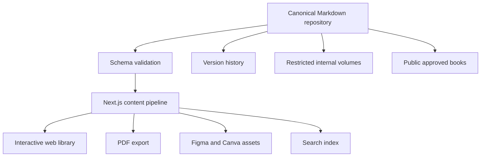

# CloseCut Library Blueprint

The Library should be a separate Next.js content product backed by canonical Markdown/JSON, schema validation, versioned cross-references, public/private visibility, full-text search, accessible page navigation, PDF export, and Figma/Canva asset derivation. It must not live inside the iOS repository. The content pipeline should validate metadata, decision-record links, chapter IDs, diagrams, and integrity hashes before deployment.

