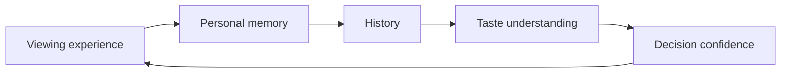

# 1. Vision

**Purpose.** Defines the enduring future CloseCut is trying to create, independently of a particular interface or release.

## Product Intent

CloseCut is the private home for a person’s entertainment life: a durable place to remember, understand, decide, and selectively share. The product should grow more useful as personal history accumulates, rather than becoming obsolete as individual titles leave cultural attention.

## Current Product Interpretation

Current product already unifies private journal, discovery, decision support, saved titles, Circles, plans, and personal summaries.

## Near-Term Direction

Strengthen the relationship among history, choice, and social context without increasing cognitive load.

## Long-Term Vision

Become a trusted entertainment memory system spanning platforms and life stages.

## Vision Statement

> CloseCut is the private home for your entertainment life.

The phrase *private home* establishes ownership, safety, continuity, and return. *Entertainment life* is broader than a watch journal but narrower than a general life-logging platform. It includes watched memories, future intentions, decision moments, cinema context, and trusted shared plans.

## Enduring Outcomes

- A person can reconstruct what they watched and why it mattered.
- Their archive reveals change without reducing identity to a fixed score.
- The next choice becomes easier because prior context remains usable.
- Sharing remains selective, understandable, and reversible.
- The archive survives changes in streaming platforms, trends, and social networks.

## Guiding Principle

> CloseCut is not designed to make people watch more. It is designed to help them value what they watch.

## Implications

A feature that increases content volume but weakens ownership, reflection, or trust is not automatically progress. Product success must be evaluated through durable value, not session length.

## Anti-Patterns

- Positioning the product as a universal streaming catalog.
- Treating public reach as the default measure of social value.
- Presenting taste as a permanent label or competitive score.
- Using recommendation certainty that the available signals cannot support.

## Related Decision Records

- PDR-001 Private by Default
- PDR-002 Memory over Ratings
- PDR-003 Personal First, Social Second
- PDR-004 One Thoughtful Pick
- PDR-005 Local-First Trust
- PDR-006 Membership-Based Circles
