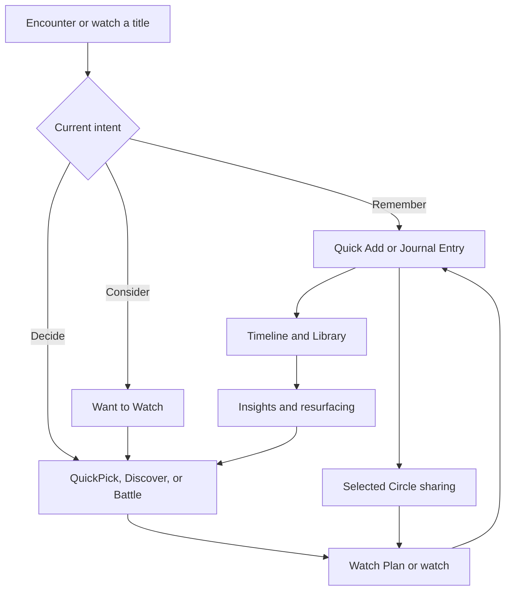

# 8. Core Product Loop

**Purpose.** Defines how durable value compounds.

## Product Intent

Watch or encounter a title → capture or save it → revisit and reflect → recognize patterns → make a focused decision → share or plan when useful → return with more context.

## Current Product Interpretation

The beta implements all nodes, although sync and notification limitations weaken automatic return moments.

## Near-Term Direction

Instrument the loop and identify the strongest activation and retention transitions.

## Long-Term Vision

Create increasingly useful resurfacing and decision support without manipulating attention.

## Loop Definition

## Activation Loop

Onboard → add several past watches or start fresh → see a personal archive → receive a useful next action.

## Retention Loop

New viewing or decision need → use existing history → capture outcome → history gains value.

## Social Loop

Select a memory or candidate → share in one Circle → react, comment, or plan → preserve the result in personal context.

## Healthy-Loop Constraint

The loop must not depend on anxiety, streak loss, public response, or artificial scarcity.

## Related Decision Records

- PDR-001 Private by Default
- PDR-002 Memory over Ratings
- PDR-003 Personal First, Social Second
- PDR-004 One Thoughtful Pick
- PDR-005 Local-First Trust
- PDR-006 Membership-Based Circles
