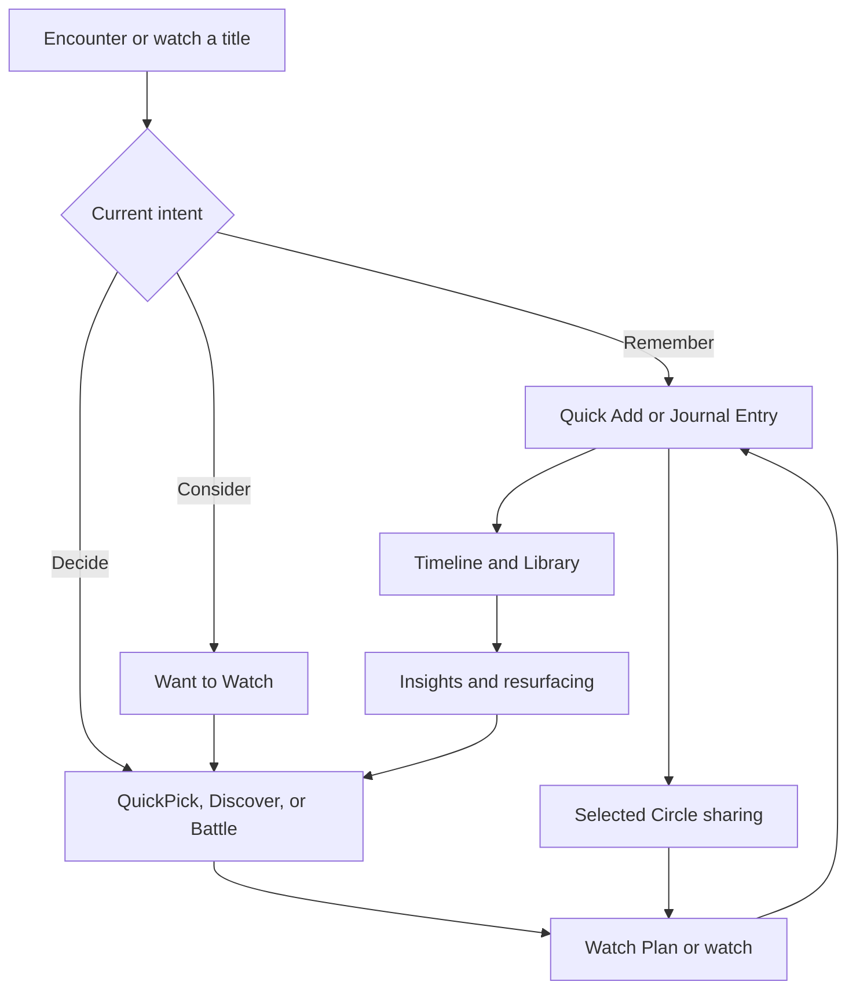
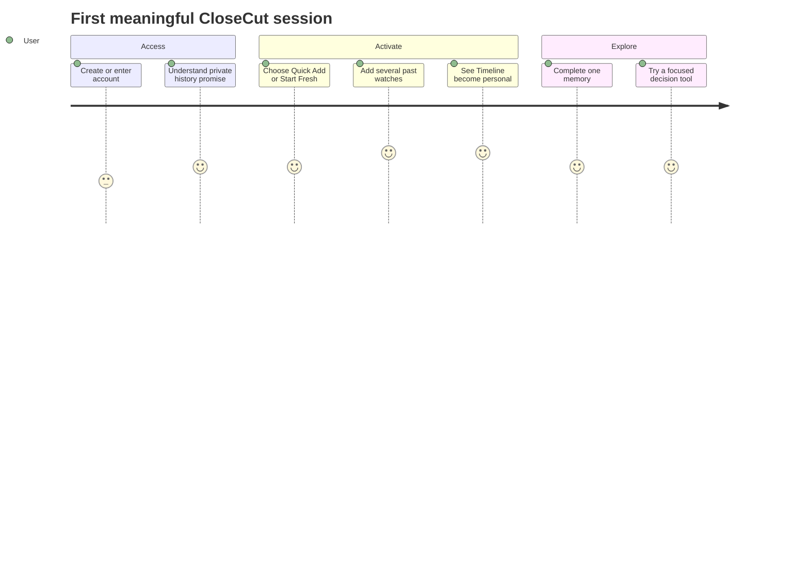
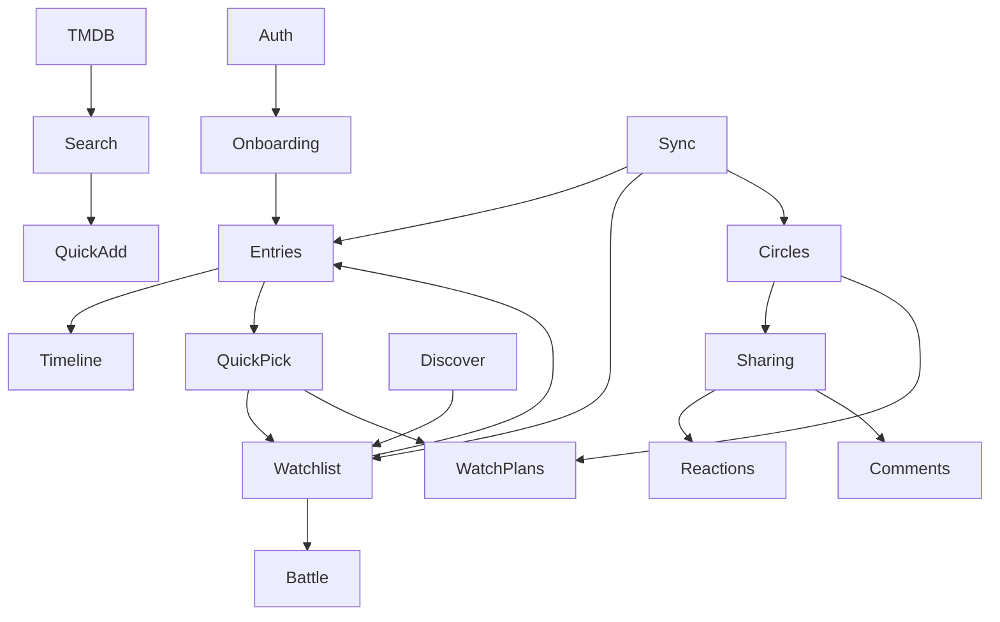

# CloseCut

## Product Vision & Requirements

### The Foundational Product Specification

**Version 1.0**

**Status:** Canonical Working Baseline

**Date:** 13 July 2026

**Edition:** Public Reading Edition

---

# Document Status

This document establishes the first canonical product baseline for CloseCut. It replaces historical PRDs as the source of product truth, while preserving them as evidence of product evolution. It does not replace the Design System, Engineering Architecture Guide, Backend Specification, Testing Guide, or Marketing Design System; those documents must derive from and remain consistent with this specification.

# Purpose

The purpose of this book is to define the product CloseCut is building, the value it must preserve, the boundaries it must not cross, the verified scope of the current beta, and the framework by which the product may evolve. It is deliberately implementation-aware but not implementation-led. Code establishes what exists today; product principles establish what should remain true when implementation changes.

# Intended Audience

- Product owners and collaborators making scope or priority decisions.
- Designers translating product intent into flows, components, content, and motion.
- Engineers interpreting functional boundaries, privacy rules, states, and acceptance criteria.
- QA and release owners defining evidence for TestFlight and App Store readiness.
- Marketing and community owners making public claims about current and future capability.
- Future collaborators who need a reliable mental model before reading implementation documentation.

# How to Use This Document

Read Part I before proposing a major feature. Use Part II when designing or evaluating a specific product area. Use Part III as the rule set for privacy, recommendations, social behavior, language, states, and quality. Use Part IV for release planning, metrics, experiments, and governance. Appendices contain status, evidence, terminology, diagrams, decision matrices, and historical context.

# Sources and Evidence Model

The evidence hierarchy is:

1. **Current repository and build behavior** - source of truth for what exists.
2. **Current repository audits and known-limitations documentation** - source of truth for identified gaps and operational assumptions.
3. **Historical PRDs, Design Specifications, and Programming Guides** - sources of intent, rationale, and product evolution.
4. **Product decisions recorded in this specification** - source of truth for canonical direction.
5. **Long-term concepts** - directional hypotheses, never current-product claims.

Every feature is assigned one of four statuses: **Implemented**, **Partial**, **Future**, or **Obsolete**. “Implemented” means evidence exists in the repository; it does not imply production maturity. “Partial” means meaningful capability exists but a material part of the intended trust, reliability, or lifecycle is incomplete.

# Versioning and Change Control

- Major versions change enduring product architecture, positioning, or governance.
- Minor versions add or materially revise product areas without changing the foundational model.
- Patch versions correct ambiguity, evidence references, terminology, or editorial defects.
- Durable changes require a Product Decision Record (PDR), affected-chapter update, feature-status update, and changelog entry.
- Public claims must be checked against the Current Product and TestFlight scope chapters before publication.

# Executive Summary

CloseCut is the private home for a person’s entertainment life. It helps people remember what they watched, preserve why it mattered, understand how their taste changes, make a focused next decision, and coordinate selectively with people they trust.

The current TestFlight beta is substantially broader than the historical “private emotional journal” concept. Repository evidence shows a personal journal and library, activation through Quick Add, TMDB-backed search and discovery, a rule-based QuickPick engine, a private Want to Watch list, membership-based Circles, selected entry sharing, reactions, comments, Watch Together plans, local Battle modes, Awards & Culture predictions, personal insights, wrap-style summaries, appearance/language controls, and local-first synchronization infrastructure. The product also has material limitations: no real-time listeners or background sync, no automatic retry scheduler, no Group QuickPick, no push social notifications, incomplete account-deletion and profile lifecycle, limited moderation, and dependency on TMDB and Firebase configuration.

The canonical model has four product pillars:

1. **Personal Memory** - one private archive for quick records and rich memories.
2. **Taste and Decision Support** - explainable tools that reduce decision fatigue without claiming certainty.
3. **Trusted Coordination** - selected sharing, Circles, plans, comments, and reactions in explicit context.
4. **Calm, Reliable Experience** - native-feeling interaction, accessibility, local continuity, and honest system state.

CloseCut is not a public review network, streaming service, social graph, infinite recommendation feed, or opaque AI product. Its long-term opportunity is to become a durable entertainment memory system across platforms, with richer taste interpretation, cinema intelligence, shared memories, and assistive insights. That expansion is valid only if privacy, trust, and personal ownership remain stronger than feature breadth.

# PART I - FOUNDATION

# 1. Vision

**Purpose.** Defines the enduring future CloseCut is trying to create, independently of a particular interface or release.

## Product Intent

CloseCut is the private home for a person’s entertainment life: a durable place to remember, understand, decide, and selectively share. The product should grow more useful as personal history accumulates, rather than becoming obsolete as individual titles leave cultural attention.

## Current Product Interpretation

Current product already unifies private journal, discovery, decision support, saved titles, Circles, plans, and personal summaries.

## Near-Term Direction

Strengthen the relationship among history, choice, and social context without increasing cognitive load.

## Long-Term Vision

Become a trusted entertainment memory system spanning platforms and life stages.

## Vision Statement

> CloseCut is the private home for your entertainment life.

The phrase *private home* establishes ownership, safety, continuity, and return. *Entertainment life* is broader than a watch journal but narrower than a general life-logging platform. It includes watched memories, future intentions, decision moments, cinema context, and trusted shared plans.

## Enduring Outcomes

- A person can reconstruct what they watched and why it mattered.
- Their archive reveals change without reducing identity to a fixed score.
- The next choice becomes easier because prior context remains usable.
- Sharing remains selective, understandable, and reversible.
- The archive survives changes in streaming platforms, trends, and social networks.

## Guiding Principle

> CloseCut is not designed to make people watch more. It is designed to help them value what they watch.

## Implications

A feature that increases content volume but weakens ownership, reflection, or trust is not automatically progress. Product success must be evaluated through durable value, not session length.

## Anti-Patterns

- Positioning the product as a universal streaming catalog.
- Treating public reach as the default measure of social value.
- Presenting taste as a permanent label or competitive score.
- Using recommendation certainty that the available signals cannot support.

## Related Decision Records

- PDR-001 Private by Default
- PDR-002 Memory over Ratings
- PDR-003 Personal First, Social Second
- PDR-004 One Thoughtful Pick
- PDR-005 Local-First Trust
- PDR-006 Membership-Based Circles

# 2. Product Philosophy

**Purpose.** Establishes the rules used to evaluate every product decision.

## Product Intent

Memory over ratings; identity over lists; private by default; fast when needed and rich when wanted; explain decisions; calm technology; local-first trust; social intimacy over scale.

## Current Product Interpretation

The current codebase materially reflects these principles through one Entry model, local persistence, explicit sharing, and rule-based QuickPick.

## Near-Term Direction

Remove remaining places where discovery or feature breadth can overshadow the personal archive.

## Long-Term Vision

Maintain these principles even if the product expands into richer intelligence and additional platforms.

## Foundational Principles

### Memory over Ratings
Ratings may exist as a private signal, but they must never displace context, mood, or personal language as the meaning of an entry.

### Identity over Lists
Lists store objects. CloseCut should reveal continuity, change, and personal relevance across time.

### Private by Default
Privacy is a behavioral default and an information architecture rule, not only a policy statement.

### Fast When Needed, Rich When Wanted
Quick Add and full journal entries are equally legitimate states of one history object. The product must not punish a person for choosing speed.

### One Thoughtful Pick
Decision support should narrow a moment of uncertainty, not create another feed to manage.

### Explain the System
Recommendation reasons, sync states, sharing targets, and errors must be understandable without technical knowledge.

### Calm Technology
No streaks, forced urgency, addictive loops, public leaderboards, or manipulative return prompts.

### Taste Evolves
Insights should describe patterns with humility and time context. They must not define the person.

## Related Decision Records

- PDR-001 Private by Default
- PDR-002 Memory over Ratings
- PDR-003 Personal First, Social Second
- PDR-004 One Thoughtful Pick
- PDR-005 Local-First Trust
- PDR-006 Membership-Based Circles

# 3. The Problem

**Purpose.** Describes the underlying market and human problems without presupposing a CloseCut solution.

## Product Intent

Entertainment consumption is abundant but personal continuity is weak. Viewing memories fragment across services, public platforms reward performative opinions, and choice interfaces create more options than confidence.

## Current Product Interpretation

The beta addresses memory fragmentation and decision fatigue but cannot yet prove long-term retention.

## Near-Term Direction

Validate which memory cues and decision moments create recurring value.

## Long-Term Vision

Create continuity across years of viewing and changing services.

## Problem Landscape

### Memory Fragmentation
Viewing history is distributed across service histories, screenshots, messages, notes, public lists, ticket emails, and unreliable recall. These artifacts preserve fragments but rarely form a coherent personal archive.

### Context Loss
A title alone does not preserve who was present, where it was watched, what mood surrounded it, or why it remained meaningful.

### Decision Overload
Discovery systems maximize available options. People still lack confidence about the single option that fits the current moment.

### Public Performance Pressure
Ratings and reviews often become statements to an audience. This can discourage imperfect, intimate, or evolving reflection.

### Platform Discontinuity
Streaming catalogs, apps, and social platforms change. A personal archive tied to one catalog or public network is fragile.

### Coordination Loss
Group decisions and recommendations disappear into chats without durable context or ownership.

## Research Hypotheses

- A seeded personal history creates more first-session value than an empty rich-journal form.
- Focused recommendations with reasons produce more confidence than undifferentiated feeds.
- Explicit private sharing increases willingness to record honest reactions.
- Memory resurfacing creates return value beyond title tracking.

## Related Decision Records

- PDR-001 Private by Default
- PDR-002 Memory over Ratings
- PDR-003 Personal First, Social Second
- PDR-004 One Thoughtful Pick
- PDR-005 Local-First Trust
- PDR-006 Membership-Based Circles

# 4. Why Existing Solutions Fall Short

**Purpose.** Maps the gap among databases, social film platforms, streaming services, generic notes, spreadsheets, and unaided memory.

## Product Intent

Each existing tool optimizes a different job: canonical metadata, public conversation, immediate playback, free-form capture, structured tracking, or effortless recall. None combines private memory, evolving taste, focused choice, and trusted context with low friction.

## Current Product Interpretation

CloseCut complements rather than replaces these tools.

## Near-Term Direction

Improve import/export and interoperability while preserving the distinct private-first model.

## Long-Term Vision

Become the durable personal layer across changing catalogs and platforms.

## Category Comparison

| Category | Optimized job | Structural limitation for this product space |
|---|---|---|
| Public film social platforms | Review, rate, list, and discuss publicly | Reflection is shaped by audience and public identity |
| Databases such as IMDb | Canonical title and industry information | Little personal memory or trusted-context continuity |
| Streaming services | Find and play available content | History is service-specific and optimized for consumption |
| Watchlists | Store future candidates | Lists rarely resolve the current decision or preserve meaning |
| Generic notes | Free-form private capture | No entertainment-specific retrieval, metadata, or decision loop |
| Spreadsheets | Structured personal tracking | High maintenance and weak emotional or mobile interaction |
| Unaided memory | Zero setup | Incomplete, difficult to search, and vulnerable to time |

## Strategic Space

CloseCut occupies the intersection of private memory, entertainment-specific structure, explainable decision support, and trusted group context. It should integrate with or coexist beside public and playback tools rather than claim to replace every category.

## Related Decision Records

- PDR-001 Private by Default
- PDR-002 Memory over Ratings
- PDR-003 Personal First, Social Second
- PDR-004 One Thoughtful Pick
- PDR-005 Local-First Trust
- PDR-006 Membership-Based Circles

# 5. Product Positioning

**Purpose.** Defines category, audience, differentiation, and boundaries.

## Product Intent

Category: private entertainment memory and decision system. Primary promise: More than ratings. Supporting promise: remember what you watched, understand your taste, and make the next choice easier.

## Current Product Interpretation

TestFlight positioning should stay narrower than the long-term ecosystem and only claim implemented capabilities.

## Near-Term Direction

Refine language through tester comprehension and App Store conversion.

## Long-Term Vision

Own the private entertainment memory category rather than competing for public review scale.

## Canonical Positioning

**Category.** Private entertainment memory and decision system.

**Primary promise.** More than ratings.

**Functional articulation.** Remember what you watched. Understand your taste. Make the next choice easier.

**Social articulation.** Private by default. Share only what you choose, with the people you choose.

## Primary Audience

People who watch movies or series regularly and want continuity, personal meaning, or decision support without maintaining a public persona.

## Secondary Audience

Small trusted groups that already exchange recommendations and plans in fragmented conversations.

## Poor Fit

- People seeking a public critic identity as the primary job.
- Users who only want streaming-provider availability.
- Users expecting automated certainty from minimal history.
- Communities requiring large-scale public moderation or viral discovery.

## Public Claim Rule

Marketing must describe current TestFlight behavior, not the complete long-term system. “AI-powered,” “real-time,” “available everywhere,” or “fully private” are prohibited unless evidence and policy support the exact claim.

## Related Decision Records

- PDR-001 Private by Default
- PDR-002 Memory over Ratings
- PDR-003 Personal First, Social Second
- PDR-004 One Thoughtful Pick
- PDR-005 Local-First Trust
- PDR-006 Membership-Based Circles

# 6. Product Identity

**Purpose.** Defines the product personality, emotional outcome, voice, values, and editorial behavior.

## Product Intent

CloseCut is thoughtful, intimate, calm, premium, curious, and nonjudgmental. It speaks clearly and warmly, avoids exaggerated intelligence claims, and treats the person’s words as primary content.

## Current Product Interpretation

The app’s dark editorial design, typography, privacy copy, and brand character broadly support this identity.

## Near-Term Direction

Unify product, website, App Store, and social language through a canonical content system.

## Long-Term Vision

Remain recognizable across iOS, Android, web reading experiences, and physical or event touchpoints.

## Personality

Thoughtful, private, calm, cinematic, warm, precise, curious, and nonjudgmental.

## Emotional Goals

A person should feel: “This is mine,” “I can remember,” “I understand why this is here,” “I am in control of sharing,” and “I can decide without browsing forever.”

## Voice

- Use short, direct, human sentences.
- Prefer invitation over instruction.
- Describe system limitations honestly.
- Avoid judgment about taste, completion, frequency, or genre.
- Avoid startup superlatives and algorithmic mystique.

## Editorial Language

Use *memory*, *history*, *watched*, *saved*, *Circle*, *plan*, *reason*, and *private*. Use *intelligence* only for clearly bounded product interpretation, never as an unsupported capability claim.

## Brand-to-Product Consistency

The visual identity may be expressive, but interaction surfaces should keep the user’s content primary. Marketing can use the CloseCut character and purple glow as brand signals; product UI must preserve editorial restraint and native legibility.

## Related Decision Records

- PDR-001 Private by Default
- PDR-002 Memory over Ratings
- PDR-003 Personal First, Social Second
- PDR-004 One Thoughtful Pick
- PDR-005 Local-First Trust
- PDR-006 Membership-Based Circles

# 7. Personas

**Purpose.** Defines a small set of behavior-based archetypes rather than demographic stereotypes.

## Product Intent

Four primary personas: the Memory Keeper, the Taste Builder, the Decision Seeker, and the Trusted Coordinator. A person may move among these modes.

## Current Product Interpretation

Current features serve all four, though the broad surface area risks obscuring the primary activation path.

## Near-Term Direction

Use onboarding and progressive disclosure to meet the current job without presenting the whole system at once.

## Long-Term Vision

Support deeper longitudinal and group use without splitting the product into disconnected modes.

## Persona 1 - The Memory Keeper

**Job:** Preserve a meaningful record without writing formal reviews.

**Trigger:** Finishing a title, revisiting an old favorite, or recalling a shared moment.

**Success:** The memory is captured quickly enough to remain honest and is easy to rediscover later.

**Failure:** The form feels like work or the archive becomes a flat list.

## Persona 2 - The Taste Builder

**Job:** See patterns and change across a growing archive.

**Trigger:** Browsing personal history, summaries, or resurfaced memories.

**Success:** Insights feel recognizable but not deterministic.

**Failure:** The product turns taste into a fixed label or vanity score.

## Persona 3 - The Decision Seeker

**Job:** Reduce uncertainty in the current moment.

**Trigger:** “I do not know what to watch.”

**Success:** One option and a credible reason create confidence or useful rejection.

**Failure:** Another infinite feed, repeated titles, or unexplained suggestions.

## Persona 4 - The Trusted Coordinator

**Job:** Share selected memories and turn conversation into a concrete plan.

**Trigger:** A partner, family, or friends want to watch something together.

**Success:** Context, ownership, and responses remain attached to a named Circle.

**Failure:** Accidental oversharing, public behavior, or chat replacement complexity.

## Related Decision Records

- PDR-001 Private by Default
- PDR-002 Memory over Ratings
- PDR-003 Personal First, Social Second
- PDR-004 One Thoughtful Pick
- PDR-005 Local-First Trust
- PDR-006 Membership-Based Circles

# 8. Core Product Loop

**Purpose.** Defines how durable value compounds.

## Product Intent

Watch or encounter a title → capture or save it → revisit and reflect → recognize patterns → make a focused decision → share or plan when useful → return with more context.

## Current Product Interpretation

The beta implements all nodes, although sync and notification limitations weaken automatic return moments.

## Near-Term Direction

Instrument the loop and identify the strongest activation and retention transitions.

## Long-Term Vision

Create increasingly useful resurfacing and decision support without manipulating attention.

## Loop Definition

## Activation Loop

Onboard → add several past watches or start fresh → see a personal archive → receive a useful next action.

## Retention Loop

New viewing or decision need → use existing history → capture outcome → history gains value.

## Social Loop

Select a memory or candidate → share in one Circle → react, comment, or plan → preserve the result in personal context.

## Healthy-Loop Constraint

The loop must not depend on anxiety, streak loss, public response, or artificial scarcity.

## Related Decision Records

- PDR-001 Private by Default
- PDR-002 Memory over Ratings
- PDR-003 Personal First, Social Second
- PDR-004 One Thoughtful Pick
- PDR-005 Local-First Trust
- PDR-006 Membership-Based Circles

# 9. Information Architecture

**Purpose.** Defines the conceptual domains and their boundaries, not only tabs.

## Product Intent

Five mental spaces: Personal Memory, Decide, Discover, Trusted Social, and Account/Trust. Features may appear in more than one navigation surface, but ownership remains explicit.

## Current Product Interpretation

The current app contains corresponding feature areas across Home, Discover, Social, Battle, Watchlist, and Settings.

## Near-Term Direction

Reduce navigation ambiguity and clarify the relationship between Timeline, Library, Discover, QuickPick, Battle, and Plans.

## Long-Term Vision

Allow future platforms to express the same mental model with different native navigation.

## Mental Domains

### Personal Memory
Entries, Timeline, Library, details, insights, wraps, and owner lifecycle.

### Decide
QuickPick, Want to Watch, Battle, and plan creation.

### Discover
Search, trending/popular metadata, title preview, and external enrichment.

### Trusted Social
Circles, selected sharing, shared timelines, reactions, comments, and Watch Together.

### Account and Trust
Authentication, profile, privacy, language, appearance, sync, notifications, support, and deletion.

## Boundary Rules

- Personal entries do not become social content without explicit selected-Circle sharing.
- Discover metadata does not become personal history until a person saves or records it.
- A watchlist candidate is an intention, not a watched memory.
- A Battle outcome is a decision artifact, not automatically a personal taste fact.
- Circle context cannot read private-only personal records.

## Navigation Principle

Navigation may evolve, but every surface must make the current domain, ownership, and next action clear.

## Related Decision Records

- PDR-001 Private by Default
- PDR-002 Memory over Ratings
- PDR-003 Personal First, Social Second
- PDR-004 One Thoughtful Pick
- PDR-005 Local-First Trust
- PDR-006 Membership-Based Circles

# PART II - PRODUCT SYSTEM

# 10. Product Pillars

**Purpose.** Personal Memory; Taste and Decision Support; Trusted Coordination; Calm, Reliable Experience.

**Status:** Implemented

## User Need

People need one coherent product rather than a collection of unrelated media utilities.

## Product Behavior

The system is organized around four pillars: Personal Memory, Taste and Decision Support, Trusted Coordination, and Calm Reliable Experience. Every feature must have one primary pillar and may support others.

## Current Implementation

- **Authentication and Session (implemented).** Email/password authentication and session gating are present. Password reset and email verification are not surfaced.
- `CloseCut/Core/Services/AuthService.swift`
- `CloseCut/Core/Services/SessionViewModel.swift`
- **Onboarding (implemented).** Start-fresh and Quick Add activation paths are implemented.
- `CloseCut/Features/Onboarding`
- **Quick Add Past Watches (implemented).** TMDB search, local fallback, manual entry, duplicate prevention, quick sentiment, approximate date, and upgrade path are present.
- `CloseCut/Features/QuickAdd`
- **Personal Journal Entries (implemented).** Rich entry creation/editing, soft delete, metadata, mood, tags, notes, quotes, context, cinema fields, and sharing targets are present.
- `CloseCut/Features/Entries`
- `CloseCut/Core/Local/LocalEntry.swift`

## Near-Term Direction

Clarify feature hierarchy in navigation and public messaging; remove duplication among decision surfaces.

## Long-Term Vision

The pillars remain stable while individual features and navigation evolve.

## Requirements

- The Product Pillars experience must state its primary user job clearly through hierarchy and behavior rather than explanatory feature lists.
- Current behavior must remain distinguishable from future capability in product copy, release notes, marketing, and internal specifications.
- Private data must not become visible outside its intended context through default state, fallback behavior, logging, analytics, or sync reconciliation.
- All meaningful states must define a recovery path or an honest terminal explanation.
- Accessibility behavior must be specified with the same priority as visual behavior.
- The feature must add durable value to personal memory, decision confidence, trusted coordination, or product trust.

## Acceptance Criteria

- The shipped behavior matches the current-product description and evidence paths in Appendix B.
- A new user can understand the purpose of Product Pillars without external documentation.
- The feature does not require public identity, follower relationships, or engagement mechanics.
- Offline, empty, error, permission, and pending states preserve context and do not imply data loss.
- VoiceOver, Dynamic Type, contrast, touch targets, and non-color status cues are verified for the relevant surfaces.
- Instrumentation, when present, measures the intended outcome rather than raw taps alone.

## Edge Cases

- No local data and no network.
- Local data exists while the remote copy is older or unavailable.
- The user revokes permission or loses Circle membership during an active flow.
- Metadata becomes unavailable after an item has been saved.
- The app is terminated during a pending write or navigation transition.
- The same item is encountered through multiple origins or contexts.

## Privacy and Accessibility Implications

The feature must minimize collected data, preserve context boundaries, expose sharing and synchronization states in language, and support VoiceOver, Dynamic Type, sufficient contrast, reduced motion, and non-color status.

## Success Signals

- People complete the intended job without needing support or external explanation.
- The feature creates a meaningful transition to another core loop step.
- Reported accidental sharing, lost data, and unrecoverable errors remain near zero.
- Qualitative feedback describes increased memory value, decision confidence, or trusted coordination.

## Related Decision Records

- PDR-001 Private by Default
- PDR-002 Memory over Ratings
- PDR-003 Personal First, Social Second
- PDR-004 One Thoughtful Pick
- PDR-005 Local-First Trust
- PDR-006 Membership-Based Circles
- PDR-007 One Entry Model
- PDR-008 Explain Recommendations
- PDR-009 Explicit Circle Context
- PDR-010 Calm, Native Interaction

# 11. Personal History

**Purpose.** A private, owner-controlled archive unifying lightweight and rich records.

**Status:** Implemented

## User Need

I want my watched history to remain mine, become easier to revisit, and accept both lightweight and detailed records.

## Product Behavior

Personal History owns watched records. It combines Quick Add and full entries through one identity, keeps ownership explicit, supports local rendering, and separates private records from Circle context.

## Current Implementation

- **Personal Journal Entries (implemented).** Rich entry creation/editing, soft delete, metadata, mood, tags, notes, quotes, context, cinema fields, and sharing targets are present.
- `CloseCut/Features/Entries`
- `CloseCut/Core/Local/LocalEntry.swift`

## Near-Term Direction

Improve import/export, section logic, and longitudinal resurfacing while protecting simple browsing.

## Long-Term Vision

A cross-platform archive owned by the person, with durable export and migration.

## Requirements

- The Personal History experience must state its primary user job clearly through hierarchy and behavior rather than explanatory feature lists.
- Current behavior must remain distinguishable from future capability in product copy, release notes, marketing, and internal specifications.
- Private data must not become visible outside its intended context through default state, fallback behavior, logging, analytics, or sync reconciliation.
- All meaningful states must define a recovery path or an honest terminal explanation.
- Accessibility behavior must be specified with the same priority as visual behavior.
- The feature must add durable value to personal memory, decision confidence, trusted coordination, or product trust.

## Acceptance Criteria

- The shipped behavior matches the current-product description and evidence paths in Appendix B.
- A new user can understand the purpose of Personal History without external documentation.
- The feature does not require public identity, follower relationships, or engagement mechanics.
- Offline, empty, error, permission, and pending states preserve context and do not imply data loss.
- VoiceOver, Dynamic Type, contrast, touch targets, and non-color status cues are verified for the relevant surfaces.
- Instrumentation, when present, measures the intended outcome rather than raw taps alone.

## Edge Cases

- No local data and no network.
- Local data exists while the remote copy is older or unavailable.
- The user revokes permission or loses Circle membership during an active flow.
- Metadata becomes unavailable after an item has been saved.
- The app is terminated during a pending write or navigation transition.
- The same item is encountered through multiple origins or contexts.

## Privacy and Accessibility Implications

The feature must minimize collected data, preserve context boundaries, expose sharing and synchronization states in language, and support VoiceOver, Dynamic Type, sufficient contrast, reduced motion, and non-color status.

## Success Signals

- People complete the intended job without needing support or external explanation.
- The feature creates a meaningful transition to another core loop step.
- Reported accidental sharing, lost data, and unrecoverable errors remain near zero.
- Qualitative feedback describes increased memory value, decision confidence, or trusted coordination.

## Related Decision Records

- PDR-001 Private by Default
- PDR-002 Memory over Ratings
- PDR-003 Personal First, Social Second
- PDR-004 One Thoughtful Pick
- PDR-005 Local-First Trust
- PDR-006 Membership-Based Circles
- PDR-007 One Entry Model
- PDR-008 Explain Recommendations
- PDR-009 Explicit Circle Context
- PDR-010 Calm, Native Interaction

# 12. Quick Add Past Watches

**Purpose.** A fast title-first activation and history-building flow.

**Status:** Implemented

## User Need

I want to seed my history quickly without completing a long journal form.

## Product Behavior

Quick Add lets a person search, select, or manually enter several previously watched titles with minimal required input. Optional sentiment and approximate date deepen the record without blocking capture.

## Current Implementation

- **Quick Add Past Watches (implemented).** TMDB search, local fallback, manual entry, duplicate prevention, quick sentiment, approximate date, and upgrade path are present.
- `CloseCut/Features/QuickAdd`
- **QuickPick (implemented).** Local rule-based engine, reasons, confidence labels, no-repeat, rewatch logic, local heuristics, and TMDB-backed candidate discovery are present.
- `CloseCut/Recommendation`
- `CloseCut/Features/Home/QuickPick`
- **Group QuickPick (future).** Circle-level recommendation remains placeholder/not implemented.
- `CloseCut/Features/Social/Circle`

## Near-Term Direction

Measure completion, duplicate confusion, and upgrade behavior; optimize for several additions in one session.

## Long-Term Vision

Optional imports and intelligent assistance that preserve user confirmation and data provenance.

## Requirements

- The Quick Add Past Watches experience must state its primary user job clearly through hierarchy and behavior rather than explanatory feature lists.
- Current behavior must remain distinguishable from future capability in product copy, release notes, marketing, and internal specifications.
- Private data must not become visible outside its intended context through default state, fallback behavior, logging, analytics, or sync reconciliation.
- All meaningful states must define a recovery path or an honest terminal explanation.
- Accessibility behavior must be specified with the same priority as visual behavior.
- The feature must add durable value to personal memory, decision confidence, trusted coordination, or product trust.

## Acceptance Criteria

- The shipped behavior matches the current-product description and evidence paths in Appendix B.
- A new user can understand the purpose of Quick Add Past Watches without external documentation.
- The feature does not require public identity, follower relationships, or engagement mechanics.
- Offline, empty, error, permission, and pending states preserve context and do not imply data loss.
- VoiceOver, Dynamic Type, contrast, touch targets, and non-color status cues are verified for the relevant surfaces.
- Instrumentation, when present, measures the intended outcome rather than raw taps alone.

## Edge Cases

- No local data and no network.
- Local data exists while the remote copy is older or unavailable.
- The user revokes permission or loses Circle membership during an active flow.
- Metadata becomes unavailable after an item has been saved.
- The app is terminated during a pending write or navigation transition.
- The same item is encountered through multiple origins or contexts.

## Privacy and Accessibility Implications

The feature must minimize collected data, preserve context boundaries, expose sharing and synchronization states in language, and support VoiceOver, Dynamic Type, sufficient contrast, reduced motion, and non-color status.

## Success Signals

- People complete the intended job without needing support or external explanation.
- The feature creates a meaningful transition to another core loop step.
- Reported accidental sharing, lost data, and unrecoverable errors remain near zero.
- Qualitative feedback describes increased memory value, decision confidence, or trusted coordination.

## Related Decision Records

- PDR-001 Private by Default
- PDR-002 Memory over Ratings
- PDR-003 Personal First, Social Second
- PDR-004 One Thoughtful Pick
- PDR-005 Local-First Trust
- PDR-006 Membership-Based Circles
- PDR-007 One Entry Model
- PDR-008 Explain Recommendations
- PDR-009 Explicit Circle Context
- PDR-010 Calm, Native Interaction

# 13. Timeline

**Purpose.** A temporal and editorial memory surface, not a generic social feed.

**Status:** Implemented

## User Need

I want to browse my past as a meaningful archive rather than a chronological database dump.

## Product Behavior

Timeline prioritizes recency and meaningful sections while supporting search, filters, memory cues, and both lightweight and rich cards. It avoids social-feed semantics.

## Current Implementation

- **Timeline and Library (implemented).** Timeline, search, filters, sections, insights, and wrap-style summaries are present.
- `CloseCut/Features/Home/Timeline`
- `CloseCut/Features/Home/Library`

## Near-Term Direction

Validate which sections and cues increase meaningful return without making the archive feel algorithmically rearranged.

## Long-Term Vision

A living personal narrative with meaningful seasonal and multi-year resurfacing.

## Requirements

- The Timeline experience must state its primary user job clearly through hierarchy and behavior rather than explanatory feature lists.
- Current behavior must remain distinguishable from future capability in product copy, release notes, marketing, and internal specifications.
- Private data must not become visible outside its intended context through default state, fallback behavior, logging, analytics, or sync reconciliation.
- All meaningful states must define a recovery path or an honest terminal explanation.
- Accessibility behavior must be specified with the same priority as visual behavior.
- The feature must add durable value to personal memory, decision confidence, trusted coordination, or product trust.

## Acceptance Criteria

- The shipped behavior matches the current-product description and evidence paths in Appendix B.
- A new user can understand the purpose of Timeline without external documentation.
- The feature does not require public identity, follower relationships, or engagement mechanics.
- Offline, empty, error, permission, and pending states preserve context and do not imply data loss.
- VoiceOver, Dynamic Type, contrast, touch targets, and non-color status cues are verified for the relevant surfaces.
- Instrumentation, when present, measures the intended outcome rather than raw taps alone.

## Edge Cases

- No local data and no network.
- Local data exists while the remote copy is older or unavailable.
- The user revokes permission or loses Circle membership during an active flow.
- Metadata becomes unavailable after an item has been saved.
- The app is terminated during a pending write or navigation transition.
- The same item is encountered through multiple origins or contexts.

## Privacy and Accessibility Implications

The feature must minimize collected data, preserve context boundaries, expose sharing and synchronization states in language, and support VoiceOver, Dynamic Type, sufficient contrast, reduced motion, and non-color status.

## Success Signals

- People complete the intended job without needing support or external explanation.
- The feature creates a meaningful transition to another core loop step.
- Reported accidental sharing, lost data, and unrecoverable errors remain near zero.
- Qualitative feedback describes increased memory value, decision confidence, or trusted coordination.

## Related Decision Records

- PDR-001 Private by Default
- PDR-002 Memory over Ratings
- PDR-003 Personal First, Social Second
- PDR-004 One Thoughtful Pick
- PDR-005 Local-First Trust
- PDR-006 Membership-Based Circles
- PDR-007 One Entry Model
- PDR-008 Explain Recommendations
- PDR-009 Explicit Circle Context
- PDR-010 Calm, Native Interaction

# 14. Full Journal Entries

**Purpose.** The rich reflection layer for mood, context, notes, tags, quotes, metadata, and cinema experience.

**Status:** Implemented

## User Need

I want to preserve what stayed with me while the experience is still available in memory.

## Product Behavior

The full editor captures title, mood, date, notes, quote, tags, context, cinema details, metadata, and selected sharing targets using progressive disclosure.

## Current Implementation

Repository evidence is distributed across the UI design system, feature views, accessibility audit, and QA checklist. This specification treats accessibility as partially verified until a complete device-level audit passes.

## Near-Term Direction

Reduce form fatigue, strengthen draft recovery, and preserve a fast default path.

## Long-Term Vision

Flexible capture ranging from seconds to deep reflection, including voice or assisted structuring only with consent.

## Requirements

- The Full Journal Entries experience must state its primary user job clearly through hierarchy and behavior rather than explanatory feature lists.
- Current behavior must remain distinguishable from future capability in product copy, release notes, marketing, and internal specifications.
- Private data must not become visible outside its intended context through default state, fallback behavior, logging, analytics, or sync reconciliation.
- All meaningful states must define a recovery path or an honest terminal explanation.
- Accessibility behavior must be specified with the same priority as visual behavior.
- The feature must add durable value to personal memory, decision confidence, trusted coordination, or product trust.

## Acceptance Criteria

- The shipped behavior matches the current-product description and evidence paths in Appendix B.
- A new user can understand the purpose of Full Journal Entries without external documentation.
- The feature does not require public identity, follower relationships, or engagement mechanics.
- Offline, empty, error, permission, and pending states preserve context and do not imply data loss.
- VoiceOver, Dynamic Type, contrast, touch targets, and non-color status cues are verified for the relevant surfaces.
- Instrumentation, when present, measures the intended outcome rather than raw taps alone.

## Edge Cases

- No local data and no network.
- Local data exists while the remote copy is older or unavailable.
- The user revokes permission or loses Circle membership during an active flow.
- Metadata becomes unavailable after an item has been saved.
- The app is terminated during a pending write or navigation transition.
- The same item is encountered through multiple origins or contexts.

## Privacy and Accessibility Implications

The feature must minimize collected data, preserve context boundaries, expose sharing and synchronization states in language, and support VoiceOver, Dynamic Type, sufficient contrast, reduced motion, and non-color status.

## Success Signals

- People complete the intended job without needing support or external explanation.
- The feature creates a meaningful transition to another core loop step.
- Reported accidental sharing, lost data, and unrecoverable errors remain near zero.
- Qualitative feedback describes increased memory value, decision confidence, or trusted coordination.

## Related Decision Records

- PDR-001 Private by Default
- PDR-002 Memory over Ratings
- PDR-003 Personal First, Social Second
- PDR-004 One Thoughtful Pick
- PDR-005 Local-First Trust
- PDR-006 Membership-Based Circles
- PDR-007 One Entry Model
- PDR-008 Explain Recommendations
- PDR-009 Explicit Circle Context
- PDR-010 Calm, Native Interaction

# 15. Entry Detail and Memory Preservation

**Purpose.** The canonical reading surface for one memory and its owner-controlled lifecycle.

**Status:** Implemented

## User Need

I want one trustworthy place to reread, complete, edit, share, or remove a memory I own.

## Product Behavior

Entry Detail displays the complete memory, metadata, ownership, visibility, and sync status. Edit and delete remain owner actions; Circle detail remains read-only.

## Current Implementation

- **Private Entry Sharing (implemented).** Selected Circle sharing is explicit and private by default. Circle-side entry detail is read-only.
- `CloseCut/Features/Entries`
- `CloseCut/Features/Social/Circle`

## Near-Term Direction

Improve memory resurfacing, sharing clarity, and lifecycle confidence.

## Long-Term Vision

A rich, portable memory object linking personal, cinema, and trusted shared context.

## Requirements

- The Entry Detail and Memory Preservation experience must state its primary user job clearly through hierarchy and behavior rather than explanatory feature lists.
- Current behavior must remain distinguishable from future capability in product copy, release notes, marketing, and internal specifications.
- Private data must not become visible outside its intended context through default state, fallback behavior, logging, analytics, or sync reconciliation.
- All meaningful states must define a recovery path or an honest terminal explanation.
- Accessibility behavior must be specified with the same priority as visual behavior.
- The feature must add durable value to personal memory, decision confidence, trusted coordination, or product trust.

## Acceptance Criteria

- The shipped behavior matches the current-product description and evidence paths in Appendix B.
- A new user can understand the purpose of Entry Detail and Memory Preservation without external documentation.
- The feature does not require public identity, follower relationships, or engagement mechanics.
- Offline, empty, error, permission, and pending states preserve context and do not imply data loss.
- VoiceOver, Dynamic Type, contrast, touch targets, and non-color status cues are verified for the relevant surfaces.
- Instrumentation, when present, measures the intended outcome rather than raw taps alone.

## Edge Cases

- No local data and no network.
- Local data exists while the remote copy is older or unavailable.
- The user revokes permission or loses Circle membership during an active flow.
- Metadata becomes unavailable after an item has been saved.
- The app is terminated during a pending write or navigation transition.
- The same item is encountered through multiple origins or contexts.

## Privacy and Accessibility Implications

The feature must minimize collected data, preserve context boundaries, expose sharing and synchronization states in language, and support VoiceOver, Dynamic Type, sufficient contrast, reduced motion, and non-color status.

## Success Signals

- People complete the intended job without needing support or external explanation.
- The feature creates a meaningful transition to another core loop step.
- Reported accidental sharing, lost data, and unrecoverable errors remain near zero.
- Qualitative feedback describes increased memory value, decision confidence, or trusted coordination.

## Related Decision Records

- PDR-001 Private by Default
- PDR-002 Memory over Ratings
- PDR-003 Personal First, Social Second
- PDR-004 One Thoughtful Pick
- PDR-005 Local-First Trust
- PDR-006 Membership-Based Circles
- PDR-007 One Entry Model
- PDR-008 Explain Recommendations
- PDR-009 Explicit Circle Context
- PDR-010 Calm, Native Interaction

# 16. QuickPick

**Purpose.** A focused, rule-based, explainable personal recommendation experience.

**Status:** Implemented

## User Need

I want one credible option when I cannot decide, with a reason I understand and can reject.

## Product Behavior

QuickPick evaluates candidate sources with local rules, filters watched items unless intentionally resurfacing a rewatch, avoids same-session repetition, and shows a reason and confidence label.

## Current Implementation

- **QuickPick (implemented).** Local rule-based engine, reasons, confidence labels, no-repeat, rewatch logic, local heuristics, and TMDB-backed candidate discovery are present.
- `CloseCut/Recommendation`
- `CloseCut/Features/Home/QuickPick`
- **Group QuickPick (future).** Circle-level recommendation remains placeholder/not implemented.
- `CloseCut/Features/Social/Circle`

## Near-Term Direction

Strengthen candidate quality, reason accuracy, dismissal learning, and distinction between rewatch and unwatched discovery.

## Long-Term Vision

More adaptive decision support with transparent signal controls and no black-box authority.

## Requirements

- The QuickPick experience must state its primary user job clearly through hierarchy and behavior rather than explanatory feature lists.
- Current behavior must remain distinguishable from future capability in product copy, release notes, marketing, and internal specifications.
- Private data must not become visible outside its intended context through default state, fallback behavior, logging, analytics, or sync reconciliation.
- All meaningful states must define a recovery path or an honest terminal explanation.
- Accessibility behavior must be specified with the same priority as visual behavior.
- The feature must add durable value to personal memory, decision confidence, trusted coordination, or product trust.

## Acceptance Criteria

- The shipped behavior matches the current-product description and evidence paths in Appendix B.
- A new user can understand the purpose of QuickPick without external documentation.
- The feature does not require public identity, follower relationships, or engagement mechanics.
- Offline, empty, error, permission, and pending states preserve context and do not imply data loss.
- VoiceOver, Dynamic Type, contrast, touch targets, and non-color status cues are verified for the relevant surfaces.
- Instrumentation, when present, measures the intended outcome rather than raw taps alone.

## Edge Cases

- No local data and no network.
- Local data exists while the remote copy is older or unavailable.
- The user revokes permission or loses Circle membership during an active flow.
- Metadata becomes unavailable after an item has been saved.
- The app is terminated during a pending write or navigation transition.
- The same item is encountered through multiple origins or contexts.

## Privacy and Accessibility Implications

The feature must minimize collected data, preserve context boundaries, expose sharing and synchronization states in language, and support VoiceOver, Dynamic Type, sufficient contrast, reduced motion, and non-color status.

## Success Signals

- People complete the intended job without needing support or external explanation.
- The feature creates a meaningful transition to another core loop step.
- Reported accidental sharing, lost data, and unrecoverable errors remain near zero.
- Qualitative feedback describes increased memory value, decision confidence, or trusted coordination.

## Related Decision Records

- PDR-001 Private by Default
- PDR-002 Memory over Ratings
- PDR-003 Personal First, Social Second
- PDR-004 One Thoughtful Pick
- PDR-005 Local-First Trust
- PDR-006 Membership-Based Circles
- PDR-007 One Entry Model
- PDR-008 Explain Recommendations
- PDR-009 Explicit Circle Context
- PDR-010 Calm, Native Interaction

# 17. Watchlist and Decision Support

**Purpose.** A private staging area connecting discovery, decisions, and eventual history.

**Status:** Implemented

## User Need

I want to keep candidates without confusing intention with history, and move them naturally toward a decision.

## Product Behavior

Want to Watch stores private candidates and supports save, dismiss, mark watched, convert to history, enter Battle, or create a plan. Status must never imply that a candidate was watched.

## Current Implementation

- **Want to Watch (implemented).** Private saved list, status handling, mark watched, conversion to Quick Add, and push/pull sync are present.
- `CloseCut/Features/Watchlist`
- `CloseCut/Core/Repositories/WatchlistRepository.swift`

## Near-Term Direction

Unify status vocabulary and ensure conversion to watched history is intentional and reversible.

## Long-Term Vision

A universal private queue interoperable with plans and availability while remaining distinct from watched history.

## Requirements

- The Watchlist and Decision Support experience must state its primary user job clearly through hierarchy and behavior rather than explanatory feature lists.
- Current behavior must remain distinguishable from future capability in product copy, release notes, marketing, and internal specifications.
- Private data must not become visible outside its intended context through default state, fallback behavior, logging, analytics, or sync reconciliation.
- All meaningful states must define a recovery path or an honest terminal explanation.
- Accessibility behavior must be specified with the same priority as visual behavior.
- The feature must add durable value to personal memory, decision confidence, trusted coordination, or product trust.

## Acceptance Criteria

- The shipped behavior matches the current-product description and evidence paths in Appendix B.
- A new user can understand the purpose of Watchlist and Decision Support without external documentation.
- The feature does not require public identity, follower relationships, or engagement mechanics.
- Offline, empty, error, permission, and pending states preserve context and do not imply data loss.
- VoiceOver, Dynamic Type, contrast, touch targets, and non-color status cues are verified for the relevant surfaces.
- Instrumentation, when present, measures the intended outcome rather than raw taps alone.

## Edge Cases

- No local data and no network.
- Local data exists while the remote copy is older or unavailable.
- The user revokes permission or loses Circle membership during an active flow.
- Metadata becomes unavailable after an item has been saved.
- The app is terminated during a pending write or navigation transition.
- The same item is encountered through multiple origins or contexts.

## Privacy and Accessibility Implications

The feature must minimize collected data, preserve context boundaries, expose sharing and synchronization states in language, and support VoiceOver, Dynamic Type, sufficient contrast, reduced motion, and non-color status.

## Success Signals

- People complete the intended job without needing support or external explanation.
- The feature creates a meaningful transition to another core loop step.
- Reported accidental sharing, lost data, and unrecoverable errors remain near zero.
- Qualitative feedback describes increased memory value, decision confidence, or trusted coordination.

## Related Decision Records

- PDR-001 Private by Default
- PDR-002 Memory over Ratings
- PDR-003 Personal First, Social Second
- PDR-004 One Thoughtful Pick
- PDR-005 Local-First Trust
- PDR-006 Membership-Based Circles
- PDR-007 One Entry Model
- PDR-008 Explain Recommendations
- PDR-009 Explicit Circle Context
- PDR-010 Calm, Native Interaction

# 18. Search and Metadata

**Purpose.** TMDB-backed and local/manual mechanisms that reduce capture friction without making metadata the product.

**Status:** Implemented

## User Need

I want fast, accurate title selection while retaining a manual path when metadata is unavailable.

## Product Behavior

Search uses TMDB where configured, local suggestions and cached metadata where available, and manual fallback. Metadata enriches capture and discovery but cannot block a private record.

## Current Implementation

- **Discover and Search (implemented).** Trending, popular, media search, detail previews, genre affinity, and TMDB metadata are present; availability providers are not.
- `CloseCut/Features/Discover`
- `CloseCut/Features/Search`
- `CloseCut/Core/External/TMDB`

## Near-Term Direction

Improve failure handling, metadata refresh, attribution, and offline/manual continuity.

## Long-Term Vision

Provider-aware and region-aware enrichment without becoming a playback catalog.

## Requirements

- The Search and Metadata experience must state its primary user job clearly through hierarchy and behavior rather than explanatory feature lists.
- Current behavior must remain distinguishable from future capability in product copy, release notes, marketing, and internal specifications.
- Private data must not become visible outside its intended context through default state, fallback behavior, logging, analytics, or sync reconciliation.
- All meaningful states must define a recovery path or an honest terminal explanation.
- Accessibility behavior must be specified with the same priority as visual behavior.
- The feature must add durable value to personal memory, decision confidence, trusted coordination, or product trust.

## Acceptance Criteria

- The shipped behavior matches the current-product description and evidence paths in Appendix B.
- A new user can understand the purpose of Search and Metadata without external documentation.
- The feature does not require public identity, follower relationships, or engagement mechanics.
- Offline, empty, error, permission, and pending states preserve context and do not imply data loss.
- VoiceOver, Dynamic Type, contrast, touch targets, and non-color status cues are verified for the relevant surfaces.
- Instrumentation, when present, measures the intended outcome rather than raw taps alone.

## Edge Cases

- No local data and no network.
- Local data exists while the remote copy is older or unavailable.
- The user revokes permission or loses Circle membership during an active flow.
- Metadata becomes unavailable after an item has been saved.
- The app is terminated during a pending write or navigation transition.
- The same item is encountered through multiple origins or contexts.

## Privacy and Accessibility Implications

The feature must minimize collected data, preserve context boundaries, expose sharing and synchronization states in language, and support VoiceOver, Dynamic Type, sufficient contrast, reduced motion, and non-color status.

## Success Signals

- People complete the intended job without needing support or external explanation.
- The feature creates a meaningful transition to another core loop step.
- Reported accidental sharing, lost data, and unrecoverable errors remain near zero.
- Qualitative feedback describes increased memory value, decision confidence, or trusted coordination.

## Related Decision Records

- PDR-001 Private by Default
- PDR-002 Memory over Ratings
- PDR-003 Personal First, Social Second
- PDR-004 One Thoughtful Pick
- PDR-005 Local-First Trust
- PDR-006 Membership-Based Circles
- PDR-007 One Entry Model
- PDR-008 Explain Recommendations
- PDR-009 Explicit Circle Context
- PDR-010 Calm, Native Interaction

# 19. Cinema Experience Intelligence

**Purpose.** Capture and future interpretation of where and how cinema experiences affect memory.

**Status:** Partial

## User Need

I want to remember the quality and context of a cinema visit, not only the title.

## Product Behavior

Cinema capture records venue and room/context signals such as screen, audio, and comfort. Current product preserves the memory; future intelligence may summarize personal venue patterns.

## Current Implementation

- **Cinema Experience Intelligence (partial).** Cinema context and experience fields exist. Longitudinal cinema insights and aggregated anonymous intelligence are future.
- `CloseCut/Core/Domain/Models/Entry/CinemaIntelligenceModels.swift`
- `CloseCut/Features/Entries`

## Near-Term Direction

Ship a clean personal cinema summary before considering any anonymous aggregation.

## Long-Term Vision

Personal venue intelligence and carefully governed anonymous insights that never expose individual attendance patterns.

## Requirements

- The Cinema Experience Intelligence experience must state its primary user job clearly through hierarchy and behavior rather than explanatory feature lists.
- Current behavior must remain distinguishable from future capability in product copy, release notes, marketing, and internal specifications.
- Private data must not become visible outside its intended context through default state, fallback behavior, logging, analytics, or sync reconciliation.
- All meaningful states must define a recovery path or an honest terminal explanation.
- Accessibility behavior must be specified with the same priority as visual behavior.
- The feature must add durable value to personal memory, decision confidence, trusted coordination, or product trust.

## Acceptance Criteria

- Implemented behavior is available without implying that missing reliability or ecosystem capabilities already exist.
- A new user can understand the purpose of Cinema Experience Intelligence without external documentation.
- The feature does not require public identity, follower relationships, or engagement mechanics.
- Offline, empty, error, permission, and pending states preserve context and do not imply data loss.
- VoiceOver, Dynamic Type, contrast, touch targets, and non-color status cues are verified for the relevant surfaces.
- Instrumentation, when present, measures the intended outcome rather than raw taps alone.

## Edge Cases

- No local data and no network.
- Local data exists while the remote copy is older or unavailable.
- The user revokes permission or loses Circle membership during an active flow.
- Metadata becomes unavailable after an item has been saved.
- The app is terminated during a pending write or navigation transition.
- The same item is encountered through multiple origins or contexts.

## Privacy and Accessibility Implications

The feature must minimize collected data, preserve context boundaries, expose sharing and synchronization states in language, and support VoiceOver, Dynamic Type, sufficient contrast, reduced motion, and non-color status.

## Success Signals

- People complete the intended job without needing support or external explanation.
- The feature creates a meaningful transition to another core loop step.
- Reported accidental sharing, lost data, and unrecoverable errors remain near zero.
- Qualitative feedback describes increased memory value, decision confidence, or trusted coordination.

## Related Decision Records

- PDR-001 Private by Default
- PDR-002 Memory over Ratings
- PDR-003 Personal First, Social Second
- PDR-004 One Thoughtful Pick
- PDR-005 Local-First Trust
- PDR-006 Membership-Based Circles
- PDR-007 One Entry Model
- PDR-008 Explain Recommendations
- PDR-009 Explicit Circle Context
- PDR-010 Calm, Native Interaction

# 20. Circles

**Purpose.** Membership-based private spaces for multiple trusted contexts.

**Status:** Implemented

## User Need

I want separate private spaces for the different people with whom I discuss or plan entertainment.

## Product Behavior

Circle Hub lists memberships. Each Circle owns a detail space, members, shared timeline, activity, comments, reactions, and plans. Membership records drive access.

## Current Implementation

- **Circles (implemented).** Multiple circles, create/join preview, hub, detail, members, leave/edit/delete, shared timeline, and membership model are present.
- `CloseCut/Features/Social/Circle`
- `CloseCut/Core/Local/LocalCircleMembership.swift`

## Near-Term Direction

Improve Circle detail organization, membership lifecycle, and sync clarity.

## Long-Term Vision

Richer trusted spaces with shared memories and group decisions, still without public social creep.

## Requirements

- The Circles experience must state its primary user job clearly through hierarchy and behavior rather than explanatory feature lists.
- Current behavior must remain distinguishable from future capability in product copy, release notes, marketing, and internal specifications.
- Private data must not become visible outside its intended context through default state, fallback behavior, logging, analytics, or sync reconciliation.
- All meaningful states must define a recovery path or an honest terminal explanation.
- Accessibility behavior must be specified with the same priority as visual behavior.
- The feature must add durable value to personal memory, decision confidence, trusted coordination, or product trust.

## Acceptance Criteria

- The shipped behavior matches the current-product description and evidence paths in Appendix B.
- A new user can understand the purpose of Circles without external documentation.
- The feature does not require public identity, follower relationships, or engagement mechanics.
- Offline, empty, error, permission, and pending states preserve context and do not imply data loss.
- VoiceOver, Dynamic Type, contrast, touch targets, and non-color status cues are verified for the relevant surfaces.
- Instrumentation, when present, measures the intended outcome rather than raw taps alone.

## Edge Cases

- No local data and no network.
- Local data exists while the remote copy is older or unavailable.
- The user revokes permission or loses Circle membership during an active flow.
- Metadata becomes unavailable after an item has been saved.
- The app is terminated during a pending write or navigation transition.
- The same item is encountered through multiple origins or contexts.

## Privacy and Accessibility Implications

The feature must minimize collected data, preserve context boundaries, expose sharing and synchronization states in language, and support VoiceOver, Dynamic Type, sufficient contrast, reduced motion, and non-color status.

## Success Signals

- People complete the intended job without needing support or external explanation.
- The feature creates a meaningful transition to another core loop step.
- Reported accidental sharing, lost data, and unrecoverable errors remain near zero.
- Qualitative feedback describes increased memory value, decision confidence, or trusted coordination.

## Related Decision Records

- PDR-001 Private by Default
- PDR-002 Memory over Ratings
- PDR-003 Personal First, Social Second
- PDR-004 One Thoughtful Pick
- PDR-005 Local-First Trust
- PDR-006 Membership-Based Circles
- PDR-007 One Entry Model
- PDR-008 Explain Recommendations
- PDR-009 Explicit Circle Context
- PDR-010 Calm, Native Interaction

# 21. Private Sharing

**Purpose.** Explicit owner-directed visibility from Personal into selected Circles.

**Status:** Implemented

## User Need

I want to choose exactly which memory is shared and with which Circle.

## Product Behavior

Every entry starts private. The owner selects one or more Circle IDs. Sharing is reversible, visible, and scoped. Circle access never implies access to the owner’s full archive.

## Current Implementation

- **Private Entry Sharing (implemented).** Selected Circle sharing is explicit and private by default. Circle-side entry detail is read-only.
- `CloseCut/Features/Entries`
- `CloseCut/Features/Social/Circle`

## Near-Term Direction

Add clearer visibility summaries, unshare confirmation where needed, and security-rule QA.

## Long-Term Vision

Fine-grained, understandable, auditable sharing across platforms and data types.

## Requirements

- The Private Sharing experience must state its primary user job clearly through hierarchy and behavior rather than explanatory feature lists.
- Current behavior must remain distinguishable from future capability in product copy, release notes, marketing, and internal specifications.
- Private data must not become visible outside its intended context through default state, fallback behavior, logging, analytics, or sync reconciliation.
- All meaningful states must define a recovery path or an honest terminal explanation.
- Accessibility behavior must be specified with the same priority as visual behavior.
- The feature must add durable value to personal memory, decision confidence, trusted coordination, or product trust.

## Acceptance Criteria

- The shipped behavior matches the current-product description and evidence paths in Appendix B.
- A new user can understand the purpose of Private Sharing without external documentation.
- The feature does not require public identity, follower relationships, or engagement mechanics.
- Offline, empty, error, permission, and pending states preserve context and do not imply data loss.
- VoiceOver, Dynamic Type, contrast, touch targets, and non-color status cues are verified for the relevant surfaces.
- Instrumentation, when present, measures the intended outcome rather than raw taps alone.

## Edge Cases

- No local data and no network.
- Local data exists while the remote copy is older or unavailable.
- The user revokes permission or loses Circle membership during an active flow.
- Metadata becomes unavailable after an item has been saved.
- The app is terminated during a pending write or navigation transition.
- The same item is encountered through multiple origins or contexts.

## Privacy and Accessibility Implications

The feature must minimize collected data, preserve context boundaries, expose sharing and synchronization states in language, and support VoiceOver, Dynamic Type, sufficient contrast, reduced motion, and non-color status.

## Success Signals

- People complete the intended job without needing support or external explanation.
- The feature creates a meaningful transition to another core loop step.
- Reported accidental sharing, lost data, and unrecoverable errors remain near zero.
- Qualitative feedback describes increased memory value, decision confidence, or trusted coordination.

## Related Decision Records

- PDR-001 Private by Default
- PDR-002 Memory over Ratings
- PDR-003 Personal First, Social Second
- PDR-004 One Thoughtful Pick
- PDR-005 Local-First Trust
- PDR-006 Membership-Based Circles
- PDR-007 One Entry Model
- PDR-008 Explain Recommendations
- PDR-009 Explicit Circle Context
- PDR-010 Calm, Native Interaction

# 22. Watch Together

**Purpose.** Circle plans that turn candidate titles into lightweight, contextual coordination.

**Status:** Implemented

## User Need

I want a group decision to become a lightweight plan without moving the conversation into a public or complex tool.

## Product Behavior

Watch Together converts a specific candidate into a Circle plan with responses and status. The plan keeps the media snapshot and its origin context without becoming a chat platform.

## Current Implementation

- **Quick Add Past Watches (implemented).** TMDB search, local fallback, manual entry, duplicate prevention, quick sentiment, approximate date, and upgrade path are present.
- `CloseCut/Features/QuickAdd`
- **Want to Watch (implemented).** Private saved list, status handling, mark watched, conversion to Quick Add, and push/pull sync are present.
- `CloseCut/Features/Watchlist`
- `CloseCut/Core/Repositories/WatchlistRepository.swift`
- **Watch Together Plans (implemented).** Plans can originate from entries, Discover, saved titles, Battle winners, and Awards & Culture nominees.
- `CloseCut/Features/Social/WatchTogether`
- `CloseCut/Core/Repositories/WatchPlanRepository.swift`

## Near-Term Direction

Validate plan responses, closure, reminders, and conversion from plan to personal watch record.

## Long-Term Vision

Collaborative planning with calendar and availability integrations, bounded by explicit consent.

## Requirements

- The Watch Together experience must state its primary user job clearly through hierarchy and behavior rather than explanatory feature lists.
- Current behavior must remain distinguishable from future capability in product copy, release notes, marketing, and internal specifications.
- Private data must not become visible outside its intended context through default state, fallback behavior, logging, analytics, or sync reconciliation.
- All meaningful states must define a recovery path or an honest terminal explanation.
- Accessibility behavior must be specified with the same priority as visual behavior.
- The feature must add durable value to personal memory, decision confidence, trusted coordination, or product trust.

## Acceptance Criteria

- The shipped behavior matches the current-product description and evidence paths in Appendix B.
- A new user can understand the purpose of Watch Together without external documentation.
- The feature does not require public identity, follower relationships, or engagement mechanics.
- Offline, empty, error, permission, and pending states preserve context and do not imply data loss.
- VoiceOver, Dynamic Type, contrast, touch targets, and non-color status cues are verified for the relevant surfaces.
- Instrumentation, when present, measures the intended outcome rather than raw taps alone.

## Edge Cases

- No local data and no network.
- Local data exists while the remote copy is older or unavailable.
- The user revokes permission or loses Circle membership during an active flow.
- Metadata becomes unavailable after an item has been saved.
- The app is terminated during a pending write or navigation transition.
- The same item is encountered through multiple origins or contexts.

## Privacy and Accessibility Implications

The feature must minimize collected data, preserve context boundaries, expose sharing and synchronization states in language, and support VoiceOver, Dynamic Type, sufficient contrast, reduced motion, and non-color status.

## Success Signals

- People complete the intended job without needing support or external explanation.
- The feature creates a meaningful transition to another core loop step.
- Reported accidental sharing, lost data, and unrecoverable errors remain near zero.
- Qualitative feedback describes increased memory value, decision confidence, or trusted coordination.

## Related Decision Records

- PDR-001 Private by Default
- PDR-002 Memory over Ratings
- PDR-003 Personal First, Social Second
- PDR-004 One Thoughtful Pick
- PDR-005 Local-First Trust
- PDR-006 Membership-Based Circles
- PDR-007 One Entry Model
- PDR-008 Explain Recommendations
- PDR-009 Explicit Circle Context
- PDR-010 Calm, Native Interaction

# 23. Reactions and Comments

**Purpose.** Low-pressure response tools attached to shared memories.

**Status:** Implemented

## User Need

I want to respond casually to a trusted person’s memory without writing a formal review.

## Product Behavior

One active reaction per user per shared entry keeps response state clear. Comments are short and contextual. Reporting exists; stronger blocking/moderation is a release requirement discussion.

## Current Implementation

- **Reactions and Comments (implemented).** Circle reactions/comments and comment reporting are present; blocking and broader moderation remain limited.
- `CloseCut/Core/Domain/Models/Circle`
- `CloseCut/Features/Social`

## Near-Term Direction

Complete moderation, blocking strategy, and notification behavior before broad public scale.

## Long-Term Vision

Healthy small-group interaction with proportionate safety controls.

## Requirements

- The Reactions and Comments experience must state its primary user job clearly through hierarchy and behavior rather than explanatory feature lists.
- Current behavior must remain distinguishable from future capability in product copy, release notes, marketing, and internal specifications.
- Private data must not become visible outside its intended context through default state, fallback behavior, logging, analytics, or sync reconciliation.
- All meaningful states must define a recovery path or an honest terminal explanation.
- Accessibility behavior must be specified with the same priority as visual behavior.
- The feature must add durable value to personal memory, decision confidence, trusted coordination, or product trust.

## Acceptance Criteria

- The shipped behavior matches the current-product description and evidence paths in Appendix B.
- A new user can understand the purpose of Reactions and Comments without external documentation.
- The feature does not require public identity, follower relationships, or engagement mechanics.
- Offline, empty, error, permission, and pending states preserve context and do not imply data loss.
- VoiceOver, Dynamic Type, contrast, touch targets, and non-color status cues are verified for the relevant surfaces.
- Instrumentation, when present, measures the intended outcome rather than raw taps alone.

## Edge Cases

- No local data and no network.
- Local data exists while the remote copy is older or unavailable.
- The user revokes permission or loses Circle membership during an active flow.
- Metadata becomes unavailable after an item has been saved.
- The app is terminated during a pending write or navigation transition.
- The same item is encountered through multiple origins or contexts.

## Privacy and Accessibility Implications

The feature must minimize collected data, preserve context boundaries, expose sharing and synchronization states in language, and support VoiceOver, Dynamic Type, sufficient contrast, reduced motion, and non-color status.

## Success Signals

- People complete the intended job without needing support or external explanation.
- The feature creates a meaningful transition to another core loop step.
- Reported accidental sharing, lost data, and unrecoverable errors remain near zero.
- Qualitative feedback describes increased memory value, decision confidence, or trusted coordination.

## Related Decision Records

- PDR-001 Private by Default
- PDR-002 Memory over Ratings
- PDR-003 Personal First, Social Second
- PDR-004 One Thoughtful Pick
- PDR-005 Local-First Trust
- PDR-006 Membership-Based Circles
- PDR-007 One Entry Model
- PDR-008 Explain Recommendations
- PDR-009 Explicit Circle Context
- PDR-010 Calm, Native Interaction

# 24. Settings, Profile and Account

**Purpose.** Trust, identity, appearance, language, sync, privacy, and account controls.

**Status:** Partial

## User Need

I want to understand and control my identity, preferences, data, synchronization, and account lifecycle.

## Product Behavior

Settings consolidates profile, appearance, language, privacy, support, notification preferences, sync state, app version, sign out, and account deletion lifecycle.

## Current Implementation

Repository evidence is distributed across the UI design system, feature views, accessibility audit, and QA checklist. This specification treats accessibility as partially verified until a complete device-level audit passes.

## Near-Term Direction

Complete account deletion, reset/verification, profile photo lifecycle, and support surfaces.

## Long-Term Vision

Complete data portability, lifecycle control, and platform-consistent preferences.

## Requirements

- The Settings, Profile and Account experience must state its primary user job clearly through hierarchy and behavior rather than explanatory feature lists.
- Current behavior must remain distinguishable from future capability in product copy, release notes, marketing, and internal specifications.
- Private data must not become visible outside its intended context through default state, fallback behavior, logging, analytics, or sync reconciliation.
- All meaningful states must define a recovery path or an honest terminal explanation.
- Accessibility behavior must be specified with the same priority as visual behavior.
- The feature must add durable value to personal memory, decision confidence, trusted coordination, or product trust.

## Acceptance Criteria

- Implemented behavior is available without implying that missing reliability or ecosystem capabilities already exist.
- A new user can understand the purpose of Settings, Profile and Account without external documentation.
- The feature does not require public identity, follower relationships, or engagement mechanics.
- Offline, empty, error, permission, and pending states preserve context and do not imply data loss.
- VoiceOver, Dynamic Type, contrast, touch targets, and non-color status cues are verified for the relevant surfaces.
- Instrumentation, when present, measures the intended outcome rather than raw taps alone.

## Edge Cases

- No local data and no network.
- Local data exists while the remote copy is older or unavailable.
- The user revokes permission or loses Circle membership during an active flow.
- Metadata becomes unavailable after an item has been saved.
- The app is terminated during a pending write or navigation transition.
- The same item is encountered through multiple origins or contexts.

## Privacy and Accessibility Implications

The feature must minimize collected data, preserve context boundaries, expose sharing and synchronization states in language, and support VoiceOver, Dynamic Type, sufficient contrast, reduced motion, and non-color status.

## Success Signals

- People complete the intended job without needing support or external explanation.
- The feature creates a meaningful transition to another core loop step.
- Reported accidental sharing, lost data, and unrecoverable errors remain near zero.
- Qualitative feedback describes increased memory value, decision confidence, or trusted coordination.

## Related Decision Records

- PDR-001 Private by Default
- PDR-002 Memory over Ratings
- PDR-003 Personal First, Social Second
- PDR-004 One Thoughtful Pick
- PDR-005 Local-First Trust
- PDR-006 Membership-Based Circles
- PDR-007 One Entry Model
- PDR-008 Explain Recommendations
- PDR-009 Explicit Circle Context
- PDR-010 Calm, Native Interaction

# 25. Authentication and Onboarding

**Purpose.** Access and first-session activation without allowing setup to overshadow product value.

**Status:** Implemented

## User Need

I want secure access and immediate product value without a long setup ceremony.

## Product Behavior

Authentication establishes an owned account. Onboarding communicates the private history and decision value, then offers Quick Add or Start Fresh. Product value should appear before secondary setup.

## Current Implementation

- **Authentication and Session (implemented).** Email/password authentication and session gating are present. Password reset and email verification are not surfaced.
- `CloseCut/Core/Services/AuthService.swift`
- `CloseCut/Core/Services/SessionViewModel.swift`

## Near-Term Direction

Improve auth recovery, verification, and activation measurement without adding onboarding length.

## Long-Term Vision

Secure cross-platform identity and account recovery with minimal friction.

## Requirements

- The Authentication and Onboarding experience must state its primary user job clearly through hierarchy and behavior rather than explanatory feature lists.
- Current behavior must remain distinguishable from future capability in product copy, release notes, marketing, and internal specifications.
- Private data must not become visible outside its intended context through default state, fallback behavior, logging, analytics, or sync reconciliation.
- All meaningful states must define a recovery path or an honest terminal explanation.
- Accessibility behavior must be specified with the same priority as visual behavior.
- The feature must add durable value to personal memory, decision confidence, trusted coordination, or product trust.

## Acceptance Criteria

- The shipped behavior matches the current-product description and evidence paths in Appendix B.
- A new user can understand the purpose of Authentication and Onboarding without external documentation.
- The feature does not require public identity, follower relationships, or engagement mechanics.
- Offline, empty, error, permission, and pending states preserve context and do not imply data loss.
- VoiceOver, Dynamic Type, contrast, touch targets, and non-color status cues are verified for the relevant surfaces.
- Instrumentation, when present, measures the intended outcome rather than raw taps alone.

## Edge Cases

- No local data and no network.
- Local data exists while the remote copy is older or unavailable.
- The user revokes permission or loses Circle membership during an active flow.
- Metadata becomes unavailable after an item has been saved.
- The app is terminated during a pending write or navigation transition.
- The same item is encountered through multiple origins or contexts.

## Privacy and Accessibility Implications

The feature must minimize collected data, preserve context boundaries, expose sharing and synchronization states in language, and support VoiceOver, Dynamic Type, sufficient contrast, reduced motion, and non-color status.

## Success Signals

- People complete the intended job without needing support or external explanation.
- The feature creates a meaningful transition to another core loop step.
- Reported accidental sharing, lost data, and unrecoverable errors remain near zero.
- Qualitative feedback describes increased memory value, decision confidence, or trusted coordination.

## Related Decision Records

- PDR-001 Private by Default
- PDR-002 Memory over Ratings
- PDR-003 Personal First, Social Second
- PDR-004 One Thoughtful Pick
- PDR-005 Local-First Trust
- PDR-006 Membership-Based Circles
- PDR-007 One Entry Model
- PDR-008 Explain Recommendations
- PDR-009 Explicit Circle Context
- PDR-010 Calm, Native Interaction

# 26. Notifications and Return Moments

**Purpose.** Respectful reminders and social updates that serve intent rather than engagement.

**Status:** Partial

## User Need

I want useful return prompts without pressure, noise, or irrelevant alerts.

## Product Behavior

Return moments may include local reminders, plan updates, resurfaced memories, or future social notifications. Every notification must have a user benefit, preference control, and deep link.

## Current Implementation

- **Notifications (partial).** Local notification surfaces exist. Push notifications and remote social activity delivery are not implemented.
- `CloseCut/Features/Notifications`

## Near-Term Direction

Define a minimal notification matrix and avoid shipping push until permissions, preferences, and delivery reliability are complete.

## Long-Term Vision

Contextual, user-controlled return moments powered by personal intent rather than engagement optimization.

## Requirements

- The Notifications and Return Moments experience must state its primary user job clearly through hierarchy and behavior rather than explanatory feature lists.
- Current behavior must remain distinguishable from future capability in product copy, release notes, marketing, and internal specifications.
- Private data must not become visible outside its intended context through default state, fallback behavior, logging, analytics, or sync reconciliation.
- All meaningful states must define a recovery path or an honest terminal explanation.
- Accessibility behavior must be specified with the same priority as visual behavior.
- The feature must add durable value to personal memory, decision confidence, trusted coordination, or product trust.

## Acceptance Criteria

- Implemented behavior is available without implying that missing reliability or ecosystem capabilities already exist.
- A new user can understand the purpose of Notifications and Return Moments without external documentation.
- The feature does not require public identity, follower relationships, or engagement mechanics.
- Offline, empty, error, permission, and pending states preserve context and do not imply data loss.
- VoiceOver, Dynamic Type, contrast, touch targets, and non-color status cues are verified for the relevant surfaces.
- Instrumentation, when present, measures the intended outcome rather than raw taps alone.

## Edge Cases

- No local data and no network.
- Local data exists while the remote copy is older or unavailable.
- The user revokes permission or loses Circle membership during an active flow.
- Metadata becomes unavailable after an item has been saved.
- The app is terminated during a pending write or navigation transition.
- The same item is encountered through multiple origins or contexts.

## Privacy and Accessibility Implications

The feature must minimize collected data, preserve context boundaries, expose sharing and synchronization states in language, and support VoiceOver, Dynamic Type, sufficient contrast, reduced motion, and non-color status.

## Success Signals

- People complete the intended job without needing support or external explanation.
- The feature creates a meaningful transition to another core loop step.
- Reported accidental sharing, lost data, and unrecoverable errors remain near zero.
- Qualitative feedback describes increased memory value, decision confidence, or trusted coordination.

## Related Decision Records

- PDR-001 Private by Default
- PDR-002 Memory over Ratings
- PDR-003 Personal First, Social Second
- PDR-004 One Thoughtful Pick
- PDR-005 Local-First Trust
- PDR-006 Membership-Based Circles
- PDR-007 One Entry Model
- PDR-008 Explain Recommendations
- PDR-009 Explicit Circle Context
- PDR-010 Calm, Native Interaction

# 27. Accessibility and Inclusive Product Behavior

**Purpose.** Accessible semantics, scalable layout, non-color status, and understandable language as a baseline.

**Status:** Partial

## User Need

I want the complete product to remain understandable and operable with my accessibility settings and abilities.

## Product Behavior

All core flows support scalable type, meaningful semantics, sufficient contrast, 44-point targets, motion reduction, keyboard/focus behavior where relevant, and status not conveyed by color alone.

## Current Implementation

Repository evidence is distributed across the UI design system, feature views, accessibility audit, and QA checklist. This specification treats accessibility as partially verified until a complete device-level audit passes.

## Near-Term Direction

Close all high-priority accessibility findings and add repeatable QA gates.

## Long-Term Vision

Equivalent product value across assistive technologies, languages, sizes, and input modes.

## Requirements

- The Accessibility and Inclusive Product Behavior experience must state its primary user job clearly through hierarchy and behavior rather than explanatory feature lists.
- Current behavior must remain distinguishable from future capability in product copy, release notes, marketing, and internal specifications.
- Private data must not become visible outside its intended context through default state, fallback behavior, logging, analytics, or sync reconciliation.
- All meaningful states must define a recovery path or an honest terminal explanation.
- Accessibility behavior must be specified with the same priority as visual behavior.
- The feature must add durable value to personal memory, decision confidence, trusted coordination, or product trust.

## Acceptance Criteria

- Implemented behavior is available without implying that missing reliability or ecosystem capabilities already exist.
- A new user can understand the purpose of Accessibility and Inclusive Product Behavior without external documentation.
- The feature does not require public identity, follower relationships, or engagement mechanics.
- Offline, empty, error, permission, and pending states preserve context and do not imply data loss.
- VoiceOver, Dynamic Type, contrast, touch targets, and non-color status cues are verified for the relevant surfaces.
- Instrumentation, when present, measures the intended outcome rather than raw taps alone.

## Edge Cases

- No local data and no network.
- Local data exists while the remote copy is older or unavailable.
- The user revokes permission or loses Circle membership during an active flow.
- Metadata becomes unavailable after an item has been saved.
- The app is terminated during a pending write or navigation transition.
- The same item is encountered through multiple origins or contexts.

## Privacy and Accessibility Implications

The feature must minimize collected data, preserve context boundaries, expose sharing and synchronization states in language, and support VoiceOver, Dynamic Type, sufficient contrast, reduced motion, and non-color status.

## Success Signals

- People complete the intended job without needing support or external explanation.
- The feature creates a meaningful transition to another core loop step.
- Reported accidental sharing, lost data, and unrecoverable errors remain near zero.
- Qualitative feedback describes increased memory value, decision confidence, or trusted coordination.

## Related Decision Records

- PDR-001 Private by Default
- PDR-002 Memory over Ratings
- PDR-003 Personal First, Social Second
- PDR-004 One Thoughtful Pick
- PDR-005 Local-First Trust
- PDR-006 Membership-Based Circles
- PDR-007 One Entry Model
- PDR-008 Explain Recommendations
- PDR-009 Explicit Circle Context
- PDR-010 Calm, Native Interaction

# 28. Offline and Trust Experience

**Purpose.** Local continuity, visible sync state, recoverable failure, and non-destructive reconciliation.

**Status:** Partial

## User Need

I want to create and read safely with weak connectivity and understand what has or has not synchronized.

## Product Behavior

Core local data renders immediately. Writes occur locally before remote sync where supported. Pending and failed states remain visible, recoverable, and non-destructive.

## Current Implementation

- **Offline and Sync (partial).** Local-first persistence, queue, conflict policy, push/pull, and manual/session sync exist. No real-time listeners, background sync, or automatic retry scheduler.
- `CloseCut/Core/Sync`
- `CloseCut/Core/Repositories`

## Near-Term Direction

Add automatic retry strategy and eventually background/realtime behavior only after conflict and battery behavior are proven.

## Long-Term Vision

Seamless multi-device continuity with resilient reconciliation and transparent local ownership.

## Requirements

- The Offline and Trust Experience experience must state its primary user job clearly through hierarchy and behavior rather than explanatory feature lists.
- Current behavior must remain distinguishable from future capability in product copy, release notes, marketing, and internal specifications.
- Private data must not become visible outside its intended context through default state, fallback behavior, logging, analytics, or sync reconciliation.
- All meaningful states must define a recovery path or an honest terminal explanation.
- Accessibility behavior must be specified with the same priority as visual behavior.
- The feature must add durable value to personal memory, decision confidence, trusted coordination, or product trust.

## Acceptance Criteria

- Implemented behavior is available without implying that missing reliability or ecosystem capabilities already exist.
- A new user can understand the purpose of Offline and Trust Experience without external documentation.
- The feature does not require public identity, follower relationships, or engagement mechanics.
- Offline, empty, error, permission, and pending states preserve context and do not imply data loss.
- VoiceOver, Dynamic Type, contrast, touch targets, and non-color status cues are verified for the relevant surfaces.
- Instrumentation, when present, measures the intended outcome rather than raw taps alone.

## Edge Cases

- No local data and no network.
- Local data exists while the remote copy is older or unavailable.
- The user revokes permission or loses Circle membership during an active flow.
- Metadata becomes unavailable after an item has been saved.
- The app is terminated during a pending write or navigation transition.
- The same item is encountered through multiple origins or contexts.

## Privacy and Accessibility Implications

The feature must minimize collected data, preserve context boundaries, expose sharing and synchronization states in language, and support VoiceOver, Dynamic Type, sufficient contrast, reduced motion, and non-color status.

## Success Signals

- People complete the intended job without needing support or external explanation.
- The feature creates a meaningful transition to another core loop step.
- Reported accidental sharing, lost data, and unrecoverable errors remain near zero.
- Qualitative feedback describes increased memory value, decision confidence, or trusted coordination.

## Related Decision Records

- PDR-001 Private by Default
- PDR-002 Memory over Ratings
- PDR-003 Personal First, Social Second
- PDR-004 One Thoughtful Pick
- PDR-005 Local-First Trust
- PDR-006 Membership-Based Circles
- PDR-007 One Entry Model
- PDR-008 Explain Recommendations
- PDR-009 Explicit Circle Context
- PDR-010 Calm, Native Interaction

# PART III - PRODUCT RULES

# 29. Privacy Model

**Purpose.** Personal ownership, explicit selected-Circle sharing, bounded third-party processing, clear retention and deletion semantics.

## Privacy Boundaries

1. A personal record is private unless the owner selects a Circle.
2. Circle membership grants access only to data shared into that Circle.
3. Want to Watch, private recommendations, and personal insights are not Circle data.
4. Group recommendation logic may use only shared group signals.
5. Third-party metadata requests must not include unnecessary personal journal content.
6. Analytics and diagnostics must be documented, minimized, and reflected in App Store privacy declarations.
7. Deletion and unsharing must have predictable, testable outcomes across local and remote state.

## Privacy Decision Matrix

| Data | Default owner | Shared by default | Eligible for selected Circle sharing |
|---|---|---:|---:|
| Personal entry | User | No | Yes |
| Want to Watch item | User | No | No in current product |
| QuickPick history/reasons | User | No | No |
| Circle comment/reaction | Circle context + author | Contextual | Already Circle-scoped |
| Watch Plan | Circle context | Circle members | N/A |
| Analytics/diagnostics | Service operator | No | N/A |
## Requirements

- The Privacy Model experience must state its primary user job clearly through hierarchy and behavior rather than explanatory feature lists.
- Current behavior must remain distinguishable from future capability in product copy, release notes, marketing, and internal specifications.
- Private data must not become visible outside its intended context through default state, fallback behavior, logging, analytics, or sync reconciliation.
- All meaningful states must define a recovery path or an honest terminal explanation.
- Accessibility behavior must be specified with the same priority as visual behavior.
- The feature must add durable value to personal memory, decision confidence, trusted coordination, or product trust.

## Review Triggers

- A new platform changes the relevant interaction or privacy model.
- A public claim conflicts with current implementation.
- User research contradicts the intended mental model.
- A security, moderation, or data-retention incident exposes an incomplete rule.
- A feature creates a new data type, audience, or recommendation signal.

# 30. Recommendation Philosophy

**Purpose.** Focused, explainable, user-correctable, privacy-respecting, and appropriately uncertain.

## Recommendation Rules

- A recommendation is a suggestion, not a prediction of satisfaction.
- Personal QuickPick may use personal history, mood, tags, genres, sentiment, intensity, rating, rewatch signals, and available metadata.
- It must avoid already-watched titles unless intentionally identified as a rewatch.
- The reason shown must correspond to a real signal used by the engine.
- Session repetition is avoided when alternatives exist.
- A person can reject, refresh, save, plan, or record an outcome without penalty.
- Group QuickPick is future and may only use Circle-shared signals.
- “AI” or “machine learning” language is prohibited for the current rule-based engine.
## Requirements

- The Recommendation Philosophy experience must state its primary user job clearly through hierarchy and behavior rather than explanatory feature lists.
- Current behavior must remain distinguishable from future capability in product copy, release notes, marketing, and internal specifications.
- Private data must not become visible outside its intended context through default state, fallback behavior, logging, analytics, or sync reconciliation.
- All meaningful states must define a recovery path or an honest terminal explanation.
- Accessibility behavior must be specified with the same priority as visual behavior.
- The feature must add durable value to personal memory, decision confidence, trusted coordination, or product trust.

## Review Triggers

- A new platform changes the relevant interaction or privacy model.
- A public claim conflicts with current implementation.
- User research contradicts the intended mental model.
- A security, moderation, or data-retention incident exposes an incomplete rule.
- A feature creates a new data type, audience, or recommendation signal.

# 31. Taste Model

**Purpose.** Taste is a changing set of signals and memories, not a fixed score or identity label.

## Taste as a Model, Not a Verdict

Taste is represented as time-bound signals: watched history, recurring genres and tags, moods, intensity, sentiments, private ratings where present, rewatch behavior, saved intentions, and explicit dismissals. No single signal defines the person.

## Interpretation Principles

- Use probabilistic, humble language such as “you often return to” rather than “you are.”
- Distinguish recent context from long-term pattern.
- Show enough evidence to make an insight recognizable.
- Permit correction through behavior and future explicit controls.
- Avoid compatibility scores or identity labels until their social and emotional consequences are tested.
## Requirements

- The Taste Model experience must state its primary user job clearly through hierarchy and behavior rather than explanatory feature lists.
- Current behavior must remain distinguishable from future capability in product copy, release notes, marketing, and internal specifications.
- Private data must not become visible outside its intended context through default state, fallback behavior, logging, analytics, or sync reconciliation.
- All meaningful states must define a recovery path or an honest terminal explanation.
- Accessibility behavior must be specified with the same priority as visual behavior.
- The feature must add durable value to personal memory, decision confidence, trusted coordination, or product trust.

## Review Triggers

- A new platform changes the relevant interaction or privacy model.
- A public claim conflicts with current implementation.
- User research contradicts the intended mental model.
- A security, moderation, or data-retention incident exposes an incomplete rule.
- A feature creates a new data type, audience, or recommendation signal.

# 32. Social Philosophy

**Purpose.** Trusted context, small-group utility, no public performance, and no growth mechanics that undermine intimacy.

## Social Contract

CloseCut social behavior exists to preserve context and coordinate trusted people. It is not designed to maximize reach.

- No public profiles or follower graph as a product foundation.
- No global feed or trending social content.
- No automatic sharing from personal history.
- No public reaction counts as status.
- No requirement to join a Circle to receive personal value.
- Comments and reactions remain attached to a shared memory and named Circle.
- Moderation must scale before audience size scales.
## Requirements

- The Social Philosophy experience must state its primary user job clearly through hierarchy and behavior rather than explanatory feature lists.
- Current behavior must remain distinguishable from future capability in product copy, release notes, marketing, and internal specifications.
- Private data must not become visible outside its intended context through default state, fallback behavior, logging, analytics, or sync reconciliation.
- All meaningful states must define a recovery path or an honest terminal explanation.
- Accessibility behavior must be specified with the same priority as visual behavior.
- The feature must add durable value to personal memory, decision confidence, trusted coordination, or product trust.

## Review Triggers

- A new platform changes the relevant interaction or privacy model.
- A public claim conflicts with current implementation.
- User research contradicts the intended mental model.
- A security, moderation, or data-retention incident exposes an incomplete rule.
- A feature creates a new data type, audience, or recommendation signal.

# 33. Content and Editorial Language

**Purpose.** Warm, precise, short, nonjudgmental, and honest about system capability.

## Voice Rules

- Be specific: “Couldn’t sync this entry” instead of “Something went wrong.”
- Be honest: “Saved on this device” instead of implying cloud completion.
- Be warm without sentimentality.
- Avoid judging frequency, genre, taste, or completion.
- Avoid “smart,” “perfect,” “knows you,” or “best” unless the claim is narrowly true.
- Use consistent product terms: Personal, Timeline, Library, Quick Add, QuickPick, Your List, Circle, Watch Plan, Battle.
## Requirements

- The Content and Editorial Language experience must state its primary user job clearly through hierarchy and behavior rather than explanatory feature lists.
- Current behavior must remain distinguishable from future capability in product copy, release notes, marketing, and internal specifications.
- Private data must not become visible outside its intended context through default state, fallback behavior, logging, analytics, or sync reconciliation.
- All meaningful states must define a recovery path or an honest terminal explanation.
- Accessibility behavior must be specified with the same priority as visual behavior.
- The feature must add durable value to personal memory, decision confidence, trusted coordination, or product trust.

## Review Triggers

- A new platform changes the relevant interaction or privacy model.
- A public claim conflicts with current implementation.
- User research contradicts the intended mental model.
- A security, moderation, or data-retention incident exposes an incomplete rule.
- A feature creates a new data type, audience, or recommendation signal.

# 34. Product States and Error Philosophy

**Purpose.** Every feature defines loading, empty, success, offline, pending, failed, permission, and recovery behavior.

## Required State Model

| State | Product obligation |
|---|---|
| Loading | Preserve layout and explain delay only when meaningful |
| Empty | Explain why it is empty and offer the best next action |
| Success | Confirm the result without interrupting momentum |
| Offline | Preserve available work and state what will happen later |
| Pending | Identify the specific local action awaiting synchronization |
| Failed | Keep data, explain impact, and provide retry or support |
| Permission denied | Explain the boundary and available alternative |
| Partial data | Render safely and avoid fabricated placeholders |
| Deleted/unshared | Remove from active context while respecting retention and reconciliation rules |
## Requirements

- The Product States and Error Philosophy experience must state its primary user job clearly through hierarchy and behavior rather than explanatory feature lists.
- Current behavior must remain distinguishable from future capability in product copy, release notes, marketing, and internal specifications.
- Private data must not become visible outside its intended context through default state, fallback behavior, logging, analytics, or sync reconciliation.
- All meaningful states must define a recovery path or an honest terminal explanation.
- Accessibility behavior must be specified with the same priority as visual behavior.
- The feature must add durable value to personal memory, decision confidence, trusted coordination, or product trust.

## Review Triggers

- A new platform changes the relevant interaction or privacy model.
- A public claim conflicts with current implementation.
- User research contradicts the intended mental model.
- A security, moderation, or data-retention incident exposes an incomplete rule.
- A feature creates a new data type, audience, or recommendation signal.

# 35. Product Quality Bar

**Purpose.** A release must be coherent, trustworthy, accessible, responsive, and emotionally restrained—not merely feature complete.

## Quality Dimensions

- **Coherence:** One vocabulary, hierarchy, and mental model.
- **Trust:** No accidental sharing, silent loss, or misleading state.
- **Utility:** The primary job completes with bounded effort.
- **Restraint:** Feature breadth does not overwhelm the current intent.
- **Accessibility:** Equivalent meaning and control, not merely technical compliance.
- **Performance:** Local content appears promptly and interaction remains responsive.
- **Release completeness:** Privacy, support, moderation, account, localization, and store requirements are part of the product.
## Requirements

- The Product Quality Bar experience must state its primary user job clearly through hierarchy and behavior rather than explanatory feature lists.
- Current behavior must remain distinguishable from future capability in product copy, release notes, marketing, and internal specifications.
- Private data must not become visible outside its intended context through default state, fallback behavior, logging, analytics, or sync reconciliation.
- All meaningful states must define a recovery path or an honest terminal explanation.
- Accessibility behavior must be specified with the same priority as visual behavior.
- The feature must add durable value to personal memory, decision confidence, trusted coordination, or product trust.

## Review Triggers

- A new platform changes the relevant interaction or privacy model.
- A public claim conflicts with current implementation.
- User research contradicts the intended mental model.
- A security, moderation, or data-retention incident exposes an incomplete rule.
- A feature creates a new data type, audience, or recommendation signal.

# 36. Anti-Patterns and Non-Goals

**Purpose.** Public ratings-first behavior, follower graphs, infinite feeds, opaque AI claims, accidental sharing, and metadata-heavy capture.

## Prohibited Directions

- Public ratings-first or review-first product hierarchy.
- Global discovery or social feeds driven by popularity.
- Followers, influencer mechanics, public streaks, or leaderboards.
- Infinite recommendation feeds that replace focused decision support.
- Automatic Circle sharing or account-wide social defaults.
- Opaque AI claims or certainty language.
- Metadata requirements that block manual personal capture.
- Treating pending sync as completed remote persistence.
- Shipping social scale before moderation and account controls.
## Requirements

- The Anti-Patterns and Non-Goals experience must state its primary user job clearly through hierarchy and behavior rather than explanatory feature lists.
- Current behavior must remain distinguishable from future capability in product copy, release notes, marketing, and internal specifications.
- Private data must not become visible outside its intended context through default state, fallback behavior, logging, analytics, or sync reconciliation.
- All meaningful states must define a recovery path or an honest terminal explanation.
- Accessibility behavior must be specified with the same priority as visual behavior.
- The feature must add durable value to personal memory, decision confidence, trusted coordination, or product trust.

## Review Triggers

- A new platform changes the relevant interaction or privacy model.
- A public claim conflicts with current implementation.
- User research contradicts the intended mental model.
- A security, moderation, or data-retention incident exposes an incomplete rule.
- A feature creates a new data type, audience, or recommendation signal.

# 37. Product Decision Records

**Purpose.** A governed record of durable product decisions, alternatives, consequences, and review triggers.

## Canonical Decisions

### PDR-001 - Private by Default

**Decision:** All personal records remain private unless the owner deliberately selects a Circle.

**Rationale:** Trust is a prerequisite for honest reflection.

**Rejected alternative:** Public-by-default, account-wide sharing defaults.

**Status:** Current and permanent

### PDR-002 - Memory over Ratings

**Decision:** The product prioritizes context, mood, notes, and personal meaning over public numerical scoring.

**Rationale:** A number is useful metadata but an incomplete memory.

**Rejected alternative:** Star-first interaction model.

**Status:** Current and permanent

### PDR-003 - Personal First, Social Second

**Decision:** Personal history must deliver value without Circle participation.

**Rationale:** The private archive is the product foundation; social value is additive.

**Rejected alternative:** Social onboarding gate, public feed.

**Status:** Current and permanent

### PDR-004 - One Thoughtful Pick

**Decision:** QuickPick presents a focused recommendation with a reason rather than an endless recommendation feed.

**Rationale:** Focus reduces decision fatigue and preserves agency.

**Rejected alternative:** Infinite algorithmic feed.

**Status:** Current

### PDR-005 - Local-First Trust

**Decision:** Core creation and reading experiences render from local state; remote services add synchronization and enrichment.

**Rationale:** Journal moments must not depend on perfect connectivity.

**Rejected alternative:** Firestore-driven UI.

**Status:** Current and permanent

### PDR-006 - Membership-Based Circles

**Decision:** Circle access is based on membership records, not a single profile circle ID.

**Rationale:** People belong to several trusted contexts.

**Rejected alternative:** Single active Circle model.

**Status:** Current

### PDR-007 - One Entry Model

**Decision:** Quick Add and rich journal records are states of one history object.

**Rationale:** A fast start must be able to deepen without migration friction.

**Rejected alternative:** Separate quick-add database.

**Status:** Current

### PDR-008 - Explain Recommendations

**Decision:** Every product recommendation needs a human-readable reason and bounded confidence.

**Rationale:** Explainability supports trust and correction.

**Rejected alternative:** Opaque certainty claims.

**Status:** Current

### PDR-009 - Explicit Circle Context

**Decision:** Shared content, plans, comments, and reactions are always attached to a named Circle.

**Rationale:** Context prevents accidental social leakage.

**Rejected alternative:** Global friend feed.

**Status:** Current

### PDR-010 - Calm, Native Interaction

**Decision:** CloseCut uses restrained, native-feeling interaction patterns and avoids engagement mechanics.

**Rationale:** The product is a reflective tool, not an attention market.

**Rejected alternative:** Streaks, viral prompts, aggressive badges.

**Status:** Current and permanent

## Requirements

- The Product Decision Records experience must state its primary user job clearly through hierarchy and behavior rather than explanatory feature lists.
- Current behavior must remain distinguishable from future capability in product copy, release notes, marketing, and internal specifications.
- Private data must not become visible outside its intended context through default state, fallback behavior, logging, analytics, or sync reconciliation.
- All meaningful states must define a recovery path or an honest terminal explanation.
- Accessibility behavior must be specified with the same priority as visual behavior.
- The feature must add durable value to personal memory, decision confidence, trusted coordination, or product trust.

## Review Triggers

- A new platform changes the relevant interaction or privacy model.
- A public claim conflicts with current implementation.
- User research contradicts the intended mental model.
- A security, moderation, or data-retention incident exposes an incomplete rule.
- A feature creates a new data type, audience, or recommendation signal.

# PART IV - DELIVERY AND EVOLUTION

# 38. Current Product Scope

**Purpose.** The verified beta surface from repository evidence, separated from aspiration.

## Verified Current Surface

- **Authentication and Session - Implemented.** Email/password authentication and session gating are present. Password reset and email verification are not surfaced.
- **Onboarding - Implemented.** Start-fresh and Quick Add activation paths are implemented.
- **Quick Add Past Watches - Implemented.** TMDB search, local fallback, manual entry, duplicate prevention, quick sentiment, approximate date, and upgrade path are present.
- **Personal Journal Entries - Implemented.** Rich entry creation/editing, soft delete, metadata, mood, tags, notes, quotes, context, cinema fields, and sharing targets are present.
- **Timeline and Library - Implemented.** Timeline, search, filters, sections, insights, and wrap-style summaries are present.
- **QuickPick - Implemented.** Local rule-based engine, reasons, confidence labels, no-repeat, rewatch logic, local heuristics, and TMDB-backed candidate discovery are present.
- **Discover and Search - Implemented.** Trending, popular, media search, detail previews, genre affinity, and TMDB metadata are present; availability providers are not.
- **Want to Watch - Implemented.** Private saved list, status handling, mark watched, conversion to Quick Add, and push/pull sync are present.
- **Circles - Implemented.** Multiple circles, create/join preview, hub, detail, members, leave/edit/delete, shared timeline, and membership model are present.
- **Private Entry Sharing - Implemented.** Selected Circle sharing is explicit and private by default. Circle-side entry detail is read-only.
- **Reactions and Comments - Implemented.** Circle reactions/comments and comment reporting are present; blocking and broader moderation remain limited.
- **Watch Together Plans - Implemented.** Plans can originate from entries, Discover, saved titles, Battle winners, and Awards & Culture nominees.
- **Battle - Implemented.** Personal/local choice modes exist. Results are not remote multiplayer or posted to Circle spaces.
- **Awards and Culture - Implemented.** Local predictions and comparison with known results are present.
- **Insights and Wrap - Implemented.** Personal summaries and insight surfaces are implemented; they are not positioned as clinical or deterministic taste analysis.
- **Cinema Experience Intelligence - Partial.** Cinema context and experience fields exist. Longitudinal cinema insights and aggregated anonymous intelligence are future.
- **Notifications - Partial.** Local notification surfaces exist. Push notifications and remote social activity delivery are not implemented.
- **Offline and Sync - Partial.** Local-first persistence, queue, conflict policy, push/pull, and manual/session sync exist. No real-time listeners, background sync, or automatic retry scheduler.
- **Profile and Account Controls - Partial.** Profile, privacy links, sync, language, appearance, sign out, and deletion preparation exist. Profile photo upload, complete account deletion, reset, and verification UI remain gaps.

## Interpretation

“Current” means repository evidence exists. It does not override known limitations, missing configuration, incomplete lifecycle, or release-readiness blockers.

## Acceptance Criteria

- The shipped behavior matches the current-product description and evidence paths in Appendix B.
- A new user can understand the purpose of Current Product Scope without external documentation.
- The feature does not require public identity, follower relationships, or engagement mechanics.
- Offline, empty, error, permission, and pending states preserve context and do not imply data loss.
- VoiceOver, Dynamic Type, contrast, touch targets, and non-color status cues are verified for the relevant surfaces.
- Instrumentation, when present, measures the intended outcome rather than raw taps alone.

# 39. TestFlight Scope

**Purpose.** A learning release centered on activation, personal history, decision support, selected private sharing, reliability, and actionable feedback.

## Learning Goals

1. Can a new person understand the product and build an initial history?
2. Does the archive feel worth returning to?
3. Does QuickPick reduce a real decision moment?
4. Are privacy and Circle boundaries understood?
5. Do local-first and sync states create confidence or confusion?
6. Which broad beta surfaces create value versus navigation noise?

## Tester Mission

Complete onboarding, add several past watches, create or complete a rich entry, browse Timeline/Library, try QuickPick, save or decide on a candidate, and optionally use a Circle. Report confusion, bugs, visual issues, privacy uncertainty, and missing recovery paths.

## Acceptance Criteria

- The shipped behavior matches the current-product description and evidence paths in Appendix B.
- A new user can understand the purpose of TestFlight Scope without external documentation.
- The feature does not require public identity, follower relationships, or engagement mechanics.
- Offline, empty, error, permission, and pending states preserve context and do not imply data loss.
- VoiceOver, Dynamic Type, contrast, touch targets, and non-color status cues are verified for the relevant surfaces.
- Instrumentation, when present, measures the intended outcome rather than raw taps alone.

# 40. App Store v1 Scope

**Purpose.** A smaller, supportable promise with complete privacy, deletion, moderation, localization, metadata, and release readiness.

## Release Gate

App Store v1 should not be defined as “everything already in the repository.” It should be the smallest coherent promise that can be supported safely. Required release completeness includes:

- Stable auth and recovery path.
- Working account deletion and local purge.
- Accurate privacy policy and App Privacy labels.
- UGC reporting and an appropriate blocking/support strategy.
- Deployed and tested Firestore rules/indexes.
- TMDB attribution and configuration compliance.
- Localization quality for declared languages.
- Accessibility and device-size QA.
- Crash, analytics, and performance configuration verified.
- Store metadata, screenshots, age rating, support, and review instructions complete.

## Acceptance Criteria

- The shipped behavior matches the current-product description and evidence paths in Appendix B.
- A new user can understand the purpose of App Store v1 Scope without external documentation.
- The feature does not require public identity, follower relationships, or engagement mechanics.
- Offline, empty, error, permission, and pending states preserve context and do not imply data loss.
- VoiceOver, Dynamic Type, contrast, touch targets, and non-color status cues are verified for the relevant surfaces.
- Instrumentation, when present, measures the intended outcome rather than raw taps alone.

# 41. Near-Term Product Direction

**Purpose.** Improve activation, sync reliability, Circle clarity, account completeness, and the connection among Discover, decisions, and memory.

## Priority Outcomes

- Increase first-session activation and first meaningful history.
- Reduce navigation and terminology ambiguity among Timeline, Library, Discover, Your List, QuickPick, Battle, and Plans.
- Complete account lifecycle and UGC safety requirements.
- Increase sync reliability and state clarity before adding realtime behavior.
- Improve Circle plan closure and shared-memory usefulness.
- Validate which insights and resurfacing produce return value.

## Acceptance Criteria

- The shipped behavior matches the current-product description and evidence paths in Appendix B.
- A new user can understand the purpose of Near-Term Product Direction without external documentation.
- The feature does not require public identity, follower relationships, or engagement mechanics.
- Offline, empty, error, permission, and pending states preserve context and do not imply data loss.
- VoiceOver, Dynamic Type, contrast, touch targets, and non-color status cues are verified for the relevant surfaces.
- Instrumentation, when present, measures the intended outcome rather than raw taps alone.

# 42. Long-Term Ecosystem

**Purpose.** Taste DNA, richer cinema intelligence, shared memories, cross-platform continuity, widgets, and carefully bounded assisted insights.

## Directional Opportunities

### Taste DNA
A visual, evolving summary of patterns with evidence and user correction.

### Cinema Experience Intelligence
Personal venue and format insights; anonymous aggregation only after rigorous consent, privacy, and statistical thresholds.

### Shared Memories
Connect memories around the same title inside explicit trusted contexts.

### Cross-Platform Continuity
Android and web reading/capture experiences that preserve the canonical mental model.

### Widgets and System Integrations
Private, glanceable resurfacing and plan reminders.

### Assisted Insights
Optional language or pattern assistance with provenance, correction, and no hidden training on private content.

## Acceptance Criteria

- The shipped behavior matches the current-product description and evidence paths in Appendix B.
- A new user can understand the purpose of Long-Term Ecosystem without external documentation.
- The feature does not require public identity, follower relationships, or engagement mechanics.
- Offline, empty, error, permission, and pending states preserve context and do not imply data loss.
- VoiceOver, Dynamic Type, contrast, touch targets, and non-color status cues are verified for the relevant surfaces.
- Instrumentation, when present, measures the intended outcome rather than raw taps alone.

# 43. Roadmap Framework

**Purpose.** Outcome-based horizons: Current, Next, Later, Explore. Roadmap items require evidence and explicit dependencies.

## Horizon Model

| Horizon | Meaning | Commitment |
|---|---|---|
| Current | Shipped or in active TestFlight | Supported and measured |
| Next | Evidence-backed quality or lifecycle work | Planned after current release risk |
| Later | Coherent strategic extension | Not promised publicly |
| Explore | Hypothesis requiring research or prototype | No roadmap commitment |

Roadmap items are expressed as outcomes with evidence, dependencies, privacy impact, and explicit non-goals.

## Acceptance Criteria

- The shipped behavior matches the current-product description and evidence paths in Appendix B.
- A new user can understand the purpose of Roadmap Framework without external documentation.
- The feature does not require public identity, follower relationships, or engagement mechanics.
- Offline, empty, error, permission, and pending states preserve context and do not imply data loss.
- VoiceOver, Dynamic Type, contrast, touch targets, and non-color status cues are verified for the relevant surfaces.
- Instrumentation, when present, measures the intended outcome rather than raw taps alone.

# 44. Success Metrics

**Purpose.** Measure meaningful history, activation, return value, decision support, trust, sharing utility, and reliability—not vanity engagement.

## Metric Framework

### North Star
**Meaningful history value per active person**, represented through retained records, revisits, and decisions that use prior context. No single proxy should be treated as complete.

### Activation
Onboarding completion, first records, several Quick Adds, first rich entry, time to a meaningful Timeline, and first useful decision action.

### Retention
D1/D7/weekly return segmented by value loop, not only app opens.

### Memory Value
Entry revisits, completion/upgrades, resurfacing interactions, and successful search/retrieval.

### Decision Value
QuickPick use, save/plan/watch outcomes, reason comprehension, refresh/dismiss causes, and time to choice.

### Social Utility
Circle creation/join, selected sharing, meaningful responses, and plan closure—not follower or reach metrics.

### Trust
Accidental-sharing reports, sync recovery, data-loss reports, deletion completion, support contacts, and privacy comprehension.

## Acceptance Criteria

- The shipped behavior matches the current-product description and evidence paths in Appendix B.
- A new user can understand the purpose of Success Metrics without external documentation.
- The feature does not require public identity, follower relationships, or engagement mechanics.
- Offline, empty, error, permission, and pending states preserve context and do not imply data loss.
- VoiceOver, Dynamic Type, contrast, touch targets, and non-color status cues are verified for the relevant surfaces.
- Instrumentation, when present, measures the intended outcome rather than raw taps alone.

# 45. Analytics Philosophy

**Purpose.** Collect the minimum events needed to improve the product; avoid surveillance-style behavioral exhaust.

## Data-Minimization Rules

- Define a decision or hypothesis before adding an event.
- Avoid collecting raw journal content for analytics.
- Use coarse, non-sensitive properties where sufficient.
- Document retention, access, and deletion behavior.
- Separate diagnostics from product analytics.
- Ensure public privacy declarations match enabled SDK behavior.
- Prefer qualitative interviews for meaning and confusion.

## Acceptance Criteria

- The shipped behavior matches the current-product description and evidence paths in Appendix B.
- A new user can understand the purpose of Analytics Philosophy without external documentation.
- The feature does not require public identity, follower relationships, or engagement mechanics.
- Offline, empty, error, permission, and pending states preserve context and do not imply data loss.
- VoiceOver, Dynamic Type, contrast, touch targets, and non-color status cues are verified for the relevant surfaces.
- Instrumentation, when present, measures the intended outcome rather than raw taps alone.

# 46. Experimentation Principles

**Purpose.** Small, reversible, hypothesis-led experiments with privacy review and qualitative interpretation.

## Experiment Standard

Every experiment states the user problem, hypothesis, primary and guardrail metrics, qualitative question, duration, sample limitation, privacy review, accessibility review, rollback plan, and interpretation rule. Experiments may improve clarity or sequencing; they must not manipulate privacy defaults or conceal system state.

## Acceptance Criteria

- The shipped behavior matches the current-product description and evidence paths in Appendix B.
- A new user can understand the purpose of Experimentation Principles without external documentation.
- The feature does not require public identity, follower relationships, or engagement mechanics.
- Offline, empty, error, permission, and pending states preserve context and do not imply data loss.
- VoiceOver, Dynamic Type, contrast, touch targets, and non-color status cues are verified for the relevant surfaces.
- Instrumentation, when present, measures the intended outcome rather than raw taps alone.

# 47. Risks and Mitigations

**Purpose.** Scope diffusion, weak activation, sync trust, metadata dependency, social complexity, privacy mistakes, and product-message mismatch.

## Risk Register

| Risk | Consequence | Mitigation |
|---|---|---|
| Product breadth obscures core value | Weak activation and confusing marketing | Progressive disclosure; prioritize Personal Memory and focused choice |
| Sync ambiguity | Loss of trust | Explicit local/pending/failed states; non-destructive retry |
| Social scale before safety | App Store and user harm | Reporting, blocking strategy, support, bounded audience |
| Metadata dependency | Broken capture/discovery | Manual fallback, cached safe rendering, attribution compliance |
| Overclaiming intelligence | Misleading positioning | Evidence-linked reasons and prohibited claim vocabulary |
| Privacy mistake | Irreversible trust damage | Private defaults, explicit selected context, rule tests, audit trails |
| Historic docs remain active | Contradictory implementation | Archive old files and link only to canonical suite |
| Under-tested large views and sync paths | Regression risk | ViewModel extraction, unit/integration/UI expansion |

## Acceptance Criteria

- The shipped behavior matches the current-product description and evidence paths in Appendix B.
- A new user can understand the purpose of Risks and Mitigations without external documentation.
- The feature does not require public identity, follower relationships, or engagement mechanics.
- Offline, empty, error, permission, and pending states preserve context and do not imply data loss.
- VoiceOver, Dynamic Type, contrast, touch targets, and non-color status cues are verified for the relevant surfaces.
- Instrumentation, when present, measures the intended outcome rather than raw taps alone.

# 48. Open Questions

**Purpose.** Decisions requiring evidence or owner confirmation, maintained as a governed queue rather than hidden assumptions.

## Decisions Requiring Human Confirmation

1. Is App Store v1 intentionally broad, or should Battle/Awards & Culture remain beta-only?
2. What is the final public category language: “private film & series journal” or the broader “private entertainment memory system”?
3. Which languages will be declared at launch, and what quality gate applies to each?
4. What blocking behavior is required for Circle UGC before public release?
5. Will local notifications ship in v1, and what user jobs justify them?
6. What exact account-deletion timeline and retention policy will be promised?
7. Is private rating an enduring signal or a temporary implementation detail?
8. Which analytics SDKs and events will be enabled in production?
9. What export/data-portability baseline is required for long-term trust?
10. What feature is the primary landing and App Store conversion story after the journal?

## Acceptance Criteria

- The shipped behavior matches the current-product description and evidence paths in Appendix B.
- A new user can understand the purpose of Open Questions without external documentation.
- The feature does not require public identity, follower relationships, or engagement mechanics.
- Offline, empty, error, permission, and pending states preserve context and do not imply data loss.
- VoiceOver, Dynamic Type, contrast, touch targets, and non-color status cues are verified for the relevant surfaces.
- Instrumentation, when present, measures the intended outcome rather than raw taps alone.

# 49. Governance and Product Change Process

**Purpose.** Defines ownership, evidence requirements, decision records, status taxonomy, versioning, and review cadence.

## Governance Workflow

1. State the user problem and evidence.
2. Identify affected pillars, chapters, data types, contexts, and risks.
3. Draft or update a PDR for durable decisions.
4. Assign status: Current, Next, Later, or Explore.
5. Define requirements, acceptance evidence, accessibility, privacy, analytics, and release implications.
6. Update the feature-status matrix and dependency map.
7. Implement behind the appropriate rollout boundary.
8. Validate behavior and public claims.
9. Record the change in the changelog.

## Documentation Ownership

The product owner approves vision, scope, and public claims. Design owns interaction and content interpretation. Engineering owns implementation evidence and technical constraints. QA/release owns acceptance evidence. Privacy and safety implications require explicit review rather than implicit approval.

## Acceptance Criteria

- The shipped behavior matches the current-product description and evidence paths in Appendix B.
- A new user can understand the purpose of Governance and Product Change Process without external documentation.
- The feature does not require public identity, follower relationships, or engagement mechanics.
- Offline, empty, error, permission, and pending states preserve context and do not imply data loss.
- VoiceOver, Dynamic Type, contrast, touch targets, and non-color status cues are verified for the relevant surfaces.
- Instrumentation, when present, measures the intended outcome rather than raw taps alone.

# APPENDICES

# Appendix A - Feature Status Matrix

| ID | Feature | Status | Evidence | Notes |
|---|---|---|---|---|
| F-001 | Authentication and Session | Implemented | CloseCut/Core/Services/AuthService.swift; CloseCut/Core/Services/SessionViewModel.swift | Email/password authentication and session gating are present. Password reset and email verification are not surfaced. |
| F-002 | Onboarding | Implemented | CloseCut/Features/Onboarding | Start-fresh and Quick Add activation paths are implemented. |
| F-003 | Quick Add Past Watches | Implemented | CloseCut/Features/QuickAdd | TMDB search, local fallback, manual entry, duplicate prevention, quick sentiment, approximate date, and upgrade path are present. |
| F-004 | Personal Journal Entries | Implemented | CloseCut/Features/Entries; CloseCut/Core/Local/LocalEntry.swift | Rich entry creation/editing, soft delete, metadata, mood, tags, notes, quotes, context, cinema fields, and sharing targets are present. |
| F-005 | Timeline and Library | Implemented | CloseCut/Features/Home/Timeline; CloseCut/Features/Home/Library | Timeline, search, filters, sections, insights, and wrap-style summaries are present. |
| F-006 | QuickPick | Implemented | CloseCut/Recommendation; CloseCut/Features/Home/QuickPick | Local rule-based engine, reasons, confidence labels, no-repeat, rewatch logic, local heuristics, and TMDB-backed candidate discovery are present. |
| F-007 | Discover and Search | Implemented | CloseCut/Features/Discover; CloseCut/Features/Search; CloseCut/Core/External/TMDB | Trending, popular, media search, detail previews, genre affinity, and TMDB metadata are present; availability providers are not. |
| F-008 | Want to Watch | Implemented | CloseCut/Features/Watchlist; CloseCut/Core/Repositories/WatchlistRepository.swift | Private saved list, status handling, mark watched, conversion to Quick Add, and push/pull sync are present. |
| F-009 | Circles | Implemented | CloseCut/Features/Social/Circle; CloseCut/Core/Local/LocalCircleMembership.swift | Multiple circles, create/join preview, hub, detail, members, leave/edit/delete, shared timeline, and membership model are present. |
| F-010 | Private Entry Sharing | Implemented | CloseCut/Features/Entries; CloseCut/Features/Social/Circle | Selected Circle sharing is explicit and private by default. Circle-side entry detail is read-only. |
| F-011 | Reactions and Comments | Implemented | CloseCut/Core/Domain/Models/Circle; CloseCut/Features/Social | Circle reactions/comments and comment reporting are present; blocking and broader moderation remain limited. |
| F-012 | Watch Together Plans | Implemented | CloseCut/Features/Social/WatchTogether; CloseCut/Core/Repositories/WatchPlanRepository.swift | Plans can originate from entries, Discover, saved titles, Battle winners, and Awards & Culture nominees. |
| F-013 | Battle | Implemented | CloseCut/Features/Battle; CloseCut/Core/Repositories/BattleResultRepository.swift | Personal/local choice modes exist. Results are not remote multiplayer or posted to Circle spaces. |
| F-014 | Awards and Culture | Implemented | CloseCut/Features/AwardsCulture | Local predictions and comparison with known results are present. |
| F-015 | Insights and Wrap | Implemented | CloseCut/Features/Insights; CloseCut/Features/Wrap | Personal summaries and insight surfaces are implemented; they are not positioned as clinical or deterministic taste analysis. |
| F-016 | Cinema Experience Intelligence | Partial | CloseCut/Core/Domain/Models/Entry/CinemaIntelligenceModels.swift; CloseCut/Features/Entries | Cinema context and experience fields exist. Longitudinal cinema insights and aggregated anonymous intelligence are future. |
| F-017 | Notifications | Partial | CloseCut/Features/Notifications | Local notification surfaces exist. Push notifications and remote social activity delivery are not implemented. |
| F-018 | Offline and Sync | Partial | CloseCut/Core/Sync; CloseCut/Core/Repositories | Local-first persistence, queue, conflict policy, push/pull, and manual/session sync exist. No real-time listeners, background sync, or automatic retry scheduler. |
| F-019 | Profile and Account Controls | Partial | CloseCut/Features/Settings; CloseCut/Core/Services/AccountDeletionPreflightService.swift | Profile, privacy links, sync, language, appearance, sign out, and deletion preparation exist. Profile photo upload, complete account deletion, reset, and verification UI remain gaps. |
| F-020 | Group QuickPick | Future | CloseCut/Features/Social/Circle | Circle-level recommendation remains placeholder/not implemented. |
| F-021 | Real-time Collaboration | Future | Documentation/KNOWN_LIMITATIONS.md | No real-time Firestore listeners or true multiplayer Battle. |
| F-022 | Taste DNA | Future | Historical PRDs | Strategic identity layer; not current product. |

# Appendix B - Product Truth Matrix

| Claim | Current truth | Public-use rule |
|---|---|---|
| CloseCut is private by default | Supported by entry ownership and explicit Circle targets | Valid; avoid absolute security language |
| QuickPick is AI-powered | False for current product; engine is rule-based | Prohibited |
| CloseCut works offline | Core local history works locally; remote and social completion varies | Qualify as local-first, not “everything works offline” |
| Circles support multiple groups | Implemented through membership model | Valid after build QA |
| Circle recommendations exist | Group QuickPick is placeholder/not implemented | Prohibited as current claim |
| Realtime collaboration | Not implemented | Prohibited |
| Discover provides streaming availability | Not implemented | Prohibited |
| TestFlight is open | Current operational fact supplied by product owner | Valid while public link/build remains approved |
| Cinema intelligence exists | Capture models/fields exist; longitudinal intelligence is partial/future | Use “save cinema experience,” not broad intelligence claim |
| Account deletion is complete | Incomplete according to repository audits | Do not claim complete until verified |

# Appendix C - Terminology and Naming

- **CloseCut:** product name; never translated.
- **Personal:** owner-controlled private domain.
- **Timeline:** temporal memory surface.
- **Library:** searchable/filterable personal archive.
- **Quick Add:** fast path for watched history.
- **QuickPick:** focused personal recommendation experience.
- **Your List / Want to Watch:** private future-intention list; choose one canonical UI label per locale.
- **Circle:** named private membership context.
- **Watch Plan:** Circle-scoped proposal to watch a specific title.
- **Battle:** bounded choice mechanic; not competition among people.
- **Entry:** one watched-memory record, lightweight or rich.
- **Shared:** visible in selected Circle context; never synonymous with public.

# Appendix D - Glossary

**Approximate watched date:** A user-supplied time label that may be less precise than a calendar date.

**Candidate:** A title considered by a decision tool but not necessarily saved or watched.

**Local-first:** Local state supports immediate product continuity; remote services synchronize or enrich.

**Pending action:** A locally recorded operation that has not completed remotely.

**Rewatch candidate:** A watched title intentionally resurfaced for another viewing.

**Taste signal:** A contextual input such as genre, mood, tag, sentiment, rating, save, dismissal, or rewatch behavior.

# Appendix E - User Journey Maps

## First Session

## Trusted Plan

# Appendix F - Core Loop Diagrams

# Appendix G - Feature Dependency Map

# Appendix H - Privacy Decision Matrix

| Action | Default | User confirmation | Circle context required | Reversible |
|---|---|---|---|---|
| Create entry | Private | No | No | Yes |
| Share entry | Not shared | Yes | Yes | Yes |
| Save candidate | Private | User action | No | Yes |
| Create Watch Plan | Not created | Yes | Yes | Yes/close |
| Comment/react | None | User action | Yes | Yes where supported |
| Delete account | No | Strong confirmation | No | Subject to verified lifecycle |

# Appendix I - Recommendation Decision Matrix

| Context | Allowed signals | Excluded signals | Current status |
|---|---|---|---|
| Personal QuickPick | User-owned history, metadata, moods, tags, sentiment, rating, rewatch, session history | Other users’ private data | Implemented |
| Discover personalization | Local genre affinity and TMDB catalog data | Private Circle content unless explicitly designed | Implemented |
| Circle Group QuickPick | Only Circle-shared signals and explicit group context | Members’ private-only history | Future |
| Battle | Explicit candidate set and user choices | Hidden global ranking | Implemented locally |

# Appendix J - Product Decision Records

## PDR-001 - Private by Default

**Decision:** All personal records remain private unless the owner deliberately selects a Circle.

**Rationale:** Trust is a prerequisite for honest reflection.

**Rejected:** Public-by-default, account-wide sharing defaults.

**Status:** Current and permanent

## PDR-002 - Memory over Ratings

**Decision:** The product prioritizes context, mood, notes, and personal meaning over public numerical scoring.

**Rationale:** A number is useful metadata but an incomplete memory.

**Rejected:** Star-first interaction model.

**Status:** Current and permanent

## PDR-003 - Personal First, Social Second

**Decision:** Personal history must deliver value without Circle participation.

**Rationale:** The private archive is the product foundation; social value is additive.

**Rejected:** Social onboarding gate, public feed.

**Status:** Current and permanent

## PDR-004 - One Thoughtful Pick

**Decision:** QuickPick presents a focused recommendation with a reason rather than an endless recommendation feed.

**Rationale:** Focus reduces decision fatigue and preserves agency.

**Rejected:** Infinite algorithmic feed.

**Status:** Current

## PDR-005 - Local-First Trust

**Decision:** Core creation and reading experiences render from local state; remote services add synchronization and enrichment.

**Rationale:** Journal moments must not depend on perfect connectivity.

**Rejected:** Firestore-driven UI.

**Status:** Current and permanent

## PDR-006 - Membership-Based Circles

**Decision:** Circle access is based on membership records, not a single profile circle ID.

**Rationale:** People belong to several trusted contexts.

**Rejected:** Single active Circle model.

**Status:** Current

## PDR-007 - One Entry Model

**Decision:** Quick Add and rich journal records are states of one history object.

**Rationale:** A fast start must be able to deepen without migration friction.

**Rejected:** Separate quick-add database.

**Status:** Current

## PDR-008 - Explain Recommendations

**Decision:** Every product recommendation needs a human-readable reason and bounded confidence.

**Rationale:** Explainability supports trust and correction.

**Rejected:** Opaque certainty claims.

**Status:** Current

## PDR-009 - Explicit Circle Context

**Decision:** Shared content, plans, comments, and reactions are always attached to a named Circle.

**Rationale:** Context prevents accidental social leakage.

**Rejected:** Global friend feed.

**Status:** Current

## PDR-010 - Calm, Native Interaction

**Decision:** CloseCut uses restrained, native-feeling interaction patterns and avoids engagement mechanics.

**Rationale:** The product is a reflective tool, not an attention market.

**Rejected:** Streaks, viral prompts, aggressive badges.

**Status:** Current and permanent

# Appendix K - Deferred Concepts

- Group QuickPick.
- Taste DNA and compatibility.
- Shared Memories.
- Real-time Circle collaboration and remote multiplayer Battle.
- Streaming-provider availability and playback integration.
- Anonymous aggregate cinema intelligence.
- Cross-platform parity.
- Optional assisted insight generation.
- Rich member administration and ownership transfer.

# Appendix L - Historical Evolution

| Era | Product center | Durable contribution | Superseded assumption |
|---|---|---|---|
| Discovery PRD | Private emotional journal | Mood, memory, privacy, Circle intimacy | Journal as the complete product |
| Activation-first v2 | History and QuickPick | Quick Add, Timeline as identity, first-session value | New Entry as only activation path |
| Multi-Circle v3 | Membership-based social context | Personal/social separation, selected Circle sharing | Single profile Circle |
| Current TestFlight | Broad memory and decision ecosystem | Discover, Watchlist, Battle, Plans, insights, operational release work | Six-screen and narrow MVP assumptions |
| Canonical v1 | Private entertainment memory system | One product model, evidence statuses, governance | Historical docs as active source of truth |

# Appendix M - Document Changelog

## Version 1.0 - 13 July 2026

- Established canonical positioning, pillars, mental model, product rules, current scope, roadmap framework, and governance.
- Reconciled historical PRDs, design specifications, programming guides, repository audits, known limitations, current source tree, and TestFlight status.
- Added feature and product truth matrices.
- Added decision records PDR-001 through PDR-010.
- Separated current, partial, future, and obsolete concepts.
